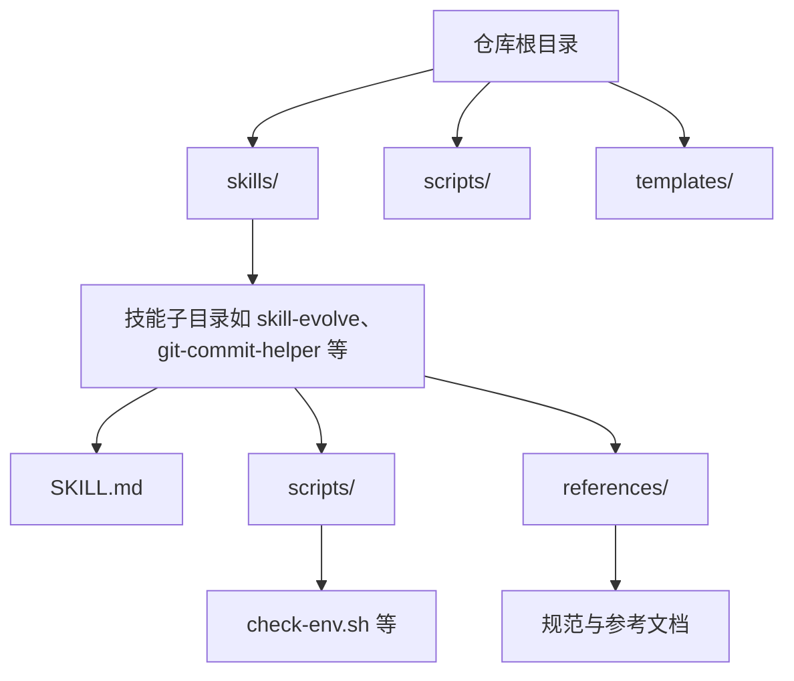
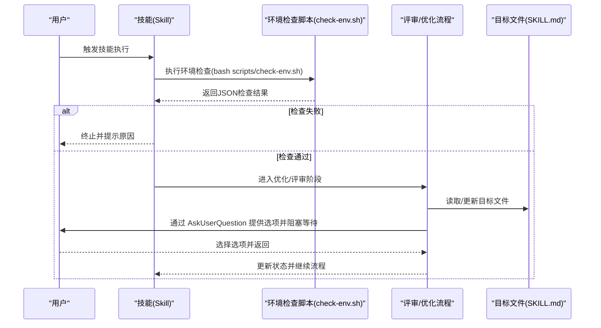
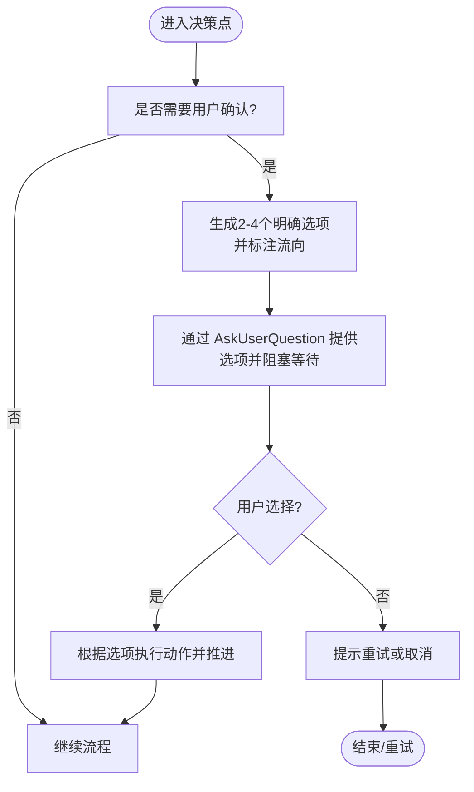
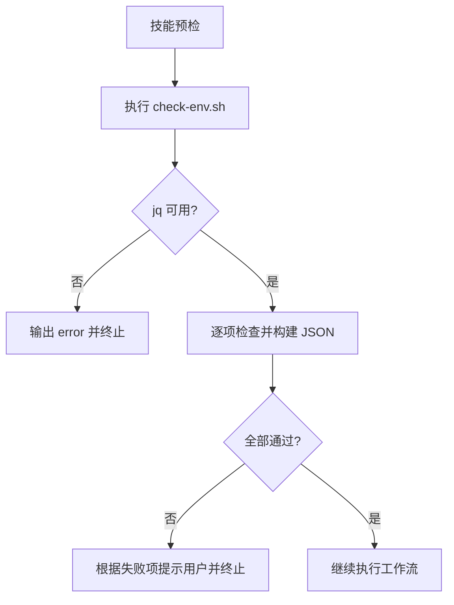
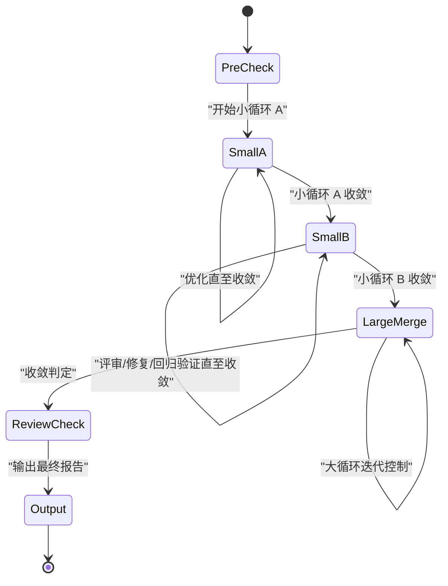
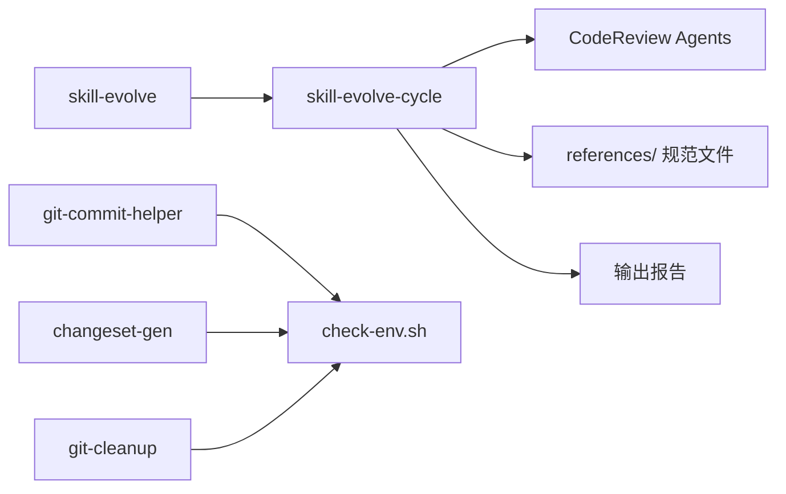

# API 参考文档

<cite>
**本文引用的文件**
- [README.md](file://README.md)
- [SKILL.md](file://skills/skill-evolve/SKILL.md)
- [SKILL.md](file://skills/skill-evolve-cycle/SKILL.md)
- [SKILL.md](file://skills/grill-me/SKILL.md)
- [SKILL.md](file://skills/grill-me-lite/SKILL.md)
- [SKILL.md](file://skills/git-commit-helper/SKILL.md)
- [check-env.sh](file://skills/git-commit-helper/scripts/check-env.sh)
- [check-env.sh](file://skills/changeset-gen/scripts/check-env.sh)
- [check-env.sh](file://skills/git-cleanup/scripts/check-env.sh)
- [error-handling.md](file://skills/git-branch-prep/references/error-handling.md)
- [migration-steps.md](file://skills/rush-to-nx/references/migration-steps.md)
- [SKILL.md](file://skills/skill-create/SKILL.md)
- [SKILL.md](file://skills/zoom-out/SKILL.md)
- [SKILL.md](file://skills/zoom-out-lite/SKILL.md)
- [SKILL.md](file://skills/zoom-out-lite/SKILL.md)
- [SKILL.md](file://skills/zoom-out-lite/SKILL.md)
- [SKILL.md](file://skills/zoom-out-lite/SKILL.md)
- [SKILL.md](file://skills/zoom-out-lite/SKILL.md)
- [SKILL.md](file://skills/zoom-out-lite/SKILL.md)
- [SKILL.md](file://skills/zoom-out-lite/SKILL.md)
- [SKILL.md](file://skills/zoom-out-lite/SKILL.md)
- [SKILL.md](file://skills/zoom-out-lite/SKILL.md)
- [SKILL.md](file://skills/zoom-out-lite/SKILL.md)
- [SKILL.md](file://skills/zoom-out-lite/SKILL.md)
- [SKILL.md](file://skills/zoom-out-lite/SKILL.md)
- [SKILL.md](file://skills/zoom-out-lite/SKILL.md)
- [SKILL.md](file://skills/zoom-out-lite/SKILL.md)
- [SKILL.md](file://skills/zoom-out-lite/SKILL.md)
- [SKILL.md](file://skills/zoom-out-lite/SKILL.md)
- [SKILL.md](file://skills/zoom-out-lite/SKILL.md)
- [SKILL.md](file://skills/zoom-out-lite/SKILL.md)
- [SKILL.md](file://skills/zoom-out-lite/SKILL.md)
- [SKILL.md](file://skills/zoom-out-lite/SKILL.md)
- [SKILL.md](file://skills/zoom-out-lite/SKILL.md)
- [SKILL.md](file://skills/zoom-out-lite/SKILL.md)
- [SKILL.md](file://skills/zoom-out-lite/SKILL.md)
- [SKILL.md](file://skills/zoom-out-lite/SKILL.md)
- [SKILL.md](file://skills/zoom-out-lite/SKILL.md)
- [SKILL.md](file://skills/zoom-out-lite/SKILL.md)
- [SKILL.md](file://skills/zoom-out-lite/SKILL.md)
- [SKILL.md](file://skills/zoom-out-lite/SKILL.md......)
</cite>

## 目录
1. [简介](#简介)
2. [项目结构](#项目结构)
3. [核心组件](#核心组件)
4. [架构总览](#架构总览)
5. [详细组件分析](#详细组件分析)
6. [依赖关系分析](#依赖关系分析)
7. [性能考量](#性能考量)
8. [故障排查指南](#故障排查指南)
9. [结论](#结论)
10. [附录](#附录)

## 简介
本参考文档面向 Skills Collection 的 API 使用者，系统性梳理以下主题：
- AskUserQuestion 工具的使用方法与参数规范，以及用户交互的标准接口
- 环境检查接口的实现细节与调用方式
- 技能生命周期的各阶段与状态转换
- 典型使用模式与代码示例路径
- 错误处理策略与异常场景应对
- 版本兼容性与迁移指南
- 为 API 使用者提供的技术参考与实用指导

## 项目结构
Skills Collection 将每个技能封装为一个自包含的目录，遵循 agent-skills 规范。技能目录通常包含：
- SKILL.md：技能的完整工作流、规则、示例与参考
- scripts/：可执行脚本（如环境检查）
- references/：规范与参考文档（按标准结构组织）
- assets/、tests/、schemas/：可选的资源、测试与数据链路定义

安装与使用可通过 npx skills 或脚本方式进行，支持通过环境变量覆盖安装路径。

图表来源
- [README.md:1-113](file://README.md#L1-L113)

章节来源
- [README.md:1-113](file://README.md#L1-L113)

## 核心组件
本节聚焦与 API 直接相关的关键能力与接口约定：
- AskUserQuestion 用户交互工具：用于在技能工作流中进行阻塞式、结构化的用户确认与选项选择
- 环境检查接口：通过 Bash 脚本统一输出 JSON，供技能在执行前进行环境一致性校验
- 技能生命周期：从预检、优化/评审、修复、合并回传到最终输出的循环演进过程

章节来源
- [SKILL.md:1-371](file://skills/skill-evolve/SKILL.md#L1-L371)
- [SKILL.md:1-308](file://skills/skill-evolve-cycle/SKILL.md#L1-L308)
- [SKILL.md:43-139](file://skills/git-commit-helper/SKILL.md#L43-L139)

## 架构总览
下图展示技能工作流中的关键交互点与控制流，重点体现 AskUserQuestion 的触发位置与环境检查的前置条件。

图表来源
- [SKILL.md:43-139](file://skills/git-commit-helper/SKILL.md#L43-L139)
- [check-env.sh:1-40](file://skills/git-commit-helper/scripts/check-env.sh#L1-L40)
- [SKILL.md:30-171](file://skills/skill-evolve/SKILL.md#L30-L171)
- [SKILL.md:45-150](file://skills/skill-evolve-cycle/SKILL.md#L45-L150)

## 详细组件分析

### AskUserQuestion 工具：使用方法与参数规范
- 触发时机
  - 在技能工作流的关键决策点，如缺少文件、引用缺失、结构不一致、复杂内容拆分、回传路由等场景
  - 在评审/优化流程中，对用户选择进行阻塞式确认
- 参数与行为
  - 必须使用标准交互格式：“通过 AskUserQuestion 提供选项，阻塞等待用户选择：”
  - 每个选项必须附带明确的后续动作标注（flow annotation），确保 AI 在用户选择后能唯一确定下一步行为
  - 单次 AskUserQuestion 最多提供 4 个选项；动态选项需标注生成依据与范围
  - 禁止使用纯文本追问替代 AskUserQuestion；禁止缺失选项描述；禁止一次性包含过多问题
- 交互完整性验证
  - 每个交互点均需符合“提供选项 + 阻塞等待 + 选项流向标注”的标准范式
  - 评审/优化流程中，AskUserQuestion 的触发不得被循环逻辑抑制

图表来源
- [SKILL.md:193-222](file://skills/skill-evolve/SKILL.md#L193-L222)
- [workflow-standard.md:854-993](file://skills/skill-evolve/references/workflow-standard.md#L854-L993)

章节来源
- [SKILL.md:193-222](file://skills/skill-evolve/SKILL.md#L193-L222)
- [SKILL.md:152-165](file://skills/skill-evolve-cycle/SKILL.md#L152-L165)
- [workflow-standard.md:854-993](file://skills/skill-evolve/references/workflow-standard.md#L854-L993)

### 环境检查接口：实现细节与调用方式
- 统一入口
  - 各技能在执行前调用 bash scripts/check-env.sh，脚本负责环境一致性检查并输出 JSON
- 输出规范
  - JSON 包含若干检查项（如 in-git-repo、git-version、has-remote、has-changes 等），每项包含 name、passed、以及必要时的版本/状态字段
  - 若依赖工具（如 jq）缺失，脚本会输出 error 字段并退出非零状态
- 典型检查项
  - Git 仓库状态与版本
  - 是否存在远程仓库
  - 是否存在可分析的变更（如暂存区/工作区/指定提交/分支范围）
- 调用方式
  - 技能在工作流的预检阶段执行该脚本，并解析其 JSON 输出，据此决定后续分支逻辑（如继续、终止、切换到对话 Diff 路径）

图表来源
- [check-env.sh:1-40](file://skills/git-commit-helper/scripts/check-env.sh#L1-L40)
- [check-env.sh:1-44](file://skills/changeset-gen/scripts/check-env.sh#L1-L44)
- [check-env.sh:1-54](file://skills/git-cleanup/scripts/check-env.sh#L1-L54)
- [SKILL.md:43-139](file://skills/git-commit-helper/SKILL.md#L43-L139)

章节来源
- [check-env.sh:1-40](file://skills/git-commit-helper/scripts/check-env.sh#L1-L40)
- [check-env.sh:1-44](file://skills/changeset-gen/scripts/check-env.sh#L1-L44)
- [check-env.sh:1-54](file://skills/git-cleanup/scripts/check-env.sh#L1-L54)
- [SKILL.md:43-139](file://skills/git-commit-helper/SKILL.md#L43-L139)

### 技能生命周期：阶段与状态转换
- 生命周期模型
  - 小循环 A（优化）：skill-evolve 对目标 SKILL.md 进行结构与内容优化，直至收敛（首次无新问题）
  - 小循环 B（评审）：Code Review Agent 并行评审，记录问题并修复，回归验证，直至收敛（首次无新问题）
  - 大循环（合并/回传）：满足收敛条件后，汇总问题并进行合并与回传（仅在特定仓库场景启用），随后进入下一大轮
- 关键收敛条件
  - 小循环 A 首轮无新问题
  - 小循环 B 首轮无新问题
  - 大循环收敛：上述两个条件同时满足
- 强制终止与报告
  - 当达到迭代上限或出现 Agent 不可用等异常时，流程强制终止并标注状态
  - 所有报告文件按命名规范保存至 docs/skill-evolve-cycle/{UTC-time}/ 目录

图表来源
- [SKILL.md:45-150](file://skills/skill-evolve-cycle/SKILL.md#L45-L150)
- [SKILL.md:152-186](file://skills/skill-evolve-cycle/SKILL.md#L152-L186)

章节来源
- [SKILL.md:1-308](file://skills/skill-evolve-cycle/SKILL.md#L1-L308)

### 使用模式与示例路径
- 系统性“压力测试”计划/设计
  - 使用 grill-me/grill-me-lite 技能，通过 AskUserQuestion 逐项提问，逐步达成共识
  - 示例对话展示了“红锁 + Watchdog + UUID 校验 + 唯一约束”的递进式确认
- 结构化优化与评审
  - skill-evolve 与 skill-evolve-cycle 提供完整的结构优化、评审、修复与回传闭环
  - 示例对话展示了从优化到评审再到最终输出的完整流程
- 环境检查前置
  - git-commit-helper 等技能在执行前统一进行环境检查，确保 Git 状态与依赖可用

章节来源
- [SKILL.md:113-161](file://skills/grill-me/SKILL.md#L113-L161)
- [SKILL.md:1-17](file://skills/grill-me-lite/SKILL.md#L1-L17)
- [SKILL.md:224-304](file://skills/skill-evolve/SKILL.md#L224-L304)
- [SKILL.md:187-279](file://skills/skill-evolve-cycle/SKILL.md#L187-L279)
- [SKILL.md:43-139](file://skills/git-commit-helper/SKILL.md#L43-L139)

## 依赖关系分析
- 技能间依赖
  - skill-evolve-cycle 调用 skill-evolve 执行优化，再通过 Code Review Agent 执行评审
  - 回传阶段依赖 skill-evolve 的规则与参考文档，确保一致性
- 外部依赖
  - jq：用于 JSON 解析与输出
  - Git：用于版本管理与变更分析
  - Husky/Commitlint/Lint-staged：用于提交钩子与代码质量保障（在 rush-to-nx 迁移场景中）

图表来源
- [SKILL.md:1-308](file://skills/skill-evolve-cycle/SKILL.md#L1-L308)
- [SKILL.md:1-371](file://skills/skill-evolve/SKILL.md#L1-L371)
- [check-env.sh:1-40](file://skills/git-commit-helper/scripts/check-env.sh#L1-L40)
- [check-env.sh:1-44](file://skills/changeset-gen/scripts/check-env.sh#L1-L44)
- [check-env.sh:1-54](file://skills/git-cleanup/scripts/check-env.sh#L1-L54)

章节来源
- [SKILL.md:1-308](file://skills/skill-evolve-cycle/SKILL.md#L1-L308)
- [SKILL.md:1-371](file://skills/skill-evolve/SKILL.md#L1-L371)

## 性能考量
- 评审阶段采用并行 Agent 评审，严格限制并行数量与评审视角，避免重复劳动与资源浪费
- 循环收敛阈值与迭代上限控制，防止无限循环导致资源耗尽
- 报告持久化与命名规范，便于后续审计与回溯

## 故障排查指南
- 环境检查失败
  - jq 缺失：脚本会输出 error 并终止，请先安装 jq
  - Git 状态异常：检查仓库状态、版本与远程配置
  - 无可用变更：在需要分析变更的技能中，确保暂存区/工作区/指定提交/分支范围内存在有效变更
- 评审 Agent 不可用
  - 流程会终止并标注“CodeReview Agent unavailable”，请检查环境与依赖
- 分支冲突
  - 在涉及 rebase 的场景中，冲突需人工解决后继续
- 回传路由问题
  - 回传目的地需通过 AskUserQuestion 确认，确保与现有规则一致

章节来源
- [check-env.sh:1-40](file://skills/git-commit-helper/scripts/check-env.sh#L1-L40)
- [check-env.sh:1-44](file://skills/changeset-gen/scripts/check-env.sh#L1-L44)
- [check-env.sh:1-54](file://skills/git-cleanup/scripts/check-env.sh#L1-L54)
- [error-handling.md:1-28](file://skills/git-branch-prep/references/error-handling.md#L1-L28)
- [SKILL.md:152-165](file://skills/skill-evolve-cycle/SKILL.md#L152-L165)

## 结论
Skills Collection 通过标准化的 AskUserQuestion 交互、统一的环境检查接口与清晰的技能生命周期，为技能的创建、优化、评审与回传提供了可靠的工程化支撑。遵循本文档的使用模式与最佳实践，可显著提升技能的一致性、可维护性与用户体验。

## 附录

### API 使用者最佳实践
- 在工作流中严格使用 AskUserQuestion，并为每个选项提供明确的流向标注
- 在执行前统一调用 check-env.sh 并解析 JSON 输出，按失败项提示用户或终止流程
- 在评审阶段保持并行 Agent 的数量与视角约束，确保评审质量与效率
- 使用收敛条件与迭代上限控制，避免无限循环

### 版本兼容性与迁移指南
- Rush 到 Nx 迁移
  - 参考 rush-to-nx 的迁移步骤，涵盖工作空间初始化、包结构迁移、Git hooks 与 CI/CD 更新
  - 注意 Node 版本与 pnpm 版本要求，确保依赖安装与任务执行稳定
- Changesets 与版本发布
  - 使用 Changesets 替代 Rush 的版本发布流程，遵循 changeset 配置与脚本约定
- 规范与参考
  - skill-evolve 的 references/ 目录提供目录结构、规则、评审清单等规范，确保技能一致性

章节来源
- [migration-steps.md:1-320](file://skills/rush-to-nx/references/migration-steps.md#L1-L320)
- [SKILL.md:359-371](file://skills/skill-evolve/SKILL.md#L359-L371)