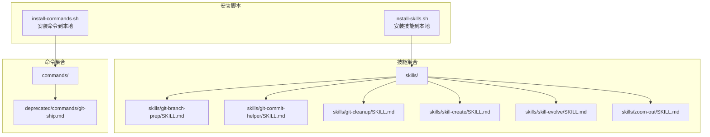
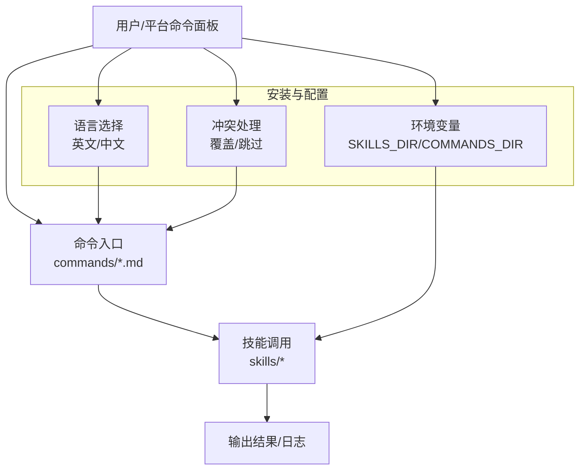
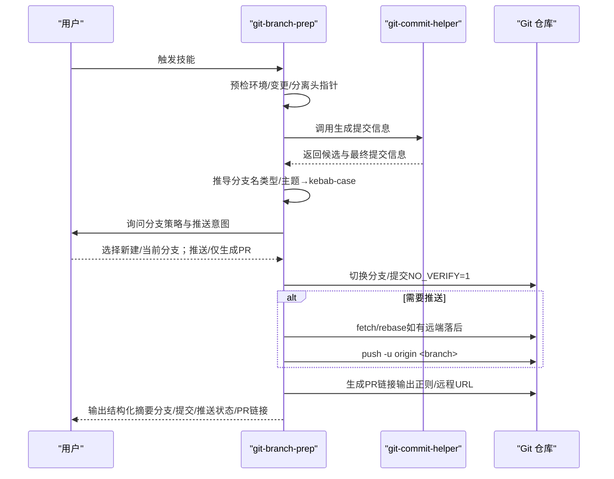
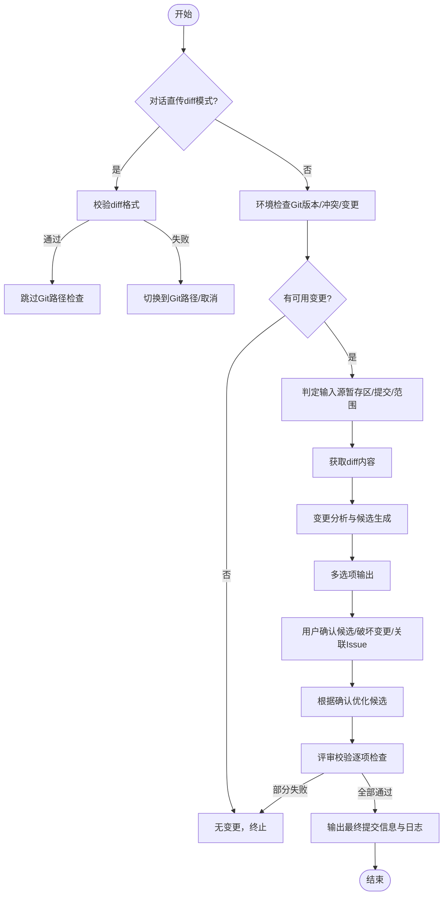
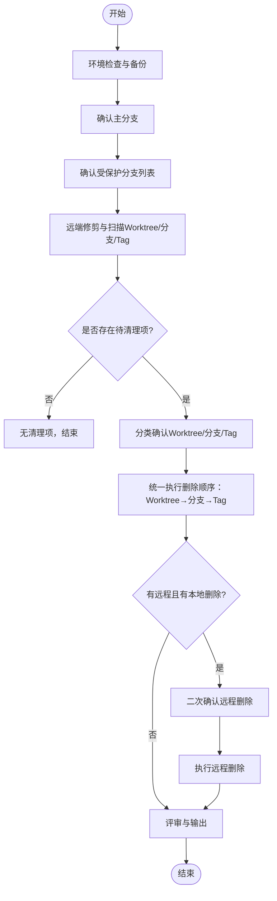
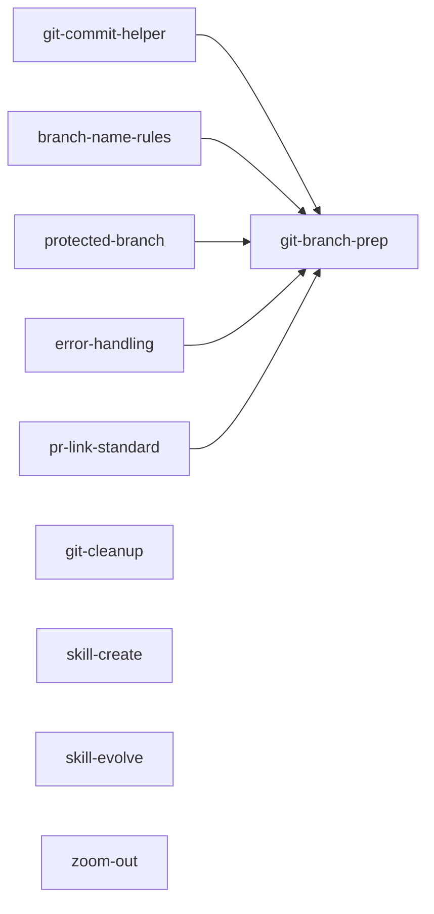

# 命令行工具

<cite>
**本文档引用的文件**
- [README.md](file://README.md)
- [install-commands.sh](file://scripts/install-commands.sh)
- [install-skills.sh](file://scripts/install-skills.sh)
- [git-branch-prep/SKILL.md](file://skills/git-branch-prep/SKILL.md)
- [git-branch-prep/branch-name-rules.md](file://skills/git-branch-prep/references/branch-name-rules.md)
- [git-branch-prep/protected-branch.md](file://skills/git-branch-prep/references/protected-branch.md)
- [git-branch-prep/error-handling.md](file://skills/git-branch-prep/references/error-handling.md)
- [git-branch-prep/pr-link-standard.md](file://skills/git-branch-prep/references/pr-link-standard.md)
- [git-commit-helper/SKILL.md](file://skills/git-commit-helper/SKILL.md)
- [git-cleanup/SKILL.md](file://skills/git-cleanup/SKILL.md)
- [skill-create/SKILL.md](file://skills/skill-create/SKILL.md)
- [skill-evolve/SKILL.md](file://skills/skill-evolve/SKILL.md)
- [zoom-out/SKILL.md](file://skills/zoom-out/SKILL.md)
- [git-ship.md（已弃用）](file://deprecated/commands/git-ship.md)
</cite>

## 目录
1. [简介](#简介)
2. [项目结构](#项目结构)
3. [核心组件](#核心组件)
4. [架构总览](#架构总览)
5. [详细组件分析](#详细组件分析)
6. [依赖分析](#依赖分析)
7. [性能考虑](#性能考虑)
8. [故障排除指南](#故障排除指南)
9. [结论](#结论)
10. [附录](#附录)

## 简介
本仓库提供一套“技能集合”（Skills Collection），以“技能”为最小可执行单元，围绕 Git 工作流与开发辅助场景构建。命令行工具并非直接暴露 CLI 可执行程序，而是通过以下方式提供能力：
- 技能（Skill）：每个技能是一个自包含的目录，遵循统一规范，描述其目标、前置条件、工作流、规则、示例与参考。
- 命令（Command）：以 .md 文件形式存在的可复用命令片段，可通过特定平台的命令面板调用。
- 安装脚本：提供一键安装技能或命令到本地目录的能力，支持语言选择与冲突处理。

本文件面向不同技术背景的用户，系统性讲解命令行工具的设计理念、使用方法、执行流程、配置选项与输出格式，并给出与技能系统的集成关系、最佳实践与故障排除建议。

## 项目结构
仓库采用“按技能/命令分层”的组织方式：
- skills：存放各类技能的实现与参考文档
- commands：存放可复用命令片段（.md）
- scripts：安装脚本，用于将技能或命令安装到本地目录
- deprecated：已弃用的技能或命令
- templates：模板文件（如 SKILL 模板）

图表来源
- [README.md:75-108](file://README.md#L75-L108)
- [install-skills.sh:1-146](file://scripts/install-skills.sh#L1-L146)
- [install-commands.sh:1-145](file://scripts/install-commands.sh#L1-L145)

章节来源
- [README.md:1-113](file://README.md#L1-L113)

## 核心组件
- 技能（Skill）：以 SKILL.md 为核心，定义“做什么、何时触发、如何做、规则与检查项”。典型技能包括：
  - git-branch-prep：基于变更生成提交信息、推导分支名、确认分支策略与推送意图、最终生成 PR 链接
  - git-commit-helper：根据变更智能生成符合约定式提交规范的提交信息
  - git-cleanup：扫描并清理过期 Worktree/分支/Tag，支持两阶段删除（本地→远程）
  - skill-create：按标准模板创建新技能
  - skill-evolve：对现有技能进行结构优化、拆分参考文档、统一格式
  - zoom-out：从更高抽象层级生成模块地图，帮助理解代码在整体架构中的位置
- 命令（Command）：以 .md 形式存在，可在平台命令面板中调用；当前仓库中已弃用 git-ship 命令，推荐使用 git-branch-prep 技能替代
- 安装脚本：install-skills.sh 与 install-commands.sh 提供环境变量覆盖目标目录、语言选择、冲突处理与安装统计

章节来源
- [README.md:75-108](file://README.md#L75-L108)
- [git-branch-prep/SKILL.md:1-276](file://skills/git-branch-prep/SKILL.md#L1-L276)
- [git-commit-helper/SKILL.md:1-296](file://skills/git-commit-helper/SKILL.md#L1-L296)
- [git-cleanup/SKILL.md:1-453](file://skills/git-cleanup/SKILL.md#L1-L453)
- [skill-create/SKILL.md:1-447](file://skills/skill-create/SKILL.md#L1-L447)
- [skill-evolve/SKILL.md:1-371](file://skills/skill-evolve/SKILL.md#L1-L371)
- [zoom-out/SKILL.md:1-190](file://skills/zoom-out/SKILL.md#L1-L190)
- [git-ship.md（已弃用）:1-40](file://deprecated/commands/git-ship.md#L1-L40)

## 架构总览
命令行工具与技能系统的集成关系如下：
- 平台通过命令面板加载 commands/ 下的 .md 文件作为可执行命令入口
- 技能通过 scripts/install-skills.sh 安装到本地目录，供平台按需调用
- 各技能内部通过“预检→工作流→评审→输出”的结构化流程，保证一致性与可验证性
- 安装脚本支持语言选择（英文/中文）、冲突覆盖提示与清理逻辑

图表来源
- [README.md:75-108](file://README.md#L75-L108)
- [install-commands.sh:58-76](file://scripts/install-commands.sh#L58-L76)
- [install-skills.sh:58-76](file://scripts/install-skills.sh#L58-L76)

## 详细组件分析

### 组件一：git-branch-prep（分支准备）
设计理念：将“生成提交信息→推导分支名→确认分支与推送→生成 PR 链接”的完整链路自动化，同时严格遵循约定式提交与分支命名规范，降低人为错误风险。

- 执行流程
  - 预检：环境检查（Git 版本、冲突状态、变更存在性等），必要时处理分离头指针（detached HEAD）
  - 生成提交信息：调用 git-commit-helper 完整流程，阻塞等待用户决策点
  - 推导分支名：依据提交信息提取类型与主题，转换为 kebab-case 分支名
  - 用户决策：在受保护分支与非受保护分支下分别提供“新建分支/在当前分支提交”的选项；决定是否推送
  - 执行与推送：在需要时先同步远端再推送，处理 rebase 冲突
  - 生成 PR 链接：优先从推送输出正则匹配，否则基于远程 URL 动态构建
  - 评审与输出：逐项校验规则并通过后输出结构化摘要

图表来源
- [git-branch-prep/SKILL.md:24-95](file://skills/git-branch-prep/SKILL.md#L24-L95)
- [git-commit-helper/SKILL.md:43-139](file://skills/git-commit-helper/SKILL.md#L43-L139)
- [git-branch-prep/branch-name-rules.md:1-41](file://skills/git-branch-prep/references/branch-name-rules.md#L1-L41)
- [git-branch-prep/pr-link-standard.md:1-39](file://skills/git-branch-prep/references/pr-link-standard.md#L1-L39)
- [git-branch-prep/error-handling.md:1-28](file://skills/git-branch-prep/references/error-handling.md#L1-L28)

章节来源
- [git-branch-prep/SKILL.md:1-276](file://skills/git-branch-prep/SKILL.md#L1-L276)
- [git-branch-prep/branch-name-rules.md:1-41](file://skills/git-branch-prep/references/branch-name-rules.md#L1-L41)
- [git-branch-prep/protected-branch.md:1-26](file://skills/git-branch-prep/references/protected-branch.md#L1-L26)
- [git-branch-prep/error-handling.md:1-28](file://skills/git-branch-prep/references/error-handling.md#L1-L28)
- [git-branch-prep/pr-link-standard.md:1-39](file://skills/git-branch-prep/references/pr-link-standard.md#L1-L39)

### 组件二：git-commit-helper（提交信息助手）
设计理念：以“变更分析→候选生成→交互确认→评审校验→最终输出”的闭环，确保生成的提交信息符合约定式提交规范且简洁准确。

- 关键流程
  - 预检：判断是否处于对话直传 diff 模式；若否，则执行环境检查与变更可用性检查
  - 输入源判定：支持暂存区、单次提交、分支范围三种输入
  - 变更分析：按文件类型分类，生成变更概览与候选
  - 多选项输出：提供 1~3 个合理候选，自动优化长度与格式
  - 用户确认：交互确认候选、破坏性变更标记、Issue 关联
  - 评审与输出：逐项校验并通过后输出最终提交信息与结构化日志

图表来源
- [git-commit-helper/SKILL.md:43-139](file://skills/git-commit-helper/SKILL.md#L43-L139)

章节来源
- [git-commit-helper/SKILL.md:1-296](file://skills/git-commit-helper/SKILL.md#L1-L296)

### 组件三：git-cleanup（Git 清理）
设计理念：以“全面扫描→一次性确认→统一删除→二次确认远程删除”的两阶段流程，兼顾安全性与效率，自动备份并在异常时提供恢复指引。

- 关键流程
  - 预检：环境检查、备份创建、主分支与受保护分支确认
  - 全面扫描：先远端修剪，再扫描 Worktree/分支/Tag，输出三类 JSON
  - 分类确认：分别确认 Worktree/分支/Tag 的删除清单
  - 统一执行：按 Worktree→分支→Tag 的顺序执行删除，记录成功/跳过/失败
  - 远程删除：在二次确认后执行远程删除，输出最终报告
  - 异常处理：出现异常时输出恢复指引与已完成操作汇总

图表来源
- [git-cleanup/SKILL.md:36-171](file://skills/git-cleanup/SKILL.md#L36-L171)

章节来源
- [git-cleanup/SKILL.md:1-453](file://skills/git-cleanup/SKILL.md#L1-L453)

### 组件四：skill-create（技能创建）
设计理念：以“模板驱动 + 交互确认”的方式，从零创建一个符合标准的技能，确保元数据、结构、格式与行为均满足规范。

- 关键流程
  - 预检：检查模板与目录结构文件是否存在
  - 收集需求：通过交互确定技能目标、是否需要脚本/参考/测试等
  - 创建目录结构：按标准模板创建 SKILL.md 与辅助目录
  - 草拟 SKILL.md：按模板组织内容，必要时拆分至 references/
  - 添加辅助目录：按需创建 references/scripts/assets/schemas/tests
  - 用户复审：根据反馈修订，最多三次修改
  - 评审与输出：对照 Review List 逐项校验，输出结构化结果

章节来源
- [skill-create/SKILL.md:1-447](file://skills/skill-create/SKILL.md#L1-L447)

### 组件五：skill-evolve（技能演进）
设计理念：对现有技能进行结构优化、内容精简与参考文档拆分，提升可维护性与一致性。

- 关键流程
  - 预检：校验目标 SKILL.md、模板与 references/ 文件完整性
  - 元数据结构：修正 name/description 等元数据
  - 结构对齐：补齐缺失的标准章节，调整顺序，迁移非标准内容至 references/
  - 格式标准化：统一标点、简化文本、替换抽象变量占位符
  - 内容精简：控制 SKILL.md 行数，必要时迁移到 references/
  - 参考拆分：将 REFERENCE.md 拆分为多个文件并更新链接
  - 评审与输出：对照 Review List 校验，输出优化对比与完成通知

章节来源
- [skill-evolve/SKILL.md:1-371](file://skills/skill-evolve/SKILL.md#L1-L371)

### 组件六：zoom-out（宏观视角）
设计理念：在用户不熟悉某段代码时，向上抽象一层，生成模块地图与调用关系，帮助理解其在整个架构中的定位。

- 关键流程
  - 预检：确认目标代码可访问，尝试加载项目术语表
  - 理解目标：识别模块与架构角色
  - 分析关系：搜索调用链，标注模块层级
  - 生成地图：结构化输出模块地图（最多重试3次）
  - 评审与输出：对照 Review List 校验，输出结构化摘要

章节来源
- [zoom-out/SKILL.md:1-190](file://skills/zoom-out/SKILL.md#L1-L190)

### 组件七：git-ship（已弃用命令）
设计理念：早期的“一键分支/提交/推送/生成 PR”的命令，现已弃用，推荐使用 git-branch-prep 技能替代。

章节来源
- [git-ship.md（已弃用）:1-40](file://deprecated/commands/git-ship.md#L1-L40)

## 依赖分析
- 技能间依赖
  - git-branch-prep 依赖 git-commit-helper 生成提交信息
  - 各技能共享 references/ 下的通用规则与标准（分支命名、受保护分支、错误处理、PR 链接）
- 安装脚本依赖
  - install-skills.sh 与 install-commands.sh 支持环境变量覆盖目标目录（SKILLS_DIR/COMMANDS_DIR）
  - 语言选择：英文/中文（commands.zh-CN 与 skills.zh-CN）
  - 冲突处理：覆盖/跳过策略，安装统计输出

图表来源
- [git-branch-prep/SKILL.md:24-95](file://skills/git-branch-prep/SKILL.md#L24-L95)
- [git-commit-helper/SKILL.md:43-139](file://skills/git-commit-helper/SKILL.md#L43-L139)
- [git-branch-prep/branch-name-rules.md:1-41](file://skills/git-branch-prep/references/branch-name-rules.md#L1-L41)
- [git-branch-prep/protected-branch.md:1-26](file://skills/git-branch-prep/references/protected-branch.md#L1-L26)
- [git-branch-prep/error-handling.md:1-28](file://skills/git-branch-prep/references/error-handling.md#L1-L28)
- [git-branch-prep/pr-link-standard.md:1-39](file://skills/git-branch-prep/references/pr-link-standard.md#L1-L39)

章节来源
- [README.md:75-108](file://README.md#L75-L108)

## 性能考虑
- 安装脚本
  - 使用浅克隆（depth=1）减少网络与磁盘占用
  - 语言选择与冲突处理避免重复安装，提高效率
- 技能执行
  - 预检阶段尽早失败，减少无效计算
  - 删除/推送等高风险操作采用两阶段流程与备份机制，降低失败成本
- 输出格式
  - 结构化表格与清单便于机器解析与人工阅读

## 故障排除指南
- 安装相关
  - 目标目录权限不足：使用环境变量覆盖默认目录（SKILLS_DIR/COMMANDS_DIR）
  - 语言选择错误：重新运行安装脚本并选择正确语言
  - 冲突覆盖：安装前会列出将被覆盖的文件，确认后执行覆盖
- git-branch-prep
  - 分支已存在：脚本会尝试新建分支或切换已有分支
  - 无变更可分析：请先添加/暂存变更
  - rebase 冲突：按提示解决冲突后继续 rebase
  - PR 链接无法提取：回退到基于远程 URL 的动态构建
- git-cleanup
  - 脏工作树（有未提交更改）：自动跳过，不可删除
  - 当前分支非受保护分支：请在受保护分支上运行
  - 远程删除失败：检查网络连接后重试
- skill-create/skill-evolve
  - 缺失模板/目录结构文件：先安装 skill-evolve 或修复依赖
  - 评审失败：根据失败项逐项修正并重新评审

章节来源
- [install-skills.sh:96-118](file://scripts/install-skills.sh#L96-L118)
- [install-commands.sh:96-118](file://scripts/install-commands.sh#L96-L118)
- [git-branch-prep/error-handling.md:1-28](file://skills/git-branch-prep/references/error-handling.md#L1-L28)
- [git-cleanup/SKILL.md:148-154](file://skills/git-cleanup/SKILL.md#L148-L154)
- [skill-create/SKILL.md:25-37](file://skills/skill-create/SKILL.md#L25-L37)
- [skill-evolve/SKILL.md:32-50](file://skills/skill-evolve/SKILL.md#L32-L50)

## 结论
本仓库通过“技能”与“命令”的组合，提供了从 Git 工作流到技能生命周期管理的完整能力体系。命令行工具以安装脚本与技能规范为核心，辅以严格的评审与输出标准，既适合新手快速上手，也能满足高级用户的定制化需求。建议优先使用 git-branch-prep 替代已弃用的 git-ship 命令，并结合 skill-create/skill-evolve 保持技能质量与可维护性。

## 附录
- 使用示例与最佳实践
  - 使用 npx skills 安装技能集合，或通过安装脚本一键部署
  - 在平台命令面板中调用 commands/*.md 命令，或在技能环境中执行对应 SKILL.md
  - 对于复杂技能，建议先使用 skill-create 创建，再用 skill-evolve 优化
- 与平台的集成
  - 将安装后的技能目录加入平台索引，重启平台以加载最新技能
  - 命令面板加载 commands/ 下的 .md 文件，支持语言切换与冲突处理

章节来源
- [README.md:22-108](file://README.md#L22-L108)
- [install-skills.sh:136-145](file://scripts/install-skills.sh#L136-L145)
- [install-commands.sh:136-145](file://scripts/install-commands.sh#L136-L145)