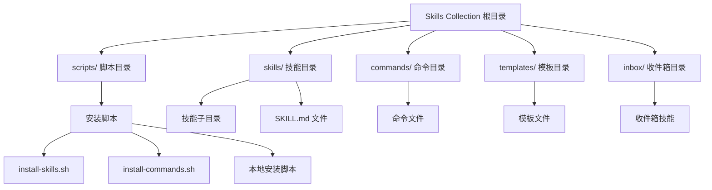
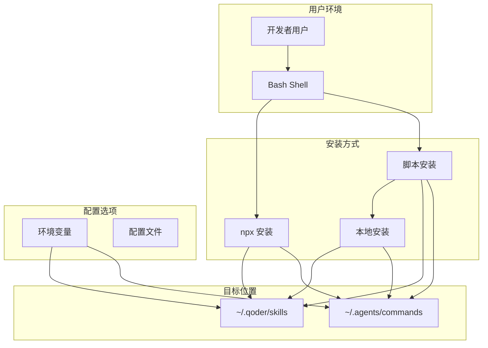
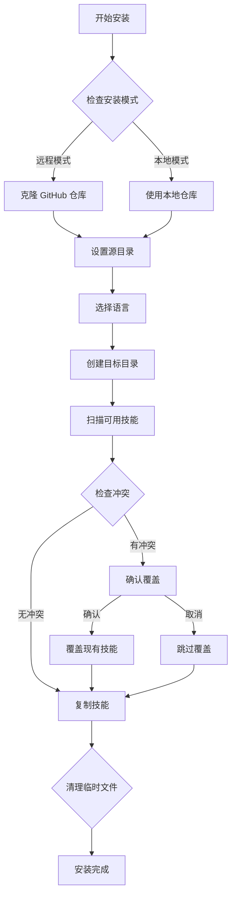
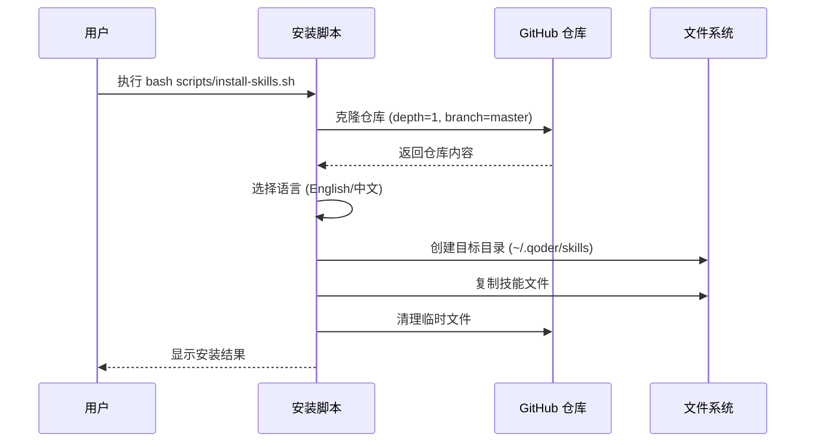
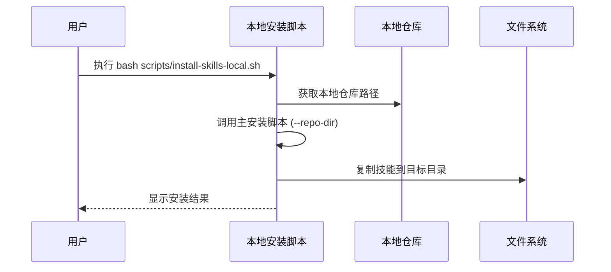
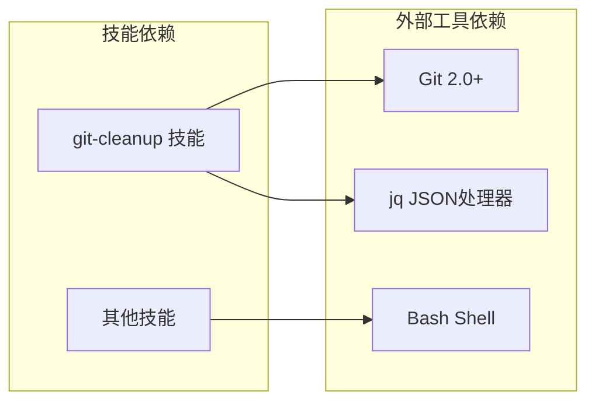
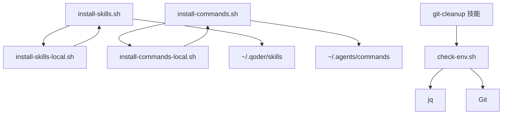

# 安装与配置

<cite>
**本文档引用的文件**
- [README.md](file://README.md)
- [install-skills.sh](file://scripts/install-skills.sh)
- [install-commands.sh](file://scripts/install-commands.sh)
- [install-skills-local.sh](file://scripts/install-skills-local.sh)
- [install-commands-local.sh](file://scripts/install-commands-local.sh)
- [check-env.sh](file://skills/git-cleanup/scripts/check-env.sh)
- [git-ship.md](file://deprecated/commands/git-ship.md)
- [zoom-out-lite/SKILL.md](file://skills/zoom-out-lite/SKILL.md)
</cite>

## 目录
1. [简介](#简介)
2. [项目结构](#项目结构)
3. [核心组件](#核心组件)
4. [架构概览](#架构概览)
5. [详细组件分析](#详细组件分析)
6. [依赖关系分析](#依赖关系分析)
7. [性能考虑](#性能考虑)
8. [故障排除指南](#故障排除指南)
9. [结论](#结论)

## 简介

Skills Collection 是一个基于 agent-skills 规范的技能集合项目，提供了多个预构建的 AI 技能和可重用的命令。该项目支持通过多种方式进行安装，包括 npx 命令安装和脚本安装方式，并提供了灵活的配置选项来满足不同用户的需求。

该项目的核心价值在于：
- 提供完整的 AI 技能生态系统
- 支持多语言（英语和中文）
- 灵活的安装和配置选项
- 丰富的示例和最佳实践

## 项目结构

项目采用模块化设计，主要包含以下核心目录结构：



**图表来源**
- [README.md:1-113](file://README.md#L1-L113)
- [install-skills.sh:1-146](file://scripts/install-skills.sh#L1-L146)

**章节来源**
- [README.md:1-113](file://README.md#L1-L113)

## 核心组件

### 技能系统

Skills Collection 包含多个经过精心设计的 AI 技能，每个技能都遵循统一的规范和标准：

| 技能名称 | 描述 | 主要功能 |
|----------|------|----------|
| changeset-gen | 分析受影响的包并自动生成 pnpm changeset 版本文件 | 自动版本管理 |
| git-branch-prep | 通过 git-commit-helper 生成提交消息 -> 提取分支名 -> 确认分支并推送 -> 创建 PR 链接 | Git 工作流自动化 |
| git-cleanup | 清理 Git 仓库中的陈旧工作树、分支和标签 | 仓库维护 |
| git-commit-helper | 按照约定式提交规范智能生成 Git 提交消息 | 提交消息优化 |
| grill-me | 连续测试计划和设计，遍历决策树的每个分支 | 设计验证 |
| rush-to-nx | 将 Rush.js 单体仓库迁移到 Nx + pnpm workspace + Changesets | 项目迁移 |

### 命令系统

项目还提供了可重用的 Qoder 命令，通过 Markdown 文件实现：

| 命令名称 | 描述 | 使用场景 |
|----------|------|----------|
| review-and-fix-cycle | 对当前代码变更执行代码审查，输出审查日志，修复问题并重新审查直到收敛 | 代码质量保证 |

**章节来源**
- [README.md:7-21](file://README.md#L7-L21)
- [README.md:75-88](file://README.md#L75-L88)

## 架构概览

项目采用分层架构设计，支持多种安装和配置模式：



**图表来源**
- [README.md:22-64](file://README.md#L22-L64)
- [README.md:89-108](file://README.md#L89-L108)

## 详细组件分析

### 安装脚本架构

安装脚本采用统一的架构设计，支持远程和本地两种安装模式：



**图表来源**
- [install-skills.sh:39-145](file://scripts/install-skills.sh#L39-L145)
- [install-commands.sh:39-144](file://scripts/install-commands.sh#L39-L144)

### 环境变量配置

项目支持灵活的环境变量配置，主要涉及以下关键变量：

#### SKILLS_DIR 环境变量

用于指定技能安装的目标目录，默认值为 `~/.qoder/skills`：

```bash
# 设置自定义技能目录
export SKILLS_DIR=/path/to/custom/skills
```

#### COMMANDS_DIR 环境变量

用于指定命令安装的目标目录，默认值为 `~/.agents/commands`：

```bash
# 设置自定义命令目录
export COMMANDS_DIR=/path/to/custom/commands
```

**章节来源**
- [README.md:47](file://README.md#L47)
- [README.md:91](file://README.md#L91)
- [install-skills.sh:16](file://scripts/install-skills.sh#L16)
- [install-commands.sh:16](file://scripts/install-commands.sh#L16)

### 脚本安装流程

#### 远程安装流程

远程安装通过网络直接从 GitHub 获取最新代码：



**图表来源**
- [install-skills.sh:48-56](file://scripts/install-skills.sh#L48-L56)
- [install-skills.sh:78-82](file://scripts/install-skills.sh#L78-L82)
- [install-skills.sh:120-134](file://scripts/install-skills.sh#L120-L134)

#### 本地安装流程

本地安装使用当前仓库的本地副本，无需网络连接：



**图表来源**
- [install-skills-local.sh:12-15](file://scripts/install-skills-local.sh#L12-L15)
- [install-skills.sh:42-56](file://scripts/install-skills.sh#L42-L56)

## 依赖关系分析

### 外部依赖

项目对外部工具的依赖关系如下：



**图表来源**
- [check-env.sh:8](file://skills/git-cleanup/scripts/check-env.sh#L8)
- [check-env.sh:27](file://skills/git-cleanup/scripts/check-env.sh#L27)

### 内部依赖关系

项目内部组件之间的依赖关系：



**图表来源**
- [install-skills-local.sh:15](file://scripts/install-skills-local.sh#L15)
- [install-commands-local.sh:15](file://scripts/install-commands-local.sh#L15)
- [check-env.sh:1](file://skills/git-cleanup/scripts/check-env.sh#L1)

**章节来源**
- [check-env.sh:1-67](file://skills/git-cleanup/scripts/check-env.sh#L1-L67)

## 性能考虑

### 安装性能优化

1. **浅克隆优化**: 使用 `--depth 1` 参数进行浅克隆，减少下载数据量
2. **并行处理**: 技能复制过程按顺序执行，但可以并行处理多个技能
3. **缓存机制**: 本地安装避免重复网络请求
4. **增量更新**: 支持跳过已存在的技能文件

### 运行时性能

1. **内存使用**: 技能文件通常较小，内存占用有限
2. **磁盘空间**: 每个技能约几 KB 到几十 KB 不等
3. **启动时间**: 通过合理的目录结构和索引机制保证快速加载

## 故障排除指南

### 常见安装问题

#### 权限问题

**问题**: 安装过程中出现权限错误

**解决方案**:
```bash
# 检查目标目录权限
ls -la ~/.qoder/

# 修改目录权限
chmod 755 ~/.qoder/
chmod 755 ~/.agents/
```

#### 网络连接问题

**问题**: 远程安装无法连接到 GitHub

**解决方案**:
```bash
# 检查网络连接
ping github.com

# 使用代理（如果需要）
export http_proxy=http://proxy:port
export https_proxy=http://proxy:port

# 切换到本地安装
bash scripts/install-skills-local.sh
```

#### 磁盘空间不足

**问题**: 安装过程中提示磁盘空间不足

**解决方案**:
```bash
# 检查磁盘空间
df -h ~

# 清理不必要的文件
rm -rf /tmp/hz-9-skills
```

### 环境变量配置问题

#### 目录不存在

**问题**: 指定的 SKILLS_DIR 或 COMMANDS_DIR 不存在

**解决方案**:
```bash
# 创建目标目录
mkdir -p ~/.qoder/skills
mkdir -p ~/.agents/commands

# 或者使用环境变量
export SKILLS_DIR=/custom/path/skills
export COMMANDS_DIR=/custom/path/commands
```

#### 权限不足

**问题**: 目标目录没有写入权限

**解决方案**:
```bash
# 授予写入权限
sudo chown -R $(whoami) ~/.qoder/
sudo chgrp -R $(whoami) ~/.qoder/

sudo chown -R $(whoami) ~/.agents/
sudo chgrp -R $(whoami) ~/.agents/
```

### 技能运行时问题

#### Git 环境检查失败

**问题**: git-cleanup 技能运行时报错

**解决方案**:
```bash
# 检查 Git 版本
git --version

# 安装 jq 工具
# Ubuntu/Debian
sudo apt-get install jq

# CentOS/RHEL
sudo yum install jq

# macOS
brew install jq

# 重新运行环境检查
./skills/git-cleanup/scripts/check-env.sh
```

#### 语言选择问题

**问题**: 安装时语言选择不正确

**解决方案**:
```bash
# 重新运行安装脚本
bash scripts/install-skills.sh

# 在交互界面中选择正确的语言
# 1) English
# 2) 中文
```

### 调试技巧

1. **启用调试输出**: 在安装脚本中添加 `set -x` 来查看详细执行过程
2. **检查文件完整性**: 验证下载的文件是否完整
3. **查看日志**: 检查系统日志和安装脚本输出
4. **网络诊断**: 使用 `curl` 和 `wget` 测试网络连接

**章节来源**
- [check-env.sh:8](file://skills/git-cleanup/scripts/check-env.sh#L8)
- [check-env.sh:17](file://skills/git-cleanup/scripts/check-env.sh#L17)

## 结论

Skills Collection 项目提供了完整且灵活的安装和配置方案，支持多种使用场景和需求。通过合理配置环境变量和选择合适的安装方式，用户可以轻松地在本地环境中部署和使用这些 AI 技能。

关键优势包括：
- **多安装方式**: 支持 npx 命令安装和脚本安装
- **灵活配置**: 通过环境变量定制安装路径
- **本地支持**: 支持离线本地安装
- **错误处理**: 完善的错误检测和用户提示
- **多语言支持**: 同时支持英语和中文界面

建议用户根据具体需求选择最适合的安装方式，并在安装后进行适当的配置以获得最佳使用体验。