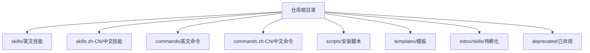
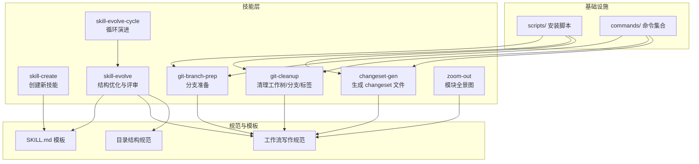
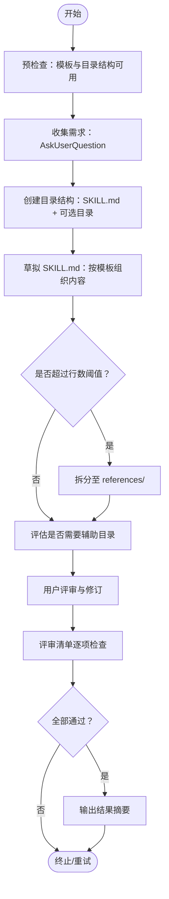
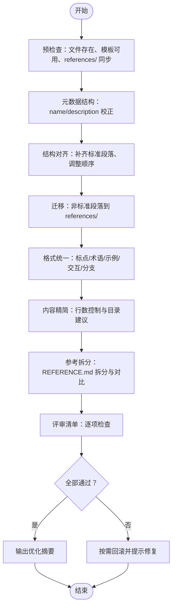
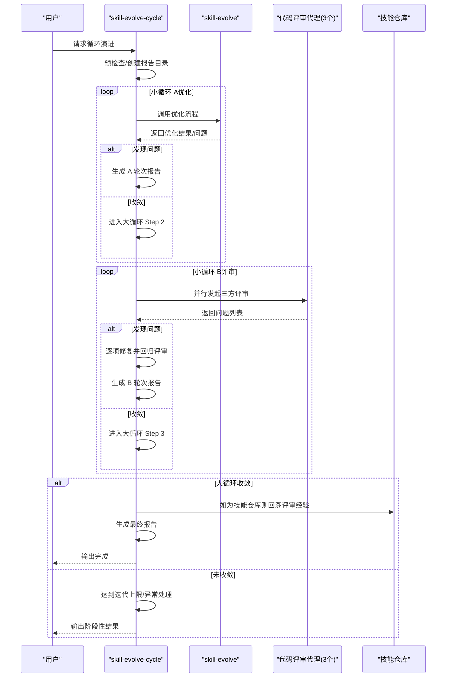
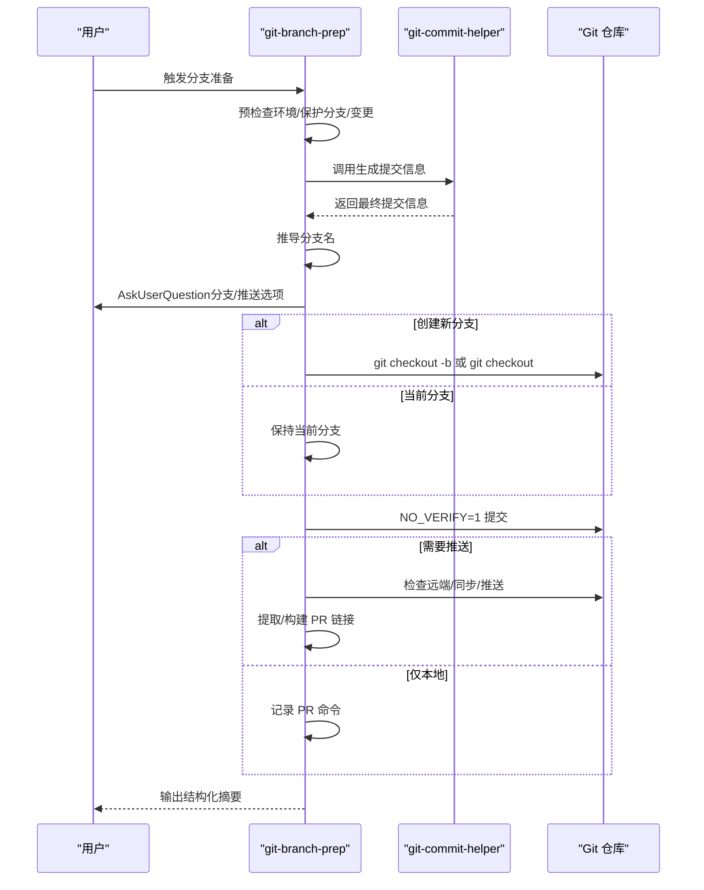
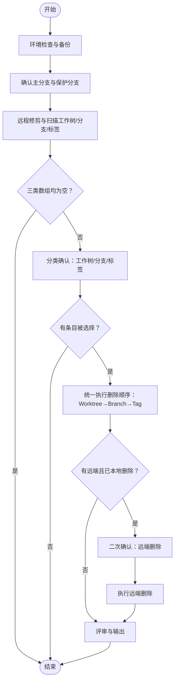
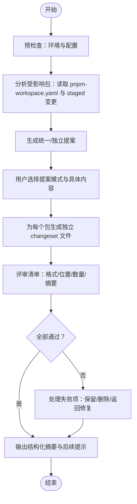
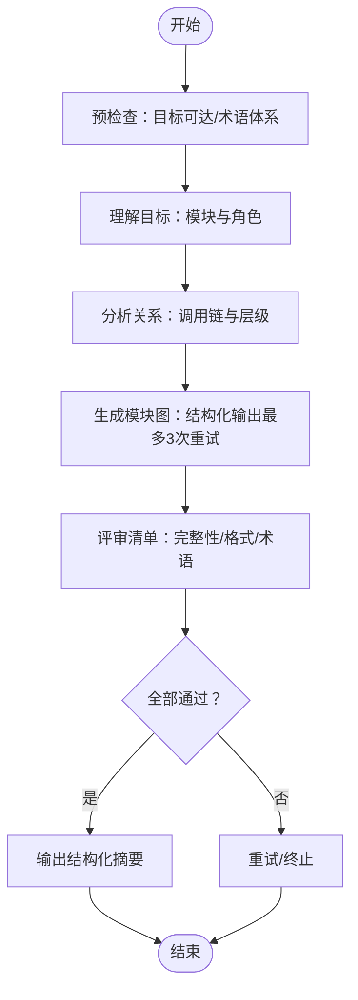
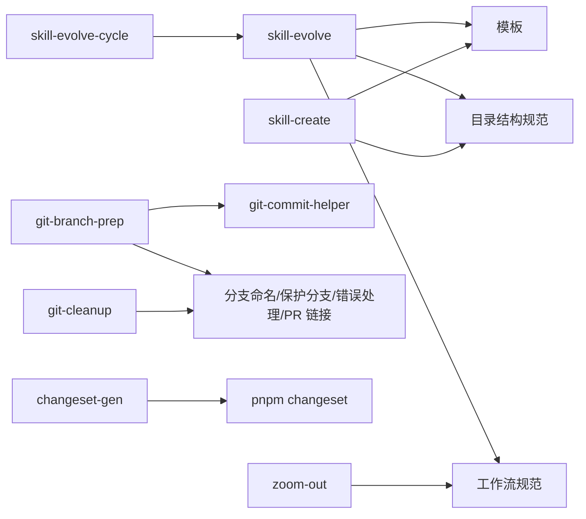

# 开发者指南

<cite>
**本文档引用的文件**
- [README.md](file://README.md)
- [README.zh-CN.md](file://README.zh-CN.md)
- [install-skills.sh](file://scripts/install-skills.sh)
- [install-commands.sh](file://scripts/install-commands.sh)
- [SKILL.md（模板）](file://templates/SKILL.md)
- [SKILL.md（skill-evolve 模板）](file://skills/skill-evolve/template.md)
- [工作流写作规范](file://skills/skill-evolve/references/workflow-standard.md)
- [目录结构规范](file://skills/skill-evolve/references/directory-structure.md)
- [SKILL.md（skill-create）](file://skills/skill-create/SKILL.md)
- [SKILL.md（skill-evolve）](file://skills/skill-evolve/SKILL.md)
- [SKILL.md（skill-evolve-cycle）](file://skills/skill-evolve-cycle/SKILL.md)
- [SKILL.md（git-branch-prep）](file://skills/git-branch-prep/SKILL.md)
- [SKILL.md（git-cleanup）](file://skills/git-cleanup/SKILL.md)
- [SKILL.md（changeset-gen）](file://skills/changeset-gen/SKILL.md)
- [SKILL.md（zoom-out）](file://skills/zoom-out/SKILL.md)
</cite>

## 目录
1. [简介](#简介)
2. [项目结构](#项目结构)
3. [核心组件](#核心组件)
4. [架构总览](#架构总览)
5. [详细组件分析](#详细组件分析)
6. [依赖关系分析](#依赖关系分析)
7. [性能考虑](#性能考虑)
8. [故障排除指南](#故障排除指南)
9. [结论](#结论)
10. [附录](#附录)

## 简介
Skills Collection 是一组遵循 agent-skills 规范的“技能”集合，每个技能都是一个自包含的目录，内含 SKILL.md 核心说明与可选的 scripts/、references/、assets/、tests/、schemas/ 等辅助目录。项目提供统一的安装与管理方式，并通过标准化的模板与规范确保技能的一致性、可维护性与可演进性。

- 项目目标：以“技能”为最小交付单元，提供可复用、可演进、可验证的工程化能力。
- 核心理念：以 SKILL.md 为中心，配合 references/ 规范文件与 scripts/ 实现脚本化执行，形成“文档即规范、规范即流程”的闭环。

**章节来源**
- [README.md:1-113](file://README.md#L1-L113)
- [README.zh-CN.md:1-113](file://README.zh-CN.md#L1-L113)

## 项目结构
仓库采用按功能域划分的目录组织方式：
- skills/：技能集合（英文），包含具体可执行的技能目录
- skills.zh-CN/：技能集合（中文），与 skills/ 对应
- commands/ 与 commands.zh-CN/：可复用命令集合（.md 文件，供命令面板调用）
- scripts/：安装脚本（安装技能与命令）
- templates/：SKILL.md 标准模板
- inbox/skills/：待孵化或草稿类技能
- deprecated/：已弃用的技能与命令

**图表来源**
- [README.md:5-21](file://README.md#L5-L21)
- [README.zh-CN.md:5-21](file://README.zh-CN.md#L5-L21)

**章节来源**
- [README.md:5-21](file://README.md#L5-L21)
- [README.zh-CN.md:5-21](file://README.zh-CN.md#L5-L21)

## 核心组件
- SKILL.md 标准模板与规范
  - 标准模板：提供“概述、定义、前置条件、工作流、规则、示例、评审清单、参考”等八段式结构，确保技能文档一致性。
  - 规范文件：工作流写作规范、目录结构规范、标点约定、文本优化、评审清单写作等，支撑技能的可读性、可维护性与可验证性。
- 安装与运行
  - 安装脚本：支持远程克隆与本地仓库两种模式，自动选择语言源，批量复制技能/命令到目标目录。
  - 运行入口：通过 npx skills 或命令面板调用，结合 SKILL.md 的工作流逐步执行。
- 技能生命周期
  - skill-create：从零创建符合标准的 SKILL.md 与辅助目录。
  - skill-evolve：对现有 SKILL.md 进行结构优化、格式统一、参考文档拆分与评审校验。
  - skill-evolve-cycle：以“优化-评审-修复-合并-回溯”的循环机制持续演进技能。

**章节来源**
- [SKILL.md（模板）:1-30](file://templates/SKILL.md#L1-L30)
- [SKILL.md（skill-evolve 模板）:1-247](file://skills/skill-evolve/template.md#L1-L247)
- [工作流写作规范:1-800](file://skills/skill-evolve/references/workflow-standard.md#L1-L800)
- [目录结构规范:1-46](file://skills/skill-evolve/references/directory-structure.md#L1-L46)
- [install-skills.sh:1-146](file://scripts/install-skills.sh#L1-L146)
- [install-commands.sh:1-145](file://scripts/install-commands.sh#L1-L145)
- [SKILL.md（skill-create）:1-447](file://skills/skill-create/SKILL.md#L1-L447)
- [SKILL.md（skill-evolve）:1-371](file://skills/skill-evolve/SKILL.md#L1-L371)
- [SKILL.md（skill-evolve-cycle）:1-308](file://skills/skill-evolve-cycle/SKILL.md#L1-L308)

## 架构总览
整体架构围绕“文档即规范、规范即流程”的思想展开，SKILL.md 作为唯一事实来源，references/ 存放规范与细则，scripts/ 承载可执行逻辑，commands/ 提供可复用命令入口。

**图表来源**
- [SKILL.md（skill-create）:19-24](file://skills/skill-create/SKILL.md#L19-L24)
- [SKILL.md（skill-evolve）:37-41](file://skills/skill-evolve/SKILL.md#L37-L41)
- [SKILL.md（skill-evolve 模板）:233-247](file://skills/skill-evolve/template.md#L233-L247)
- [工作流写作规范:1-800](file://skills/skill-evolve/references/workflow-standard.md#L1-L800)
- [目录结构规范:7-17](file://skills/skill-evolve/references/directory-structure.md#L7-L17)
- [install-skills.sh:1-146](file://scripts/install-skills.sh#L1-L146)
- [install-commands.sh:1-145](file://scripts/install-commands.sh#L1-L145)

## 详细组件分析

### 组件一：技能创建（skill-create）
- 目标：从零创建符合标准的 SKILL.md 与辅助目录，确保结构完整、内容质量达标。
- 关键流程：
  - 预检查：依赖 skill-evolve 的模板与目录结构规范可用
  - 收集需求：通过 AskUserQuestion 获取技能目标、范围与边界
  - 创建目录结构：依据目录结构规范生成 SKILL.md 与 references/、scripts/、assets/、tests/、schemas/ 等
  - 草拟 SKILL.md：按模板顺序组织内容，必要时拆分至 references/
  - 评审与输出：对照评审清单逐项检查，输出结果摘要

**图表来源**
- [SKILL.md（skill-create）:25-87](file://skills/skill-create/SKILL.md#L25-L87)
- [目录结构规范:7-17](file://skills/skill-evolve/references/directory-structure.md#L7-L17)
- [SKILL.md（skill-evolve 模板）:8-247](file://skills/skill-evolve/template.md#L8-L247)

**章节来源**
- [SKILL.md（skill-create）:1-447](file://skills/skill-create/SKILL.md#L1-L447)
- [目录结构规范:1-46](file://skills/skill-evolve/references/directory-structure.md#L1-L46)
- [SKILL.md（skill-evolve 模板）:1-247](file://skills/skill-evolve/template.md#L1-L247)

### 组件二：技能优化（skill-evolve）
- 目标：对现有 SKILL.md 进行结构优化、格式统一、参考文档拆分与评审校验，提升可读性与可维护性。
- 关键流程：
  - 预检查：目标 SKILL.md 存在且可读、模板与 references/ 同步一致、保存原始内容用于回滚
  - 元数据结构：校正 name 与 description，确保触发条件与第三人称表述
  - 结构对齐：补齐缺失标准段落、调整顺序、迁移非标准段落到 references/
  - 格式统一：按规范检查并修正标点、术语、示例包装、交互与分支逻辑
  - 内容精简：控制 SKILL.md 行数，必要时迁移到 references/ 并替换链接
  - 参考拆分：将 REFERENCE.md 拆分为多个文件，对比原文无遗漏后删除原文件
  - 评审与输出：对照评审清单逐项检查，输出优化前后对比与总结

**图表来源**
- [SKILL.md（skill-evolve）:30-172](file://skills/skill-evolve/SKILL.md#L30-L172)
- [SKILL.md（skill-evolve）:173-358](file://skills/skill-evolve/SKILL.md#L173-L358)
- [SKILL.md（skill-evolve）:359-371](file://skills/skill-evolve/SKILL.md#L359-L371)

**章节来源**
- [SKILL.md（skill-evolve）:1-371](file://skills/skill-evolve/SKILL.md#L1-L371)

### 组件三：循环演进（skill-evolve-cycle）
- 目标：以“优化-评审-修复-合并-回溯”的循环机制持续演进技能，直至收敛。
- 关键流程：
  - 预检查：判断当前仓库是否为技能原始仓库，创建 UTC 时间目录存放报告
  - 小循环 A（优化）：使用 skill-evolve 优化目标 SKILL，直到收敛或达到迭代上限
  - 小循环 B（评审）：并行调度三个代码评审代理（完整性、正确性、影响），修复问题并回归评审，直至收敛或达到外层迭代上限
  - 大循环收敛判断：小循环 A 第一轮 0 问题 且 小循环 B 第一轮 0 问题，则进入评审与输出阶段
  - 合并与回溯：根据是否为技能原始仓库决定是否回溯评审经验到 skill-evolve
  - 评审与输出：汇总报告，输出最终状态与文件变更

**图表来源**
- [SKILL.md（skill-evolve-cycle）:45-151](file://skills/skill-evolve-cycle/SKILL.md#L45-L151)
- [SKILL.md（skill-evolve）:30-172](file://skills/skill-evolve/SKILL.md#L30-L172)

**章节来源**
- [SKILL.md（skill-evolve-cycle）:1-308](file://skills/skill-evolve-cycle/SKILL.md#L1-L308)

### 组件四：分支准备（git-branch-prep）
- 目标：基于变更生成提交信息 → 推导分支名 → 用户确认分支与推送 → 生成 PR 链接。
- 关键流程：
  - 预检查：环境检查、保护分支处理、变更检测
  - 生成提交信息：调用 git-commit-helper 完整流程
  - 推导分支名：遵循分支命名规则
  - 用户决策：确认分支创建/当前分支、是否推送
  - 执行决策：提交（禁用钩子）、推送、同步远端、提取/构建 PR 链接
  - 评审与输出：对比评审清单，输出结构化摘要

**图表来源**
- [SKILL.md（git-branch-prep）:24-101](file://skills/git-branch-prep/SKILL.md#L24-L101)

**章节来源**
- [SKILL.md（git-branch-prep）:1-276](file://skills/git-branch-prep/SKILL.md#L1-L276)

### 组件五：清理（git-cleanup）
- 目标：系统性清理过期工作树、分支与标签，两阶段删除（本地优先、远端二次确认），执行前自动备份。
- 关键流程：
  - 预检查：环境检查、备份创建、主分支与保护分支确认
  - 全面扫描：远程修剪后扫描工作树/分支/标签，输出三类 JSON
  - 分类确认：分别展示并由用户确认删除（支持全删/部分/跳过）
  - 统一执行：按 Worktree→Branch→Tag 顺序执行删除，记录成功/跳过/失败
  - 远端删除：二次确认后执行远端删除，输出最终清理报告
  - 异常处理：出现异常时输出恢复指引与已完成操作统计

**图表来源**
- [SKILL.md（git-cleanup）:36-172](file://skills/git-cleanup/SKILL.md#L36-L172)

**章节来源**
- [SKILL.md（git-cleanup）:1-453](file://skills/git-cleanup/SKILL.md#L1-L453)

### 组件六：生成 changeset（changeset-gen）
- 目标：基于暂存变更分析受影响包，自动生成 pnpm changeset 版本变更文件，聚焦单一职责。
- 关键流程：
  - 预检查：Git 仓库、暂存变更、changeset 与 workspace 配置
  - 生成提案：综合与独立两类提案（统一/按包），供用户选择
  - 生成文件：为每个受影响包生成独立 changeset 文件，避免冲突
  - 评审与输出：检查文件格式与位置，输出结构化摘要并提示后续 git add

**图表来源**
- [SKILL.md（changeset-gen）:29-130](file://skills/changeset-gen/SKILL.md#L29-L130)

**章节来源**
- [SKILL.md（changeset-gen）:1-284](file://skills/changeset-gen/SKILL.md#L1-L284)

### 组件七：模块全景（zoom-out）
- 目标：帮助不熟悉某段代码的用户，拉高一级抽象，生成模块关系与调用链全景图。
- 关键流程：
  - 预检查：目标代码可访问、项目术语体系（可选）
  - 理解目标：识别模块与架构角色
  - 分析关系：搜索调用链，标注层级（基础设施/领域/应用）
  - 生成地图：结构化模块图（最多三次重试）
  - 评审与输出：对照评审清单，输出结构化摘要

**图表来源**
- [SKILL.md（zoom-out）:25-66](file://skills/zoom-out/SKILL.md#L25-L66)

**章节来源**
- [SKILL.md（zoom-out）:1-190](file://skills/zoom-out/SKILL.md#L1-L190)

## 依赖关系分析
- 技能间依赖
  - skill-evolve 依赖其模板与目录结构规范，用于结构对齐与评审
  - skill-create 依赖 skill-evolve 的模板与目录结构规范，用于创建新技能
  - skill-evolve-cycle 依赖 skill-evolve 与评审代理，用于循环演进
  - git-branch-prep 依赖 git-commit-helper 与若干参考规范
  - git-cleanup 依赖 references/ 中的保护分支、错误处理与 PR 链接标准
  - changeset-gen 依赖 pnpm changeset 与 workspace 配置
- 外部依赖
  - Bash 脚本与 jq（JSON 处理）
  - Git 与相关工具（git worktree、git branch、git tag、git remote 等）

**图表来源**
- [SKILL.md（skill-evolve）:359-371](file://skills/skill-evolve/SKILL.md#L359-L371)
- [SKILL.md（skill-create）:195-199](file://skills/skill-create/SKILL.md#L195-L199)
- [SKILL.md（skill-evolve-cycle）:303-308](file://skills/skill-evolve-cycle/SKILL.md#L303-L308)
- [SKILL.md（git-branch-prep）:268-276](file://skills/git-branch-prep/SKILL.md#L268-L276)
- [SKILL.md（git-cleanup）:450-453](file://skills/git-cleanup/SKILL.md#L450-L453)
- [SKILL.md（changeset-gen）:279-284](file://skills/changeset-gen/SKILL.md#L279-L284)

**章节来源**
- [SKILL.md（skill-evolve）:359-371](file://skills/skill-evolve/SKILL.md#L359-L371)
- [SKILL.md（skill-evolve 模板）:233-247](file://skills/skill-evolve/template.md#L233-L247)
- [SKILL.md（git-branch-prep）:268-276](file://skills/git-branch-prep/SKILL.md#L268-L276)
- [SKILL.md（git-cleanup）:450-453](file://skills/git-cleanup/SKILL.md#L450-L453)
- [SKILL.md（changeset-gen）:279-284](file://skills/changeset-gen/SKILL.md#L279-L284)

## 性能考虑
- 脚本执行效率
  - 使用 jq 进行 JSON 解析，减少额外解析开销
  - 在清理场景中先远程修剪再扫描，降低无效 IO
- 文档与评审
  - 通过评审清单与规范文件减少重复检查
  - 循环演进中的收敛判断避免无限迭代
- I/O 与网络
  - 安装脚本支持本地仓库模式，减少网络传输
  - changeset-gen 仅生成文件，不执行提交/推送，降低网络与锁竞争风险

[本节为通用指导，无需特定文件引用]

## 故障排除指南
- 安装相关
  - 环境变量覆盖：SKILLS_DIR/COMMANDS_DIR 可指定目标目录
  - 语言选择：安装脚本会提示选择英文或中文源
  - 冲突处理：若目标已存在，安装脚本会询问是否覆盖
- 技能执行
  - 预检查失败：检查环境依赖（如 jq、Git 版本、暂存变更、changeset/workspace 配置）
  - AskUserQuestion 未触发：确认技能工作流中是否正确使用该工具
  - 死链与引用不一致：使用 skill-evolve 的参考拆分与评审清单进行修复
- 清理安全
  - 备份失败：禁止继续执行，需手动恢复后再试
  - 脏工作树：自动跳过，不会被删除
  - 保护分支：仅允许在保护分支上运行，否则终止
- PR 链接
  - 无法从推送输出提取：回退到基于远端 URL 动态构建

**章节来源**
- [install-skills.sh:5-146](file://scripts/install-skills.sh#L5-L146)
- [install-commands.sh:5-145](file://scripts/install-commands.sh#L5-L145)
- [SKILL.md（git-cleanup）:148-154](file://skills/git-cleanup/SKILL.md#L148-L154)
- [SKILL.md（git-branch-prep）:82-85](file://skills/git-branch-prep/SKILL.md#L82-L85)

## 结论
Skills Collection 通过标准化的 SKILL.md 模板与规范、完善的安装与管理脚本、以及可演进的技能生命周期，为技能开发者提供了清晰的开发范式与工程化保障。遵循本文档的贡献流程与开发规范，可显著提升技能的质量、一致性与可维护性。

[本节为总结性内容，无需特定文件引用]

## 附录

### 贡献流程与开发规范
- 贡献步骤
  - 使用 skill-create 创建新技能，或使用 skill-evolve 对现有技能进行优化
  - 使用 skill-evolve-cycle 进行循环演进，直至收敛
  - 通过评审清单与规范文件确保质量
- 代码规范
  - 工作流必须包含“预检查、评审检查、输出”三大安全步骤
  - 条件分支使用树状箭头格式，明确终点与返回点
  - 交互点统一使用 AskUserQuestion，避免纯文本提问
  - 参考文件严格控制层级，避免跨层级引用
- 测试策略
  - 使用评审清单逐项验证输出质量
  - 对关键流程（如清理、分支准备、changeset 生成）进行边界与异常场景测试
  - 回归测试：每次修复后进行回归评审

**章节来源**
- [工作流写作规范:19-148](file://skills/skill-evolve/references/workflow-standard.md#L19-L148)
- [SKILL.md（skill-evolve）:173-223](file://skills/skill-evolve/SKILL.md#L173-L223)
- [SKILL.md（skill-evolve）:306-358](file://skills/skill-evolve/SKILL.md#L306-L358)

### 安装与管理
- 安装技能
  - 远程安装：bash scripts/install-skills.sh
  - 本地安装：bash scripts/install-skills.sh --repo-dir <path>
  - 环境变量：SKILLS_DIR 可覆盖目标目录
- 安装命令
  - 远程安装：bash scripts/install-commands.sh
  - 本地安装：bash scripts/install-commands.sh --repo-dir <path>
  - 环境变量：COMMANDS_DIR 可覆盖目标目录

**章节来源**
- [install-skills.sh:1-146](file://scripts/install-skills.sh#L1-L146)
- [install-commands.sh:1-145](file://scripts/install-commands.sh#L1-L145)
- [README.md:22-109](file://README.md#L22-L109)
- [README.zh-CN.md:22-109](file://README.zh-CN.md#L22-L109)

### 与其他系统的集成
- Git 生态：与 git-commit-helper、分支命名、保护分支、PR 链接标准集成
- Monorepo：与 pnpm changeset、workspace 配置集成
- 评审代理：在 skill-evolve-cycle 中并行调度三方评审代理，确保质量维度覆盖

**章节来源**
- [SKILL.md（git-branch-prep）:268-276](file://skills/git-branch-prep/SKILL.md#L268-L276)
- [SKILL.md（changeset-gen）:279-284](file://skills/changeset-gen/SKILL.md#L279-L284)
- [SKILL.md（skill-evolve-cycle）:77-96](file://skills/skill-evolve-cycle/SKILL.md#L77-L96)