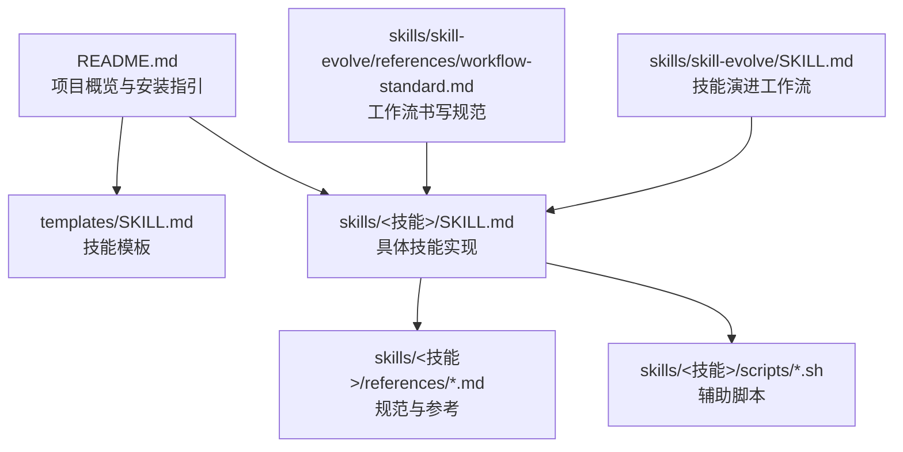
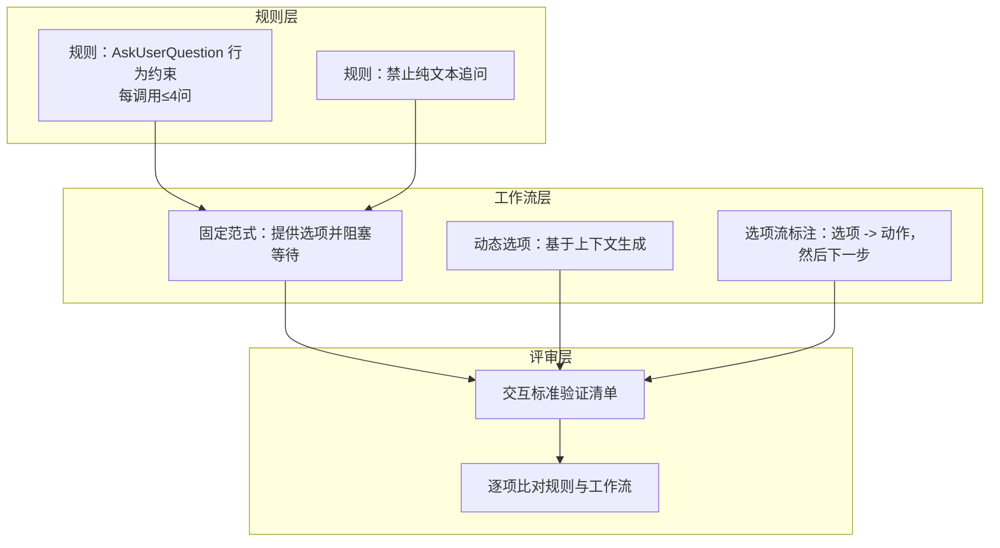
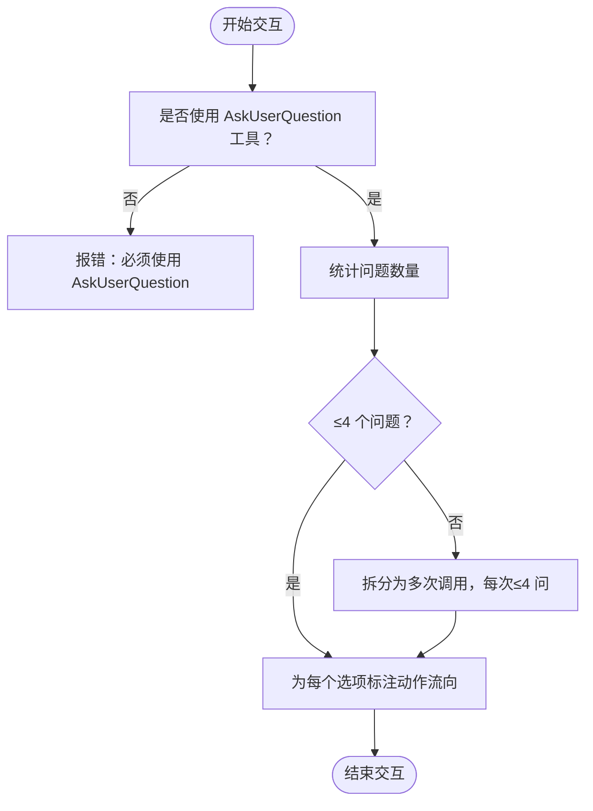
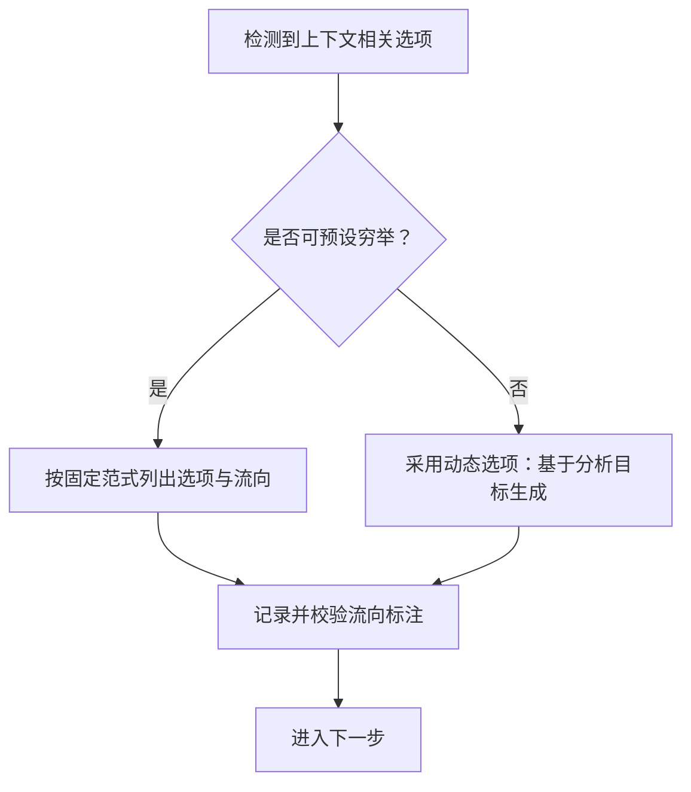
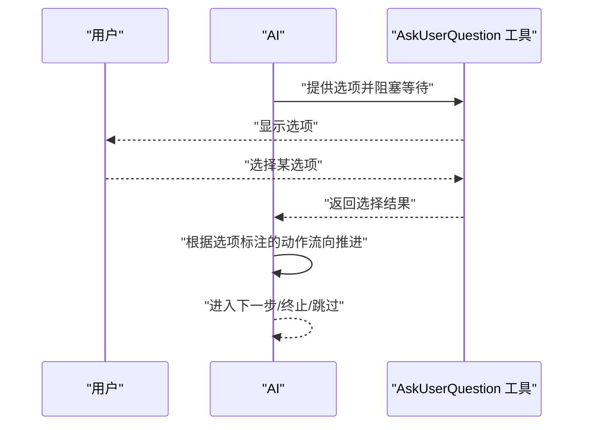
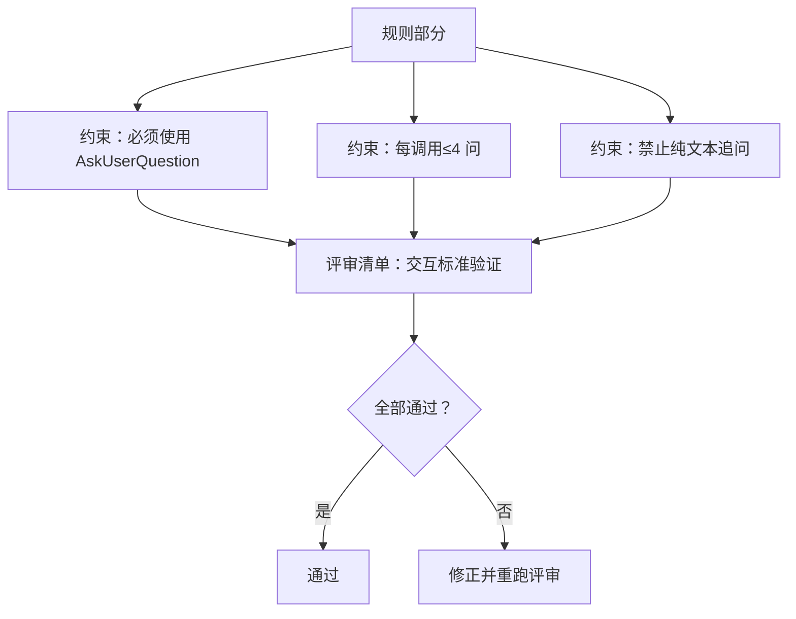
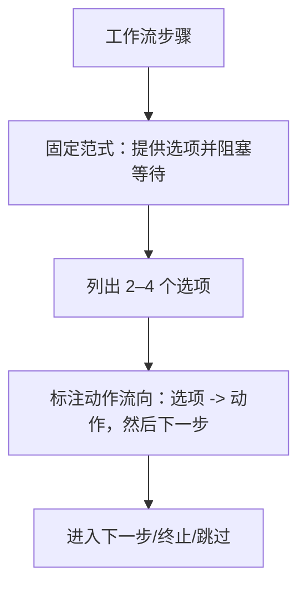
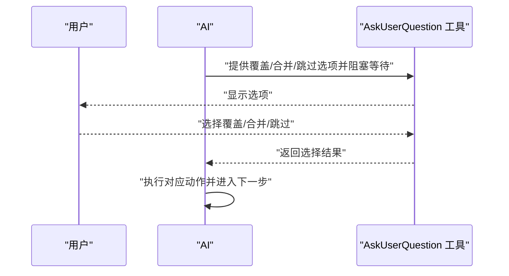
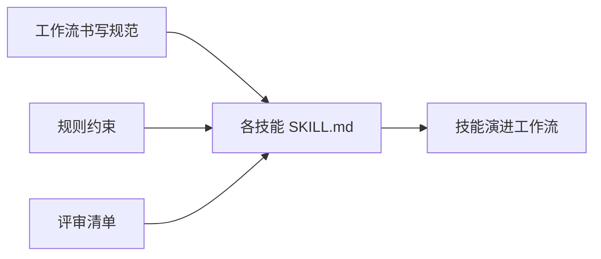

# 交互规范

<cite>
**本文引用的文件**
- [README.md](file://README.md)
- [templates/SKILL.md](file://templates/SKILL.md)
- [skills/skill-evolve/references/workflow-standard.md](file://skills/skill-evolve/references/workflow-standard.md)
- [skills/skill-evolve/SKILL.md](file://skills/skill-evolve/SKILL.md)
- [skills/grill-me/SKILL.md](file://skills/grill-me/SKILL.md)
- [skills/git-cleanup/SKILL.md](file://skills/git-cleanup/SKILL.md)
- [skills/git-branch-prep/SKILL.md](file://skills/git-branch-prep/SKILL.md)
- [inbox/skills/diagnose/scripts/hitl-loop.template.sh](file://inbox/skills/diagnose/scripts/hitl-loop.template.sh)
</cite>

## 目录
1. [引言](#引言)
2. [项目结构](#项目结构)
3. [核心组件](#核心组件)
4. [架构总览](#架构总览)
5. [详细组件分析](#详细组件分析)
6. [依赖关系分析](#依赖关系分析)
7. [性能考量](#性能考量)
8. [故障排查指南](#故障排查指南)
9. [结论](#结论)
10. [附录](#附录)

## 引言
本规范面向 Skills Collection 项目中所有 SKILL.md 的交互设计，聚焦于用户决策的标准化写法，尤其是 AskUserQuestion 工具的使用规范、结构化选项生成、阻塞式用户确认等。文档同时给出规则部分必须包含的交互行为回退机制，确保在未明确配置时仍能正确处理用户交互；并提供工作流中交互写作范式的标准格式，包括选项列表的结构化描述、动作执行后的流程控制等。

## 项目结构
Skills Collection 由多个独立技能组成，每个技能以 SKILL.md 描述其工作流、规则与评审清单，并通过统一的“安全步骤”（预检、复核、输出）保障一致性。模板与规范文件位于 templates 与 references 目录，用于指导各技能的编写与演进。

图示来源
- [README.md:1-113](file://README.md#L1-L113)
- [templates/SKILL.md:1-30](file://templates/SKILL.md#L1-L30)
- [skills/skill-evolve/references/workflow-standard.md:1-120](file://skills/skill-evolve/references/workflow-standard.md#L1-L120)

章节来源
- [README.md:1-113](file://README.md#L1-L113)
- [templates/SKILL.md:1-30](file://templates/SKILL.md#L1-L30)

## 核心组件
- AskUserQuestion 工具：用于阻塞式 UI 确认，禁止使用纯文本追问。
- 交互范式：固定句式“通过 AskUserQuestion 提供选项，阻塞并等待用户选择”，随后对每个选项标注“选项 -> 动作，然后进入下一步”。
- 动态选项：当选项依赖上下文分析结果且无法穷举时，采用“基于分析目标的动态选项生成”模式，并明确生成依据与范围。
- 回退机制：规则部分必须包含针对 AskUserQuestion 的行为约束与上限（每调用不超过 4 个问题），作为未显式配置时的默认处理策略。
- 流程控制：每个分支必须显式标注终止/继续/跳过/子操作等流向，避免 AI 对后续行为产生歧义。

章节来源
- [skills/skill-evolve/references/workflow-standard.md:765-993](file://skills/skill-evolve/references/workflow-standard.md#L765-L993)
- [skills/skill-evolve/SKILL.md:173-223](file://skills/skill-evolve/SKILL.md#L173-L223)

## 架构总览
下图展示交互规范在技能工作流中的位置与作用：规则层定义回退与约束，工作流层以固定范式落地交互，评审清单层验证交互质量与一致性。

图示来源
- [skills/skill-evolve/references/workflow-standard.md:769-777](file://skills/skill-evolve/references/workflow-standard.md#L769-L777)
- [skills/skill-evolve/references/workflow-standard.md:781-791](file://skills/skill-evolve/references/workflow-standard.md#L781-L791)
- [skills/skill-evolve/references/workflow-standard.md:827-851](file://skills/skill-evolve/references/workflow-standard.md#L827-L851)
- [skills/skill-evolve/references/workflow-standard.md:854-889](file://skills/skill-evolve/references/workflow-standard.md#L854-L889)
- [skills/skill-evolve/references/workflow-standard.md:984-992](file://skills/skill-evolve/references/workflow-standard.md#L984-L992)

## 详细组件分析

### 组件一：AskUserQuestion 使用规范
- 必须使用工具进行阻塞式确认，禁止纯文本追问。
- 每次调用最多包含 4 个问题；超过时应拆分为多次调用。
- 每个选项必须标注“选项 -> 动作，然后进入下一步”，确保后续流程不盲点。

图示来源
- [skills/skill-evolve/references/workflow-standard.md:769-777](file://skills/skill-evolve/references/workflow-standard.md#L769-L777)
- [skills/skill-evolve/references/workflow-standard.md:984-992](file://skills/skill-evolve/references/workflow-standard.md#L984-L992)

章节来源
- [skills/skill-evolve/references/workflow-standard.md:769-777](file://skills/skill-evolve/references/workflow-standard.md#L769-L777)
- [skills/skill-evolve/references/workflow-standard.md:984-992](file://skills/skill-evolve/references/workflow-standard.md#L984-L992)

### 组件二：结构化选项生成与动态选项
- 固定范式：先“通过 AskUserQuestion 提供选项，阻塞并等待用户选择”，再列出选项与动作流向。
- 动态选项：当选项依赖上下文（如缺失类型、非标项内容、拆分域）时，采用“基于分析目标的动态选项生成”模式，并明确生成依据与范围。

图示来源
- [skills/skill-evolve/references/workflow-standard.md:781-791](file://skills/skill-evolve/references/workflow-standard.md#L781-L791)
- [skills/skill-evolve/references/workflow-standard.md:827-851](file://skills/skill-evolve/references/workflow-standard.md#L827-L851)

章节来源
- [skills/skill-evolve/references/workflow-standard.md:781-791](file://skills/skill-evolve/references/workflow-standard.md#L781-L791)
- [skills/skill-evolve/references/workflow-standard.md:827-851](file://skills/skill-evolve/references/workflow-standard.md#L827-L851)

### 组件三：阻塞式用户确认与流程控制
- 每个分支必须显式标注终止/继续/跳过/子操作等流向，避免 AI 对后续行为产生歧义。
- 复杂场景建议拆分为多次交互，降低用户认知负担。

图示来源
- [skills/skill-evolve/references/workflow-standard.md:580-648](file://skills/skill-evolve/references/workflow-standard.md#L580-L648)
- [skills/skill-evolve/references/workflow-standard.md:854-889](file://skills/skill-evolve/references/workflow-standard.md#L854-L889)

章节来源
- [skills/skill-evolve/references/workflow-standard.md:580-648](file://skills/skill-evolve/references/workflow-standard.md#L580-L648)
- [skills/skill-evolve/references/workflow-standard.md:854-889](file://skills/skill-evolve/references/workflow-standard.md#L854-L889)

### 组件四：规则部分的回退机制
- 规则必须包含 AskUserQuestion 的行为约束与上限，作为未显式配置时的默认处理策略。
- 评审清单需包含交互标准验证条目，确保规则与工作流一致。

图示来源
- [skills/skill-evolve/SKILL.md:173-223](file://skills/skill-evolve/SKILL.md#L173-L223)
- [skills/skill-evolve/references/workflow-standard.md:984-992](file://skills/skill-evolve/references/workflow-standard.md#L984-L992)

章节来源
- [skills/skill-evolve/SKILL.md:173-223](file://skills/skill-evolve/SKILL.md#L173-L223)
- [skills/skill-evolve/references/workflow-standard.md:984-992](file://skills/skill-evolve/references/workflow-standard.md#L984-L992)

### 组件五：工作流中的交互写作范式
- 固定范式：在工作流中，所有涉及用户决策的步骤均以“通过 AskUserQuestion 提供选项，阻塞并等待用户选择”开头，随后以缩进子列表列出选项与动作流向。
- 选项数量：每步交互建议提供 2–4 个明确选项；若为动态选项，需标注生成依据与范围。
- 动作流向：每个选项必须标注“选项 -> 动作，然后进入下一步”，避免流程盲点。

图示来源
- [skills/skill-evolve/references/workflow-standard.md:781-791](file://skills/skill-evolve/references/workflow-standard.md#L781-L791)
- [skills/skill-evolve/references/workflow-standard.md:854-889](file://skills/skill-evolve/references/workflow-standard.md#L854-L889)

章节来源
- [skills/skill-evolve/references/workflow-standard.md:781-791](file://skills/skill-evolve/references/workflow-standard.md#L781-L791)
- [skills/skill-evolve/references/workflow-standard.md:854-889](file://skills/skill-evolve/references/workflow-standard.md#L854-L889)

### 组件六：典型交互场景最佳实践
- 覆盖/合并/跳过选择：在迁移或拆分文件时，提供“覆盖/合并/跳过”三个明确选项，并标注对应动作与流向。
- 删除确认：在删除前必须通过 AskUserQuestion 获取用户确认，失败时提供回滚或跳过选项。
- 修复方案选择：当发现不符合规范的内容时，提供“动态选项：基于分析目标生成修复方案”，并在选项后标注动作流向。

图示来源
- [skills/skill-evolve/SKILL.md:62-77](file://skills/skill-evolve/SKILL.md#L62-L77)
- [skills/skill-evolve/SKILL.md:132-152](file://skills/skill-evolve/SKILL.md#L132-L152)

章节来源
- [skills/skill-evolve/SKILL.md:62-77](file://skills/skill-evolve/SKILL.md#L62-L77)
- [skills/skill-evolve/SKILL.md:132-152](file://skills/skill-evolve/SKILL.md#L132-L152)

## 依赖关系分析
- 规范依赖：各技能的工作流必须遵循“工作流书写规范”中的交互标准。
- 规则依赖：规则部分必须包含 AskUserQuestion 的行为约束与上限，作为回退机制。
- 评审依赖：评审清单需包含交互标准验证条目，确保规则与工作流一致。

图示来源
- [skills/skill-evolve/references/workflow-standard.md:1-120](file://skills/skill-evolve/references/workflow-standard.md#L1-L120)
- [skills/skill-evolve/SKILL.md:173-223](file://skills/skill-evolve/SKILL.md#L173-L223)

章节来源
- [skills/skill-evolve/references/workflow-standard.md:1-120](file://skills/skill-evolve/references/workflow-standard.md#L1-L120)
- [skills/skill-evolve/SKILL.md:173-223](file://skills/skill-evolve/SKILL.md#L173-L223)

## 性能考量
- 交互次数与复杂度：每步交互建议提供 2–4 个选项，避免一次性过多问题导致用户认知负担。
- 动态选项成本：动态选项生成依赖上下文分析，应在保证准确性的同时尽量减少不必要的计算。
- 流程稳定性：通过明确的分支终点与流向标注，减少 AI 在分支判断上的不确定性，提升整体执行效率。

## 故障排查指南
- 现象：AI 输出纯文本而非 UI 确认
  - 排查：检查规则部分是否包含“禁止纯文本追问”的约束。
  - 处理：改用 AskUserQuestion 工具，并标注动作流向。
- 现象：交互选项缺失或不完整
  - 排查：检查工作流是否使用固定范式，选项是否标注动作流向。
  - 处理：补充选项与流向标注，必要时采用动态选项模式并明确生成依据。
- 现象：分支终点不明确
  - 排查：检查分支是否显式标注“下一步/终止/跳过/子操作”。
  - 处理：为每个分支添加明确的流向标注，避免 AI 产生歧义。

章节来源
- [skills/skill-evolve/references/workflow-standard.md:890-942](file://skills/skill-evolve/references/workflow-standard.md#L890-L942)
- [skills/skill-evolve/references/workflow-standard.md:580-648](file://skills/skill-evolve/references/workflow-standard.md#L580-L648)

## 结论
通过统一的 AskUserQuestion 使用规范、结构化选项生成与动态选项模式、严格的选项流向标注以及规则层面的回退机制，Skills Collection 的交互设计实现了高一致性与可维护性。建议在编写新技能或修订既有技能时，严格遵循本文档的交互范式与验证清单，确保用户体验与系统稳定性。

## 附录
- 交互范式示例路径
  - 固定范式与选项流向标注：[skills/skill-evolve/references/workflow-standard.md:781-791](file://skills/skill-evolve/references/workflow-standard.md#L781-L791)
  - 动态选项模式与生成依据：[skills/skill-evolve/references/workflow-standard.md:827-851](file://skills/skill-evolve/references/workflow-standard.md#L827-L851)
  - 评审清单中的交互标准验证：[skills/skill-evolve/references/workflow-standard.md:984-992](file://skills/skill-evolve/references/workflow-standard.md#L984-L992)
- 典型技能中的交互实现
  - 技能演进中的交互点：[skills/skill-evolve/SKILL.md:30-171](file://skills/skill-evolve/SKILL.md#L30-L171)
  - Grill Me 的对话式交互示例：[skills/grill-me/SKILL.md:113-407](file://skills/grill-me/SKILL.md#L113-L407)
  - Git Cleanup 的删除确认与远程删除二次确认：[skills/git-cleanup/SKILL.md:36-171](file://skills/git-cleanup/SKILL.md#L36-L171)
  - Git Branch Prep 的分支与推送意图确认：[skills/git-branch-prep/SKILL.md:24-101](file://skills/git-branch-prep/SKILL.md#L24-L101)
- 人机协作脚本（用于手动调试与验证）
  - 交互循环模板：[inbox/skills/diagnose/scripts/hitl-loop.template.sh:1-41](file://inbox/skills/diagnose/scripts/hitl-loop.template.sh#L1-L41)