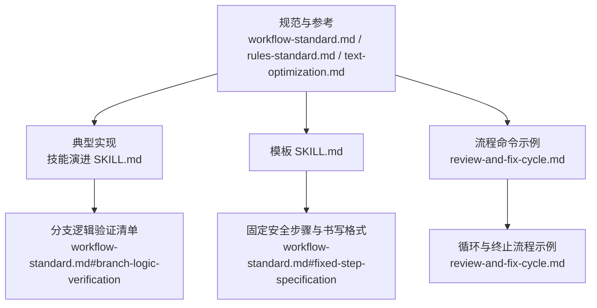
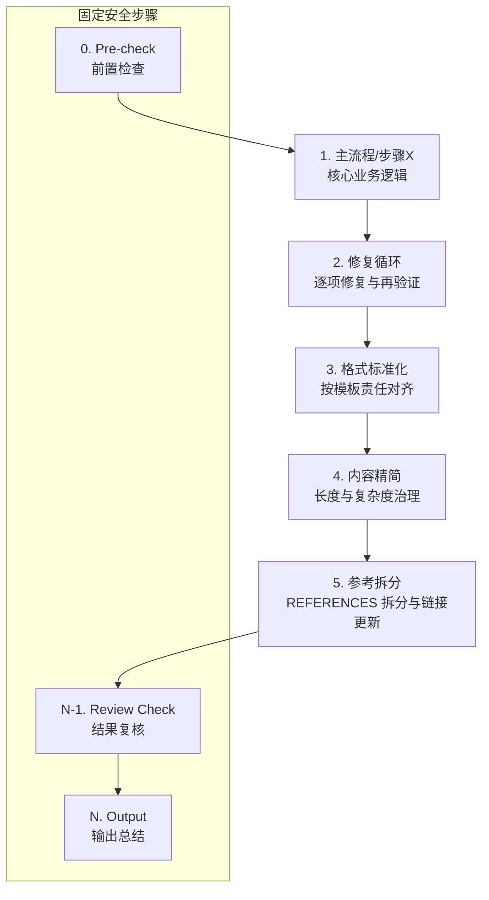
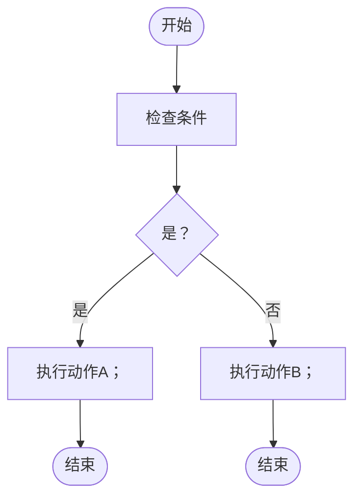
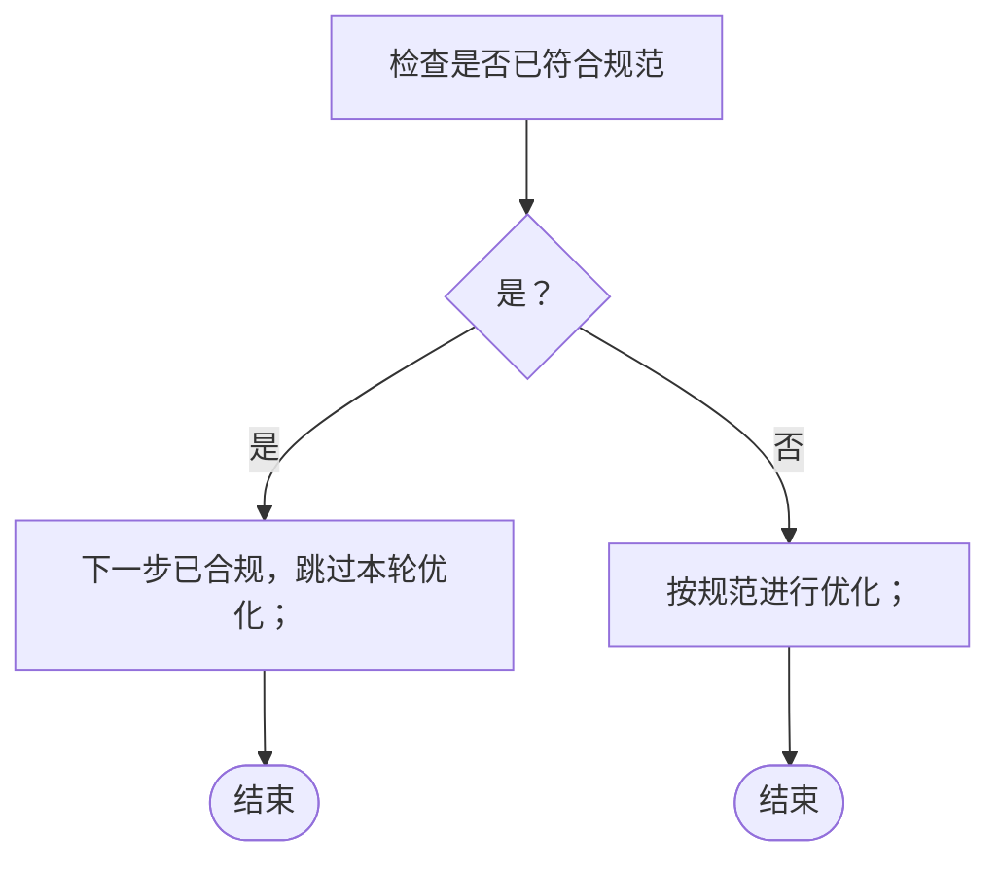
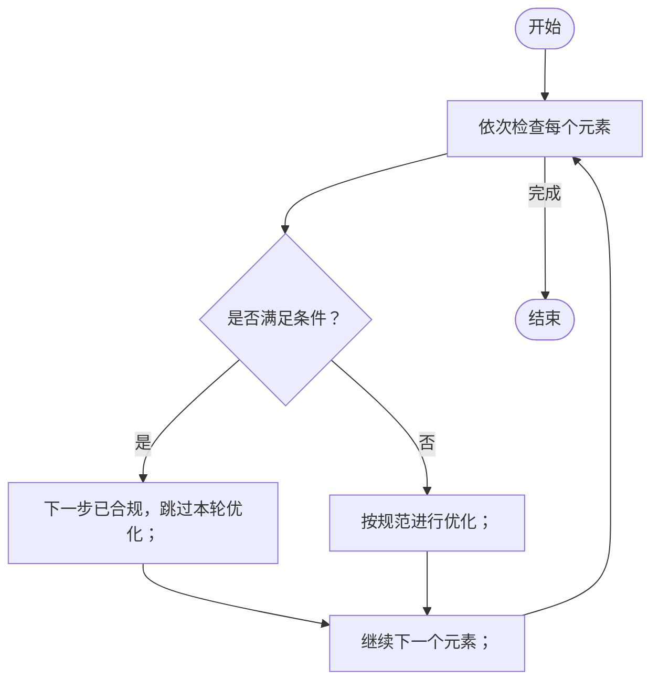
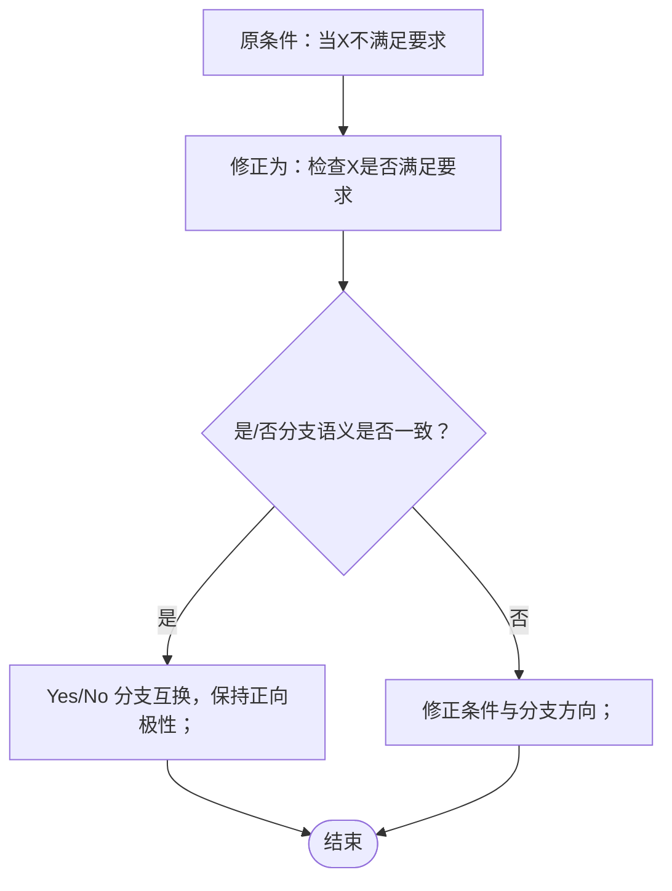
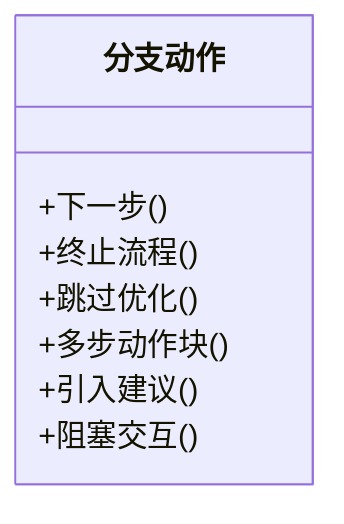
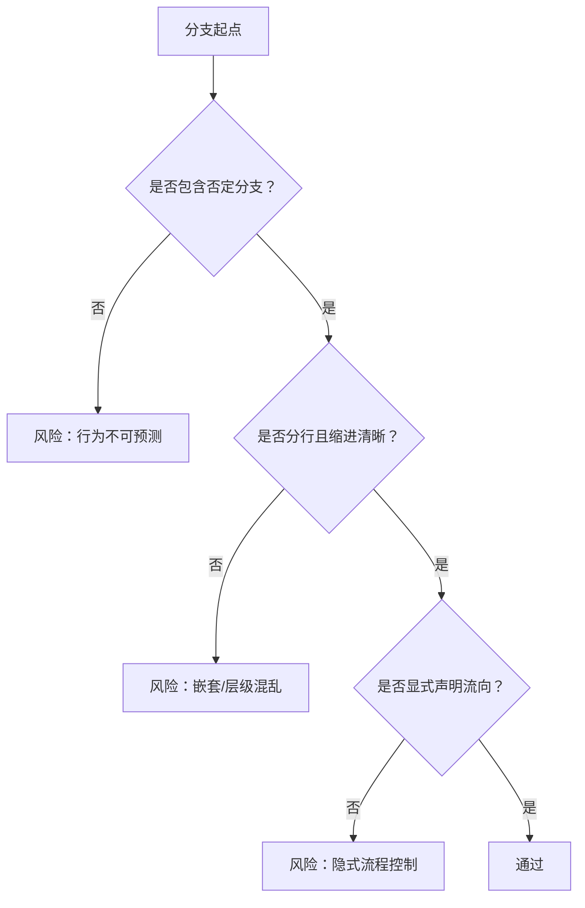
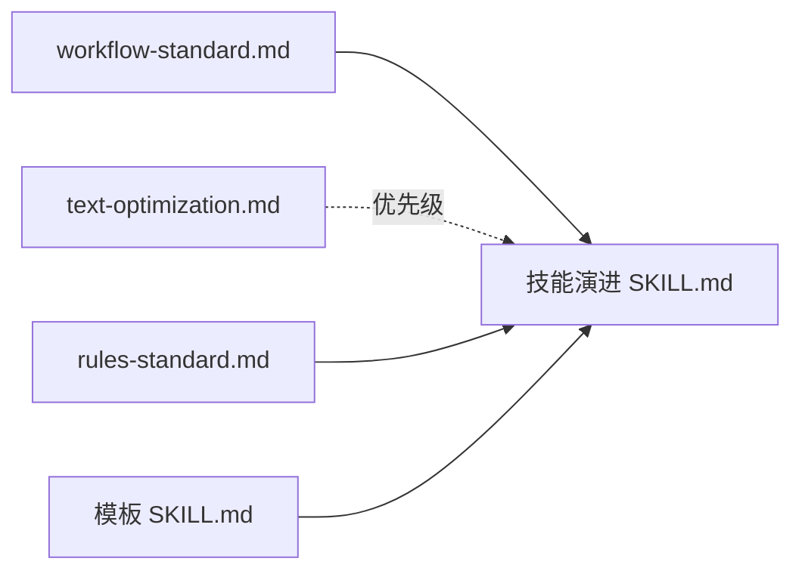
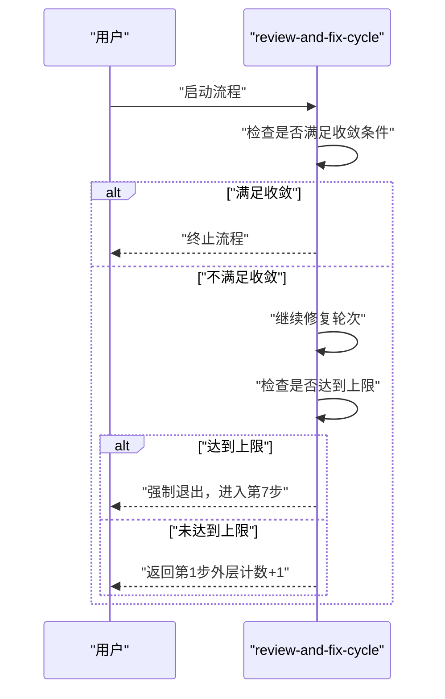

# 分支逻辑规范

<cite>
**本文引用的文件**
- [workflow-standard.md](file://skills/skills/skill-evolve/references/workflow-standard.md)
- [workflow-standard.md（中文版）](file://skills/skills.zh-CN/skill-evolve/references/workflow-standard.md)
- [rules-standard.md](file://skills/skills/skill-evolve/references/rules-standard.md)
- [text-optimization.md](file://skills/skills/skill-evolve/references/text-optimization.md)
- [SKILL.md（技能演进）](file://skills/skills/skill-evolve/SKILL.md)
- [SKILL.md（模板）](file://skills/skills/skill-evolve/template.md)
- [review-and-fix-cycle.md](file://skills/commands/review-and-fix-cycle.md)
- [review-and-fix-cycle.md（中文版）](file://skills/commands.zh-CN/review-and-fix-cycle.md)
</cite>

## 目录
1. [引言](#引言)
2. [项目结构](#项目结构)
3. [核心组件](#核心组件)
4. [架构总览](#架构总览)
5. [详细组件分析](#详细组件分析)
6. [依赖分析](#依赖分析)
7. [性能考虑](#性能考虑)
8. [故障排查指南](#故障排查指南)
9. [结论](#结论)
10. [附录](#附录)

## 引言
本规范面向 Skills Collection 项目的分支逻辑编写与执行，统一条件分支的树形箭头格式（Yes -> / No ->），明确分支层级结构、缩进规则、分支终点显式化等要求，并系统阐述四条核心规则：分支逻辑树形化、幂等性保护、顺序判断（集合迭代）、条件极性匹配。同时给出分支动作类型清单与危险场景分析，帮助作者在编写 SKILL.md 的 Workflow 时，构建清晰、可维护、可复现的分支决策流。

## 项目结构
本规范所依据的核心文件主要分布在以下位置：
- 规范与参考：workflow-standard.md（英文/中文）、rules-standard.md、text-optimization.md
- 典型实现：技能演进 SKILL.md、模板 SKILL.md
- 流程命令示例：review-and-fix-cycle.md（英文/中文）

**图表来源**
- [workflow-standard.md:379-625](file://skills/skills/skill-evolve/references/workflow-standard.md#L379-L625)
- [rules-standard.md:1-58](file://skills/skills/skill-evolve/references/rules-standard.md#L1-L58)
- [text-optimization.md:1-165](file://skills/skills/skill-evolve/references/text-optimization.md#L1-L165)
- [SKILL.md（技能演进）:30-171](file://skills/skills/skill-evolve/SKILL.md#L30-L171)
- [SKILL.md（模板）:37-51](file://skills/skills/skill-evolve/template.md#L37-L51)
- [review-and-fix-cycle.md:40-126](file://skills/commands/review-and-fix-cycle.md#L40-L126)

**章节来源**
- [workflow-standard.md:1-118](file://skills/skills/skill-evolve/references/workflow-standard.md#L1-L118)
- [SKILL.md（技能演进）:30-171](file://skills/skills/skill-evolve/SKILL.md#L30-L171)

## 核心组件
- 条件分支树形化：将 if-else 平铺逻辑转换为树形箭头格式（Yes -> / No ->），每条分支独占一行并以缩进表达层级，避免将多个分支结果压缩在同一行。
- 幂等性保护：对“是否已符合某规范”的判断增加二次校验，Yes 分支标注跳过原因，防止重复触发优化。
- 顺序判断（集合迭代）：对集合中的每个元素逐一判断时，使用“依次检查每个...”前缀，明确迭代范围，避免 AI 在遇到首个合规项后提前停止。
- 条件极性匹配：优先使用正向条件（“是否存在/是否满足”），避免负向条件（“是否未满足/是否缺失”）导致 Yes/No 与 Good/Bad 混淆。
- 分支终点显式化：每个分支必须以显式的流程控制动作结尾，不得仅有输出而无后续流向指令；非终止分支必须有明确的“下一步”指示。

**章节来源**
- [workflow-standard.md:383-625](file://skills/skills/skill-evolve/references/workflow-standard.md#L383-L625)
- [workflow-standard.md（中文版）:379-622](file://skills/skills.zh-CN/skill-evolve/references/workflow-standard.md#L379-L622)

## 架构总览
下图展示了分支逻辑在 SKILL.md Workflow 中的组织方式：固定安全步骤（Pre-check、Review Check、Output）与中间主流程、修复循环、格式标准化、内容精简、参考文档拆分等步骤共同构成完整的执行闭环。

**图表来源**
- [workflow-standard.md:19-117](file://skills/skills/skill-evolve/references/workflow-standard.md#L19-L117)
- [SKILL.md（技能演进）:30-171](file://skills/skills/skill-evolve/SKILL.md#L30-L171)

## 详细组件分析

### 规则一：分支逻辑树形化
- 要求：分支必须以树形箭头格式呈现，每种结果（Yes/No）独占一行、缩进表达层级，避免将多个分支结果压缩在同一行。
- 行尾标记：分支动作行以中文分号“；”结尾；引入子条件或子操作列表的非终止分支以中文冒号“：”结尾。
- 缩进规则：每层缩进 2 个空格；条件分支（Yes -> / No ->）再额外缩进 2 个空格。
- 示例要点：将“存在性检测”“嵌套处理”“多步动作块”等场景规范化为树形结构，消除歧义与执行顺序不确定性。

**图表来源**
- [workflow-standard.md:383-393](file://skills/skills/skill-evolve/references/workflow-standard.md#L383-L393)

**章节来源**
- [workflow-standard.md:383-393](file://skills/skills/skill-evolve/references/workflow-standard.md#L383-L393)
- [workflow-standard.md（中文版）:387-393](file://skills/skills.zh-CN/skill-evolve/references/workflow-standard.md#L387-L393)

### 规则二：幂等性保护
- 场景：对“是否已符合某规范”的判断，Yes 分支必须标注“当前内容已满足模板职责要求，标记为已合规，跳过本轮优化；当模板职责更新或内容发生实质偏离时，需重新执行此检查”。
- 目的：防止重复优化导致格式变形或副作用累积。
- 实施：在“是否已符合规范”的外层增加“是否已使用标准格式”的二次检查，Yes 分支直接跳过，No 分支进入优化。

**图表来源**
- [workflow-standard.md:467-497](file://skills/skills/skill-evolve/references/workflow-standard.md#L467-L497)

**章节来源**
- [workflow-standard.md:467-497](file://skills/skills/skill-evolve/references/workflow-standard.md#L467-L497)
- [workflow-standard.md（中文版）:580-589](file://skills/skills.zh-CN/skill-evolve/references/workflow-standard.md#L580-L589)

### 规则三：顺序判断（集合迭代）
- 前缀：对集合中每个元素逐一判断时，使用“依次检查每个...”前缀，明确迭代范围。
- 目的：避免 AI 在遇到首个合规项后提前停止，确保对集合中所有元素进行逐一合规性评估。
- 应用：如“依次检查每个模板标准节”，“依次检查每个交互点”。

**图表来源**
- [workflow-standard.md:499-527](file://skills/skills/skill-evolve/references/workflow-standard.md#L499-L527)

**章节来源**
- [workflow-standard.md:499-527](file://skills/skills/skill-evolve/references/workflow-standard.md#L499-L527)
- [workflow-standard.md（中文版）:580-589](file://skills/skills.zh-CN/skill-evolve/references/workflow-standard.md#L580-L589)

### 规则四：条件极性匹配
- 正向条件优先：优先使用“是否存在/是否满足/是否为”等正向条件，避免“是否未满足/是否缺失/当...时”等单路径句式。
- 单路径句式不适合二元分支：例如“当 SKILL.md 超过 300 行”不适合写成 Yes/No 二分，应改为“检查是否超过 300 行”。
- 自检方法：写完条件后，用自然语言读出“是->X，否->Y”，验证是否符合直觉。

**图表来源**
- [workflow-standard.md:529-578](file://skills/skills/skill-evolve/references/workflow-standard.md#L529-L578)

**章节来源**
- [workflow-standard.md:529-578](file://skills/skills/skill-evolve/references/workflow-standard.md#L529-L578)
- [workflow-standard.md（中文版）:580-589](file://skills/skills.zh-CN/skill-evolve/references/workflow-standard.md#L580-L589)

### 分支动作类型
- 下一步：继续到当前步骤的下一个判断或进入下一阶段。
- 终止流程：流程级结束，后续所有步骤不再执行。
- 跳过优化：当前项已合规，跳过并继续。
- 多步动作块：以中文冒号“：”引入子操作列表，子操作以中文分号“；”结尾。
- 引入建议：给出建议但不强制执行。
- 阻塞交互：通过 AskUserQuestion 提供选项并阻塞等待用户选择。

**图表来源**
- [workflow-standard.md:626-638](file://skills/skills/skill-evolve/references/workflow-standard.md#L626-L638)

**章节来源**
- [workflow-standard.md:626-648](file://skills/skills/skill-evolve/references/workflow-standard.md#L626-L648)
- [workflow-standard.md（中文版）:580-622](file://skills/skills.zh-CN/skill-evolve/references/workflow-standard.md#L580-L622)

### 危险场景与常见反模式
- 缺失否定分支：仅定义“是”的行为，未定义“否”的行为，导致 AI 对“否”情况不可预测。
- 行内嵌套：将多个独立条件写在同一行，AI 难以判断互斥关系，可能执行多条分支。
- 层级混乱：兄弟条件与子条件混排，未用缩进区分父子关系。
- 规范文件自身违反规范：示例中出现标点不一致、漏加分号等问题，导致 AI 学习到不一致的格式。
- 条件极性偏差：负向条件 + 单一分支，易使 AI 忽略“已合规”的路径。
- 隐式流程控制：分支仅输出，未声明“下一步/终止流程”，AI 无法确定后续流向。

**图表来源**
- [workflow-standard.md:649-764](file://skills/skills/skill-evolve/references/workflow-standard.md#L649-L764)

**章节来源**
- [workflow-standard.md:649-764](file://skills/skills/skill-evolve/references/workflow-standard.md#L649-L764)
- [workflow-standard.md（中文版）:580-622](file://skills/skills.zh-CN/skill-evolve/references/workflow-standard.md#L580-L622)

## 依赖分析
- 规范依赖：SKILL.md 的 Workflow 必须遵循 workflow-standard.md 的固定安全步骤、书写格式、分支逻辑与交互模式。
- 内容边界：text-optimization.md 的压缩规则在与 expanded 格式冲突时，expanded 格式优先（如树形分支、幂等性保护、顺序判断前缀）。
- 行为约束：rules-standard.md 对行为维度进行约束，与 workflow-standard.md 的交互模式形成互补。

**图表来源**
- [workflow-standard.md:1-118](file://skills/skills/skill-evolve/references/workflow-standard.md#L1-L118)
- [text-optimization.md:86-87](file://skills/skills/skill-evolve/references/text-optimization.md#L86-L87)
- [rules-standard.md:1-58](file://skills/skills/skill-evolve/references/rules-standard.md#L1-L58)
- [SKILL.md（模板）:37-51](file://skills/skills/skill-evolve/template.md#L37-L51)

**章节来源**
- [text-optimization.md:86-87](file://skills/skills/skill-evolve/references/text-optimization.md#L86-L87)
- [rules-standard.md:1-58](file://skills/skills/skill-evolve/references/rules-standard.md#L1-L58)

## 性能考虑
- 分支深度与复杂度：通过“内容精简”“参考拆分”等步骤控制 SKILL.md 的行数与复杂度，降低分支解析与执行成本。
- 循环与重试：在修复循环中设置最大重试次数与明确的降级策略，避免无限循环与资源浪费。
- 顺序判断：对集合元素逐一判断时，采用“依次检查每个...”前缀，确保完整扫描，避免因提前短路导致遗漏。

**章节来源**
- [workflow-standard.md:150-158](file://skills/skills/skill-evolve/references/workflow-standard.md#L150-L158)
- [SKILL.md（技能演进）:114-131](file://skills/skills/skill-evolve/SKILL.md#L114-L131)

## 故障排查指南
- 分支终点缺失：若分支仅输出未声明“下一步/终止流程”，AI 可能继续执行后续步骤或不确定行为。请在每个分支末尾显式声明流向。
- 功率交互未使用 AskUserQuestion：若使用纯文本提问，将被规则判定为失败。请改用 AskUserQuestion 工具并提供结构化选项。
- 顺序判断误用：对集合元素逐一判断时，若使用“检查是否存在...”而非“依次检查每个...”，可能导致 AI 在首个合规项后停止。请使用顺序判断前缀。
- 极性不匹配：负向条件 + 单一分支会导致 AI 忽略“已合规”路径。请改为正向条件并交换 Yes/No 分支。
- 规范文件一致性：若示例中出现标点不一致或漏加分号，将影响 AI 对格式的学习。请确保规范文件自身通过验证清单。

**章节来源**
- [workflow-standard.md:580-764](file://skills/skills/skill-evolve/references/workflow-standard.md#L580-L764)
- [SKILL.md（技能演进）:193-206](file://skills/skills/skill-evolve/SKILL.md#L193-L206)

## 结论
通过统一分支逻辑的树形箭头格式、明确分支终点、强化幂等性保护与顺序判断、规范条件极性，以及严格避免常见反模式，可以显著提升 SKILL.md Workflow 的可读性、可维护性与可复现性。建议在编写与评审过程中，对照规范文件与验证清单逐项检查，确保分支逻辑清晰、严谨、一致。

## 附录

### 分支逻辑验证清单（摘自规范）
- 每个条件检查均包含显式的 Yes -> 与 No -> 分支
- 嵌套分支通过缩进正确表达父子层级
- 每个分支指向具体、可执行的操作指令
- 无括号内嵌套条件（反模式 2）
- 无隐式 else（反模式 1）
- 无将多个独立条件写在同一行（危险场景 2）
- “是否已符合规范”的判断包含二次幂等性保护（合规 -> 跳过）
- 集合迭代使用“依次检查每个...”前缀，而非“检查是否存在...”

**章节来源**
- [workflow-standard.md:963-972](file://skills/skills/skill-evolve/references/workflow-standard.md#L963-L972)

### 流程命令示例中的分支模式
- review-and-fix-cycle.md 展示了典型的循环与终止流程：当条件满足时进入下一步，否则终止或返回上一步。

**图表来源**
- [review-and-fix-cycle.md:109-126](file://skills/commands/review-and-fix-cycle.md#L109-L126)
- [review-and-fix-cycle.md（中文版）:106-126](file://skills/commands.zh-CN/review-and-fix-cycle.md#L106-L126)