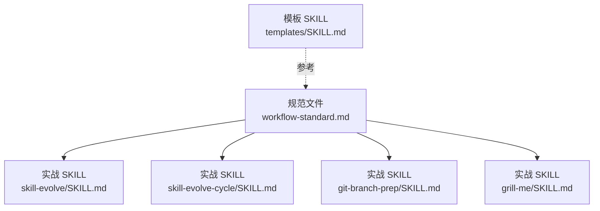
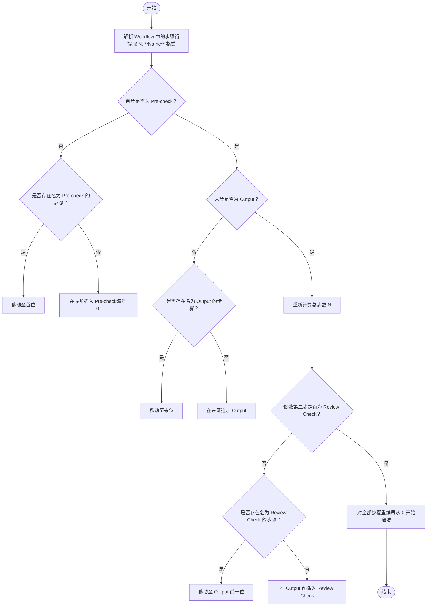
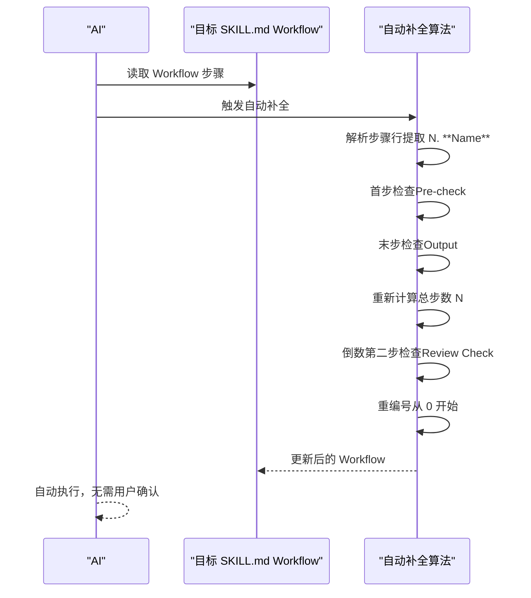
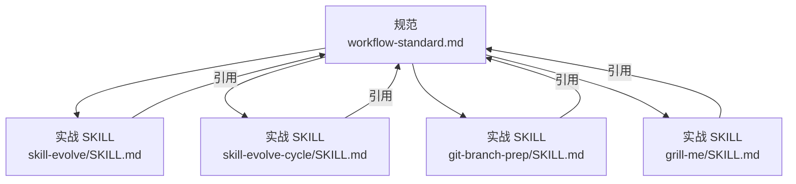

# 工作流规范

<cite>
**本文引用的文件**
- [workflow-standard.md](file://skills/skill-evolve/references/workflow-standard.md)
- [SKILL.md（skill-evolve）](file://skills/skill-evolve/SKILL.md)
- [SKILL.md（skill-evolve-cycle）](file://skills/skill-evolve-cycle/SKILL.md)
- [SKILL.md（git-branch-prep）](file://skills/git-branch-prep/SKILL.md)
- [SKILL.md（grill-me）](file://skills/grill-me/SKILL.md)
- [SKILL.md（模板）](file://templates/SKILL.md)
</cite>

## 目录
1. [简介](#简介)
2. [项目结构](#项目结构)
3. [核心组件](#核心组件)
4. [架构总览](#架构总览)
5. [详细组件分析](#详细组件分析)
6. [依赖关系分析](#依赖关系分析)
7. [性能考量](#性能考量)
8. [故障排查指南](#故障排查指南)
9. [结论](#结论)
10. [附录](#附录)

## 简介
本规范面向 Skills Collection 项目中 SKILL.md 的 “## Workflow” 部分，系统性定义工作流的固定步骤结构（Pre-check、Review Check、Output）、步骤编号与格式、分支逻辑规则、交互模式以及自动补全算法。其目标是统一所有 SKILL 的工作流书写风格，确保结构清晰、可维护性强，并为 AI 自动生成与校验提供可执行的约束与范式。

## 项目结构
- 规范来源：skills/skill-evolve/references/workflow-standard.md
- 实战样例：skills/skill-evolve/SKILL.md、skills/skill-evolve-cycle/SKILL.md、skills/git-branch-prep/SKILL.md、skills/grill-me/SKILL.md
- 模板参考：templates/SKILL.md

图表来源
- [workflow-standard.md:1-160](file://skills/skill-evolve/references/workflow-standard.md#L1-L160)
- [SKILL.md（skill-evolve）:30-171](file://skills/skill-evolve/SKILL.md#L30-L171)
- [SKILL.md（skill-evolve-cycle）:45-150](file://skills/skill-evolve-cycle/SKILL.md#L45-L150)
- [SKILL.md（git-branch-prep）:24-100](file://skills/git-branch-prep/SKILL.md#L24-L100)
- [SKILL.md（grill-me）:268-332](file://skills/grill-me/SKILL.md#L268-L332)
- [SKILL.md（模板）:17-23](file://templates/SKILL.md#L17-L23)

章节来源
- [workflow-standard.md:1-160](file://skills/skill-evolve/references/workflow-standard.md#L1-L160)
- [SKILL.md（skill-evolve）:1-30](file://skills/skill-evolve/SKILL.md#L1-L30)

## 核心组件
- 固定步骤（Secure steps）
  - Pre-check（第0步）：前置环境与前提校验，确保后续步骤可顺利执行。
  - Review Check（倒数第二步）：按 Review List 逐项复核，保证质量标准达成。
  - Output（最后一步）：输出执行摘要并告知完成。
- 步骤编号与标题格式
  - 采用“N. **标题** — 描述；”的统一格式，编号从0开始递增。
  - 子步骤使用缩进项目符号（-），必要时使用“N.M”数字编号表示循环跳转或跨步引用。
- 分支逻辑（树形箭头）
  - 条件分支必须以“是 -> / 否 ->”形式呈现，每条分支以“；”结尾；引入子操作列表的分支以“：”结尾。
  - 每个条件判断必须同时给出“是/否”分支，且分支终点明确（next step / terminate flow / return N.M）。
- 交互模式
  - 用户决策必须通过 AskUserQuestion 工具提供结构化选项，且每条选项需标注后续流程（Action -> next step；）。
  - 单次 AskUserQuestion 选项不超过4个，动态选项需明确生成依据与范围。

章节来源
- [workflow-standard.md:9-18](file://skills/skill-evolve/references/workflow-standard.md#L9-L18)
- [workflow-standard.md:189-230](file://skills/skill-evolve/references/workflow-standard.md#L189-L230)
- [workflow-standard.md:276-285](file://skills/skill-evolve/references/workflow-standard.md#L276-L285)
- [workflow-standard.md:379-589](file://skills/skill-evolve/references/workflow-standard.md#L379-L589)
- [workflow-standard.md:765-993](file://skills/skill-evolve/references/workflow-standard.md#L765-L993)

## 架构总览
下图展示了工作流的三段式固定结构与自动补全算法的执行顺序。

图表来源
- [workflow-standard.md:119-138](file://skills/skill-evolve/references/workflow-standard.md#L119-L138)

章节来源
- [workflow-standard.md:119-138](file://skills/skill-evolve/references/workflow-standard.md#L119-L138)

## 详细组件分析

### 固定步骤：Pre-check（前置检查）
- 职责
  - 在执行核心流程前，确保环境、工具、权限等前置条件满足。
  - 保存目标 SKILL.md 的原始内容副本（用于不可恢复错误时回滚）。
  - 初始化跨步骤变量（如“是否跨步循环引用”“是否自演进”等）。
- 标准内容（核心必填）
  - 环境完整性校验（目标文件存在且可读、模板文件存在且可解析、references/ 文件存在并与 References 同步）。
  - 未满足条件时，明确报告原因并终止流程或引导用户处理。
- 自动补全规则
  - 若首步非 Pre-check，AI 将自动插入或移动 Pre-check 至首位，编号固定为“0.”。
  - 补全内容直接复制标准“核心（必填）”部分，补充部分由 AI 基于具体 SKILL 场景决定。
- 实战示例
  - skill-evolve 的 Pre-check 步骤包含模板与引用文件校验、保存原始内容、初始化变量等。
  - git-branch-prep 的 Pre-check 步骤包含环境脚本检查、冲突状态检测、分离头处理等。

章节来源
- [workflow-standard.md:21-63](file://skills/skill-evolve/references/workflow-standard.md#L21-L63)
- [SKILL.md（skill-evolve）:32-50](file://skills/skill-evolve/SKILL.md#L32-L50)
- [SKILL.md（git-branch-prep）:26-42](file://skills/git-branch-prep/SKILL.md#L26-L42)

### 固定步骤：Review Check（复核检查）
- 职责
  - 在所有操作完成后，按 Review List 逐项复核，确保质量标准达成。
  - 若任一项未通过，终止流程；全部通过则进入 Output。
- 标准内容（核心必填）
  - 若 Review List 为空，直接进入 Output。
  - 逐项检查并输出结果（示例格式见实战 SKILL 的 Review Check 示例）。
- 自动补全规则
  - 若倒数第二步非 Review Check，AI 将自动插入或移动至 Output 前一位，编号自动计算为“N-1.”。
- 实战示例
  - skill-evolve 的 Review Check 包含元数据、结构、内容、行为、防御等维度的逐项检查。
  - skill-evolve-cycle 的 Review Check 与 Output 严格遵循“先复核再输出”的顺序。

章节来源
- [workflow-standard.md:65-89](file://skills/skill-evolve/references/workflow-standard.md#L65-L89)
- [SKILL.md（skill-evolve）:153-167](file://skills/skill-evolve/SKILL.md#L153-L167)
- [SKILL.md（skill-evolve-cycle）:133-143](file://skills/skill-evolve-cycle/SKILL.md#L133-L143)

### 固定步骤：Output（成果输出）
- 职责
  - 复核通过后，输出结构化摘要并告知完成。
  - 仅列出本次变更的维度，避免冗余信息。
- 标准内容（核心必填）
  - 输出结构化摘要（参考实战 SKILL 的 Output 示例）。
  - 告知完成。
- 自动补全规则
  - 若末步非 Output，AI 将自动追加至末位，编号为“N.”。
  - 补全内容包含核心必填部分（结构化摘要+完成提示），补充部分由 AI 基于上下文决定。
- 实战示例
  - skill-evolve 的 Output 展示前后对比表格，仅列出变化维度。
  - skill-evolve-cycle 的 Output 输出最终总结报告并标记“Large Cycle Converged”。

章节来源
- [workflow-standard.md:91-117](file://skills/skill-evolve/references/workflow-standard.md#L91-L117)
- [SKILL.md（skill-evolve）:168-171](file://skills/skill-evolve/SKILL.md#L168-L171)
- [SKILL.md（skill-evolve-cycle）:145-149](file://skills/skill-evolve-cycle/SKILL.md#L145-L149)

### 步骤编号与标题格式
- 编号系统
  - 顶层步骤编号从 0 开始，依次递增；“0.” 专用于 Pre-check。
  - 子步骤使用缩进项目符号（-），特殊场景（循环跳转/跨步引用）使用“N.M”数字编号。
- 标题命名
  - 统一格式：N. **标题** — 描述；（Em dash 两侧各一个空格）
  - 标题长度：3~10 词；描述长度：10~30 词。
- 实战示例
  - skill-evolve 的标题均符合“N. **标题** — 描述；”格式。
  - templates/SKILL.md 提供基础模板，便于新 SKILL 快速对齐。

章节来源
- [workflow-standard.md:189-241](file://skills/skill-evolve/references/workflow-standard.md#L189-L241)
- [SKILL.md（模板）:17-23](file://templates/SKILL.md#L17-L23)

### 分支逻辑（树形箭头与幂等守卫）
- 规则要点
  - 条件分支必须以“是 -> / 否 ->”呈现，通过缩进表达层级。
  - 每条分支以“；”结尾；引入子操作列表的分支以“：”结尾。
  - 每个条件判断必须同时给出“是/否”分支，且分支终点明确。
  - 对“是否已符合规范”的判断需包含二次幂等守卫（已合规 -> 跳过）。
- 实战示例
  - skill-evolve 的分支广泛采用树形箭头，明确“是/否”与后续流向。
  - grill-me 的分支体现“推荐答案 -> 同意/不同意 -> 再次确认”的交互闭环。

章节来源
- [workflow-standard.md:379-589](file://skills/skill-evolve/references/workflow-standard.md#L379-L589)
- [SKILL.md（skill-evolve）:51-171](file://skills/skill-evolve/SKILL.md#L51-L171)
- [SKILL.md（grill-me）:268-332](file://skills/grill-me/SKILL.md#L268-L332)

### 交互模式（AskUserQuestion）
- 规则要点
  - 用户决策必须通过 AskUserQuestion 提供结构化选项，且每条选项标注后续流程。
  - 单次 AskUserQuestion 选项不超过4个；动态选项需明确生成依据与范围。
  - 禁止使用纯文本追问替代 AskUserQuestion。
- 实战示例
  - skill-evolve 的多处分支使用 AskUserQuestion 并标注“下一步”或“终止流程”。
  - skill-evolve-cycle 的回溯与合并阶段也通过 AskUserQuestion 明确决策路径。

章节来源
- [workflow-standard.md:765-993](file://skills/skill-evolve/references/workflow-standard.md#L765-L993)
- [SKILL.md（skill-evolve）:42-44](file://skills/skill-evolve/SKILL.md#L42-L44)
- [SKILL.md（skill-evolve-cycle）:116-118](file://skills/skill-evolve-cycle/SKILL.md#L116-L118)

### 自动补全算法（实现细节与工作原理）
- 解析
  - 从 Workflow 中提取所有“N. **Name**”格式的步骤行。
- 首步检查
  - 若首步非 Pre-check：若存在同名步骤则移动至首位，否则在最前插入 Pre-check（编号“0.”）。
- 末步检查
  - 若末步非 Output：若存在同名步骤则移动至末位，否则追加 Output。
- 重新计算
  - 重新统计总步数 N。
- 倒数第二步检查
  - 若非 Review Check：若存在同名步骤则移动至 Output 前一位，否则在 Output 前插入 Review Check。
- 重编号
  - 对全部步骤从 0 开始递增重编号。
- 无需用户确认
  - 自动执行上述补全操作。

图表来源
- [workflow-standard.md:119-138](file://skills/skill-evolve/references/workflow-standard.md#L119-L138)

章节来源
- [workflow-standard.md:119-138](file://skills/skill-evolve/references/workflow-standard.md#L119-L138)

### 修复重试规范
- 最大重试次数：建议 2-3 次。
- 超限时处理：必须在 Workflow 中显式标注（如“记录失败项，继续下一步”或“终止流程”）。
- 降级策略：默认不降级，若需降级须在 Workflow 中显式声明。
- 返回点：精确到触发该操作的子步骤，而非整个步骤开头。

章节来源
- [workflow-standard.md:150-157](file://skills/skill-evolve/references/workflow-standard.md#L150-L157)

### 常见错误与反例
- 错误格式
  - 使用 Markdown 标题级别定义步骤（如“### 1. 标题”）。
  - 子步骤使用数字编号而非“-”。
  - 条件分支省略“是/否”之一。
  - 循环边界不明确（如“直到完成”）。
- 反例对照
  - 原文：若缺失或不规范，交互式确认修复方案。
  - 优化：确认字段是否存在；是 -> 下一步；否 -> 通过 AskUserQuestion 提供选项，阻塞等待用户选择。
- 参考示例
  - workflow-standard.md 中提供了大量“错误示例 vs 正确示例”的对比，便于识别与修正。

章节来源
- [workflow-standard.md:334-342](file://skills/skill-evolve/references/workflow-standard.md#L334-L342)
- [workflow-standard.md:395-449](file://skills/skill-evolve/references/workflow-standard.md#L395-L449)

## 依赖关系分析
- 规范与实战的耦合
  - workflow-standard.md 为所有 SKILL 的 Workflow 编写提供统一约束。
  - 实战 SKILL（如 skill-evolve、skill-evolve-cycle、git-branch-prep、grill-me）作为规范的具体落地示例。
- 关键依赖链
  - Pre-check 依赖：目标文件存在性、模板文件可用性、references/ 文件同步。
  - Review Check 依赖：Review List 的完整性与可执行性。
  - Output 依赖：结构化摘要与完成提示的格式一致性。
- 交互依赖
  - AskUserQuestion 的使用必须与 Rules 中的行为约束保持一致，且每条选项需标注后续流程。

图表来源
- [workflow-standard.md:1-160](file://skills/skill-evolve/references/workflow-standard.md#L1-L160)
- [SKILL.md（skill-evolve）:359-371](file://skills/skill-evolve/SKILL.md#L359-L371)
- [SKILL.md（skill-evolve-cycle）:303-308](file://skills/skill-evolve-cycle/SKILL.md#L303-L308)
- [SKILL.md（git-branch-prep）:24-100](file://skills/git-branch-prep/SKILL.md#L24-L100)
- [SKILL.md（grill-me）:268-332](file://skills/grill-me/SKILL.md#L268-L332)

章节来源
- [workflow-standard.md:1-160](file://skills/skill-evolve/references/workflow-standard.md#L1-L160)
- [SKILL.md（skill-evolve）:359-371](file://skills/skill-evolve/SKILL.md#L359-L371)
- [SKILL.md（skill-evolve-cycle）:303-308](file://skills/skill-evolve-cycle/SKILL.md#L303-L308)
- [SKILL.md（git-branch-prep）:24-100](file://skills/git-branch-prep/SKILL.md#L24-L100)
- [SKILL.md（grill-me）:268-332](file://skills/grill-me/SKILL.md#L268-L332)

## 性能考量
- 自动补全的复杂度
  - 解析与匹配：O(N)（N 为步骤数量）。
  - 移动/插入/追加：O(1) 或 O(N)（取决于具体实现的数据结构）。
  - 重编号：O(N)。
  - 总体：O(N)，适合大多数 SKILL 的工作流规模。
- 交互与分支
  - 使用 AskUserQuestion 与树形箭头可减少歧义，提升 AI 执行效率与稳定性。
  - 动态选项与幂等守卫有助于避免重复优化与死循环。

## 故障排查指南
- 常见问题定位
  - 首步缺失 Pre-check：自动补全会插入或移动至首位。
  - 末步缺失 Output：自动补全会追加至末位。
  - 倒数第二步缺失 Review Check：自动补全会在 Output 前插入。
  - 分支缺失“是/否”或终点不明确：需按规范补齐“；”或“next step/terminate flow”。
  - 使用纯文本代替 AskUserQuestion：需替换为结构化选项并标注后续流程。
- 回滚与恢复
  - Pre-check 步骤保存的原始内容可用于不可恢复错误的回滚（仅恢复 SKILL.md，新建文件需手动清理）。

章节来源
- [workflow-standard.md:119-138](file://skills/skill-evolve/references/workflow-standard.md#L119-L138)
- [workflow-standard.md:639-647](file://skills/skill-evolve/references/workflow-standard.md#L639-L647)
- [SKILL.md（skill-evolve）:208-213](file://skills/skill-evolve/SKILL.md#L208-L213)

## 结论
本规范通过“Pre-check → Review Check → Output”的三段式固定结构、严格的编号与标题格式、树形箭头分支逻辑与 AskUserQuestion 交互范式，以及自动补全算法，确保所有 SKILL 的工作流具备一致性、可维护性与可执行性。建议在编写或修订 SKILL.md 的 “## Workflow” 时，严格遵循本规范，并结合实战 SKILL 的示例进行对照与优化。

## 附录
- 术语表
  - Secure steps：固定标准化的三步工作流（Pre-check、Review Check、Output）。
  - 幂等守卫：对“是否已符合规范”的二次检查，避免重复优化。
  - 数字子编号：在循环跳转或跨步引用场景使用的“N.M”编号。
- 参考文件
  - workflow-standard.md：工作流编写与自动补全的权威规范。
  - skill-evolve/SKILL.md：完整的三段式工作流与自动补全实践。
  - skill-evolve-cycle/SKILL.md：大型循环工作流中的复核与输出范式。
  - git-branch-prep/SKILL.md：前置检查与交互决策的典型示例。
  - grill-me/SKILL.md：交互式提问与共识判定的分支逻辑示例。
  - templates/SKILL.md：基础模板，便于快速对齐规范。