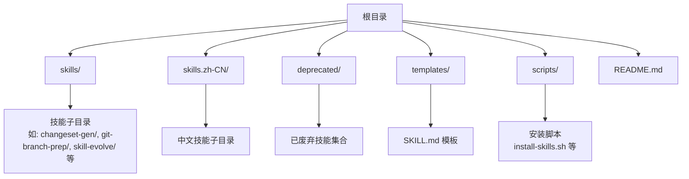
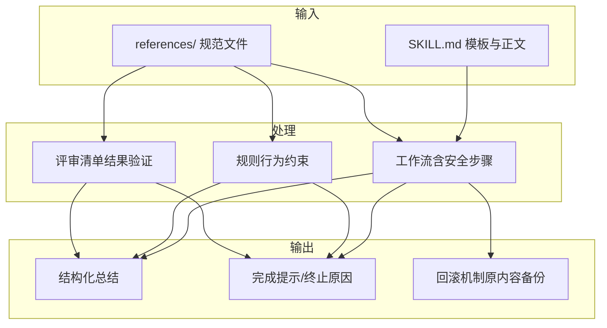
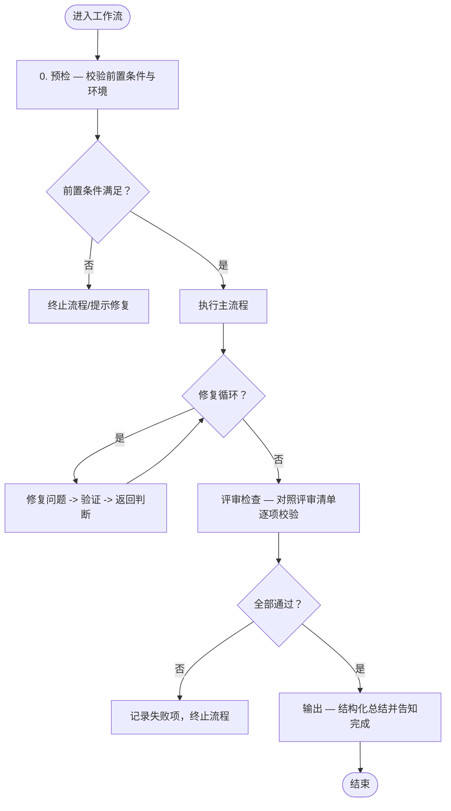
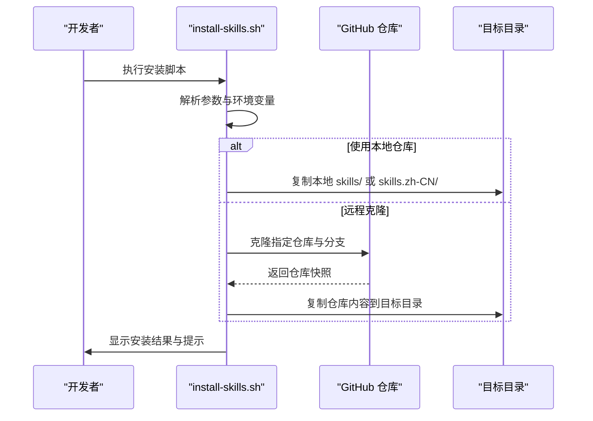
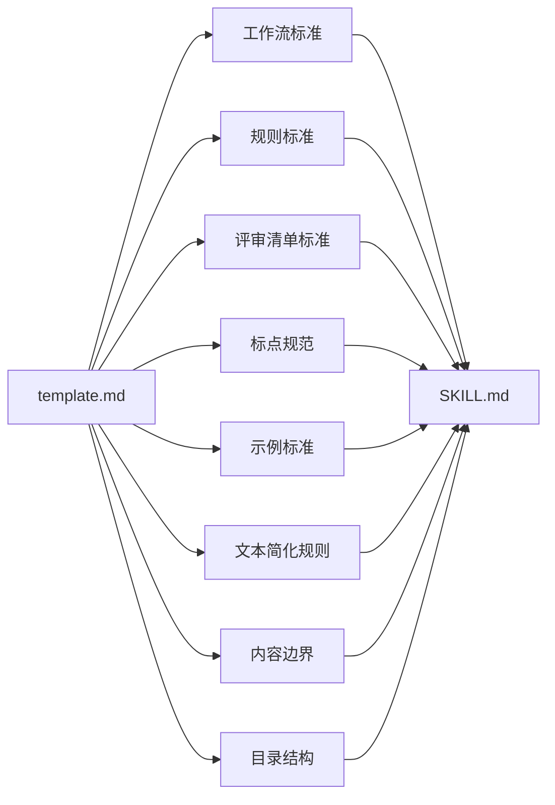

# 开发规范

<cite>
**本文引用的文件**
- [README.md](file://README.md)
- [templates/SKILL.md](file://templates/SKILL.md)
- [skills/skill-evolve/template.md](file://skills/skill-evolve/template.md)
- [skills/skill-evolve/SKILL.md](file://skills/skill-evolve/SKILL.md)
- [skills/skill-create/SKILL.md](file://skills/skill-create/SKILL.md)
- [skills/skill-evolve/references/workflow-standard.md](file://skills/skill-evolve/references/workflow-standard.md)
- [skills/skill-evolve/references/rules-standard.md](file://skills/skill-evolve/references/rules-standard.md)
- [skills/skill-evolve/references/review-list-standard.md](file://skills/skill-evolve/references/review-list-standard.md)
- [skills/skill-evolve/references/punctuation-convention.md](file://skills/skill-evolve/references/punctuation-convention.md)
- [skills/skill-evolve/references/example-standard.md](file://skills/skill-evolve/references/example-standard.md)
- [skills/skill-evolve/references/text-optimization.md](file://skills/skill-evolve/references/text-optimization.md)
- [skills/skill-evolve/references/content-boundary.md](file://skills/skill-evolve/references/content-boundary.md)
- [skills/skill-evolve/references/directory-structure.md](file://skills/skill-evolve/references/directory-structure.md)
- [.markdownlint.json](file://.markdownlint.json)
- [scripts/install-skills.sh](file://scripts/install-skills.sh)
</cite>

## 目录
1. [引言](#引言)
2. [项目结构](#项目结构)
3. [核心组件](#核心组件)
4. [架构总览](#架构总览)
5. [详细组件分析](#详细组件分析)
6. [依赖关系分析](#依赖关系分析)
7. [性能与可维护性考量](#性能与可维护性考量)
8. [故障排查指南](#故障排查指南)
9. [结论](#结论)
10. [附录](#附录)

## 引言
本开发规范面向“Skills Collection”项目中的技能开发者，旨在建立统一的 SKILL.md 编写标准与质量保证体系。规范覆盖 SKILL.md 结构标准、工作流（Workflow）编写规范、分支逻辑标准、标点与示例标准、评审清单标准，并提供自动化工具使用指南与最佳实践建议，帮助开发者高效产出高质量技能文档与可执行流程。

## 项目结构
项目采用“技能即自包含目录”的组织方式，每个技能以独立目录存放，根目录提供安装与使用说明，模板与参考规范集中于 skill-evolve 的 references 子目录，便于统一演进与复用。

图表来源
- [README.md:1-113](file://README.md#L1-L113)
- [templates/SKILL.md:1-30](file://templates/SKILL.md#L1-L30)

章节来源
- [README.md:1-113](file://README.md#L1-L113)
- [templates/SKILL.md:1-30](file://templates/SKILL.md#L1-L30)

## 核心组件
- SKILL.md 模板与标准结构：定义八段式标准结构（概述、定义、前置条件、工作流、规则、示例、评审清单、参考），确保一致性与可演进性。
- 参考规范集：通过 references 下的标准化文件（工作流、规则、评审清单、标点、示例、文本简化、内容边界、目录结构）约束写作与格式。
- 自动化工具链：安装脚本与安装流程，支持本地与远程仓库两种安装模式，语言选择与冲突处理。
- 典型技能范例：skill-evolve 与 skill-create 提供完整的结构、交互、评审与输出示例，作为编写与校验的参照。

章节来源
- [skills/skill-evolve/template.md:1-247](file://skills/skill-evolve/template.md#L1-L247)
- [skills/skill-evolve/references/workflow-standard.md:1-180](file://skills/skill-evolve/references/workflow-standard.md#L1-L180)
- [skills/skill-evolve/references/rules-standard.md:1-58](file://skills/skill-evolve/references/rules-standard.md#L1-L58)
- [skills/skill-evolve/references/review-list-standard.md:1-35](file://skills/skill-evolve/references/review-list-standard.md#L1-L35)
- [skills/skill-evolve/references/punctuation-convention.md:1-187](file://skills/skill-evolve/references/punctuation-convention.md#L1-L187)
- [skills/skill-evolve/references/example-standard.md:1-53](file://skills/skill-evolve/references/example-standard.md#L1-L53)
- [skills/skill-evolve/references/text-optimization.md:1-165](file://skills/skill-evolve/references/text-optimization.md#L1-L165)
- [skills/skill-evolve/references/content-boundary.md:1-32](file://skills/skill-evolve/references/content-boundary.md#L1-L32)
- [skills/skill-evolve/references/directory-structure.md:1-46](file://skills/skill-evolve/references/directory-structure.md#L1-L46)
- [scripts/install-skills.sh:1-146](file://scripts/install-skills.sh#L1-L146)

## 架构总览
规范的“输入-处理-输出”闭环由以下要素构成：
- 输入：SKILL.md（含模板与参考规范）
- 处理：工作流（含安全步骤）、规则（行为约束）、评审清单（结果验证）
- 输出：结构化总结与完成提示，必要时回滚至预检查基线

图表来源
- [skills/skill-evolve/template.md:1-247](file://skills/skill-evolve/template.md#L1-L247)
- [skills/skill-evolve/references/workflow-standard.md:1-180](file://skills/skill-evolve/references/workflow-standard.md#L1-L180)
- [skills/skill-evolve/references/rules-standard.md:1-58](file://skills/skill-evolve/references/rules-standard.md#L1-L58)
- [skills/skill-evolve/references/review-list-standard.md:1-35](file://skills/skill-evolve/references/review-list-standard.md#L1-L35)

## 详细组件分析

### SKILL.md 结构标准
- 标准结构：概述、定义、前置条件、工作流、规则、示例、评审清单、参考。
- 内容边界：非规则类内容归入 references/，避免 SKILL.md 过长与职责不清。
- 目录结构：支持 scripts/、references/、assets/、tests/、schemas/ 等扩展目录，按需启用。

章节来源
- [skills/skill-evolve/template.md:6-247](file://skills/skill-evolve/template.md#L6-L247)
- [skills/skill-evolve/references/content-boundary.md:7-32](file://skills/skill-evolve/references/content-boundary.md#L7-L32)
- [skills/skill-evolve/references/directory-structure.md:7-46](file://skills/skill-evolve/references/directory-structure.md#L7-L46)

### 工作流（Workflow）编写规范
- 安全步骤三件套：预检（第0步）、评审检查（倒数第二步）、输出（最后一步）。AI 自动补齐缺失步骤并重排编号。
- 步骤编号：从 0 开始递增；子步骤优先使用无序列表缩进，需要交叉引用或循环跳转时使用数字编号（如 3.1、4.2）。
- 条件分支：树状箭头格式（Yes -> / No ->），每条分支必须显式结束（next step; / terminate flow; / return N.M;）。
- 循环与迭代：明确循环边界；多元素迭代需逐项说明处理路径。
- 交互模式：所有涉及用户决策的交互必须使用 AskUserQuestion 工具，选项结构化传入，不超过 4 问。

图表来源
- [skills/skill-evolve/references/workflow-standard.md:19-180](file://skills/skill-evolve/references/workflow-standard.md#L19-L180)

章节来源
- [skills/skill-evolve/references/workflow-standard.md:19-180](file://skills/skill-evolve/references/workflow-standard.md#L19-L180)

### 分支逻辑书写规范
- 统一使用树状箭头格式，分支终点必须显式标注 flow 控制语义。
- 正负极性一致：条件应使用正向表达（是否存在/是否满足），避免“不满足”类负极性条件导致分支歧义。
- 并列分支拆分为独立块，避免将多个条件压缩在同一行。
- 规则文件自身必须通过自身的验证清单，确保示例与规则一致。

章节来源
- [skills/skill-evolve/references/workflow-standard.md:379-780](file://skills/skill-evolve/references/workflow-standard.md#L379-L780)

### 标点与语言符号规范
- 中文正文使用全角标点与引号，英文正文使用半角标点与引号；代码块、内联代码与路径始终使用半角。
- 分支逻辑标记：终止符“；”、子操作引入符“：”、方向箭头“->”（半角），禁止使用全角箭头。
- 特殊符号：双向箭头“↔”仅用于定义等价映射；省略号“……”用于中文省略，技术上下文用“...”。

章节来源
- [skills/skill-evolve/references/punctuation-convention.md:1-187](file://skills/skill-evolve/references/punctuation-convention.md#L1-L187)

### 示例标准
- 三类示例：对话交互示例、评审检查示例、输出示例。
- 评审检查示例：展示代表性通过项与完整失败场景，运行时逐项输出，失败时显式终止。
- 示例一致性：示例内容与规则保持一致，步骤名称与工作流同步更新，数值使用通用示例值，避免绑定实际状态。

章节来源
- [skills/skill-evolve/references/example-standard.md:1-53](file://skills/skill-evolve/references/example-standard.md#L1-L53)

### 文本简化与安全边界
- 四条简化规则：正向命令转换、删除冗余动词、省略自解释内容、语义去重合并。
- 执行策略：低风险优先，高风险不确定时保留原文；与工作流展开格式冲突时，优先保留展开。
- 白名单：包含 AskUserQuestion 的交互句不受简化影响。

章节来源
- [skills/skill-evolve/references/text-optimization.md:1-165](file://skills/skill-evolve/references/text-optimization.md#L1-L165)

### 规则与评审清单标准
- 规则：约束 AI 执行行为（过程），内容边界为元数据、结构、内容、行为、防御、验证。
- 评审清单：验证输出质量（结果），与规则遵循关注分离，不强制一一对应但需对齐维度。
- 变量声明：跨步骤变量在定义处以锚点形式声明，初始化在预检步骤，读取通过锚点链接引用。

章节来源
- [skills/skill-evolve/references/rules-standard.md:1-58](file://skills/skill-evolve/references/rules-standard.md#L1-L58)
- [skills/skill-evolve/references/review-list-standard.md:1-35](file://skills/skill-evolve/references/review-list-standard.md#L1-L35)

### 内容边界与目录结构
- 内容归属：工作流结构、标点、文本简化、示例格式、目录结构、规则与评审清单分别归属不同参考文件。
- 目录结构：标准包含 SKILL.md、scripts/、references/、assets/、tests/、schemas/，按需启用。

章节来源
- [skills/skill-evolve/references/content-boundary.md:1-32](file://skills/skill-evolve/references/content-boundary.md#L1-L32)
- [skills/skill-evolve/references/directory-structure.md:1-46](file://skills/skill-evolve/references/directory-structure.md#L1-L46)

### 自动化工具使用指南
- 安装脚本：支持远程克隆与本地仓库两种源，自动扫描可用技能、处理覆盖冲突、复制到目标目录。
- 环境变量：SKILLS_DIR 可覆盖默认安装路径；支持语言选择（中文/英文）。
- 使用流程：先选择语言源，再批量安装或跳过已存在项，完成后清理临时目录。

图表来源
- [scripts/install-skills.sh:1-146](file://scripts/install-skills.sh#L1-L146)

章节来源
- [scripts/install-skills.sh:1-146](file://scripts/install-skills.sh#L1-L146)

### 典型技能范例对比
- skill-evolve：完整演示“结构演进”流程，包含预检、元数据修正、结构对齐、格式统一、内容精简、参考拆分、评审检查、输出总结。
- skill-create：完整演示“从零创建”流程，包含预检、需求收集、目录创建、草稿撰写、辅助目录评估、用户复审、评审检查、输出总结。

章节来源
- [skills/skill-evolve/SKILL.md:1-371](file://skills/skill-evolve/SKILL.md#L1-L371)
- [skills/skill-create/SKILL.md:1-447](file://skills/skill-create/SKILL.md#L1-L447)

## 依赖关系分析
- 规范依赖：SKILL.md 的工作流、规则、评审清单均依赖 references/ 下的标准化文件；模板文件（template.md）为结构对齐基准。
- 互操作依赖：技能之间通过 references/ 文件共享约定，避免重复定义；评审清单可锚定到各参考文件的验证清单。
- 质量保障：通过“格式统一检查”与“评审清单”形成闭环，确保规则与实现一致。

图表来源
- [skills/skill-evolve/template.md:1-247](file://skills/skill-evolve/template.md#L1-L247)
- [skills/skill-evolve/references/workflow-standard.md:1-180](file://skills/skill-evolve/references/workflow-standard.md#L1-L180)
- [skills/skill-evolve/references/rules-standard.md:1-58](file://skills/skill-evolve/references/rules-standard.md#L1-L58)
- [skills/skill-evolve/references/review-list-standard.md:1-35](file://skills/skill-evolve/references/review-list-standard.md#L1-L35)
- [skills/skill-evolve/references/punctuation-convention.md:1-187](file://skills/skill-evolve/references/punctuation-convention.md#L1-L187)
- [skills/skill-evolve/references/example-standard.md:1-53](file://skills/skill-evolve/references/example-standard.md#L1-L53)
- [skills/skill-evolve/references/text-optimization.md:1-165](file://skills/skill-evolve/references/text-optimization.md#L1-L165)
- [skills/skill-evolve/references/content-boundary.md:1-32](file://skills/skill-evolve/references/content-boundary.md#L1-L32)
- [skills/skill-evolve/references/directory-structure.md:1-46](file://skills/skill-evolve/references/directory-structure.md#L1-L46)

章节来源
- [skills/skill-evolve/template.md:1-247](file://skills/skill-evolve/template.md#L1-L247)
- [skills/skill-evolve/references/workflow-standard.md:1-180](file://skills/skill-evolve/references/workflow-standard.md#L1-L180)
- [skills/skill-evolve/references/rules-standard.md:1-58](file://skills/skill-evolve/references/rules-standard.md#L1-L58)
- [skills/skill-evolve/references/review-list-standard.md:1-35](file://skills/skill-evolve/references/review-list-standard.md#L1-L35)
- [skills/skill-evolve/references/punctuation-convention.md:1-187](file://skills/skill-evolve/references/punctuation-convention.md#L1-L187)
- [skills/skill-evolve/references/example-standard.md:1-53](file://skills/skill-evolve/references/example-standard.md#L1-L53)
- [skills/skill-evolve/references/text-optimization.md:1-165](file://skills/skill-evolve/references/text-optimization.md#L1-L165)
- [skills/skill-evolve/references/content-boundary.md:1-32](file://skills/skill-evolve/references/content-boundary.md#L1-L32)
- [skills/skill-evolve/references/directory-structure.md:1-46](file://skills/skill-evolve/references/directory-structure.md#L1-L46)

## 性能与可维护性考量
- 内容体量控制：SKILL.md 建议不超过 300 行，超限时迁移至 references/ 并更新链接。
- 交互与分支：使用树状箭头与显式分支终点，减少 AI 推断负担，提升执行确定性。
- 规范自检：通过 references/ 各文件的验证清单进行自检，降低人工审查成本。
- 目录结构：按需启用扩展目录，避免冗余层级增加维护成本。

## 故障排查指南
- 安装阶段
  - 症状：安装脚本报未知选项或覆盖确认失败
  - 处理：检查脚本参数与环境变量，确认覆盖确认流程
- 评审阶段
  - 症状：评审清单某项未通过
  - 处理：对照对应参考文件的验证清单逐项检查，修正后重新执行评审
- 工作流执行
  - 症状：分支逻辑未覆盖或分支终点缺失
  - 处理：补充 Yes/No 分支与显式 flow 控制语句，确保每条路径有明确终点
- 格式问题
  - 症状：标点混用或符号不一致
  - 处理：依据标点规范统一全角/半角、引号类型与箭头符号

章节来源
- [scripts/install-skills.sh:1-146](file://scripts/install-skills.sh#L1-L146)
- [skills/skill-evolve/references/punctuation-convention.md:174-187](file://skills/skill-evolve/references/punctuation-convention.md#L174-L187)
- [skills/skill-evolve/references/workflow-standard.md:580-780](file://skills/skill-evolve/references/workflow-standard.md#L580-L780)

## 结论
通过统一的 SKILL.md 结构、严谨的工作流与分支逻辑、严格的标点与示例规范、完善的规则与评审清单以及可复用的参考文件与自动化工具链，本规范为技能开发者提供了从“创建—演进—评审—发布”的全生命周期质量保障体系。建议在每次修改后，结合 references/ 的验证清单进行自检，确保变更符合标准并具备可维护性。

## 附录
- 快速参考
  - 结构：Overview、Definitions、Prerequisites、Workflow、Rules、Examples、Review List、References
  - 安全步骤：Pre-check、Review Check、Output
  - 分支：Yes -> / No ->，显式终止 next step; / terminate flow; / return N.M;
  - 标点：中文全角、英文半角；分支终止“；”、子操作引入“：”、方向箭头“->”
  - 示例：对话交互、评审检查、输出示例三类，评审检查需逐项输出并失败终止
  - 自动化：install-skills.sh 支持远程克隆与本地仓库、语言选择与冲突处理

章节来源
- [skills/skill-evolve/template.md:6-247](file://skills/skill-evolve/template.md#L6-L247)
- [skills/skill-evolve/references/workflow-standard.md:19-180](file://skills/skill-evolve/references/workflow-standard.md#L19-L180)
- [skills/skill-evolve/references/punctuation-convention.md:1-187](file://skills/skill-evolve/references/punctuation-convention.md#L1-L187)
- [skills/skill-evolve/references/example-standard.md:1-53](file://skills/skill-evolve/references/example-standard.md#L1-L53)
- [scripts/install-skills.sh:1-146](file://scripts/install-skills.sh#L1-L146)