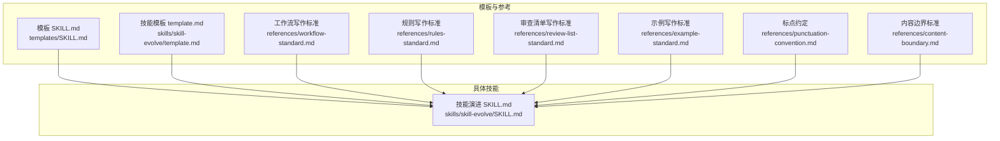
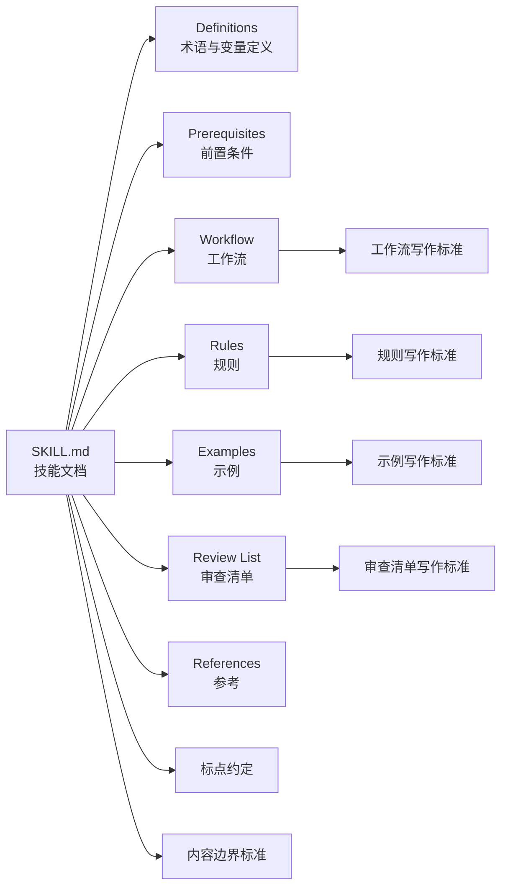
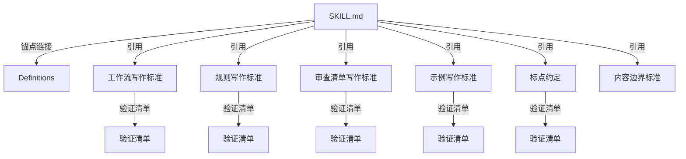

# 文档格式规范

<cite>
**本文引用的文件**
- [README.md](file://README.md)
- [模板 SKILL.md](file://templates/SKILL.md)
- [技能模板 template.md](file://skills/skill-evolve/template.md)
- [技能演进 SKILL.md](file://skills/skill-evolve/SKILL.md)
- [工作流写作标准 workflow-standard.md](file://skills/skill-evolve/references/workflow-standard.md)
- [规则写作标准 rules-standard.md](file://skills/skill-evolve/references/rules-standard.md)
- [审查清单写作标准 review-list-standard.md](file://skills/skill-evolve/references/review-list-standard.md)
- [示例写作标准 example-standard.md](file://skills/skill-evolve/references/example-standard.md)
- [内容边界标准 content-boundary.md](file://skills/skill-evolve/references/content-boundary.md)
- [标点约定 punctuation-convention.md](file://skills/skill-evolve/references/punctuation-convention.md)
</cite>

## 目录
1. [简介](#简介)
2. [项目结构](#项目结构)
3. [核心组件](#核心组件)
4. [架构总览](#架构总览)
5. [详细组件分析](#详细组件分析)
6. [依赖分析](#依赖分析)
7. [性能考虑](#性能考虑)
8. [故障排查指南](#故障排查指南)
9. [结论](#结论)
10. [附录](#附录)

## 简介
本规范旨在为 Skills Collection 项目的 SKILL.md 文档建立统一、可维护、可自动化的格式标准。通过明确标题命名、子步骤编号、条件分支、标点符号、引用与示例等规范，确保所有技能文档在结构、表达与一致性上达到工程化水平，便于 AI 学习与自动化工具处理。

## 项目结构
本项目以“技能模板 + 参考规范”的方式组织 SKILL.md 的编写与校验：
- 模板 SKILL.md 与技能模板 template.md 提供通用结构与示例骨架
- references 下的各标准文件定义工作流、规则、审查清单、示例、标点等规范
- 具体技能 SKILL.md 严格遵循模板与参考规范

图表来源
- [模板 SKILL.md:1-30](file://templates/SKILL.md#L1-L30)
- [技能模板 template.md:1-247](file://skills/skill-evolve/template.md#L1-L247)
- [工作流写作标准 workflow-standard.md:1-993](file://skills/skill-evolve/references/workflow-standard.md#L1-L993)
- [规则写作标准 rules-standard.md:1-58](file://skills/skill-evolve/references/rules-standard.md#L1-L58)
- [审查清单写作标准 review-list-standard.md:1-35](file://skills/skill-evolve/references/review-list-standard.md#L1-L35)
- [示例写作标准 example-standard.md:1-53](file://skills/skill-evolve/references/example-standard.md#L1-L53)
- [标点约定 punctuation-convention.md:1-187](file://skills/skill-evolve/references/punctuation-convention.md#L1-L187)
- [内容边界标准 content-boundary.md:1-32](file://skills/skill-evolve/references/content-boundary.md#L1-L32)
- [技能演进 SKILL.md:1-371](file://skills/skill-evolve/SKILL.md#L1-L371)

章节来源
- [README.md:1-113](file://README.md#L1-L113)
- [模板 SKILL.md:1-30](file://templates/SKILL.md#L1-L30)
- [技能模板 template.md:1-247](file://skills/skill-evolve/template.md#L1-L247)
- [技能演进 SKILL.md:1-371](file://skills/skill-evolve/SKILL.md#L1-L371)

## 核心组件
- 标题命名格式：N. **标题** — 描述;（强调“标题”使用粗体、短语、使用中文破折号连接）
- 子步骤编号系统：常规使用项目符号；需要定位引用时使用 N.M 数字编号
- 条件分支格式：树形箭头格式（Yes -> / No ->），每条分支动作行以全角分号结尾，非终止行以全角冒号引入子操作
- 标点符号规范：中文正文使用全角标点与中文引号，英文正文使用半角标点与英文引号；代码块、内联代码、路径始终使用半角
- 引用与锚点：使用锚点链接精准引用 Definitions 与各参考文件的验证清单
- 示例与审查：示例必须与 Rules 和 Workflow 保持一致，审查清单聚焦结果质量而非行为约束

章节来源
- [工作流写作标准 workflow-standard.md:185-378](file://skills/skill-evolve/references/workflow-standard.md#L185-L378)
- [标点约定 punctuation-convention.md:13-187](file://skills/skill-evolve/references/punctuation-convention.md#L13-L187)
- [审查清单写作标准 review-list-standard.md:1-35](file://skills/skill-evolve/references/review-list-standard.md#L1-L35)
- [示例写作标准 example-standard.md:1-53](file://skills/skill-evolve/references/example-standard.md#L1-L53)

## 架构总览
下图展示 SKILL.md 的结构与参考规范之间的关系，以及各标准如何约束内容边界与一致性：

图表来源
- [技能模板 template.md:16-247](file://skills/skill-evolve/template.md#L16-L247)
- [工作流写作标准 workflow-standard.md:1-993](file://skills/skill-evolve/references/workflow-standard.md#L1-L993)
- [规则写作标准 rules-standard.md:1-58](file://skills/skill-evolve/references/rules-standard.md#L1-L58)
- [审查清单写作标准 review-list-standard.md:1-35](file://skills/skill-evolve/references/review-list-standard.md#L1-L35)
- [示例写作标准 example-standard.md:1-53](file://skills/skill-evolve/references/example-standard.md#L1-L53)
- [标点约定 punctuation-convention.md:1-187](file://skills/skill-evolve/references/punctuation-convention.md#L1-L187)
- [内容边界标准 content-boundary.md:1-32](file://skills/skill-evolve/references/content-boundary.md#L1-L32)

## 详细组件分析

### 标题命名与结构
- 标题格式：N. **标题** — 描述;（中文破折号、结尾分号）
- 结构建议：按 Definitions → Prerequisites → Workflow → Rules → Examples → Review List → References 的顺序组织
- 与模板对齐：严格遵循模板中的段落职责与锚点链接规范

章节来源
- [工作流写作标准 workflow-standard.md:215-241](file://skills/skill-evolve/references/workflow-standard.md#L215-L241)
- [技能模板 template.md:16-247](file://skills/skill-evolve/template.md#L16-L247)

### 子步骤编号系统
- 常规子步骤：使用项目符号缩进（-），层级缩进 2 空格
- 需要定位引用的子步骤：使用 N.M 数字编号（如 4.1、4.2），用于跨步骤跳转或文档内引用
- 循环与迭代：明确循环边界与返回点，避免模糊表述

章节来源
- [工作流写作标准 workflow-standard.md:189-314](file://skills/skill-evolve/references/workflow-standard.md#L189-L314)

### 条件分支格式（树形箭头）
- 使用 Yes -> / No -> 表达二元分支，每条分支动作行以全角分号结尾
- 非终止分支以全角冒号引入子操作列表，子操作行以全角分号结尾
- 明确分支终点：next step / terminate flow / 返回到指定子步骤
- 正向条件：使用正向条件语义（是否存在、是否满足），避免负向条件导致歧义

章节来源
- [工作流写作标准 workflow-standard.md:379-686](file://skills/skill-evolve/references/workflow-standard.md#L379-L686)

### 标点符号与引号风格
- 中文正文：全角标点（。、，、：、；、（）、《》）、中文引号（""、''）
- 英文正文：半角标点（.、,、:、;、()）、英文引号（""、''）
- 代码块、内联代码、路径：始终使用半角符号
- 特殊符号：全角 em dash 仅用于标题分隔（两侧空格），bidirectional arrow ↔ 仅用于 Definitions 等价映射

章节来源
- [标点约定 punctuation-convention.md:13-187](file://skills/skill-evolve/references/punctuation-convention.md#L13-L187)

### 引用与锚点
- Definitions 中的术语与变量需提供锚点（<a id="...">），并在文档中使用 [术语](#锚点) 的锚点链接
- Rules 与 Review List 中的检查项可通过锚点引用对应参考文件的“验证清单”
- References 与 references/ 文件的归属需遵循内容边界标准

章节来源
- [内容边界标准 content-boundary.md:1-32](file://skills/skill-evolve/references/content-boundary.md#L1-L32)
- [技能模板 template.md:16-247](file://skills/skill-evolve/template.md#L16-L247)

### 示例与审查清单
- 示例类型：对话交互示例、审查清单示例、输出示例
- 审查清单：聚焦结果质量，不包含行为约束；可使用锚点引用参考文件的验证清单
- 一致性：示例与 Rules、Workflow 保持一致，数值使用通用示例值，避免与文件状态强绑定

章节来源
- [示例写作标准 example-standard.md:1-53](file://skills/skill-evolve/references/example-standard.md#L1-L53)
- [审查清单写作标准 review-list-standard.md:1-35](file://skills/skill-evolve/references/review-list-standard.md#L1-L35)

### 规则与分组
- 规则范围：元数据、结构、内容、行为、防御、验证
- 分组建议：≥10 条目采用两级缩进分组；与审查清单分组保持一致
- 变量声明：跨步骤全局变量需在 Definitions 中声明并初始化

章节来源
- [规则写作标准 rules-standard.md:1-58](file://skills/skill-evolve/references/rules-standard.md#L1-L58)

### 工作流自动补全与安全步骤
- 安全步骤：Pre-check（预检查）、Review Check（审查检查）、Output（输出）
- 自动补全：若缺失，AI 将自动插入并重排编号；失败处理原则明确
- 重试机制：迭代修复需设置上限与降级策略

章节来源
- [工作流写作标准 workflow-standard.md:19-184](file://skills/skill-evolve/references/workflow-standard.md#L19-L184)

## 依赖分析
- 内容边界：SKILL.md 与 references/ 文件的职责划分清晰，避免重复与越界
- 规范自洽：各参考文件自身需通过“验证清单”，保证示例与规则的一致性
- 互引用：通过锚点与“验证清单”实现弱耦合的引用与复用

图表来源
- [内容边界标准 content-boundary.md:1-32](file://skills/skill-evolve/references/content-boundary.md#L1-L32)
- [工作流写作标准 workflow-standard.md:1-993](file://skills/skill-evolve/references/workflow-standard.md#L1-L993)
- [规则写作标准 rules-standard.md:1-58](file://skills/skill-evolve/references/rules-standard.md#L1-L58)
- [审查清单写作标准 review-list-standard.md:1-35](file://skills/skill-evolve/references/review-list-standard.md#L1-L35)
- [示例写作标准 example-standard.md:1-53](file://skills/skill-evolve/references/example-standard.md#L1-L53)
- [标点约定 punctuation-convention.md:1-187](file://skills/skill-evolve/references/punctuation-convention.md#L1-L187)

章节来源
- [内容边界标准 content-boundary.md:1-32](file://skills/skill-evolve/references/content-boundary.md#L1-L32)

## 性能考虑
- 减少冗余内容：通过“内容简化规则”压缩空白与重复信息
- 合理拆分：将复杂逻辑迁移到 references/ 并更新链接，降低单文件体积
- 自动化校验：利用“验证清单”与锚点引用，减少人工核对成本

## 故障排查指南
常见格式错误与修正方法：
- 错误：中文正文使用半角标点或英文引号
  - 修正：统一使用全角标点与中文引号
- 错误：分支行未以全角分号结尾或未标注 Yes/No
  - 修正：每条分支动作行以全角分号结尾；明确 Yes/No 分支
- 错误：使用全角箭头 → 或半角箭头 -> 混用
  - 修正：统一使用半角箭头 ->，标题分隔使用中文破折号
- 错误：示例未包裹在代码块或与 Rules 不一致
  - 修正：示例统一包裹在代码块；与 Rules、Workflow 保持一致
- 错误：审查清单包含行为约束或未使用锚点引用
  - 修正：审查清单仅验证结果质量；使用锚点引用参考文件验证清单

章节来源
- [标点约定 punctuation-convention.md:141-187](file://skills/skill-evolve/references/punctuation-convention.md#L141-L187)
- [工作流写作标准 workflow-standard.md:687-764](file://skills/skill-evolve/references/workflow-standard.md#L687-L764)
- [示例写作标准 example-standard.md:41-53](file://skills/skill-evolve/references/example-standard.md#L41-L53)
- [审查清单写作标准 review-list-standard.md:28-35](file://skills/skill-evolve/references/review-list-standard.md#L28-L35)

## 结论
通过统一的标题命名、子步骤编号、条件分支、标点符号与引用规范，结合“验证清单”与锚点链接，SKILL.md 能够在结构、表达与一致性上达到工程化标准，便于 AI 学习与自动化工具处理。建议在编写与评审过程中，优先对照参考文件的“验证清单”，确保格式与内容的合规性。

## 附录

### 输出示例（结构与内容）
- 输出示例应包含维度对比与总结性陈述，避免省略未通过项
- 与“输出示例标准”保持一致，使用表格形式呈现量化指标

章节来源
- [示例写作标准 example-standard.md:22-28](file://skills/skill-evolve/references/example-standard.md#L22-L28)

### 审查清单示例（分组与锚点）
- 审查清单按质量维度分组，与规则分组保持一致
- 可通过锚点引用参考文件的“验证清单”，避免重复

章节来源
- [审查清单写作标准 review-list-standard.md:22-35](file://skills/skill-evolve/references/review-list-standard.md#L22-L35)

### 工作流示例（自动补全与安全步骤）
- 自动补全：缺失的 Pre-check、Review Check、Output 将被自动插入并重排编号
- 安全步骤：Pre-check、Review Check、Output 的职责与结构固定

章节来源
- [工作流写作标准 workflow-standard.md:119-184](file://skills/skill-evolve/references/workflow-standard.md#L119-L184)

### 标点符号使用规范（要点）
- 中文正文：全角标点与中文引号；英文正文：半角标点与英文引号
- 代码块、内联代码、路径：始终半角
- 特殊符号：全角 em dash 仅用于标题分隔；bidirectional arrow 仅用于等价映射

章节来源
- [标点约定 punctuation-convention.md:13-140](file://skills/skill-evolve/references/punctuation-convention.md#L13-L140)