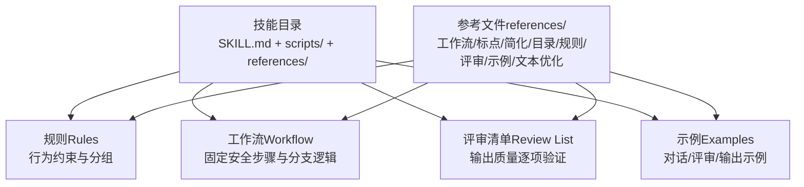
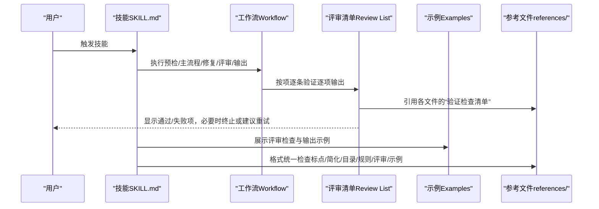
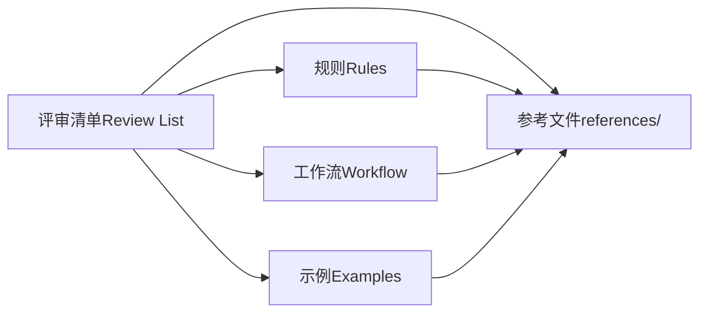

# 评审规范

<cite>
**本文引用的文件**
- [README.md](file://README.md)
- [review-list-standard.md](file://skills/skill-evolve/references/review-list-standard.md)
- [rules-standard.md](file://skills/skill-evolve/references/rules-standard.md)
- [workflow-standard.md](file://skills/skill-evolve/references/workflow-standard.md)
- [example-standard.md](file://skills/skill-evolve/references/example-standard.md)
- [punctuation-convention.md](file://skills/skill-evolve/references/punctuation-convention.md)
- [text-optimization.md](file://skills/skill-evolve/references/text-optimization.md)
- [content-boundary.md](file://skills/skill-evolve/references/content-boundary.md)
- [directory-structure.md](file://skills/skill-evolve/references/directory-structure.md)
- [template.md](file://skills/skill-evolve/template.md)
- [SKILL.md（skill-evolve）](file://skills/skill-evolve/SKILL.md)
- [SKILL.md（git-cleanup）](file://skills/git-cleanup/SKILL.md)
- [SKILL.md（git-commit-helper）](file://skills/git-commit-helper/SKILL.md)
</cite>

## 目录
1. [引言](#引言)
2. [项目结构](#项目结构)
3. [核心组件](#核心组件)
4. [架构总览](#架构总览)
5. [详细组件分析](#详细组件分析)
6. [依赖关系分析](#依赖关系分析)
7. [性能考量](#性能考量)
8. [故障排查指南](#故障排查指南)
9. [结论](#结论)
10. [附录](#附录)

## 引言
本文件面向 Skills Collection 项目，系统化构建“评审规范”，聚焦于“评审清单（Review List）”的编写与使用。评审清单用于在技能执行完成后，对输出质量进行逐项验证，确保技能行为符合预期、内容结构合规、交互与防御机制完备。本文从评审清单的标准格式、分类与分组、检查标准、判定逻辑，到在技能开发中的作用与价值（质量量化、执行验证、问题追踪），提供可操作的规范与最佳实践，并给出不同技能类型的评审关注点与示例路径，帮助团队建立一致、可复用、可演进的质量保障体系。

## 项目结构
Skills Collection 以“技能（Skill）”为最小交付单元，每个技能目录包含：
- 核心执行说明：SKILL.md
- 可选脚本：scripts/
- 可选资源：assets/、tests/、schemas/
- 可选参考：references/（按主题拆分的规范与标准）

评审规范的核心依据来自 skill-evolve 技能与其参考文件，围绕“规则（Rules）—工作流（Workflow）—评审清单（Review List）—示例（Examples）”四要素协同运作，形成闭环的质量控制。

图表来源
- [SKILL.md（skill-evolve）:153-171](file://skills/skill-evolve/SKILL.md#L153-L171)
- [template.md:53-76](file://skills/skill-evolve/template.md#L53-L76)
- [content-boundary.md:7-19](file://skills/skill-evolve/references/content-boundary.md#L7-L19)

章节来源
- [README.md:1-113](file://README.md#L1-L113)
- [content-boundary.md:1-32](file://skills/skill-evolve/references/content-boundary.md#L1-L32)

## 核心组件
- 规则（Rules）：约束 AI 执行行为（过程），定义元数据、结构、内容、行为、防御、验证六大维度的分组与标准，强调“过程约束、行为规范”。
- 工作流（Workflow）：定义技能执行步骤，包含三类“安全步骤”（Pre-check、Review Check、Output），明确编号、标题、子步骤、条件分支、循环迭代与跨步引用。
- 评审清单（Review List）：验证输出质量（结果），覆盖元数据、结构、内容、行为、防御、验证等维度，强调“结果验证、过程约束由规则与工作流保证”。
- 示例（Examples）：提供对话交互、评审检查、输出示例的格式与一致性要求，确保评审与输出可复现、可对照。

章节来源
- [rules-standard.md:1-58](file://skills/skill-evolve/references/rules-standard.md#L1-L58)
- [workflow-standard.md:1-118](file://skills/skill-evolve/references/workflow-standard.md#L1-L118)
- [review-list-standard.md:1-35](file://skills/skill-evolve/references/review-list-standard.md#L1-L35)
- [example-standard.md:1-53](file://skills/skill-evolve/references/example-standard.md#L1-L53)

## 架构总览
评审规范的运行架构以“规则—工作流—评审清单—示例”为核心闭环，配合“参考文件”统一标准与检查项，形成可演进的质量基线。

图表来源
- [SKILL.md（skill-evolve）:153-171](file://skills/skill-evolve/SKILL.md#L153-L171)
- [workflow-standard.md:65-83](file://skills/skill-evolve/references/workflow-standard.md#L65-L83)
- [review-list-standard.md:28-35](file://skills/skill-evolve/references/review-list-standard.md#L28-L35)
- [example-standard.md:14-27](file://skills/skill-evolve/references/example-standard.md#L14-L27)

## 详细组件分析

### 评审清单（Review List）标准与类型适配
- 内容边界：评审清单仅验证“输出质量（结果）”，不包含 AI 行为约束（归 Rules）、执行步骤描述（归 Workflow）。
- 类型适配：
  - 元技能（修改/校验 SKILL.md 的技能，如 skill-evolve、skill-create）：评审包含文件结构检查（元数据、标准章节、安全步骤、一致性）。
  - 领域/动作技能（执行具体任务的技能，如 git-cleanup、git-commit-helper）：仅验证输出/结果质量，不包含自身文件结构检查。
- 分组建议：按质量维度分组，与规则分组方案保持一致（元数据/结构/内容/行为/防御/验证）。
- 引用策略：优先使用锚点引用（避免重复），当检查项仅适用于当前技能或需要特定上下文时才内联。

章节来源
- [review-list-standard.md:3-35](file://skills/skill-evolve/references/review-list-standard.md#L3-L35)
- [rules-standard.md:12-25](file://skills/skill-evolve/references/rules-standard.md#L12-L25)
- [template.md:194-229](file://skills/skill-evolve/template.md#L194-L229)

### 评审清单的检查标准与判定逻辑
- 质量维度与检查项：
  - 元数据检查：名称匹配父目录、描述格式（触发条件、第三人称、长度限制）、非标准字段保护。
  - 结构检查：拆分后内容完整性对比、扩展目录评估、安全步骤完整性、无中断优化痕迹、自排除判断、References 同步。
  - 内容检查：行数上限、时间敏感信息清理、文本简化一致性、链接与锚点、跨文件引用、术语一致性、标点规范、跨步引用格式、缩进、示例包裹。
  - 行为检查：交互范式、分支逻辑、步骤职责独立、文件删除安全、编辑范围合规。
  - 防御检查：错误处理完整（可恢复/不可恢复）。
  - 验证检查：评审清单覆盖面、规则与评审清单关注分离、评审检查示例存在、示例与工作流同步、计数一致性、示例数字解耦、示例范围限制、工作流覆盖绑定规则、示例自洽、参考文件自洽、退出路径完整、终止原因标注、变量声明完整。
- 判定逻辑：
  - 逐项输出：评审过程中必须逐项输出结果，不得省略为“其余通过”。
  - 失败处理：任一失败即终止流程，提示用户选择重试/跳过/终止；可恢复错误记录在报告中，不可恢复错误触发回滚。
  - 终止标记：所有强制终止路径（缺失目标、不可恢复错误等）需在输出报告中标注终止原因。

章节来源
- [SKILL.md（skill-evolve）:153-171](file://skills/skill-evolve/SKILL.md#L153-L171)
- [SKILL.md（skill-evolve）:306-358](file://skills/skill-evolve/SKILL.md#L306-L358)
- [rules-standard.md:43-58](file://skills/skill-evolve/references/rules-standard.md#L43-L58)

### 不同技能类型的评审关注点与示例路径
- 元技能（skill-evolve）：
  - 关注点：模板对齐、章节顺序、References 同步、拆分完整性、安全步骤、术语与锚点、抽象变量替换、自演化场景下的模板同步。
  - 示例路径：评审检查示例、输出示例、验证检查清单。
- 动作技能（git-cleanup）：
  - 关注点：扫描与确认、统一执行、远程同步、异常处理与回滚、统计报表、脏工作区自动跳过、受保护分支过滤。
  - 示例路径：评审检查示例、输出示例、异常处理示例。
- 动作技能（git-commit-helper）：
  - 关注点：变更分析、候选生成、断言标记（Breaking Change）、Issue 关联、英文规范、字数与格式约束。
  - 示例路径：评审检查示例、输出示例、候选多选项示例。

章节来源
- [SKILL.md（skill-evolve）:306-358](file://skills/skill-evolve/SKILL.md#L306-L358)
- [SKILL.md（git-cleanup）:425-449](file://skills/git-cleanup/SKILL.md#L425-L449)
- [SKILL.md（git-commit-helper）:270-292](file://skills/git-commit-helper/SKILL.md#L270-L292)

### 评审清单在技能开发中的作用与价值
- 质量标准量化：通过“检查项清单 + 通过/失败状态 + 逐项输出”的方式，将主观质量转化为可度量指标。
- 执行结果验证：在技能完成执行后，对关键输出进行对照验证，确保行为与期望一致。
- 问题发现与修复跟踪：失败项明确标注、终止流程提示、回滚与重试机制，便于定位与修复。
- 规范一致性：评审清单与规则、工作流、示例、参考文件形成“关注分离、相互印证”的质量闭环。

章节来源
- [example-standard.md:14-27](file://skills/skill-evolve/references/example-standard.md#L14-L27)
- [punctuation-convention.md:1-187](file://skills/skill-evolve/references/punctuation-convention.md#L1-L187)
- [text-optimization.md:1-165](file://skills/skill-evolve/references/text-optimization.md#L1-L165)

### 评审流程最佳实践
- 评审时机：
  - 在工作流末尾插入“评审检查”步骤，确保所有前置步骤完成后进行验证。
  - 对于可恢复错误，允许用户选择重试；对于不可恢复错误，立即回滚并终止。
- 结果记录与处理：
  - 逐项输出评审结果，失败项明确标注并记录在优化报告中。
  - 终止流程时，清晰标注终止原因，指导用户后续操作。
- 持续改进：
  - 将评审清单与规则、工作流、示例、参考文件的“验证检查清单”对齐，定期回顾与更新。
  - 自动化格式统一检查（标点、简化、目录结构、锚点完整性），减少人工负担。

章节来源
- [workflow-standard.md:65-83](file://skills/skill-evolve/references/workflow-standard.md#L65-L83)
- [SKILL.md（skill-evolve）:153-171](file://skills/skill-evolve/SKILL.md#L153-L171)
- [directory-structure.md:21-31](file://skills/skill-evolve/references/directory-structure.md#L21-L31)

## 依赖关系分析
评审清单与规则、工作流、示例、参考文件之间存在强关联，遵循“关注分离”原则：规则约束行为，工作流定义步骤，评审清单验证结果，示例提供可复现范式，参考文件统一标准。

图表来源
- [rules-standard.md:43-58](file://skills/skill-evolve/references/rules-standard.md#L43-L58)
- [workflow-standard.md:1-118](file://skills/skill-evolve/references/workflow-standard.md#L1-L118)
- [example-standard.md:1-53](file://skills/skill-evolve/references/example-standard.md#L1-L53)
- [content-boundary.md:7-19](file://skills/skill-evolve/references/content-boundary.md#L7-L19)

章节来源
- [content-boundary.md:1-32](file://skills/skill-evolve/references/content-boundary.md#L1-L32)

## 性能考量
- 评审清单的逐项输出会增加执行时间，但可通过“锚点引用 + 自动化检查”降低重复劳动。
- 文本简化与标点规范有助于缩短 SKILL.md 长度，提升可读性与维护性。
- 目录结构与 references/ 文件规范化，减少跨文件查找成本，提高评审效率。

## 故障排查指南
- 常见问题与处理：
  - 评审失败：逐项查看失败项，根据提示选择重试、跳过或终止；若为可恢复错误，记录在报告中；若为不可恢复错误，触发回滚并终止。
  - 锚点缺失：检查术语定义与锚点链接是否一致，确保 Definitions 中的术语具备对应锚点。
  - 引用级别越界：references/ 文件不应直接链接外部资源，避免超过一级引用。
  - 示例与工作流不同步：更新示例中的步骤名称与计数，确保与最新工作流一致。
- 回滚与恢复：
  - 当发生不可恢复错误时，使用预检阶段保存的原始内容副本进行回滚，并告知用户恢复结果。

章节来源
- [SKILL.md（skill-evolve）:208-214](file://skills/skill-evolve/SKILL.md#L208-L214)
- [SKILL.md（skill-evolve）:153-171](file://skills/skill-evolve/SKILL.md#L153-L171)

## 结论
评审清单是 Skills Collection 质量保障体系的关键抓手，通过标准化的格式、清晰的分组、严格的检查与判定逻辑，实现“结果可验证、过程可追溯、问题可修复”。结合规则、工作流、示例与参考文件的协同，评审清单能够持续演进，支撑技能的高质量交付与长期维护。

## 附录
- 评审清单编写示例路径（供参考，不展示具体内容）：
  - 元技能评审清单示例：[SKILL.md（skill-evolve）:306-358](file://skills/skill-evolve/SKILL.md#L306-L358)
  - 动作技能评审清单示例（git-cleanup）：[SKILL.md（git-cleanup）:425-449](file://skills/git-cleanup/SKILL.md#L425-L449)
  - 动作技能评审清单示例（git-commit-helper）：[SKILL.md（git-commit-helper）:270-292](file://skills/git-commit-helper/SKILL.md#L270-L292)
- 参考文件与标准：
  - 规则编写标准：[rules-standard.md:1-58](file://skills/skill-evolve/references/rules-standard.md#L1-L58)
  - 工作流编写标准：[workflow-standard.md:1-118](file://skills/skill-evolve/references/workflow-standard.md#L1-L118)
  - 评审清单编写标准：[review-list-standard.md:1-35](file://skills/skill-evolve/references/review-list-standard.md#L1-L35)
  - 示例编写标准：[example-standard.md:1-53](file://skills/skill-evolve/references/example-standard.md#L1-L53)
  - 标点使用约定：[punctuation-convention.md:1-187](file://skills/skill-evolve/references/punctuation-convention.md#L1-L187)
  - 文本简化规则：[text-optimization.md:1-165](file://skills/skill-evolve/references/text-optimization.md#L1-L165)
  - 内容边界划分：[content-boundary.md:1-32](file://skills/skill-evolve/references/content-boundary.md#L1-L32)
  - 目录结构规范：[directory-structure.md:1-46](file://skills/skill-evolve/references/directory-structure.md#L1-L46)
  - 模板与标准章节：[template.md:1-247](file://skills/skill-evolve/template.md#L1-L247)