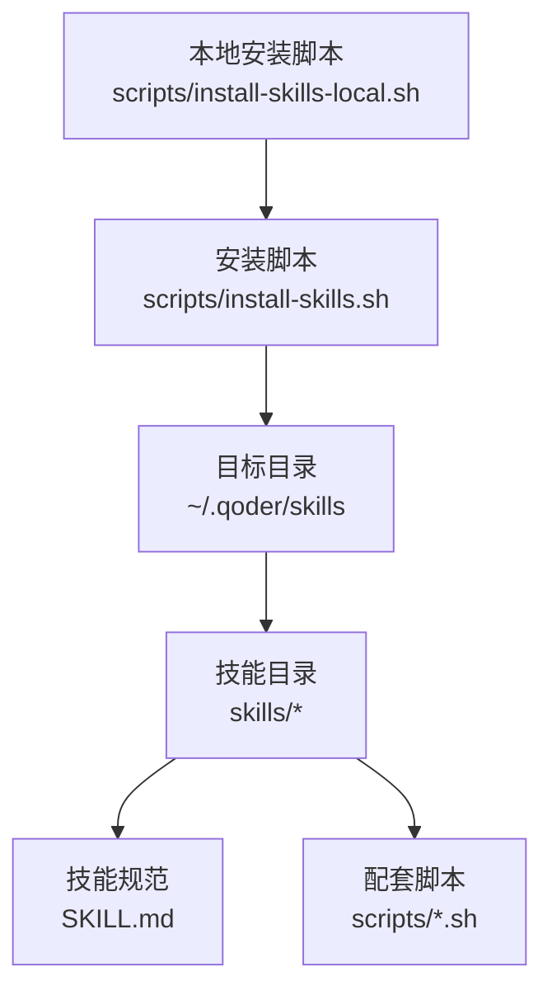
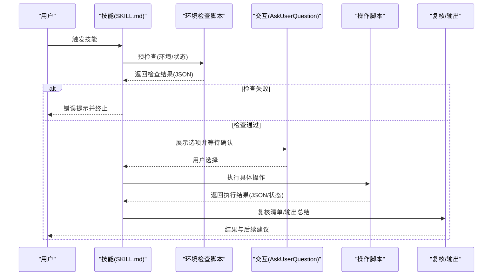
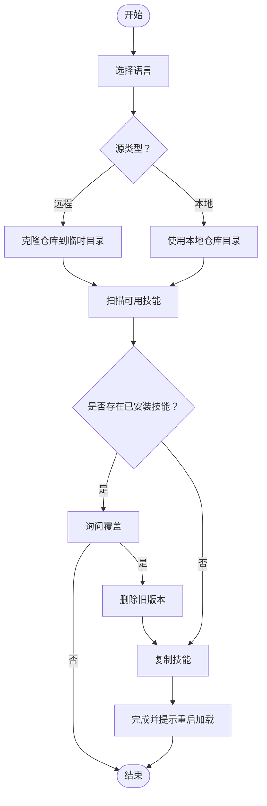
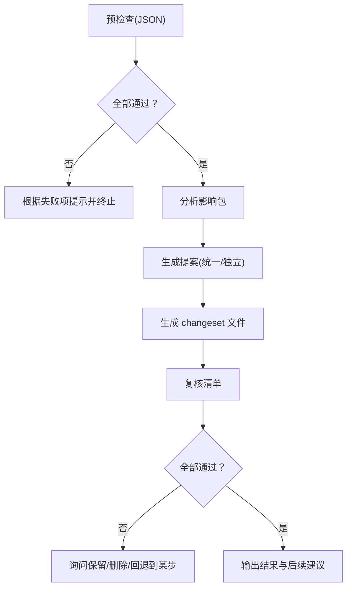
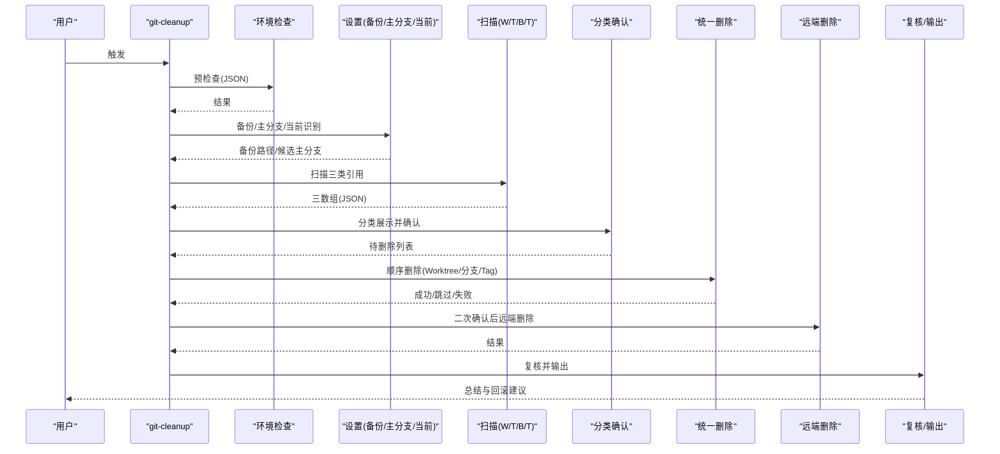
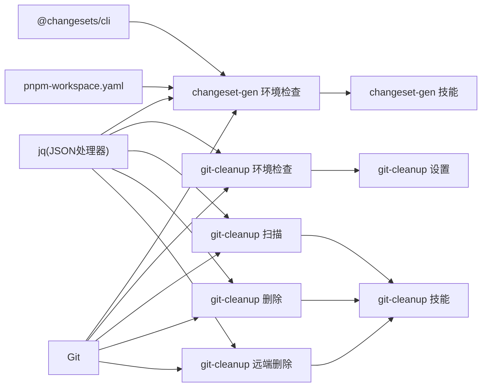

# 调试与故障排除

<cite>
**本文引用的文件**
- [README.md](file://README.md)
- [README.zh-CN.md](file://README.zh-CN.md)
- [install-skills.sh](file://scripts/install-skills.sh)
- [install-skills-local.sh](file://scripts/install-skills-local.sh)
- [changeset-gen 环境检查脚本](file://skills/changeset-gen/scripts/check-env.sh)
- [git-cleanup 环境检查脚本](file://skills/git-cleanup/scripts/check-env.sh)
- [git-cleanup 综合扫描脚本](file://skills/git-cleanup/scripts/scan.sh)
- [git-cleanup 删除脚本](file://skills/git-cleanup/scripts/delete.sh)
- [git-cleanup 设置脚本](file://skills/git-cleanup/scripts/setup.sh)
- [git-cleanup 远端删除脚本](file://skills/git-cleanup/scripts/remote-delete.sh)
- [changeset-gen 技能说明](file://skills/changeset-gen/SKILL.md)
- [git-cleanup 技能说明](file://skills/git-cleanup/SKILL.md)
- [git-branch-prep 技能说明](file://skills/git-branch-prep/SKILL.md)
- [git-commit-helper 技能说明](file://skills/git-commit-helper/SKILL.md)
- [skill-evolve 技能说明](file://skills/skill-evolve/SKILL.md)
</cite>

## 目录
1. [简介](#简介)
2. [项目结构](#项目结构)
3. [核心组件](#核心组件)
4. [架构总览](#架构总览)
5. [详细组件分析](#详细组件分析)
6. [依赖关系分析](#依赖关系分析)
7. [性能考虑](#性能考虑)
8. [故障排除指南](#故障排除指南)
9. [结论](#结论)
10. [附录](#附录)

## 简介
本指南面向开发者与使用者，聚焦 Skills Collection 项目的调试与故障排除。内容覆盖环境配置、技能执行失败、权限与网络问题、日志与错误追踪、性能优化与常见陷阱，并提供系统化的排查步骤与最佳实践。

## 项目结构
Skills Collection 以“技能”为最小可执行单元，每个技能目录包含：
- SKILL.md：技能规范与工作流说明
- scripts/：配套 Bash 脚本（如环境检查、扫描、删除、设置、远端删除等）

安装流程通过脚本将技能复制到目标目录（默认 ~/.qoder/skills），并支持本地或远程仓库安装。

图表来源
- [install-skills.sh:1-146](file://scripts/install-skills.sh#L1-L146)
- [install-skills-local.sh:1-16](file://scripts/install-skills-local.sh#L1-L16)

章节来源
- [README.md: 22-64:22-64](file://README.md#L22-L64)
- [README.zh-CN.md: 22-64:22-64](file://README.zh-CN.md#L22-L64)

## 核心组件
- 安装与环境准备
  - 安装脚本负责语言选择、冲突检测、复制技能、清理临时资源
  - 环境检查脚本统一校验 jq、Git 版本、工作区状态、必要配置项
- Git 清理技能
  - 包含环境检查、备份、扫描（Worktree/分支/Tag）、确认与统一删除、远端同步
- Changeset 生成技能
  - 基于暂存变更分析影响包，生成 changeset 文件，支持统一/独立提案模式
- 其他技能
  - 分支准备、提交助手、技能演进等，均遵循一致的交互与验证规范

章节来源
- [install-skills.sh: 1-L146:1-146](file://scripts/install-skills.sh#L1-L146)
- [install-skills-local.sh: 1-L16:1-16](file://scripts/install-skills-local.sh#L1-L16)
- [changeset-gen 环境检查脚本: 1-L115:1-115](file://skills/changeset-gen/scripts/check-env.sh#L1-L115)
- [git-cleanup 环境检查脚本: 1-L67:1-67](file://skills/git-cleanup/scripts/check-env.sh#L1-L67)
- [git-cleanup 综合扫描脚本: 1-L112:1-112](file://skills/git-cleanup/scripts/scan.sh#L1-L112)
- [git-cleanup 删除脚本: 1-L86:1-86](file://skills/git-cleanup/scripts/delete.sh#L1-L86)
- [git-cleanup 设置脚本: 1-L56:1-56](file://skills/git-cleanup/scripts/setup.sh#L1-L56)
- [git-cleanup 远端删除脚本: 1-L59:1-59](file://skills/git-cleanup/scripts/remote-delete.sh#L1-L59)

## 架构总览
技能执行链路通常包含：预检查（环境/状态）→ 交互确认 → 执行操作 → 复核与输出。Git 清理技能采用“扫描-确认-统一执行-远端同步”的两阶段删除策略；Changeset 生成技能采用“分析-提案-生成-复核-输出”。

图表来源
- [git-cleanup 技能说明: 36-L172:36-172](file://skills/git-cleanup/SKILL.md#L36-L172)
- [changeset-gen 技能说明: 29-L130:29-130](file://skills/changeset-gen/SKILL.md#L29-L130)

## 详细组件分析

### 安装与环境准备
- 安装脚本行为要点
  - 支持本地仓库与远程仓库两种源
  - 语言选择（英文/中文）
  - 冲突检测与覆盖确认
  - 复制技能并清理临时目录
- 环境检查脚本通用逻辑
  - 校验 jq 是否可用
  - 校验 Git 仓库与版本
  - 校验必要配置（如 pnpm changeset、workspace 配置）
  - 输出 JSON 结构化结果，便于上层解析

图表来源
- [install-skills.sh: 58-L146:58-146](file://scripts/install-skills.sh#L58-L146)

章节来源
- [install-skills.sh: 1-L146:1-146](file://scripts/install-skills.sh#L1-L146)
- [install-skills-local.sh: 1-L16:1-16](file://scripts/install-skills-local.sh#L1-L16)

### Changeset 生成技能
- 关键流程
  - 预检查：环境检查脚本返回 JSON，逐项解读
  - 分析影响包：基于 staged 变更与 workspace 配置
  - 生成提案：统一/独立两种模式
  - 生成文件：随机唯一文件名，写入 changeset 内容
  - 复核与输出：对照清单检查，输出结果与后续建议
- 常见失败点
  - 无暂存变更
  - 缺少 .changeset 或 @changesets/cli
  - 缺失 pnpm-workspace.yaml 或 packages 字段
  - jq 不可用

图表来源
- [changeset-gen 技能说明: 29-L130:29-130](file://skills/changeset-gen/SKILL.md#L29-L130)
- [changeset-gen 环境检查脚本: 1-L115:1-115](file://skills/changeset-gen/scripts/check-env.sh#L1-L115)

章节来源
- [changeset-gen 技能说明: 21-L139:21-139](file://skills/changeset-gen/SKILL.md#L21-L139)
- [changeset-gen 环境检查脚本: 17-L115:17-115](file://skills/changeset-gen/scripts/check-env.sh#L17-L115)

### Git 清理技能
- 关键流程
  - 预检查：环境检查脚本返回 JSON
  - 设置：备份、主分支候选、当前 Worktree/分支识别
  - 扫描：Worktree/分支/Tag 三类，按规则过滤（受保护分支、当前分支、dirty 状态等）
  - 确认：分类展示表格，支持全选/部分/跳过
  - 统一执行：按 Worktree→Branch→Tag 顺序删除，记录成功/跳过/失败
  - 远端同步：二次确认后批量删除远端分支与 Tag
  - 异常处理：备份存在时提供恢复指引
  - 复核与输出：统计本地/远端删除结果，给出回滚建议
- 防御机制
  - dirty Worktree 自动跳过
  - 受保护分支自动跳过
  - 当前分支与当前 Worktree 自动跳过
  - 二次确认才进行远端删除

图表来源
- [git-cleanup 技能说明: 36-L172:36-172](file://skills/git-cleanup/SKILL.md#L36-L172)
- [git-cleanup 环境检查脚本: 1-L67:1-67](file://skills/git-cleanup/scripts/check-env.sh#L1-L67)
- [git-cleanup 设置脚本: 1-L56:1-56](file://skills/git-cleanup/scripts/setup.sh#L1-L56)
- [git-cleanup 综合扫描脚本: 1-L112:1-112](file://skills/git-cleanup/scripts/scan.sh#L1-L112)
- [git-cleanup 删除脚本: 1-L86:1-86](file://skills/git-cleanup/scripts/delete.sh#L1-L86)
- [git-cleanup 远端删除脚本: 1-L59:1-59](file://skills/git-cleanup/scripts/remote-delete.sh#L1-L59)

章节来源
- [git-cleanup 技能说明: 28-L194:28-194](file://skills/git-cleanup/SKILL.md#L28-L194)
- [git-cleanup 环境检查脚本: 17-L67:17-67](file://skills/git-cleanup/scripts/check-env.sh#L17-L67)
- [git-cleanup 综合扫描脚本: 26-L112:26-112](file://skills/git-cleanup/scripts/scan.sh#L26-L112)
- [git-cleanup 删除脚本: 27-L86:27-86](file://skills/git-cleanup/scripts/delete.sh#L27-L86)
- [git-cleanup 远端删除脚本: 25-L59:25-59](file://skills/git-cleanup/scripts/remote-delete.sh#L25-L59)

### 分支准备与提交助手
- 分支准备
  - 调用提交助手生成消息 → 推导分支名 → 确认分支与推送 → 生成 PR 链接
  - 强制跳过钩子提交，避免 pre-commit/prepare-commit-msg 干扰
- 提交助手
  - 支持多种输入源（暂存区/单次提交/分支范围/对话 diff）
  - 严格遵循 Conventional Commits 规范，多候选生成与优化
  - 交互必须使用 AskUserQuestion，确保一致性与可审计性

章节来源
- [git-branch-prep 技能说明: 24-L108:24-108](file://skills/git-branch-prep/SKILL.md#L24-L108)
- [git-commit-helper 技能说明: 30-L165:30-165](file://skills/git-commit-helper/SKILL.md#L30-L165)

### 技能演进
- 对现有 SKILL.md 进行结构对齐、格式标准化、内容瘦身、参考文档拆分
- 严格遵循安全步骤（预检查、复核、输出），并提供防御性回滚与错误处理

章节来源
- [skill-evolve 技能说明: 30-L214:30-214](file://skills/skill-evolve/SKILL.md#L30-L214)

## 依赖关系分析
- 外部依赖
  - jq：所有脚本输出/解析 JSON 的基础
  - Git：所有 Git 相关技能的基础
  - pnpm changeset：changeset-gen 技能的必要条件
- 内部依赖
  - 各技能的 scripts/check-env.sh 作为统一入口，返回标准化 JSON
  - git-cleanup 的 scan/delete/remote-delete 之间通过 JSON 数组传递待删除对象
  - 分支准备依赖提交助手生成的消息

图表来源
- [changeset-gen 环境检查脚本: 7-L115:7-115](file://skills/changeset-gen/scripts/check-env.sh#L7-L115)
- [git-cleanup 环境检查脚本: 7-L67:7-67](file://skills/git-cleanup/scripts/check-env.sh#L7-L67)
- [git-cleanup 综合扫描脚本: 7-L112:7-112](file://skills/git-cleanup/scripts/scan.sh#L7-L112)
- [git-cleanup 删除脚本: 7-L86:7-86](file://skills/git-cleanup/scripts/delete.sh#L7-L86)
- [git-cleanup 远端删除脚本: 7-L59:7-59](file://skills/git-cleanup/scripts/remote-delete.sh#L7-L59)

章节来源
- [changeset-gen 环境检查脚本: 7-L115:7-115](file://skills/changeset-gen/scripts/check-env.sh#L7-L115)
- [git-cleanup 环境检查脚本: 7-L67:7-67](file://skills/git-cleanup/scripts/check-env.sh#L7-L67)

## 性能考虑
- 脚本层面
  - 使用 jq 进行 JSON 解析与拼接，避免复杂正则；注意在大仓库场景下扫描与删除的 IO 开销
  - 统一执行阶段按 Worktree→Branch→Tag 顺序，减少频繁切换
  - 远端删除采用二次确认，避免重复网络往返
- 交互层面
  - 使用 AskUserQuestion 进行一次性确认，减少多次交互成本
  - Changeset 生成前自动暂存变更，避免重复计算
- 最佳实践
  - 在大型仓库中优先使用“扫描-确认-统一执行”模式，降低交互次数
  - 对于频繁执行的任务，建议先在小范围内验证流程与参数

## 故障排除指南

### 一、环境配置问题
- 症状
  - 脚本报错提示缺少 jq
  - Git 版本过低
  - 非 Git 仓库或不在受保护分支
- 排查步骤
  - 安装 jq 并确保 PATH 生效
  - 升级 Git 至 2.0+
  - 确认当前目录为 Git 仓库，且当前分支在受保护列表内
- 相关文件
  - 环境检查脚本会输出 JSON，包含每项检查结果与版本信息

章节来源
- [changeset-gen 环境检查脚本: 7-L115:7-115](file://skills/changeset-gen/scripts/check-env.sh#L7-L115)
- [git-cleanup 环境检查脚本: 7-L67:7-67](file://skills/git-cleanup/scripts/check-env.sh#L7-L67)

### 二、技能执行失败
- Changeset 生成
  - 无暂存变更：先执行暂存再运行
  - 缺失 .changeset 或 @changesets/cli：安装并配置 changeset
  - 缺失 pnpm-workspace.yaml 或 packages 字段：补充配置
- Git 清理
  - 扫描为空：确认是否存在 stale 引用或被保护分支过多导致跳过
  - 删除失败：查看失败原因，必要时尝试强制删除（Worktree）
  - 远端删除异常：检查网络与权限，二次确认后再执行
- 分支准备
  - 提交失败：检查是否使用 NO_VERIFY=1 跳过钩子
  - 推送失败：检查远端分支存在性与同步状态，必要时 rebase

章节来源
- [changeset-gen 技能说明: 29-L130:29-130](file://skills/changeset-gen/SKILL.md#L29-L130)
- [git-cleanup 技能说明: 36-L172:36-172](file://skills/git-cleanup/SKILL.md#L36-L172)
- [git-branch-prep 技能说明: 62-L82:62-82](file://skills/git-branch-prep/SKILL.md#L62-L82)

### 三、权限与网络问题
- 远端删除失败
  - 检查 SSH/HTTPS 凭据与权限
  - 确认远程名为 origin
- 安装脚本失败
  - 本地安装需确保仓库完整可读
  - 远程安装需网络可达

章节来源
- [git-cleanup 技能说明: 34-L35:34-35](file://skills/git-cleanup/SKILL.md#L34-L35)
- [install-skills.sh: 48-L56:48-56](file://scripts/install-skills.sh#L48-L56)

### 四、日志分析与错误追踪
- 统一输出格式
  - 所有脚本以 JSON 形式输出检查/扫描/删除/远端删除结果
  - 上层技能解析 JSON 并渲染为表格或结构化输出
- 建议流程
  - 预检查阶段记录失败项与原因
  - 删除阶段记录成功/跳过/失败明细
  - 远端阶段记录推送结果与失败原因
- 复核清单
  - 使用技能自带的 Review List 对比执行结果，定位未通过项

章节来源
- [changeset-gen 环境检查脚本: 105-L115:105-115](file://skills/changeset-gen/scripts/check-env.sh#L105-L115)
- [git-cleanup 综合扫描脚本: 102-L112:102-112](file://skills/git-cleanup/scripts/scan.sh#L102-L112)
- [git-cleanup 删除脚本: 81-L86:81-86](file://skills/git-cleanup/scripts/delete.sh#L81-L86)
- [git-cleanup 远端删除脚本: 55-L59:55-59](file://skills/git-cleanup/scripts/remote-delete.sh#L55-L59)

### 五、异常退出与回滚
- 场景
  - 删除过程中异常中断
  - 远端删除失败
- 处理
  - 若备份创建成功，按备份恢复示例执行回滚
  - 若无备份，记录已执行的操作并手动修复

章节来源
- [git-cleanup 技能说明: 148-L154:148-154](file://skills/git-cleanup/SKILL.md#L148-L154)
- [git-cleanup 设置脚本: 42-L56:42-56](file://skills/git-cleanup/scripts/setup.sh#L42-L56)

### 六、常见陷阱与预防
- 忽视脏工作区
  - dirty Worktree 会被自动跳过，避免误删
- 跨步循环引用
  - skill-evolve 会对跨步引用进行识别与编号，避免流程混乱
- 交互一致性
  - 所有用户决策必须通过 AskUserQuestion，避免遗漏或不一致

章节来源
- [git-cleanup 技能说明: 194-L198:194-198](file://skills/git-cleanup/SKILL.md#L194-L198)
- [skill-evolve 技能说明: 14-L25:14-25](file://skills/skill-evolve/SKILL.md#L14-L25)

## 结论
通过统一的环境检查、结构化的交互与复核、以及两阶段删除策略，Skills Collection 能够在保证安全的前提下高效完成 Git 清理与变更集生成等任务。遇到问题时，优先检查 jq/Git/仓库状态，结合 JSON 输出与复核清单定位根因，并按备份策略进行回滚或修复。

## 附录

### A. 常用命令与环境变量
- 安装脚本支持的环境变量
  - SKILLS_DIR：目标目录（默认 ~/.qoder/skills）
  - COMMANDS_DIR：命令目录（默认 ~/.agents/commands）
- 一键安装
  - 远程安装：bash <(curl -s https://raw.githubusercontent.com/hz-9/skills/master/scripts/install-skills.sh)
  - 指定目录：SKILLS_DIR=~/.qoder/skills bash <(curl -s https://raw.githubusercontent.com/hz-9/skills/master/scripts/install-skills.sh)

章节来源
- [README.md: 47-L64:47-64](file://README.md#L47-L64)
- [README.zh-CN.md: 47-L64:47-64](file://README.zh-CN.md#L47-L64)

### B. JSON 输出字段说明（示例）
- 环境检查
  - all_passed：布尔值，表示整体是否通过
  - checks：数组，包含各项检查的 name、passed、version/detail 等
- 扫描/删除/远端删除
  - scan：worktrees、branches、tags 三数组
  - delete/remote-delete：results 数组，包含 type/name/status 等

章节来源
- [changeset-gen 环境检查脚本: 105-L115:105-115](file://skills/changeset-gen/scripts/check-env.sh#L105-L115)
- [git-cleanup 综合扫描脚本: 102-L112:102-112](file://skills/git-cleanup/scripts/scan.sh#L102-L112)
- [git-cleanup 删除脚本: 81-L86:81-86](file://skills/git-cleanup/scripts/delete.sh#L81-L86)
- [git-cleanup 远端删除脚本: 55-L59:55-59](file://skills/git-cleanup/scripts/remote-delete.sh#L55-L59)