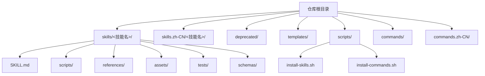
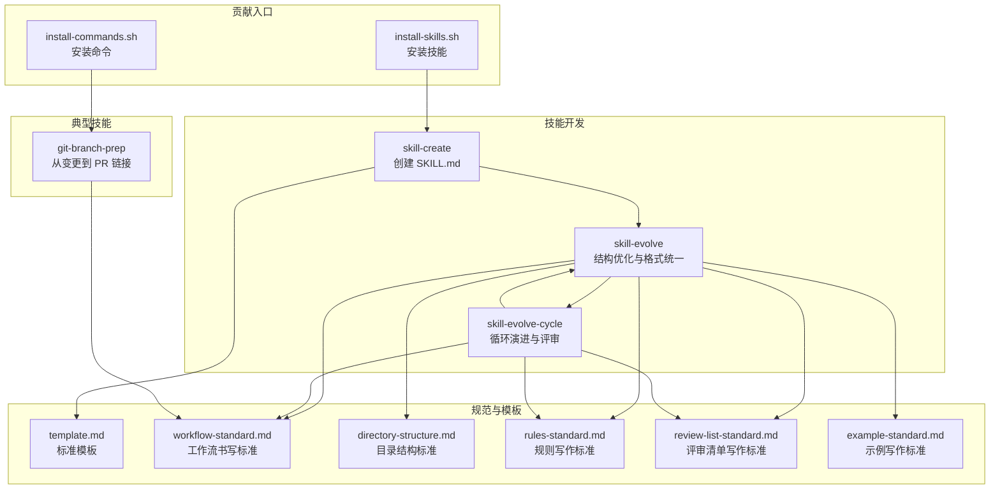
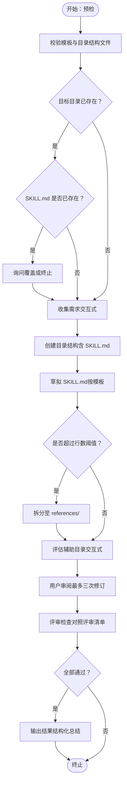
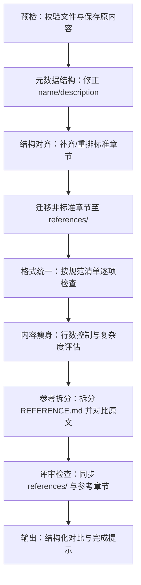
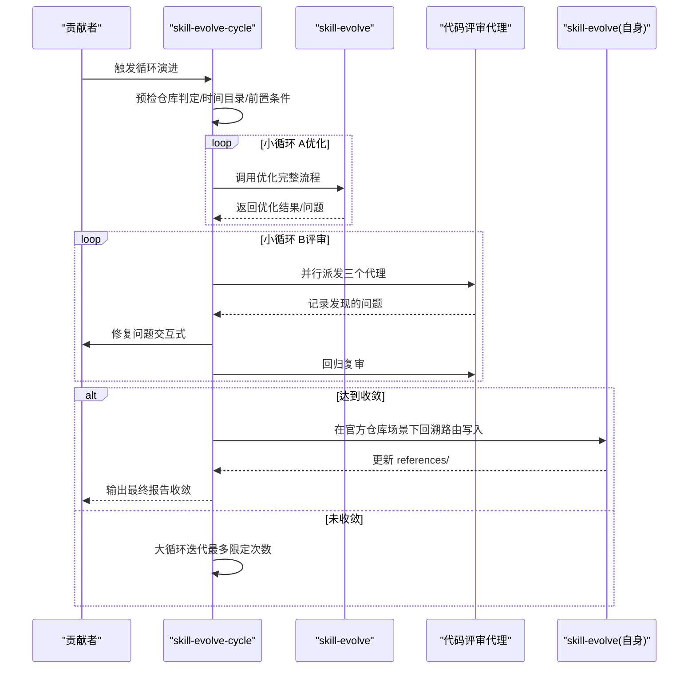
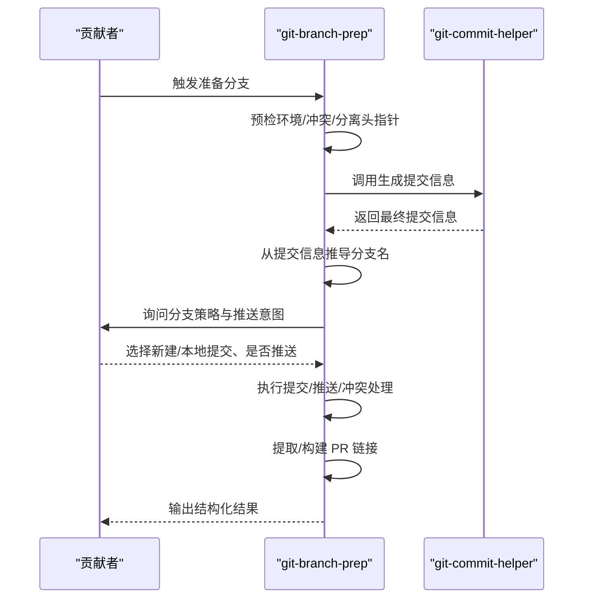
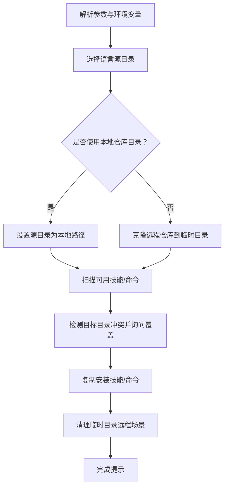
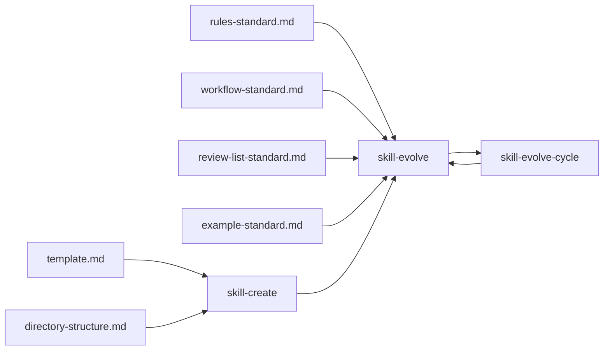

# 贡献流程

<cite>
**本文档引用的文件**
- [README.md](file://README.md)
- [README.zh-CN.md](file://README.zh-CN.md)
- [install-skills.sh](file://scripts/install-skills.sh)
- [install-commands.sh](file://scripts/install-commands.sh)
- [skill-create/SKILL.md](file://skills/skill-create/SKILL.md)
- [skill-evolve/SKILL.md](file://skills/skill-evolve/SKILL.md)
- [skill-evolve-cycle/SKILL.md](file://skills/skill-evolve-cycle/SKILL.md)
- [git-branch-prep/SKILL.md](file://skills/git-branch-prep/SKILL.md)
- [template.md](file://skills/skill-evolve/template.md)
- [workflow-standard.md](file://skills/skill-evolve/references/workflow-standard.md)
- [directory-structure.md](file://skills/skill-evolve/references/directory-structure.md)
- [rules-standard.md](file://skills/skill-evolve/references/rules-standard.md)
- [review-list-standard.md](file://skills/skill-evolve/references/review-list-standard.md)
- [example-standard.md](file://skills/skill-evolve/references/example-standard.md)
</cite>

## 目录
1. [简介](#简介)
2. [项目结构](#项目结构)
3. [核心组件](#核心组件)
4. [架构总览](#架构总览)
5. [详细组件分析](#详细组件分析)
6. [依赖关系分析](#依赖关系分析)
7. [性能考虑](#性能考虑)
8. [故障排查指南](#故障排查指南)
9. [结论](#结论)
10. [附录](#附录)

## 简介
本文件面向希望参与 Skills Collection 项目的贡献者，系统化阐述从“需求分析”到“技能发布”的完整贡献流程，覆盖技能开发、文档编写、代码优化、评审与合并等环节。文档以“标准化模板 + 循环演进 + 自动化工具”为核心，帮助新老贡献者高效协作、保持质量一致性。

## 项目结构
项目采用“技能即自包含目录”的组织方式，每个技能由独立的 SKILL.md 作为核心执行说明，并可按需扩展 scripts/、references/、assets/、tests/、schemas/ 等辅助目录。项目同时提供安装脚本与命令集，便于本地或远程一键部署。

图表来源
- [README.md:1-113](file://README.md#L1-L113)
- [README.zh-CN.md:1-113](file://README.zh-CN.md#L1-L113)

章节来源
- [README.md:1-113](file://README.md#L1-L113)
- [README.zh-CN.md:1-113](file://README.zh-CN.md#L1-L113)

## 核心组件
- 标准模板与规范
  - 标准模板：定义 SKILL.md 的八段式结构（概述、定义、前置条件、工作流、规则、示例、评审清单、参考）。
  - 规范体系：工作流书写标准、目录结构标准、规则写作标准、评审清单写作标准、示例写作标准。
- 技能生命周期
  - skill-create：从零创建技能，遵循模板与目录标准，完成初稿与用户确认。
  - skill-evolve：对既有 SKILL.md 进行结构化优化、内容瘦身、参考文档拆分与格式统一。
  - skill-evolve-cycle：以“优化-评审-修复-合并-回溯”循环驱动的持续演进框架，支持自举与经验沉淀。
- 开发与发布工具
  - 安装脚本：一键安装技能或命令，支持语言选择与覆盖目标目录。
  - 典型技能：如 git-branch-prep，演示从变更分析到分支命名、提交与 PR 链接生成的完整流程。

章节来源
- [template.md:1-247](file://skills/skill-evolve/template.md#L1-L247)
- [directory-structure.md:1-46](file://skills/skill-evolve/references/directory-structure.md#L1-L46)
- [rules-standard.md:1-58](file://skills/skill-evolve/references/rules-standard.md#L1-L58)
- [review-list-standard.md:1-35](file://skills/skill-evolve/references/review-list-standard.md#L1-L35)
- [example-standard.md:1-53](file://skills/skill-evolve/references/example-standard.md#L1-L53)
- [skill-create/SKILL.md:1-447](file://skills/skill-create/SKILL.md#L1-L447)
- [skill-evolve/SKILL.md:1-371](file://skills/skill-evolve/SKILL.md#L1-L371)
- [skill-evolve-cycle/SKILL.md:1-308](file://skills/skill-evolve-cycle/SKILL.md#L1-L308)
- [git-branch-prep/SKILL.md:1-276](file://skills/git-branch-prep/SKILL.md#L1-L276)
- [install-skills.sh:1-146](file://scripts/install-skills.sh#L1-L146)
- [install-commands.sh:1-145](file://scripts/install-commands.sh#L1-L145)

## 架构总览
贡献流程围绕“模板-规范-工具-循环”的闭环展开：贡献者使用 skill-create 产出符合模板的 SKILL.md，再通过 skill-evolve 进行结构与内容优化，必要时进入 skill-evolve-cycle 的多轮评审与修复，最终稳定发布。

图表来源
- [install-skills.sh:1-146](file://scripts/install-skills.sh#L1-L146)
- [install-commands.sh:1-145](file://scripts/install-commands.sh#L1-L145)
- [skill-create/SKILL.md:1-447](file://skills/skill-create/SKILL.md#L1-L447)
- [skill-evolve/SKILL.md:1-371](file://skills/skill-evolve/SKILL.md#L1-L371)
- [skill-evolve-cycle/SKILL.md:1-308](file://skills/skill-evolve-cycle/SKILL.md#L1-L308)
- [git-branch-prep/SKILL.md:1-276](file://skills/git-branch-prep/SKILL.md#L1-L276)
- [template.md:1-247](file://skills/skill-evolve/template.md#L1-L247)
- [workflow-standard.md:1-800](file://skills/skill-evolve/references/workflow-standard.md#L1-L800)
- [directory-structure.md:1-46](file://skills/skill-evolve/references/directory-structure.md#L1-L46)
- [rules-standard.md:1-58](file://skills/skill-evolve/references/rules-standard.md#L1-L58)
- [review-list-standard.md:1-35](file://skills/skill-evolve/references/review-list-standard.md#L1-L35)
- [example-standard.md:1-53](file://skills/skill-evolve/references/example-standard.md#L1-L53)

## 详细组件分析

### 组件一：技能创建（skill-create）
- 目标：从零创建一个符合标准模板与目录结构的 SKILL.md，并通过用户确认与评审检查确保质量。
- 关键流程要点
  - 预检：校验 skill-evolve 的模板与目录结构文件可用性；若目标目录已存在，处理覆盖或终止。
  - 收集需求：通过交互式提问收集技能定位、触发条件、是否需要脚本/参考/资产/模式/测试等。
  - 创建目录结构：依据目录结构标准创建 SKILL.md 与可选目录。
  - 草拟 SKILL.md：按模板顺序组织内容，描述必须遵循“能力+触发条件”的格式，必要时拆分至 references/。
  - 评估辅助目录：逐项确认是否需要 references/、scripts/、assets/、schemas/、tests/。
  - 用户审阅：最多三次修订，超出则自动推进。
  - 评审检查：对照评审清单逐项验证元数据、内容质量、引用层级、一致性与交互规范。
  - 输出结果：结构化总结创建成果（文件、行数、覆盖范围、辅助目录等），通知完成。
- 交互与约束
  - 所有涉及用户决策的步骤必须使用统一的交互工具，且每次调用不超过四个问题。
  - 不允许自行假设，不确定性必须通过交互确认。
  - 评审清单与规则应一一对应，保证可验证性。

图表来源
- [skill-create/SKILL.md:25-87](file://skills/skill-create/SKILL.md#L25-L87)
- [directory-structure.md:7-17](file://skills/skill-evolve/references/directory-structure.md#L7-L17)
- [template.md:37-51](file://skills/skill-evolve/template.md#L37-L51)

章节来源
- [skill-create/SKILL.md:1-447](file://skills/skill-create/SKILL.md#L1-L447)
- [directory-structure.md:1-46](file://skills/skill-evolve/references/directory-structure.md#L1-L46)
- [template.md:1-247](file://skills/skill-evolve/template.md#L1-L247)

### 组件二：技能优化（skill-evolve）
- 目标：对现有 SKILL.md 进行结构对齐、格式统一、内容瘦身与参考拆分，提升可读性与可维护性。
- 关键流程要点
  - 预检：校验目标 SKILL.md、模板与 references/ 引用文件存在性与同步性，保存原内容副本用于回滚。
  - 元数据结构：修正 name 与 description，确保触发条件与第三人称格式。
  - 结构对齐：补齐缺失标准章节，重排顺序；迁移非标准章节至 references/ 并更新内部锚点链接。
  - 格式统一：按各规范文件的“验证清单”逐项检查并修复，删除时效信息，术语一致化。
  - 内容瘦身：控制 SKILL.md 行数，必要时迁移到 references/；根据复杂度评估是否新增辅助目录。
  - 参考拆分：将 REFERENCE.md 拆分为多个文件，对比原文无遗漏后删除原文件。
  - 评审检查：同步 references/ 与“参考”章节，逐项输出检查结果，失败则按“防御标准”处理。
  - 输出：结构化对比优化前后维度，告知完成。
- 防御与验证
  - 所有文件移动/删除操作均需用户确认；错误时回滚至原内容副本。
  - 外部引用检查与锚点完整性审计，避免死链与占位符残留。

图表来源
- [skill-evolve/SKILL.md:30-171](file://skills/skill-evolve/SKILL.md#L30-L171)
- [workflow-standard.md:19-118](file://skills/skill-evolve/references/workflow-standard.md#L19-L118)
- [directory-structure.md:21-31](file://skills/skill-evolve/references/directory-structure.md#L21-L31)

章节来源
- [skill-evolve/SKILL.md:1-371](file://skills/skill-evolve/SKILL.md#L1-L371)
- [workflow-standard.md:1-800](file://skills/skill-evolve/references/workflow-standard.md#L1-L800)
- [directory-structure.md:1-46](file://skills/skill-evolve/references/directory-structure.md#L1-L46)

### 组件三：循环演进（skill-evolve-cycle）
- 目标：通过“小循环（优化→修复与复审）+大循环（优化→评审→合并→回溯）”交替进行，直至收敛。
- 关键流程要点
  - 预检：判断当前工作区是否为官方仓库，创建 UTC 时间目录存放报告。
  - 小循环 A（优化）：调用 skill-evolve 优化目标 SKILL，直到收敛（无新问题）。
  - 小循环 B（评审）：并行派发三个代码评审代理（完整性、正确性、影响），记录并修复问题，回归复审直至收敛。
  - 大循环收敛判断：要求小循环 A 第一轮与小循环 B 第一轮均无新问题。
  - 合并与回溯：在官方仓库场景下，将评审经验按“内容边界标准”路由写入 skill-evolve 的相应文件，并同步更新 references/。
  - 报告与输出：汇总各轮报告，输出最终总结，标记收敛状态。
- 行为与验证
  - 自动连续执行，不等待人工触发；Agent 类型与并行数量严格锁定；过程不可降级简化。
  - 报告命名与持久化规范明确；收敛与终止原因完整标注；回溯路由与同步机制完备。

图表来源
- [skill-evolve-cycle/SKILL.md:45-150](file://skills/skill-evolve-cycle/SKILL.md#L45-L150)
- [skill-evolve/SKILL.md:30-171](file://skills/skill-evolve/SKILL.md#L30-L171)

章节来源
- [skill-evolve-cycle/SKILL.md:1-308](file://skills/skill-evolve-cycle/SKILL.md#L1-L308)
- [skill-evolve/SKILL.md:1-371](file://skills/skill-evolve/SKILL.md#L1-L371)

### 组件四：典型技能示例（git-branch-prep）
- 目标：从变更分析到分支命名、提交与 PR 链接生成的端到端流程。
- 关键流程要点
  - 预检：环境检查（Git 版本、冲突状态、分离头指针等），必要时处理分离头指针。
  - 生成提交信息：调用 git-commit-helper 完整流程，捕获最终输出。
  - 推导分支名：基于提交信息提取分支名。
  - 分支与推送决策：根据当前分支是否受保护，决定新建分支或本地提交；询问是否推送。
  - 执行与记录：按决策执行提交、拉取/推送、冲突处理与 PR 链接提取。
  - 评审检查与输出：对照评审清单逐项验证，输出结构化摘要。
- 安全与规范
  - 提交必须使用跳过钩子的参数，避免 pre-commit/commit-msg 钩子阻塞。
  - PR 链接优先从推送输出正则匹配，否则基于远程 URL 动态构建。

图表来源
- [git-branch-prep/SKILL.md:24-101](file://skills/git-branch-prep/SKILL.md#L24-L101)

章节来源
- [git-branch-prep/SKILL.md:1-276](file://skills/git-branch-prep/SKILL.md#L1-L276)

### 组件五：安装与发布（install-scripts）
- 目标：提供一键安装技能与命令的能力，支持语言选择与目标目录覆盖。
- 关键行为
  - 支持从 GitHub 远程克隆或本地仓库目录复制。
  - 语言选择：英文或中文源目录切换。
  - 冲突处理：检测目标目录已存在的技能/命令，询问覆盖。
  - 安装执行：复制技能/命令到目标目录，清理临时克隆目录。
  - 环境变量：SKILLS_DIR/COMMANDS_DIR 可覆盖默认安装路径。

图表来源
- [install-skills.sh:18-145](file://scripts/install-skills.sh#L18-L145)
- [install-commands.sh:18-145](file://scripts/install-commands.sh#L18-L145)

章节来源
- [install-skills.sh:1-146](file://scripts/install-skills.sh#L1-L146)
- [install-commands.sh:1-145](file://scripts/install-commands.sh#L1-L145)

## 依赖关系分析
- 组件耦合
  - skill-create 依赖 skill-evolve 的模板与目录结构标准；其评审清单与规则与 skill-evolve 的规范保持一致。
  - skill-evolve 依赖多套参考规范（工作流、目录结构、规则、评审清单、示例），形成强规范约束。
  - skill-evolve-cycle 串联 skill-evolve 与评审代理，形成闭环演进。
- 外部依赖
  - Git 环境与工具链（如 jq）在部分技能中作为前置条件。
  - 安装脚本依赖 Bash 与 Git，支持远程克隆与本地目录两种来源。

图表来源
- [template.md:1-247](file://skills/skill-evolve/template.md#L1-L247)
- [directory-structure.md:1-46](file://skills/skill-evolve/references/directory-structure.md#L1-L46)
- [rules-standard.md:1-58](file://skills/skill-evolve/references/rules-standard.md#L1-L58)
- [workflow-standard.md:1-800](file://skills/skill-evolve/references/workflow-standard.md#L1-L800)
- [review-list-standard.md:1-35](file://skills/skill-evolve/references/review-list-standard.md#L1-L35)
- [example-standard.md:1-53](file://skills/skill-evolve/references/example-standard.md#L1-L53)
- [skill-create/SKILL.md:1-447](file://skills/skill-create/SKILL.md#L1-L447)
- [skill-evolve/SKILL.md:1-371](file://skills/skill-evolve/SKILL.md#L1-L371)
- [skill-evolve-cycle/SKILL.md:1-308](file://skills/skill-evolve-cycle/SKILL.md#L1-L308)

章节来源
- [skill-create/SKILL.md:1-447](file://skills/skill-create/SKILL.md#L1-L447)
- [skill-evolve/SKILL.md:1-371](file://skills/skill-evolve/SKILL.md#L1-L371)
- [skill-evolve-cycle/SKILL.md:1-308](file://skills/skill-evolve-cycle/SKILL.md#L1-L308)

## 性能考虑
- 优化建议
  - 控制 SKILL.md 行数：超过阈值时优先拆分至 references/，减少单文件体积与渲染开销。
  - 严格引用层级：references/ 文件不应再次链接外部资源，避免链路复杂度上升。
  - 格式统一：按规范文件的“验证清单”一次性修复，减少重复扫描与比对成本。
  - 循环收敛：通过小循环 A/B 快速收敛，降低评审与修复的迭代次数。
- 工具链效率
  - 安装脚本支持本地仓库目录，避免重复网络克隆，提高本地开发效率。
  - 安装脚本批量复制，减少多次 IO 操作。

## 故障排查指南
- 常见问题与处理
  - 目标文件不存在或不可读：在预检阶段直接终止并提示修复。
  - 模板文件缺失或损坏：终止流程并提示修复，避免后续步骤异常。
  - 引用文件不同步：列出缺失并提供“跳过继续/终止修复”选项。
  - 评审失败：按“防御标准”输出失败项，必要时回滚至原内容副本。
  - 提交被钩子阻塞：确保使用跳过钩子的提交参数，避免 pre-commit/commit-msg 钩子拦截。
- 回滚与恢复
  - 预检阶段保存原内容副本，遇到不可恢复错误时自动回滚。
  - 删除/移动操作前必须用户确认，失败时保留现场以便人工清理。

章节来源
- [skill-evolve/SKILL.md:168-214](file://skills/skill-evolve/SKILL.md#L168-L214)
- [git-branch-prep/SKILL.md:66-71](file://skills/git-branch-prep/SKILL.md#L66-L71)

## 结论
通过标准化模板与规范、自动化工具与循环演进机制，Skills Collection 项目实现了从“需求到发布”的高一致性与高可维护性。贡献者只需遵循 skill-create → skill-evolve → skill-evolve-cycle 的路径，即可高质量地交付技能成果，并在官方仓库场景下实现经验沉淀与自举优化。

## 附录

### 贡献者入门指南
- 准备工作
  - 熟悉标准模板与规范文件，理解 SKILL.md 的八段式结构与安全步骤。
  - 准备 Git 环境与必要的工具（如 jq），满足技能前置条件。
- 建议步骤
  - 使用 skill-create 生成初稿，按评审清单逐项核对。
  - 使用 skill-evolve 进行结构与内容优化，确保格式统一与引用层级合规。
  - 如需长期维护，启动 skill-evolve-cycle 进行多轮评审与修复，直至收敛。
  - 通过安装脚本将技能安装到本地，验证运行效果。

章节来源
- [README.md:22-108](file://README.md#L22-L108)
- [README.zh-CN.md:22-108](file://README.zh-CN.md#L22-L108)
- [install-skills.sh:1-146](file://scripts/install-skills.sh#L1-L146)
- [install-commands.sh:1-145](file://scripts/install-commands.sh#L1-L145)