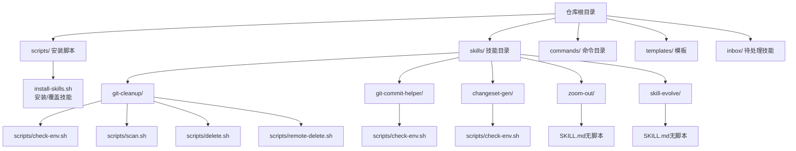
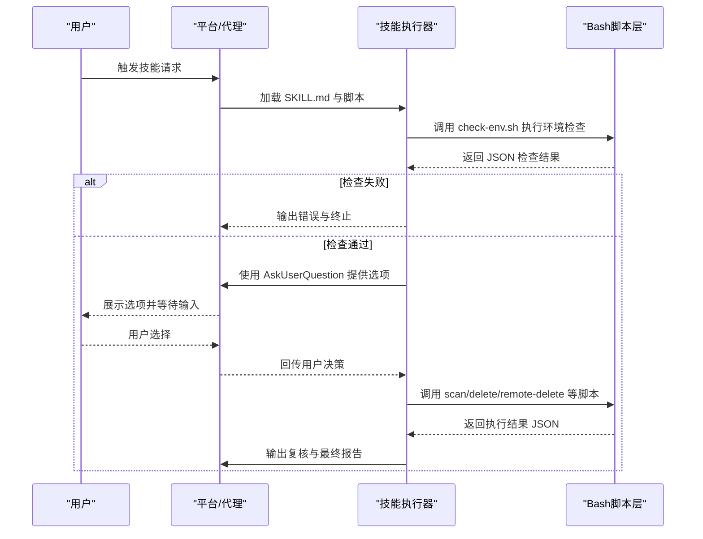
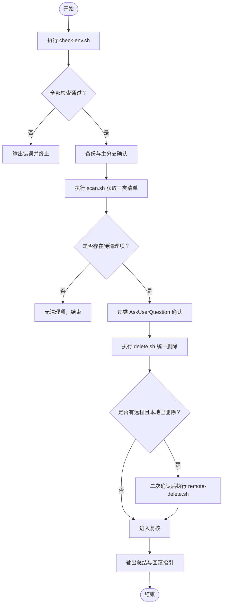
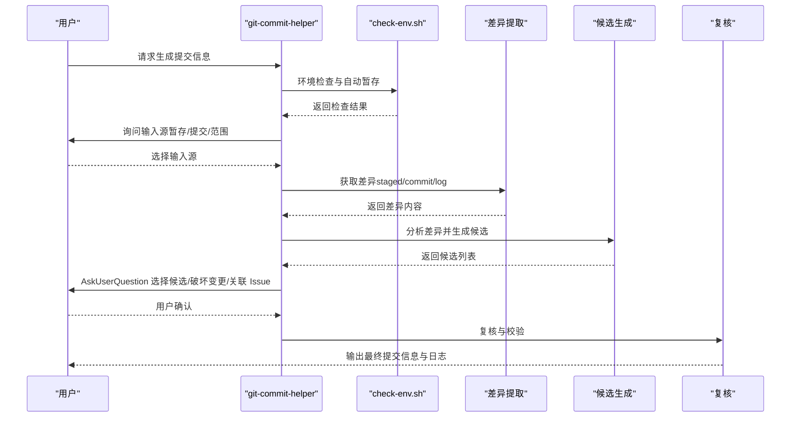
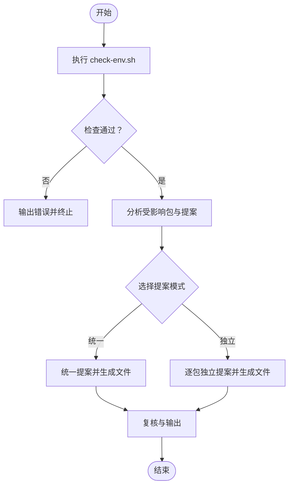
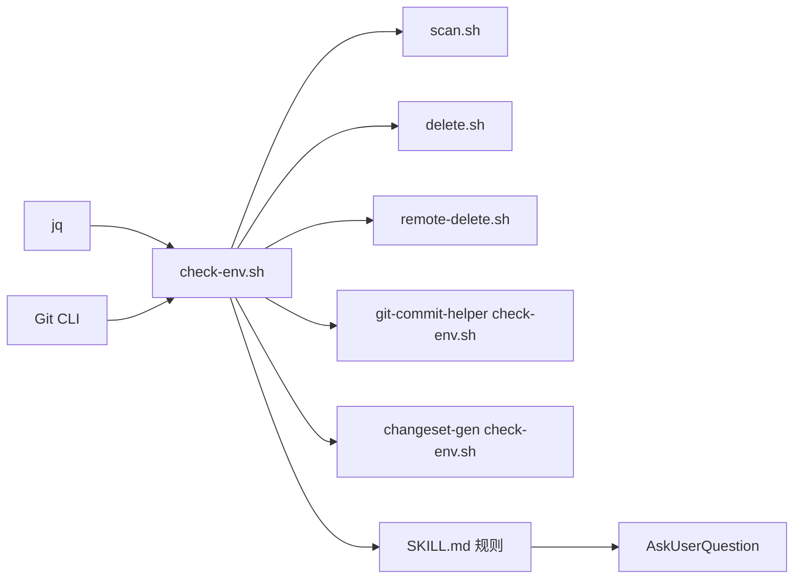

# 集成与API

<cite>
**本文引用的文件**
- [README.md](file://README.md)
- [install-skills.sh](file://scripts/install-skills.sh)
- [git-cleanup SKILL.md](file://skills/git-cleanup/SKILL.md)
- [git-cleanup check-env.sh](file://skills/git-cleanup/scripts/check-env.sh)
- [git-cleanup scan.sh](file://skills/git-cleanup/scripts/scan.sh)
- [git-cleanup delete.sh](file://skills/git-cleanup/scripts/delete.sh)
- [git-cleanup remote-delete.sh](file://skills/git-cleanup/scripts/remote-delete.sh)
- [git-commit-helper SKILL.md](file://skills/git-commit-helper/SKILL.md)
- [git-commit-helper check-env.sh](file://skills/git-commit-helper/scripts/check-env.sh)
- [changeset-gen SKILL.md](file://skills/changeset-gen/SKILL.md)
- [changeset-gen check-env.sh](file://skills/changeset-gen/scripts/check-env.sh)
- [zoom-out SKILL.md](file://skills/zoom-out/SKILL.md)
- [skill-evolve SKILL.md](file://skills/skill-evolve/SKILL.md)
- [hitl-loop.template.sh](file://inbox/skills/diagnose/scripts/hitl-loop.template.sh)
</cite>

## 目录
1. [简介](#简介)
2. [项目结构](#项目结构)
3. [核心组件](#核心组件)
4. [架构总览](#架构总览)
5. [详细组件分析](#详细组件分析)
6. [依赖关系分析](#依赖关系分析)
7. [性能考量](#性能考量)
8. [故障排查指南](#故障排查指南)
9. [结论](#结论)
10. [附录](#附录)

## 简介
本文件面向需要在外部系统中集成 Skills Collection 的工程师与平台团队，提供从安装部署到技能执行、从交互工具到脚本接口的完整集成与API文档。重点覆盖以下方面：
- 与 Git 系统的深度集成（清理、提交信息生成、变更集生成）
- 与 CI/CD 流水线的对接建议（基于脚本化检查与执行）
- 第三方工具调用规范（如 jq、Git 命令行）
- AskUserQuestion 工具的使用方法与参数规范
- 配置文件与环境变量的使用指南
- 最佳实践与安全注意事项
- 完整的系统集成指导与技术支持路径

## 项目结构
Skills Collection 以“技能”为最小可执行单元，每个技能由 SKILL.md 描述行为与规则，并配套一组 Bash 脚本实现具体流程。安装脚本负责将技能复制到目标目录，供上层平台加载与调度。

图表来源
- [README.md](file://README.md)
- [install-skills.sh](file://scripts/install-skills.sh)
- [git-cleanup SKILL.md](file://skills/git-cleanup/SKILL.md)
- [git-commit-helper SKILL.md](file://skills/git-commit-helper/SKILL.md)
- [changeset-gen SKILL.md](file://skills/changeset-gen/SKILL.md)
- [zoom-out SKILL.md](file://skills/zoom-out/SKILL.md)
- [skill-evolve SKILL.md](file://skills/skill-evolve/SKILL.md)

章节来源
- [README.md](file://README.md)
- [install-skills.sh](file://scripts/install-skills.sh)

## 核心组件
- 安装与分发
  - install-skills.sh：支持远程克隆或本地目录复制，按语言选择源目录，批量安装/覆盖技能至目标目录；支持环境变量 SKILLS_DIR 覆盖默认路径。
- Git 清理技能（git-cleanup）
  - 通过 check-env.sh 执行环境检查（Git 版本、jq、远程存在性等），scan.sh 统一扫描工作树/分支/标签，delete.sh 统一删除，remote-delete.sh 推送远程删除。
- 提交信息助手（git-commit-helper）
  - 通过 check-env.sh 检查冲突状态与变更，支持直接对话 diff 或 Git 差异输入，生成符合 Conventional Commits 的候选消息。
- 变更集生成（changeset-gen）
  - 基于 staged 变更分析受影响包，生成独立 changeset 文件，支持统一/独立两种提案模式。
- 上下文放大（zoom-out）
  - 无脚本型技能，用于生成模块地图与调用关系，辅助理解代码在整体架构中的位置。
- 技能演进（skill-evolve）
  - 对现有 SKILL.md 进行结构优化、内容拆分与标准化，确保交互与防御步骤完备。

章节来源
- [install-skills.sh](file://scripts/install-skills.sh)
- [git-cleanup SKILL.md](file://skills/git-cleanup/SKILL.md)
- [git-cleanup check-env.sh](file://skills/git-cleanup/scripts/check-env.sh)
- [git-cleanup scan.sh](file://skills/git-cleanup/scripts/scan.sh)
- [git-cleanup delete.sh](file://skills/git-cleanup/scripts/delete.sh)
- [git-cleanup remote-delete.sh](file://skills/git-cleanup/scripts/remote-delete.sh)
- [git-commit-helper SKILL.md](file://skills/git-commit-helper/SKILL.md)
- [git-commit-helper check-env.sh](file://skills/git-commit-helper/scripts/check-env.sh)
- [changeset-gen SKILL.md](file://skills/changeset-gen/SKILL.md)
- [changeset-gen check-env.sh](file://skills/changeset-gen/scripts/check-env.sh)
- [zoom-out SKILL.md](file://skills/zoom-out/SKILL.md)
- [skill-evolve SKILL.md](file://skills/skill-evolve/SKILL.md)

## 架构总览
Skills Collection 的执行链路遵循“预检 → 交互确认 → 执行 → 复核 → 输出”的通用模式。其中，AskUserQuestion 是所有需要用户决策的关键节点的标准交互工具。

图表来源
- [git-cleanup SKILL.md](file://skills/git-cleanup/SKILL.md)
- [git-commit-helper SKILL.md](file://skills/git-commit-helper/SKILL.md)
- [changeset-gen SKILL.md](file://skills/changeset-gen/SKILL.md)
- [skill-evolve SKILL.md](file://skills/skill-evolve/SKILL.md)

## 详细组件分析

### Git 清理技能（git-cleanup）
- 功能概述
  - 全面扫描并清理过期工作树、分支与标签；支持两阶段删除（本地优先、远程二次确认）；执行前自动备份，异常时提供回滚指引。
- 关键脚本与参数
  - check-env.sh：输出 JSON，包含 in-git-repo、git-version、fetch-prune、has-remote 等检查项。
  - scan.sh：接收 --main-branch 参数，输出 worktrees、branches、tags 三类 JSON 数组。
  - delete.sh：接收 --worktrees/--branches/--tags JSON，按类别统一删除，返回每项执行结果。
  - remote-delete.sh：接收 --branches/--tags JSON，推送远程删除，返回每项执行结果。
- 交互与安全
  - 所有用户决策必须通过 AskUserQuestion，且最多每调用不超过 4 个问题；脏工作树自动跳过；受保护分支不会进入删除列表；远程删除需二次确认。

图表来源
- [git-cleanup SKILL.md](file://skills/git-cleanup/SKILL.md)
- [git-cleanup check-env.sh](file://skills/git-cleanup/scripts/check-env.sh)
- [git-cleanup scan.sh](file://skills/git-cleanup/scripts/scan.sh)
- [git-cleanup delete.sh](file://skills/git-cleanup/scripts/delete.sh)
- [git-cleanup remote-delete.sh](file://skills/git-cleanup/scripts/remote-delete.sh)

章节来源
- [git-cleanup SKILL.md](file://skills/git-cleanup/SKILL.md)
- [git-cleanup check-env.sh](file://skills/git-cleanup/scripts/check-env.sh)
- [git-cleanup scan.sh](file://skills/git-cleanup/scripts/scan.sh)
- [git-cleanup delete.sh](file://skills/git-cleanup/scripts/delete.sh)
- [git-cleanup remote-delete.sh](file://skills/git-cleanup/scripts/remote-delete.sh)

### 提交信息助手（git-commit-helper）
- 功能概述
  - 支持三种输入源：暂存区、单次提交、分支范围；根据差异分析生成 1~3 条候选消息；支持破坏性变更标记与 Issue 关联；最终输出结构化日志。
- 关键脚本与参数
  - check-env.sh：检查 Git 环境、冲突状态与变更存在性，必要时自动 git add -A。
- 交互与规范
  - 所有交互必须使用 AskUserQuestion，最多每调用 4 个问题；候选生成后进行多维度校验（长度、类型、内容、标记一致性等）。

图表来源
- [git-commit-helper SKILL.md](file://skills/git-commit-helper/SKILL.md)
- [git-commit-helper check-env.sh](file://skills/git-commit-helper/scripts/check-env.sh)

章节来源
- [git-commit-helper SKILL.md](file://skills/git-commit-helper/SKILL.md)
- [git-commit-helper check-env.sh](file://skills/git-commit-helper/scripts/check-env.sh)

### 变更集生成（changeset-gen）
- 功能概述
  - 基于 staged 变更分析受影响包，生成独立 changeset 文件；支持统一/独立两种提案模式；仅生成文件，不执行提交/推送。
- 关键脚本与参数
  - check-env.sh：自动 git add -A，检查 Git、变更、pnpm changeset 与 workspace 配置。
- 交互与规范
  - 所有用户决策使用 AskUserQuestion；文件名随机唯一，避免冲突；最终提示用户执行 git add .changeset/。

图表来源
- [changeset-gen SKILL.md](file://skills/changeset-gen/SKILL.md)
- [changeset-gen check-env.sh](file://skills/changeset-gen/scripts/check-env.sh)

章节来源
- [changeset-gen SKILL.md](file://skills/changeset-gen/SKILL.md)
- [changeset-gen check-env.sh](file://skills/changeset-gen/scripts/check-env.sh)

### 上下文放大（zoom-out）
- 功能概述
  - 无脚本型技能，通过领域术语生成模块地图与调用关系，帮助理解代码在整体架构中的位置。
- 交互与规范
  - 严格要求结构化输出，避免长篇描述；术语优先使用项目领域词汇；必要时重试生成结构化映射。

章节来源
- [zoom-out SKILL.md](file://skills/zoom-out/SKILL.md)

### 技能演进（skill-evolve）
- 功能概述
  - 对现有 SKILL.md 进行元数据、结构、格式、内容与参考文档的标准化与拆分；确保交互与防御步骤完备。
- 交互与规范
  - 强制使用 AskUserQuestion；对非标准段落迁移至 references/；对复杂内容进行拆分；对抽象变量进行规范化替换。

章节来源
- [skill-evolve SKILL.md](file://skills/skill-evolve/SKILL.md)

## 依赖关系分析
- 外部依赖
  - jq：所有 Bash 脚本均依赖 jq 进行 JSON 解析与输出。
  - Git：所有 Git 相关技能依赖 Git 命令行工具与版本满足要求。
- 内部依赖
  - 各技能的 SKILL.md 定义了前置条件、工作流与复核清单；脚本层提供可组合的检查、扫描、删除与远程删除能力。
- 交互依赖
  - AskUserQuestion 是所有需要用户决策的交互点的唯一标准工具，确保 UI 选项明确、行为可追踪。

图表来源
- [git-cleanup check-env.sh](file://skills/git-cleanup/scripts/check-env.sh)
- [git-commit-helper check-env.sh](file://skills/git-commit-helper/scripts/check-env.sh)
- [changeset-gen check-env.sh](file://skills/changeset-gen/scripts/check-env.sh)
- [git-cleanup SKILL.md](file://skills/git-cleanup/SKILL.md)
- [git-commit-helper SKILL.md](file://skills/git-commit-helper/SKILL.md)
- [changeset-gen SKILL.md](file://skills/changeset-gen/SKILL.md)

章节来源
- [git-cleanup check-env.sh](file://skills/git-cleanup/scripts/check-env.sh)
- [git-commit-helper check-env.sh](file://skills/git-commit-helper/scripts/check-env.sh)
- [changeset-gen check-env.sh](file://skills/changeset-gen/scripts/check-env.sh)
- [git-cleanup SKILL.md](file://skills/git-cleanup/SKILL.md)
- [git-commit-helper SKILL.md](file://skills/git-commit-helper/SKILL.md)
- [changeset-gen SKILL.md](file://skills/changeset-gen/SKILL.md)

## 性能考量
- 脚本化执行
  - 采用 Bash 脚本串行化执行，减少进程开销；统一 JSON 输出便于上层解析与聚合。
- 并行化建议
  - 在上层平台侧，可对多个独立技能的预检与扫描阶段进行并发控制，但删除与远程删除阶段应遵循两阶段顺序，避免竞态。
- I/O 与网络
  - 远程删除依赖网络连通性，建议在流水线中设置超时与重试策略；本地删除完成后统一触发远程同步。

## 故障排查指南
- 环境检查失败
  - 检查 jq 是否安装；确认当前目录为 Git 仓库；升级 Git 至满足最低版本；若处于冲突状态（合并/变基/反向等），先解决冲突再运行。
- 无变更可分析
  - 对于 git-commit-helper 与 changeset-gen，需确保存在 staged 变更；必要时先执行自动暂存。
- 删除失败
  - 对于 git-cleanup，删除失败会记录原因并继续后续项；脏工作树会被自动跳过；远程删除需二次确认。
- 回滚与恢复
  - 执行前会创建备份；异常退出时输出备份路径与恢复命令；请在回滚前确认当前工作区状态。

章节来源
- [git-cleanup SKILL.md](file://skills/git-cleanup/SKILL.md)
- [git-commit-helper check-env.sh](file://skills/git-commit-helper/scripts/check-env.sh)
- [changeset-gen check-env.sh](file://skills/changeset-gen/scripts/check-env.sh)

## 结论
Skills Collection 通过标准化的 SKILL.md 与 Bash 脚本，提供了可复用、可审计、可扩展的技能执行框架。结合 AskUserQuestion 的交互约束与两阶段删除的安全策略，适合在 CI/CD 与开发工具链中稳定集成。建议在生产环境中：
- 明确环境依赖（Git、jq）与权限边界（远程删除需推送权限）
- 将脚本化检查与执行纳入流水线，配合超时与重试
- 使用统一的安装脚本管理技能分发与覆盖
- 严格遵循交互与复核清单，确保输出质量与可追溯性

## 附录

### AskUserQuestion 工具使用规范
- 必须以结构化方式提供选项，每个选项附带明确的行为流向（动作 → 下一步）。
- 单次调用不超过 4 个问题；动态选项需标注生成依据与范围。
- 不允许使用纯文本替代交互确认；必须阻塞等待用户选择后再继续。

章节来源
- [git-cleanup SKILL.md](file://skills/git-cleanup/SKILL.md)
- [git-commit-helper SKILL.md](file://skills/git-commit-helper/SKILL.md)
- [changeset-gen SKILL.md](file://skills/changeset-gen/SKILL.md)
- [skill-evolve SKILL.md](file://skills/skill-evolve/SKILL.md)

### 安装与分发（环境变量与参数）
- 环境变量
  - SKILLS_DIR：覆盖默认技能安装目录（默认值见安装脚本注释）。
- 命令行参数
  - install-skills.sh 支持 --repo-dir <path> 指定本地仓库目录；支持交互式语言选择（英文/中文）。
- 行为说明
  - 若目标目录已有同名技能，安装脚本会提示覆盖；覆盖前会列出将被覆盖的技能清单。

章节来源
- [README.md](file://README.md)
- [install-skills.sh](file://scripts/install-skills.sh)

### 与 CI/CD 的对接建议
- 预检阶段
  - 在流水线中先执行各技能的 check-env.sh，确保 Git 与 jq 可用、远程仓库可达。
- 交互阶段
  - 对需要用户决策的技能，建议在流水线外通过 AskUserQuestion 的 UI 通道完成；或在流水线中提供预设参数以减少交互。
- 执行阶段
  - 两阶段删除（本地 → 远程）需在不同作业中串联，避免竞态。
- 失败处理
  - 记录脚本输出的 JSON 结果，结合备份路径进行回滚与重试。

章节来源
- [git-cleanup SKILL.md](file://skills/git-cleanup/SKILL.md)
- [git-commit-helper SKILL.md](file://skills/git-commit-helper/SKILL.md)
- [changeset-gen SKILL.md](file://skills/changeset-gen/SKILL.md)

### 第三方工具调用
- jq：用于 JSON 解析与输出；所有 Bash 脚本均依赖。
- Git：用于 fetch、diff、branch、tag、worktree、push 等操作。
- 建议在容器镜像或流水线环境中固定版本，确保可重复性。

章节来源
- [git-cleanup check-env.sh](file://skills/git-cleanup/scripts/check-env.sh)
- [git-commit-helper check-env.sh](file://skills/git-commit-helper/scripts/check-env.sh)
- [changeset-gen check-env.sh](file://skills/changeset-gen/scripts/check-env.sh)

### 配置文件与参考文档
- pnpm changeset 工作流
  - 需要 .changeset/ 目录与 @changesets/cli；pnpm-workspace.yaml 中定义 packages 路径。
- Conventional Commits
  - 类型、作用域、破坏变更标记与正文格式遵循约定文件。
- 保护分支与脏工作树
  - 受保护分支不会被删除；脏工作树自动跳过。

章节来源
- [changeset-gen SKILL.md](file://skills/changeset-gen/SKILL.md)
- [git-cleanup SKILL.md](file://skills/git-cleanup/SKILL.md)
- [git-commit-helper SKILL.md](file://skills/git-commit-helper/SKILL.md)

### 人机协作模板（可选）
- 适用于手动复现与验证场景的人机循环脚本模板，可用于调试与回归测试。

章节来源
- [hitl-loop.template.sh](file://inbox/skills/diagnose/scripts/hitl-loop.template.sh)