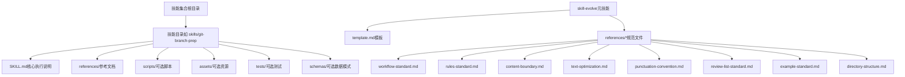
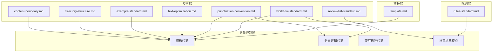
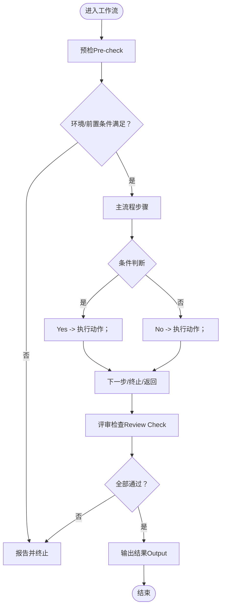
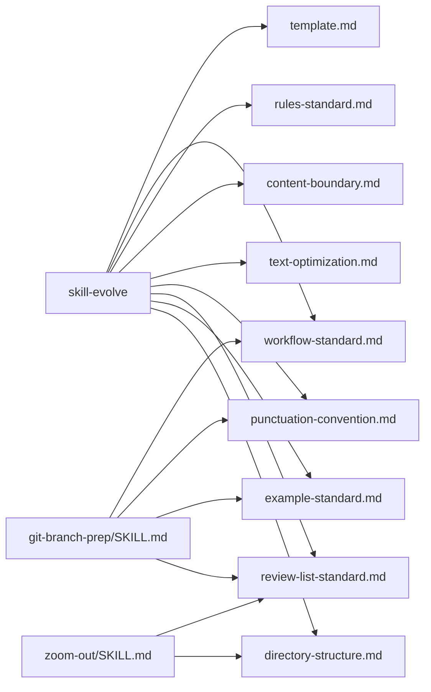

# 开发规范标准

<cite>
**本文档引用的文件**
- [README.md](file://README.md)
- [README.zh-CN.md](file://README.zh-CN.md)
- [SKILL.md](file://skills/skill-evolve/SKILL.md)
- [template.md](file://skills/skill-evolve/template.md)
- [workflow-standard.md](file://skills/skill-evolve/references/workflow-standard.md)
- [rules-standard.md](file://skills/skill-evolve/references/rules-standard.md)
- [content-boundary.md](file://skills/skill-evolve/references/content-boundary.md)
- [text-optimization.md](file://skills/skill-evolve/references/text-optimization.md)
- [punctuation-convention.md](file://skills/skill-evolve/references/punctuation-convention.md)
- [review-list-standard.md](file://skills/skill-evolve/references/review-list-standard.md)
- [example-standard.md](file://skills/skill-evolve/references/example-standard.md)
- [directory-structure.md](file://skills/skill-evolve/references/directory-structure.md)
- [SKILL.md](file://skills/skill-create/SKILL.md)
- [SKILL.md](file://skills/git-branch-prep/SKILL.md)
- [SKILL.md](file://skills/zoom-out/SKILL.md)
- [.markdownlint.json](file://.markdownlint.json)
</cite>

## 目录
1. [引言](#引言)
2. [项目结构](#项目结构)
3. [核心组件](#核心组件)
4. [架构总览](#架构总览)
5. [详细组件分析](#详细组件分析)
6. [依赖关系分析](#依赖关系分析)
7. [性能考虑](#性能考虑)
8. [故障排查指南](#故障排查指南)
9. [结论](#结论)
10. [附录](#附录)

## 引言
本规范旨在为技能开发提供系统化、可操作的标准与最佳实践，覆盖工作流标准、规则标准、内容边界、文本优化、示例格式、引用层级、质量评估与检查清单等维度。通过统一的模板与参考规范，确保技能文档在结构、行为、可维护性与一致性方面达到工程级标准。

## 项目结构
技能集合采用“技能即自包含目录”的组织方式，每个技能以 SKILL.md 为核心，配合可选的 references/、scripts/、assets/、tests/、schemas/ 等子目录。规范体系由 skill-evolve 作为元技能，提供结构演进、规则约束、校验清单与参考文档的统一标准。

图示来源
- [README.md:1-113](file://README.md#L1-L113)
- [SKILL.md](file://skills/skill-evolve/SKILL.md)
- [template.md](file://skills/skill-evolve/template.md)
- [directory-structure.md](file://skills/skill-evolve/references/directory-structure.md)

章节来源
- [README.md:1-113](file://README.md#L1-L113)
- [README.zh-CN.md:1-113](file://README.zh-CN.md#L1-L113)

## 核心组件
- 元技能 skill-evolve：负责对现有 SKILL.md 进行结构化演进、标准化与拆分，确保符合模板与规范。
- 标准模板 template.md：定义八段式标准结构（概述、定义、前置条件、工作流、规则、示例、评审清单、参考）。
- 规范参考集：由 references/ 下的一系列文件构成，分别约束工作流书写、规则编写、内容边界、文本简化、标点约定、评审清单、示例格式与目录结构。

章节来源
- [SKILL.md](file://skills/skill-evolve/SKILL.md)
- [template.md](file://skills/skill-evolve/template.md)
- [rules-standard.md:1-58](file://skills/skill-evolve/references/rules-standard.md#L1-L58)
- [content-boundary.md:1-32](file://skills/skill-evolve/references/content-boundary.md#L1-L32)

## 架构总览
规范体系以“模板 + 规则 + 参考 + 质量控制”四层协同实现：
- 模板层：template.md 明确 SKILL.md 的结构责任与写作指引。
- 规则层：rules-standard.md 定义规则分组与变量声明标准，约束执行行为。
- 参考层：references/ 下各文件定义工作流、标点、文本简化、示例、目录结构等标准。
- 质量控制层：workflow-standard.md 的结构验证、分支逻辑验证、交互标准验证与 review-list-standard.md 的评审清单，共同保证输出质量。

图示来源
- [template.md](file://skills/skill-evolve/template.md)
- [rules-standard.md:1-58](file://skills/skill-evolve/references/rules-standard.md#L1-L58)
- [workflow-standard.md:1-800](file://skills/skill-evolve/references/workflow-standard.md#L1-L800)
- [punctuation-convention.md:1-187](file://skills/skill-evolve/references/punctuation-convention.md#L1-L187)
- [text-optimization.md:1-165](file://skills/skill-evolve/references/text-optimization.md#L1-L165)
- [example-standard.md:1-53](file://skills/skill-evolve/references/example-standard.md#L1-L53)
- [review-list-standard.md:1-35](file://skills/skill-evolve/references/review-list-standard.md#L1-L35)
- [directory-structure.md:1-46](file://skills/skill-evolve/references/directory-structure.md#L1-L46)
- [content-boundary.md:1-32](file://skills/skill-evolve/references/content-boundary.md#L1-L32)

## 详细组件分析

### 组件一：工作流标准（Workflow Writing Standard）
- 固定安全步骤：Pre-check（首步）、Review Check（倒数第二步）、Output（最后一步），自动补全与编号重排。
- 步骤书写格式：标题使用“N. **Title** — Description;”，子步骤统一使用缩进的无序列表，必要时使用数字子编号（如 4.1、4.2）。
- 分支逻辑：采用树状箭头格式（Yes -> / No ->），明确分支终点与返回点，避免隐含 else、嵌套括号、极性不匹配等问题。
- 循环与迭代：明确循环边界与重试上限，失败后记录并按需终止或降级处理。
- 交互标准：用户决策必须通过 AskUserQuestion 工具，选项与后续流程标注清晰，单次调用不超过 4 个问题。

图示来源
- [workflow-standard.md:19-180](file://skills/skill-evolve/references/workflow-standard.md#L19-L180)
- [workflow-standard.md:277-686](file://skills/skill-evolve/references/workflow-standard.md#L277-L686)
- [workflow-standard.md:765-993](file://skills/skill-evolve/references/workflow-standard.md#L765-L993)

章节来源
- [workflow-standard.md:1-800](file://skills/skill-evolve/references/workflow-standard.md#L1-L800)
- [workflow-standard.md:800-993](file://skills/skill-evolve/references/workflow-standard.md#L800-L993)

### 组件二：规则标准（Rules Writing Standard）
- 内容边界：规则应约束执行过程（行为），而非结果验证；结果验证归入评审清单。
- 分组建议：按“元数据/结构/内容/行为/防御/验证”六维分组，≥10 条建议使用二级缩进分组。
- 变量声明：跨步骤变量需在 Definitions 中以“是否…”命名并声明获取规则，在 Pre-check 初始化。
- 一致性：规则内部无矛盾，跨组交互无冲突；与评审清单遵循关注分离原则。

章节来源
- [rules-standard.md:1-58](file://skills/skill-evolve/references/rules-standard.md#L1-L58)

### 组件三：内容边界标准（Content Boundary Standard）
- 明确各领域内容归属：工作流结构、标点、文本简化、示例格式、目录结构、规则与评审清单等分别由对应参考文件管理。
- 避免交叉污染：SKILL.md 保留元规则与评审清单，其余内容迁移至 references/ 并通过锚点引用。

章节来源
- [content-boundary.md:1-32](file://skills/skill-evolve/references/content-boundary.md#L1-L32)

### 组件四：文本优化（Text Simplification Rules）
- 核心原则：压缩长度但不压缩语义密度；涉及交互决策的句子不得简化。
- 四条规则顺序：正向命令转换、删除冗余动词、省略自解释内容、语义去重合并。
- 优先级与风险：从低到高依次执行，高风险场景优先保留原意，避免过度简化导致歧义或遗漏。

章节来源
- [text-optimization.md:1-165](file://skills/skill-evolve/references/text-optimization.md#L1-L165)

### 组件五：标点约定（Punctuation Convention）
- 语言决定符号：中文使用全角标点与中文引号，英文使用半角标点与直引号；代码块与路径始终使用半角。
- 分支标记绑定：分支逻辑终止符为全角分号“；”，非终止引入符为全角冒号“：”，箭头统一使用半角“->”。

章节来源
- [punctuation-convention.md:1-187](file://skills/skill-evolve/references/punctuation-convention.md#L1-L187)

### 组件六：评审清单标准（Review List Writing Standard）
- 内容边界：仅验证结果质量，不约束执行行为；与规则遵循关注分离。
- 写法建议：优先使用锚点引用已有的验证清单，避免重复；按规则分组保持一致顺序。
- 类型适配：元技能（修改/校验 SKILL.md）与领域技能（执行任务）的评审重点不同。

章节来源
- [review-list-standard.md:1-35](file://skills/skill-evolve/references/review-list-standard.md#L1-L35)

### 组件七：示例标准（Example Writing Standard）
- 三种示例类型：对话交互示例、评审检查示例、输出结果示例，均需使用代码块包裹。
- 一致性要求：示例内容与规则一致，包含评审检查终止流程；对话示例聚焦步骤 0-5；示例中的数值与实际值同步或使用通用示例值。

章节来源
- [example-standard.md:1-53](file://skills/skill-evolve/references/example-standard.md#L1-L53)

### 组件八：目录结构（Directory Structure）
- 标准目录：SKILL.md、可选 scripts/、references/、assets/、tests/、schemas/。
- references/ 文件规范：以“# 文件名 — 一行职责说明”开头，包含“## 概述”与“## 验证清单”，末尾必须有验证清单。

章节来源
- [directory-structure.md:1-46](file://skills/skill-evolve/references/directory-structure.md#L1-L46)

### 组件九：模板与示例技能对照
- 模板 SKILL.md：提供八段式结构与写作指引，作为所有技能的基线。
- 示例技能对比：
  - skill-create：从零创建技能，遵循模板与目录结构，强调交互确认与评审清单。
  - git-branch-prep：完整工作流示例，展示分支推导、提交与 PR 链接生成，严格遵循交互与安全规范。
  - zoom-out：抽象视角输出，强调结构化模块映射与术语一致性。

章节来源
- [template.md](file://skills/skill-evolve/template.md)
- [SKILL.md](file://skills/skill-create/SKILL.md)
- [SKILL.md](file://skills/git-branch-prep/SKILL.md)
- [SKILL.md](file://skills/zoom-out/SKILL.md)

## 依赖关系分析
- skill-evolve 依赖 references/ 下的规范文件进行结构演进与质量控制。
- 各技能 SKILL.md 通过锚点链接 references/ 文件，形成“核心文档 + 参考规范”的解耦结构。
- 质量控制贯穿工作流、分支逻辑、交互标准与评审清单，确保输出一致性。

图示来源
- [SKILL.md](file://skills/skill-evolve/SKILL.md)
- [template.md](file://skills/skill-evolve/template.md)
- [workflow-standard.md:1-800](file://skills/skill-evolve/references/workflow-standard.md#L1-L800)
- [rules-standard.md:1-58](file://skills/skill-evolve/references/rules-standard.md#L1-L58)
- [content-boundary.md:1-32](file://skills/skill-evolve/references/content-boundary.md#L1-L32)
- [text-optimization.md:1-165](file://skills/skill-evolve/references/text-optimization.md#L1-L165)
- [punctuation-convention.md:1-187](file://skills/skill-evolve/references/punctuation-convention.md#L1-L187)
- [review-list-standard.md:1-35](file://skills/skill-evolve/references/review-list-standard.md#L1-L35)
- [example-standard.md:1-53](file://skills/skill-evolve/references/example-standard.md#L1-L53)
- [directory-structure.md:1-46](file://skills/skill-evolve/references/directory-structure.md#L1-L46)
- [SKILL.md](file://skills/git-branch-prep/SKILL.md)
- [SKILL.md](file://skills/zoom-out/SKILL.md)

## 性能考虑
- 文本简化：在不丢失关键语义的前提下压缩长度，减少渲染与阅读负担。
- 目录拆分：将复杂内容迁移到 references/，降低 SKILL.md 行数，提升可维护性。
- 交互确认：通过 AskUserQuestion 统一交互，减少无效重试与回滚成本。
- 自动补全：工作流自动插入安全步骤与编号重排，降低人工维护成本。

## 故障排查指南
- 分支逻辑错误
  - 症状：隐含 else、嵌套括号、极性不匹配、缺少分支终点。
  - 处理：使用树状箭头格式，明确 Yes/No 分支与终点；修正条件极性与分支语义。
- 交互未使用工具
  - 症状：纯文本提问而非 AskUserQuestion。
  - 处理：统一使用 AskUserQuestion，选项与后续流程标注清晰，单次 ≤4 问。
- 内容边界越界
  - 症状：references/ 链接外部资源或 SKILL.md 包含不应出现的规则/示例内容。
  - 处理：依据内容边界标准迁移至对应参考文件，或保留在 SKILL.md 的规则区域。
- 标点不一致
  - 症状：中英混用标点、全半角混用、引号类型不符。
  - 处理：遵循标点约定，中文使用全角与中文引号，英文使用半角与直引号。
- 评审清单缺失或不一致
  - 症状：评审项与规则不对应、未覆盖关键约束。
  - 处理：按规则分组补充评审项，锚点引用已有验证清单，避免重复。

章节来源
- [workflow-standard.md:687-686](file://skills/skill-evolve/references/workflow-standard.md#L687-L686)
- [punctuation-convention.md:141-187](file://skills/skill-evolve/references/punctuation-convention.md#L141-L187)
- [content-boundary.md:21-32](file://skills/skill-evolve/references/content-boundary.md#L21-L32)
- [review-list-standard.md:28-35](file://skills/skill-evolve/references/review-list-standard.md#L28-L35)

## 结论
通过模板、规则、参考与质量控制的协同，技能开发实现了结构化、可演进、可评审的工程化标准。遵循本规范可显著提升技能文档的可读性、一致性与可维护性，降低沟通与协作成本。

## 附录

### 规范检查清单（技能作者）
- 结构完整性
  - 是否包含八段式标准结构（概述、定义、前置条件、工作流、规则、示例、评审清单、参考）？
  - 是否包含三个安全步骤（预检、评审检查、输出）且编号正确？
- 内容边界
  - references/ 是否仅包含对应领域的参考内容，且无外部链接？
  - SKILL.md 是否仅保留元规则与评审清单？
- 文本与格式
  - 是否遵循标点约定（中/英语言与符号一致）？
  - 是否使用树状箭头分支与明确的分支终点？
- 交互与行为
  - 用户决策是否通过 AskUserQuestion 且选项与后续流程标注清晰？
  - 是否存在未声明的跨步骤变量或变量未初始化？
- 质量控制
  - 是否包含评审清单并覆盖关键约束？
  - 示例是否与规则一致，包含评审检查终止流程？

章节来源
- [template.md](file://skills/skill-evolve/template.md)
- [workflow-standard.md:954-993](file://skills/skill-evolve/references/workflow-standard.md#L954-L993)
- [punctuation-convention.md:174-187](file://skills/skill-evolve/references/punctuation-convention.md#L174-L187)
- [content-boundary.md:21-32](file://skills/skill-evolve/references/content-boundary.md#L21-L32)
- [rules-standard.md:43-58](file://skills/skill-evolve/references/rules-standard.md#L43-L58)
- [review-list-standard.md:28-35](file://skills/skill-evolve/references/review-list-standard.md#L28-L35)
- [example-standard.md:41-53](file://skills/skill-evolve/references/example-standard.md#L41-L53)

### 质量评估方法（评审者）
- 结构验证：核对标准段落、安全步骤、编号与锚点。
- 分支逻辑验证：逐条检查 Yes/No 分支、极性匹配、终点标注与子操作列。
- 交互标准验证：确认 AskUserQuestion 使用规范、选项数量与流程标注。
- 内容边界验证：检查 references/ 与 SKILL.md 的内容归属与锚点引用。
- 输出质量验证：依据评审清单逐项打分，记录失败项并给出改进建议。

章节来源
- [workflow-standard.md:954-993](file://skills/skill-evolve/references/workflow-standard.md#L954-L993)
- [review-list-standard.md:28-35](file://skills/skill-evolve/references/review-list-standard.md#L28-L35)

### 最佳实践建议
- 在创建阶段即遵循模板与目录结构，避免后期大规模重构。
- 使用 references/ 管理复杂规则与示例，保持 SKILL.md 简洁。
- 评审前先运行“格式统一检查”，确保标点、锚点与交互一致。
- 对高风险简化（如语义去重）进行双人复核，必要时保留原文。

章节来源
- [directory-structure.md:1-46](file://skills/skill-evolve/references/directory-structure.md#L1-L46)
- [text-optimization.md:73-87](file://skills/skill-evolve/references/text-optimization.md#L73-L87)
- [workflow-standard.md:954-993](file://skills/skill-evolve/references/workflow-standard.md#L954-L993)