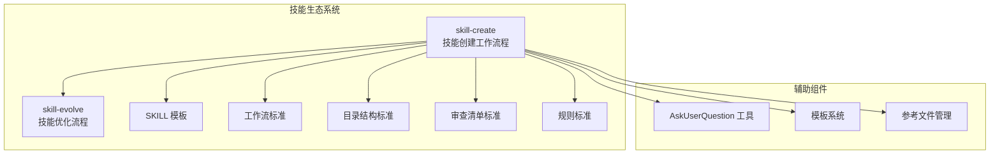
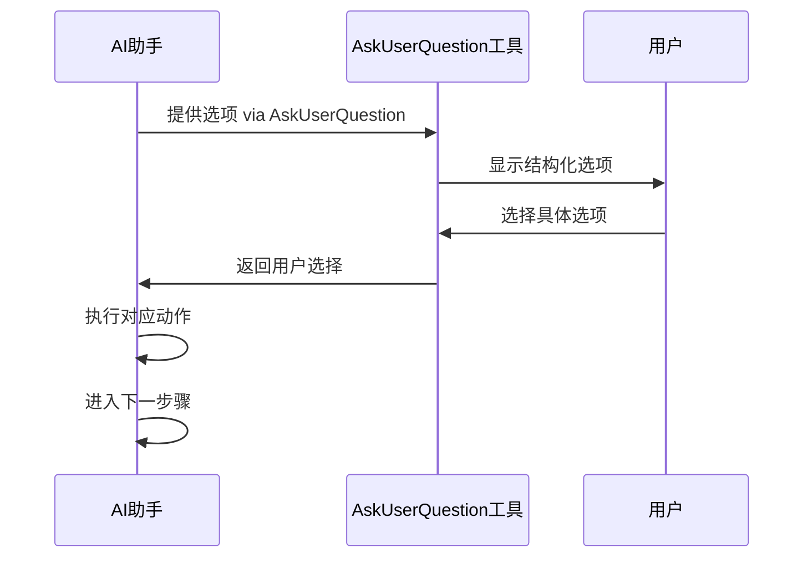
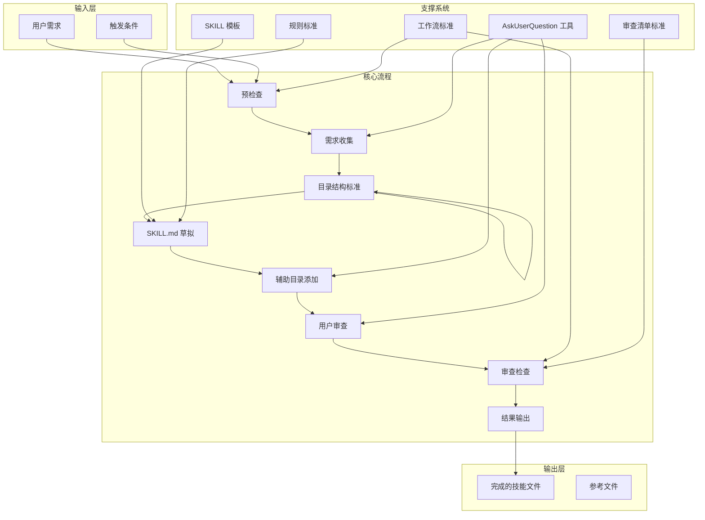
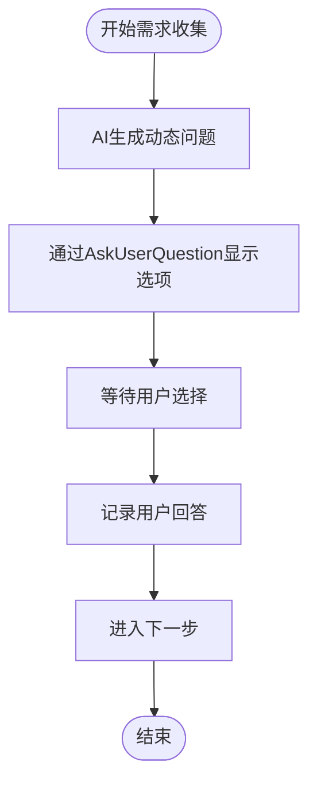
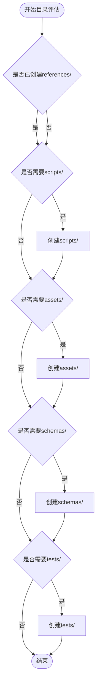
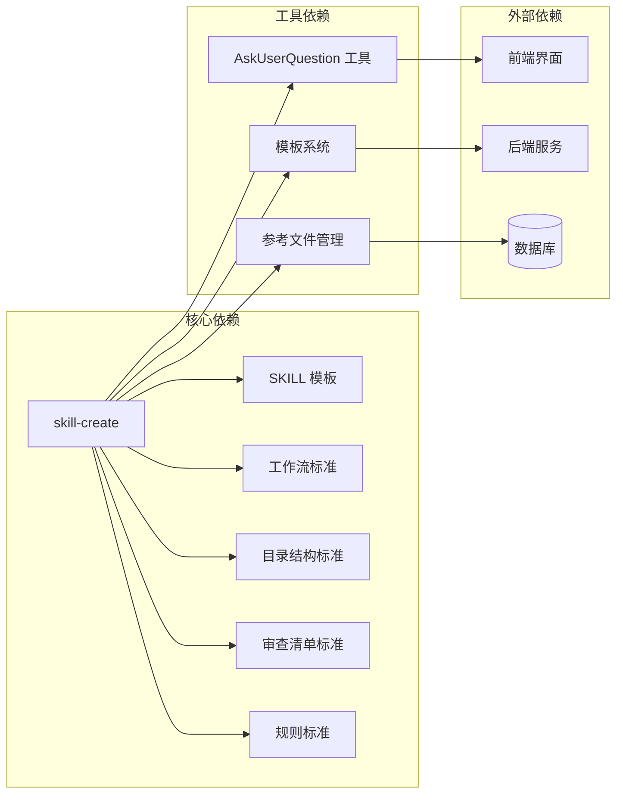

# 技能创建工作流程

<cite>
**本文档引用的文件**
- [SKILL.md](file://skills/skill-create/SKILL.md)
- [workflow-standard.md](file://skills/skill-evolve/references/workflow-standard.md)
- [template.md](file://skills/skill-evolve/template.md)
- [directory-structure.md](file://skills/skill-evolve/references/directory-structure.md)
- [review-list-standard.md](file://skills/skill-evolve/references/review-list-standard.md)
- [rules-standard.md](file://skills/skill-evolve/references/rules-standard.md)
</cite>

## 目录
1. [简介](#简介)
2. [项目结构](#项目结构)
3. [核心组件](#核心组件)
4. [架构概览](#架构概览)
5. [详细组件分析](#详细组件分析)
6. [依赖关系分析](#依赖关系分析)
7. [性能考虑](#性能考虑)
8. [故障排除指南](#故障排除指南)
9. [结论](#结论)

## 简介

技能创建工作流程是一个标准化的七步工作流程，用于从零开始创建新的智能体技能。该流程基于 skill-evolve 标准模板，确保创建的技能具有统一的结构、质量和可维护性。流程强调安全性，包含三个标准化的安全步骤：预检查（Pre-check）、审查检查（Review Check）和结果输出（Output Results）。

该工作流程特别注重用户交互的质量，要求所有涉及用户决策的步骤都必须使用 AskUserQuestion 工具进行确认，而不是简单的文本询问。这确保了用户决策的结构化和可追踪性。

## 项目结构

技能创建工作流程位于技能生态系统的核心位置，与 skill-evolve 标准紧密集成：



**图表来源**
- [SKILL.md:1-447](file://skills/skill-create/SKILL.md#L1-L447)
- [workflow-standard.md:1-993](file://skills/skill-evolve/references/workflow-standard.md#L1-L993)

**章节来源**
- [SKILL.md:1-447](file://skills/skill-create/SKILL.md#L1-L447)

## 核心组件

### 七步工作流程

技能创建工作流程包含七个标准化步骤，每个步骤都有明确的目标和质量要求：

#### 步骤0：预检查（Pre-check）
- 验证 skill-evolve 的模板文件（template.md）和目录结构标准（directory-structure.md）是否可用
- 检查目标技能目录名称是否已存在
- 处理现有文件的覆盖策略

#### 步骤1：需求收集（Collect Requirements）
- 通过 AskUserQuestion 工具收集技能信息
- 提供最多4个动态选项，基于需求生成个性化问题
- 记录用户回答并推进到下一步

#### 步骤2：创建目录结构（Create Directory Structure）
- 按照目录结构标准创建必要的文件和文件夹
- 确保至少创建 SKILL.md 文件
- 支持可选的辅助目录（scripts/、references/、assets/、schemas/、tests/）

#### 步骤3：草拟 SKILL.md（Draft SKILL.md）
- 按照标准模板组织内容
- 遵循 Rules 中的格式要求
- 添加各节指导文本帮助 AI 理解目的
- 检查行数是否超过300行，必要时拆分到 references/

#### 步骤4：添加辅助目录（Add Auxiliary Directories）
- 通过 AskUserQuestion 评估并创建辅助目录
- 逐一确认是否需要 references/、scripts/、assets/、schemas/、tests/ 目录
- 如果步骤3已经因行数拆分而创建了 references/，则跳过该检查

#### 步骤5：用户审查（Review with User）
- 向用户提供草稿版本进行确认
- 允许最多3次修改后的重新审查
- 不满意时可以退回步骤3重新起草

#### 步骤6：审查检查（Review Check）
- 对创建结果进行全面验证
- 检查 Review List 中的所有项目
- 任何失败都会终止流程

#### 步骤7：结果输出（Output Results）
- 输出结构化摘要，通知创建完成
- 包含创建的文件、行数、覆盖的目录等信息

**章节来源**
- [SKILL.md:25-87](file://skills/skill-create/SKILL.md#L25-L87)

### 安全步骤（Secure Steps）

三个标准化的安全步骤确保流程的可靠性和一致性：

#### 预检查（Pre-check）
- 环境完整性验证
- 前置条件检查
- 错误处理机制

#### 审查检查（Review Check）
- 结果质量验证
- 规则一致性检查
- 失败处理和终止

#### 结果输出（Output Results）
- 执行摘要输出
- 完成状态通知
- 变更维度报告

**章节来源**
- [SKILL.md:17-17](file://skills/skill-create/SKILL.md#L17-L17)

### 用户交互最佳实践

#### AskUserQuestion 工具使用规范

所有涉及用户决策的步骤必须使用 AskUserQuestion 工具，采用固定的交互模式：



**图表来源**
- [workflow-standard.md:765-993](file://skills/skill-evolve/references/workflow-standard.md#L765-L993)

#### 选项流注释规范

每个 AskUserQuestion 选项必须跟随明确的动作流注释，确保 AI 能够清楚确定用户选择后的行为：

- **Overwrite -> 覆盖文件，然后进入下一步**
- **Merge -> 合并内容，然后进入下一步**  
- **Skip -> 保留原文件，然后进入下一步**

这种规范确保了每个选项的行为都是唯一确定的，避免了 AI 的行为盲点。

**章节来源**
- [workflow-standard.md:854-889](file://skills/skill-evolve/references/workflow-standard.md#L854-L889)

## 架构概览

技能创建工作流程采用模块化设计，与 skill-evolve 生态系统深度集成：



**图表来源**
- [SKILL.md:25-87](file://skills/skill-create/SKILL.md#L25-L87)
- [template.md:1-247](file://skills/skill-evolve/template.md#L1-L247)

## 详细组件分析

### 预检查组件（Pre-check）

预检查是整个工作流程的第一步，负责确保后续步骤能够顺利执行：

#### 环境验证
- 检查 skill-evolve 模板文件（template.md）的可用性
- 验证目录结构标准（directory-structure.md）的完整性
- 确认目标技能目录名称的唯一性

#### 文件冲突处理
当目标技能目录已存在且包含 SKILL.md 文件时，系统会通过 AskUserQuestion 提供以下选项：
- **覆盖现有文件** -> 直接覆盖并继续
- **终止流程** -> 完全停止执行

#### 错误处理机制
如果关键文件缺失，系统会报告缺少的文件并终止流程，防止后续步骤执行失败。

**章节来源**
- [SKILL.md:27-37](file://skills/skill-create/SKILL.md#L27-L37)

### 需求收集组件（Collect Requirements）

需求收集阶段通过智能的问答系统获取用户的具体需求：

#### 动态问题生成
AI 根据用户的初步描述生成最多4个相关问题，这些问题基于：
- 技能领域和任务类型
- 技术栈和工具偏好
- 业务场景和约束条件

#### 交互模式


**图表来源**
- [SKILL.md:38-40](file://skills/skill-create/SKILL.md#L38-L40)

#### 数据记录
所有用户回答都会被结构化记录，作为后续内容创作的基础数据。

**章节来源**
- [SKILL.md:38-40](file://skills/skill-create/SKILL.md#L38-L40)

### 目录结构创建组件（Create Directory Structure）

按照标准的技能目录结构创建必要的文件和文件夹：

#### 标准目录结构
```
your-skill-name/
├── SKILL.md          # (必需) 核心执行指令
├── scripts/          # (可选) 可执行脚本
├── references/       # (可选) 详细参考文档
├── assets/           # (可选) 静态资源如模板、图片
├── tests/            # (可选) 测试用例
└── schemas/          # (可选) 技能间数据传输
```

#### 创建策略
- 确保至少创建 SKILL.md 文件
- 根据需要创建可选目录
- 遵循目录结构标准中的格式规范

**章节来源**
- [SKILL.md:41-44](file://skills/skill-create/SKILL.md#L41-L44)
- [directory-structure.md:7-17](file://skills/skill-evolve/references/directory-structure.md#L7-L17)

### SKILL.md 草拟组件（Draft SKILL.md）

按照标准模板组织技能文档内容：

#### 模板结构遵循
严格按照标准模板的八个标准部分：
- **概述（Overview）** - 技能功能和触发条件
- **定义（Definitions）** - 关键术语和约定
- **前提条件（Prerequisites）** - 执行前的必要条件
- **工作流程（Workflow）** - 详细的操作步骤
- **规则（Rules）** - 行为约束和质量标准
- **示例（Examples）** - 对话示例和审查清单
- **审查清单（Review List）** - 结果验证项目
- **参考（References）** - 相关文档链接

#### 内容质量控制
- description 字段必须遵循特定格式：第一句描述技能能力，第二句描述触发条件（Use when...），第三人称，不超过1024字符
- SKILL.md 必须不超过300行；超出时自动拆分到 references/
- 引用层级不能超过一级（SKILL.md 直接链接 references/ 文件为一级；references/ 文件不应链接外部资源）

**章节来源**
- [SKILL.md:45-51](file://skills/skill-create/SKILL.md#L45-L51)
- [template.md:8-51](file://skills/skill-evolve/template.md#L8-L51)

### 辅助目录添加组件（Add Auxiliary Directories）

通过 AskUserQuestion 评估并创建辅助目录：

#### 目录评估流程


**图表来源**
- [SKILL.md:52-69](file://skills/skill-create/SKILL.md#L52-L69)

#### 交互确认
每个目录的创建都需要通过 AskUserQuestion 进行确认，确保用户的需求得到准确实现。

**章节来源**
- [SKILL.md:52-69](file://skills/skill-create/SKILL.md#L52-L69)

### 用户审查组件（Review with User）

向用户提供草稿版本进行确认：

#### 审查流程
- 提供 AskUserQuestion 选项让用户确认
- 允许最多3次修改后的重新审查
- 不满意时可以退回步骤3重新起草

#### 修改限制
- 同一轮审查中最多允许3次修改
- 超过限制后自动进入下一步
- 退回步骤3时需要重新开始内容创作

**章节来源**
- [SKILL.md:70-74](file://skills/skill-create/SKILL.md#L70-L74)

### 审查检查组件（Review Check）

对创建结果进行全面验证：

#### 检查清单结构
审查清单包含四个主要检查维度：

##### 元数据检查（Metadata Check）
- name 字段：存在且正确，与 SKILL.md 所在目录名称一致
- description 格式：第一句描述技能能力，第二句描述触发条件（Use when...），第三人称，不超过1024字符

##### 内容质量检查（Content Quality Check）
- SKILL.md 行数：不超过300行
- 时间敏感信息：已移除日期、版本号等
- 内容质量：术语一致，包含与规则一致的具体示例
- 示例格式：所有示例都包装在 ```markdown 代码块中

##### 引用检查（Reference Check）
- 引用层级：不超过一级
- 链接有效性：无死链

##### 自一致性检查（Self-Consistency Check）
- 标准部分：所有标准部分都存在（概述、定义、前提条件、工作流程、规则、示例、审查清单、参考）
- 安全步骤：预检查、审查检查、结果输出都已完成
- 交互标准：所有用户决策交互都使用 AskUserQuestion；禁止使用纯文本跟进；每次 AskUserQuestion 调用不超过4个问题
- 无自主假设：创建过程中的任何不确定性都必须通过 AskUserQuestion 与用户确认；AI 不得自行假设
- 自一致性：审查清单检查项目与规则约束规则一一对应，无遗漏

#### 错误处理
如果任何检查项目失败，系统会终止流程并建议修复后重新执行。

**章节来源**
- [SKILL.md](file://skills/skill-create/SKILL.md#L75-L84)
- [SKILL.md](file://skills/skill-create/SKILL.md#L173-L193)

### 结果输出组件（Output Results）

输出结构化摘要并通知创建完成：

#### 输出内容
- **创建文件**：列出实际创建的文件
- **结构**：说明结构是否符合所有标准模板部分
- **行数**：显示 SKILL.md 的行数
- **description 格式**：确认是否包含 "Use when..."
- **交互范式**：确认使用 AskUserQuestion

#### 通知机制
- 输出结构化摘要表格
- 明确告知用户创建完成
- 提供后续操作建议

**章节来源**
- [SKILL.md](file://skills/skill-create/SKILL.md#L85-L87)

## 依赖关系分析

技能创建工作流程与多个支撑系统存在紧密的依赖关系：



**图表来源**
- [SKILL.md:195-198](file://skills/skill-create/SKILL.md#L195-L198)
- [template.md:233-247](file://skills/skill-evolve/template.md#L233-L247)

### 内部依赖关系

#### 模板依赖
- **SKILL 模板**：提供标准的文档结构和写作指导
- **工作流标准**：定义步骤编号、格式和分支逻辑
- **目录结构标准**：规定文件和文件夹的组织方式

#### 工具依赖
- **AskUserQuestion 工具**：确保所有用户交互的结构化和可追踪性
- **模板系统**：支持动态内容生成和格式化
- **参考文件管理**：维护引用文件的一致性和完整性

### 外部依赖关系

#### 前端界面
- 提供用户交互界面
- 支持结构化选项展示
- 处理用户选择和反馈

#### 后端服务
- 处理技能文件的创建和管理
- 执行文件系统操作
- 管理用户会话和状态

#### 数据库
- 存储技能元数据
- 记录用户交互历史
- 维护配置和设置

**章节来源**
- [SKILL.md:195-198](file://skills/skill-create/SKILL.md#L195-L198)

## 性能考虑

技能创建工作流程在设计时充分考虑了性能和效率：

### 并发处理
- **异步文件操作**：文件创建和写入操作采用异步方式，避免阻塞用户界面
- **批量处理**：多个辅助目录的创建可以并行执行
- **缓存机制**：常用模板和标准文件进行内存缓存

### 内存管理
- **流式处理**：对于大型文件的处理采用流式方式，减少内存占用
- **增量更新**：只更新必要的部分，避免全量重写
- **垃圾回收**：及时释放不再使用的临时对象

### 网络优化
- **本地优先**：尽可能在本地处理，减少网络请求
- **批处理请求**：将多个小请求合并为批量请求
- **连接池**：复用网络连接，减少建立连接的开销

## 故障排除指南

### 常见问题和解决方案

#### 预检查失败
**问题**：skill-evolve 模板文件不可用
**原因**：template.md 或 directory-structure.md 缺失或损坏
**解决方案**：
1. 检查 skill-evolve 是否正确安装
2. 验证模板文件的完整性和可读性
3. 重新安装或修复损坏的文件

#### AskUserQuestion 工具错误
**问题**：用户交互无法正常进行
**原因**：工具调用格式不正确或网络问题
**解决方案**：
1. 确认 AskUserQuestion 调用遵循标准格式
2. 检查工具参数的结构化选项
3. 验证网络连接和工具可用性

#### 文件创建失败
**问题**：目录或文件无法创建
**原因**：权限不足或磁盘空间不足
**解决方案**：
1. 检查目标目录的写入权限
2. 确认有足够的磁盘空间
3. 验证路径的有效性

#### 内容验证失败
**问题**：审查检查中某些项目失败
**原因**：内容不符合标准要求
**解决方案**：
1. 仔细阅读失败项目的具体要求
2. 按照标准格式修改内容
3. 重新运行审查检查

### 调试技巧

#### 日志记录
- 启用详细的日志记录以跟踪执行过程
- 记录每个步骤的输入和输出
- 捕获异常和错误信息

#### 状态监控
- 实时监控工作流程的状态变化
- 跟踪用户交互的历史记录
- 监控系统资源的使用情况

#### 性能分析
- 分析每个步骤的执行时间
- 识别性能瓶颈和优化机会
- 监控内存和CPU使用情况

**章节来源**
- [SKILL.md:137-155](file://skills/skill-create/SKILL.md#L137-L155)

## 结论

技能创建工作流程提供了一个标准化、可重复且高质量的技能开发方法。通过七个精心设计的步骤，确保每个创建的技能都符合 skill-evolve 标准，并具备良好的用户体验和可维护性。

该流程的关键优势包括：

1. **标准化结构**：严格的七步流程确保每个技能都有一致的结构和质量
2. **用户中心设计**：通过 AskUserQuestion 工具确保用户需求得到准确理解和实现
3. **安全保证**：三个安全步骤提供多层次的质量控制和错误处理
4. **可扩展性**：模块化的组件设计支持未来功能的扩展和改进
5. **可维护性**：清晰的依赖关系和文档结构便于长期维护

通过遵循这个工作流程，开发者可以高效地创建高质量的智能体技能，同时确保整个技能生态系统的一致性和可靠性。该流程不仅适用于技能创建，也为技能优化和其他相关工作提供了坚实的基础。