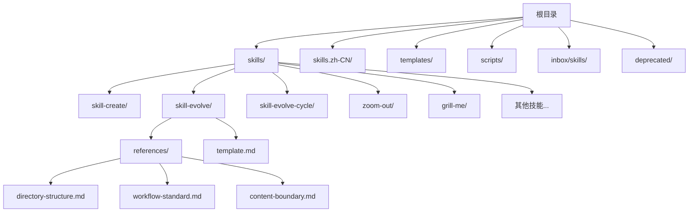
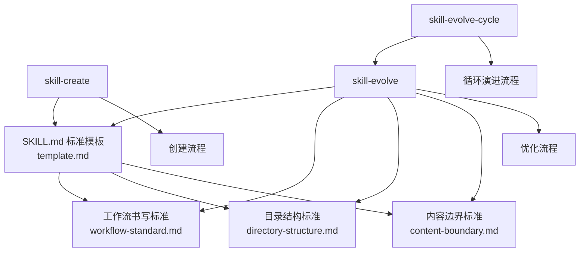
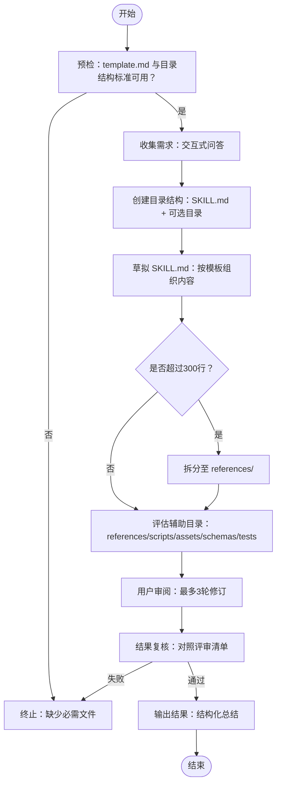
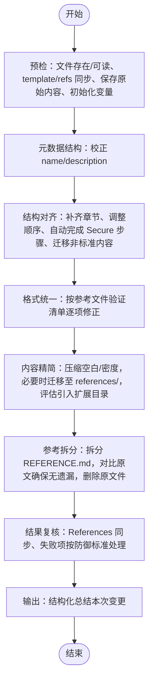
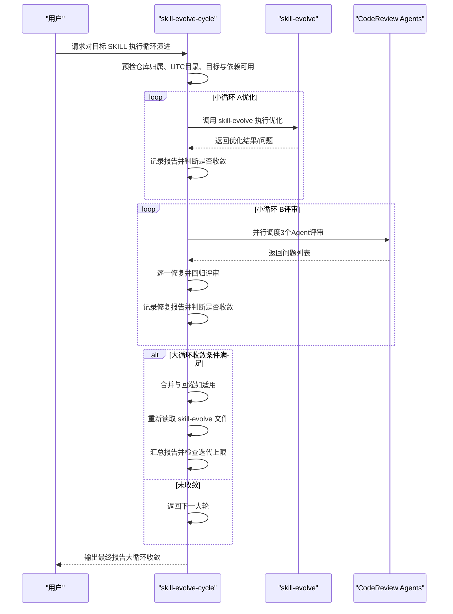
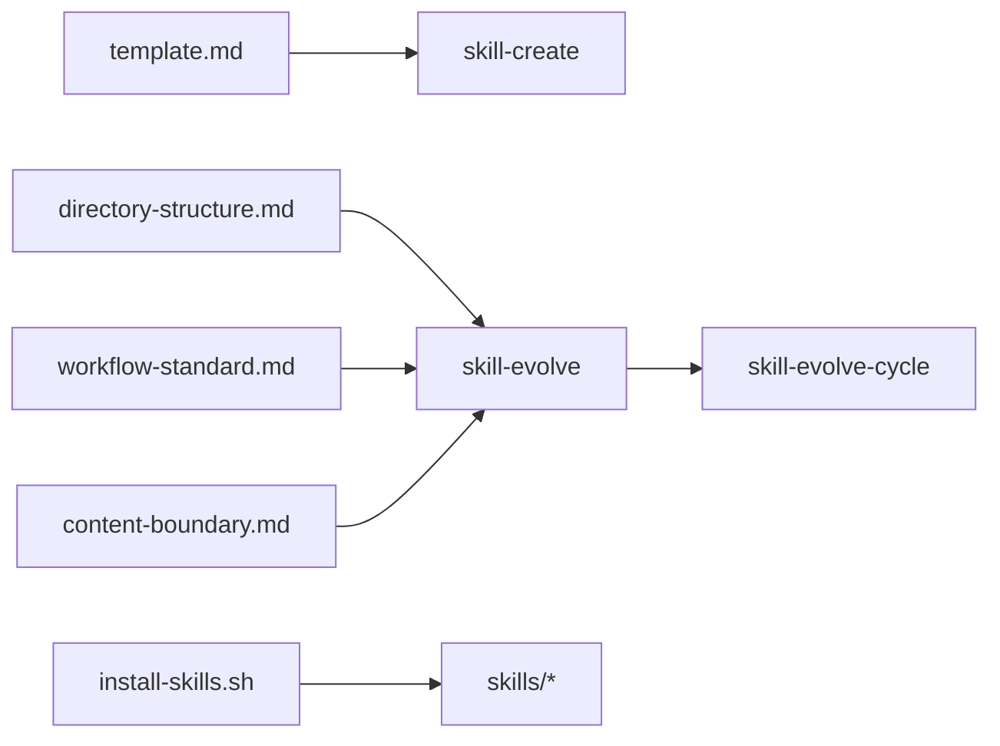

# 技能开发框架

<cite>
**本文档引用的文件**
- [README.md](file://README.md)
- [templates/SKILL.md](file://templates/SKILL.md)
- [skills/skill-create/SKILL.md](file://skills/skill-create/SKILL.md)
- [skills/skill-evolve/SKILL.md](file://skills/skill-evolve/SKILL.md)
- [skills/skill-evolve-cycle/SKILL.md](file://skills/skill-evolve-cycle/SKILL.md)
- [skills/skill-evolve/template.md](file://skills/skill-evolve/template.md)
- [skills/skill-evolve/references/directory-structure.md](file://skills/skill-evolve/references/directory-structure.md)
- [skills/skill-evolve/references/workflow-standard.md](file://skills/skill-evolve/references/workflow-standard.md)
- [skills/skill-evolve/references/content-boundary.md](file://skills/skill-evolve/references/content-boundary.md)
- [scripts/install-skills.sh](file://scripts/install-skills.sh)
- [skills/zoom-out/SKILL.md](file://skills/zoom-out/SKILL.md)
- [skills/zoom-out-lite/SKILL.md](file://skills/zoom-out-lite/SKILL.md)
- [skills/grill-me/SKILL.md](file://skills/grill-me/SKILL.md)
- [inbox/skills/tdd/SKILL.md](file://inbox/skills/tdd/SKILL.md)
- [inbox/skills/prototype/SKILL.md](file://inbox/skills/prototype/SKILL.md)
</cite>

## 目录
1. [简介](#简介)
2. [项目结构](#项目结构)
3. [核心组件](#核心组件)
4. [架构总览](#架构总览)
5. [详细组件分析](#详细组件分析)
6. [依赖关系分析](#依赖关系分析)
7. [性能考虑](#性能考虑)
8. [故障排查指南](#故障排查指南)
9. [结论](#结论)
10. [附录](#附录)

## 简介
本框架提供一套标准化的“技能”开发与演进体系，围绕三个核心技能展开：skill-create（从零创建）、skill-evolve（结构化优化）、skill-evolve-cycle（循环演进）。通过统一的 SKILL.md 模板与参考规范，确保技能文档具备一致性、可维护性与可复用性。同时，提供安装脚本与中文/英文双语资源，便于快速部署与使用。

## 项目结构
仓库采用按技能分层的目录组织方式，核心目录如下：
- skills：标准技能集合，每个技能以独立目录存放，包含 SKILL.md 与可选的 references/、scripts/ 等子目录
- skills.zh-CN：中文技能集合，结构与英文版一一对应
- templates：SKILL.md 标准模板与参考规范
- scripts：安装脚本，支持远程克隆与本地复制两种安装模式
- inbox/skills：待孵化或示例性质的技能草稿
- deprecated：废弃技能与历史版本

图表来源
- [README.md:1-113](file://README.md#L1-L113)
- [skills/skill-evolve/references/directory-structure.md:1-46](file://skills/skill-evolve/references/directory-structure.md#L1-L46)

章节来源
- [README.md:1-113](file://README.md#L1-L113)

## 核心组件
- skill-create：从零创建技能，遵循 skill-evolve 标准模板与目录结构，通过交互式问答收集需求并生成初稿，随后进入 review-check 与输出阶段
- skill-evolve：对既有 SKILL.md 进行结构化优化，包括元数据校正、章节对齐、格式统一、内容精简与参考文档拆分等
- skill-evolve-cycle：驱动“优化-评审-修复-合并-回灌”的循环演进，支持自演进与跨轮次收敛判断，生成多轮报告并汇总结果

章节来源
- [skills/skill-create/SKILL.md:1-447](file://skills/skill-create/SKILL.md#L1-L447)
- [skills/skill-evolve/SKILL.md:1-371](file://skills/skill-evolve/SKILL.md#L1-L371)
- [skills/skill-evolve-cycle/SKILL.md:1-308](file://skills/skill-evolve-cycle/SKILL.md#L1-L308)

## 架构总览
技能开发框架以“模板-规范-工具链”三位一体的方式运作：
- 模板：SKILL.md 标准模板定义八段式结构（概述、定义、前置条件、工作流、规则、示例、评审清单、参考）
- 规范：references 下的各类标准（目录结构、工作流书写、内容边界、标点约定等）作为约束与检查依据
- 工具链：skill-create、skill-evolve、skill-evolve-cycle 三者协同，形成从创建到优化再到循环演进的闭环

图表来源
- [skills/skill-evolve/template.md:1-247](file://skills/skill-evolve/template.md#L1-L247)
- [skills/skill-evolve/references/workflow-standard.md:1-800](file://skills/skill-evolve/references/workflow-standard.md#L1-L800)
- [skills/skill-evolve/references/directory-structure.md:1-46](file://skills/skill-evolve/references/directory-structure.md#L1-L46)
- [skills/skill-evolve/references/content-boundary.md:1-32](file://skills/skill-evolve/references/content-boundary.md#L1-L32)

## 详细组件分析

### 组件一：skill-create（技能创建）
职责与流程
- 预检：校验 skill-evolve 的 template.md 与目录结构标准是否存在
- 收集需求：通过交互式问答动态生成最多4个问题，记录用户输入
- 创建目录结构：遵循目录结构标准创建 SKILL.md 与可选的 references/、scripts/、assets/、tests/、schemas/
- 草拟 SKILL.md：按模板顺序组织内容，描述性字段遵循规则，必要时拆分为 references/
- 评估辅助目录：逐项确认是否需要 references/、scripts/、assets/、schemas/、tests/
- 用户审阅：最多3轮修订，超限自动推进
- 结果复核：对照评审清单逐项检查，失败终止
- 输出结果：结构化总结创建成果

图表来源
- [skills/skill-create/SKILL.md:25-88](file://skills/skill-create/SKILL.md#L25-L88)

章节来源
- [skills/skill-create/SKILL.md:1-447](file://skills/skill-create/SKILL.md#L1-L447)

### 组件二：skill-evolve（技能优化）
职责与流程
- 预检：目标 SKILL.md 存在且可读；template.md 结构可解析；references/ 文件存在并与 References 同步；保存原始内容副本；初始化全局变量
- 元数据结构：校正 name 与 description 格式，缺失或不合规时交互式修正
- 结构对齐：补齐缺失章节，按模板标准调整顺序；自动完成 Secure 步骤（Pre-check、Review Check、Output）；迁移非标准内容至 references/
- 格式统一：按各参考文件的验证清单逐项检查与修正；删除时效性信息；替换抽象变量名；术语链接完整性审计；自演进场景下同步更新 template.md
- 内容精简：若行数超过阈值，先压缩空白与密度，仍超阈值则迁移；根据复杂度评估是否引入 scripts/、tests/、assets/、schemas/
- 参考拆分：将 REFERENCE.md 拆分为多个文件，对比原文确保无遗漏，删除原 REFERENCE.md
- 结果复核：同步 References 与 references/；失败项按“防御标准”处理；输出优化前后对比
- 输出：结构化总结本次变更维度

图表来源
- [skills/skill-evolve/SKILL.md:30-172](file://skills/skill-evolve/SKILL.md#L30-L172)

章节来源
- [skills/skill-evolve/SKILL.md:1-371](file://skills/skill-evolve/SKILL.md#L1-L371)

### 组件三：skill-evolve-cycle（循环演进）
职责与流程
- 预检：判断仓库归属（是否为官方仓库）、创建 UTC 时间目录、校验目标 SKILL.md 与 skill-evolve 可用
- 小循环 A（优化）：反复执行 skill-evolve，直至收敛（首次优化未发现新问题）
- 小循环 B（评审）：并行调度三个 CodeReview Agent（完整性、正确性、影响）进行新鲜视角评审，记录问题并逐一修复，回归评审无新增问题即收敛
- 大循环收敛判断：小循环 A 首轮 0 问题 且 小循环 B 首轮 0 问题 时，进入大循环收敛
- 合并与回灌：根据仓库归属决定是否回灌到 skill-evolve；回灌后重新读取文件以使新规则生效
- 大循环迭代控制：汇总报告并检查迭代上限（最大30轮），未收敛则继续下一轮
- 结果复核与输出：输出最终报告，标记“大循环收敛”

图表来源
- [skills/skill-evolve-cycle/SKILL.md:45-151](file://skills/skill-evolve-cycle/SKILL.md#L45-L151)

章节来源
- [skills/skill-evolve-cycle/SKILL.md:1-308](file://skills/skill-evolve-cycle/SKILL.md#L1-L308)

### 组件四：SKILL.md 模板与参考规范
- 标准模板（template.md）：定义八段式结构与写作指引，强调“安全步骤”（Pre-check、Review Check、Output）与交互范式
- 目录结构（directory-structure.md）：规定技能目录标准与 references/ 文件规范，要求每份规范文件以“文件名 — 责任描述”开头，末尾包含“验证清单”
- 工作流标准（workflow-standard.md）：定义工作流标题命名、编号系统、树状分支、循环与迭代、跨步骤引用等书写规范
- 内容边界（content-boundary.md）：明确 SKILL.md 与 references/ 的内容归属，避免重复与交叉

章节来源
- [skills/skill-evolve/template.md:1-247](file://skills/skill-evolve/template.md#L1-L247)
- [skills/skill-evolve/references/directory-structure.md:1-46](file://skills/skill-evolve/references/directory-structure.md#L1-L46)
- [skills/skill-evolve/references/workflow-standard.md:1-800](file://skills/skill-evolve/references/workflow-standard.md#L1-L800)
- [skills/skill-evolve/references/content-boundary.md:1-32](file://skills/skill-evolve/references/content-boundary.md#L1-L32)

### 组件五：安装与部署
- install-skills.sh：支持远程克隆与本地复制两种模式，自动选择语言源（英文/中文），批量安装技能并处理覆盖冲突，清理临时目录
- 环境变量：SKILLS_DIR 可覆盖目标目录（默认 ~/.qoder/skills）

章节来源
- [scripts/install-skills.sh:1-146](file://scripts/install-skills.sh#L1-L146)

### 组件六：示例技能（概念与实践）
- zoom-out / zoom-out-lite：提供高阶上下文映射与模块关系视图，强调术语一致性与结构化输出
- grill-me：系统性压力测试用户方案，遵循决策树分支遍历与共识达成流程
- tdd：测试驱动开发理念与红-绿-重构循环，强调行为测试与垂直切片
- prototype：一次性原型设计，明确分支与规则，强调可运行性与快速删除

章节来源
- [skills/zoom-out/SKILL.md:1-190](file://skills/zoom-out/SKILL.md#L1-L190)
- [skills/zoom-out-lite/SKILL.md:1-12](file://skills/zoom-out-lite/SKILL.md#L1-L12)
- [skills/grill-me/SKILL.md:1-509](file://skills/grill-me/SKILL.md#L1-L509)
- [inbox/skills/tdd/SKILL.md:1-110](file://inbox/skills/tdd/SKILL.md#L1-L110)
- [inbox/skills/prototype/SKILL.md:1-31](file://inbox/skills/prototype/SKILL.md#L1-L31)

## 依赖关系分析
- skill-create 依赖 skill-evolve 的 template.md 与目录结构标准
- skill-evolve 依赖 references 下的多份规范文件（目录结构、工作流标准、内容边界等）
- skill-evolve-cycle 依赖 skill-evolve 的优化能力与 CodeReview Agent 的评审能力
- 安装脚本负责将技能复制到目标目录，支持语言源切换与覆盖策略

图表来源
- [skills/skill-evolve/template.md:1-247](file://skills/skill-evolve/template.md#L1-L247)
- [skills/skill-evolve/references/directory-structure.md:1-46](file://skills/skill-evolve/references/directory-structure.md#L1-L46)
- [skills/skill-evolve/references/workflow-standard.md:1-800](file://skills/skill-evolve/references/workflow-standard.md#L1-L800)
- [skills/skill-evolve/references/content-boundary.md:1-32](file://skills/skill-evolve/references/content-boundary.md#L1-L32)
- [scripts/install-skills.sh:1-146](file://scripts/install-skills.sh#L1-L146)

章节来源
- [README.md:1-113](file://README.md#L1-L113)

## 性能考虑
- 行数阈值控制：SKILL.md 建议不超过 300 行（创建阶段）或 500 行（优化阶段），超阈值自动迁移至 references/，降低阅读与维护成本
- 自动补全与幂等：工作流中的 Secure 步骤自动插入与重排，避免重复与遗漏；对“已符合规范”的条目标注跳过，减少二次处理
- 并行评审：小循环 B 使用三个 CodeReview Agent 并行评审，缩短收敛等待时间
- 回滚机制：预检阶段保存原始内容副本，遇到不可恢复错误时自动回滚，保障稳定性

## 故障排查指南
常见问题与处理
- 缺少必需文件：预检阶段若 template.md 或 references/ 文件缺失，需先补齐再继续
- 交互式确认：所有涉及用户决策的步骤必须使用 AskUserQuestion，避免纯文本引导导致行为偏差
- 引用一致性：References 与 references/ 文件必须保持同步，否则按验证清单自动修复或人工确认
- 自演进场景：当目标为 skill-evolve 自身时，需同步更新 template.md，避免规则与实现脱节
- 并行评审异常：若 CodeReview Agent 不可用，流程终止并记录原因，建议改用本地环境或降级处理

章节来源
- [skills/skill-evolve/SKILL.md:173-223](file://skills/skill-evolve/SKILL.md#L173-L223)
- [skills/skill-evolve-cycle/SKILL.md:152-186](file://skills/skill-evolve-cycle/SKILL.md#L152-L186)

## 结论
本框架通过标准化模板与严格规范，将技能开发从“经验驱动”转向“流程驱动”，显著提升技能质量与可维护性。skill-create、skill-evolve、skill-evolve-cycle 三者配合，形成从创建到优化再到循环演进的完整生命周期管理。结合安装脚本与多语言资源，开发者可快速落地并持续改进技能体系。

## 附录

### SKILL.md 模板标准结构与写作标准
- 标准结构：概述、定义、前置条件、工作流、规则、示例、评审清单、参考
- 写作要点：标题命名与编号、树状分支、循环与迭代、跨步骤引用、交互范式
- 参考文件：目录结构、工作流标准、内容边界、标点约定、文本优化、规则与评审清单写作标准

章节来源
- [skills/skill-evolve/template.md:8-247](file://skills/skill-evolve/template.md#L8-L247)
- [skills/skill-evolve/references/workflow-standard.md:185-800](file://skills/skill-evolve/references/workflow-standard.md#L185-L800)
- [skills/skill-evolve/references/content-boundary.md:1-32](file://skills/skill-evolve/references/content-boundary.md#L1-L32)

### 目录组织规范
- 标准目录：SKILL.md（核心执行说明）、scripts/（可执行脚本）、references/（详细参考文档）、assets/（静态资源）、tests/（测试用例）、schemas/（跨技能数据传输）
- references/ 文件规范：以“文件名 — 责任描述”开头，包含“验证清单”，避免交叉引用外部资源

章节来源
- [skills/skill-evolve/references/directory-structure.md:7-46](file://skills/skill-evolve/references/directory-structure.md#L7-L46)

### 版本控制与发布策略
- 循环演进：通过 skill-evolve-cycle 的多轮评审与修复，逐步收敛至稳定版本
- 回灌规则：在官方仓库场景下，将评审经验回灌至 skill-evolve 的相关规范文件，保持框架自身一致性
- 报告归档：每轮小循环与大循环均生成报告，最终汇总输出，便于追溯与审计

章节来源
- [skills/skill-evolve-cycle/SKILL.md:165-186](file://skills/skill-evolve-cycle/SKILL.md#L165-L186)