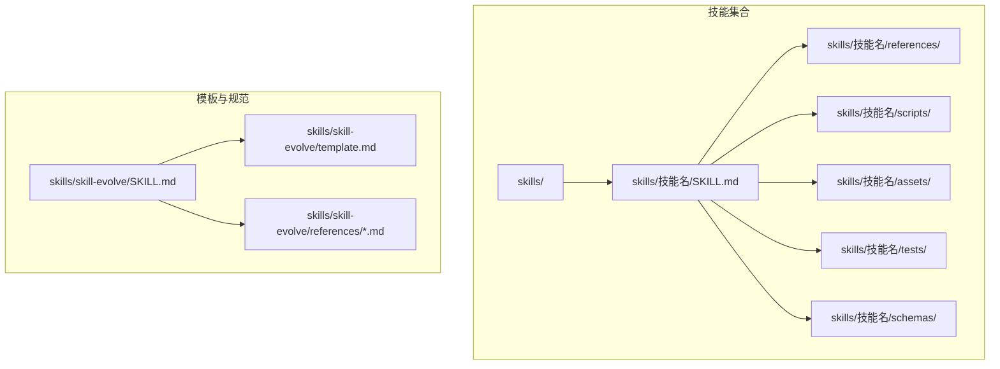
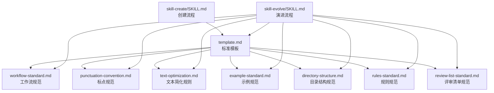
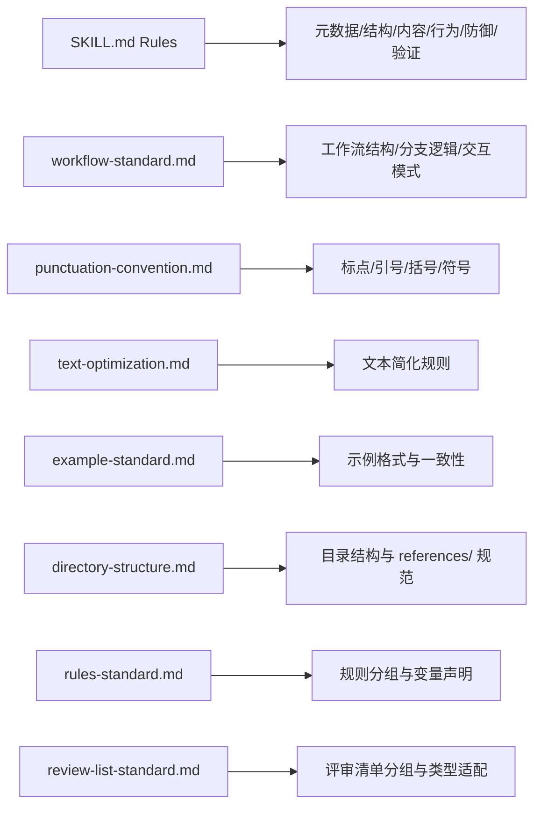

# 技能模板系统

<cite>
**本文档引用的文件**
- [README.md](file://README.md)
- [README.zh-CN.md](file://README.zh-CN.md)
- [templates/SKILL.md](file://templates/SKILL.md)
- [skills/skill-evolve/SKILL.md](file://skills/skill-evolve/SKILL.md)
- [skills/skill-evolve/template.md](file://skills/skill-evolve/template.md)
- [skills/skill-evolve/references/workflow-standard.md](file://skills/skill-evolve/references/workflow-standard.md)
- [skills/skill-evolve/references/directory-structure.md](file://skills/skill-evolve/references/directory-structure.md)
- [skills/skill-evolve/references/rules-standard.md](file://skills/skill-evolve/references/rules-standard.md)
- [skills/skill-evolve/references/review-list-standard.md](file://skills/skill-evolve/references/review-list-standard.md)
- [skills/skill-evolve/references/example-standard.md](file://skills/skill-evolve/references/example-standard.md)
- [skills/skill-evolve/references/text-optimization.md](file://skills/skill-evolve/references/text-optimization.md)
- [skills/skill-evolve/references/punctuation-convention.md](file://skills/skill-evolve/references/punctuation-convention.md)
- [skills/skill-evolve/references/content-boundary.md](file://skills/skill-evolve/references/content-boundary.md)
- [skills/skill-create/SKILL.md](file://skills/skill-create/SKILL.md)
- [skills/git-commit-helper/SKILL.md](file://skills/git-commit-helper/SKILL.md)
</cite>

## 目录
1. [引言](#引言)
2. [项目结构](#项目结构)
3. [核心组件](#核心组件)
4. [架构总览](#架构总览)
5. [详细组件分析](#详细组件分析)
6. [依赖关系分析](#依赖关系分析)
7. [性能考虑](#性能考虑)
8. [故障排查指南](#故障排查指南)
9. [结论](#结论)
10. [附录](#附录)

## 引言
本文件系统性阐述“技能模板系统”的结构与规范，围绕 SKILL.md 标准模板的八个标准部分进行逐项解析，并给出目录结构标准、辅助目录用途与创建规则、最佳实践与常见错误规避方法，以及模板示例与修改建议。目标读者既包括需要编写/优化技能的工程师，也包括希望理解系统运作机制的非技术读者。

## 项目结构
仓库采用“技能即目录”的组织方式，每个技能是一个自包含的目录，遵循统一的 agent-skills 规范。技能主文档为 SKILL.md，通常配合 references/、scripts/、assets/、schemas/、tests/ 等辅助目录使用。系统通过 skill-evolve 与 skill-create 等技能实现模板化创建与结构化优化。

图表来源
- [README.md:1-113](file://README.md#L1-L113)
- [skills/skill-evolve/SKILL.md:1-371](file://skills/skill-evolve/SKILL.md#L1-L371)
- [skills/skill-evolve/template.md](file://skills/skill-evolve/template.md)

章节来源
- [README.md:1-113](file://README.md#L1-L113)
- [README.zh-CN.md:1-113](file://README.zh-CN.md#L1-L113)

## 核心组件
- 标准模板与规范
  - SKILL.md 标准模板：由 skill-evolve/template.md 定义，包含八段式结构与写作指引。
  - 规范文件集：以 references/ 下的各类标准文件为核心，覆盖工作流、标点、简化规则、示例格式、目录结构、规则与评审清单等。
- 两套关键技能
  - skill-create：从零创建符合标准的 SKILL.md 与辅助目录，支持交互确认与自动检查。
  - skill-evolve：对既有 SKILL.md 进行结构化演进，包括元数据校正、结构对齐、格式标准化、内容精简、参考文档拆分与评审闭环。

章节来源
- [skills/skill-evolve/template.md](file://skills/skill-evolve/template.md)
- [skills/skill-evolve/SKILL.md:1-371](file://skills/skill-evolve/SKILL.md#L1-L371)
- [skills/skill-create/SKILL.md:1-447](file://skills/skill-create/SKILL.md#L1-L447)

## 架构总览
技能模板系统由“模板 + 规范 + 自动化技能”三层构成：
- 模板层：template.md 定义八段式结构与职责边界。
- 规范层：references/ 下的标准文件定义行为、格式、引用层级、术语与一致性要求。
- 执行层：skill-create 与 skill-evolve 作为自动化技能，按规范驱动 SKILL.md 的创建与优化。

图表来源
- [skills/skill-evolve/template.md](file://skills/skill-evolve/template.md)
- [skills/skill-evolve/references/workflow-standard.md:1-800](file://skills/skill-evolve/references/workflow-standard.md#L1-L800)
- [skills/skill-evolve/references/directory-structure.md:1-46](file://skills/skill-evolve/references/directory-structure.md#L1-L46)
- [skills/skill-evolve/references/rules-standard.md:1-58](file://skills/skill-evolve/references/rules-standard.md#L1-L58)
- [skills/skill-evolve/references/review-list-standard.md:1-35](file://skills/skill-evolve/references/review-list-standard.md#L1-L35)
- [skills/skill-evolve/references/example-standard.md:1-53](file://skills/skill-evolve/references/example-standard.md#L1-L53)
- [skills/skill-evolve/references/text-optimization.md:1-165](file://skills/skill-evolve/references/text-optimization.md#L1-L165)
- [skills/skill-evolve/references/punctuation-convention.md:1-187](file://skills/skill-evolve/references/punctuation-convention.md#L1-L187)
- [skills/skill-create/SKILL.md:1-447](file://skills/skill-create/SKILL.md#L1-L447)
- [skills/skill-evolve/SKILL.md:1-371](file://skills/skill-evolve/SKILL.md#L1-L371)

## 详细组件分析

### 八段式标准模板详解
SKILL.md 的八段式结构由 template.md 定义，具体要求如下：

- 概述（Overview）
  - 作用：概述技能目标、触发条件与价值定位。
  - 写法要点：第一句描述能力，第二句描述触发条件（Use when...），第三人称，不超过 1024 字符。
  - 参考路径：[skills/skill-evolve/template.md](file://skills/skill-evolve/template.md)

- 定义（Definitions）
  - 作用：明确关键术语与其锚点链接，确保跨文档一致引用。
  - 写法要点：每条定义必须有对应 <a id=""> 锚点，正文引用需使用 [术语](#锚点) 形式。
  - 参考路径：[skills/skill-evolve/references/review-list-standard.md:1-35](file://skills/skill-evolve/references/review-list-standard.md#L1-L35)

- 前置条件（Prerequisites）
  - 作用：列出执行前的环境、工具、权限与知识要求。
  - 写法要点：与 Pre-check 步骤保持同步，避免遗漏。
  - 参考路径：[skills/skill-evolve/references/workflow-standard.md:19-148](file://skills/skill-evolve/references/workflow-standard.md#L19-L148)

- 工作流（Workflow）
  - 作用：定义可执行的步骤序列，含固定安全步骤与分支逻辑。
  - 固定安全步骤：Pre-check（第 0 步）、Review Check（倒数第二步）、Output（最后一步）。
  - 分支与编号：使用树状箭头格式（Yes -> / No ->），子步骤缩进 2 空格；必要时使用数字子编号（如 4.1）。
  - 参考路径：[skills/skill-evolve/references/workflow-standard.md:185-377](file://skills/skill-evolve/references/workflow-standard.md#L185-L377)

- 规则（Rules）
  - 作用：约束行为与质量标准，确保一致性与可验证性。
  - 内容边界：元数据、结构、内容、行为、防御、验证等。
  - 变量声明：跨步骤变量需在 Definitions 中声明并初始化。
  - 参考路径：[skills/skill-evolve/references/rules-standard.md:1-58](file://skills/skill-evolve/references/rules-standard.md#L1-L58)

- 示例（Examples）
  - 作用：展示对话交互、评审检查与输出结果的示例格式。
  - 要求：对话示例、评审示例、输出示例均需包裹在代码块；示例与规则保持一致；步骤名称与最新工作流同步。
  - 参考路径：[skills/skill-evolve/references/example-standard.md:1-53](file://skills/skill-evolve/references/example-standard.md#L1-L53)

- 评审清单（Review List）
  - 作用：对输出质量进行逐项验证，确保符合规则与规范。
  - 内容边界：结果验证、质量接受标准；不包含过程约束。
  - 参考路径：[skills/skill-evolve/references/review-list-standard.md:1-35](file://skills/skill-evolve/references/review-list-standard.md#L1-L35)

- 参考（References）
  - 作用：列出相关规范与模板文件，形成闭环。
  - 参考路径：[skills/skill-evolve/SKILL.md:359-371](file://skills/skill-evolve/SKILL.md#L359-L371)

章节来源
- [skills/skill-evolve/template.md](file://skills/skill-evolve/template.md)
- [skills/skill-evolve/references/workflow-standard.md:185-377](file://skills/skill-evolve/references/workflow-standard.md#L185-L377)
- [skills/skill-evolve/references/rules-standard.md:1-58](file://skills/skill-evolve/references/rules-standard.md#L1-L58)
- [skills/skill-evolve/references/example-standard.md:1-53](file://skills/skill-evolve/references/example-standard.md#L1-L53)
- [skills/skill-evolve/references/review-list-standard.md:1-35](file://skills/skill-evolve/references/review-list-standard.md#L1-L35)
- [skills/skill-evolve/SKILL.md:359-371](file://skills/skill-evolve/SKILL.md#L359-L371)

### 目录结构标准与辅助目录
- 标准目录结构
  - 必需：SKILL.md（核心执行说明）
  - 可选：scripts/（可执行脚本）、references/（详细参考文档）、assets/（静态资源）、tests/（测试用例）、schemas/（跨技能数据传输）
- references/ 文件规范
  - 必须以“# 文件名 — 一行职责描述”开头；
  - 包含“## 概述”与若干主要内容段落；
  - 必须以“## 验证清单”收尾，列出被覆盖的检查项。
- 自我演进场景
  - 当目标为 skill-evolve 自身时，template.md 也纳入检查范围。
- 参考路径
  - [skills/skill-evolve/references/directory-structure.md:1-46](file://skills/skill-evolve/references/directory-structure.md#L1-L46)

章节来源
- [skills/skill-evolve/references/directory-structure.md:1-46](file://skills/skill-evolve/references/directory-structure.md#L1-L46)

### 规则与评审清单的关系与分界
- 规则（Rules）：约束执行行为（过程），不直接验证结果。
- 评审清单（Review List）：验证输出质量（结果），不约束行为。
- 关注分离：二者互不替代，但应保持一致性与互补性。
- 参考路径
  - [skills/skill-evolve/references/rules-standard.md:1-58](file://skills/skill-evolve/references/rules-standard.md#L1-L58)
  - [skills/skill-evolve/references/review-list-standard.md:1-35](file://skills/skill-evolve/references/review-list-standard.md#L1-L35)

章节来源
- [skills/skill-evolve/references/rules-standard.md:1-58](file://skills/skill-evolve/references/rules-standard.md#L1-L58)
- [skills/skill-evolve/references/review-list-standard.md:1-35](file://skills/skill-evolve/references/review-list-standard.md#L1-L35)

### 工作流书写标准与安全步骤
- 固定安全步骤
  - Pre-check（第 0 步）：环境与前置条件校验、模板存在性与可解析性、references/ 同步校验、全局变量初始化、与 Prerequisites 同步。
  - Review Check（倒数第二步）：逐项对照 Review List，失败即终止。
  - Output（最后一步）：输出结构化摘要并告知完成。
- 步骤编号与标题
  - 顶层步骤从 0 开始递增；标题格式为“N. **标题** — 描述；”，Em dash 两侧各一空格。
- 分支逻辑
  - 使用树状箭头格式（Yes -> / No ->），每条分支以“；”结尾；引入子操作以“：”结尾。
  - 条件语义必须与分支方向一致（使用“是否存在/满足”等正向条件）。
- 循环与迭代
  - 明确循环边界与重试上限；返回点精确到触发该操作的子步骤。
- 参考路径
  - [skills/skill-evolve/references/workflow-standard.md:19-148](file://skills/skill-evolve/references/workflow-standard.md#L19-L148)
  - [skills/skill-evolve/references/workflow-standard.md:379-764](file://skills/skill-evolve/references/workflow-standard.md#L379-L764)

章节来源
- [skills/skill-evolve/references/workflow-standard.md:19-148](file://skills/skill-evolve/references/workflow-standard.md#L19-L148)
- [skills/skill-evolve/references/workflow-standard.md:379-764](file://skills/skill-evolve/references/workflow-standard.md#L379-L764)

### 文本简化规则与安全边界
- 核心原则：简化可压缩“长度”，不可压缩“语义密度”。
- 白名单：包含 AskUserQuestion 的交互决策句不得简化。
- 四条规则（优先级从低到高）
  - 正向命令转换（Rule 1）：将“若不存在则创建”转为“确保存在”。
  - 删除冗余动词（Rule 2）：删除 AI 默认会隐式执行的步骤描述。
  - 省略自解释内容（Rule 3）：括号内纯补充信息可省略，但含边界条件不可省。
  - 语义去重（Rule 4）：相同关注点的多个子项可合并，不同边界不可合并。
- 与扩展格式的优先级：workflow-standard.md 的展开格式（树形分支、幂等守卫、顺序判断等）优先于压缩规则。
- 参考路径
  - [skills/skill-evolve/references/text-optimization.md:1-165](file://skills/skill-evolve/references/text-optimization.md#L1-L165)

章节来源
- [skills/skill-evolve/references/text-optimization.md:1-165](file://skills/skill-evolve/references/text-optimization.md#L1-L165)

### 标点与格式规范
- 中英文混排标点
  - 中文正文使用全角符号（。、，、：、；、（）、""、''），英文正文使用半角符号（.,:;()"')。
  - 代码块、行内代码与路径始终使用半角。
- 分支标记符号
  - 分支动作行以“；”结尾，引入子操作以“：”结尾；箭头统一使用半角“->”。
- 引号与括号
  - 中文使用中文弯引号，英文使用英文直引号；括号类型随语言切换。
- 特殊符号
  - “↔”仅用于 Definitions 表示等价映射；避免连续全角 em dash；HTML 属性值使用半角引号。
- 参考路径
  - [skills/skill-evolve/references/punctuation-convention.md:1-187](file://skills/skill-evolve/references/punctuation-convention.md#L1-L187)

章节来源
- [skills/skill-evolve/references/punctuation-convention.md:1-187](file://skills/skill-evolve/references/punctuation-convention.md#L1-L187)

### 示例格式与一致性
- 对话交互示例：使用粗体标题与代码块包裹对话内容；多示例以空行分隔。
- 评审检查示例：展示代表性通过项与完整失败场景，标注“AI 将逐一输出”；失败时显式终止。
- 输出示例：使用粗体标题与表格代码块；步骤名称与最新工作流同步。
- 一致性要求：示例内容与规则一致；示例数量与实际值解耦；对话交互示例聚焦步骤 0-5。
- 参考路径
  - [skills/skill-evolve/references/example-standard.md:1-53](file://skills/skill-evolve/references/example-standard.md#L1-L53)

章节来源
- [skills/skill-evolve/references/example-standard.md:1-53](file://skills/skill-evolve/references/example-standard.md#L1-L53)

### 模板使用最佳实践
- 创建阶段（skill-create）
  - 依赖 skill-evolve 的 template.md 与 directory-structure.md；
  - 通过 AskUserQuestion 收集需求，逐步生成 SKILL.md 与辅助目录；
  - 在 Review Check 中对照 Review List 逐项验证。
- 优化阶段（skill-evolve）
  - 元数据校正：name 与父目录一致，description 符合“能力 + 触发条件 + 第三人称”；
  - 结构对齐：补齐缺失段落，调整顺序，迁移非标准段落到 references/；
  - 格式标准化：统一分支箭头、标点、简化规则优先级；
  - 内容精简：控制 SKILL.md 行数，必要时迁移到 references/；
  - 参考拆分：将 REFERENCE.md 拆分为多文件，核对无内容丢失；
  - 评审闭环：逐项输出 Review List，失败即终止。
- 参考路径
  - [skills/skill-create/SKILL.md:1-447](file://skills/skill-create/SKILL.md#L1-L447)
  - [skills/skill-evolve/SKILL.md:1-371](file://skills/skill-evolve/SKILL.md#L1-L371)

章节来源
- [skills/skill-create/SKILL.md:1-447](file://skills/skill-create/SKILL.md#L1-L447)
- [skills/skill-evolve/SKILL.md:1-371](file://skills/skill-evolve/SKILL.md#L1-L371)

### 常见错误与规避方法
- 错误：分支缺少负分支或仅单分支
  - 危害：AI 不确定“否则”行为，可能报错或跳过。
  - 规避：使用 Yes -> / No -> 并明确终止或继续。
  - 参考路径：[skills/skill-evolve/references/workflow-standard.md:649-764](file://skills/skill-evolve/references/workflow-standard.md#L649-L764)
- 错误：条件语义与分支方向不匹配
  - 危害：AI 将 Good/Bad 与 Yes/No 混淆。
  - 规避：使用“是否存在/满足”等正向条件。
  - 参考路径：[skills/skill-evolve/references/workflow-standard.md:529-578](file://skills/skill-evolve/references/workflow-standard.md#L529-L578)
- 错误：简化规则误用导致语义丢失
  - 危害：AI 无法正确执行或遗漏关键动作。
  - 规避：严格遵守四条规则与白名单；展开格式优先。
  - 参考路径：[skills/skill-evolve/references/text-optimization.md:73-86](file://skills/skill-evolve/references/text-optimization.md#L73-L86)
- 错误：标点混用或符号不一致
  - 危害：AI 学习格式紊乱，生成不一致内容。
  - 规避：严格遵循中英文符号区分与分支标记规范。
  - 参考路径：[skills/skill-evolve/references/punctuation-convention.md:13-187](file://skills/skill-evolve/references/punctuation-convention.md#L13-L187)
- 错误：示例与规则/工作流不同步
  - 危害：评审失败或误导使用者。
  - 规避：示例中的步骤名称与数量与最新工作流保持一致。
  - 参考路径：[skills/skill-evolve/references/example-standard.md:29-53](file://skills/skill-evolve/references/example-standard.md#L29-L53)

章节来源
- [skills/skill-evolve/references/workflow-standard.md:529-578](file://skills/skill-evolve/references/workflow-standard.md#L529-L578)
- [skills/skill-evolve/references/workflow-standard.md:649-764](file://skills/skill-evolve/references/workflow-standard.md#L649-L764)
- [skills/skill-evolve/references/text-optimization.md:73-86](file://skills/skill-evolve/references/text-optimization.md#L73-L86)
- [skills/skill-evolve/references/punctuation-convention.md:13-187](file://skills/skill-evolve/references/punctuation-convention.md#L13-L187)
- [skills/skill-evolve/references/example-standard.md:29-53](file://skills/skill-evolve/references/example-standard.md#L29-L53)

### 模板示例与修改建议
- 示例一：git-commit-helper（工作流与评审清单）
  - 展示了完整的 Pre-check、Determine input source、Get diff、Analyze changes、Confirm commit message、Review check、Output 结构；
  - 强调交互必须使用 AskUserQuestion，分支逻辑严格遵循树状箭头与终止符。
  - 参考路径：[skills/git-commit-helper/SKILL.md:1-296](file://skills/git-commit-helper/SKILL.md#L1-L296)
- 示例二：skill-create（创建流程）
  - 展示了从需求收集到草稿评审再到最终输出的完整闭环；
  - 对示例格式、评审检查与输出示例有明确要求。
  - 参考路径：[skills/skill-create/SKILL.md:1-447](file://skills/skill-create/SKILL.md#L1-L447)
- 修改建议
  - 若 SKILL.md 超过 300 行，优先拆分至 references/ 并更新链接；
  - 若存在 REFERENCE.md，按域拆分为多个文件并逐一核对；
  - 统一标点与分支格式，确保评审清单可逐项验证。

章节来源
- [skills/git-commit-helper/SKILL.md:1-296](file://skills/git-commit-helper/SKILL.md#L1-L296)
- [skills/skill-create/SKILL.md:1-447](file://skills/skill-create/SKILL.md#L1-L447)

## 依赖关系分析
- 内容边界
  - 工作流结构、标点、简化规则、示例格式、目录结构、规则与评审清单的写作规范分别归属 references/ 下对应文件；
  - 元数据、结构、内容、行为、防御、验证等标准留在 SKILL.md 的 Rules 中。
- 参考路径
  - [skills/skill-evolve/references/content-boundary.md:1-32](file://skills/skill-evolve/references/content-boundary.md#L1-L32)

图表来源
- [skills/skill-evolve/references/content-boundary.md:1-32](file://skills/skill-evolve/references/content-boundary.md#L1-L32)
- [skills/skill-evolve/references/workflow-standard.md:1-800](file://skills/skill-evolve/references/workflow-standard.md#L1-L800)
- [skills/skill-evolve/references/punctuation-convention.md:1-187](file://skills/skill-evolve/references/punctuation-convention.md#L1-L187)
- [skills/skill-evolve/references/text-optimization.md:1-165](file://skills/skill-evolve/references/text-optimization.md#L1-L165)
- [skills/skill-evolve/references/example-standard.md:1-53](file://skills/skill-evolve/references/example-standard.md#L1-L53)
- [skills/skill-evolve/references/directory-structure.md:1-46](file://skills/skill-evolve/references/directory-structure.md#L1-L46)
- [skills/skill-evolve/references/rules-standard.md:1-58](file://skills/skill-evolve/references/rules-standard.md#L1-L58)
- [skills/skill-evolve/references/review-list-standard.md:1-35](file://skills/skill-evolve/references/review-list-standard.md#L1-L35)

章节来源
- [skills/skill-evolve/references/content-boundary.md:1-32](file://skills/skill-evolve/references/content-boundary.md#L1-L32)

## 性能考虑
- 内容体量控制
  - SKILL.md 行数建议不超过 300 行；超过时优先迁移到 references/，减少正文复杂度。
- 复杂度评估
  - 当 references/ 文件数量 > 10、分支深度 > 5 层、工作流步骤 > 20 时，建议引入 scripts/、tests/、assets/、schemas/ 等辅助目录。
- 参考路径
  - [skills/skill-evolve/SKILL.md:114-131](file://skills/skill-evolve/SKILL.md#L114-L131)
  - [skills/skill-create/SKILL.md:89-99](file://skills/skill-create/SKILL.md#L89-L99)

## 故障排查指南
- 常见问题与处理
  - 描述格式不符合“能力 + 触发条件 + 第三人称”
    - 处理：根据 Rules 中的元数据标准修正 description。
  - 缺失标准段落或顺序不当
    - 处理：依据 template.md 对齐结构，迁移非标准段落到 references/。
  - 引用层级超过一级
    - 处理：references/ 文件不应链接外部资源，避免二层引用。
  - 评审失败
    - 处理：根据 Review List 逐项修正，失败时终止流程并记录原因。
- 参考路径
  - [skills/skill-evolve/SKILL.md:173-223](file://skills/skill-evolve/SKILL.md#L173-L223)
  - [skills/skill-evolve/SKILL.md:306-358](file://skills/skill-evolve/SKILL.md#L306-L358)

章节来源
- [skills/skill-evolve/SKILL.md:173-223](file://skills/skill-evolve/SKILL.md#L173-L223)
- [skills/skill-evolve/SKILL.md:306-358](file://skills/skill-evolve/SKILL.md#L306-L358)

## 结论
技能模板系统通过“标准模板 + 规范文件 + 自动化技能”的组合，实现了 SKILL.md 的结构化创建与持续演进。遵循八段式模板、目录结构标准与各类规范，可显著提升技能文档的一致性、可读性与可维护性。建议在团队内推广 skill-create 与 skill-evolve 的使用，并将评审清单作为质量门禁严格执行。

## 附录
- 快速参考
  - 模板文件：[skills/skill-evolve/template.md](file://skills/skill-evolve/template.md)
  - 工作流规范：[skills/skill-evolve/references/workflow-standard.md](file://skills/skill-evolve/references/workflow-standard.md)
  - 目录结构规范：[skills/skill-evolve/references/directory-structure.md](file://skills/skill-evolve/references/directory-structure.md)
  - 规则规范：[skills/skill-evolve/references/rules-standard.md](file://skills/skill-evolve/references/rules-standard.md)
  - 评审清单规范：[skills/skill-evolve/references/review-list-standard.md](file://skills/skill-evolve/references/review-list-standard.md)
  - 示例规范：[skills/skill-evolve/references/example-standard.md](file://skills/skill-evolve/references/example-standard.md)
  - 文本简化规则：[skills/skill-evolve/references/text-optimization.md](file://skills/skill-evolve/references/text-optimization.md)
  - 标点规范：[skills/skill-evolve/references/punctuation-convention.md](file://skills/skill-evolve/references/punctuation-convention.md)
  - 内容边界：[skills/skill-evolve/references/content-boundary.md](file://skills/skill-evolve/references/content-boundary.md)
- 示例技能
  - 创建流程：[skills/skill-create/SKILL.md](file://skills/skill-create/SKILL.md)
  - 工作流与评审：[skills/git-commit-helper/SKILL.md](file://skills/git-commit-helper/SKILL.md)