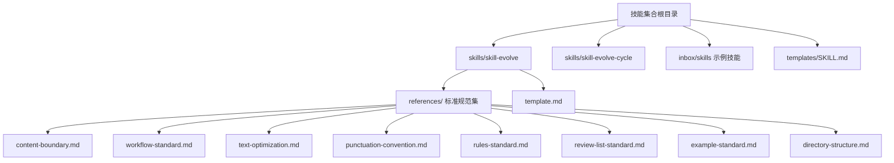
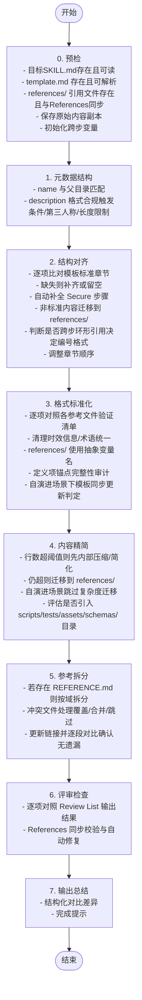
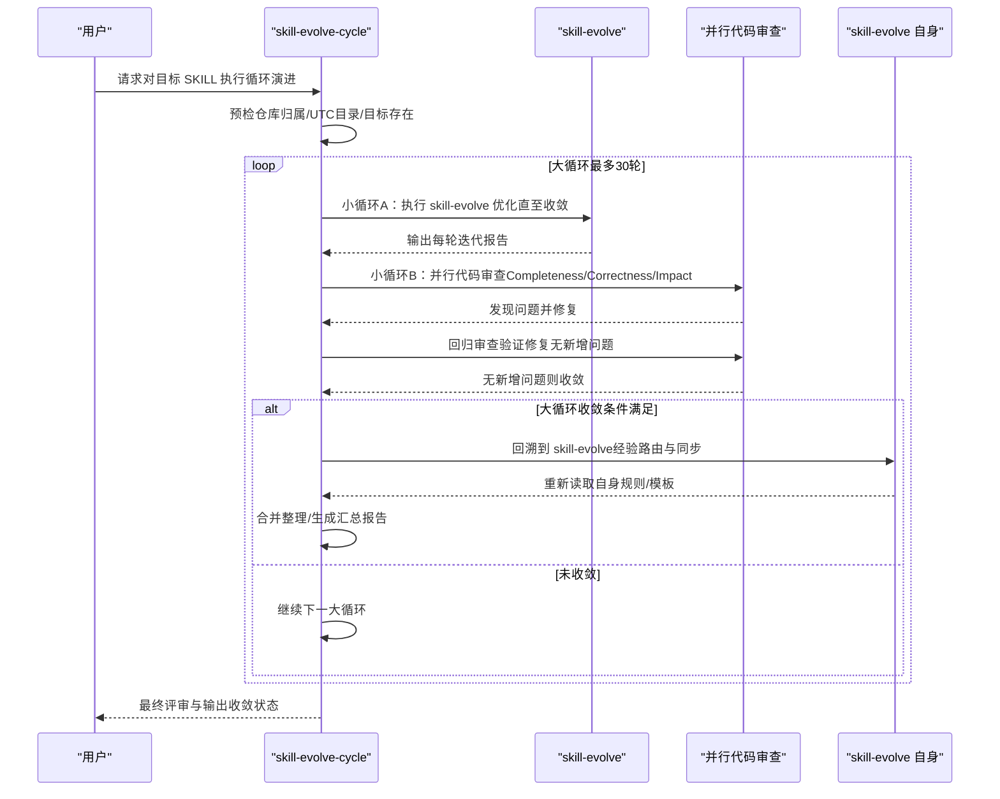
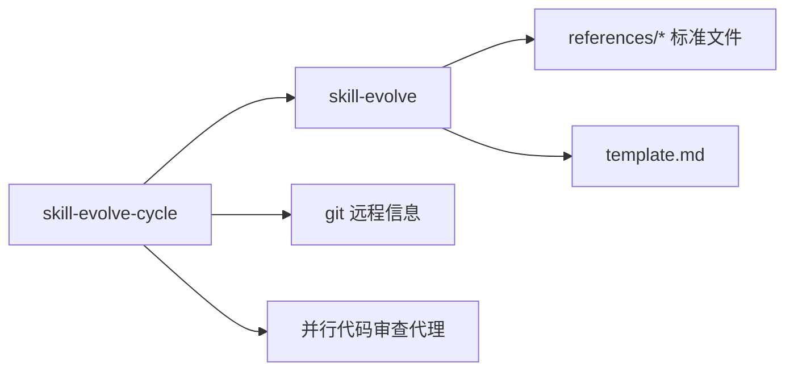

# 技能演进框架

<cite>
**本文档引用的文件**
- [README.md](file://README.md)
- [skill-evolve/SKILL.md](file://skills/skill-evolve/SKILL.md)
- [skill-evolve-cycle/SKILL.md](file://skills/skill-evolve-cycle/SKILL.md)
- [skill-evolve/template.md](file://skills/skill-evolve/template.md)
- [skill-evolve/references/content-boundary.md](file://skills/skill-evolve/references/content-boundary.md)
- [skill-evolve/references/workflow-standard.md](file://skills/skill-evolve/references/workflow-standard.md)
- [skill-evolve/references/text-optimization.md](file://skills/skill-evolve/references/text-optimization.md)
- [skill-evolve/references/rules-standard.md](file://skills/skill-evolve/references/rules-standard.md)
- [skill-evolve/references/directory-structure.md](file://skills/skill-evolve/references/directory-structure.md)
- [skill-evolve/references/punctuation-convention.md](file://skills/skill-evolve/references/punctuation-convention.md)
- [skill-evolve/references/review-list-standard.md](file://skills/skill-evolve/references/review-list-standard.md)
- [skill-evolve/references/example-standard.md](file://skills/skill-evolve/references/example-standard.md)
- [inbox/skills/grill-with-docs/SKILL.md](file://inbox/skills/grill-with-docs/SKILL.md)
- [inbox/skills/improve-codebase-architecture/SKILL.md](file://inbox/skills/improve-codebase-architecture/SKILL.md)
- [templates/SKILL.md](file://templates/SKILL.md)
</cite>

## 目录
1. [引言](#引言)
2. [项目结构](#项目结构)
3. [核心组件](#核心组件)
4. [架构总览](#架构总览)
5. [详细组件分析](#详细组件分析)
6. [依赖分析](#依赖分析)
7. [性能考虑](#性能考虑)
8. [故障排查指南](#故障排查指南)
9. [结论](#结论)
10. [附录](#附录)

## 引言
本文件系统化阐述“技能演进框架”的设计与实践，重点围绕 skill-evolve 与 skill-evolve-cycle 两大核心能力，给出可操作的优化流程、循环机制、质量评估与持续改进策略。通过对模板、标准规范与参考文件的统一治理，确保技能文档在结构、内容、交互与可维护性上的持续提升。

## 项目结构
仓库采用“技能 + 标准 + 参考”的组织方式：
- skills/skill-evolve：单次结构化演进与优化
- skills/skill-evolve-cycle：循环演进（优化-审查-修复-合并-反馈）
- skills/skill-evolve/references：内容边界、工作流、文本优化、标点约定、规则、评审清单、示例等标准文件
- skills/skill-evolve/template.md：统一模板
- inbox/skills：待演进或示例技能样例
- templates/SKILL.md：最小可用模板

图表来源
- [README.md](file://README.md)
- [skill-evolve/SKILL.md](file://skills/skill-evolve/SKILL.md)
- [skill-evolve-cycle/SKILL.md](file://skills/skill-evolve-cycle/SKILL.md)
- [skill-evolve/template.md](file://skills/skill-evolve/template.md)
- [skill-evolve/references/content-boundary.md](file://skills/skill-evolve/references/content-boundary.md)

章节来源
- [README.md](file://README.md)
- [skill-evolve/SKILL.md](file://skills/skill-evolve/SKILL.md)
- [skill-evolve-cycle/SKILL.md](file://skills/skill-evolve-cycle/SKILL.md)
- [skill-evolve/template.md](file://skills/skill-evolve/template.md)

## 核心组件
- skill-evolve：对单个 SKILL.md 进行结构对齐、格式标准化、内容精简、参考拆分与评审校验，支持自我演进场景下的模板同步更新。
- skill-evolve-cycle：在多个轮次内交替执行“优化-审查-修复-合并-反馈”，通过收敛判断与报告归档，推动技能稳定与持续改进。

章节来源
- [skill-evolve/SKILL.md](file://skills/skill-evolve/SKILL.md)
- [skill-evolve-cycle/SKILL.md](file://skills/skill-evolve-cycle/SKILL.md)

## 架构总览
技能演进框架由“单轮优化”和“循环演进”两条主线构成，前者负责结构与内容的标准化，后者负责质量闭环与经验沉淀。

```mermaid
graph TB
subgraph "单轮优化skill-evolve"
SE1["预检<br/>前置条件与模板/引用一致性"]
SE2["元数据结构<br/>name/description 合规"]
SE3["结构对齐<br/>标准章节补齐/重排"]
SE4["格式标准化<br/>行为/格式/术语/锚点"]
SE5["内容精简<br/>行数控制/复杂度迁移"]
SE6["参考拆分<br/>REFERENCE.md 拆解"]
SE7["评审检查<br/>对照 Review List"]
SE8["输出总结<br/>对比差异与完成状态"]
end
subgraph "循环演进skill-evolve-cycle"
SC1["预检<br/>仓库归属/UTC时间目录/目标存在"]
SC2["小循环A优化<br/>skill-evolve 迭代收敛"]
SC3["小循环B审查<br/>并行代码审查+修复+回归"]
SC4["大循环收敛判断<br/>A首轮0问题 且 B首轮0问题"]
SC5["合并整理<br/>按仓库归属分流"]
SC6["回溯到 skill-evolve<br/>经验路由与同步更新"]
SC7["大循环迭代控制<br/>上限30轮"]
SC8["最终评审与输出"]
end
SE1 --> SE2 --> SE3 --> SE4 --> SE5 --> SE6 --> SE7 --> SE8
SC1 --> SC2 --> SC3 --> SC4 --> SC5 --> SC6 --> SC7 --> SC8
```

图表来源
- [skill-evolve/SKILL.md](file://skills/skill-evolve/SKILL.md)
- [skill-evolve-cycle/SKILL.md](file://skills/skill-evolve-cycle/SKILL.md)

## 详细组件分析

### skill-evolve 组件分析
skill-evolve 是面向单个技能的“结构化演进与内容优化”工具，其核心流程如下：

图表来源
- [skill-evolve/SKILL.md](file://skills/skill-evolve/SKILL.md)
- [skill-evolve/references/workflow-standard.md](file://skills/skill-evolve/references/workflow-standard.md)
- [skill-evolve/references/text-optimization.md](file://skills/skill-evolve/references/text-optimization.md)
- [skill-evolve/references/directory-structure.md](file://skills/skill-evolve/references/directory-structure.md)

章节来源
- [skill-evolve/SKILL.md](file://skills/skill-evolve/SKILL.md)
- [skill-evolve/template.md](file://skills/skill-evolve/template.md)
- [skill-evolve/references/workflow-standard.md](file://skills/skill-evolve/references/workflow-standard.md)
- [skill-evolve/references/text-optimization.md](file://skills/skill-evolve/references/text-optimization.md)
- [skill-evolve/references/directory-structure.md](file://skills/skill-evolve/references/directory-structure.md)

### skill-evolve-cycle 组件分析
skill-evolve-cycle 通过“小循环A（优化）+ 小循环B（审查）+ 大循环收敛”形成闭环，确保质量与一致性。

图表来源
- [skill-evolve-cycle/SKILL.md](file://skills/skill-evolve-cycle/SKILL.md)
- [skill-evolve/SKILL.md](file://skills/skill-evolve/SKILL.md)

章节来源
- [skill-evolve-cycle/SKILL.md](file://skills/skill-evolve-cycle/SKILL.md)

### 标准与规范体系
- 内容边界：明确 SKILL.md 与 references/ 文件的职责划分，避免重复与越界。
- 工作流标准：固定“Pre-check/Review Check/Output”三类安全步骤，统一编号、标题、子步骤与分支逻辑。
- 文本优化：在不稀释语义密度的前提下压缩冗余，保留交互与时序约束。
- 规则书写：按元数据/结构/内容/行为/防御/验证六维分组，强调过程约束与一致性。
- 目录结构：统一技能目录与 references/ 文件格式，支持自演进场景下的模板同步检查。
- 标点约定：中英混排的符号规范，分支标记符号绑定，避免 AI 格式学习紊乱。
- 评审清单：结果质量验证维度，与规则保持关注分离。
- 示例规范：对话交互、评审检查与输出示例的格式与一致性要求。

章节来源
- [skill-evolve/references/content-boundary.md](file://skills/skill-evolve/references/content-boundary.md)
- [skill-evolve/references/workflow-standard.md](file://skills/skill-evolve/references/workflow-standard.md)
- [skill-evolve/references/text-optimization.md](file://skills/skill-evolve/references/text-optimization.md)
- [skill-evolve/references/rules-standard.md](file://skills/skill-evolve/references/rules-standard.md)
- [skill-evolve/references/directory-structure.md](file://skills/skill-evolve/references/directory-structure.md)
- [skill-evolve/references/punctuation-convention.md](file://skills/skill-evolve/references/punctuation-convention.md)
- [skill-evolve/references/review-list-standard.md](file://skills/skill-evolve/references/review-list-standard.md)
- [skill-evolve/references/example-standard.md](file://skills/skill-evolve/references/example-standard.md)

### 技能质量评估标准与方法
- 元数据：name 与父目录一致，description 包含触发条件、第三人称、长度限制。
- 结构：标准章节齐全、顺序正确、安全步骤完备、无中断演进痕迹。
- 内容：行数控制、无时效信息、术语一致、无外部引用层级、锚点链接完整。
- 行为：交互统一使用 AskUserQuestion、分支逻辑树状箭头、步骤责任独立。
- 防护：删除/移动/拆分均同步处理副作用（链接更新、相对路径修正），不可恢复错误可回滚。
- 验证：评审清单覆盖规则关注点，示例与规则自洽，Workflow 与示例流程同步。

章节来源
- [skill-evolve/SKILL.md](file://skills/skill-evolve/SKILL.md)
- [skill-evolve-cycle/SKILL.md](file://skills/skill-evolve-cycle/SKILL.md)
- [skill-evolve/references/review-list-standard.md](file://skills/skill-evolve/references/review-list-standard.md)

### 技能演进的循环机制与持续改进策略
- 小循环A：由 skill-evolve 执行结构与内容优化，直至无新问题。
- 小循环B：并行代码审查（Completeness/Correctness/Impact）发现与修复问题，回归验证确保无新增问题。
- 大循环收敛：要求 A 首轮与 B 首轮均无问题，方可进入合并与回溯阶段。
- 回溯到 skill-evolve：将有价值的评审经验路由到对应 references/ 文件，必要时同步更新模板，形成“自演进”闭环。
- 报告归档：每轮生成 cycle{round}-A-{iteration}.md、cycle{round}-B-{iteration}.md、cycle{round}-B-{iteration}-fix{fix-round}.md、cycle{round}-summary.md 与 final-summary.md。

章节来源
- [skill-evolve-cycle/SKILL.md](file://skills/skill-evolve-cycle/SKILL.md)

### 具体演进案例与改进建议
- 案例一：grill-with-docs
  - 现状：技能以非标准章节组织，术语与文档散落，缺乏 references/ 分层。
  - 建议：使用 skill-evolve 将支撑信息迁移至 references/ 并拆分为 CONTEXT-FORMAT.md、ADR-FORMAT.md 等；通过 Review List 校验术语一致性与文档完整性。
- 案例二：improve-codebase-architecture
  - 现状：流程描述偏口语化，术语定义与接口设计分散。
  - 建议：借助 template.md 与 workflow-standard.md 规范步骤与分支；以 text-optimization.md 压缩冗余而不丢失关键约束；以 rules-standard.md 明确交互与行为约束。

章节来源
- [inbox/skills/grill-with-docs/SKILL.md](file://inbox/skills/grill-with-docs/SKILL.md)
- [inbox/skills/improve-codebase-architecture/SKILL.md](file://inbox/skills/improve-codebase-architecture/SKILL.md)
- [skill-evolve/template.md](file://skills/skill-evolve/template.md)
- [skill-evolve/references/workflow-standard.md](file://skills/skill-evolve/references/workflow-standard.md)
- [skill-evolve/references/text-optimization.md](file://skills/skill-evolve/references/text-optimization.md)
- [skill-evolve/references/rules-standard.md](file://skills/skill-evolve/references/rules-standard.md)

### 如何将新技能纳入演进框架进行标准化处理
- 创建阶段：使用模板 SKILL.md 作为起点，确保包含 Overview/Definitions/Prerequisites/Workflow/Rules/Examples/Review List/References。
- 标准化流程：运行 skill-evolve，按步骤完成元数据、结构、格式、内容与参考拆分的优化。
- 循环演进：对关键技能启用 skill-evolve-cycle，通过多轮优化-审查-修复-合并-反馈，达到收敛并沉淀经验。
- 持续改进：将评审经验回溯到 skill-evolve 的 references/ 文件，必要时同步更新 template.md，保障框架自身的一致性。

章节来源
- [templates/SKILL.md](file://templates/SKILL.md)
- [skill-evolve/SKILL.md](file://skills/skill-evolve/SKILL.md)
- [skill-evolve-cycle/SKILL.md](file://skills/skill-evolve-cycle/SKILL.md)
- [skill-evolve/template.md](file://skills/skill-evolve/template.md)

## 依赖分析
- 组件耦合
  - skill-evolve 依赖 references/ 下的各类标准文件，形成“规则-验证-示例”的闭环。
  - skill-evolve-cycle 依赖 skill-evolve 的演进结果与评审清单，形成“优化-审查-修复-合并-反馈”的闭环。
- 外部依赖
  - Git 远程仓库信息用于判断是否为“技能原始仓库”，影响回溯到 skill-evolve 的行为。
  - 并行代码审查代理（Completeness/Correctness/Impact）严格按固定数量与视角执行，不得降级或合并。

图表来源
- [skill-evolve/SKILL.md](file://skills/skill-evolve/SKILL.md)
- [skill-evolve-cycle/SKILL.md](file://skills/skill-evolve-cycle/SKILL.md)
- [skill-evolve/template.md](file://skills/skill-evolve/template.md)

章节来源
- [skill-evolve/SKILL.md](file://skills/skill-evolve/SKILL.md)
- [skill-evolve-cycle/SKILL.md](file://skills/skill-evolve-cycle/SKILL.md)

## 性能考虑
- 优化优先级：先内部压缩/简化，再考虑迁移到 references/，减少文件体量与链接复杂度。
- 并行审查：小循环B阶段并行执行三个代理，提高问题发现与修复效率。
- 自动补全：通过工作流标准自动插入/移动/重排安全步骤，降低人工干预成本。
- 报告持久化：每轮生成结构化报告，便于追踪与复盘，避免重复劳动。

## 故障排查指南
- 预检失败
  - 目标文件不存在或不可读：检查路径与权限，确保目标 SKILL.md 存在。
  - template.md 缺失或不可解析：确保模板存在且结构符合预期。
  - references/ 引用缺失：根据 References 同步校验修复，必要时交互确认。
- 不可恢复错误
  - 文件写入失败或链接更新后出现死链：使用预检阶段保存的原始内容副本进行回滚，并告知用户恢复结果。
- 评审失败
  - 任一检查项未通过：根据评审清单逐项修正，必要时终止流程并建议手动检查与重试。

章节来源
- [skill-evolve/SKILL.md](file://skills/skill-evolve/SKILL.md)
- [skill-evolve-cycle/SKILL.md](file://skills/skill-evolve-cycle/SKILL.md)

## 结论
技能演进框架通过 skill-evolve 与 skill-evolve-cycle 的协同，实现了“结构化演进 + 循环质量闭环”的双轨制。依托统一模板与标准规范，确保技能文档在一致性、可维护性与可扩展性上的持续提升。建议在团队内推广该框架，将新技能纳入标准化流程，并定期回溯评审经验，驱动框架自身的迭代完善。

## 附录
- 快速参考
  - 模板：template.md
  - 工作流：workflow-standard.md
  - 文本优化：text-optimization.md
  - 规则：rules-standard.md
  - 目录结构：directory-structure.md
  - 标点约定：punctuation-convention.md
  - 评审清单：review-list-standard.md
  - 示例规范：example-standard.md
  - 内容边界：content-boundary.md

章节来源
- [skill-evolve/template.md](file://skills/skill-evolve/template.md)
- [skill-evolve/references/workflow-standard.md](file://skills/skill-evolve/references/workflow-standard.md)
- [skill-evolve/references/text-optimization.md](file://skills/skill-evolve/references/text-optimization.md)
- [skill-evolve/references/rules-standard.md](file://skills/skill-evolve/references/rules-standard.md)
- [skill-evolve/references/directory-structure.md](file://skills/skill-evolve/references/directory-structure.md)
- [skill-evolve/references/punctuation-convention.md](file://skills/skill-evolve/references/punctuation-convention.md)
- [skill-evolve/references/review-list-standard.md](file://skills/skill-evolve/references/review-list-standard.md)
- [skill-evolve/references/example-standard.md](file://skills/skill-evolve/references/example-standard.md)
- [skill-evolve/references/content-boundary.md](file://skills/skill-evolve/references/content-boundary.md)