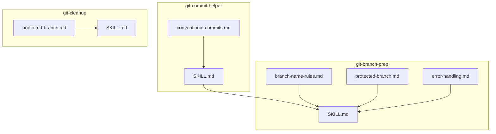
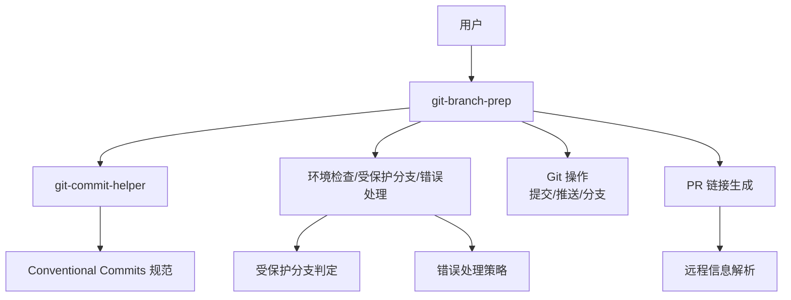
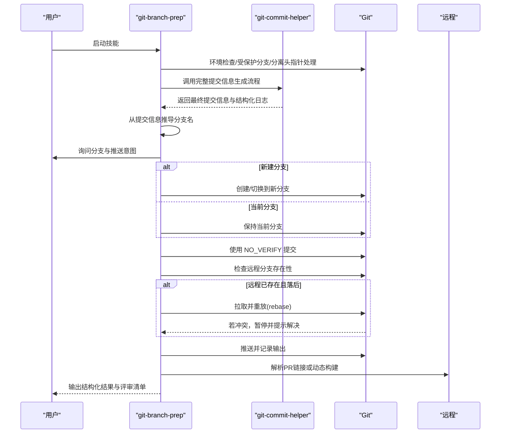
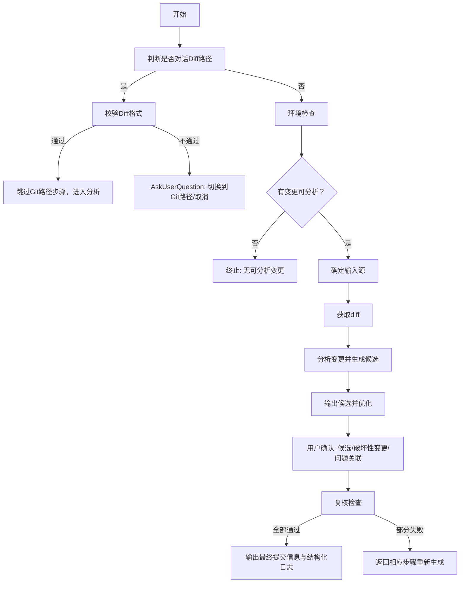
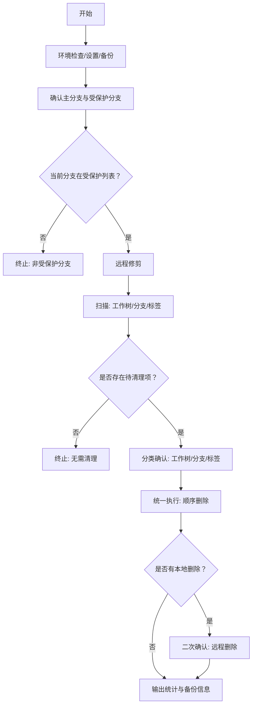
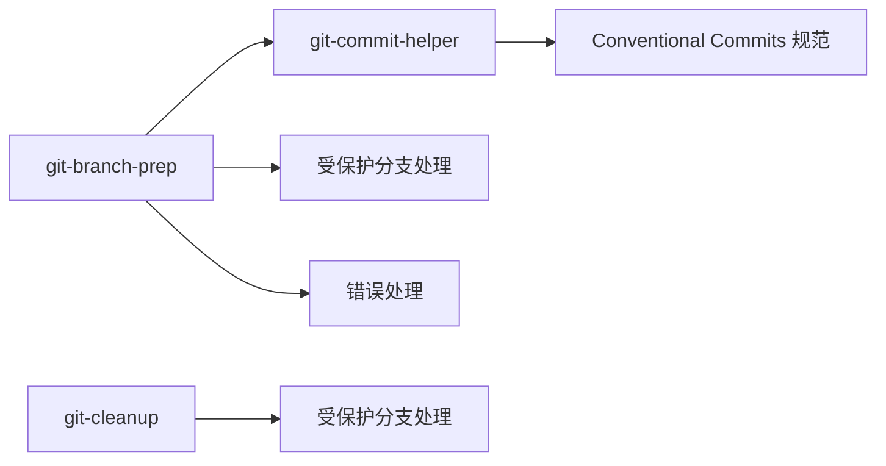

# Git 工作流技能

<cite>
**本文引用的文件**
- [git-branch-prep/SKILL.md](file://skills/skills/git-branch-prep/SKILL.md)
- [git-branch-prep/references/branch-name-rules.md](file://skills/skills/git-branch-prep/references/branch-name-rules.md)
- [git-branch-prep/references/protected-branch.md](file://skills/skills/git-branch-prep/references/protected-branch.md)
- [git-branch-prep/references/error-handling.md](file://skills/skills/git-branch-prep/references/error-handling.md)
- [git-commit-helper/SKILL.md](file://skills/skills/git-commit-helper/SKILL.md)
- [git-commit-helper/references/conventional-commits.md](file://skills/skills/git-commit-helper/references/conventional-commits.md)
- [git-cleanup/SKILL.md](file://skills/skills/git-cleanup/SKILL.md)
</cite>

## 目录
1. [简介](#简介)
2. [项目结构](#项目结构)
3. [核心组件](#核心组件)
4. [架构总览](#架构总览)
5. [详细组件分析](#详细组件分析)
6. [依赖关系分析](#依赖关系分析)
7. [性能与可靠性考量](#性能与可靠性考量)
8. [故障排查指南](#故障排查指南)
9. [结论](#结论)
10. [附录](#附录)

## 简介
本文件系统性梳理 Git 工作流中的三大核心技能：git-branch-prep（分支准备）、git-commit-helper（提交信息助手）与 git-cleanup（仓库清理）。重点覆盖以下方面：
- 分支准备流程：从“变更分析 → 提交信息生成 → 分支名推导 → 用户决策 → 提交/推送 → PR 链接生成”的完整闭环
- 提交信息生成规则：严格遵循 Conventional Commits 规范，支持多轮候选生成、破坏性变更标记与问题关联
- 分支清理策略：两阶段扫描与统一执行，自动跳过受保护分支与脏工作树，支持本地与远程同步清理
- 错误处理机制：针对冲突状态、分离头指针、重放冲突、远程分支存在性等场景的稳健处理
- 最佳实践：分支命名约定、PR 链接生成标准、提交规范与交互完整性要求

## 项目结构
围绕 Git 工作流的三个技能，采用“技能文档 + 参考规范 + 脚本工具”三层组织方式：
- 技能文档：SKILL.md 定义目标、前置条件、工作流、规则、示例与评审清单
- 参考规范：分支命名规则、受保护分支处理、错误处理、PR 链接标准等
- 脚本工具：环境检查、扫描、删除、远程删除、设置等辅助脚本（由各技能目录 scripts 子目录提供）

图表来源
- [git-branch-prep/SKILL.md:1-276](file://skills/skills/git-branch-prep/SKILL.md#L1-L276)
- [git-branch-prep/references/branch-name-rules.md:1-41](file://skills/skills/git-branch-prep/references/branch-name-rules.md#L1-L41)
- [git-branch-prep/references/protected-branch.md:1-26](file://skills/skills/git-branch-prep/references/protected-branch.md#L1-L26)
- [git-branch-prep/references/error-handling.md:1-28](file://skills/skills/git-branch-prep/references/error-handling.md#L1-L28)
- [git-commit-helper/SKILL.md:1-296](file://skills/skills/git-commit-helper/SKILL.md#L1-L296)
- [git-commit-helper/references/conventional-commits.md:1-177](file://skills/skills/git-commit-helper/references/conventional-commits.md#L1-L177)
- [git-cleanup/SKILL.md:1-453](file://skills/skills/git-cleanup/SKILL.md#L1-L453)

章节来源
- [git-branch-prep/SKILL.md:1-276](file://skills/skills/git-branch-prep/SKILL.md#L1-L276)
- [git-commit-helper/SKILL.md:1-296](file://skills/skills/git-commit-helper/SKILL.md#L1-L296)
- [git-cleanup/SKILL.md:1-453](file://skills/skills/git-cleanup/SKILL.md#L1-L453)

## 核心组件
- git-branch-prep：串联“提交信息助手”与“分支/推送/PR 链接生成”，完成从变更到 PR 的端到端自动化
- git-commit-helper：基于变更内容智能生成符合 Conventional Commits 的候选提交信息，支持破坏性变更与问题关联确认
- git-cleanup：两阶段扫描与统一删除，自动跳过受保护分支与脏工作树，支持本地与远程同步清理

章节来源
- [git-branch-prep/SKILL.md:1-276](file://skills/skills/git-branch-prep/SKILL.md#L1-L276)
- [git-commit-helper/SKILL.md:1-296](file://skills/skills/git-commit-helper/SKILL.md#L1-L296)
- [git-cleanup/SKILL.md:1-453](file://skills/skills/git-cleanup/SKILL.md#L1-L453)

## 架构总览
下图展示三技能之间的协作关系与数据流向：git-branch-prep 在“生成提交信息”阶段调用 git-commit-helper；在“分支与推送”阶段结合受保护分支与错误处理策略；在“PR 链接生成”阶段依据远程信息动态构建链接。

图表来源
- [git-branch-prep/SKILL.md:43-84](file://skills/skills/git-branch-prep/SKILL.md#L43-L84)
- [git-commit-helper/SKILL.md:9-21](file://skills/skills/git-commit-helper/SKILL.md#L9-L21)
- [git-commit-helper/references/conventional-commits.md:1-177](file://skills/skills/git-commit-helper/references/conventional-commits.md#L1-L177)
- [git-branch-prep/references/protected-branch.md:1-26](file://skills/skills/git-branch-prep/references/protected-branch.md#L1-L26)
- [git-branch-prep/references/error-handling.md:1-28](file://skills/skills/git-branch-prep/references/error-handling.md#L1-L28)

## 详细组件分析

### 组件一：git-branch-prep（分支准备）
职责与流程要点：
- 环境预检：执行环境检查脚本，校验 Git 版本、冲突状态、分离头指针与变更可用性；必要时推断来源分支并切换回受保护分支
- 生成提交信息：调用 git-commit-helper 完整流程，阻塞等待用户选择，确保交互完整性
- 推导分支名：按规则从最终提交信息提取类型与主题，转换为 kebab-case 并限制长度
- 用户决策：根据当前分支是否受保护，提供“在当前分支提交/新建分支”选项；再决定“本地提交/推送”
- 执行与验证：提交使用 NO_VERIFY 跳过钩子；推送前检测远程分支存在性并处理落后于远程的情况；成功后优先从输出正则提取 PR 链接，否则基于远程 URL 动态构建
- 复核与输出：对照评审清单逐项检查，输出结构化结果（分支名、提交信息、推送状态、PR 链接、可执行命令）

图表来源
- [git-branch-prep/SKILL.md:24-101](file://skills/skills/git-branch-prep/SKILL.md#L24-L101)
- [git-branch-prep/references/branch-name-rules.md:1-41](file://skills/skills/git-branch-prep/references/branch-name-rules.md#L1-L41)
- [git-branch-prep/references/protected-branch.md:1-26](file://skills/skills/git-branch-prep/references/protected-branch.md#L1-L26)
- [git-branch-prep/references/error-handling.md:1-28](file://skills/skills/git-branch-prep/references/error-handling.md#L1-L28)

章节来源
- [git-branch-prep/SKILL.md:24-101](file://skills/skills/git-branch-prep/SKILL.md#L24-L101)
- [git-branch-prep/references/branch-name-rules.md:1-41](file://skills/skills/git-branch-prep/references/branch-name-rules.md#L1-L41)
- [git-branch-prep/references/protected-branch.md:1-26](file://skills/skills/git-branch-prep/references/protected-branch.md#L1-L26)
- [git-branch-prep/references/error-handling.md:1-28](file://skills/skills/git-branch-prep/references/error-handling.md#L1-L28)

### 组件二：git-commit-helper（提交信息助手）
职责与流程要点：
- 输入源确定：支持“暂存区变更”“单次提交”“分支范围”三种输入，并在无输入时引导用户选择
- 变更分析：区分二进制与非二进制文件，统计变更分布，生成 1–3 个合理候选
- 候选优化：强制主题长度≤50字符、格式正确、内容简洁、不含 CI 跳过标记、破坏性变更标记一致性
- 用户确认：通过一次性交互完成候选选择、破坏性变更确认与问题关联，最终输出结构化日志
- 复核与输出：逐项对照评审清单，失败时返回对应步骤重新生成

图表来源
- [git-commit-helper/SKILL.md:43-139](file://skills/skills/git-commit-helper/SKILL.md#L43-L139)
- [git-commit-helper/references/conventional-commits.md:1-177](file://skills/skills/git-commit-helper/references/conventional-commits.md#L1-L177)

章节来源
- [git-commit-helper/SKILL.md:43-139](file://skills/skills/git-commit-helper/SKILL.md#L43-L139)
- [git-commit-helper/references/conventional-commits.md:1-177](file://skills/skills/git-commit-helper/references/conventional-commits.md#L1-L177)

### 组件三：git-cleanup（仓库清理）
职责与流程要点：
- 预检与备份：执行环境检查与设置，自动创建备份；确认主分支与受保护分支列表；仅允许在受保护分支上运行
- 全面扫描：先远程修剪，再扫描工作树、分支与标签，输出三类 JSON 结果
- 分类确认：分别对工作树、分支、标签进行一次性确认，支持全删、部分删除或跳过
- 统一执行：按 Worktree → Branch → Tag 顺序统一删除，失败项记录原因并继续；脏工作树自动跳过
- 远程同步：二次确认后统一推送远程删除；异常退出时输出恢复指引

图表来源
- [git-cleanup/SKILL.md:36-172](file://skills/skills/git-cleanup/SKILL.md#L36-L172)

章节来源
- [git-cleanup/SKILL.md:36-172](file://skills/skills/git-cleanup/SKILL.md#L36-L172)

## 依赖关系分析
- git-branch-prep 依赖 git-commit-helper 的提交信息生成能力，并依赖受保护分支与错误处理参考以保障安全与健壮性
- git-commit-helper 依赖 Conventional Commits 规范作为生成与校验的权威依据
- git-cleanup 依赖受保护分支参考以避免误删关键分支

图表来源
- [git-branch-prep/SKILL.md:43-84](file://skills/skills/git-branch-prep/SKILL.md#L43-L84)
- [git-commit-helper/SKILL.md:9-21](file://skills/skills/git-commit-helper/SKILL.md#L9-L21)
- [git-commit-helper/references/conventional-commits.md:1-177](file://skills/skills/git-commit-helper/references/conventional-commits.md#L1-L177)
- [git-cleanup/SKILL.md:24-26](file://skills/skills/git-cleanup/SKILL.md#L24-L26)

章节来源
- [git-branch-prep/SKILL.md:43-84](file://skills/skills/git-branch-prep/SKILL.md#L43-L84)
- [git-commit-helper/SKILL.md:9-21](file://skills/skills/git-commit-helper/SKILL.md#L9-L21)
- [git-commit-helper/references/conventional-commits.md:1-177](file://skills/skills/git-commit-helper/references/conventional-commits.md#L1-L177)
- [git-cleanup/SKILL.md:24-26](file://skills/skills/git-cleanup/SKILL.md#L24-L26)

## 性能与可靠性考量
- 提交阶段使用 NO_VERIFY 跳过钩子，避免因 pre-commit/prepare-commit-msg 导致阻塞，提升自动化效率
- 推送前检测远程分支存在性与落后情况，若落后则先拉取并重放，减少冲突概率
- 清理阶段采用“全面扫描 → 一次性确认 → 统一执行”的两阶段设计，降低误操作风险并提高吞吐
- 对脏工作树与受保护分支自动跳过，避免破坏性影响
- 异常退出时提供备份路径与恢复命令，确保可回滚

章节来源
- [git-branch-prep/SKILL.md:67-84](file://skills/skills/git-branch-prep/SKILL.md#L67-L84)
- [git-cleanup/SKILL.md:113-154](file://skills/skills/git-cleanup/SKILL.md#L113-L154)

## 故障排查指南
常见问题与处理建议：
- 分支已存在
  - 现象：新建分支失败或被切换到已有分支
  - 处理：系统会尝试创建或切换到同名分支；如需不同分支，请修改分支名
- 无可分析变更
  - 现象：无暂存区或工作区变更
  - 处理：请先添加变更或指定有效提交/分支范围
- 推送前重放冲突
  - 现象：本地落后于远程，重放失败
  - 处理：根据提示手动解决冲突后继续重放，再执行推送
- 分离头指针
  - 现象：当前处于分离头指针状态
  - 处理：系统尝试推断来源分支并切换回受保护分支；若无法推断，需用户手动选择分支

章节来源
- [git-branch-prep/references/error-handling.md:1-28](file://skills/skills/git-branch-prep/references/error-handling.md#L1-L28)
- [git-branch-prep/references/protected-branch.md:1-26](file://skills/skills/git-branch-prep/references/protected-branch.md#L1-L26)

## 结论
git-branch-prep、git-commit-helper 与 git-cleanup 三技能协同，形成从“变更分析 → 提交信息生成 → 分支与推送 → PR 链接生成 → 仓库清理”的完整 Git 工作流闭环。通过严格的规范约束（Conventional Commits、分支命名、PR 链接标准）、稳健的错误处理与两阶段防御设计，显著提升了团队协作效率与仓库健康度。

## 附录

### 提交信息生成与分支命名规范速览
- 提交信息必须遵循 Conventional Commits：类型、作用域、描述、正文、脚注等结构清晰
- 描述以简单现在时动词开头，不超过 50 字，不以句号结尾
- 破坏性变更使用 “!” 或脚注 “BREAKING CHANGE:”
- 分支名采用 <type>/<kebab-description> 形式，长度不超过 50 字，去除无意义冠词

章节来源
- [git-commit-helper/SKILL.md:141-162](file://skills/skills/git-commit-helper/SKILL.md#L141-L162)
- [git-commit-helper/references/conventional-commits.md:45-58](file://skills/skills/git-commit-helper/references/conventional-commits.md#L45-L58)
- [git-branch-prep/references/branch-name-rules.md:13-18](file://skills/skills/git-branch-prep/references/branch-name-rules.md#L13-L18)

### PR 链接生成标准
- 优先从推送输出中正则匹配 PR 链接
- 若不可用，则解析远程 URL 并基于远程实际存在的合并目标分支动态构建
- 输出表格列出实际存在的合并目标分支及其链接格式

章节来源
- [git-branch-prep/SKILL.md:82-84](file://skills/skills/git-branch-prep/SKILL.md#L82-L84)

### 交互完整性与评审清单
- 所有涉及用户决策的步骤均通过 AskUserQuestion 工具进行结构化交互
- 评审清单覆盖提交信息格式、分支命名、安全性、PR 链接、交互完整性与提交规范等方面

章节来源
- [git-commit-helper/SKILL.md:163-165](file://skills/skills/git-commit-helper/SKILL.md#L163-L165)
- [git-branch-prep/SKILL.md:262-267](file://skills/skills/git-branch-prep/SKILL.md#L262-L267)
- [git-cleanup/SKILL.md:189-193](file://skills/skills/git-cleanup/SKILL.md#L189-L193)