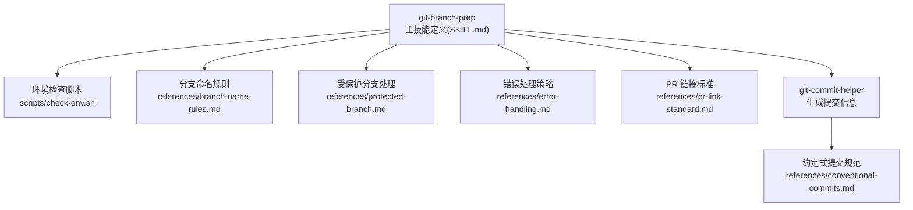
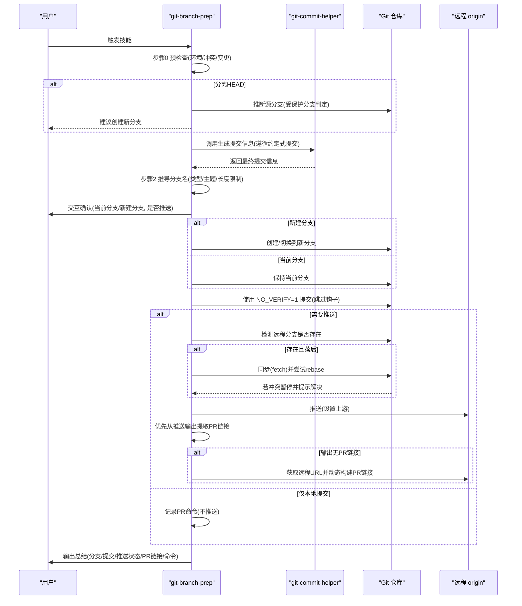
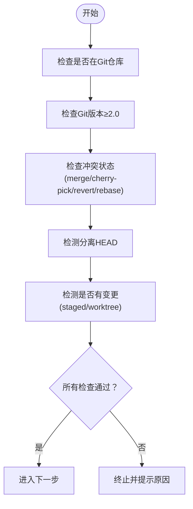
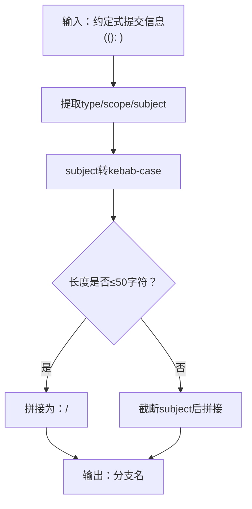
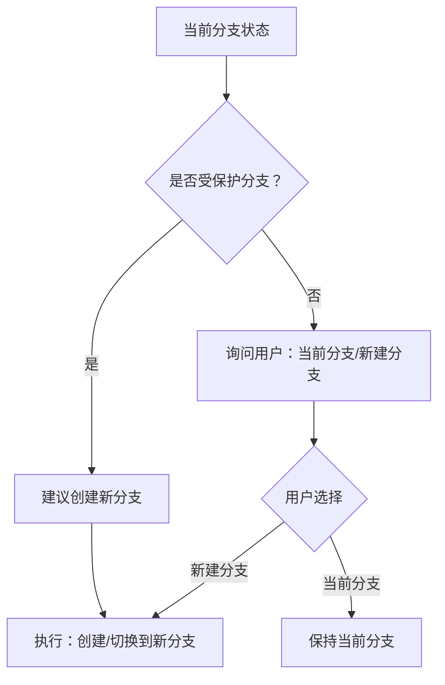
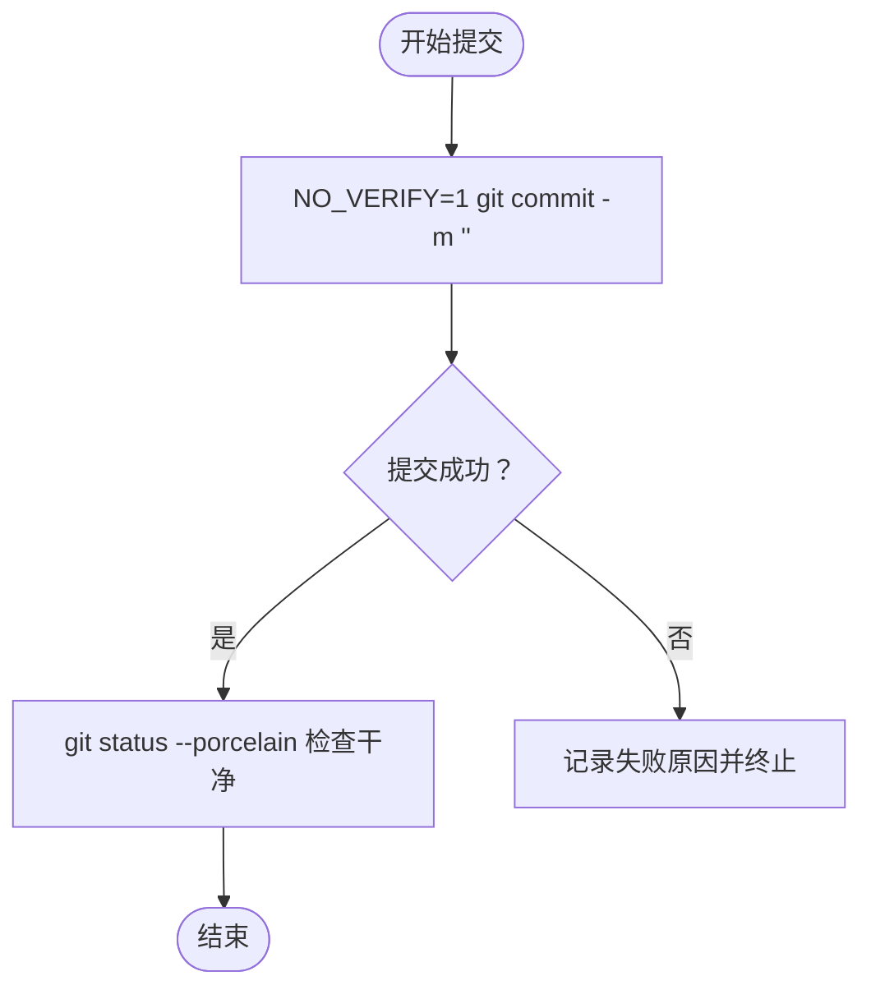
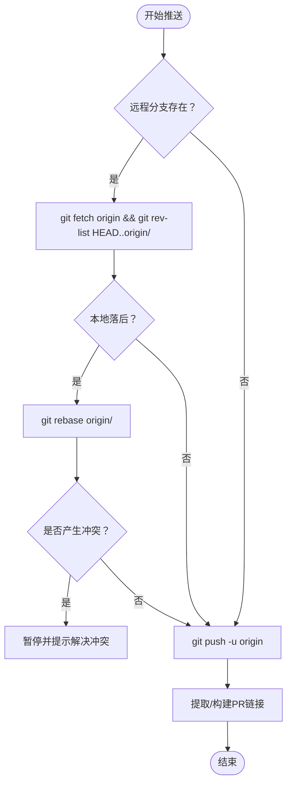
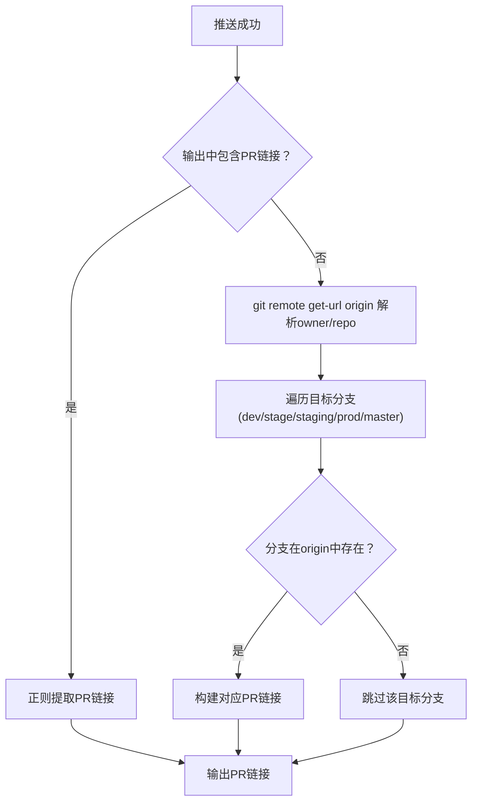
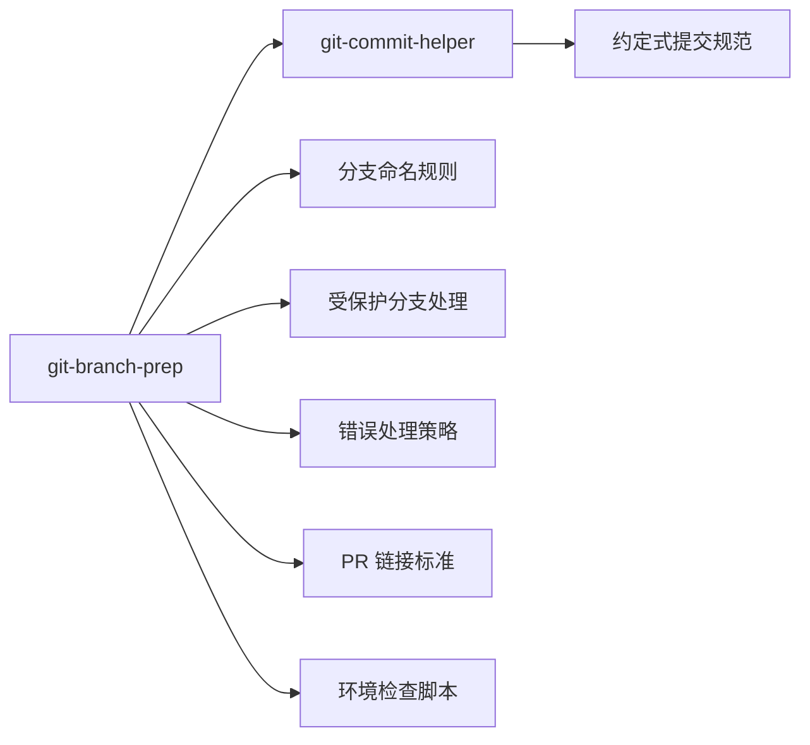

# git-branch-prep（分支准备）

<cite>
**本文引用的文件**
- [SKILL.md](file://skills/git-branch-prep/SKILL.md)
- [check-env.sh](file://skills/git-branch-prep/scripts/check-env.sh)
- [branch-name-rules.md](file://skills/git-branch-prep/references/branch-name-rules.md)
- [error-handling.md](file://skills/git-branch-prep/references/error-handling.md)
- [pr-link-standard.md](file://skills/git-branch-prep/references/pr-link-standard.md)
- [protected-branch.md](file://skills/git-branch-prep/references/protected-branch.md)
- [git-commit-helper/SKILL.md](file://skills/git-commit-helper/SKILL.md)
- [conventional-commits.md](file://skills/git-commit-helper/references/conventional-commits.md)
</cite>

## 目录
1. [简介](#简介)
2. [项目结构](#项目结构)
3. [核心组件](#核心组件)
4. [架构总览](#架构总览)
5. [详细组件分析](#详细组件分析)
6. [依赖关系分析](#依赖关系分析)
7. [性能考量](#性能考量)
8. [故障排查指南](#故障排查指南)
9. [结论](#结论)
10. [附录](#附录)

## 简介
git-branch-prep 是一个自动化 Git 工作流技能，旨在帮助用户从零开始完成“分析变更 → 生成提交信息 → 推导分支名 → 用户确认 → 提交/推送 → 生成 PR 链接”的完整流程。它通过调用 git-commit-helper 生成符合约定式提交规范的提交信息，再基于该信息推导出标准化的分支名；随后通过交互式确认决定是在当前分支提交还是新建分支，并可选择本地提交或直接推送；最后根据推送输出或远程实际存在的分支动态生成 PR 链接，确保整个过程安全、可审计且可追溯。

本技能强调以下关键点：
- 必须使用 NO_VERIFY=1 跳过 Git 钩子，避免 pre-commit/prepare-commit-msg 等钩子阻塞自动化提交
- 受保护分支处理：当处于受保护分支或由受保护分支分离的 HEAD 时，强制创建新功能分支
- 分支选择逻辑：根据当前分支状态与用户决策，决定提交到当前分支或新建分支
- 远程分支同步与冲突处理：在推送前检测远程是否存在同名分支，若存在则尝试同步并处理 rebase 冲突
- PR 链接生成：优先从推送输出中提取，否则基于远程 URL 动态构建

## 项目结构
git-branch-prep 技能的核心由三部分组成：
- 主技能定义：描述整体工作流、规则、示例与审查清单
- 环境检查脚本：统一校验 Git 版本、仓库状态、冲突状态、变更存在性等
- 参考文档：分支命名规则、受保护分支处理、错误处理策略、PR 链接标准

图表来源
- [SKILL.md:1-276](file://skills/git-branch-prep/SKILL.md#L1-L276)
- [check-env.sh:1-105](file://skills/git-branch-prep/scripts/check-env.sh#L1-L105)
- [branch-name-rules.md:1-41](file://skills/git-branch-prep/references/branch-name-rules.md#L1-L41)
- [protected-branch.md:1-26](file://skills/git-branch-prep/references/protected-branch.md#L1-L26)
- [error-handling.md:1-28](file://skills/git-branch-prep/references/error-handling.md#L1-L28)
- [pr-link-standard.md:1-39](file://skills/git-branch-prep/references/pr-link-standard.md#L1-L39)
- [git-commit-helper/SKILL.md:1-296](file://skills/git-commit-helper/SKILL.md#L1-L296)
- [conventional-commits.md:1-177](file://skills/git-commit-helper/references/conventional-commits.md#L1-L177)

章节来源
- [SKILL.md:1-276](file://skills/git-branch-prep/SKILL.md#L1-L276)

## 核心组件
- 主流程编排：负责按步骤执行环境检查、调用 git-commit-helper、推导分支名、交互确认、执行提交/推送、生成 PR 链接与最终输出
- 环境检查：统一校验 Git 仓库状态、版本、冲突、变更存在性，支持在分离 HEAD 情况下进行源分支推断
- 分支命名规则：从约定式提交信息中提取类型、作用域与主题，转换为 kebab-case 的分支名
- 受保护分支处理：识别受保护分支列表，对分离 HEAD 场景进行源分支推断，必要时强制创建新分支
- 错误处理：覆盖分支已存在、无效变更、rebase 冲突等常见问题
- PR 链接标准：优先从推送输出提取链接，否则基于远程 URL 和实际存在的目标分支动态构建

章节来源
- [SKILL.md:1-276](file://skills/git-branch-prep/SKILL.md#L1-L276)
- [check-env.sh:1-105](file://skills/git-branch-prep/scripts/check-env.sh#L1-L105)
- [branch-name-rules.md:1-41](file://skills/git-branch-prep/references/branch-name-rules.md#L1-L41)
- [protected-branch.md:1-26](file://skills/git-branch-prep/references/protected-branch.md#L1-L26)
- [error-handling.md:1-28](file://skills/git-branch-prep/references/error-handling.md#L1-L28)
- [pr-link-standard.md:1-39](file://skills/git-branch-prep/references/pr-link-standard.md#L1-L39)

## 架构总览
git-branch-prep 的执行架构遵循“预检查 → 生成提交 → 推导分支 → 用户确认 → 执行决策 → 审查输出”的线性流程，同时在关键节点引入条件判断与错误处理。

图表来源
- [SKILL.md:24-101](file://skills/git-branch-prep/SKILL.md#L24-L101)
- [check-env.sh:1-105](file://skills/git-branch-prep/scripts/check-env.sh#L1-L105)
- [protected-branch.md:1-26](file://skills/git-branch-prep/references/protected-branch.md#L1-L26)
- [pr-link-standard.md:1-39](file://skills/git-branch-prep/references/pr-link-standard.md#L1-L39)
- [git-commit-helper/SKILL.md:43-139](file://skills/git-commit-helper/SKILL.md#L43-L139)

## 详细组件分析

### 环境检查与预处理
- 统一检查项包括：是否在 Git 仓库、Git 版本 ≥ 2.0、是否存在冲突状态、是否处于分离 HEAD、是否有可分析的变更
- 对于分离 HEAD，会尝试推断源分支并结合受保护分支列表进行二次判定
- 若无变更或存在冲突，流程终止并给出明确提示

图表来源
- [check-env.sh:17-104](file://skills/git-branch-prep/scripts/check-env.sh#L17-L104)
- [SKILL.md:26-42](file://skills/git-branch-prep/SKILL.md#L26-L42)

章节来源
- [check-env.sh:1-105](file://skills/git-branch-prep/scripts/check-env.sh#L1-L105)
- [SKILL.md:26-42](file://skills/git-branch-prep/SKILL.md#L26-L42)

### 提交信息生成与分支命名
- 提交信息生成完全遵循 git-commit-helper 的约定式提交规范，包括类型、作用域、主题、正文与脚注
- 分支名推导规则：
  - 类型作为前缀
  - 主题转为 kebab-case（小写+短横线），移除无意义冠词
  - 总长度限制为 50 字符，必要时截断主题
  - 作用域可选，但若存在需保留

图表来源
- [branch-name-rules.md:3-18](file://skills/git-branch-prep/references/branch-name-rules.md#L3-L18)
- [conventional-commits.md:124-177](file://skills/git-commit-helper/references/conventional-commits.md#L124-L177)

章节来源
- [branch-name-rules.md:1-41](file://skills/git-branch-prep/references/branch-name-rules.md#L1-L41)
- [conventional-commits.md:1-177](file://skills/git-commit-helper/references/conventional-commits.md#L1-L177)

### 分支选择与受保护分支处理
- 当前分支为受保护分支（dev/stage/staging/prod/master/main）或由受保护分支分离时，强制创建新分支
- 非受保护分支时，允许用户选择“在当前分支提交”或“创建新分支”
- 分支已存在时采用“先尝试创建，失败则切换到现有分支”的回退策略

图表来源
- [protected-branch.md:3-26](file://skills/git-branch-prep/references/protected-branch.md#L3-L26)
- [SKILL.md:52-65](file://skills/git-branch-prep/SKILL.md#L52-L65)

章节来源
- [protected-branch.md:1-26](file://skills/git-branch-prep/references/protected-branch.md#L1-L26)
- [SKILL.md:52-65](file://skills/git-branch-prep/SKILL.md#L52-L65)

### 提交执行规范与钩子跳过
- 必须使用 NO_VERIFY=1 环境变量执行提交，确保跳过 pre-commit/prepare-commit-msg 等钩子
- 提交成功后通过工作区状态检查确认无未提交变更
- 任何提交失败均记录失败原因并终止流程

图表来源
- [SKILL.md:66-71](file://skills/git-branch-prep/SKILL.md#L66-L71)

章节来源
- [SKILL.md:66-71](file://skills/git-branch-prep/SKILL.md#L66-L71)

### 远程分支同步与冲突处理
- 若远程存在同名分支，先 fetch 同步，再比较本地与远程差异
- 若本地落后，执行 rebase；若出现冲突，暂停并提示用户手动解决后再继续
- 推送成功后优先从输出提取 PR 链接，否则基于远程 URL 动态构建

图表来源
- [SKILL.md:72-84](file://skills/git-branch-prep/SKILL.md#L72-L84)
- [error-handling.md:15-28](file://skills/git-branch-prep/references/error-handling.md#L15-L28)
- [pr-link-standard.md:3-39](file://skills/git-branch-prep/references/pr-link-standard.md#L3-L39)

章节来源
- [SKILL.md:72-84](file://skills/git-branch-prep/SKILL.md#L72-L84)
- [error-handling.md:1-28](file://skills/git-branch-prep/references/error-handling.md#L1-L28)
- [pr-link-standard.md:1-39](file://skills/git-branch-prep/references/pr-link-standard.md#L1-L39)

### PR 链接生成标准
- 优先从推送输出中正则匹配 PR 链接
- 若无法提取，则解析远程 URL，动态构建针对 dev/stage/staging/prod/master 的 PR 链接
- 仅展示在 origin 中实际存在的目标分支对应的行

图表来源
- [pr-link-standard.md:3-39](file://skills/git-branch-prep/references/pr-link-standard.md#L3-L39)

章节来源
- [pr-link-standard.md:1-39](file://skills/git-branch-prep/references/pr-link-standard.md#L1-L39)

### 交互对话示例与最佳实践
- 示例涵盖：创建新分支、在当前分支提交、仅本地提交、推送并生成 PR 链接等典型场景
- 最佳实践：
  - 在受保护分支或分离 HEAD 时，优先创建新分支
  - 提交必须使用 NO_VERIFY=1，避免钩子阻塞
  - 推送前确保本地与远程同步，及时处理 rebase 冲突
  - PR 链接优先取自推送输出，否则基于远程 URL 动态构建
  - 审查清单逐项核对，保证提交信息、分支命名、安全规范与交互完整性

章节来源
- [SKILL.md:109-247](file://skills/git-branch-prep/SKILL.md#L109-L247)

## 依赖关系分析
- git-branch-prep 依赖 git-commit-helper 生成符合约定式提交规范的提交信息
- 分支命名规则与约定式提交规范紧密耦合
- 受保护分支处理依赖受保护分支列表与分离 HEAD 推断逻辑
- PR 链接生成依赖远程 URL 解析与目标分支存在性检测
- 环境检查脚本提供统一的前置校验能力，减少后续步骤失败概率

图表来源
- [SKILL.md:1-276](file://skills/git-branch-prep/SKILL.md#L1-L276)
- [git-commit-helper/SKILL.md:1-296](file://skills/git-commit-helper/SKILL.md#L1-L296)
- [conventional-commits.md:1-177](file://skills/git-commit-helper/references/conventional-commits.md#L1-L177)

章节来源
- [SKILL.md:1-276](file://skills/git-branch-prep/SKILL.md#L1-L276)
- [git-commit-helper/SKILL.md:1-296](file://skills/git-commit-helper/SKILL.md#L1-L296)

## 性能考量
- 环境检查与变更检测在本地快速完成，对整体性能影响较小
- 推送前的 fetch/rebase 操作可能因远程分支体量较大而耗时，建议在稳定网络环境下执行
- PR 链接构建仅涉及远程 URL 解析与少量分支存在性查询，开销极低
- 建议在自动化流水线中启用 NO_VERIFY=1，避免钩子带来的额外等待时间

## 故障排查指南
- 环境检查失败
  - 未安装 jq：安装 jq 并重试
  - 不在 Git 仓库：进入有效仓库目录
  - Git 版本过低：升级 Git 至 2.0+
  - 存在冲突：解决冲突后再运行
  - 无变更：添加或暂存变更后重试
- 分支已存在
  - 自动回退到现有分支；如需新建，请先删除同名分支或改用其他分支名
- 无效变更
  - 确认暂存区有变更，或指定有效的提交/分支范围
- Rebase 冲突
  - 按提示解决冲突文件，执行 rebase --continue 后再次推送
- PR 链接缺失
  - 若未推送或推送失败，使用远程 URL 动态构建 PR 链接

章节来源
- [check-env.sh:7-104](file://skills/git-branch-prep/scripts/check-env.sh#L7-L104)
- [error-handling.md:1-28](file://skills/git-branch-prep/references/error-handling.md#L1-L28)
- [pr-link-standard.md:1-39](file://skills/git-branch-prep/references/pr-link-standard.md#L1-L39)

## 结论
git-branch-prep 将 Git 提交与分支管理的关键环节自动化，结合约定式提交、受保护分支处理与 PR 链接生成，形成一套安全、高效且可审计的工作流。通过严格的环境检查、交互式确认与完善的错误处理，它能够显著降低人工操作风险，提升团队协作效率。建议在日常开发中配合 CI/CD 流水线使用，确保提交质量与分支治理的一致性。

## 附录
- 使用场景
  - 新功能开发：自动生成提交信息与分支名，一键创建并推送
  - 修复缺陷：在当前分支快速提交，或新建修复分支
  - 文档更新：遵循约定式提交规范，保持历史清晰
- 最佳实践
  - 在受保护分支或分离 HEAD 时，优先创建新分支
  - 提交必须使用 NO_VERIFY=1，避免钩子阻塞
  - 推送前先 fetch 同步，及时处理 rebase 冲突
  - PR 链接优先取自推送输出，否则基于远程 URL 动态构建
  - 严格对照审查清单，确保提交信息、分支命名与安全规范符合要求