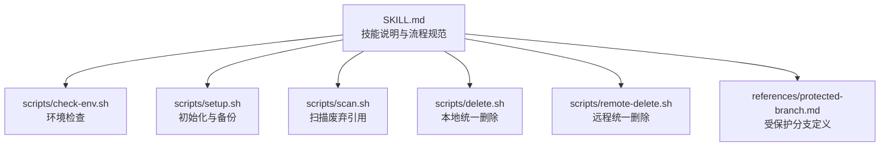
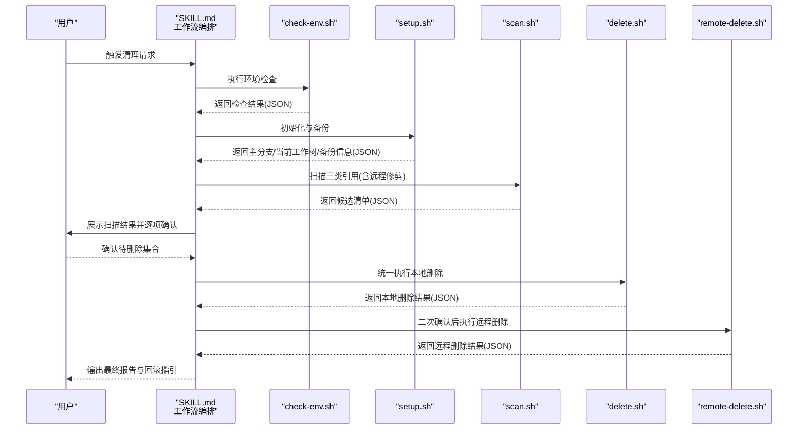
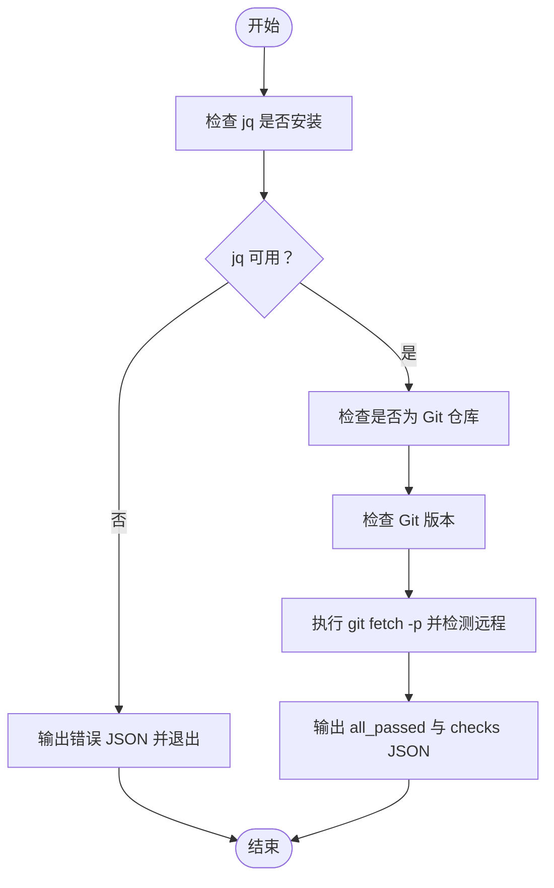
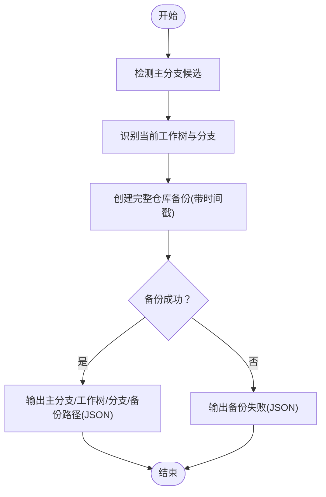
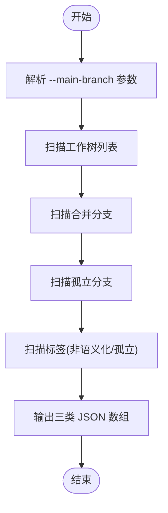
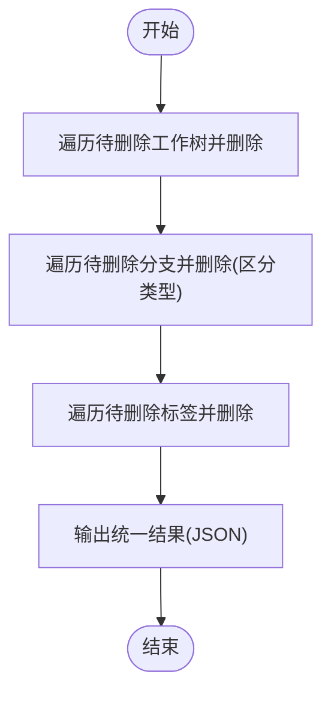
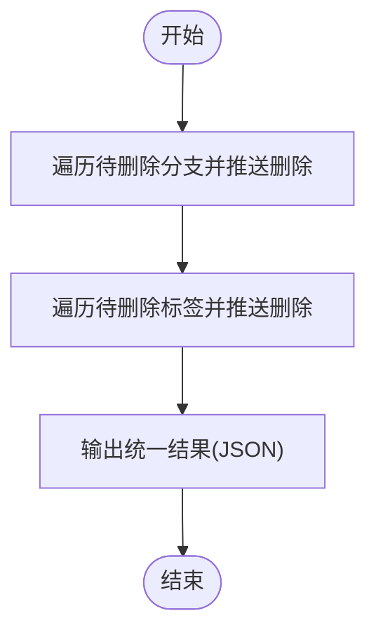
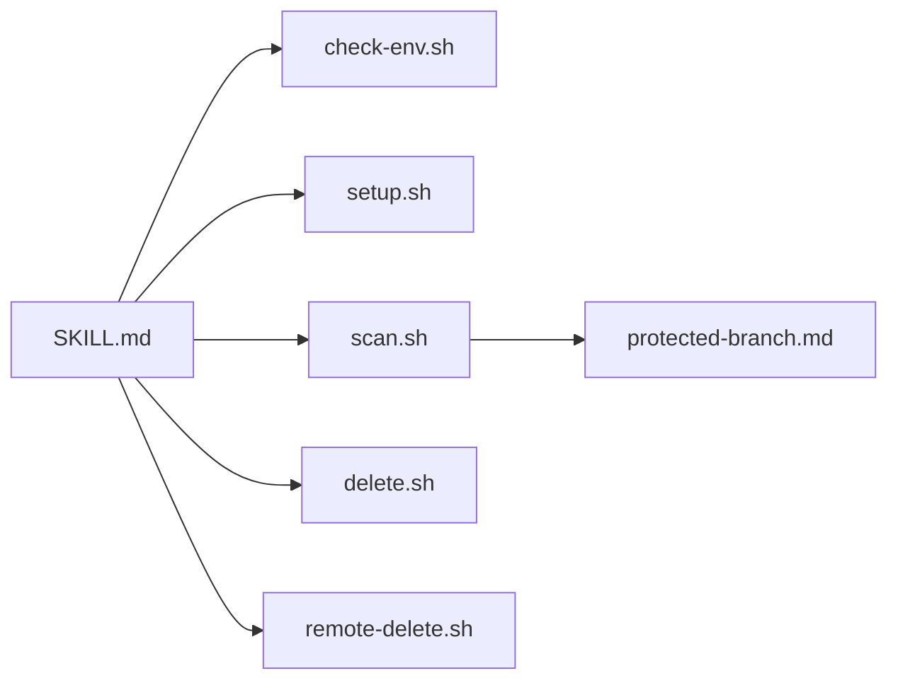

# git-cleanup（清理工具）

<cite>
**本文引用的文件**
- [SKILL.md](file://skills/git-cleanup/SKILL.md)
- [check-env.sh](file://skills/git-cleanup/scripts/check-env.sh)
- [setup.sh](file://skills/git-cleanup/scripts/setup.sh)
- [scan.sh](file://skills/git-cleanup/scripts/scan.sh)
- [delete.sh](file://skills/git-cleanup/scripts/delete.sh)
- [remote-delete.sh](file://skills/git-cleanup/scripts/remote-delete.sh)
- [protected-branch.md](file://skills/git-cleanup/references/protected-branch.md)
</cite>

## 目录
1. [简介](#简介)
2. [项目结构](#项目结构)
3. [核心组件](#核心组件)
4. [架构总览](#架构总览)
5. [详细组件分析](#详细组件分析)
6. [依赖关系分析](#依赖关系分析)
7. [性能与可靠性考量](#性能与可靠性考量)
8. [故障排查指南](#故障排查指南)
9. [结论](#结论)
10. [附录](#附录)

## 简介
git-cleanup 是一个系统化清理 Git 工作树、分支与标签的自动化技能。其核心目标是通过“全面扫描 -> 一次性确认 -> 统一删除”的工作流，安全地识别并清理废弃的 Git 引用（包括合并分支、孤立分支、非语义化版本标签、孤立标签以及干净状态的工作树）。在执行前进行环境检查与自动备份，在删除后支持二次确认的远程同步，并提供详尽的日志与回滚指引，确保误删风险可控。

## 项目结构
git-cleanup 技能由一个技能说明文档与一组 Bash 脚本组成，采用“按功能分层”的组织方式：
- 技能说明：定义术语、前置条件、工作流、规则与示例
- 脚本目录：check-env.sh（环境检查）、setup.sh（初始化与备份）、scan.sh（扫描）、delete.sh（本地统一删除）、remote-delete.sh（远程统一删除）
- 参考文件：protected-branch.md（受保护分支列表与分离头检测）

图表来源
- [SKILL.md](file://skills/git-cleanup/SKILL.md)
- [check-env.sh](file://skills/git-cleanup/scripts/check-env.sh)
- [setup.sh](file://skills/git-cleanup/scripts/setup.sh)
- [scan.sh](file://skills/git-cleanup/scripts/scan.sh)
- [delete.sh](file://skills/git-cleanup/scripts/delete.sh)
- [remote-delete.sh](file://skills/git-cleanup/scripts/remote-delete.sh)
- [protected-branch.md](file://skills/git-cleanup/references/protected-branch.md)

章节来源
- [SKILL.md](file://skills/git-cleanup/SKILL.md)

## 核心组件
- 环境检查脚本（check-env.sh）：校验 jq 依赖、Git 版本、是否处于 Git 仓库、执行一次远程修剪并检测是否存在远程；输出标准化 JSON，供上层流程解析。
- 初始化脚本（setup.sh）：检测主分支候选、识别当前工作树与当前分支、创建完整仓库备份；输出包含备份路径等关键信息的 JSON。
- 扫描脚本（scan.sh）：一次性扫描工作树、分支与标签，过滤受保护分支、当前分支、工作树绑定分支等；输出三类 JSON 数组（工作树、分支、标签），每项包含名称、类型与原因。
- 本地删除脚本（delete.sh）：接收三类待删除 JSON，按顺序依次执行工作树、分支、标签删除；对失败项记录失败原因并继续后续删除。
- 远程删除脚本（remote-delete.sh）：接收待删除分支与标签 JSON，仅针对 origin 远程执行批量推送删除；输出统一结果数组。
- 受保护分支参考（protected-branch.md）：定义受保护分支列表与分离头检测逻辑，用于扫描与删除阶段的过滤与判定。

章节来源
- [check-env.sh](file://skills/git-cleanup/scripts/check-env.sh)
- [setup.sh](file://skills/git-cleanup/scripts/setup.sh)
- [scan.sh](file://skills/git-cleanup/scripts/scan.sh)
- [delete.sh](file://skills/git-cleanup/scripts/delete.sh)
- [remote-delete.sh](file://skills/git-cleanup/scripts/remote-delete.sh)
- [protected-branch.md](file://skills/git-cleanup/references/protected-branch.md)

## 架构总览
整体架构遵循“两阶段删除”与“一次性确认”的设计原则：
- 预检查阶段：环境检查与初始化备份，确保具备执行条件且有可回滚的备份。
- 全面扫描阶段：先执行远程修剪，再一次性扫描三类引用，生成候选清单。
- 一次性确认阶段：分别对工作树、分支、标签进行用户确认，形成统一的待删除集合。
- 统一执行阶段：先本地删除，再二次确认后执行远程删除。
- 异常处理与回滚：任何一步异常均跳转至异常处理，输出恢复指引与已完成的操作汇总。

图表来源
- [SKILL.md](file://skills/git-cleanup/SKILL.md)
- [check-env.sh](file://skills/git-cleanup/scripts/check-env.sh)
- [setup.sh](file://skills/git-cleanup/scripts/setup.sh)
- [scan.sh](file://skills/git-cleanup/scripts/scan.sh)
- [delete.sh](file://skills/git-cleanup/scripts/delete.sh)
- [remote-delete.sh](file://skills/git-cleanup/scripts/remote-delete.sh)

## 详细组件分析

### 环境检查组件（check-env.sh）
职责与流程
- 依赖校验：确保 jq 可用，否则直接返回错误 JSON 并退出。
- Git 仓库校验：通过 Git 命令判断当前目录是否为仓库根。
- Git 版本校验：提取版本号并判断是否满足最低版本要求。
- 远程修剪与检测：执行一次远程修剪，同时检测是否存在远程；若网络不可达，记录失败但不中断后续流程。
- 结果输出：以 JSON 形式返回 all_passed 与 checks 列表，便于上层解析。

图表来源
- [check-env.sh](file://skills/git-cleanup/scripts/check-env.sh)

章节来源
- [check-env.sh](file://skills/git-cleanup/scripts/check-env.sh)

### 初始化与备份组件（setup.sh）
职责与流程
- 主分支候选检测：优先匹配 main/master/prod 等常见主分支。
- 当前工作树与分支识别：读取当前工作树路径与当前分支名。
- 备份创建：使用递归复制创建完整备份，命名包含时间戳；成功则记录备份路径，失败则标记备份失败。
- 结果输出：以 JSON 形式返回主分支候选、当前工作树、当前分支、备份状态与路径。

图表来源
- [setup.sh](file://skills/git-cleanup/scripts/setup.sh)

章节来源
- [setup.sh](file://skills/git-cleanup/scripts/setup.sh)

### 扫描组件（scan.sh）
职责与流程
- 参数解析：要求传入主分支参数，否则报错。
- 工作树扫描：解析工作树列表，记录路径、关联分支与是否为当前工作树。
- 分支扫描：
  - 合并分支：基于主分支的合并历史筛选，排除受保护分支、当前分支、工作树绑定分支。
  - 孤立分支：通过远程跟踪状态判断“gone”，同样排除上述分支。
- 标签扫描：
  - 非语义化标签：不符合语义化版本模式的标签。
  - 孤立标签：未被任何分支包含的标签。
- 结果输出：以 JSON 形式返回三类数组，每项包含名称、类型与原因。

图表来源
- [scan.sh](file://skills/git-cleanup/scripts/scan.sh)

章节来源
- [scan.sh](file://skills/git-cleanup/scripts/scan.sh)

### 本地统一删除组件（delete.sh）
职责与流程
- 参数解析：接收三类待删除 JSON（工作树、分支、标签）。
- 删除顺序：严格按工作树 -> 分支 -> 标签顺序执行。
- 删除策略：
  - 工作树：调用工作树移除命令；失败时记录失败原因并继续。
  - 分支：根据类型选择强制或普通删除；失败时记录失败原因并继续。
  - 标签：调用标签删除命令；失败时记录失败原因并继续。
- 结果输出：统一输出删除结果数组，包含类型、名称与状态。

图表来源
- [delete.sh](file://skills/git-cleanup/scripts/delete.sh)

章节来源
- [delete.sh](file://skills/git-cleanup/scripts/delete.sh)

### 远程统一删除组件（remote-delete.sh）
职责与流程
- 参数解析：接收待删除分支与标签 JSON。
- 删除策略：
  - 分支：向 origin 推送删除分支引用。
  - 标签：向 origin 推送删除标签引用（refs/tags/ 前缀）。
- 结果输出：统一输出远程删除结果数组，包含类型、名称与状态。

图表来源
- [remote-delete.sh](file://skills/git-cleanup/scripts/remote-delete.sh)

章节来源
- [remote-delete.sh](file://skills/git-cleanup/scripts/remote-delete.sh)

### 受保护分支参考（protected-branch.md）
- 受保护分支列表：dev, stage, staging, prod, master, main。
- 分离头检测：当当前分支为空时，通过提交包含关系反推可能的源分支，用于判定是否来自受保护分支。

章节来源
- [protected-branch.md](file://skills/git-cleanup/references/protected-branch.md)

## 依赖关系分析
- 脚本间耦合
  - 上层流程（SKILL.md）依赖 check-env.sh 的检查结果与 setup.sh 的初始化信息。
  - scan.sh 依赖主分支参数与受保护分支列表（由受保护分支参考提供）。
  - delete.sh 与 remote-delete.sh 依赖上层流程传递的 JSON 输入。
- 外部依赖
  - jq：所有脚本均依赖 jq 进行 JSON 解析与拼装。
  - Git：各脚本均直接调用 Git 命令完成扫描、删除与远程操作。
- 潜在循环依赖
  - 无直接循环依赖；各脚本职责单一，通过 JSON 数据流连接。
- 错误传播
  - 环境检查失败会阻断后续流程；扫描失败会终止删除；删除失败会被记录并继续后续项。

图表来源
- [SKILL.md](file://skills/git-cleanup/SKILL.md)
- [check-env.sh](file://skills/git-cleanup/scripts/check-env.sh)
- [setup.sh](file://skills/git-cleanup/scripts/setup.sh)
- [scan.sh](file://skills/git-cleanup/scripts/scan.sh)
- [delete.sh](file://skills/git-cleanup/scripts/delete.sh)
- [remote-delete.sh](file://skills/git-cleanup/scripts/remote-delete.sh)
- [protected-branch.md](file://skills/git-cleanup/references/protected-branch.md)

章节来源
- [SKILL.md](file://skills/git-cleanup/SKILL.md)

## 性能与可靠性考量
- 性能特征
  - 扫描阶段：工作树与分支列表读取、标签全量枚举，复杂度近似 O(N)；远程修剪与检测在网络状况影响下可能成为瓶颈。
  - 删除阶段：按顺序逐一执行，失败不影响其他项；整体复杂度近似 O(M)（M 为待删除项数）。
- 可靠性保障
  - 自动备份：执行前创建完整仓库备份，失败即终止，避免误删风险。
  - 多级防御：
    - 工作树：扫描阶段标记脏状态 -> AI 过滤 -> 删除阶段再次校验。
    - 分支：扫描阶段过滤受保护/当前/工作树绑定分支 -> AI 确认 -> 删除阶段再次校验。
    - 标签：扫描阶段过滤受保护/当前/工作树绑定分支 -> AI 确认。
  - 两阶段删除：本地先行，远程二次确认，降低误推送到远端的风险。
  - 失败记录：删除失败项被记录并继续，保证流程不中断。
- 最佳实践
  - 在受保护分支上运行，避免误删关键分支。
  - 使用二次确认后再推送远程删除。
  - 定期执行清理，保持仓库整洁。

[本节为通用建议，无需特定文件引用]

## 故障排查指南
- 环境检查失败
  - jq 缺失：安装 jq 后重试。
  - 不在 Git 仓库：切换到仓库根目录后重试。
  - Git 版本过低：升级 Git 至 2.0+。
  - 远程修剪失败：检查网络连通性与远程权限。
- 初始化备份失败
  - 备份失败：检查磁盘空间与写权限；必要时手动创建备份。
- 扫描阶段异常
  - 扫描脚本执行异常：检查主分支参数与受保护分支配置。
- 删除阶段异常
  - 本地删除失败：查看失败原因并决定是否强制删除或跳过。
  - 远程删除失败：检查网络与推送权限，必要时手动推送删除。
- 回滚与恢复
  - 若发生误删，使用备份路径进行回滚；回滚会覆盖回滚点之后的所有变更，请谨慎操作。

章节来源
- [check-env.sh](file://skills/git-cleanup/scripts/check-env.sh)
- [setup.sh](file://skills/git-cleanup/scripts/setup.sh)
- [delete.sh](file://skills/git-cleanup/scripts/delete.sh)
- [remote-delete.sh](file://skills/git-cleanup/scripts/remote-delete.sh)
- [SKILL.md](file://skills/git-cleanup/SKILL.md)

## 结论
git-cleanup 通过严谨的环境检查、自动备份、多级防御与两阶段删除，构建了安全可靠的 Git 清理体系。其清晰的脚本分工与标准化的 JSON 数据流，使得扩展与维护变得简单高效。建议在受保护分支上执行，并结合二次确认与定期清理，最大化降低误删风险并提升团队协作效率。

[本节为总结性内容，无需特定文件引用]

## 附录

### 使用场景与最佳实践
- 场景一：发现合并后遗留的分支与标签
  - 步骤：在受保护分支上触发清理，确认扫描结果后统一删除本地与远程引用。
- 场景二：工作树过多导致目录混乱
  - 步骤：扫描工作树，仅保留干净且非当前的工作树进行删除。
- 场景三：非语义化标签泛滥
  - 步骤：扫描标签，仅删除非语义化标签，保留正式发布标签。
- 最佳实践
  - 在受保护分支上运行，避免误删关键分支。
  - 使用二次确认后再推送远程删除。
  - 定期执行清理，保持仓库整洁。

[本节为概念性内容，无需特定文件引用]