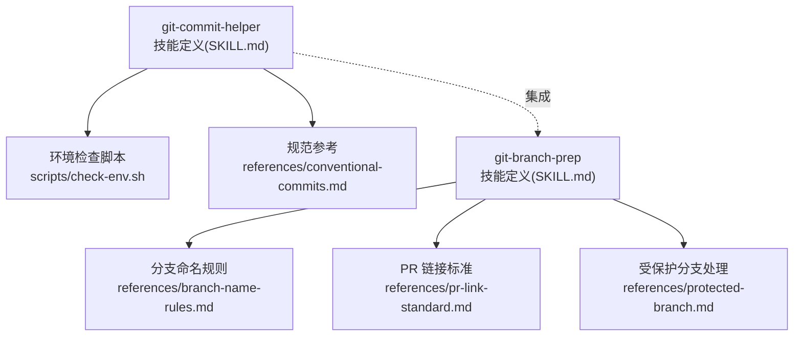
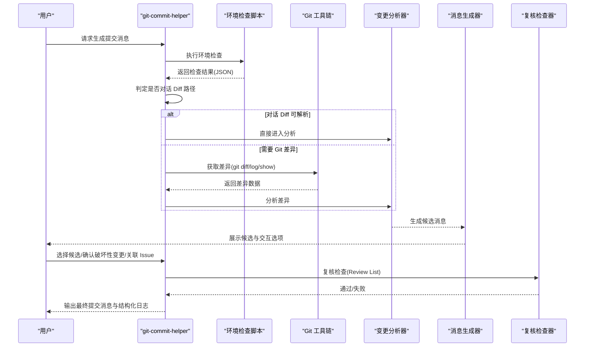
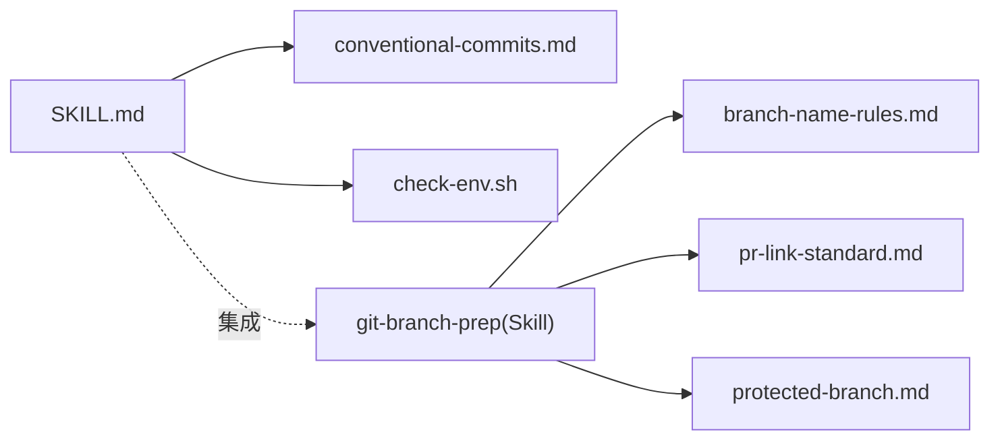

# git-commit-helper（提交助手）

<cite>
**本文引用的文件**
- [SKILL.md](file://skills/git-commit-helper/SKILL.md)
- [conventional-commits.md](file://skills/git-commit-helper/references/conventional-commits.md)
- [check-env.sh](file://skills/git-commit-helper/scripts/check-env.sh)
- [SKILL.md（git-branch-prep）](file://skills/git-branch-prep/SKILL.md)
- [branch-name-rules.md](file://skills/git-branch-prep/references/branch-name-rules.md)
- [pr-link-standard.md](file://skills/git-branch-prep/references/pr-link-standard.md)
- [protected-branch.md](file://skills/git-branch-prep/references/protected-branch.md)
</cite>

## 目录
1. [简介](#简介)
2. [项目结构](#项目结构)
3. [核心组件](#核心组件)
4. [架构总览](#架构总览)
5. [详细组件分析](#详细组件分析)
6. [依赖关系分析](#依赖关系分析)
7. [性能考量](#性能考量)
8. [故障排查指南](#故障排查指南)
9. [结论](#结论)
10. [附录](#附录)

## 简介
git-commit-helper 是一个遵循 Conventional Commits 规范的智能提交助手技能，能够基于 Git 差异或用户提供的 diff，自动生成符合规范的提交消息，并支持多轮交互确认、破坏性变更标记校正、问题链接引用以及最终消息验证。它同时与 git-branch-prep 技能配合，形成“分析变更 → 生成提交消息 → 推导分支名 → 生成 PR 链接”的完整工作流。

## 项目结构
该技能位于 skills/git-commit-helper 目录下，主要包含以下关键文件：
- SKILL.md：技能定义与完整工作流说明
- references/conventional-commits.md：Conventional Commits 规范参考
- scripts/check-env.sh：环境检查脚本，用于验证 Git 状态与变更可用性
- 与 git-branch-prep 的集成：通过引用其分支命名规则、PR 链接标准与受保护分支处理

图表来源
- [SKILL.md:1-296](file://skills/git-commit-helper/SKILL.md#L1-L296)
- [check-env.sh:1-94](file://skills/git-commit-helper/scripts/check-env.sh#L1-L94)
- [conventional-commits.md:1-177](file://skills/git-commit-helper/references/conventional-commits.md#L1-L177)
- [SKILL.md（git-branch-prep）:1-276](file://skills/git-branch-prep/SKILL.md#L1-L276)
- [branch-name-rules.md:1-41](file://skills/git-branch-prep/references/branch-name-rules.md#L1-L41)
- [pr-link-standard.md:1-39](file://skills/git-branch-prep/references/pr-link-standard.md#L1-L39)
- [protected-branch.md:1-26](file://skills/git-branch-prep/references/protected-branch.md#L1-L26)

章节来源
- [SKILL.md:1-296](file://skills/git-commit-helper/SKILL.md#L1-L296)
- [check-env.sh:1-94](file://skills/git-commit-helper/scripts/check-env.sh#L1-L94)
- [conventional-commits.md:1-177](file://skills/git-commit-helper/references/conventional-commits.md#L1-L177)
- [SKILL.md（git-branch-prep）:1-276](file://skills/git-branch-prep/SKILL.md#L1-L276)
- [branch-name-rules.md:1-41](file://skills/git-branch-prep/references/branch-name-rules.md#L1-L41)
- [pr-link-standard.md:1-39](file://skills/git-branch-prep/references/pr-link-standard.md#L1-L39)
- [protected-branch.md:1-26](file://skills/git-branch-prep/references/protected-branch.md#L1-L26)

## 核心组件
- 环境检查器：通过 check-env.sh 执行 Git 环境与变更状态检查，确保后续分析与生成流程可用
- 变更分析器：根据 Git diff 或用户提供的 diff，识别文件类型与变更分布，推断变更意图与范围
- 提交消息生成器：依据 Conventional Commits 规范生成候选消息，支持多候选与破坏性变更标记
- 交互确认器：通过 AskUserQuestion 与用户进行多轮交互，确认候选、破坏性变更与问题链接
- 复核检查器：对照 Review List 对最终消息进行格式、类型、内容与标记一致性检查
- 集成适配器：与 git-branch-prep 协作，复用分支命名规则与 PR 链接标准

章节来源
- [SKILL.md:43-139](file://skills/git-commit-helper/SKILL.md#L43-L139)
- [check-env.sh:17-83](file://skills/git-commit-helper/scripts/check-env.sh#L17-L83)
- [conventional-commits.md:45-57](file://skills/git-commit-helper/references/conventional-commits.md#L45-L57)

## 架构总览
git-commit-helper 的整体架构围绕“预检查 → 输入源判定 → 获取差异 → 分析变更 → 生成候选 → 交互确认 → 复核检查 → 结果输出”的流水线展开。其中，环境检查与差异获取是前置条件，分析与生成阶段依赖 Conventional Commits 规范，交互与复核保障质量与一致性。

图表来源
- [SKILL.md:43-139](file://skills/git-commit-helper/SKILL.md#L43-L139)
- [check-env.sh:17-83](file://skills/git-commit-helper/scripts/check-env.sh#L17-L83)

## 详细组件分析

### 环境检查器（check-env.sh）
职责
- 检查 jq 是否安装（JSON 处理依赖）
- 检查是否处于 Git 仓库目录
- 检查 Git 版本是否满足最低要求
- 检查是否存在冲突状态（合并/拣选/回滚/变基）
- 检查是否有可分析的变更（暂存区统计）

行为特征
- 以 JSON 形式输出检查结果，便于上游解析
- 在检测到冲突或无变更时终止流程
- 通过 git add -A 将所有变更纳入暂存区，确保后续 diff 可用

复杂度与性能
- 时间复杂度近似 O(1)（多次 shell 命令调用，但均为轻量级）
- 输出 JSON，利于下游工具快速消费

章节来源
- [check-env.sh:1-94](file://skills/git-commit-helper/scripts/check-env.sh#L1-L94)

### 变更分析器（差异获取与分析）
输入来源
- 暂存区差异（git diff --staged）
- 单个提交差异（git show 或 git diff <commit>^!）
- 分支范围差异（git log <range> -p）

分析策略
- 文件类型区分：非二进制文件进行内容分析，二进制文件仅记录文件名与变更类型
- 变更分布统计：新增、修改、删除、重命名、权限变化等
- 类型与范围推断：结合 Conventional Commits 类型表与变更范围，生成候选类型集合

候选生成
- 单一性质变更：生成 1 个候选
- 多性质变更：生成 1~3 个候选，覆盖不同类型组合
- 候选优化：长度控制、格式校验、内容规范、破坏性标记一致性

章节来源
- [SKILL.md:71-110](file://skills/git-commit-helper/SKILL.md#L71-L110)
- [conventional-commits.md:126-140](file://skills/git-commit-helper/references/conventional-commits.md#L126-L140)

### 提交消息生成器（模板系统与规则）
模板系统
- 基于 Conventional Commits 规范的三段式结构：type(scope): description
- 支持破坏性变更标记（! 或 BREAKING CHANGE:）
- 支持可选 Body 与 Footer（如关联 Issue）

生成规则
- Subject 不超过 50 字符
- 描述以动词开头、使用简单现在时、不以句号结尾
- Body 解释“做了什么”和“为什么”，每行不超过 72 字符
- 全部使用英文，避免 [skip ci] 等标记
- 当存在二进制文件时，仅标注文件名与变更类型，不分析内容

章节来源
- [SKILL.md:141-162](file://skills/git-commit-helper/SKILL.md#L141-L162)
- [conventional-commits.md:45-57](file://skills/git-commit-helper/references/conventional-commits.md#L45-L57)

### 类型分类逻辑（feat、fix、docs、style、refactor、perf、test、build、ci、chore、revert）
类型来源
- Conventional Commits 类型表：feat、fix、docs、style、refactor、perf、test、build、ci、chore、revert 等

分类策略
- 优先依据变更语义与范围选择最贴切的类型
- 当变更涉及多个方面（如新增功能 + 性能优化）时，生成多个候选类型
- 与破坏性变更标记联动：当用户确认破坏性变更时，自动保留或添加 ! 与 BREAKING CHANGE:

章节来源
- [conventional-commits.md:126-140](file://skills/git-commit-helper/references/conventional-commits.md#L126-L140)
- [SKILL.md:152-162](file://skills/git-commit-helper/SKILL.md#L152-L162)

### 描述生成规则
- 动词开头：add、implement、correct、refactor、optimize 等
- 简单现在时：描述当前动作而非完成态
- 不带句号：避免标点符号干扰
- 长度限制：Subject ≤ 50 字符，必要时精简描述
- 英文表达：避免本地化语言混杂

章节来源
- [SKILL.md:144-147](file://skills/git-commit-helper/SKILL.md#L144-L147)
- [conventional-commits.md:51-51](file://skills/git-commit-helper/references/conventional-commits.md#L51-L51)

### 交互式问答流程与多轮对话
交互要点
- 候选选择：一次性展示 1~3 个候选，用户选择其一
- 破坏性变更确认：独立确认，与候选中的 ! 标记保持一致
- 问题链接：允许用户输入 Issue 编号（如 #123），最终在 Footer 中体现
- 冲突解决：当用户确认与候选标记不一致时，自动修正（添加/移除 ! 与 BREAKING CHANGE:）

章节来源
- [SKILL.md:112-125](file://skills/git-commit-helper/SKILL.md#L112-L125)
- [SKILL.md:162-162](file://skills/git-commit-helper/SKILL.md#L162-L162)

### 最终消息验证过程（Review List）
验证清单
- 格式检查：严格遵循 Conventional Commits 格式，Subject ≤ 50 字符，描述以动词开头且不带句号，Body 行宽 ≤ 72 字符
- 类型检查：类型来自规范类型表
- 内容检查：英文、简洁、不含 [skip ci]，二进制文件处理正确
- 标记检查：破坏性变更标记一致（! 或 BREAKING CHANGE:），! 位置正确，问题链接正确引用

章节来源
- [SKILL.md:270-292](file://skills/git-commit-helper/SKILL.md#L270-L292)
- [conventional-commits.md:45-57](file://skills/git-commit-helper/references/conventional-commits.md#L45-L57)

### 与 git-branch-prep 的集成
- 分支命名：从最终提交消息提取 type 与 subject，按规则转换为 kebab-case 并拼接前缀
- PR 链接：优先从 push 输出提取 PR 链接；否则基于远程 URL 动态构建
- 受保护分支：在受保护分支上强制新建特性分支，避免直接提交

章节来源
- [SKILL.md（git-branch-prep）:1-276](file://skills/git-branch-prep/SKILL.md#L1-L276)
- [branch-name-rules.md:1-41](file://skills/git-branch-prep/references/branch-name-rules.md#L1-L41)
- [pr-link-standard.md:1-39](file://skills/git-branch-prep/references/pr-link-standard.md#L1-L39)
- [protected-branch.md:1-26](file://skills/git-branch-prep/references/protected-branch.md#L1-L26)

## 依赖关系分析
- 内部依赖
  - SKILL.md 依赖 conventional-commits.md 的类型与规范
  - SKILL.md 依赖 check-env.sh 的环境检查能力
  - 与 git-branch-prep 的分支命名与 PR 链接规则耦合
- 外部依赖
  - Git 工具链：diff、log、show、rev-list 等
  - jq：JSON 处理
  - Bash 环境：脚本执行与命令行工具

图表来源
- [SKILL.md:1-296](file://skills/git-commit-helper/SKILL.md#L1-L296)
- [conventional-commits.md:1-177](file://skills/git-commit-helper/references/conventional-commits.md#L1-L177)
- [check-env.sh:1-94](file://skills/git-commit-helper/scripts/check-env.sh#L1-L94)
- [SKILL.md（git-branch-prep）:1-276](file://skills/git-branch-prep/SKILL.md#L1-L276)
- [branch-name-rules.md:1-41](file://skills/git-branch-prep/references/branch-name-rules.md#L1-L41)
- [pr-link-standard.md:1-39](file://skills/git-branch-prep/references/pr-link-standard.md#L1-L39)
- [protected-branch.md:1-26](file://skills/git-branch-prep/references/protected-branch.md#L1-L26)

## 性能考量
- 环境检查与差异获取为轻量操作，整体时间复杂度近似 O(1)
- 候选生成与优化在内存中完成，对大体量变更建议分批处理
- JSON 输出便于下游工具快速解析，减少二次解析成本
- 建议在 CI 环境中启用 NO_VERIFY=1 提交，避免钩子阻塞

## 故障排查指南
常见问题与处理
- 未在 Git 仓库中：检查工作目录是否为 Git 仓库，或切换到有效仓库
- Git 版本过低：升级 Git 至 2.0+ 以上
- 存在冲突状态：先解决合并/拣选/回滚/变基冲突再继续
- 无可分析变更：确认暂存区或指定范围存在差异
- 对话 Diff 格式不可解析：提供标准统一 diff 格式，或切换到 Git 路径
- 破坏性变更标记不一致：根据用户确认自动修正，确保最终一致性

章节来源
- [check-env.sh:17-83](file://skills/git-commit-helper/scripts/check-env.sh#L17-L83)
- [SKILL.md:57-69](file://skills/git-commit-helper/SKILL.md#L57-L69)
- [SKILL.md:162-162](file://skills/git-commit-helper/SKILL.md#L162-L162)

## 结论
git-commit-helper 通过严谨的环境检查、规范化的变更分析与候选生成、严格的交互确认与复核流程，实现了高质量的 Conventional Commits 提交消息生成。其与 git-branch-prep 的深度集成进一步完善了从变更分析到 PR 链接的端到端工作流，适合在团队协作与自动化流水线中广泛采用。

## 附录

### 使用示例与消息格式规范
- 示例输出结构：包含前置信息、候选列表、确认阶段、最终提交消息与结构化日志
- 消息格式：严格遵循 Conventional Commits，支持破坏性变更标记与问题链接引用
- 长度与风格：Subject ≤ 50 字符，描述以动词开头且不带句号，Body 行宽 ≤ 72 字符

章节来源
- [SKILL.md:166-267](file://skills/git-commit-helper/SKILL.md#L166-L267)
- [conventional-commits.md:45-57](file://skills/git-commit-helper/references/conventional-commits.md#L45-L57)