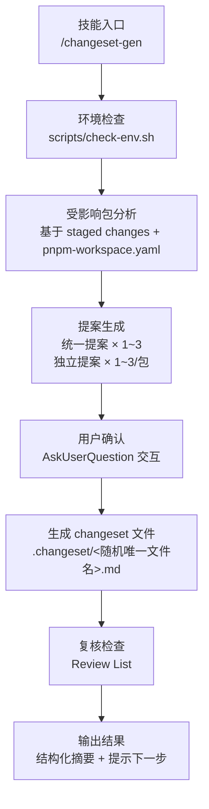
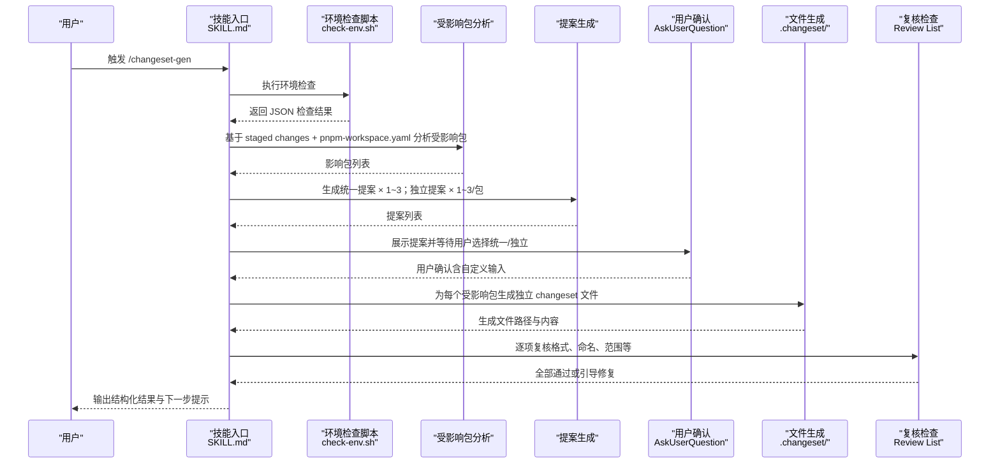
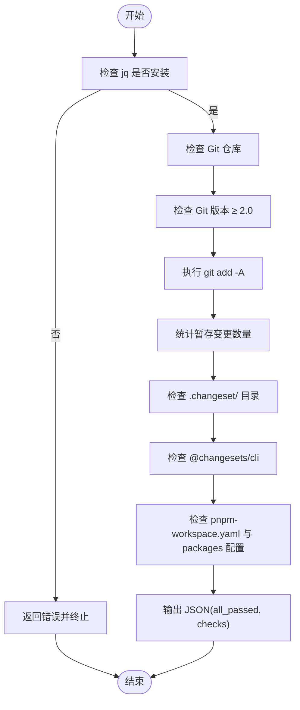
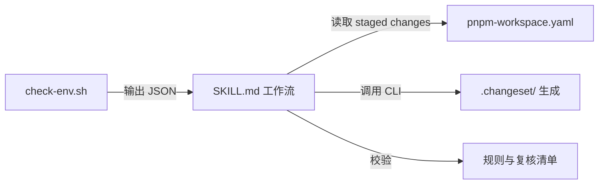

# changeset-gen 变更集生成技能

<cite>
**本文引用的文件列表**
- [SKILL.md](file://skills/changeset-gen/SKILL.md)
- [check-env.sh](file://skills/changeset-gen/scripts/check-env.sh)
- [SKILL.md（简体中文）](file://skills/changeset-gen/SKILL.md)
- [check-env.sh（简体中文）](file://skills/changeset-gen/scripts/check-env.sh)
- [README.md](file://README.md)
</cite>

## 目录
1. [简介](#简介)
2. [项目结构](#项目结构)
3. [核心组件](#核心组件)
4. [架构总览](#架构总览)
5. [详细组件分析](#详细组件分析)
6. [依赖关系分析](#依赖关系分析)
7. [性能考量](#性能考量)
8. [故障排查指南](#故障排查指南)
9. [结论](#结论)
10. [附录](#附录)

## 简介
changeset-gen 是一个专用于在 nx + pnpm changeset monorepo 环境中，基于“暂存变更”分析受影响包并自动生成 pnpm changeset 版本变更文件的工具型技能。它聚焦单一职责：在不涉及分支创建、提交或推送的前提下，完成环境检查、受影响包分析、提案生成、用户确认与文件生成，并通过复核清单确保生成质量。

该技能同时支持“统一提案”和“独立提案”两种模式：
- 统一提案：对所有受影响包采用同一套版本变更级别与摘要，适合多模块协同更新、保持一致性。
- 独立提案：按包分别生成与确认提案，适合不同包差异较大、需要差异化处理的场景。

## 项目结构
changeset-gen 技能由两部分组成：
- 技能说明文档：定义工作流、规则、示例与复核清单
- 环境检查脚本：在执行前对 Git、pnpm changeset 配置、工作区配置等进行预检

图表来源
- [SKILL.md](file://skills/changeset-gen/SKILL.md)
- [check-env.sh](file://skills/changeset-gen/scripts/check-env.sh)

章节来源
- [SKILL.md](file://skills/changeset-gen/SKILL.md)
- [check-env.sh](file://skills/changeset-gen/scripts/check-env.sh)

## 核心组件
- 技能说明文档（SKILL.md）
  - 定义术语（Changeset 文件、受影响包）、前置条件、工作流、规则、示例与复核清单
  - 明确“统一提案”与“独立提案”的区别与适用场景
- 环境检查脚本（check-env.sh）
  - 检查 jq 是否可用
  - 检查是否在 Git 仓库、Git 版本 ≥ 2.0
  - 自动执行 git add -A 并检查暂存变更是否存在
  - 检查 .changeset/ 目录与 @changesets/cli 是否存在
  - 检查 pnpm-workspace.yaml 是否存在且包含 packages 配置
  - 输出 JSON 结构化的检查结果，供上层流程解析

章节来源
- [SKILL.md](file://skills/changeset-gen/SKILL.md)
- [check-env.sh](file://skills/changeset-gen/scripts/check-env.sh)

## 架构总览
下图展示了从触发到产出的端到端流程，映射到实际文件与步骤。

图表来源
- [SKILL.md](file://skills/changeset-gen/SKILL.md)
- [check-env.sh](file://skills/changeset-gen/scripts/check-env.sh)

## 详细组件分析

### 环境检查（check-env.sh）
- 功能要点
  - 依赖 jq 进行 JSON 处理
  - 检查 Git 仓库状态与版本
  - 自动执行 git add -A 并统计暂存变更数量
  - 检查 .changeset/ 目录与 @changesets/cli 是否存在
  - 检查 pnpm-workspace.yaml 是否存在且包含 packages 配置
  - 输出结构化 JSON，包含 all_passed 与 checks 数组
- 错误处理
  - 若缺少 jq，直接返回错误并终止
  - 任一检查失败均标记为未通过，便于上层流程判断

图表来源
- [check-env.sh](file://skills/changeset-gen/scripts/check-env.sh)

章节来源
- [check-env.sh](file://skills/changeset-gen/scripts/check-env.sh)

### 受影响包分析与提案生成
- 受影响包分析
  - 读取 staged changes 列表
  - 解析 pnpm-workspace.yaml 的 packages 配置，推导包目录
  - 将变更文件映射到包目录，读取各包 package.json 的 name 字段，汇总受影响包
  - 若某包缺失 package.json 或 name 字段，则跳过并提示用户
  - 若无受影响包，直接进入“无变更需求”流程
- 提案生成
  - 统一提案：综合评估所有受影响包的变更内容，生成 1~3 条统一方案（含版本级别组合与摘要）
  - 独立提案：针对每个受影响包，基于其变更详情生成 1~3 条独立方案（含版本级别与摘要）

章节来源
- [SKILL.md](file://skills/changeset-gen/SKILL.md)

### 用户确认与交互
- 提案模式选择
  - 统一提案：对所有包应用同一提案
  - 独立提案：逐包确认
- 交互方式
  - 使用 AskUserQuestion 进行选项展示与选择
  - 支持“自定义”输入，允许用户手动指定版本级别与摘要

章节来源
- [SKILL.md](file://skills/changeset-gen/SKILL.md)

### 文件生成与命名
- 文件命名
  - 为每个受影响包生成独立 changeset 文件
  - 文件名采用随机英文词组合（如 adjective-noun-noun），保证唯一性
  - 若与现有 .changeset/ 文件冲突则重新生成
- 内容格式
  - YAML frontmatter：包含包名与版本级别
  - 正文：变更摘要（来自用户确认或自定义输入）
- 路径限制
  - 仅生成于 .changeset/ 目录，避免污染其他目录

章节来源
- [SKILL.md](file://skills/changeset-gen/SKILL.md)

### 复核检查与输出
- 复核清单
  - 每个受影响包独立生成 changeset 文件
  - 版本级别与摘要与用户选择一致
  - 文件名唯一且未覆盖已有文件
  - 文件格式正确（frontmatter 合法、包名引号规范）
  - 仅生成于 .changeset/ 目录
  - 未修改暂存变更或执行提交/推送操作
- 失败处理
  - 若复核失败，询问用户保留/删除/回退到对应步骤修复
- 输出结果
  - 结构化摘要（受影响包数、生成文件数、文件路径）
  - 提示下一步：执行 git add .changeset/

章节来源
- [SKILL.md](file://skills/changeset-gen/SKILL.md)

## 依赖关系分析
- 外部依赖
  - jq：用于 JSON 处理与解析
  - Git：用于暂存变更与仓库状态检查
  - pnpm changeset：用于发布流程的 changeset 文件
  - pnpm-workspace.yaml：用于识别包目录结构
- 内部依赖
  - check-env.sh 作为环境检查前置步骤，为后续流程提供基础保障
  - SKILL.md 定义了完整的业务流程与规则约束

图表来源
- [check-env.sh](file://skills/changeset-gen/scripts/check-env.sh)
- [SKILL.md](file://skills/changeset-gen/SKILL.md)

章节来源
- [check-env.sh](file://skills/changeset-gen/scripts/check-env.sh)
- [SKILL.md](file://skills/changeset-gen/SKILL.md)

## 性能考量
- 环境检查阶段
  - 仅执行必要的 Git 与文件系统检查，开销极低
- 受影响包分析
  - staged changes 列表通常较小，解析成本可忽略
  - pnpm-workspace.yaml 解析与包目录匹配为线性复杂度
- 提案生成
  - 统一提案与独立提案均基于有限候选数量（1~3），时间开销可控
- 文件生成
  - 每个包独立生成文件，I/O 成本与包数量线性相关
- 建议
  - 在大型 monorepo 中，尽量减少无关文件的暂存，以缩短分析时间
  - 使用稳定的 pnpm-workspace.yaml 配置，避免频繁变动导致的解析成本

## 故障排查指南
- 缺少 jq
  - 现象：环境检查直接报错并终止
  - 处理：安装 jq 后重试
- 不在 Git 仓库
  - 现象：环境检查失败，提示不在 Git 仓库
  - 处理：初始化 Git 仓库或切换到有效仓库
- Git 版本过低
  - 现象：环境检查失败，提示升级 Git 至 2.0+
  - 处理：升级 Git 后重试
- 无暂存变更
  - 现象：环境检查失败，提示无变更可分析
  - 处理：先执行 git add 添加变更，再运行技能
- 未启用 pnpm changeset
  - 现象：环境检查失败，提示缺少 .changeset/ 或 @changesets/cli
  - 处理：创建 .changeset/ 目录并安装 @changesets/cli
- 未配置 pnpm-workspace.yaml
  - 现象：环境检查失败，提示缺少 pnpm-workspace.yaml 或缺少 packages 配置
  - 处理：创建 pnpm-workspace.yaml 并添加 packages 配置
- 文件名冲突
  - 现象：生成文件时与现有 .changeset/ 文件名重复
  - 处理：自动重新生成唯一文件名；若仍冲突，请清理 .changeset/ 中的异常文件
- 复核失败
  - 现象：生成文件后复核清单某项未通过
  - 处理：根据提示选择保留/删除/回退到对应步骤修复

章节来源
- [check-env.sh](file://skills/changeset-gen/scripts/check-env.sh)
- [SKILL.md](file://skills/changeset-gen/SKILL.md)

## 结论
changeset-gen 技能通过严格的环境检查、清晰的受影响包分析与双模式提案机制，实现了在 nx + pnpm changeset monorepo 环境中高效、安全地生成 changeset 文件。其规则与复核清单确保生成质量，交互设计兼顾效率与准确性。推荐在日常迭代中配合 Git 暂存与 pnpm changeset 流程使用，提升发布自动化水平与一致性。

## 附录

### 使用示例（对话交互）
- 统一提案模式
  - 用户触发 /changeset-gen
  - AI 展示受影响包与统一提案
  - 用户选择统一提案或自定义
  - AI 生成多个独立 changeset 文件并进入复核
- 独立提案模式
  - 用户触发 /changeset-gen
  - AI 展示统一提案与每包独立提案
  - 用户逐包选择提案或自定义
  - AI 生成对应 changeset 文件并进入复核

章节来源
- [SKILL.md](file://skills/changeset-gen/SKILL.md)

### 输出示例（结构化摘要）
- 影响包数量
- 生成 changeset 数量
- 文件路径
- 下一步提示：执行 git add .changeset/

章节来源
- [SKILL.md](file://skills/changeset-gen/SKILL.md)

### 前置条件与规则约束
- 前置条件
  - Git 仓库
  - 存在暂存变更
  - 项目启用 pnpm changeset（.changeset/ 与 @changesets/cli）
  - jq 可用
  - 存在 pnpm-workspace.yaml
- 规则约束
  - 文件名必须随机唯一，避免冲突
  - 每个受影响包独立生成文件
  - 仅生成于 .changeset/ 目录
  - 交互必须使用 AskUserQuestion
  - 不执行提交/推送/分支操作
  - 无暂存变更时需先执行 git add

章节来源
- [SKILL.md](file://skills/changeset-gen/SKILL.md)
- [check-env.sh](file://skills/changeset-gen/scripts/check-env.sh)

### 最佳实践
- 在提交前先执行一次暂存，确保 changeset-gen 能准确识别变更
- 使用统一提案时，优先在团队内约定统一的版本级别策略
- 使用独立提案时，建议为每个包准备充分的变更摘要，便于下游发布流程
- 生成完成后立即执行 git add .changeset/，以便纳入后续提交与发布流程
- 如遇复核失败，优先检查文件命名与格式是否符合要求