# Rush-to-Nx 项目迁移技能

<cite>
**本文档引用的文件**
- [SKILL.md](file://skills/rush-to-nx/SKILL.md)
- [EXAMPLES.md](file://skills/rush-to-nx/EXAMPLES.md)
- [release.sh](file://skills/rush-to-nx/scripts/release.sh)
- [configuration.md](file://skills/rush-to-nx/references/configuration.md)
- [migration-steps.md](file://skills/rush-to-nx/references/migration-steps.md)
- [quick-start.md](file://skills/rush-to-nx/references/quick-start.md)
- [faq.md](file://skills/rush-to-nx/references/faq.md)
</cite>

## 目录
1. [简介](#简介)
2. [项目结构](#项目结构)
3. [核心组件](#核心组件)
4. [架构概览](#架构概览)
5. [详细组件分析](#详细组件分析)
6. [依赖关系分析](#依赖关系分析)
7. [性能考虑](#性能考虑)
8. [故障排除指南](#故障排除指南)
9. [结论](#结论)
10. [附录](#附录)

## 简介

Rush-to-Nx 技能是一个专门设计用于将 Rush.js 单体仓库迁移到 Nx + pnpm 工作空间 + Changesets 生态系统的自动化技能。该技能旨在帮助团队从 Microsoft 的 Rush.js 工具链现代化升级到标准的 pnpm+Nx 工具链，同时保持项目的完整性和功能一致性。

### Rush.js vs Nx + Changesets 的差异

| 维度 | Rush.js | Nx + Changesets |
|------|---------|-----------------|
| 单体仓库管理 | Rush.js | Nx |
| 包管理器 | Rush 内置 pnpm | 原生 pnpm |
| 工作空间定义 | `rush.json` + `common/config/rush/` | `pnpm-workspace.yaml` |
| 任务编排 | `rush build`, `rush lint` | `nx run-many --target=build` |
| 版本管理 | `rush change` + `rush version` | Changesets (`pnpm changeset`) |
| 发布 | `rush publish` | Changesets (`pnpm changeset publish`) |
| Git hooks | `common/git-hooks/` + Rush 自动安装器 | `.husky/` |
| 提交规范 | `rush-commitlint` 自动安装器 | `commitlint.config.js` + husky |
| 格式化 | `rush-prettier` 自动安装器 | `.husky/pre-commit` + lint-staged |
| CI/CD | `actions-rush` GitHub Action | `pnpm/action-setup` |

## 项目结构

Rush-to-Nx 技能采用模块化的文件组织方式，包含以下主要组件：

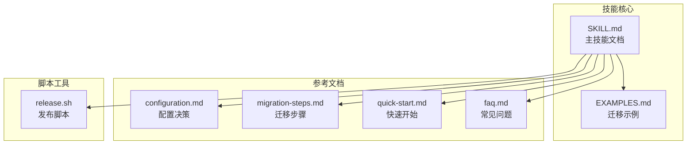

**图表来源**
- [SKILL.md:1-529](file://skills/rush-to-nx/SKILL.md#L1-L529)
- [EXAMPLES.md:1-208](file://skills/rush-to-nx/EXAMPLES.md#L1-L208)
- [configuration.md:1-73](file://skills/rush-to-nx/references/configuration.md#L1-L73)
- [migration-steps.md:1-320](file://skills/rush-to-nx/references/migration-steps.md#L1-L320)
- [quick-start.md:1-21](file://skills/rush-to-nx/references/quick-start.md#L1-L21)
- [faq.md:1-21](file://skills/rush-to-nx/references/faq.md#L1-L21)

**章节来源**
- [SKILL.md:1-529](file://skills/rush-to-nx/SKILL.md#L1-L529)
- [EXAMPLES.md:1-208](file://skills/rush-to-nx/EXAMPLES.md#L1-L208)

## 核心组件

### 1. 预检查阶段 (Pre-flight Check)

预检查阶段确保迁移环境满足基本要求：

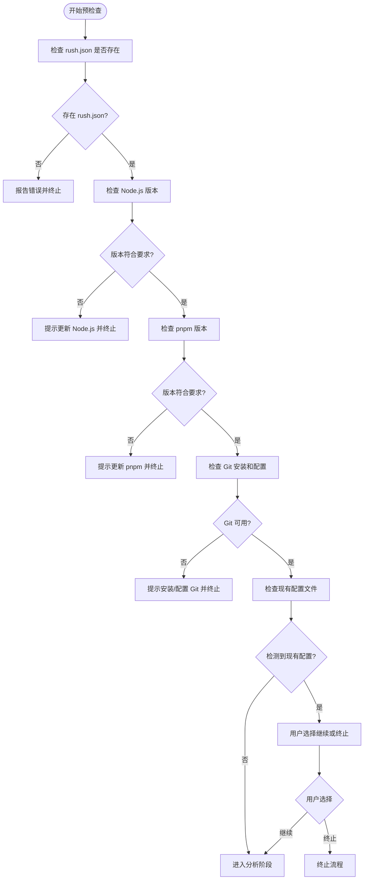

**图表来源**
- [SKILL.md:264-284](file://skills/rush-to-nx/SKILL.md#L264-L284)

### 2. 分析阶段 (Analysis)

分析阶段读取 `rush.json` 文件，理解项目结构：

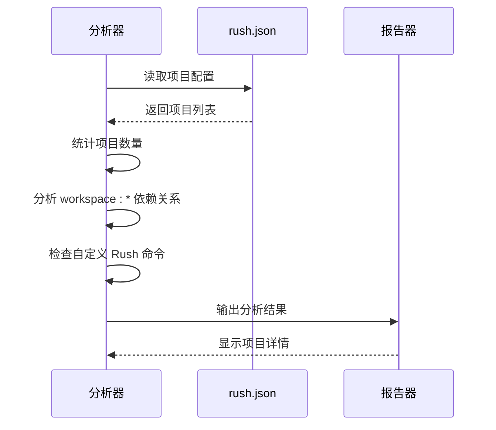

**图表来源**
- [SKILL.md:286-297](file://skills/rush-to-nx/SKILL.md#L286-L297)

### 3. 初始化阶段 (Initialization)

初始化阶段创建 Nx 工作区的基础配置：

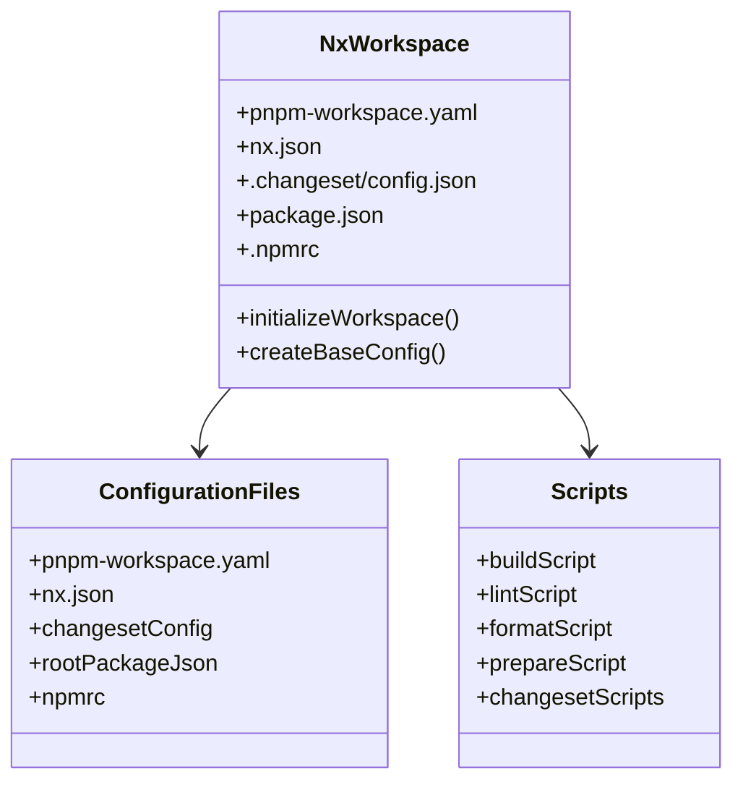

**图表来源**
- [migration-steps.md:39-126](file://skills/rush-to-nx/references/migration-steps.md#L39-L126)

**章节来源**
- [SKILL.md:26-96](file://skills/rush-to-nx/SKILL.md#L26-L96)
- [migration-steps.md:39-126](file://skills/rush-to-nx/references/migration-steps.md#L39-L126)

## 架构概览

Rush-to-Nx 技能采用分层架构设计，包含以下核心层次：

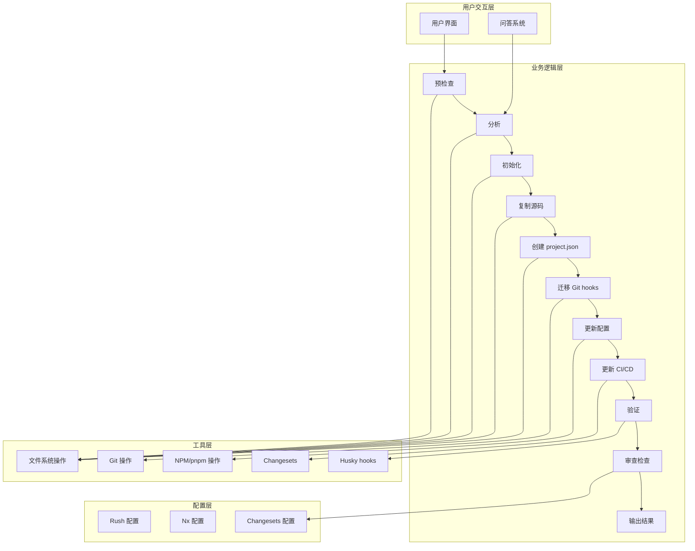

**图表来源**
- [SKILL.md:26-96](file://skills/rush-to-nx/SKILL.md#L26-L96)
- [SKILL.md:465-472](file://skills/rush-to-nx/SKILL.md#L465-L472)

## 详细组件分析

### 1. 迁移工作流详解

迁移工作流包含 10 个主要步骤：

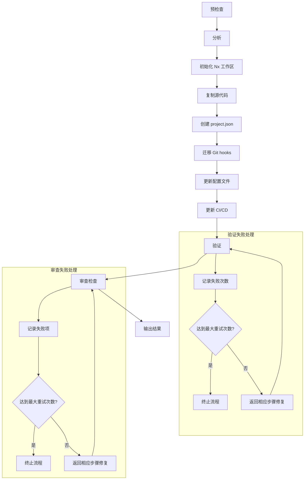

**图表来源**
- [SKILL.md:262-332](file://skills/rush-to-nx/SKILL.md#L262-L332)

### 2. 配置文件转换

#### pnpm-workspace.yaml 配置

配置文件定义了工作空间包的范围：

```yaml
packages:
  - 'packages/*'
```

#### nx.json 配置

配置 Nx 的默认基线和目标默认值：

```json
{
  "defaultBase": "master",
  "targetDefaults": {
    "build": { 
      "dependsOn": ["^build"], 
      "inputs": ["production", "^production"] 
    },
    "lint": { 
      "inputs": ["default", "{workspaceRoot}/.eslintrc*", "{workspaceRoot}/.eslintignore"] 
    }
  }
}
```

#### .changeset/config.json 配置

配置 Changesets 的发布策略：

```json
{
  "changelog": "@changesets/changelog-git",
  "commit": false,
  "updateInternalDependencies": "patch"
}
```

**章节来源**
- [migration-steps.md:43-126](file://skills/rush-to-nx/references/migration-steps.md#L43-L126)

### 3. 依赖关系管理

迁移过程中需要处理内部依赖关系：

```mermaid
graph LR
subgraph "Rush.js 依赖"
A[eslint-config-airbnb-ts]
B[eslint-config-airbnb]
C[prettier-config]
end
subgraph "NPM 依赖"
D[@scope/eslint-config-airbnb-ts]
E[@scope/eslint-config-airbnb]
F[@scope/prettier-config]
end
subgraph "Changesets 处理"
G[workspace:* 依赖]
H[自动解析为实际版本]
end
A -.->|internalDependencies| B
D -.->|implicitDependencies| E
G --> H
```

**图表来源**
- [migration-steps.md:175-182](file://skills/rush-to-nx/references/migration-steps.md#L175-L182)

### 4. Git hooks 迁移

从 Rush 的 `common/git-hooks/` 迁移到 Husky：

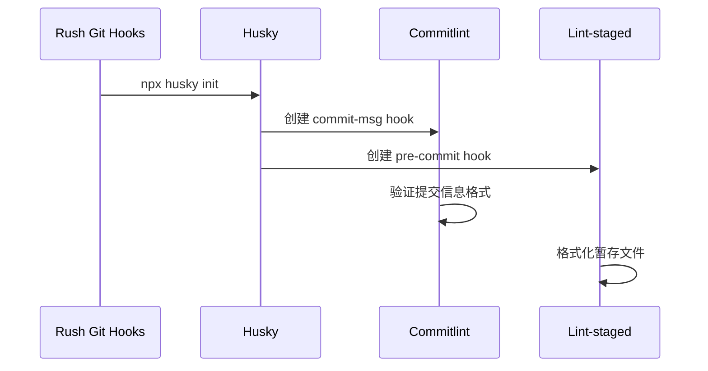

**图表来源**
- [migration-steps.md:184-226](file://skills/rush-to-nx/references/migration-steps.md#L184-L226)

**章节来源**
- [migration-steps.md:184-226](file://skills/rush-to-nx/references/migration-steps.md#L184-L226)

### 5. CI/CD 更新

从 `actions-rush` 迁移到 `pnpm/action-setup`：

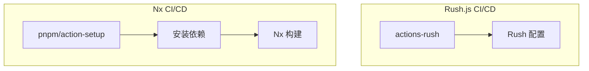

**图表来源**
- [migration-steps.md:293-309](file://skills/rush-to-nx/references/migration-steps.md#L293-L309)

**章节来源**
- [migration-steps.md:293-309](file://skills/rush-to-nx/references/migration-steps.md#L293-L309)

### 6. 发布脚本详解

release.sh 脚本实现了完整的发布流水线：

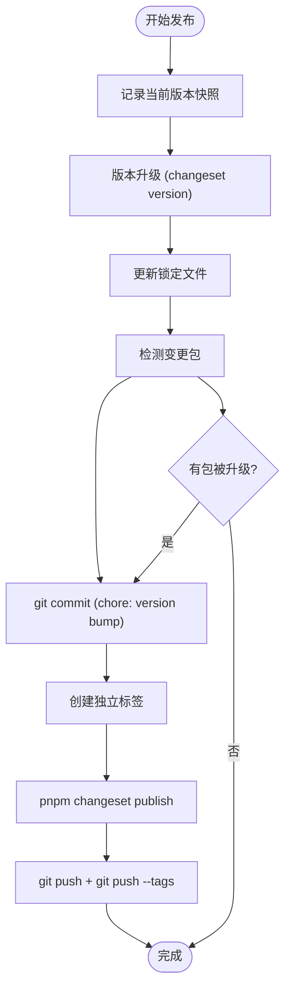

**图表来源**
- [release.sh:1-73](file://skills/rush-to-nx/scripts/release.sh#L1-L73)

**章节来源**
- [release.sh:1-73](file://skills/rush-to-nx/scripts/release.sh#L1-L73)

## 依赖关系分析

### 1. 外部依赖

Rush-to-Nx 技能依赖以下外部工具和库：

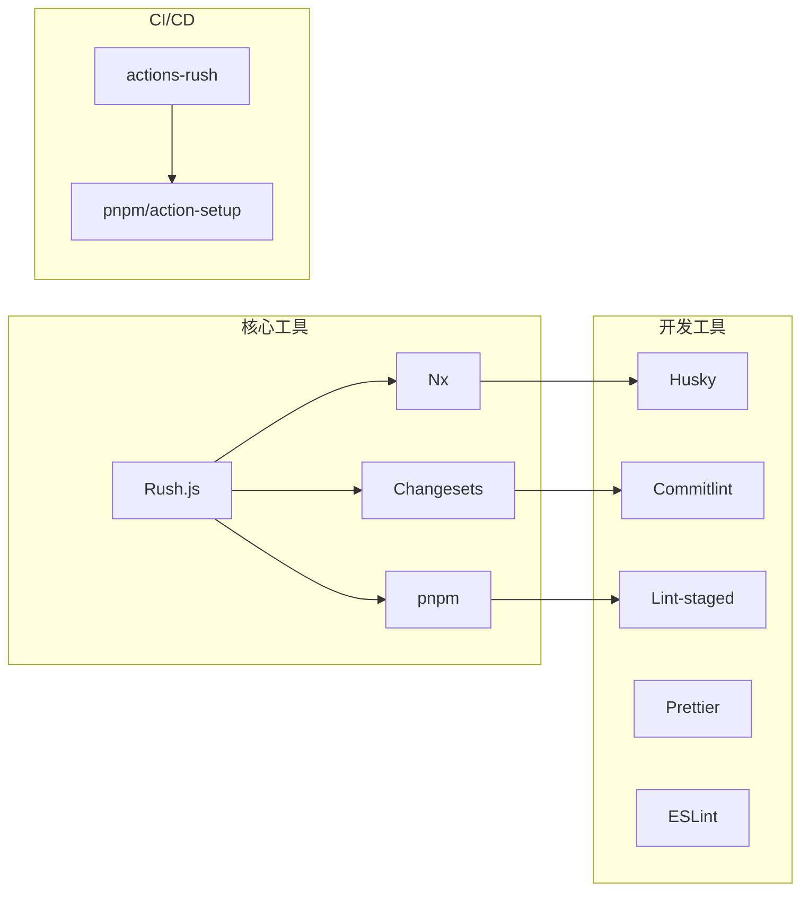

**图表来源**
- [SKILL.md:15-17](file://skills/rush-to-nx/SKILL.md#L15-L17)

### 2. 内部依赖关系

技能内部各组件之间的依赖关系：

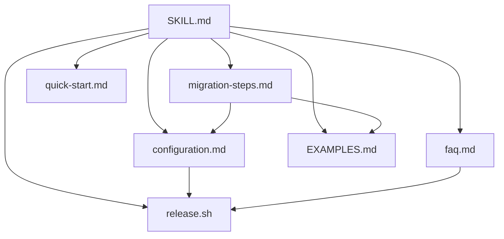

**图表来源**
- [SKILL.md:229-236](file://skills/rush-to-nx/SKILL.md#L229-L236)

**章节来源**
- [SKILL.md:15-17](file://skills/rush-to-nx/SKILL.md#L15-L17)

## 性能考虑

### 1. 迁移性能优化

- **增量迁移**: 支持小规模项目(<20个包)的快速迁移
- **缓存利用**: 利用 Nx 的任务缓存机制减少重复构建
- **并行执行**: 使用 `nx run-many` 并行执行多个包的任务

### 2. 配置优化建议

- **工作空间优化**: 使用扁平的 `packages/` 结构替代 Rush 的多级目录
- **依赖管理**: 利用 Changesets 的内部依赖更新策略
- **Git hooks**: 仅保留必要的 Git hooks，避免性能开销

## 故障排除指南

### 1. 常见问题及解决方案

#### Nx 命令未找到

**问题**: 执行 `nx` 命令时提示命令未找到

**解决方案**: 使用 pnpm 前缀执行
```bash
pnpm nx run-many --target=lint --all
```

#### Husky hooks 未执行

**问题**: Git 提交时 Husky hooks 未触发

**解决方案**: 确保执行准备脚本
```bash
pnpm prepare    # 或 pnpm install
```

#### Changesets 变更日志哈希前缀

**问题**: 默认的 `@changesets/cli/changelog` 产生 `dbece3b:` 哈希前缀

**解决方案**: 切换到 `@changesets/changelog-git`
```json
{
  "changelog": "@changesets/changelog-git"
}
```

### 2. 迁移后验证清单

迁移完成后，使用以下清单验证迁移完整性：

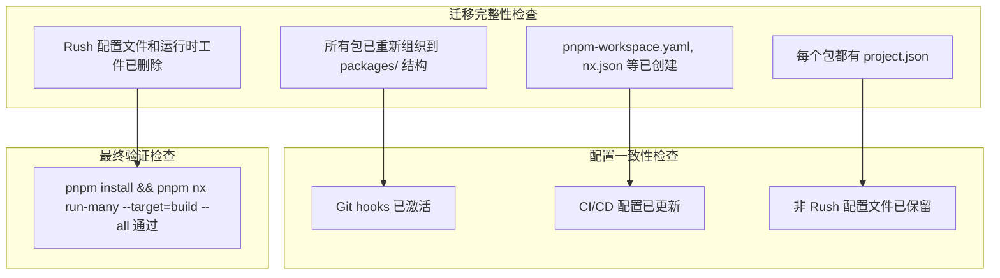

**图表来源**
- [SKILL.md:206-228](file://skills/rush-to-nx/SKILL.md#L206-L228)

**章节来源**
- [faq.md:1-21](file://skills/rush-to-nx/references/faq.md#L1-L21)
- [SKILL.md:206-228](file://skills/rush-to-nx/SKILL.md#L206-L228)

## 结论

Rush-to-Nx 技能提供了一个完整、自动化且可验证的 Rush.js 到 Nx 的迁移解决方案。通过精心设计的工作流和严格的验证机制，该技能能够帮助团队安全、高效地完成从 Rush.js 生态系统到现代 pnpm+Nx 工具链的升级。

### 主要优势

1. **自动化程度高**: 减少手动操作，降低迁移风险
2. **验证机制完善**: 多层次验证确保迁移质量
3. **兼容性强**: 支持各种 Rush.js 项目结构
4. **文档齐全**: 提供详细的迁移步骤和最佳实践

### 最佳实践建议

1. **充分测试**: 在生产环境之前进行充分的测试
2. **备份策略**: 迁移前做好完整的项目备份
3. **团队培训**: 确保团队成员熟悉新的工具链
4. **持续改进**: 根据实际使用情况调整配置

## 附录

### 1. 快速开始指南

```bash
# 1. 分析现有 Rush 项目结构
cat rush.json | jq '.projects[] | {packageName, projectFolder}'

# 2. 创建新仓库并初始化基础配置
mkdir my-repo-nx && cd my-repo-nx
pnpm init
pnpm add -D -w nx @changesets/cli @changesets/changelog-git husky lint-staged prettier

# 3. 复制源代码，重组目录结构
rsync -av --exclude='node_modules' --exclude='common' --exclude='.git' /path/to/rush-repo/ .
mkdir -p packages
# 将 Rush 的 category/package 布局重组为 packages/

# 4. 安装依赖并验证
pnpm install
pnpm nx run-many --target=lint --all
```

### 2. 迁移示例

完整的迁移示例展示了从空目录开始的完整迁移过程，包括源代码复制、目录重组、配置更新和验证步骤。

### 3. 发布流程

Changesets 的发布流程提供了标准化的版本管理和发布机制，支持语义化版本控制和自动化发布。

**章节来源**
- [quick-start.md:1-21](file://skills/rush-to-nx/references/quick-start.md#L1-L21)
- [EXAMPLES.md:1-208](file://skills/rush-to-nx/EXAMPLES.md#L1-L208)