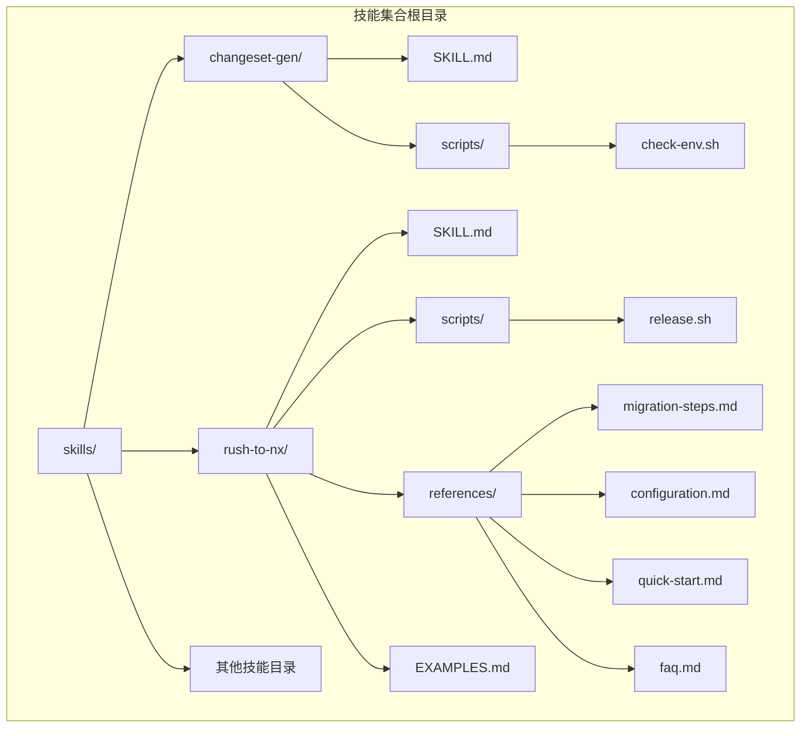
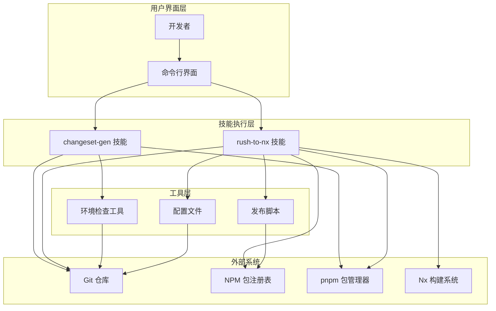
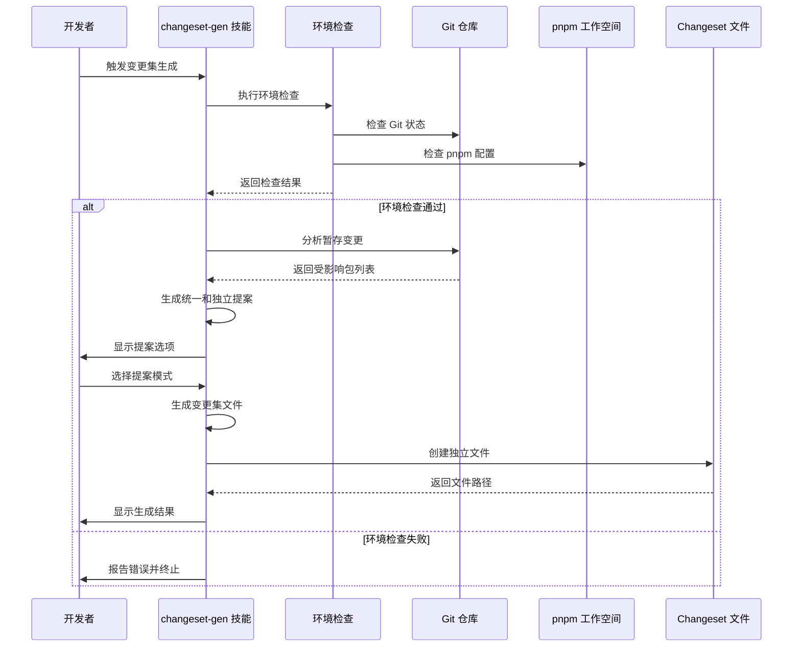
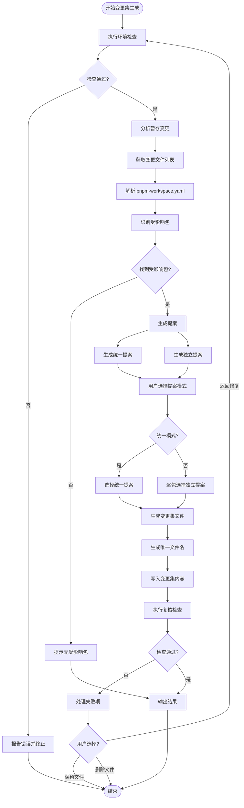
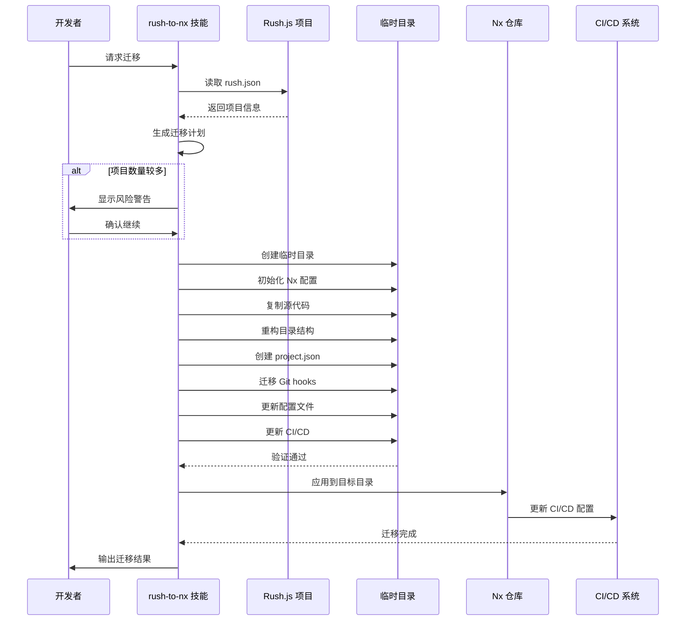
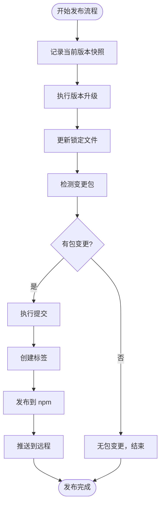
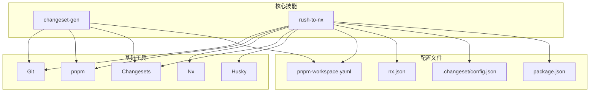

# 变更管理技能

<cite>
**本文档引用的文件**
- [changeset-gen/SKILL.md](file://skills/changeset-gen/SKILL.md)
- [changeset-gen/scripts/check-env.sh](file://skills/changeset-gen/scripts/check-env.sh)
- [rush-to-nx/SKILL.md](file://skills/rush-to-nx/SKILL.md)
- [rush-to-nx/scripts/release.sh](file://skills/rush-to-nx/scripts/release.sh)
- [rush-to-nx/EXAMPLES.md](file://skills/rush-to-nx/EXAMPLES.md)
- [rush-to-nx/references/migration-steps.md](file://skills/rush-to-nx/references/migration-steps.md)
- [rush-to-nx/references/configuration.md](file://skills/rush-to-nx/references/configuration.md)
- [rush-to-nx/references/quick-start.md](file://skills/rush-to-nx/references/quick-start.md)
- [rush-to-nx/references/faq.md](file://skills/rush-to-nx/references/faq.md)
- [README.md](file://README.md)
</cite>

## 目录
1. [简介](#简介)
2. [项目结构](#项目结构)
3. [核心组件](#核心组件)
4. [架构概览](#架构概览)
5. [详细组件分析](#详细组件分析)
6. [依赖关系分析](#依赖关系分析)
7. [性能考虑](#性能考虑)
8. [故障排除指南](#故障排除指南)
9. [结论](#结论)
10. [附录](#附录)

## 简介

本文件为变更管理技能模块的全面技术文档，重点介绍两个核心技能：changeset-gen（变更集生成器）和 rush-to-nx（Rush.js 迁移到 Nx）。文档详细解释了 pnpm changeset 的自动生成机制、版本管理策略以及从 Rush.js 到 Nx 的完整迁移流程。内容涵盖 monorepo 环境下的变更集生成、发布流程和 Rush.js 到 Nx 的迁移步骤，并提供具体的配置示例和使用场景，帮助开发者理解和应用这些变更管理工具。

## 项目结构

该项目是一个技能集合仓库，采用按技能分层的组织方式。主要结构如下：

**图表来源**
- [README.md:1-113](file://README.md#L1-L113)
- [skills/changeset-gen/SKILL.md:1-284](file://skills/changeset-gen/SKILL.md#L1-L284)
- [skills/rush-to-nx/SKILL.md:1-529](file://skills/rush-to-nx/SKILL.md#L1-L529)

**章节来源**
- [README.md:1-113](file://README.md#L1-L113)

## 核心组件

### changeset-gen 技能

changeset-gen 是一个专门用于在 nx + pnpm changeset monorepo 中基于暂存变更自动分析受影响包并生成变更集文件的工具技能。其核心特点包括：

- **单一职责原则**：专注于变更集文件生成，不涉及分支创建、代码提交或推送操作
- **智能分析**：基于 staged changes 分析受影响的包
- **自动化生成**：为每个受影响包生成独立的变更集文件
- **双重提案模式**：支持统一提案和独立提案两种模式

### rush-to-nx 技能

rush-to-nx 提供了完整的 Rush.js 到 Nx + pnpm workspace + Changesets 的自动化迁移解决方案。该技能涵盖了从分析现有结构到最终验证的完整流程。

**章节来源**
- [skills/changeset-gen/SKILL.md:6-284](file://skills/changeset-gen/SKILL.md#L6-L284)
- [skills/rush-to-nx/SKILL.md:7-529](file://skills/rush-to-nx/SKILL.md#L7-L529)

## 架构概览

整个变更管理技能系统采用分层架构设计，各组件之间通过明确的接口进行交互：

**图表来源**
- [skills/changeset-gen/SKILL.md:29-129](file://skills/changeset-gen/SKILL.md#L29-L129)
- [skills/rush-to-nx/SKILL.md:26-96](file://skills/rush-to-nx/SKILL.md#L26-L96)

## 详细组件分析

### changeset-gen 组件分析

#### 工作流架构

changeset-gen 的工作流采用五步法设计，确保变更集生成的准确性和可靠性：

**图表来源**
- [skills/changeset-gen/SKILL.md:29-129](file://skills/changeset-gen/SKILL.md#L29-L129)

#### 环境检查机制

环境检查是确保变更集生成正确性的关键环节，包含以下检查项：

| 检查项 | 描述 | 重要性 |
|--------|------|--------|
| Git 仓库检测 | 验证当前目录是否为 Git 仓库 | 必需 |
| Git 版本检查 | 确保 Git 版本 >= 2.0 | 必需 |
| 变更存在性检查 | 验证暂存区是否有变更 | 必需 |
| pnpm changeset 配置检查 | 验证 .changeset/ 目录和 @changesets/cli 存在 | 必需 |
| pnpm-workspace.yaml 检查 | 验证工作空间配置文件存在且包含 packages 配置 | 必需 |

#### 变更集生成算法

**图表来源**
- [skills/changeset-gen/SKILL.md:44-129](file://skills/changeset-gen/SKILL.md#L44-L129)

**章节来源**
- [skills/changeset-gen/SKILL.md:29-129](file://skills/changeset-gen/SKILL.md#L29-L129)
- [skills/changeset-gen/scripts/check-env.sh:1-115](file://skills/changeset-gen/scripts/check-env.sh#L1-L115)

### rush-to-nx 组件分析

#### 迁移工作流

rush-to-nx 提供了完整的八步迁移流程，确保从 Rush.js 平滑迁移到 Nx 生态系统：

**图表来源**
- [skills/rush-to-nx/SKILL.md:26-96](file://skills/rush-to-nx/SKILL.md#L26-L96)

#### 关键配置文件

迁移过程中需要创建和更新的关键配置文件包括：

| 配置文件 | 用途 | 主要内容 |
|----------|------|----------|
| pnpm-workspace.yaml | 定义工作空间包结构 | packages: ['packages/*'] |
| nx.json | Nx 构建配置 | 默认基线、目标默认值、命名输入 |
| .changeset/config.json | Changesets 配置 | 变更日志、内部依赖更新策略 |
| package.json | 根包配置 | 脚本、依赖、引擎要求 |
| .npmrc | npm 配置 | 注册表、提升设置、严格 peer 依赖 |
| commitlint.config.js | 提交规范配置 | Conventional commits 规则 |
| .lintstagedrc.json | 代码格式化配置 | Prettier 和 ESLint 规则 |

#### 发布流程自动化

release.sh 脚本实现了完整的发布自动化流程：

**图表来源**
- [skills/rush-to-nx/scripts/release.sh:1-73](file://skills/rush-to-nx/scripts/release.sh#L1-L73)

**章节来源**
- [skills/rush-to-nx/SKILL.md:26-96](file://skills/rush-to-nx/SKILL.md#L26-L96)
- [skills/rush-to-nx/scripts/release.sh:1-73](file://skills/rush-to-nx/scripts/release.sh#L1-L73)

## 依赖关系分析

### 技能间依赖

**图表来源**
- [skills/changeset-gen/SKILL.md:21-28](file://skills/changeset-gen/SKILL.md#L21-L28)
- [skills/rush-to-nx/SKILL.md:19-24](file://skills/rush-to-nx/SKILL.md#L19-L24)

### 外部依赖关系

| 依赖项 | 版本要求 | 用途 | 重要性 |
|--------|----------|------|--------|
| Node.js | >=18.15.0 (<19) 或 >=20.9.0 (<21) | 运行时环境 | 必需 |
| pnpm | >=8.15.9 | 包管理器 | 必需 |
| Git | >=2.0 | 版本控制 | 必需 |
| jq | 任意版本 | JSON 处理 | 必需 |
| Husky | >=9.0.11 | Git hooks | 推荐 |
| Nx | >=19.0.0 | 构建系统 | 推荐 |
| Changesets | >=2.27.1 | 版本管理 | 推荐 |

**章节来源**
- [skills/changeset-gen/SKILL.md:21-28](file://skills/changeset-gen/SKILL.md#L21-L28)
- [skills/rush-to-nx/SKILL.md:19-24](file://skills/rush-to-nx/SKILL.md#L19-L24)

## 性能考虑

### changeset-gen 性能优化

1. **增量分析**：仅分析暂存区的变更，避免全量扫描
2. **并行处理**：对不同包的变更分析可以并行执行
3. **缓存机制**：利用 Git 的对象数据库减少重复计算
4. **内存管理**：合理管理临时文件和进程生命周期

### rush-to-nx 迁移性能

1. **临时目录策略**：先在临时目录构建验证，再应用到目标目录
2. **rsync 优化**：排除不必要的文件和目录
3. **并发验证**：构建和验证可以在不同包上并行执行
4. **增量更新**：只更新必要的配置文件

## 故障排除指南

### changeset-gen 常见问题

#### 环境检查失败

| 错误类型 | 可能原因 | 解决方案 |
|----------|----------|----------|
| not in git repo | 当前目录不是 Git 仓库 | 在正确的仓库目录执行命令 |
| git version too low | Git 版本过低 | 升级 Git 到 2.0+ |
| no changes found | 暂存区没有变更 | 使用 `git add` 添加变更 |
| changeset not enabled | 缺少 .changeset/ 或 @changesets/cli | 初始化 Changesets 配置 |
| workspace config missing | pnpm-workspace.yaml 缺失 | 创建工作空间配置文件 |

#### 变更集生成问题

| 问题 | 可能原因 | 解决方案 |
|------|----------|----------|
| 文件名冲突 | 随机生成的文件名已存在 | 手动清理冲突文件或重新生成 |
| 包名缺失 | package.json 缺少 name 字段 | 补充包名字段 |
| 权限不足 | 目标目录权限不足 | 调整目录权限或使用管理员权限 |

### rush-to-nx 迁移问题

#### 迁移前检查失败

| 问题 | 可能原因 | 解决方案 |
|------|----------|----------|
| rush.json 不存在 | 不是 Rush 项目 | 确认项目结构或使用其他迁移方法 |
| Node.js 版本不兼容 | 版本超出支持范围 | 升级或降级 Node.js 版本 |
| pnpm 版本过低 | pnpm 版本不满足要求 | 升级 pnpm 到 8.15.9+ |
| Git 未配置 | Git 未正确安装或配置 | 安装并配置 Git |

#### 迁移过程问题

| 问题 | 可能原因 | 解决方案 |
|------|----------|----------|
| 构建失败 | 依赖安装或配置问题 | 检查依赖版本和配置文件 |
| Git hooks 未执行 | Husky 未正确初始化 | 运行 `pnpm prepare` 或 `pnpm install` |
| CI/CD 配置错误 | GitHub Actions 配置不当 | 更新到 pnpm/action-setup |
| 内部依赖解析失败 | implicitDependencies 配置错误 | 检查项目间的依赖关系 |

**章节来源**
- [skills/changeset-gen/SKILL.md:106-129](file://skills/changeset-gen/SKILL.md#L106-L129)
- [skills/rush-to-nx/SKILL.md:82-96](file://skills/rush-to-nx/SKILL.md#L82-L96)
- [skills/rush-to-nx/references/faq.md:1-21](file://skills/rush-to-nx/references/faq.md#L1-L21)

## 结论

变更管理技能模块提供了完整的 monorepo 变更管理解决方案，包括：

1. **自动化变更集生成**：通过 changeset-gen 实现智能的变更集文件生成，支持统一和独立两种提案模式
2. **完整的迁移工具链**：通过 rush-to-nx 提供从 Rush.js 到 Nx 的自动化迁移，涵盖配置转换、代码重构、Git hooks 迁移等
3. **可靠的发布流程**：集成 Changesets 实现自动化的版本升级、标签创建和发布流程
4. **完善的质量保证**：通过详细的复核检查和错误处理机制确保操作的可靠性

这些技能特别适合需要在 pnpm + Nx 生态系统中管理复杂 monorepo 项目的团队，能够显著提高开发效率和发布质量。

## 附录

### 使用场景示例

#### 场景一：日常功能开发
1. 开发者完成功能开发并暂存变更
2. 运行 `/changeset-gen` 技能
3. 选择合适的提案模式
4. 生成变更集文件并暂存
5. 后续通过 `/rush-to-nx` 进行发布

#### 场景二：项目迁移
1. 准备 Rush.js 项目
2. 运行 `/rush-to-nx` 技能
3. 确认迁移计划
4. 等待自动化迁移完成
5. 验证迁移结果

### 最佳实践建议

1. **定期维护**：定期运行环境检查确保工具正常工作
2. **版本控制**：所有配置文件都应纳入版本控制
3. **测试验证**：迁移前后都要进行充分的测试验证
4. **文档更新**：及时更新相关文档和配置说明
5. **团队培训**：确保团队成员了解新的工作流程