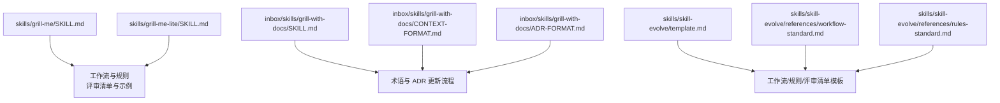
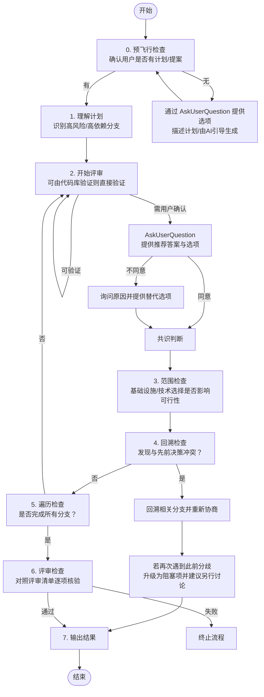
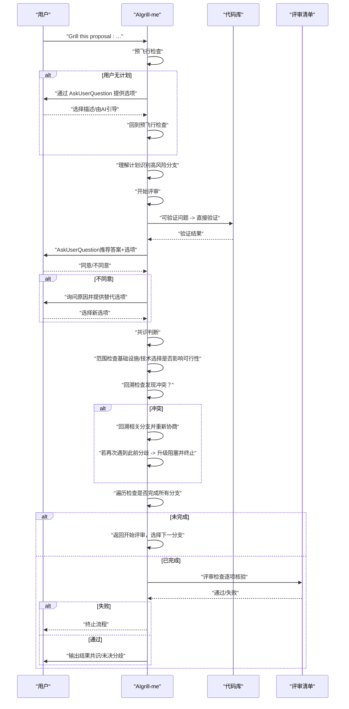
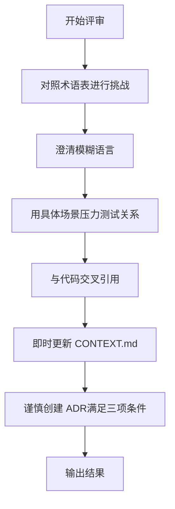
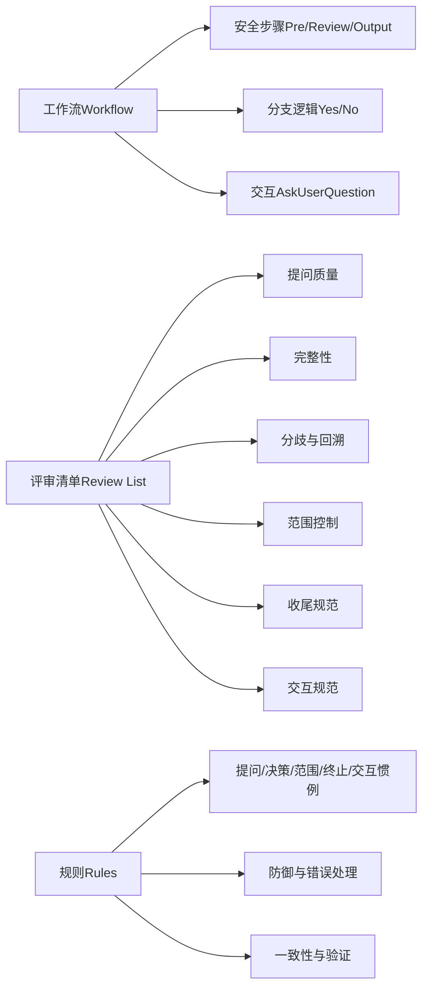

# grill-me 设计评审

<cite>
**本文引用的文件**
- [SKILL.md](file://skills/grill-me/SKILL.md)
- [SKILL.md（精简版）](file://skills/grill-me-lite/SKILL.md)
- [SKILL.md（文档驱动版本）](file://inbox/skills/grill-with-docs/SKILL.md)
- [CONTEXT.md 格式](file://inbox/skills/grill-with-docs/CONTEXT-FORMAT.md)
- [ADR 格式](file://inbox/skills/grill-with-docs/ADR-FORMAT.md)
- [模板 SKILL.md](file://skills/skill-evolve/template.md)
- [工作流写作标准](file://skills/skill-evolve/references/workflow-standard.md)
- [规则写作标准](file://skills/skill-evolve/references/rules-standard.md)
</cite>

## 目录
1. [简介](#简介)
2. [项目结构](#项目结构)
3. [核心组件](#核心组件)
4. [架构总览](#架构总览)
5. [详细组件分析](#详细组件分析)
6. [依赖分析](#依赖分析)
7. [性能考量](#性能考量)
8. [故障排查指南](#故障排查指南)
9. [结论](#结论)
10. [附录](#附录)

## 简介
本文件面向“grill-me 设计评审”技能，系统化阐述其工作流、评审规则、交互约定与质量保障机制。该技能的目标是持续质疑用户的计划或设计方案，穷尽决策树的每个分支直至达成共识；在过程中，优先验证可由代码库直接回答的问题，采用 AskUserQuestion 工具进行结构化交互，确保每次仅提出一个问题，且每个问题均提供推荐答案。评审完成后，依据“评审清单”进行自检，确保流程符合既定规则与质量标准。

## 项目结构
围绕 grill-me 的相关文件主要分布在 skills 与 inbox/skills 下，其中：
- skills/grill-me：完整版设计评审技能定义
- skills/grill-me-lite：精简版（保留核心行为）
- inbox/skills/grill-with-docs：文档驱动的评审版本，强调术语与 ADR 更新
- 相关标准与模板：工作流写作标准、规则写作标准、模板 SKILL.md

图表来源
- [SKILL.md](file://skills/grill-me/SKILL.md)
- [SKILL.md（精简版）](file://skills/grill-me-lite/SKILL.md)
- [SKILL.md（文档驱动版本）](file://inbox/skills/grill-with-docs/SKILL.md)
- [CONTEXT.md 格式](file://inbox/skills/grill-with-docs/CONTEXT-FORMAT.md)
- [ADR 格式](file://inbox/skills/grill-with-docs/ADR-FORMAT.md)
- [模板 SKILL.md](file://skills/skill-evolve/template.md)
- [工作流写作标准](file://skills/skill-evolve/references/workflow-standard.md)
- [规则写作标准](file://skills/skill-evolve/references/rules-standard.md)

章节来源
- [SKILL.md](file://skills/grill-me/SKILL.md)
- [SKILL.md（精简版）](file://skills/grill-me-lite/SKILL.md)
- [SKILL.md（文档驱动版本）](file://inbox/skills/grill-with-docs/SKILL.md)

## 核心组件
- 工作流（Workflow）：包含预飞行检查、理解计划、开始评审、范围检查、回溯检查、遍历检查、评审检查、输出结果等步骤，严格遵循“安全步骤”（Pre-check、Review Check、Output）。
- 评审规则（Rules）：涵盖提问惯例、决策惯例、分歧处理、回溯惯例、范围惯例、终止惯例、交互惯例与自一致性惯例。
- 评审清单（Review List）：用于评审检查阶段的质量核验项，覆盖提问质量、完整性、分歧与回溯处理、范围控制、收尾与交互规范等维度。
- 交互工具：统一使用 AskUserQuestion 进行结构化交互，每调用不超过 4 个选项，确保用户决策可追踪、可复现。

章节来源
- [SKILL.md](file://skills/grill-me/SKILL.md)
- [工作流写作标准](file://skills/skill-evolve/references/workflow-standard.md)
- [规则写作标准](file://skills/skill-evolve/references/rules-standard.md)

## 架构总览
grill-me 的评审流程以“决策树分支”为核心，按优先级穷举每个分支，确保：
- 可由代码库验证的问题优先验证，减少用户负担；
- 每次仅提一个问题，提供推荐答案；
- 当出现分歧时，记录并动态生成备选项，推动共识；
- 若发现与先前决策冲突，必须回溯相关分支重新协商；
- 范围控制确保评审聚焦于直接影响计划可行性的决策层面；
- 评审清单作为质量门禁，贯穿执行全过程。

图表来源
- [SKILL.md](file://skills/grill-me/SKILL.md)
- [工作流写作标准](file://skills/skill-evolve/references/workflow-standard.md)

## 详细组件分析

### 工作流详解
- 预飞行检查（Pre-check）
  - 目标：确认用户已有计划/提案；若无，通过 AskUserQuestion 提供“自行描述”或“AI引导生成”两种路径，完成后回到检查点。
- 理解计划（Understand Plan）
  - 目标：识别高风险、高依赖的决策分支作为起点，确保后续评审聚焦关键路径。
- 开始评审（Start Grilling）
  - 判断当前问题是否可由代码库验证：
    - 是：直接验证，随后继续流程；
    - 否：通过 AskUserQuestion 提供推荐答案与选项，每次仅一个问题。
  - 共识判断：若达成共识进入下一步；否则记录分歧并继续提问，避免卡死。
- 范围检查（Scope Check）
  - 判断是否涉及基础设施/底层技术选择且不影响计划可行性：允许继续深入或跳过当前分支。
  - 判断是否偏离核心目标超过两层依赖：提醒用户是否继续深入或回归主线。
- 回溯检查（Backtrack Check）
  - 若发现与先前决策冲突：回溯相关分支并重新协商。
  - 若在回溯中再次遇到此前记录的分歧：升级为阻塞项，输出摘要并建议另行讨论，终止流程。
- 遍历检查（Traversal Check）
  - 若所有分支均已评审完毕，进入评审检查；否则返回“开始评审”，选择下一个分支。
- 评审检查（Review Check）
  - 对照评审清单逐项核验，任一项未通过即终止流程；全部通过则进入输出阶段。
- 输出结果（Output）
  - 若达成共识：输出最终决策摘要；
  - 若用户主动终止：输出已达成共识与未决分歧摘要。

图表来源
- [SKILL.md](file://skills/grill-me/SKILL.md)

章节来源
- [SKILL.md](file://skills/grill-me/SKILL.md)
- [工作流写作标准](file://skills/skill-evolve/references/workflow-standard.md)

### 评审规则与交互约定
- 提问惯例
  - 每次仅一个问题，避免信息过载；
  - 每个问题必须提供推荐答案。
- 决策惯例
  - 可由代码库验证的问题直接验证，无需询问用户；
  - 必须遍历所有决策树分支，不得擅自做决定，需获得用户同意。
- 分歧处理
  - 用户不同意推荐答案时，询问具体原因并提供替代选项；
  - 若仍无法达成共识，记录分歧并继续后续提问，避免停滞。
- 回溯惯例
  - 发现与先前决策冲突时，必须回溯相关分支并重新协商，直至各分支逻辑一致；
  - 若在回溯中再次遇到此前记录的分歧，升级为阻塞项，输出摘要并建议另行讨论，避免无限循环。
- 范围惯例
  - 评审范围应限制在用户计划的直接决策层面；除非理由直接影响计划可行性，否则不质疑基础设施/底层技术选择；
  - 若偏离核心目标超过两层依赖，提醒用户是否继续深入。
- 终止惯例
  - 达成共识后停止提问，输出最终决策摘要；
  - 用户主动终止时，输出已达成共识与未决分歧摘要。
- 交互惯例
  - 所有用户决策交互必须使用 AskUserQuestion 工具；禁止使用纯文本跟进；
  - 每次 AskUserQuestion 传递的问题与选项必须结构化，且不超过 4 个选项。
- 自一致性惯例
  - 评审清单的检查项必须覆盖规则中的所有约束，确保规则与清单一一对应，无遗漏。

章节来源
- [SKILL.md](file://skills/grill-me/SKILL.md)
- [规则写作标准](file://skills/skill-evolve/references/rules-standard.md)

### 评审清单与质量核验
评审清单分为以下维度，用于评审检查阶段逐项核验：
- 提问质量检查
  - 是否每次仅问一个问题，避免“轰炸式”提问；
  - 每个问题是否提供推荐答案。
- 完整性检查
  - 可由代码库验证的问题是否已验证而非直接询问；
  - 是否遍历所有决策树分支，无遗漏；
  - 是否未擅自做决定，每个决策均获得用户同意；
  - 是否发现并回溯决策冲突。
- 分歧与回溯检查
  - 用户不同意时是否询问原因并提供替代选项；
  - 无法达成共识时是否记录分歧并继续后续提问；
  - 回溯中再次遇到此前分歧时是否升级为阻塞项并建议另行讨论。
- 范围检查
  - 是否未对基础设施/底层技术选择进行无关质疑（除非直接影响计划可行性）；
  - 偏离核心目标超过两层依赖时是否提醒用户是否继续深入。
- 收尾检查
  - 达成共识后是否输出最终决策摘要；
  - 用户主动终止时是否输出已达成共识与未决分歧摘要。
- 交互规范检查
  - 是否所有用户决策交互均使用 AskUserQuestion；
  - 自一致性：评审清单检查项与规则一一对应，无遗漏。

章节来源
- [SKILL.md](file://skills/grill-me/SKILL.md)

### 文档驱动评审（grill-with-docs）
该版本强调在评审过程中：
- 对照现有领域模型与术语表进行挑战，澄清模糊或冲突的术语；
- 使用具体场景压力测试领域关系；
- 将术语确定与 ADR 决策即时更新至 CONTEXT.md 与 docs/adr/；
- 仅在“难以撤销、缺乏上下文会令人困惑、是真实权衡的结果”三条件同时满足时才创建 ADR。

图表来源
- [SKILL.md（文档驱动版本）](file://inbox/skills/grill-with-docs/SKILL.md)
- [CONTEXT.md 格式](file://inbox/skills/grill-with-docs/CONTEXT-FORMAT.md)
- [ADR 格式](file://inbox/skills/grill-with-docs/ADR-FORMAT.md)

章节来源
- [SKILL.md（文档驱动版本）](file://inbox/skills/grill-with-docs/SKILL.md)
- [CONTEXT.md 格式](file://inbox/skills/grill-with-docs/CONTEXT-FORMAT.md)
- [ADR 格式](file://inbox/skills/grill-with-docs/ADR-FORMAT.md)

### 对话交互示例与评审检查示例
- 对话交互示例
  - 展示了使用 AskUserQuestion 的结构化交互：AI 提供推荐答案与选项，用户同意或提供替代，AI 记录决策并推进评审。
- 评审检查示例
  - 展示评审清单逐项核验过程与失败项提示，若任一检查未通过则终止流程并建议修复后重试。

章节来源
- [SKILL.md](file://skills/grill-me/SKILL.md)

## 依赖分析
- 工作流与评审清单的固定结构
  - 遵循“安全步骤”（Pre-check、Review Check、Output），确保环境校验、结果核验与总结输出的完整性。
- 规则与评审清单的职责分离
  - 规则约束执行行为（过程），评审清单验证输出质量（结果），二者在职责上分离，避免重复与遗漏。
- 交互工具的统一约束
  - 所有用户决策交互必须使用 AskUserQuestion，保证可追踪性与一致性。

图表来源
- [工作流写作标准](file://skills/skill-evolve/references/workflow-standard.md)
- [规则写作标准](file://skills/skill-evolve/references/rules-standard.md)
- [SKILL.md](file://skills/grill-me/SKILL.md)

章节来源
- [工作流写作标准](file://skills/skill-evolve/references/workflow-standard.md)
- [规则写作标准](file://skills/skill-evolve/references/rules-standard.md)
- [SKILL.md](file://skills/grill-me/SKILL.md)

## 性能考量
- 代码库验证优先：对可验证问题直接验证，减少用户等待与重复交互。
- 逐步推进与分支优先级：优先处理高风险/高依赖分支，缩短达成共识的时间。
- 交互密度控制：每次 AskUserQuestion 最多 4 个选项，降低认知负荷，提升决策效率。
- 评审清单快速定位问题：通过清单逐项核验，快速识别流程缺陷并终止，避免无效迭代。

## 故障排查指南
- 常见问题
  - 未使用 AskUserQuestion 进行交互：违反交互惯例，评审检查将失败。
  - 一次提出多个问题：违反提问惯例，评审检查将失败。
  - 未提供推荐答案：违反提问惯例，评审检查将失败。
  - 自行做决定或跳过分支：违反决策惯例，评审检查将失败。
  - 未回溯冲突或再次遇到分歧未升级：违反回溯惯例，评审检查将失败。
  - 偏离核心目标超过两层依赖未提醒：违反范围惯例，评审检查将失败。
- 处理建议
  - 修正交互方式：统一使用 AskUserQuestion 并限制选项数量；
  - 优化提问策略：每次仅一个问题，提供推荐答案；
  - 补充验证：对可验证问题优先验证；
  - 完善分支遍历：确保所有分支均被评审；
  - 回溯与升级：发现冲突及时回溯，再次遇到分歧时升级阻塞并建议另行讨论；
  - 范围控制：聚焦直接影响计划可行性的决策层面。

章节来源
- [SKILL.md](file://skills/grill-me/SKILL.md)
- [评审检查示例](file://skills/grill-me/SKILL.md)

## 结论
grill-me 设计评审技能通过严谨的工作流、明确的评审规则与严格的评审清单，确保评审过程可控、可追溯、可复盘。其核心在于：
- 以“决策树分支”为纲，穷尽每个分支；
- 以“AskUserQuestion”为器，结构化交互；
- 以“评审清单”为准绳，全流程质量把关；
- 以“回溯与升级”为保障，避免无限循环与阻塞。

## 附录

### 最佳实践指南
- 准备阶段
  - 明确评审主题与范围，准备相关背景材料；
  - 确保代码库可访问，便于直接验证技术问题。
- 评审过程
  - 严格遵守“一次一个问题”的提问惯例；
  - 每个问题提供推荐答案与替代选项；
  - 对可验证问题优先验证，减少用户负担；
  - 发生分歧时，记录原因并动态生成替代选项；
  - 发现冲突立即回溯相关分支，直至逻辑一致；
  - 控制范围，聚焦直接影响计划可行性的决策。
- 评审收尾
  - 达成共识后输出最终决策摘要；
  - 主动终止时输出已达成共识与未决分歧摘要；
  - 使用评审清单逐项核验，确保流程符合规则与清单要求。

### 评审清单对照表（摘录）
- 提问质量检查：仅一次一个问题；每个问题提供推荐答案
- 完整性检查：可验证问题已验证；遍历所有分支；未擅自做决定；发现并回溯冲突
- 分歧与回溯检查：用户不同意时询问原因并提供替代；无法达成共识时记录分歧并继续；回溯再次遇到分歧时升级阻塞
- 范围检查：未对基础设施/底层技术选择进行无关质疑；偏离核心目标超过两层依赖时提醒是否继续深入
- 收尾检查：达成共识后输出最终决策摘要；主动终止时输出已达成共识与未决分歧摘要
- 交互规范检查：所有用户决策交互使用 AskUserQuestion；评审清单与规则一一对应

章节来源
- [SKILL.md](file://skills/grill-me/SKILL.md)