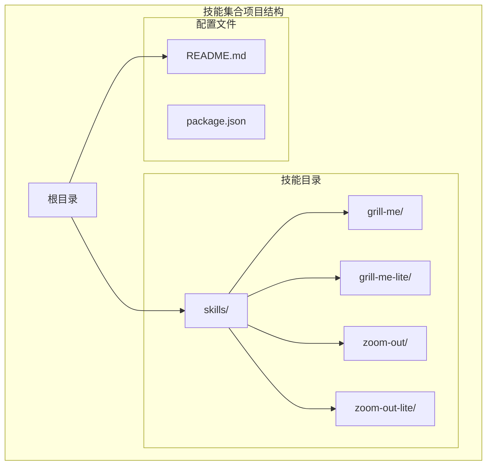
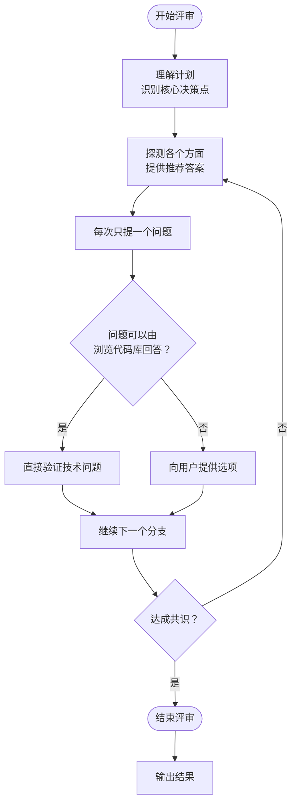
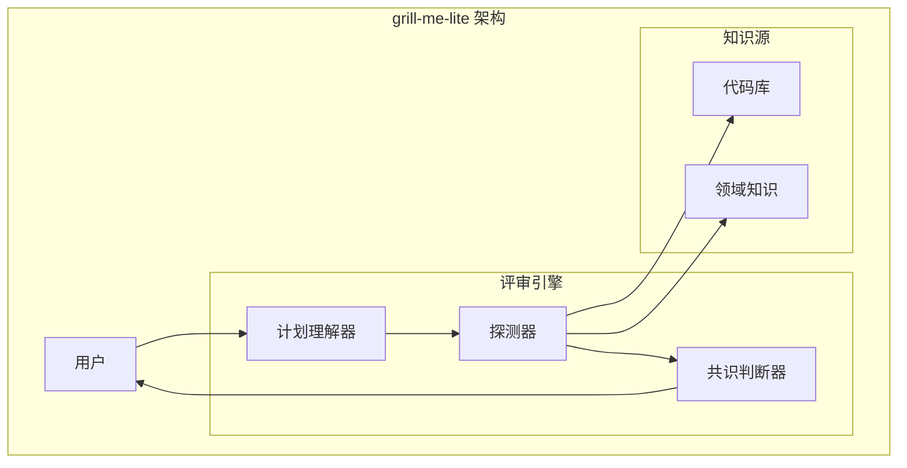
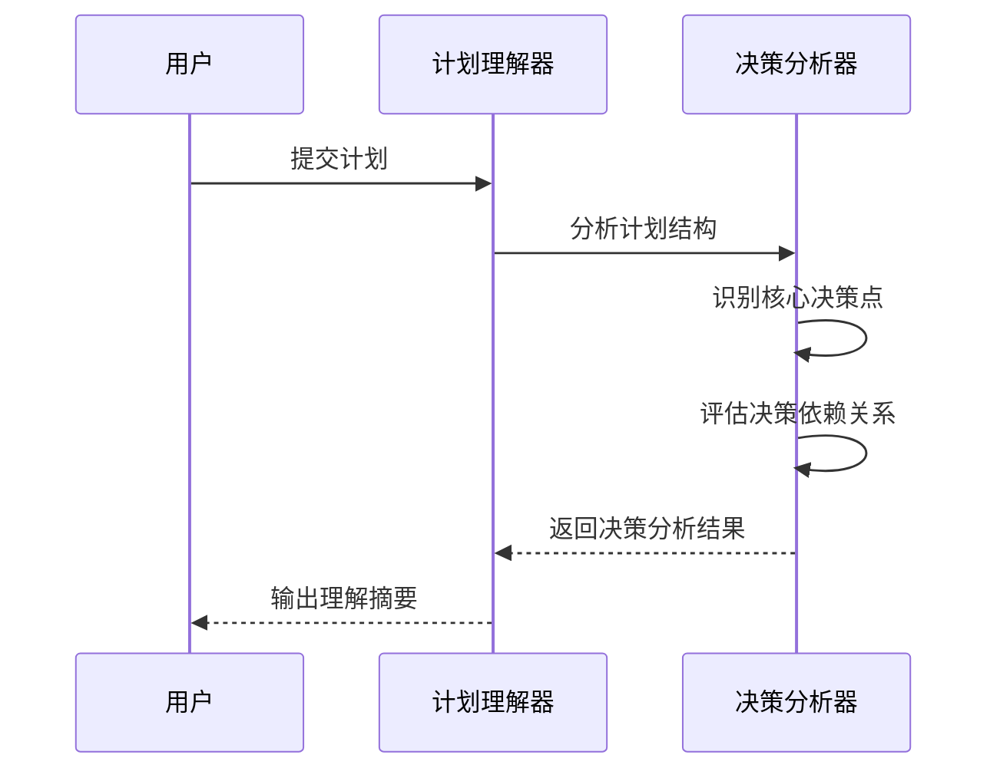
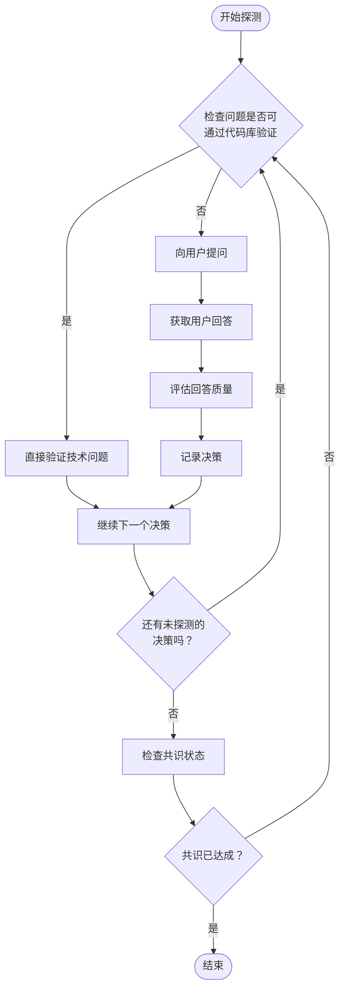
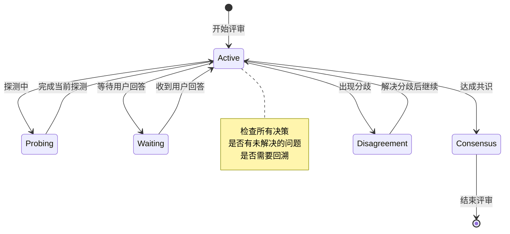
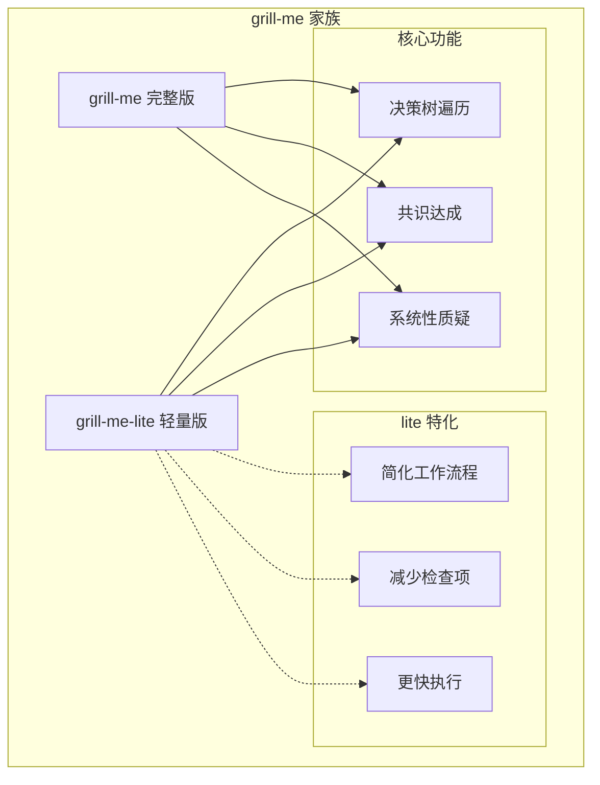
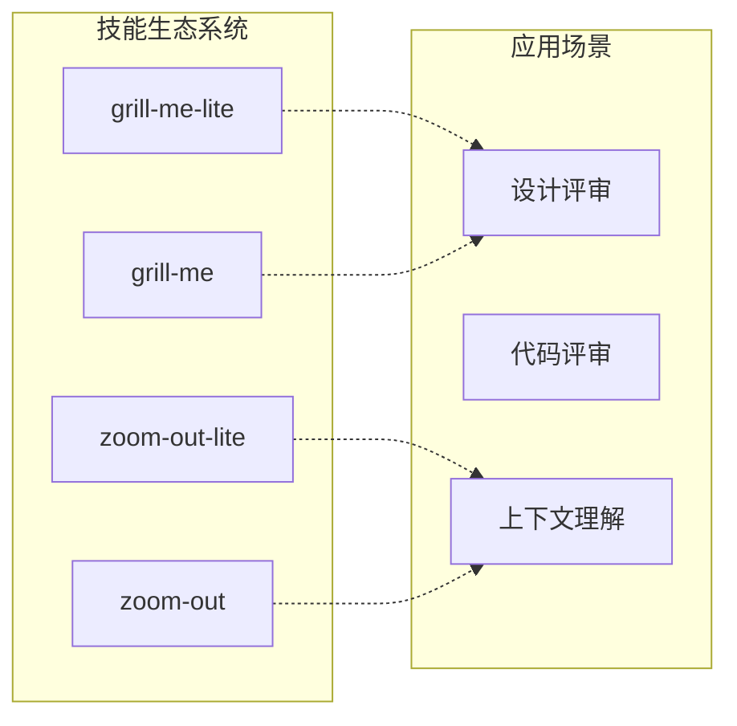

# grill-me-lite 轻量级评审

<cite>
**本文档引用的文件**
- [grill-me-lite/SKILL.md](file://skills/grill-me-lite/SKILL.md)
- [grill-me/SKILL.md](file://skills/grill-me/SKILL.md)
- [README.md](file://README.md)
- [zoom-out-lite/SKILL.md](file://skills/zoom-out-lite/SKILL.md)
- [zoom-out/SKILL.md](file://skills/zoom-out/SKILL.md)
</cite>

## 目录
1. [简介](#简介)
2. [项目结构](#项目结构)
3. [核心组件](#核心组件)
4. [架构概览](#架构概览)
5. [详细组件分析](#详细组件分析)
6. [依赖关系分析](#依赖关系分析)
7. [性能考虑](#性能考虑)
8. [故障排除指南](#故障排除指南)
9. [结论](#结论)
10. [附录](#附录)

## 简介

grill-me-lite 是 grill-me 的轻量级版本，专为快速压力测试计划和设计而设计。它继承了完整版 grill-me 的核心理念——持续追问和挑战用户的计划或设计，但通过简化工作流程和减少复杂性，使其更适合快速评审场景。

grill-me-lite 的设计理念是"快速压力测试"，能够在较短时间内对计划进行全面审视，重点关注关键决策点和潜在风险。与完整版相比，它减少了流程步骤，简化了交互模式，但仍保持了核心的评审原则：系统性挑战、逐步深入、确保共识。

## 项目结构

该项目采用模块化技能集合的组织方式，每个技能都是独立的目录，包含完整的技能定义文件。grill-me-lite 作为其中一个技能模块，位于 skills/grill-me-lite 目录下。

**图表来源**
- [README.md:1-113](file://README.md#L1-L113)
- [grill-me-lite/SKILL.md:1-17](file://skills/grill-me-lite/SKILL.md#L1-L17)

**章节来源**
- [README.md:1-113](file://README.md#L1-L113)
- [grill-me-lite/SKILL.md:1-17](file://skills/grill-me-lite/SKILL.md#L1-L17)

## 核心组件

### grill-me-lite 技能定义

grill-me-lite 作为一个独立的技能模块，具有以下核心特征：

- **名称**: grill-me-lite
- **描述**: 连续探测用户的计划或设计，直到达成共识，遍历决策树的每个分支
- **使用场景**: 当用户想要压力测试一个计划、让设计经受严格审查，或提到"grill me"时使用

### 核心功能特性

1. **持续探测**: 对计划的每个方面进行连续探测
2. **决策树遍历**: 深入探索决策树的每个分支
3. **依赖关系解决**: 逐个解决决策之间的依赖关系
4. **推荐答案提供**: 对每个问题提供推荐答案
5. **单次提问**: 每次只提出一个问题

### 工作流程简化

与完整版 grill-me 相比，grill-me-lite 在工作流程上进行了显著简化：

**图表来源**
- [grill-me-lite/SKILL.md:6-17](file://skills/grill-me-lite/SKILL.md#L6-L17)

**章节来源**
- [grill-me-lite/SKILL.md:1-17](file://skills/grill-me-lite/SKILL.md#L1-L17)

## 架构概览

grill-me-lite 采用简洁的评审架构，专注于核心评审功能：

**图表来源**
- [grill-me-lite/SKILL.md:6-17](file://skills/grill-me-lite/SKILL.md#L6-L17)

### 组件关系

grill-me-lite 的核心组件包括：

1. **计划理解器**: 识别和分析用户提供的计划中的核心决策点
2. **探测器**: 系统性地对计划的各个方面进行探测和质疑
3. **共识判断器**: 判断是否达到共识状态
4. **代码库接口**: 提供代码库浏览能力以验证技术问题

## 详细组件分析

### 计划理解组件

计划理解组件负责分析用户提供的计划，识别其中的关键决策点和依赖关系：

**图表来源**
- [grill-me-lite/SKILL.md:6-17](file://skills/grill-me-lite/SKILL.md#L6-L17)

### 探测执行组件

探测执行组件负责系统性地对计划进行压力测试：

**图表来源**
- [grill-me-lite/SKILL.md:6-17](file://skills/grill-me-lite/SKILL.md#L6-L17)

### 共识判断组件

共识判断组件负责监控评审过程并确定何时结束：

**图表来源**
- [grill-me-lite/SKILL.md:6-17](file://skills/grill-me-lite/SKILL.md#L6-L17)

**章节来源**
- [grill-me-lite/SKILL.md:6-17](file://skills/grill-me-lite/SKILL.md#L6-L17)

## 依赖关系分析

### 与完整版 grill-me 的关系

grill-me-lite 与完整版 grill-me 存在密切的继承关系：

**图表来源**
- [grill-me/SKILL.md:8-112](file://skills/grill-me/SKILL.md#L8-L112)
- [grill-me-lite/SKILL.md:1-17](file://skills/grill-me-lite/SKILL.md#L1-L17)

### 与其他技能的关系

grill-me-lite 与项目中的其他技能存在互补关系：

**图表来源**
- [README.md:12-20](file://README.md#L12-L20)

**章节来源**
- [README.md:12-20](file://README.md#L12-L20)

## 性能考虑

### 执行效率优化

grill-me-lite 在性能方面的优化主要体现在：

1. **简化的工作流程**: 减少了不必要的检查步骤
2. **快速决策机制**: 直接验证可验证的技术问题
3. **最小化交互**: 每次只提出一个问题，避免信息过载
4. **智能资源利用**: 优先处理高风险和高依赖性的决策分支

### 资源消耗控制

- **内存使用**: 由于流程简化，内存占用相对较低
- **计算复杂度**: 时间复杂度主要取决于决策树的规模和深度
- **网络请求**: 最大化利用本地代码库浏览能力，减少外部依赖

## 故障排除指南

### 常见问题及解决方案

#### 问题1: 评审过程卡住
**症状**: 评审无法继续推进
**原因**: 用户未对当前问题做出明确回答
**解决方案**: 
- 使用更清晰的问题表述
- 提供有限的选项而非开放式问题
- 必要时提供默认推荐答案

#### 问题2: 技术问题无法验证
**症状**: 需要验证的技术问题无法通过代码库回答
**原因**: 代码库不完整或问题超出代码范围
**解决方案**:
- 明确告知用户需要提供相关信息
- 转换为开放式讨论模式
- 调整问题范围至可验证领域

#### 问题3: 共识难以达成
**症状**: 多个决策点出现持续分歧
**原因**: 决策过于复杂或存在根本性分歧
**解决方案**:
- 将复杂决策分解为更小的子决策
- 寻找折中方案或替代路径
- 建议暂停评审，后续再讨论

**章节来源**
- [grill-me-lite/SKILL.md:6-17](file://skills/grill-me-lite/SKILL.md#L6-L17)

## 结论

grill-me-lite 作为 grill-me 的轻量级版本，在保持核心评审理念的同时，显著简化了工作流程和交互模式。它特别适合以下场景：

- **快速压力测试**: 需要在短时间内对计划进行全面审视
- **初步评审**: 作为完整评审流程的预筛选阶段
- **概念验证**: 验证计划的基本可行性和关键假设
- **团队协作**: 促进团队成员间的快速讨论和共识形成

grill-me-lite 的价值在于它能够在保证评审质量的前提下，大幅提高评审效率，降低使用门槛，使更多的团队能够轻松采用系统性的评审方法。

## 附录

### 使用示例

#### 示例1: 基本计划评审
用户可以这样开始评审：
- "Grill this plan"
- "Help me stress-test this design"
- "What's wrong with this architecture?"

#### 示例2: 技术方案评审
对于具体的技术方案，用户可以：
- 提供完整的架构设计
- 指定关注的重点领域
- 要求重点关注的风险点

### 最佳实践建议

1. **明确评审目标**: 在开始前明确评审的具体目标和范围
2. **准备充分材料**: 确保相关的背景资料和技术文档可用
3. **保持开放态度**: 积极接受不同的观点和建议
4. **及时总结反馈**: 在评审过程中及时记录重要发现
5. **后续跟进**: 对评审中发现的问题制定改进计划

### 适用场景对比

| 场景类型 | grill-me-lite | grill-me | 选择建议 |
|----------|---------------|----------|----------|
| 快速概念验证 | ✅ 非常合适 | ❌ 过于复杂 | 选择 lite |
| 详细架构评审 | ⚠️ 可以尝试 | ✅ 最佳选择 | 根据时间决定 |
| 团队快速讨论 | ✅ 非常合适 | ⚠️ 可能过长 | 选择 lite |
| 严格合规评审 | ❌ 不适用 | ✅ 必须使用 | 选择完整版 |

**章节来源**
- [grill-me-lite/SKILL.md:12-17](file://skills/grill-me-lite/SKILL.md#L12-L17)
- [grill-me/SKILL.md:113-242](file://skills/grill-me/SKILL.md#L113-L242)