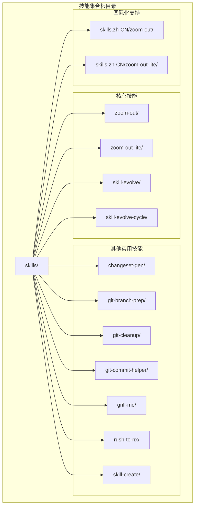
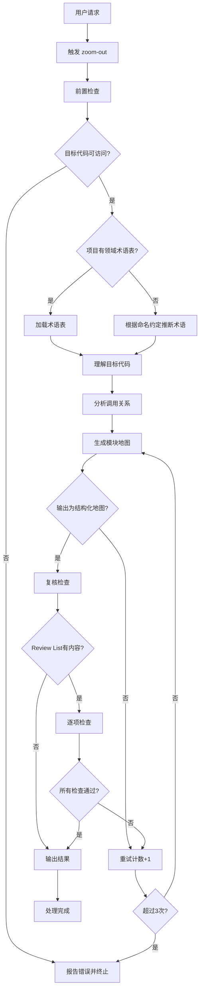
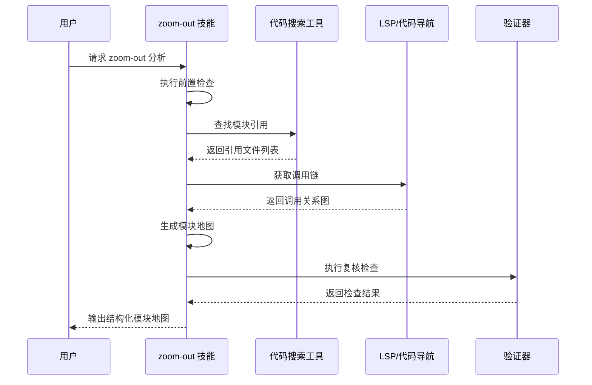
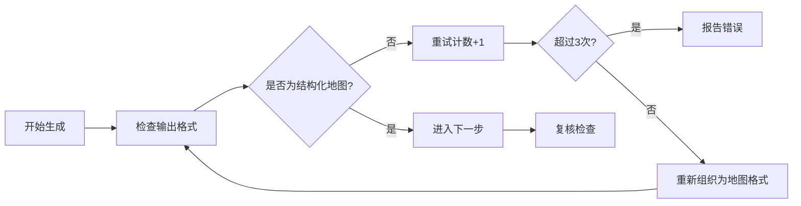
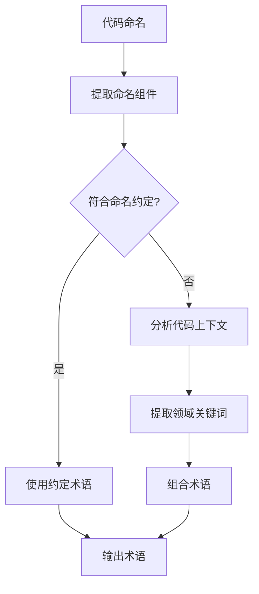
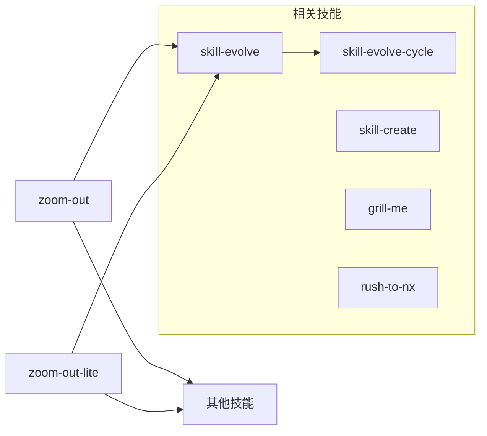
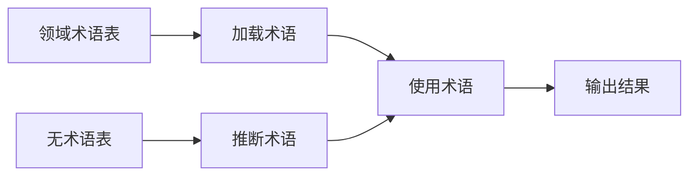
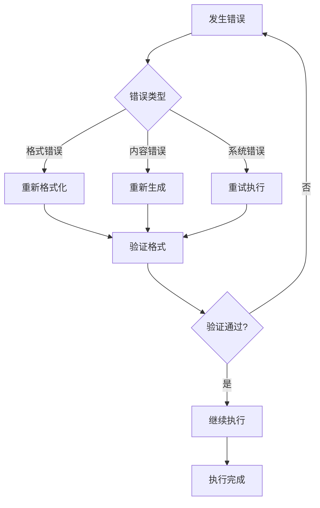

# zoom-out 上下文分析

<cite>
**本文档引用的文件**
- [SKILL.md](file://skills/zoom-out/SKILL.md)
- [SKILL.md](file://skills/zoom-out-lite/SKILL.md)
- [README.md](file://README.md)
- [README.zh-CN.md](file://README.zh-CN.md)
- [SKILL.md](file://skills/skill-evolve/SKILL.md)
- [SKILL.md](file://skills/skill-evolve-cycle/SKILL.md)
</cite>

## 目录
1. [简介](#简介)
2. [项目结构](#项目结构)
3. [核心组件](#核心组件)
4. [架构概览](#架构概览)
5. [详细组件分析](#详细组件分析)
6. [依赖关系分析](#依赖关系分析)
7. [性能考虑](#性能考虑)
8. [故障排除指南](#故障排除指南)
9. [结论](#结论)
10. [附录](#附录)

## 简介

zoom-out 是一个专门设计的代码上下文分析技能，旨在帮助开发者从宏观角度理解代码库的整体结构和上下文关系。当开发者对某个代码片段不熟悉或需要了解其在整个架构中的位置时，zoom-out 能够提供更高层次的视角，生成相关模块和调用者的全局地图。

该技能的核心价值在于：
- **抽象能力**：将复杂的代码细节抽象到更高层次，帮助理解整体架构
- **关系可视化**：清晰展示模块间的调用关系和依赖关系
- **术语一致性**：使用项目既有的领域术语，确保输出的专业性和准确性
- **结构化输出**：提供标准化的模块地图格式，便于理解和分享

## 项目结构

zoom-out 技能在技能集合中的组织结构如下：



**图表来源**
- [README.md:1-113](file://README.md#L1-L113)
- [README.zh-CN.md:1-113](file://README.zh-CN.md#L1-L113)

**章节来源**
- [README.md:1-113](file://README.md#L1-L113)
- [README.zh-CN.md:1-113](file://README.zh-CN.md#L1-L113)

## 核心组件

### 技能配置文件

每个 zoom-out 技能都包含一个标准的 SKILL.md 配置文件，定义了技能的行为、规则和工作流程。

#### 主要配置要素

| 配置项 | 值 | 说明 |
|--------|-----|------|
| 名称 | zoom-out | 技能标识符 |
| 描述 | Let the agent zoom out to provide broader context or a higher-level perspective | 技能功能描述 |
| 禁用模型调用 | true | 技能不需要大语言模型参与 |
| 类型 | 上下文分析技能 | 技能分类 |

### 技能变体对比

| 特性 | zoom-out | zoom-out-lite |
|------|----------|---------------|
| 功能完整性 | 完整的工作流程和验证机制 | 精简版本，专注于核心功能 |
| 输出复杂度 | 详细的模块地图和调用关系 | 基础的上下文信息 |
| 验证机制 | 完整的审查列表和重试机制 | 简化的验证流程 |
| 适用场景 | 复杂代码库的深度分析 | 快速上下文理解 |

**章节来源**
- [SKILL.md:1-190](file://skills/zoom-out/SKILL.md#L1-L190)
- [SKILL.md:1-12](file://skills/zoom-out-lite/SKILL.md#L1-L12)

## 架构概览

### 整体架构设计



**图表来源**
- [SKILL.md:25-65](file://skills/zoom-out/SKILL.md#L25-L65)

### 数据流架构



**图表来源**
- [SKILL.md:38-41](file://skills/zoom-out/SKILL.md#L38-L41)
- [SKILL.md:51-61](file://skills/zoom-out/SKILL.md#L51-L61)

## 详细组件分析

### 工作流程详解

#### 步骤1：前置检查

前置检查确保 zoom-out 技能能够正常执行，主要包含两个关键检查：

1. **目标代码可访问性检查**
   - 验证用户指定的代码片段是否存在且可读
   - 确保代码库具有可浏览的结构
   - 提供明确的错误反馈

2. **领域术语表检查**
   - 检查项目是否包含领域术语表或命名约定
   - 如果存在，加载术语表用于后续输出
   - 如果不存在，根据代码命名惯例推断术语

#### 步骤2：目标代码理解

这一阶段的核心是识别目标代码的模块归属和架构角色：

- **模块识别**：确定目标代码属于哪个功能模块
- **架构角色**：分析代码在整体架构中的层次（基础设施/领域/应用）
- **上下文分析**：理解代码的功能职责和业务含义

#### 步骤3：调用关系分析

调用关系分析是 zoom-out 的核心功能，包含三个层面：

1. **上游调用者识别**
   - 使用代码搜索工具查找引用该模块的文件
   - 识别直接和间接的调用者
   - 记录调用者的位置和类型

2. **下游依赖分析**
   - 分析模块的内部依赖关系
   - 识别外部库和框架依赖
   - 标注依赖的层次结构

3. **调用链可视化**
   - 展示完整的调用关系图
   - 标注模块的分层位置
   - 提供结构化的依赖信息

#### 步骤4：模块地图生成

模块地图生成采用迭代优化的方式，最多允许3次重试：



**图表来源**
- [SKILL.md:43-49](file://skills/zoom-out/SKILL.md#L43-L49)

#### 步骤5：复核检查

复核检查确保输出质量符合预设标准：

**内容完整性检查**
- 目标代码的模块身份和架构角色
- 上游调用者和下游依赖的完整列表
- 调用者和依赖的路径/位置信息

**格式规范检查**
- 使用项目领域术语，避免引入新术语
- 当无术语表时，术语来源于代码命名惯例
- 输出为结构化地图形式，避免长篇描述
- 抽象层级正确：仅向上抽象一层

#### 步骤6：结果输出

最终输出采用标准化的表格格式：

| 维度 | 说明 |
|------|------|
| 目标代码 | 具体的函数或类名 |
| 所属模块 | 模块名称和角色 |
| 上游调用者 | 调用者数量和列表 |
| 下游依赖 | 依赖数量和列表 |
| 抽象层级 | 向上抽象一层 |
| 输出格式 | 结构化模块地图 |

**章节来源**
- [SKILL.md:25-65](file://skills/zoom-out/SKILL.md#L25-L65)
- [SKILL.md:161-174](file://skills/zoom-out/SKILL.md#L161-L174)

### 算法实现模式

#### 术语推断算法

当项目没有领域术语表时，zoom-out 使用以下算法推断术语：



**图表来源**
- [SKILL.md:32-33](file://skills/zoom-out/SKILL.md#L32-L33)

#### 调用关系识别算法

调用关系识别采用多源数据融合策略：

1. **静态分析**：使用代码搜索工具查找直接引用
2. **动态分析**：利用 LSP 和代码导航功能获取调用链
3. **层次标注**：自动标记模块的架构层次

### 输出格式规范

#### 结构化模块地图

输出采用 Markdown 表格格式，确保信息的结构化和可读性：

```markdown
| 维度 | 说明 |
|------|------|
| 目标代码 | UserAuthService.authenticate() |
| 所属模块 | auth（认证模块） |
| 上游调用者 | 3 个（LoginController、ApiGateway、SessionManager） |
| 下游依赖 | 4 个（PasswordHasher、UserRepository、TokenService、AuditLogger） |
| 抽象层级 | 向上抽象一层 |
| 输出形式 | 结构化模块地图 |
```

#### 图形化关系展示

除了表格格式，zoom-out 还支持图形化的关系展示：

```mermaid
graph TD
Caller1[LoginController<br/>web/login] --> Target[UserAuthService.authenticate()]
Caller2[ApiGateway<br/>gateway/] --> Target
Caller3[SessionManager<br/>core/session] --> Target
Target --> Dep1[PasswordHasher<br/>crypto/]
Target --> Dep2[UserRepository<br/>data/user]
Target --> Dep3[TokenService<br/>auth/token]
Target --> Dep4[AuditLogger<br/>core/logging]
```

**图表来源**
- [SKILL.md:92-107](file://skills/zoom-out/SKILL.md#L92-L107)

## 依赖关系分析

### 技能依赖关系



**图表来源**
- [README.md:1-113](file://README.md#L1-L113)

### 外部工具集成

#### 代码搜索工具集成

zoom-out 依赖多种代码搜索工具来识别调用关系：

| 工具类型 | 用途 | 集成方式 |
|----------|------|----------|
| 代码搜索 | 查找模块引用 | 直接调用 |
| LSP 服务 | 获取调用链 | 通过接口 |
| 代码导航 | 分析依赖关系 | 通过 API |

#### 术语管理集成



**图表来源**
- [SKILL.md:31-33](file://skills/zoom-out/SKILL.md#L31-L33)

**章节来源**
- [README.md:1-113](file://README.md#L1-L113)

## 性能考虑

### 时间复杂度分析

zoom-out 的时间复杂度主要取决于以下因素：

1. **代码库规模**：与代码搜索和分析的复杂度成正比
2. **调用关系复杂度**：与模块间的依赖关系数量相关
3. **重试机制**：最多3次重试，增加额外的处理时间

### 内存使用优化

- **增量处理**：逐步处理不同类型的依赖关系
- **缓存机制**：复用已解析的术语和模块信息
- **流式输出**：边分析边输出，减少内存占用

### 并发处理

对于大型代码库，可以考虑以下并发策略：

1. **并行代码搜索**：同时搜索多个模块的引用
2. **异步调用链分析**：并行分析不同模块的调用关系
3. **流水线处理**：将分析过程分解为多个独立的处理阶段

## 故障排除指南

### 常见问题及解决方案

#### 问题1：目标代码不可访问

**症状**：技能报告"目标代码不存在或不可访问"

**解决方案**：
1. 确认代码路径的正确性
2. 检查文件权限和可读性
3. 验证代码库的完整性

#### 问题2：无法生成结构化地图

**症状**：技能报告"无法生成结构化地图"

**解决方案**：
1. 检查输出格式的正确性
2. 验证术语表的完整性
3. 确认调用关系分析的准确性

#### 问题3：复核检查失败

**症状**：技能报告"复核检查未通过"

**解决方案**：
1. 检查 Review List 中的各项要求
2. 确认输出内容的完整性和准确性
3. 验证格式规范的遵守情况

### 错误恢复机制



**图表来源**
- [SKILL.md:47-49](file://skills/zoom-out/SKILL.md#L47-L49)
- [SKILL.md:58-60](file://skills/zoom-out/SKILL.md#L58-L60)

**章节来源**
- [SKILL.md:47-60](file://skills/zoom-out/SKILL.md#L47-L60)

## 结论

zoom-out 上下文分析技能为开发者提供了一个强大的工具，帮助他们从宏观角度理解代码库的整体结构和上下文关系。通过抽象化处理、关系可视化和结构化输出，该技能显著提升了代码理解的效率和准确性。

### 主要优势

1. **抽象能力**：有效避免陷入代码细节，专注于整体架构理解
2. **结构化输出**：提供标准化的模块地图，便于团队协作和知识传递
3. **质量保证**：完善的验证机制确保输出的准确性和完整性
4. **灵活性**：支持多种术语来源，适应不同的项目环境

### 应用场景

- **新成员入职**：帮助新加入团队的开发者快速理解项目结构
- **代码重构**：为重构决策提供上下文支持和影响分析
- **技术债务评估**：识别复杂度高、耦合性强的模块
- **架构演进**：支持架构升级和模块重组的规划

### 发展前景

随着代码库规模的增大和复杂性的提升，zoom-out 技能将继续演进，可能的发展方向包括：

1. **智能化分析**：结合机器学习算法识别潜在的设计模式
2. **实时更新**：支持代码库变更的实时跟踪和更新
3. **多维度分析**：扩展到性能、安全、可维护性等多个维度
4. **协作增强**：支持多人协作下的上下文共享和同步

## 附录

### 使用示例

#### 示例1：基础上下文分析

用户输入：`"我需要理解这个认证模块在整个系统中的作用"`

预期输出：
- 目标模块：认证模块
- 上游调用者：登录控制器、API网关、会话管理器
- 下游依赖：密码哈希器、用户存储、令牌服务、审计日志
- 架构角色：应用层安全控制

#### 示例2：复杂依赖关系分析

用户输入：`"请分析订单处理系统的调用关系"`

预期输出：
- 目标模块：订单处理
- 上游调用者：订单服务、支付网关、通知服务
- 下游依赖：库存管理、财务系统、物流服务
- 关系图谱：展示完整的业务流程

### 最佳实践

#### 项目准备

1. **建立领域术语表**：为项目建立统一的术语表，提升分析准确性
2. **规范命名约定**：采用一致的命名约定，便于术语推断
3. **文档化架构**：维护架构文档，为上下文分析提供参考

#### 使用建议

1. **定期执行**：将 zoom-out 分析纳入日常开发流程
2. **团队共享**：将分析结果在团队内共享，促进知识传播
3. **持续改进**：根据分析结果优化代码结构和模块划分

#### 集成建议

1. **IDE 集成**：将 zoom-out 功能集成到开发环境中
2. **CI/CD 流程**：在持续集成中加入上下文分析步骤
3. **监控告警**：建立异常关系检测和告警机制