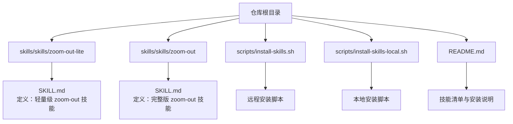
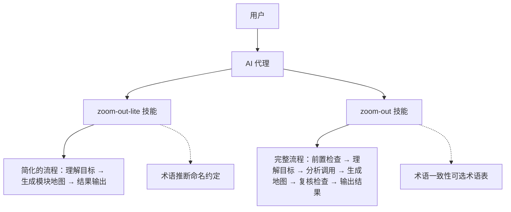
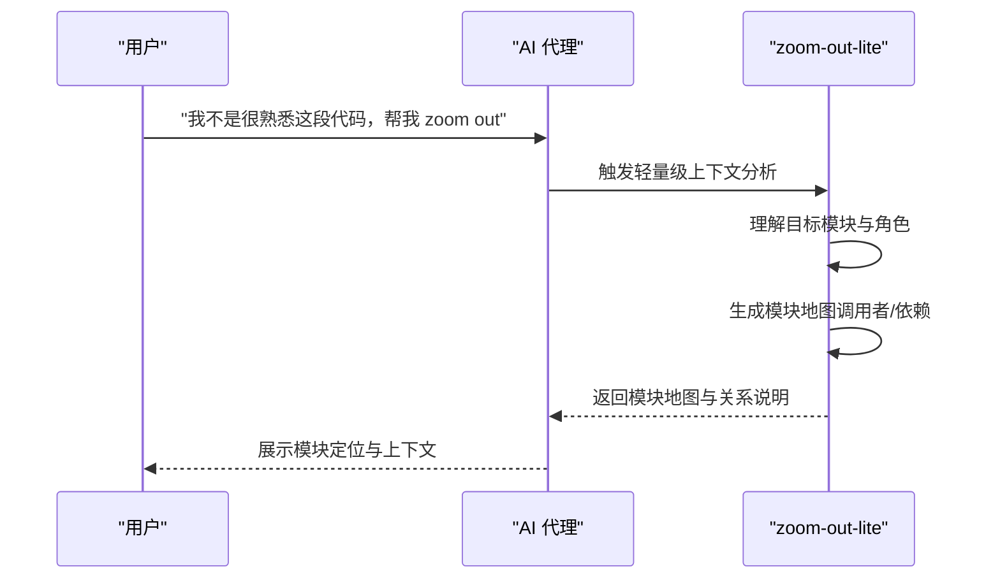
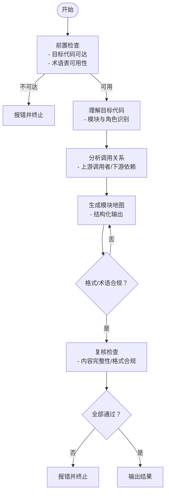
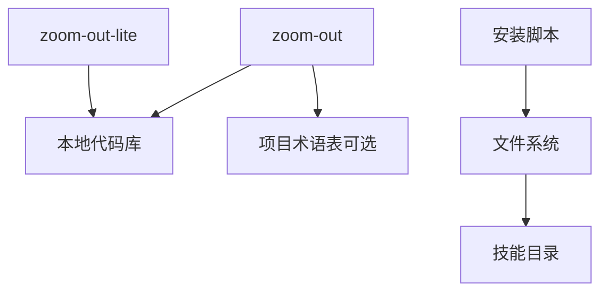

# zoom-out-lite 轻量级分析

<cite>
**本文档引用的文件**
- [zoom-out-lite/SKILL.md](file://skills/skills/zoom-out-lite/SKILL.md)
- [zoom-out/SKILL.md](file://skills/skills/zoom-out/SKILL.md)
- [README.md](file://README.md)
- [install-skills.sh](file://scripts/install-skills.sh)
- [install-skills-local.sh](file://scripts/install-skills-local.sh)
</cite>

## 目录
1. [简介](#简介)
2. [项目结构](#项目结构)
3. [核心组件](#核心组件)
4. [架构总览](#架构总览)
5. [详细组件分析](#详细组件分析)
6. [依赖分析](#依赖分析)
7. [性能考虑](#性能考虑)
8. [故障排除指南](#故障排除指南)
9. [结论](#结论)
10. [附录](#附录)

## 简介
zoom-out-lite 是 zoom-out 的轻量级版本，专注于以“向上一层抽象”的方式快速提供模块与调用关系的全景视图。它适用于用户对某段代码不熟悉、需要快速理解其在整个项目中的定位与上下文时使用。与完整版相比，lite 版在流程复杂度、校验环节与输出格式约束上进行了简化，从而具备更快的响应速度与更低的资源占用。

- 适用场景
  - 快速理解未知模块的角色与边界
  - 获取调用者与下游依赖的概览
  - 在缺乏领域术语表时，基于命名约定进行术语推断
  - 需要“先宏观后微观”的探索式分析

- 性能特点
  - 流程更短、校验更少，适合高频、即时的上下文查询
  - 不强制要求外部模型调用，减少推理开销
  - 依赖本地可浏览代码库即可运行

- 使用限制
  - 不包含完整的 Review List 与多轮重试机制
  - 输出格式偏向简洁，缺少结构化表格的严格约束
  - 术语一致性依赖项目命名约定，无内置术语表加载逻辑

## 项目结构
zoom-out-lite 与其他技能一样，采用“自描述目录 + SKILL.md”的标准结构。安装与使用可通过仓库根目录提供的安装脚本完成。

图表来源
- [README.md:7-43](file://README.md#L7-L43)
- [install-skills.sh:1-146](file://scripts/install-skills.sh#L1-L146)
- [install-skills-local.sh:1-16](file://scripts/install-skills-local.sh#L1-L16)

章节来源
- [README.md:7-43](file://README.md#L7-L43)

## 核心组件
- zoom-out-lite 技能定义
  - 名称与描述：见 [zoom-out-lite/SKILL.md:1-12](file://skills/skills/zoom-out-lite/SKILL.md#L1-L12)
  - 关键属性：禁用模型调用，强调“向上一层抽象”的上下文输出
  - 示例对话：展示如何在用户不熟悉代码时，给出模块地图与调用关系

- zoom-out 完整版技能定义
  - 名称与描述：见 [zoom-out/SKILL.md:1-190](file://skills/skills/zoom-out/SKILL.md#L1-L190)
  - 关键流程：前置检查、理解目标代码、分析调用关系、生成模块地图、复核检查、结果输出
  - 复杂度体现：包含术语一致性、格式合规性、抽象层级等多维度校验

章节来源
- [zoom-out-lite/SKILL.md:1-12](file://skills/skills/zoom-out-lite/SKILL.md#L1-L12)
- [zoom-out/SKILL.md:1-190](file://skills/skills/zoom-out/SKILL.md#L1-L190)

## 架构总览
从技能层面看，zoom-out-lite 与 zoom-out 的关系如下：

图表来源
- [zoom-out-lite/SKILL.md:1-12](file://skills/skills/zoom-out-lite/SKILL.md#L1-L12)
- [zoom-out/SKILL.md:25-65](file://skills/skills/zoom-out/SKILL.md#L25-L65)

## 详细组件分析

### 组件 A：zoom-out-lite（轻量级）
- 设计要点
  - 仅执行“向上一层抽象”的上下文输出，避免深入实现细节
  - 输出以模块地图与调用关系为主，强调“全景视图”
  - 不强制要求外部模型调用，降低推理成本

- 典型工作流（概念序列图）

- 与完整版的差异
  - lite 版省略了前置检查、复核检查与多次重试机制
  - 术语一致性依赖命名约定，不强制加载项目术语表
  - 输出格式更简洁，不强制结构化表格

章节来源
- [zoom-out-lite/SKILL.md:1-12](file://skills/skills/zoom-out-lite/SKILL.md#L1-L12)

### 组件 B：zoom-out（完整版）
- 设计要点
  - 完整的前置检查：目标代码可达性、术语表可用性
  - 明确的抽象层级：仅向上抽象一层，不深入实现细节
  - 强制的格式与术语约束：结构化地图、项目领域术语、命名约定推断
  - 多轮复核与重试：最多三次重试以确保输出质量

- 典型工作流（流程图）

图表来源
- [zoom-out/SKILL.md:25-65](file://skills/skills/zoom-out/SKILL.md#L25-L65)
- [zoom-out/SKILL.md:161-174](file://skills/skills/zoom-out/SKILL.md#L161-L174)

章节来源
- [zoom-out/SKILL.md:25-65](file://skills/skills/zoom-out/SKILL.md#L25-L65)
- [zoom-out/SKILL.md:161-174](file://skills/skills/zoom-out/SKILL.md#L161-L174)

### 组件 C：安装与使用（脚本）
- 远程安装脚本
  - 支持从 GitHub 克隆仓库并批量安装技能
  - 自动检测语言偏好（英文/中文），复制对应目录
  - 支持覆盖冲突、清理临时目录、提示重启加载

- 本地安装脚本
  - 直接使用本地仓库路径，跳过网络克隆
  - 通过参数传递仓库目录给通用安装脚本

章节来源
- [install-skills.sh:1-146](file://scripts/install-skills.sh#L1-L146)
- [install-skills-local.sh:1-16](file://scripts/install-skills-local.sh#L1-L16)
- [README.md:22-64](file://README.md#L22-L64)

## 依赖分析
- 技能依赖
  - zoom-out-lite 依赖本地可浏览代码库，无需外部术语表
  - zoom-out 依赖可选的项目术语表；若无则回退到命名约定推断

- 安装依赖
  - 安装脚本依赖 Bash 环境与系统命令（git、cp、mkdir 等）
  - 支持通过环境变量覆盖目标目录

图表来源
- [zoom-out-lite/SKILL.md:18-23](file://skills/skills/zoom-out-lite/SKILL.md#L18-L23)
- [zoom-out/SKILL.md:23-23](file://skills/skills/zoom-out/SKILL.md#L23-L23)
- [install-skills.sh:78-134](file://scripts/install-skills.sh#L78-L134)

章节来源
- [zoom-out-lite/SKILL.md:18-23](file://skills/skills/zoom-out-lite/SKILL.md#L18-L23)
- [zoom-out/SKILL.md:23-23](file://skills/skills/zoom-out/SKILL.md#L23-L23)
- [install-skills.sh:78-134](file://scripts/install-skills.sh#L78-L134)

## 性能考虑
- 执行路径
  - lite 版：流程短、校验少，适合高频、即时查询
  - 完整版：多轮校验与重试，保证输出质量但增加耗时

- 资源占用
  - lite 版不强制模型调用，减少推理开销
  - 完整版可能涉及多次重试与复核，CPU/内存占用相对更高

- 适用策略
  - 快速探索阶段优先使用 lite 版
  - 需要严谨输出与可追溯性时使用完整版

## 故障排除指南
- 目标代码不可访问
  - 现象：lite 版直接终止或输出不完整
  - 建议：确认目标文件存在于本地可浏览代码库中

- 术语不一致或格式不符
  - 现象：完整版在复核检查中失败
  - 建议：提供项目术语表或遵循命名约定；确保输出为结构化地图格式

- 安装冲突或覆盖问题
  - 现象：安装脚本提示覆盖现有技能
  - 建议：按提示确认覆盖，或手动清理目标目录后重试

章节来源
- [zoom-out-lite/SKILL.md:18-23](file://skills/skills/zoom-out-lite/SKILL.md#L18-L23)
- [zoom-out/SKILL.md:45-49](file://skills/skills/zoom-out/SKILL.md#L45-L49)
- [install-skills.sh:104-118](file://scripts/install-skills.sh#L104-L118)

## 结论
- 选择建议
  - 若追求“快”与“简”，优先选择 zoom-out-lite：快速获得模块地图与调用关系
  - 若追求“准”与“全”，选择 zoom-out：严格的术语与格式校验，确保输出质量

- 两者互补
  - lite 版适合探索与入门
  - 完整版适合评审与沉淀

## 附录

### 快速上手指南
- 安装
  - 远程安装：参考 [README.md:26-43](file://README.md#L26-L43)
  - 本地安装：参考 [README.md:49-55](file://README.md#L49-L55)

- 使用
  - 在对话中输入类似“我不是很熟悉这段代码，帮我 zoom out”的提示
  - 观察输出的模块地图与调用关系，结合项目命名约定理解模块角色

- 升级到完整版
  - 如需更强的校验与输出质量，切换至 zoom-out 技能

章节来源
- [README.md:26-43](file://README.md#L26-L43)
- [README.md:49-55](file://README.md#L49-L55)
- [zoom-out-lite/SKILL.md:7-12](file://skills/skills/zoom-out-lite/SKILL.md#L7-L12)