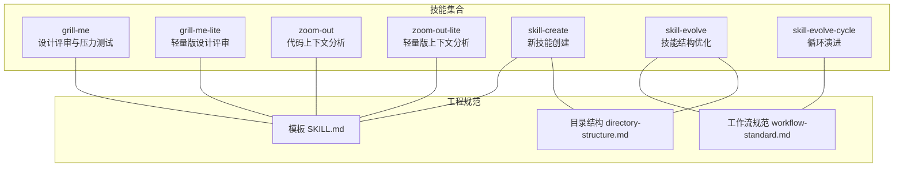
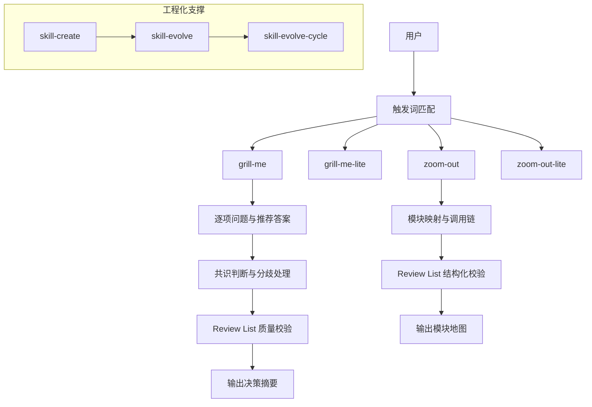
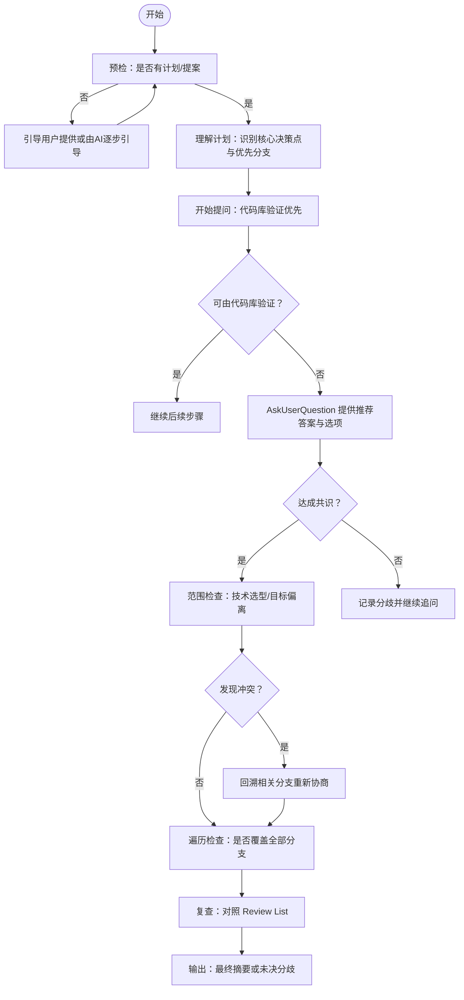
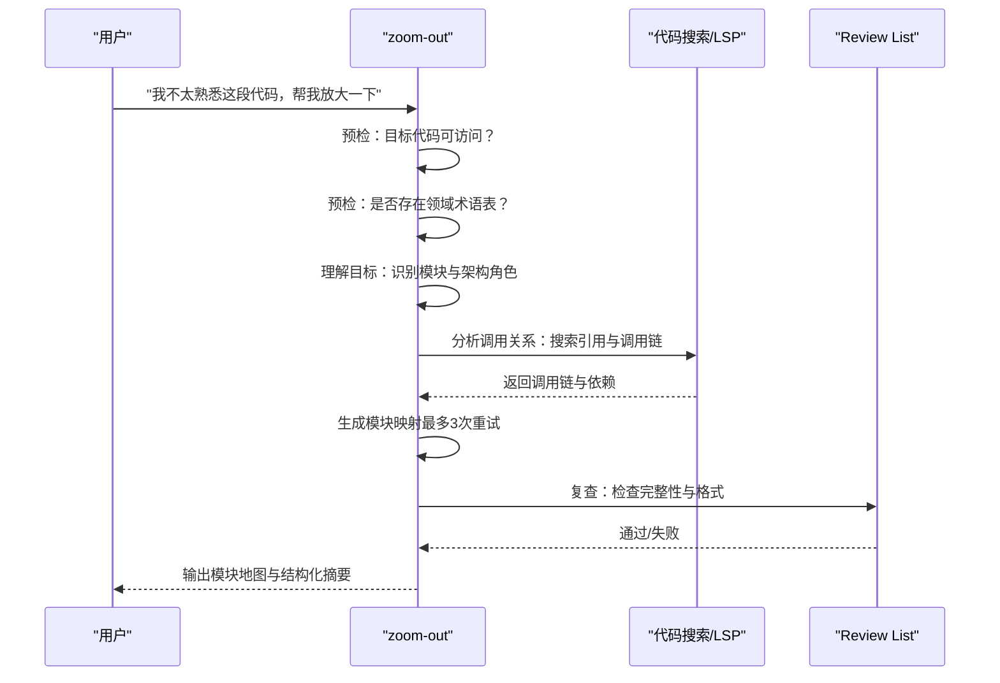
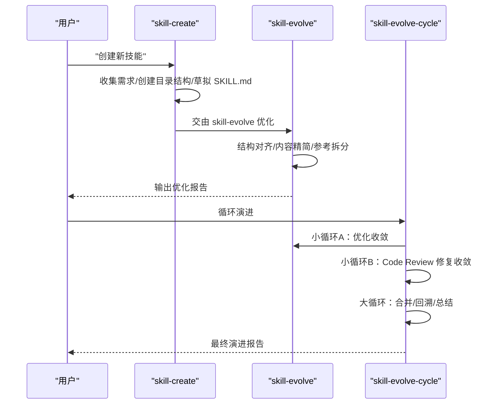
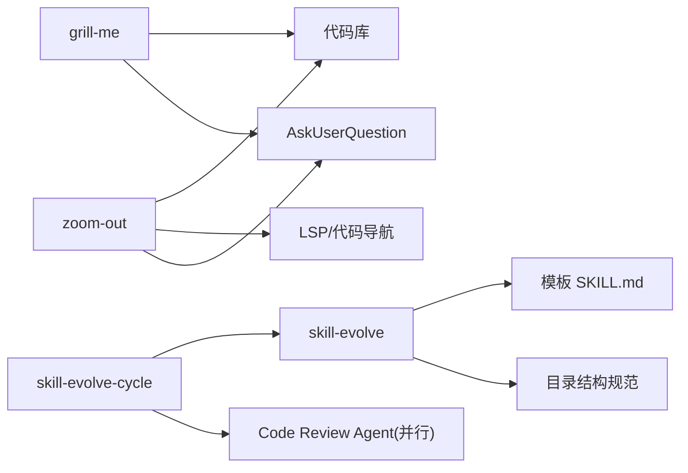

# 开发辅助技能

<cite>
**本文档引用的文件**
- [README.md](file://README.md)
- [grill-me/SKILL.md](file://skills/grill-me/SKILL.md)
- [grill-me-lite/SKILL.md](file://skills/grill-me-lite/SKILL.md)
- [zoom-out/SKILL.md](file://skills/zoom-out/SKILL.md)
- [zoom-out-lite/SKILL.md](file://skills/zoom-out-lite/SKILL.md)
- [skill-evolve/SKILL.md](file://skills/skill-evolve/SKILL.md)
- [skill-evolve-cycle/SKILL.md](file://skills/skill-evolve-cycle/SKILL.md)
- [skill-create/SKILL.md](file://skills/skill-create/SKILL.md)
- [templates/SKILL.md](file://templates/SKILL.md)
- [workflow-standard.md](file://skills/skill-evolve/references/workflow-standard.md)
- [directory-structure.md](file://skills/skill-evolve/references/directory-structure.md)
</cite>

## 目录
1. [简介](#简介)
2. [项目结构](#项目结构)
3. [核心组件](#核心组件)
4. [架构总览](#架构总览)
5. [详细组件分析](#详细组件分析)
6. [依赖关系分析](#依赖关系分析)
7. [性能考虑](#性能考虑)
8. [故障排查指南](#故障排查指南)
9. [结论](#结论)
10. [附录](#附录)

## 简介
本文件系统性梳理“开发辅助技能”集合，重点围绕 grill-me/grill-me-lite（设计评审与压力测试）、zoom-out/zoom-out-lite（代码上下文分析）两大类工具，并结合 skill-evolve/skill-evolve-cycle/skill-create 的技能工程化体系，给出可操作的使用指南、交互流程、输出格式与最佳实践。目标是帮助开发团队在设计评审、代码上下文理解、技能编写与持续演进方面形成标准化流程，提升协作效率与代码质量。

## 项目结构
技能集合采用“自包含目录 + 标准化 SKILL.md”的组织方式，每个技能独立维护其执行规则、工作流与验证清单。核心技能包括：
- 设计评审与压力测试：grill-me、grill-me-lite
- 代码上下文分析：zoom-out、zoom-out-lite
- 技能工程化：skill-create、skill-evolve、skill-evolve-cycle

图表来源
- [README.md:1-113](file://README.md#L1-L113)
- [templates/SKILL.md:1-30](file://templates/SKILL.md#L1-L30)
- [workflow-standard.md:1-180](file://skills/skill-evolve/references/workflow-standard.md#L1-L180)
- [directory-structure.md:1-46](file://skills/skill-evolve/references/directory-structure.md#L1-L46)

章节来源
- [README.md:1-113](file://README.md#L1-L113)

## 核心组件
- grill-me/grill-me-lite：通过“决策树分支遍历 + 逐项共识达成”的方式，对计划/设计方案进行系统性压力测试，支持代码库直接验证与用户确认相结合。
- zoom-out/zoom-out-lite：从当前代码片段向上抽象一层，生成模块映射与调用链，帮助理解模块角色与上下游关系。
- skill-create/skill-evolve/skill-evolve-cycle：提供从零到一创建技能、结构优化与循环演进的完整工程化路径，确保技能文档一致性与可维护性。

章节来源
- [grill-me/SKILL.md:1-509](file://skills/grill-me/SKILL.md#L1-L509)
- [grill-me-lite/SKILL.md:1-17](file://skills/grill-me-lite/SKILL.md#L1-L17)
- [zoom-out/SKILL.md:1-190](file://skills/zoom-out/SKILL.md#L1-L190)
- [zoom-out-lite/SKILL.md:1-12](file://skills/zoom-out-lite/SKILL.md#L1-L12)
- [skill-evolve/SKILL.md:1-371](file://skills/skill-evolve/SKILL.md#L1-L371)
- [skill-evolve-cycle/SKILL.md:1-308](file://skills/skill-evolve-cycle/SKILL.md#L1-L308)
- [skill-create/SKILL.md:1-447](file://skills/skill-create/SKILL.md#L1-L447)

## 架构总览
下图展示技能集合的整体架构与关键交互点：用户通过触发词激活技能，技能内部按工作流执行，必要时调用 AskUserQuestion 进行用户确认，最终输出结构化结果并通过 Review List 验证质量。

图表来源
- [grill-me/SKILL.md:22-112](file://skills/grill-me/SKILL.md#L22-L112)
- [zoom-out/SKILL.md:25-66](file://skills/zoom-out/SKILL.md#L25-L66)
- [skill-evolve-cycle/SKILL.md:45-151](file://skills/skill-evolve-cycle/SKILL.md#L45-L151)

## 详细组件分析

### grill-me：设计评审与压力测试
- 触发条件：用户希望对某个计划/方案进行系统性压力测试，或明确要求“grill me”。
- 关键特性
  - 决策树分支遍历：优先高风险、高耦合分支，逐项达成共识。
  - 代码库验证优先：能通过浏览代码库回答的问题，直接验证而非询问用户。
  - 用户确认机制：所有决策必须通过 AskUserQuestion 结构化选项完成，每轮最多4个选项。
  - 分歧处理与回溯：记录分歧并继续追问，若再次遇到历史分歧则升级为阻塞项并建议另行讨论。
  - 范围控制：聚焦于直接影响计划可行性的决策，避免过度深入基础设施或偏离核心目标。
- 交互流程（简化）
  1) 预检：确认用户已准备好计划/提案；否则引导用户提供或由AI逐步引导。
  2) 理解计划：识别核心决策点与依赖关系，确定优先分支。
  3) 开始提问：先尝试代码库验证，再通过 AskUserQuestion 提供推荐答案与选项。
  4) 范围检查：判断是否涉及无关技术选型或偏离核心目标超过两层依赖。
  5) 回溯检查：发现与先前决策冲突时，回溯相关分支重新协商。
  6) 遍历检查：确认所有分支均已覆盖。
  7) 复查：对照 Review List 逐项验证，失败即终止并提示修复。
  8) 输出：达成共识则输出最终决策摘要；用户主动终止则输出已达成共识与未决分歧。
- 输出格式
  - 执行结果表格：包含主题、提问轮次、代码库验证次数、最终决策数、结果等维度。
  - 复查报告：逐项列出通过/失败项，失败项会给出具体原因与建议。

图表来源
- [grill-me/SKILL.md:22-112](file://skills/grill-me/SKILL.md#L22-L112)

章节来源
- [grill-me/SKILL.md:8-112](file://skills/grill-me/SKILL.md#L8-L112)
- [grill-me/SKILL.md:113-242](file://skills/grill-me/SKILL.md#L113-L242)
- [grill-me/SKILL.md:244-509](file://skills/grill-me/SKILL.md#L244-L509)

### grill-me-lite：轻量版设计评审
- 触发条件：用户希望快速对计划/方案进行压力测试，但不需要完整流程。
- 行为要点
  - 保持“逐项提问 + 推荐答案 + 一次一问”的节奏。
  - 能通过代码库验证的问题优先验证，减少用户负担。
- 使用场景
  - 设计评审的快速通道，适合时间紧张但又需要系统性审视的场合。

章节来源
- [grill-me-lite/SKILL.md:1-17](file://skills/grill-me-lite/SKILL.md#L1-L17)

### zoom-out：代码上下文分析
- 触发条件：用户不熟悉某段代码，需要理解其在整个架构中的位置与作用。
- 关键特性
  - 向上抽象一层：生成模块映射与调用链，标注上游调用者与下游依赖。
  - 术语一致性：优先使用项目领域术语，无术语表时从命名约定推断。
  - 结构化输出：以模块地图形式呈现，避免长篇大论的描述文本。
  - 可靠性保障：最多重试3次生成结构化地图；复查失败最多重试3次。
- 交互流程（简化）
  1) 预检：目标代码可访问；项目是否存在领域术语表。
  2) 理解目标：识别模块与架构角色。
  3) 分析调用关系：搜索引用与调用链，标记模块层级（基础设施/领域/应用）。
  4) 生成模块映射：结构化输出（最多3次重试）。
  5) 复查：对照 Review List 检查完整性与格式合规性。
  6) 输出：模块身份、上游调用者数量、下游依赖数量、抽象层级与输出格式等维度。
- 输出格式
  - 执行结果表格：包含目标代码、模块、上游调用者数量、下游依赖数量、抽象层级、输出格式等。
  - 模块地图：清晰展示调用链与依赖关系。

图表来源
- [zoom-out/SKILL.md:25-66](file://skills/zoom-out/SKILL.md#L25-L66)

章节来源
- [zoom-out/SKILL.md:9-66](file://skills/zoom-out/SKILL.md#L9-L66)
- [zoom-out/SKILL.md:67-174](file://skills/zoom-out/SKILL.md#L67-L174)
- [zoom-out/SKILL.md:175-190](file://skills/zoom-out/SKILL.md#L175-L190)

### zoom-out-lite：轻量版上下文分析
- 触发条件：用户需要快速理解某段代码在整体中的位置。
- 行为要点
  - 向上抽象一层，使用项目领域术语生成模块地图与调用关系。
- 使用场景
  - 快速导航与上下文理解，适合初学者或临时查阅。

章节来源
- [zoom-out-lite/SKILL.md:1-12](file://skills/zoom-out-lite/SKILL.md#L1-L12)

### skill-create/skill-evolve/skill-evolve-cycle：技能工程化体系
- skill-create：从零创建一个符合标准的技能，遵循模板与目录结构，不确定事项通过 AskUserQuestion 确认。
- skill-evolve：对现有 SKILL.md 进行结构优化、内容精简与参考文档拆分，确保与模板一致、引用层级不超过一级。
- skill-evolve-cycle：在 skill-evolve 与 Code Review 之间交替进行小循环（优化→修复→复审），并在满足收敛条件后进入大循环合并与回溯（仅在特定仓库生效）。

图表来源
- [skill-create/SKILL.md:25-87](file://skills/skill-create/SKILL.md#L25-L87)
- [skill-evolve/SKILL.md:30-171](file://skills/skill-evolve/SKILL.md#L30-L171)
- [skill-evolve-cycle/SKILL.md:45-151](file://skills/skill-evolve-cycle/SKILL.md#L45-L151)

章节来源
- [skill-create/SKILL.md:1-194](file://skills/skill-create/SKILL.md#L1-L194)
- [skill-evolve/SKILL.md:1-371](file://skills/skill-evolve/SKILL.md#L1-L371)
- [skill-evolve-cycle/SKILL.md:1-308](file://skills/skill-evolve-cycle/SKILL.md#L1-L308)

## 依赖关系分析
- 技能间依赖
  - grill-me 与 zoom-out 均依赖项目可浏览的代码库能力。
  - skill-evolve 依赖模板与目录结构规范，用于结构对齐与参考拆分。
  - skill-evolve-cycle 依赖 skill-evolve 与 Code Review Agent 并行执行。
- 外部依赖
  - AskUserQuestion 工具：用于所有用户决策交互，确保结构化选项与上限约束。
  - 代码搜索/LSP：用于 zoom-out 的调用链分析。
  - Review List：统一的质量校验清单，贯穿各技能执行过程。

图表来源
- [grill-me/SKILL.md:17-21](file://skills/grill-me/SKILL.md#L17-L21)
- [zoom-out/SKILL.md:18-23](file://skills/zoom-out/SKILL.md#L18-L23)
- [skill-evolve/SKILL.md:37-46](file://skills/skill-evolve/SKILL.md#L37-L46)
- [skill-evolve-cycle/SKILL.md:77-82](file://skills/skill-evolve-cycle/SKILL.md#L77-L82)

章节来源
- [workflow-standard.md:765-792](file://skills/skill-evolve/references/workflow-standard.md#L765-L792)

## 性能考虑
- grill-me
  - 优先使用代码库验证可自动化的问题，减少用户等待与重复沟通成本。
  - 控制每轮问题数量（≤4），避免信息过载导致共识延迟。
- zoom-out
  - 限制重试次数（最多3次），防止长时间卡顿。
  - 结构化输出避免冗长描述带来的解析与渲染开销。
- skill-evolve/skill-evolve-cycle
  - 自动补全安全步骤（Pre-check/Review Check/Output），减少手工遗漏。
  - 并行 Code Review Agent（3个）提升复审效率，同时严格禁止降级与合并结果。

## 故障排查指南
- grill-me
  - 若 Review List 中出现“每轮仅一个问题”或“提供推荐答案”失败，检查是否在对话中多次提问或未提供推荐答案。
  - 若出现无限循环或反复回到历史分歧，说明回溯策略触发阻塞，需另行讨论解决。
- zoom-out
  - 若模块映射无法生成结构化格式，检查术语表或命名约定是否足够清晰。
  - 若复查失败，关注“上游/下游调用链缺失”“输出非结构化”等问题项。
- skill-evolve/skill-evolve-cycle
  - 若自动补全失败或引用不同步，检查 references/ 文件与 References 段落是否一致。
  - 若 CodeReview Agent 不可用，流程会终止并标注原因，需手动补充或更换环境。

章节来源
- [grill-me/SKILL.md:464-489](file://skills/grill-me/SKILL.md#L464-L489)
- [zoom-out/SKILL.md:161-174](file://skills/zoom-out/SKILL.md#L161-L174)
- [skill-evolve-cycle/SKILL.md:152-186](file://skills/skill-evolve-cycle/SKILL.md#L152-L186)

## 结论
通过 grill-me/grill-me-lite 与 zoom-out/zoom-out-lite 的组合使用，团队可以在设计阶段实现系统性压力测试，在编码阶段获得清晰的上下文视图。配合 skill-create/skill-evolve/skill-evolve-cycle 的工程化体系，能够持续提升技能文档质量与可维护性，形成“设计→上下文→文档→演进”的闭环，显著提高开发效率与代码质量。

## 附录
- 快速安装与使用
  - 安装技能集合：使用 npx skills 或脚本安装方式。
  - 选择技能：根据场景选择 grill-me/grill-me-lite 或 zoom-out/zoom-out-lite。
  - 触发方式：在对话中明确表达“grill me”或“help me zoom out”等触发词。
- 最佳实践
  - 设计评审前先用 zoom-out 理清模块边界与调用关系，再用 grill-me 对关键决策进行压力测试。
  - 所有技能均应遵循 Review List 与工作流规范，确保输出质量与一致性。
  - 新技能优先使用 skill-create 创建，随后交给 skill-evolve 优化，再通过 skill-evolve-cycle 进行多轮演进。

章节来源
- [README.md:22-64](file://README.md#L22-L64)
- [templates/SKILL.md:1-30](file://templates/SKILL.md#L1-L30)
- [directory-structure.md:7-17](file://skills/skill-evolve/references/directory-structure.md#L7-L17)
- [workflow-standard.md:1-180](file://skills/skill-evolve/references/workflow-standard.md#L1-L180)