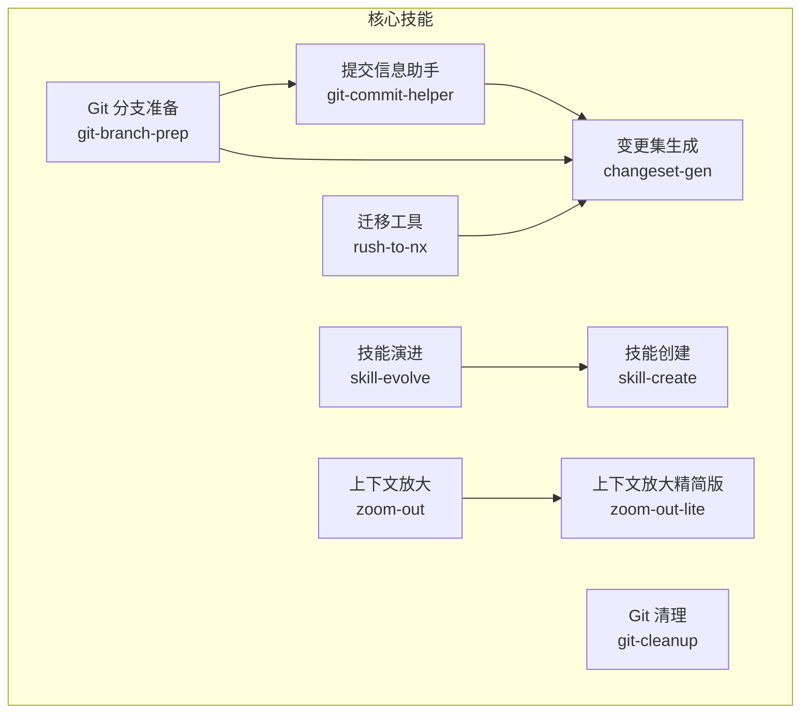
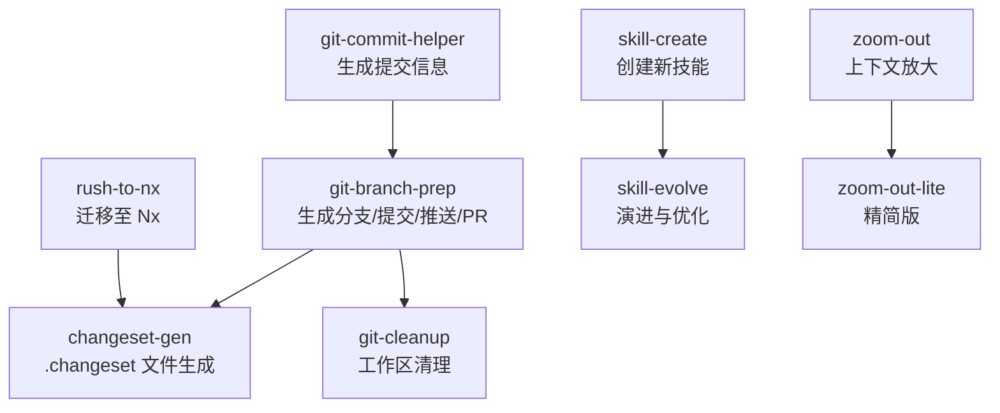
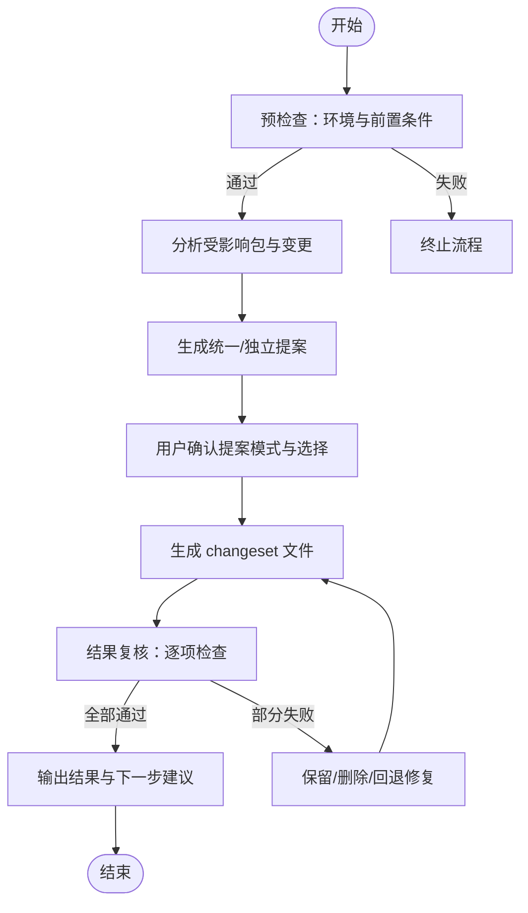
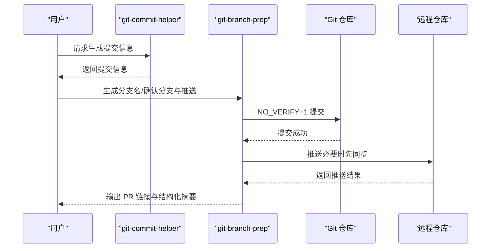
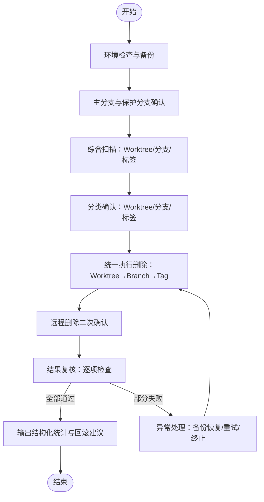
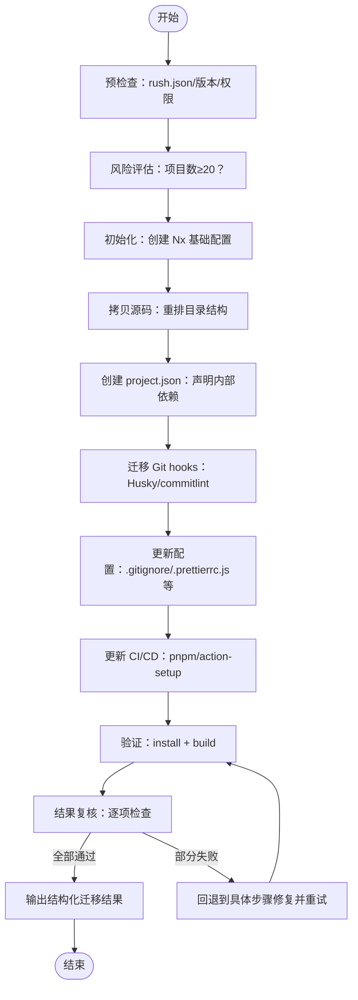
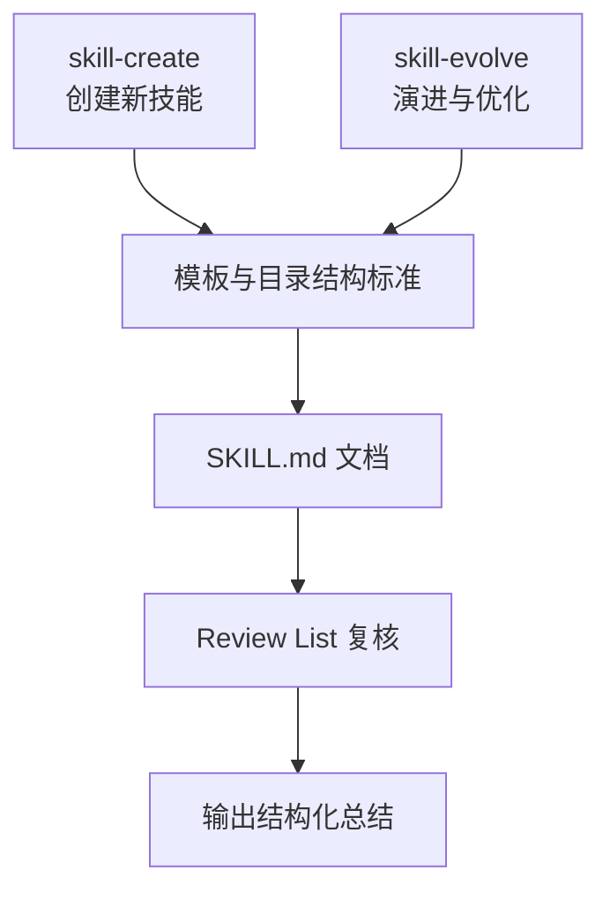
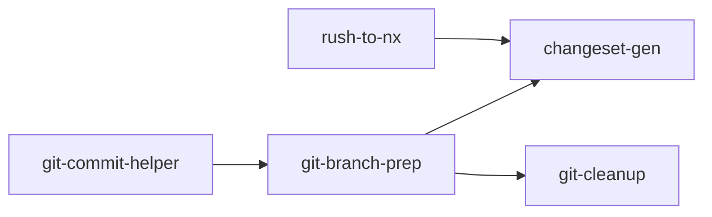

# 核心技能详解

<cite>
**本文档引用的文件**
- [changeset-gen/SKILL.md](file://skills/changeset-gen/SKILL.md)
- [git-branch-prep/SKILL.md](file://skills/git-branch-prep/SKILL.md)
- [git-cleanup/SKILL.md](file://skills/git-cleanup/SKILL.md)
- [git-commit-helper/SKILL.md](file://skills/git-commit-helper/SKILL.md)
- [rush-to-nx/SKILL.md](file://skills/rush-to-nx/SKILL.md)
- [skill-evolve/SKILL.md](file://skills/skill-evolve/SKILL.md)
- [skill-create/SKILL.md](file://skills/skill-create/SKILL.md)
- [zoom-out/SKILL.md](file://skills/zoom-out/SKILL.md)
- [zoom-out-lite/SKILL.md](file://skills/zoom-out-lite/SKILL.md)
- [template.md（技能演进）](file://skills/skill-evolve/template.md)
- [SKILL.md（技能模板）](file://templates/SKILL.md)
</cite>

## 目录
1. [简介](#简介)
2. [项目结构](#项目结构)
3. [核心组件](#核心组件)
4. [架构总览](#架构总览)
5. [详细组件分析](#详细组件分析)
6. [依赖关系分析](#依赖关系分析)
7. [性能考量](#性能考量)
8. [故障排查指南](#故障排查指南)
9. [结论](#结论)
10. [附录](#附录)

## 简介
本文件面向 Skills Collection 的核心技能模块，系统化梳理并深入解析以下关键能力：
- 变更集生成：基于 staged changes 自动分析受影响包并生成 pnpm changeset 文件，支持统一/独立两种提案模式与严格的结果复核。
- Git 工作流管理：从“变更分析 → 提交信息生成 → 分支派生 → 提交/推送 → PR 链接生成”形成闭环，确保安全与规范。
- 代码清理：系统性扫描并清理过期 Worktree/分支/标签，两阶段删除（本地→远程），并提供备份与回滚保障。
- 迁移工具：将 Rush.js 单体仓库迁移到 Nx + pnpm + Changesets 生态，覆盖初始化、拷贝、配置、钩子、CI/CD 更新与验证。
- 技能工程化：提供技能创建与演进的标准模板与流程，确保技能文档结构化、可维护、可复用。

上述技能围绕统一的“预检查 → 工作流 → 复核 → 输出”的安全三段式设计，配合交互式决策点与严格的规则校验，既适合初学者按步骤执行，也为资深开发者提供可扩展的工程化支撑。

## 项目结构
Skills Collection 将技能以“技能目录 + SKILL.md + references/ + scripts/”的标准化方式组织，核心技能分布如下：
- 变更集生成：changeset-gen
- Git 分支准备：git-branch-prep
- Git 清理：git-cleanup
- 提交信息助手：git-commit-helper
- 迁移：rush-to-nx
- 技能创建：skill-create
- 技能演进：skill-evolve
- 上下文放大：zoom-out / zoom-out-lite

图表来源
- [changeset-gen/SKILL.md:1-284](file://skills/changeset-gen/SKILL.md#L1-L284)
- [git-branch-prep/SKILL.md:1-276](file://skills/git-branch-prep/SKILL.md#L1-L276)
- [git-cleanup/SKILL.md:1-453](file://skills/git-cleanup/SKILL.md#L1-L453)
- [git-commit-helper/SKILL.md:1-296](file://skills/git-commit-helper/SKILL.md#L1-L296)
- [rush-to-nx/SKILL.md:1-529](file://skills/rush-to-nx/SKILL.md#L1-L529)
- [skill-evolve/SKILL.md:1-371](file://skills/skill-evolve/SKILL.md#L1-L371)
- [skill-create/SKILL.md:1-447](file://skills/skill-create/SKILL.md#L1-L447)
- [zoom-out/SKILL.md:1-190](file://skills/zoom-out/SKILL.md#L1-L190)
- [zoom-out-lite/SKILL.md:1-12](file://skills/zoom-out-lite/SKILL.md#L1-L12)

章节来源
- [changeset-gen/SKILL.md:1-284](file://skills/changeset-gen/SKILL.md#L1-L284)
- [git-branch-prep/SKILL.md:1-276](file://skills/git-branch-prep/SKILL.md#L1-L276)
- [git-cleanup/SKILL.md:1-453](file://skills/git-cleanup/SKILL.md#L1-L453)
- [git-commit-helper/SKILL.md:1-296](file://skills/git-commit-helper/SKILL.md#L1-L296)
- [rush-to-nx/SKILL.md:1-529](file://skills/rush-to-nx/SKILL.md#L1-L529)
- [skill-evolve/SKILL.md:1-371](file://skills/skill-evolve/SKILL.md#L1-L371)
- [skill-create/SKILL.md:1-447](file://skills/skill-create/SKILL.md#L1-L447)
- [zoom-out/SKILL.md:1-190](file://skills/zoom-out/SKILL.md#L1-L190)
- [zoom-out-lite/SKILL.md:1-12](file://skills/zoom-out-lite/SKILL.md#L1-L12)

## 核心组件
本节聚焦四大核心能力：变更集生成、Git 工作流、清理与迁移，并给出使用场景、关键规则与最佳实践。

- 变更集生成（changeset-gen）
  - 场景：完成变更后需要为 nx + pnpm changeset 单体仓库生成版本变更文件。
  - 关键点：仅分析 staged changes；自动识别受影响包；支持统一/独立两种提案模式；严格结果复核；生成文件位于 .changeset/。
  - 最佳实践：先执行 git add，再运行；生成后执行 git add .changeset/ 并进入后续发布流程。

- Git 分支准备（git-branch-prep）
  - 场景：从变更到分支、提交、推送、PR 链接生成的一站式流程。
  - 关键点：调用 git-commit-helper 生成提交信息；根据提交信息推导分支名；受保护分支检测；强制 NO_VERIFY=1 提交；PR 链接优先从推送输出提取。
  - 最佳实践：避免直接向保护分支提交；必要时新建分支；推送前确认远程同步状态。

- Git 清理（git-cleanup）
  - 场景：定期清理过期 Worktree/分支/标签，保持仓库整洁。
  - 关键点：两阶段删除（本地→远程）；备份先行；脏工作树自动跳过；保护分支不被纳入候选；二次确认远程删除。
  - 最佳实践：在受保护分支执行；谨慎选择删除范围；远程删除需二次确认。

- 迁移（rush-to-nx）
  - 场景：将 Rush.js 单体仓库迁移到 Nx + pnpm + Changesets。
  - 关键点：分析 rush.json → 初始化 Nx 配置 → 拷贝源码并重排目录 → 创建 project.json → 迁移 Git hooks → 更新 CI/CD → 验证构建。
  - 最佳实践：先在临时目录验证结构，再应用到目标目录；保留非 Rush 配置文件；关注内部依赖声明与发布流程。

章节来源
- [changeset-gen/SKILL.md:1-284](file://skills/changeset-gen/SKILL.md#L1-L284)
- [git-branch-prep/SKILL.md:1-276](file://skills/git-branch-prep/SKILL.md#L1-L276)
- [git-cleanup/SKILL.md:1-453](file://skills/git-cleanup/SKILL.md#L1-L453)
- [rush-to-nx/SKILL.md:1-529](file://skills/rush-to-nx/SKILL.md#L1-L529)

## 架构总览
四个核心技能在不同层面协同：
- 数据与控制流：git-commit-helper 为 git-branch-prep 提供提交信息；git-branch-prep 产出分支与 PR 链接；changeset-gen 在变更完成后生成发布文件；git-cleanup 保障工作区整洁；rush-to-nx 实现生态迁移。
- 规则与约束：所有技能遵循“预检查 → 工作流 → 复核 → 输出”的安全三段式；交互必须通过 AskUserQuestion；严格禁止裸 git commit，强制 NO_VERIFY=1。
- 扩展与治理：skill-create/skill-evolve 提供技能创建与演进的模板与流程，确保文档结构化、可维护。

图表来源
- [git-commit-helper/SKILL.md:1-296](file://skills/git-commit-helper/SKILL.md#L1-L296)
- [git-branch-prep/SKILL.md:1-276](file://skills/git-branch-prep/SKILL.md#L1-L276)
- [changeset-gen/SKILL.md:1-284](file://skills/changeset-gen/SKILL.md#L1-L284)
- [git-cleanup/SKILL.md:1-453](file://skills/git-cleanup/SKILL.md#L1-L453)
- [rush-to-nx/SKILL.md:1-529](file://skills/rush-to-nx/SKILL.md#L1-L529)
- [skill-create/SKILL.md:1-447](file://skills/skill-create/SKILL.md#L1-L447)
- [skill-evolve/SKILL.md:1-371](file://skills/skill-evolve/SKILL.md#L1-L371)
- [zoom-out/SKILL.md:1-190](file://skills/zoom-out/SKILL.md#L1-L190)
- [zoom-out-lite/SKILL.md:1-12](file://skills/zoom-out-lite/SKILL.md#L1-L12)

## 详细组件分析

### 变更集生成（changeset-gen）
- 功能概述：基于 staged changes 分析受影响包，自动生成 pnpm changeset 版本变更文件，不涉及分支创建、提交或推送。
- 输入与前置条件：存在 staged changes；.changeset/ 与 @changesets/cli 可用；pnpm-workspace.yaml 存在；jq 可用。
- 核心流程：
  - 预检查：环境检查（git、jq、changeset、workspace）。
  - 生成计划：分析受影响包；生成统一/独立两类提案。
  - 用户确认：统一/独立两种模式；支持自定义输入。
  - 生成文件：为每个受影响包生成唯一随机文件名的 changeset 文件；格式符合 frontmatter 规范。
  - 结果复核：逐项比对 Review List；失败时允许保留/删除/回退修复。
  - 输出结果：统计受影响包数量、生成文件数、文件路径提示、下一步操作建议。
- 关键规则：
  - 文件名随机且唯一；不得覆盖现有文件；每个受影响包独立生成文件。
  - 仅限 .changeset/ 目录；不得修改已 staged 的变更；不得执行 commit/push。
  - 所有交互必须使用 AskUserQuestion。
- 使用场景与最佳实践：
  - 在完成多模块改动后，批量生成 changeset 文件，随后执行发布脚本。
  - 若无受影响包，直接提示无需生成并结束。
  - 生成后务必执行 git add .changeset/ 并进入后续发布流程。

图表来源
- [changeset-gen/SKILL.md:29-129](file://skills/changeset-gen/SKILL.md#L29-L129)

章节来源
- [changeset-gen/SKILL.md:1-284](file://skills/changeset-gen/SKILL.md#L1-L284)

### Git 分支准备（git-branch-prep）
- 功能概述：调用 git-commit-helper 生成提交信息 → 推导分支名 → 用户确认分支与推送意图 → 执行提交/推送 → 生成 PR 链接。
- 输入与前置条件：Git 2.0+；当前处于 Git 仓库；存在变更；jq 可用；处理分离头指针与保护分支。
- 核心流程：
  - 预检查：环境检查、冲突状态、分离头指针处理。
  - 调用 git-commit-helper：完整跟随其交互逻辑与分支决策。
  - 推导分支名：依据 Conventional Commits 生成分支名。
  - 用户决策：分支选择（当前/新建）、推送与否。
  - 执行：NO_VERIFY=1 提交；远程存在则同步；推送并提取/构建 PR 链接。
  - 结果复核：逐项检查 Review List；失败时记录原因并终止。
  - 输出：结构化摘要（分支、提交、推送状态、PR 链接、命令）。
- 关键规则：
  - 提交必须使用 NO_VERIFY=1；禁止裸 git commit。
  - 分支命名遵循约定式规范；PR 链接优先从推送输出提取。
  - 保护分支不可直接提交；必要时新建分支。
- 使用场景与最佳实践：
  - 新功能开发：从变更到分支、提交、推送、PR 一站式完成。
  - 修复文档/小改动：可本地提交并仅生成 PR 链接。
  - 保护分支：必须新建分支，避免直接提交。

图表来源
- [git-branch-prep/SKILL.md:43-84](file://skills/git-branch-prep/SKILL.md#L43-L84)
- [git-commit-helper/SKILL.md:1-296](file://skills/git-commit-helper/SKILL.md#L1-L296)

章节来源
- [git-branch-prep/SKILL.md:1-276](file://skills/git-branch-prep/SKILL.md#L1-L276)
- [git-commit-helper/SKILL.md:1-296](file://skills/git-commit-helper/SKILL.md#L1-L296)

### Git 清理（git-cleanup）
- 功能概述：扫描并清理过期 Worktree/分支/标签，两阶段删除（本地→远程），并提供备份与回滚。
- 输入与前置条件：Git 2.0+；当前处于 Git 仓库；jq 可用；具备远程删除权限；仅支持 origin。
- 核心流程：
  - 预检查：环境检查、备份创建、主分支与保护分支确认。
  - 综合扫描：远程修剪后扫描 Worktree/分支/标签，输出三类 JSON。
  - 分类确认：分别确认 Worktree/分支/标签删除范围；脏工作树自动跳过。
  - 统一执行：按顺序执行删除（Worktree→Branch→Tag），记录成功/跳过/失败。
  - 远程删除：二次确认后统一推送删除。
  - 异常处理：备份可用时提供恢复命令；异常退出时输出已完成的操作清单。
  - 结果复核：逐项检查 Review List；失败时允许重试/跳过/终止。
  - 输出：结构化统计（扫描/删除/跳过/失败计数、备份路径、回滚建议）。
- 关键规则：
  - 脏工作树自动跳过；保护分支不纳入候选；仅在受保护分支执行。
  - 先本地后远程；二次确认远程删除；备份必须成功。
  - 删除失败记录原因并继续后续删除。
- 使用场景与最佳实践：
  - 定期清理合并/孤儿分支与过期标签，保持仓库整洁。
  - 合理选择删除范围，避免误删；远程删除需谨慎。

图表来源
- [git-cleanup/SKILL.md:37-171](file://skills/git-cleanup/SKILL.md#L37-L171)

章节来源
- [git-cleanup/SKILL.md:1-453](file://skills/git-cleanup/SKILL.md#L1-L453)

### 迁移（rush-to-nx）
- 功能概述：自动化将 Rush.js 单体仓库迁移到 Nx + pnpm + Changesets 生态，覆盖初始化、拷贝、配置、钩子、CI/CD 更新与验证。
- 输入与前置条件：存在 rush.json；Node.js/pnpm/Git 符合要求；目标目录写权限；可选覆盖现有配置。
- 核心流程：
  - 预检查：rush.json 存在、版本满足、权限检查、配置冲突处理。
  - 分析：统计项目数、workspace:* 依赖、自定义命令；风险提示与二次确认。
  - 初始化：创建 pnpm-workspace.yaml、nx.json、.changeset/config.json、根 package.json、.npmrc。
  - 拷贝源码：rsync 排除缓存，重排目录结构。
  - 创建 project.json：为每个包生成 Nx 配置，声明内部依赖。
  - 迁移 Git hooks：创建 Husky 配置与 commitlint。
  - 更新配置：更新 .gitignore、.prettierrc.js 等。
  - 更新 CI/CD：从 actions-rush 迁移到 pnpm/action-setup。
  - 验证：安装依赖并执行构建验证；失败时最多重试 3 次。
  - 结果复核：逐项检查 Review List；失败时允许回退到具体步骤修复。
  - 输出：结构化迁移结果（项目数、新增文件、验证结果、CI/CD 迁移情况）。
- 关键规则：
  - 临时目录先行验证，通过后再应用到目标目录。
  - 保留非 Rush 配置文件；文件移动同步更新路径引用。
  - 所有交互使用 AskUserQuestion；所有配置变更先报备后执行。
- 使用场景与最佳实践：
  - 团队希望从 Rush.js 迁移到标准 pnpm+Nx 工具链。
  - 包数量适中（<20）时迁移成本可控；注意内部依赖声明与发布流程。

图表来源
- [rush-to-nx/SKILL.md:26-95](file://skills/rush-to-nx/SKILL.md#L26-L95)

章节来源
- [rush-to-nx/SKILL.md:1-529](file://skills/rush-to-nx/SKILL.md#L1-L529)

### 技能工程化（skill-create / skill-evolve）
- 功能概述：提供技能创建与演进的标准模板与流程，确保技能文档结构化、可维护、可复用。
- skill-create：
  - 从零创建新技能：收集需求 → 创建目录结构 → 按模板草拟 SKILL.md → 评估辅助目录 → 用户审阅 → 复核 → 输出。
  - 关键规则：description 必须包含触发条件；SKILL.md 不超过 300 行；引用层级不超过一级；交互必须使用 AskUserQuestion。
- skill-evolve：
  - 对既有 SKILL.md 进行结构化演进：元数据修正 → 结构对齐 → 格式统一 → 内容精简 → 参考文档拆分 → 复核 → 输出。
  - 关键规则：Review List 与 Rules 一一对应；防御性处理（错误回滚、链接修复）；交叉引用完整性审计。
- 使用场景与最佳实践：
  - 新建技能：使用 skill-create 严格遵循模板与目录结构。
  - 优化现有技能：使用 skill-evolve 进行结构化演进与质量提升。

图表来源
- [skill-create/SKILL.md:1-447](file://skills/skill-create/SKILL.md#L1-L447)
- [skill-evolve/SKILL.md:1-371](file://skills/skill-evolve/SKILL.md#L1-L371)
- [template.md（技能演进）:1-247](file://skills/skill-evolve/template.md#L1-L247)
- [SKILL.md（技能模板）:1-30](file://templates/SKILL.md#L1-L30)

章节来源
- [skill-create/SKILL.md:1-447](file://skills/skill-create/SKILL.md#L1-L447)
- [skill-evolve/SKILL.md:1-371](file://skills/skill-evolve/SKILL.md#L1-L371)
- [template.md（技能演进）:1-247](file://skills/skill-evolve/template.md#L1-L247)
- [SKILL.md（技能模板）:1-30](file://templates/SKILL.md#L1-L30)

### 上下文放大（zoom-out / zoom-out-lite）
- 功能概述：帮助用户从当前代码片段抽象到更高层视角，生成模块关系图与调用链，便于理解整体架构。
- 输入与前置条件：可访问目标代码；最好具备领域术语表或命名约定。
- 核心流程：
  - 预检查：目标代码可达；加载/推断术语。
  - 理解目标：识别模块与架构角色。
  - 分析关系：搜索调用链，标记模块层级。
  - 生成地图：结构化模块图（最多重试 3 次）。
  - 结果复核：逐项检查 Review List；失败重试或终止。
  - 输出：结构化摘要（目标代码、模块、上游调用者、下游依赖、抽象层级、输出格式）。
- 关键规则：始终向上抽象一层；使用项目领域术语；输出采用结构化地图格式。
- 使用场景与最佳实践：
  - 初次接触某模块或文件时，快速建立全局认知。
  - 与 zoom-out-lite 配合使用，前者提供完整流程，后者作为简要入口。

章节来源
- [zoom-out/SKILL.md:1-190](file://skills/zoom-out/SKILL.md#L1-L190)
- [zoom-out-lite/SKILL.md:1-12](file://skills/zoom-out-lite/SKILL.md#L1-L12)

## 依赖关系分析
- 技能内依赖：
  - git-branch-prep 依赖 git-commit-helper 生成提交信息。
  - rush-to-nx 与 changeset-gen 协同：迁移后生成 changeset 文件参与发布。
- 技能间协作：
  - changeset-gen 与 rush-to-nx：迁移后生成 changeset 文件，进入发布流水线。
  - git-branch-prep 与 git-cleanup：前者产出分支/PR，后者清理历史分支/标签。
- 外部依赖：
  - Git 2.0+、jq、pnpm、Node.js（按技能而定）。
  - .changeset/ 与 @changesets/cli（changeset-gen）。
  - Husky/commitlint（git-cleanup 迁移后）。
  - Rush.js 配置（rush-to-nx）。

图表来源
- [git-commit-helper/SKILL.md:1-296](file://skills/git-commit-helper/SKILL.md#L1-L296)
- [git-branch-prep/SKILL.md:1-276](file://skills/git-branch-prep/SKILL.md#L1-L276)
- [changeset-gen/SKILL.md:1-284](file://skills/changeset-gen/SKILL.md#L1-L284)
- [git-cleanup/SKILL.md:1-453](file://skills/git-cleanup/SKILL.md#L1-L453)
- [rush-to-nx/SKILL.md:1-529](file://skills/rush-to-nx/SKILL.md#L1-L529)

章节来源
- [git-commit-helper/SKILL.md:1-296](file://skills/git-commit-helper/SKILL.md#L1-L296)
- [git-branch-prep/SKILL.md:1-276](file://skills/git-branch-prep/SKILL.md#L1-L276)
- [changeset-gen/SKILL.md:1-284](file://skills/changeset-gen/SKILL.md#L1-L284)
- [git-cleanup/SKILL.md:1-453](file://skills/git-cleanup/SKILL.md#L1-L453)
- [rush-to-nx/SKILL.md:1-529](file://skills/rush-to-nx/SKILL.md#L1-L529)

## 性能考量
- 变更集生成：扫描 staged changes 与解析 affected packages 的开销较小；提案生成与文件写入为 IO 密集，建议在本地 SSD 上执行。
- Git 分支准备：提交与推送为网络/磁盘 IO；NO_VERIFY=1 避免 hook 开销；远程同步可能受网络影响。
- Git 清理：扫描与删除为本地 IO；脏工作树跳过减少无效操作；两阶段删除降低远程失败概率。
- 迁移：rsync 与构建验证为 IO 密集；建议在空闲时段执行；临时目录验证可避免重复构建。
- 技能演进：文件读写与链接修复为 CPU/IO；建议在内存充足的机器上执行。

## 故障排查指南
- 变更集生成
  - 症状：未检测到 staged changes。
  - 处理：先执行 git add，再运行技能。
  - 症状：Review List 中“未执行 commit/push”失败。
  - 处理：确认未修改已 staged 的变更；此技能不执行 commit/push。
- Git 分支准备
  - 症状：保护分支不可直接提交。
  - 处理：新建分支；或切换到受保护分支后执行。
  - 症状：推送失败或 PR 链接缺失。
  - 处理：先同步远程分支；若推送输出不含 PR 链接，根据远程 URL 动态构建。
- Git 清理
  - 症状：备份创建失败。
  - 处理：终止流程；确保目标目录写权限；必要时手动备份。
  - 症状：删除失败或远程删除失败。
  - 处理：查看失败原因；可尝试强制删除；或手动处理。
- 迁移
  - 症状：构建验证失败。
  - 处理：最多重试 3 次；定位失败原因并修复后重试。
  - 症状：内部依赖声明不正确。
  - 处理：检查 project.json 的 implicitDependencies；确保 pnpm changeset 发布时解析正确。
- 技能演进
  - 症状：Review List 中“示例与流程不一致”。
  - 处理：更新示例以匹配最新流程；确保步骤编号与实际一致。

章节来源
- [changeset-gen/SKILL.md:131-139](file://skills/changeset-gen/SKILL.md#L131-L139)
- [git-branch-prep/SKILL.md:102-108](file://skills/git-branch-prep/SKILL.md#L102-L108)
- [git-cleanup/SKILL.md:148-154](file://skills/git-cleanup/SKILL.md#L148-L154)
- [rush-to-nx/SKILL.md:76-81](file://skills/rush-to-nx/SKILL.md#L76-L81)
- [skill-evolve/SKILL.md:252-281](file://skills/skill-evolve/SKILL.md#L252-L281)

## 结论
Skills Collection 的核心技能围绕“安全、规范、可复用”的设计原则，通过统一的三段式流程与严格的规则校验，为团队提供了从日常开发到生态迁移的全栈能力。建议在实践中：
- 优先使用 git-commit-helper 与 git-branch-prep 形成稳定的 Git 工作流；
- 在变更完成后及时使用 changeset-gen 生成发布文件；
- 定期执行 git-cleanup 保持仓库整洁；
- 需要时借助 rush-to-nx 完成生态迁移；
- 使用 skill-create/skill-evolve 确保技能文档的质量与一致性。

## 附录
- 参考文件
  - [template.md（技能演进）:1-247](file://skills/skill-evolve/template.md#L1-L247)
  - [SKILL.md（技能模板）:1-30](file://templates/SKILL.md#L1-L30)
  - [changeset-gen/SKILL.md:1-284](file://skills/changeset-gen/SKILL.md#L1-L284)
  - [git-branch-prep/SKILL.md:1-276](file://skills/git-branch-prep/SKILL.md#L1-L276)
  - [git-cleanup/SKILL.md:1-453](file://skills/git-cleanup/SKILL.md#L1-L453)
  - [git-commit-helper/SKILL.md:1-296](file://skills/git-commit-helper/SKILL.md#L1-L296)
  - [rush-to-nx/SKILL.md:1-529](file://skills/rush-to-nx/SKILL.md#L1-L529)
  - [skill-evolve/SKILL.md:1-371](file://skills/skill-evolve/SKILL.md#L1-L371)
  - [skill-create/SKILL.md:1-447](file://skills/skill-create/SKILL.md#L1-L447)
  - [zoom-out/SKILL.md:1-190](file://skills/zoom-out/SKILL.md#L1-L190)
  - [zoom-out-lite/SKILL.md:1-12](file://skills/zoom-out-lite/SKILL.md#L1-L12)