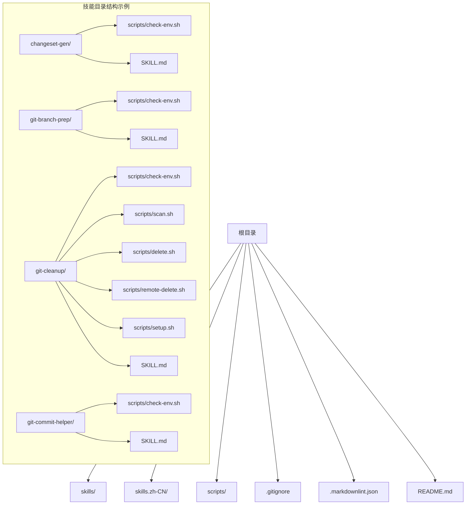
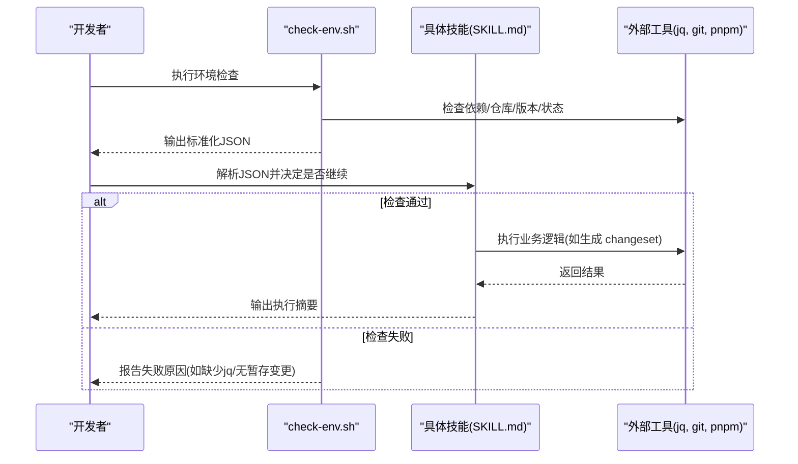
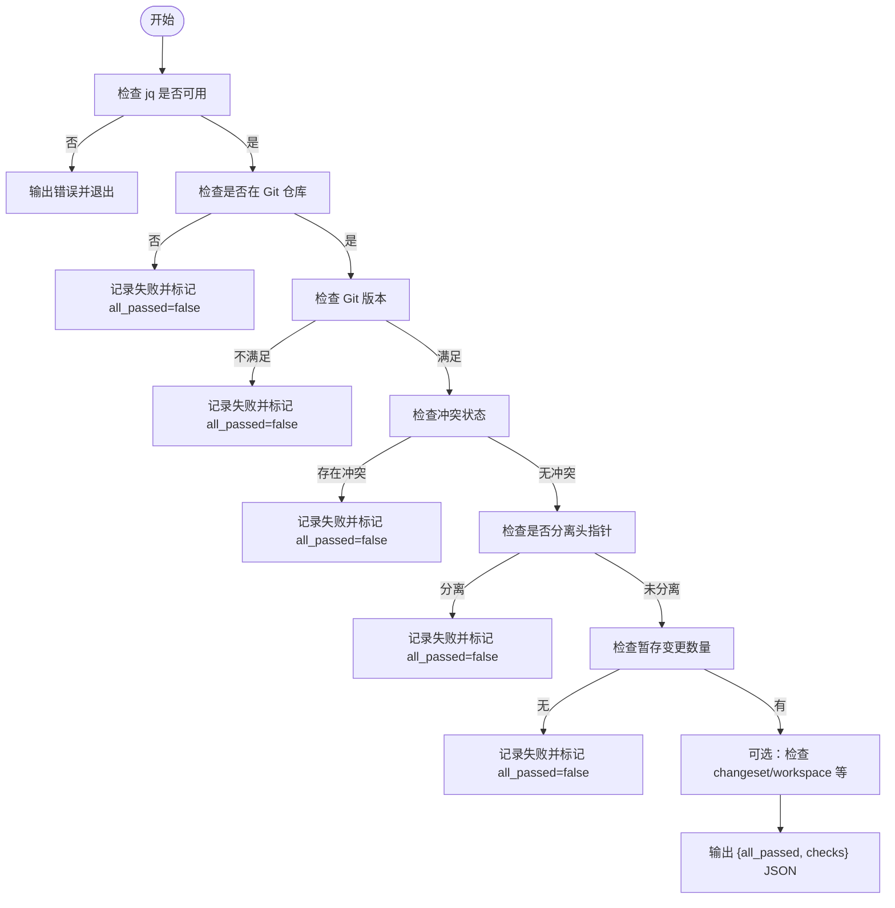
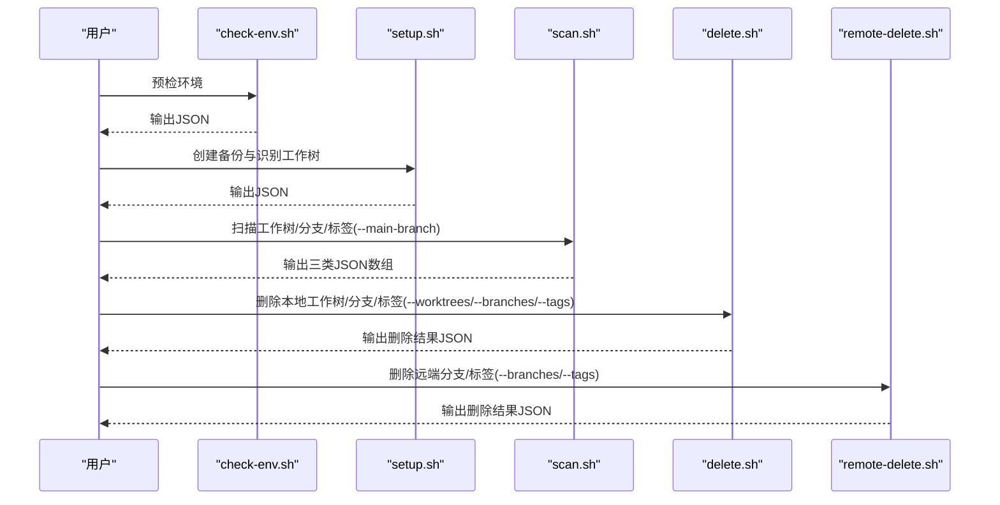
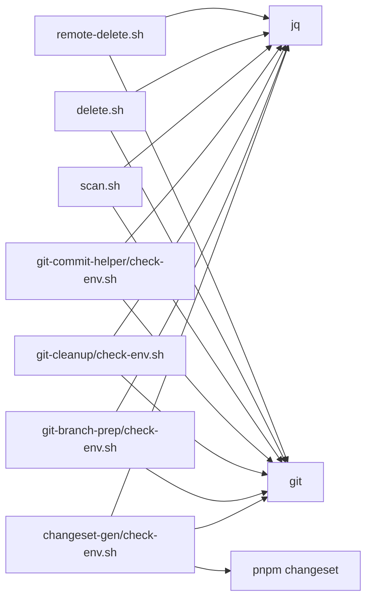

# 配置与环境

<cite>
**本文引用的文件**
- [.gitignore](file://.gitignore)
- [.markdownlint.json](file://.markdownlint.json)
- [README.md](file://README.md)
- [scripts/install-skills.sh](file://scripts/install-skills.sh)
- [scripts/install-commands.sh](file://scripts/install-commands.sh)
- [skills/changeset-gen/scripts/check-env.sh](file://skills/changeset-gen/scripts/check-env.sh)
- [skills/git-branch-prep/scripts/check-env.sh](file://skills/git-branch-prep/scripts/check-env.sh)
- [skills/git-cleanup/scripts/check-env.sh](file://skills/git-cleanup/scripts/check-env.sh)
- [skills/git-commit-helper/scripts/check-env.sh](file://skills/git-commit-helper/scripts/check-env.sh)
- [skills/changeset-gen/SKILL.md](file://skills/changeset-gen/SKILL.md)
- [skills/git-cleanup/scripts/setup.sh](file://skills/git-cleanup/scripts/setup.sh)
- [skills/git-cleanup/scripts/scan.sh](file://skills/git-cleanup/scripts/scan.sh)
- [skills/git-cleanup/scripts/delete.sh](file://skills/git-cleanup/scripts/delete.sh)
- [skills/git-cleanup/scripts/remote-delete.sh](file://skills/git-cleanup/scripts/remote-delete.sh)
</cite>

## 目录
1. [简介](#简介)
2. [项目结构](#项目结构)
3. [核心组件](#核心组件)
4. [架构总览](#架构总览)
5. [详细组件分析](#详细组件分析)
6. [依赖关系分析](#依赖关系分析)
7. [性能考虑](#性能考虑)
8. [故障排除指南](#故障排除指南)
9. [结论](#结论)
10. [附录](#附录)

## 简介
本章节面向开发者，系统性讲解 Skills Collection 的“配置与环境”主题，重点覆盖以下方面：
- 环境检查机制：以各技能目录下的 check-env.sh 为核心，说明其检查项、输出格式与在技能执行中的作用。
- 项目配置文件：.gitignore 与 .markdownlint.json 的规则与用途，以及对开发工作流的影响。
- 环境变量：安装脚本支持的环境变量及其最佳实践。
- 配置与技能执行的关系：如何通过预检确保技能流程稳定运行。
- 故障排除与性能优化建议：常见问题定位与改进建议。

## 项目结构
仓库采用按技能分层的组织方式，每个技能目录下包含 SKILL.md（技能规范）与 scripts/（可选的辅助脚本）。环境检查脚本集中于各技能的 scripts 目录，安装脚本位于根目录 scripts/ 下，另有命令集 commands 与 commands.zh-CN 目录用于复用命令。

图表来源
- [skills/changeset-gen/scripts/check-env.sh:1-115](file://skills/changeset-gen/scripts/check-env.sh#L1-L115)
- [skills/git-branch-prep/scripts/check-env.sh:1-105](file://skills/git-branch-prep/scripts/check-env.sh#L1-L105)
- [skills/git-cleanup/scripts/check-env.sh:1-67](file://skills/git-cleanup/scripts/check-env.sh#L1-L67)
- [skills/git-commit-helper/scripts/check-env.sh:1-94](file://skills/git-commit-helper/scripts/check-env.sh#L1-L94)
- [skills/changeset-gen/SKILL.md:1-284](file://skills/changeset-gen/SKILL.md#L1-L284)
- [skills/git-cleanup/scripts/scan.sh:1-112](file://skills/git-cleanup/scripts/scan.sh#L1-L112)
- [skills/git-cleanup/scripts/delete.sh:1-86](file://skills/git-cleanup/scripts/delete.sh#L1-L86)
- [skills/git-cleanup/scripts/remote-delete.sh:1-59](file://skills/git-cleanup/scripts/remote-delete.sh#L1-L59)
- [skills/git-cleanup/scripts/setup.sh:1-56](file://skills/git-cleanup/scripts/setup.sh#L1-L56)

章节来源
- [README.md:1-113](file://README.md#L1-L113)

## 核心组件
- 环境检查脚本（check-env.sh）
  - 统一功能：在技能执行前进行环境预检，输出标准化 JSON，供上层流程解析与决策。
  - 共同依赖：jq（JSON 处理），若缺失则直接报错退出。
  - 常见检查点：是否 Git 仓库、Git 版本、是否存在冲突状态、是否分离头指针、是否有暂存变更等；部分技能还会检查 pnpm changeset 与 workspace 配置。
- 安装脚本（install-skills.sh、install-commands.sh）
  - 支持环境变量覆盖目标路径（SKILLS_DIR、COMMANDS_DIR），默认分别指向用户本地技能与命令存储目录。
  - 支持从远程克隆或本地目录复制，提供语言选择（英文/中文）。
- 配置文件
  - .gitignore：忽略 node_modules、.nx、日志、系统文件及特定文档目录，避免污染版本库。
  - .markdownlint.json：放宽换行、空格、缩进与行宽限制，便于团队协作时保持一致的文档风格。

章节来源
- [skills/changeset-gen/scripts/check-env.sh:1-115](file://skills/changeset-gen/scripts/check-env.sh#L1-L115)
- [skills/git-branch-prep/scripts/check-env.sh:1-105](file://skills/git-branch-prep/scripts/check-env.sh#L1-L105)
- [skills/git-cleanup/scripts/check-env.sh:1-67](file://skills/git-cleanup/scripts/check-env.sh#L1-L67)
- [skills/git-commit-helper/scripts/check-env.sh:1-94](file://skills/git-commit-helper/scripts/check-env.sh#L1-L94)
- [scripts/install-skills.sh:1-146](file://scripts/install-skills.sh#L1-L146)
- [scripts/install-commands.sh:1-145](file://scripts/install-commands.sh#L1-L145)
- [.gitignore:1-9](file://.gitignore#L1-L9)
- [.markdownlint.json:1-6](file://.markdownlint.json#L1-L6)

## 架构总览
下图展示“环境检查—技能执行—结果输出”的整体流程，突出 check-env.sh 在技能执行前的关键作用。

图表来源
- [skills/changeset-gen/scripts/check-env.sh:1-115](file://skills/changeset-gen/scripts/check-env.sh#L1-L115)
- [skills/changeset-gen/SKILL.md:29-42](file://skills/changeset-gen/SKILL.md#L29-L42)
- [skills/git-branch-prep/scripts/check-env.sh:1-105](file://skills/git-branch-prep/scripts/check-env.sh#L1-L105)
- [skills/git-cleanup/scripts/check-env.sh:1-67](file://skills/git-cleanup/scripts/check-env.sh#L1-L67)
- [skills/git-commit-helper/scripts/check-env.sh:1-94](file://skills/git-commit-helper/scripts/check-env.sh#L1-L94)

## 详细组件分析

### 环境检查机制（check-env.sh）
- 统一入口与输出
  - 所有 check-env.sh 以相同 JSON 结构输出，字段包含布尔值 all_passed 与数组 checks，每项包含 name、passed、可选 detail/version 等。
  - 若检测到 jq 缺失，直接输出错误并退出。
- 典型检查项
  - 是否在 Git 仓库内、Git 版本是否满足最低要求（如 ≥ 2.0）、是否存在冲突状态（合并/变基/拣选/回退）、是否分离头指针、是否有暂存变更。
  - 针对 changeset-gen 还会检查 .changeset 目录与 @changesets/cli 是否存在，以及 pnpm-workspace.yaml 是否包含 packages 配置。
- 在技能执行中的作用
  - 参考 changeset-gen 的执行步骤：在“预检查”阶段调用 bash scripts/check-env.sh，解析返回 JSON 并根据各项检查结果决定后续流程或提示用户处理。

图表来源
- [skills/changeset-gen/scripts/check-env.sh:1-115](file://skills/changeset-gen/scripts/check-env.sh#L1-L115)
- [skills/git-branch-prep/scripts/check-env.sh:1-105](file://skills/git-branch-prep/scripts/check-env.sh#L1-L105)
- [skills/git-cleanup/scripts/check-env.sh:1-67](file://skills/git-cleanup/scripts/check-env.sh#L1-L67)
- [skills/git-commit-helper/scripts/check-env.sh:1-94](file://skills/git-commit-helper/scripts/check-env.sh#L1-L94)

章节来源
- [skills/changeset-gen/scripts/check-env.sh:1-115](file://skills/changeset-gen/scripts/check-env.sh#L1-L115)
- [skills/git-branch-prep/scripts/check-env.sh:1-105](file://skills/git-branch-prep/scripts/check-env.sh#L1-L105)
- [skills/git-cleanup/scripts/check-env.sh:1-67](file://skills/git-cleanup/scripts/check-env.sh#L1-L67)
- [skills/git-commit-helper/scripts/check-env.sh:1-94](file://skills/git-commit-helper/scripts/check-env.sh#L1-L94)
- [skills/changeset-gen/SKILL.md:29-42](file://skills/changeset-gen/SKILL.md#L29-L42)

### 项目配置文件
- .gitignore
  - 忽略 node_modules、.nx、日志、系统文件，以及 docs/skill-evolve-cycle 等目录，减少无关文件进入版本控制。
- .markdownlint.json
  - 关闭若干严格规则（如 ul-indent、no-hard-tabs、whitespace、line-length），降低写作门槛，提升团队协作效率。

章节来源
- [.gitignore:1-9](file://.gitignore#L1-L9)
- [.markdownlint.json:1-6](file://.markdownlint.json#L1-L6)

### 环境变量与安装脚本
- 支持的环境变量
  - SKILLS_DIR：覆盖技能安装目标目录，默认值见安装脚本注释与实现。
  - COMMANDS_DIR：覆盖命令安装目标目录，默认值见安装脚本注释与实现。
- 语言选择
  - 安装脚本会提示选择语言（英文/中文），并据此从 skills 或 skills.zh-CN 复制资源。
- 本地与远程模式
  - 支持通过 --repo-dir 使用本地仓库目录，避免网络依赖；否则自动克隆远程仓库。

章节来源
- [README.md:47-64](file://README.md#L47-L64)
- [README.md:91-108](file://README.md#L91-L108)
- [scripts/install-skills.sh:1-146](file://scripts/install-skills.sh#L1-L146)
- [scripts/install-commands.sh:1-145](file://scripts/install-commands.sh#L1-L145)

### Git Cleanup 技能的完整流程（示例）
- 预检：调用 check-env.sh，确认仓库、版本、远程可达等。
- 设置：setup.sh 检测主分支、当前工作树/分支并创建备份。
- 扫描：scan.sh 统一扫描工作树、分支与标签，输出三类 JSON 数组。
- 删除：delete.sh 接收 JSON 数组，按类型删除本地工作树/分支/标签。
- 远端清理：remote-delete.sh 批量删除远端分支与标签。
- 输出：所有操作均以 JSON 记录成功/失败状态，便于上层汇总。

图表来源
- [skills/git-cleanup/scripts/check-env.sh:1-67](file://skills/git-cleanup/scripts/check-env.sh#L1-L67)
- [skills/git-cleanup/scripts/setup.sh:1-56](file://skills/git-cleanup/scripts/setup.sh#L1-L56)
- [skills/git-cleanup/scripts/scan.sh:1-112](file://skills/git-cleanup/scripts/scan.sh#L1-L112)
- [skills/git-cleanup/scripts/delete.sh:1-86](file://skills/git-cleanup/scripts/delete.sh#L1-L86)
- [skills/git-cleanup/scripts/remote-delete.sh:1-59](file://skills/git-cleanup/scripts/remote-delete.sh#L1-L59)

章节来源
- [skills/git-cleanup/scripts/check-env.sh:1-67](file://skills/git-cleanup/scripts/check-env.sh#L1-L67)
- [skills/git-cleanup/scripts/setup.sh:1-56](file://skills/git-cleanup/scripts/setup.sh#L1-L56)
- [skills/git-cleanup/scripts/scan.sh:1-112](file://skills/git-cleanup/scripts/scan.sh#L1-L112)
- [skills/git-cleanup/scripts/delete.sh:1-86](file://skills/git-cleanup/scripts/delete.sh#L1-L86)
- [skills/git-cleanup/scripts/remote-delete.sh:1-59](file://skills/git-cleanup/scripts/remote-delete.sh#L1-L59)

## 依赖关系分析
- 脚本间耦合
  - 各技能的 check-env.sh 仅依赖 jq 与 git，彼此独立，便于扩展与维护。
  - Git Cleanup 的 scan/delete/remote-delete 通过 JSON 输入/输出解耦，形成管道式处理。
- 外部依赖
  - jq：统一的 JSON 处理工具，缺失会导致检查脚本直接失败。
  - git：所有检查与操作的基础。
  - pnpm changeset（仅 changeset-gen）：需要 .changeset 目录与 @changesets/cli 存在，且 pnpm-workspace.yaml 包含 packages 配置。

图表来源
- [skills/changeset-gen/scripts/check-env.sh:1-115](file://skills/changeset-gen/scripts/check-env.sh#L1-L115)
- [skills/git-branch-prep/scripts/check-env.sh:1-105](file://skills/git-branch-prep/scripts/check-env.sh#L1-L105)
- [skills/git-cleanup/scripts/check-env.sh:1-67](file://skills/git-cleanup/scripts/check-env.sh#L1-L67)
- [skills/git-commit-helper/scripts/check-env.sh:1-94](file://skills/git-commit-helper/scripts/check-env.sh#L1-L94)
- [skills/git-cleanup/scripts/scan.sh:1-112](file://skills/git-cleanup/scripts/scan.sh#L1-L112)
- [skills/git-cleanup/scripts/delete.sh:1-86](file://skills/git-cleanup/scripts/delete.sh#L1-L86)
- [skills/git-cleanup/scripts/remote-delete.sh:1-59](file://skills/git-cleanup/scripts/remote-delete.sh#L1-L59)

章节来源
- [skills/changeset-gen/scripts/check-env.sh:1-115](file://skills/changeset-gen/scripts/check-env.sh#L1-L115)
- [skills/git-cleanup/scripts/scan.sh:1-112](file://skills/git-cleanup/scripts/scan.sh#L1-L112)
- [skills/git-cleanup/scripts/delete.sh:1-86](file://skills/git-cleanup/scripts/delete.sh#L1-L86)
- [skills/git-cleanup/scripts/remote-delete.sh:1-59](file://skills/git-cleanup/scripts/remote-delete.sh#L1-L59)

## 性能考虑
- 减少不必要的网络请求
  - 使用 install-skills.sh 的 --repo-dir 选项，避免重复克隆远程仓库，提高安装速度。
- 降低检查开销
  - 在本地仓库执行时，优先使用本地源，减少 git fetch/clone 的等待时间。
- JSON 处理优化
  - 统一使用 jq 进行结构化输出，便于快速解析与聚合，避免正则解析带来的性能损耗。
- 清理流程批量化
  - scan.sh 一次性扫描三类对象，delete.sh/remote-delete.sh 批量处理，减少多次调用的系统开销。

## 故障排除指南
- jq 缺失
  - 现象：check-env.sh 直接输出错误并退出。
  - 处理：安装 jq 后重试。
- 不在 Git 仓库
  - 现象：检查项 in-git-repo 失败。
  - 处理：切换到正确的仓库目录或初始化仓库后再执行。
- Git 版本过低
  - 现象：git-version 失败。
  - 处理：升级 Git 至 2.0+。
- 冲突状态
  - 现象：conflict-state 失败（合并/变基/拣选/回退）。
  - 处理：完成冲突解决或取消相关操作后重试。
- 分离头指针
  - 现象：detached-head 失败。
  - 处理：切换到有效分支后再执行。
- 无暂存变更
  - 现象：has-changes 失败。
  - 处理：先执行 git add 将变更暂存后再运行检查。
- changeset-gen 专属问题
  - 现象：pnpm-changeset 或 pnpm-workspace 失败。
  - 处理：确保 .changeset 目录与 @changesets/cli 存在，且 pnpm-workspace.yaml 包含 packages 配置。
- 安装脚本问题
  - 现象：目标目录权限不足或网络不可达。
  - 处理：使用 sudo 或调整 SKILLS_DIR/COMMANDS_DIR 权限；或使用 --repo-dir 指向本地仓库。

章节来源
- [skills/changeset-gen/scripts/check-env.sh:1-115](file://skills/changeset-gen/scripts/check-env.sh#L1-L115)
- [skills/git-branch-prep/scripts/check-env.sh:1-105](file://skills/git-branch-prep/scripts/check-env.sh#L1-L105)
- [skills/git-cleanup/scripts/check-env.sh:1-67](file://skills/git-cleanup/scripts/check-env.sh#L1-L67)
- [skills/git-commit-helper/scripts/check-env.sh:1-94](file://skills/git-commit-helper/scripts/check-env.sh#L1-L94)
- [scripts/install-skills.sh:1-146](file://scripts/install-skills.sh#L1-L146)
- [scripts/install-commands.sh:1-145](file://scripts/install-commands.sh#L1-L145)

## 结论
- 环境检查脚本是技能执行的“前置门卫”，通过标准化 JSON 输出，确保技能在正确的环境中运行。
- 项目配置文件与安装脚本共同构成了稳定的开发与部署基础：.gitignore 与 .markdownlint.json 提升协作效率，安装脚本支持灵活的环境变量与多语言源。
- 对于 Git Cleanup 等复杂技能，建议遵循“预检—设置—扫描—删除—远端清理”的流水线，配合 JSON 输出进行可观测与自动化。

## 附录
- 最佳实践清单
  - 在执行任何技能前，先运行对应技能的 check-env.sh，确保依赖与环境满足要求。
  - 使用 SKILLS_DIR/COMMANDS_DIR 覆盖默认安装路径，结合 --repo-dir 实现离线安装。
  - 在团队协作中，统一 jq 与 Git 版本，减少跨环境差异。
  - 对 changeset-gen，提前准备 .changeset 与 pnpm-workspace.yaml，避免预检失败。