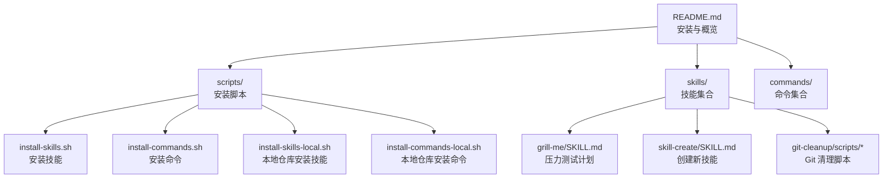
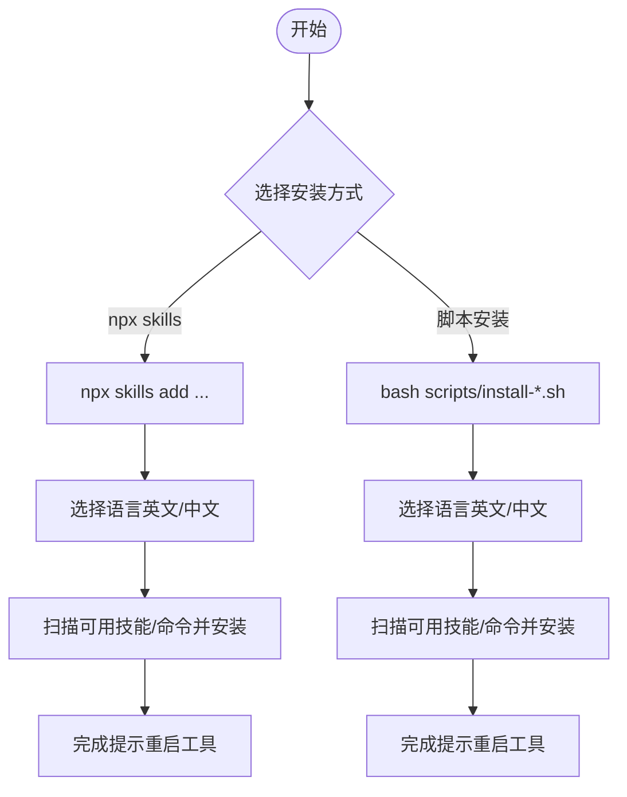
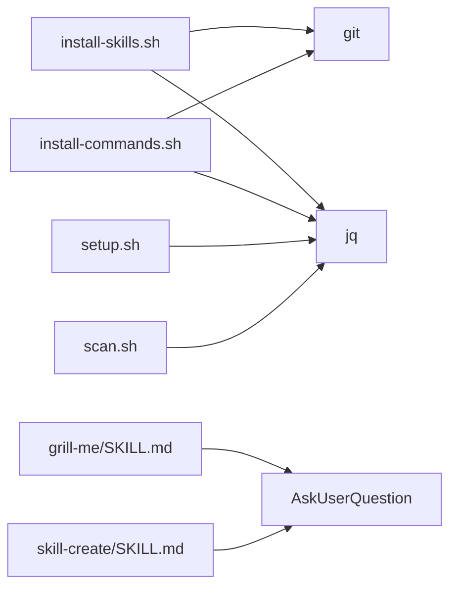

# 快速开始

<cite>
**本文引用的文件**
- [README.md](file://README.md)
- [install-skills.sh](file://scripts/install-skills.sh)
- [install-skills-local.sh](file://scripts/install-skills-local.sh)
- [install-commands.sh](file://scripts/install-commands.sh)
- [install-commands-local.sh](file://scripts/install-commands-local.sh)
- [grill-me/SKILL.md](file://skills/grill-me/SKILL.md)
- [skill-create/SKILL.md](file://skills/skill-create/SKILL.md)
- [scan.sh](file://skills/git-cleanup/scripts/scan.sh)
- [setup.sh](file://skills/git-cleanup/scripts/setup.sh)
- [SKILL.md（模板）](file://templates/SKILL.md)
</cite>

## 目录
1. [简介](#简介)
2. [项目结构](#项目结构)
3. [核心组件](#核心组件)
4. [架构总览](#架构总览)
5. [详细组件分析](#详细组件分析)
6. [依赖关系分析](#依赖关系分析)
7. [性能与可维护性建议](#性能与可维护性建议)
8. [故障排除指南](#故障排除指南)
9. [结论](#结论)
10. [附录：首次使用示例](#附录首次使用示例)

## 简介
本指南面向初学者与进阶用户，帮助你在最短时间内完成 Skills Collection 的安装与首次使用。你将学会两种安装方式：通过 npx skills 在线安装与通过脚本离线/在线安装；理解关键配置项（如 SKILLS_DIR）的作用；掌握如何运行第一个技能（例如“压力测试计划”），并获得常见问题的排查建议。

## 项目结构
该项目采用“技能（skills）+ 命令（commands）+ 脚本（scripts）”的组织方式：
- skills：每个技能是一个自包含目录，遵循 agent-skills 规范，包含 SKILL.md 以及可选的 scripts、references 等子目录
- commands：可复用的命令文档，以 .md 文件形式提供
- scripts：安装脚本，支持从远程仓库克隆安装或直接从本地仓库安装
- templates：技能模板，用于新技能的快速起步

图表来源
- [README.md](file://README.md)
- [install-skills.sh](file://scripts/install-skills.sh)
- [install-commands.sh](file://scripts/install-commands.sh)
- [install-skills-local.sh](file://scripts/install-skills-local.sh)
- [install-commands-local.sh](file://scripts/install-commands-local.sh)
- [grill-me/SKILL.md](file://skills/grill-me/SKILL.md)
- [skill-create/SKILL.md](file://skills/skill-create/SKILL.md)
- [scan.sh](file://skills/git-cleanup/scripts/scan.sh)

章节来源
- [README.md](file://README.md)

## 核心组件
- 安装脚本：负责从远程仓库克隆或从本地仓库复制技能/命令到目标目录，并处理语言选择、冲突覆盖、清理等流程
- 技能规范：每个技能以 SKILL.md 为核心，定义概述、规则、工作流、示例与评审清单
- 模板：提供标准化的 SKILL.md 结构，便于快速创建符合规范的新技能
- 命令集合：以 .md 形式提供的可复用命令，可通过安装脚本部署到指定目录

章节来源
- [README.md](file://README.md)
- [SKILL.md（模板）](file://templates/SKILL.md)

## 架构总览
下图展示了两种安装路径的总体流程：npx skills 与脚本安装。两者最终都会将技能/命令写入目标目录，供后续工具加载使用。

图表来源
- [README.md](file://README.md)
- [install-skills.sh](file://scripts/install-skills.sh)
- [install-commands.sh](file://scripts/install-commands.sh)

## 详细组件分析

### 安装方式一：npx skills（推荐给初学者）
- 优点
  - 无需本地克隆仓库，直接在线安装
  - 可按需安装特定技能，减少磁盘占用
  - 自动处理语言选择与安装流程
- 适用场景
  - 首次体验或仅需少量技能
  - 不想在本地保留完整仓库副本
- 关键命令与输出
  - 安装全部技能：npx skills add hz-9/skills
  - 安装单个技能：npx skills add hz-9/skills --skill <技能名>
  - 输出示例（概念性说明）：安装完成后会提示已安装数量与跳过数量，并建议重启工具以加载新技能

章节来源
- [README.md](file://README.md)

### 安装方式二：脚本安装（适合离线/定制化）
- 支持的环境变量
  - SKILLS_DIR：覆盖默认技能目标目录（默认值见脚本内部逻辑）
  - COMMANDS_DIR：覆盖默认命令目标目录（默认值见脚本内部逻辑）
- 两种脚本
  - 远程安装：bash scripts/install-skills.sh 或一键命令
  - 本地安装：bash scripts/install-skills-local.sh（不联网）
- 流程要点
  - 语言选择：英文或中文
  - 冲突处理：若目标目录已有同名技能/命令，会提示是否覆盖
  - 清理：远程安装后会清理临时克隆目录
  - 提示：安装完成后建议重启工具以加载新技能

章节来源
- [README.md](file://README.md)
- [install-skills.sh](file://scripts/install-skills.sh)
- [install-skills-local.sh](file://scripts/install-skills-local.sh)
- [install-commands.sh](file://scripts/install-commands.sh)
- [install-commands-local.sh](file://scripts/install-commands-local.sh)

### 首次运行第一个技能：压力测试计划（grill-me）
- 触发条件
  - 用户表达希望“压力测试某个方案/设计”
  - 或明确输入“grill me”
- 建议步骤
  - 先确认已安装技能（见“安装方式一/二”）
  - 在你的工具中打开命令面板，搜索“grill-me”
  - 输入你的计划/设计方案，跟随交互逐步深入
- 交互约定
  - 使用统一的“AskUserQuestion”进行决策交互
  - 每轮只问一个问题，提供推荐答案
  - 若问题可由代码库验证，优先验证而非询问

章节来源
- [grill-me/SKILL.md](file://skills/grill-me/SKILL.md)

### 创建新技能：skill-create
- 适用场景
  - 需要从零编写一个符合标准的技能
- 工作流要点
  - 预检：确保模板与目录结构可用
  - 收集需求：通过 AskUserQuestion 明确技能边界
  - 生成结构：创建 SKILL.md 与辅助目录
  - 草稿评审：与用户确认内容质量
  - 复查：对照 Review List 检查是否满足规范
  - 输出：生成结构化总结，告知创建完成

章节来源
- [skill-create/SKILL.md](file://skills/skill-create/SKILL.md)

### Git 清理技能：git-cleanup
- 场景
  - 需要扫描并清理过期的 Worktree、分支与标签
- 常用脚本
  - setup.sh：检测主分支、识别当前 Worktree/分支、创建备份
  - scan.sh：扫描 Worktree、合并分支、孤儿分支、孤儿标签，输出三类 JSON 数组
- 使用建议
  - 先运行 setup.sh 获取必要上下文信息
  - 再运行 scan.sh 获取清理清单
  - 根据输出决定删除策略

章节来源
- [setup.sh](file://skills/git-cleanup/scripts/setup.sh)
- [scan.sh](file://skills/git-cleanup/scripts/scan.sh)

## 依赖关系分析
- 安装脚本依赖
  - git：用于远程克隆
  - jq：用于 JSON 处理（脚本中显式检查）
  - bash：脚本运行环境
- 技能依赖
  - 交互工具：AskUserQuestion（在技能规范中强制要求）
  - 代码库浏览能力：部分技能需要能够访问项目源码以验证技术问题

图表来源
- [install-skills.sh](file://scripts/install-skills.sh)
- [install-commands.sh](file://scripts/install-commands.sh)
- [setup.sh](file://skills/git-cleanup/scripts/setup.sh)
- [scan.sh](file://skills/git-cleanup/scripts/scan.sh)
- [grill-me/SKILL.md](file://skills/grill-me/SKILL.md)
- [skill-create/SKILL.md](file://skills/skill-create/SKILL.md)

## 性能与可维护性建议
- 选择合适安装方式
  - 初学者优先使用 npx skills，简单快捷
  - 需要离线或定制化部署时使用脚本安装
- 合理设置 SKILLS_DIR/COMMANDS_DIR
  - 将技能/命令放置在便于工具发现的目录，避免频繁切换
- 保持技能结构清晰
  - 遵循模板与规范，控制 SKILL.md 行数，必要时拆分至 references/
- 交互一致性
  - 统一使用 AskUserQuestion，减少歧义与重复问答

## 故障排除指南
- 安装失败（git 未安装）
  - 现象：脚本报错提示无法找到 git
  - 处理：安装 git 并重试
- 安装失败（jq 未安装）
  - 现象：脚本报错提示 jq 缺失
  - 处理：安装 jq 并重试
- 语言选择错误
  - 现象：安装后技能/命令语言不符合预期
  - 处理：重新运行安装脚本，按提示选择正确语言
- 冲突覆盖确认
  - 现象：目标目录存在同名技能/命令，脚本询问是否覆盖
  - 处理：确认覆盖或取消，避免误删
- 重启工具未生效
  - 现象：安装完成后工具未显示新技能
  - 处理：根据提示重启工具，确保加载最新目录

章节来源
- [install-skills.sh](file://scripts/install-skills.sh)
- [install-commands.sh](file://scripts/install-commands.sh)
- [setup.sh](file://skills/git-cleanup/scripts/setup.sh)
- [scan.sh](file://skills/git-cleanup/scripts/scan.sh)

## 结论
通过本指南，你可以快速完成 Skills Collection 的安装与首次使用。建议先用 npx skills 体验核心技能，再根据需要使用脚本安装更多技能或命令。遵循模板与规范编写新技能，提升团队协作效率与知识沉淀质量。

## 附录：首次使用示例
- 安装（任选其一）
  - 在线安装全部技能：npx skills add hz-9/skills
  - 在线安装单个技能：npx skills add hz-9/skills --skill grill-me
  - 脚本安装（远程）：bash scripts/install-skills.sh
  - 脚本安装（本地）：bash scripts/install-skills-local.sh
- 运行第一个技能
  - 在工具命令面板中搜索“grill-me”，输入你的计划/设计方案，跟随交互逐步深入
- 验证安装
  - 查看目标目录（默认 ~/.qoder/skills 或通过 SKILLS_DIR 指定），确认技能目录存在
  - 重启工具，确保新技能被加载

章节来源
- [README.md](file://README.md)
- [grill-me/SKILL.md](file://skills/grill-me/SKILL.md)