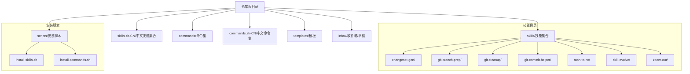
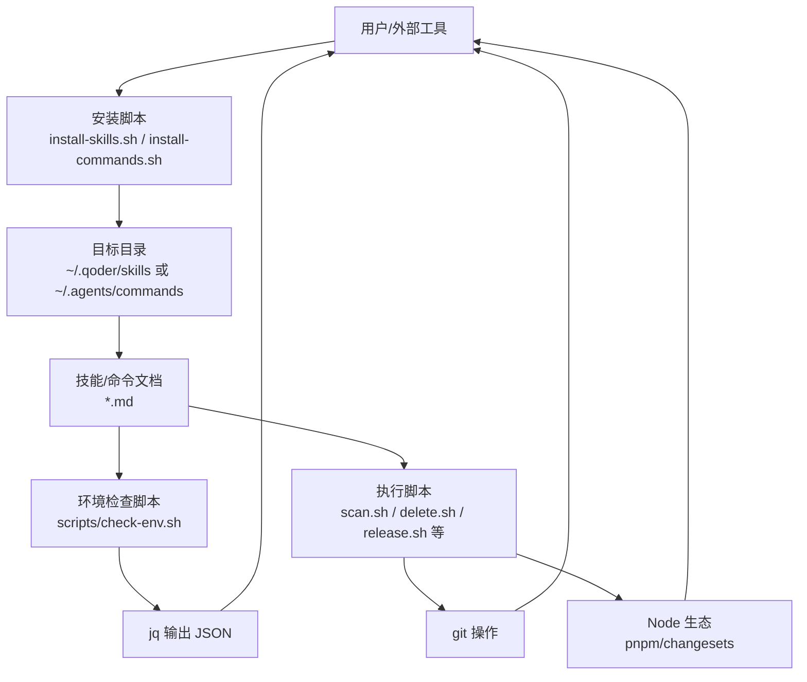
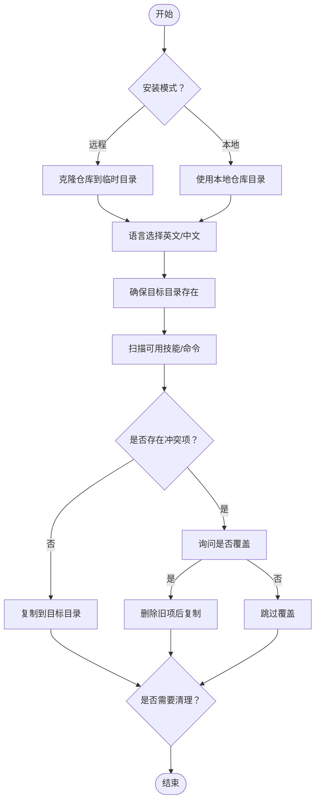
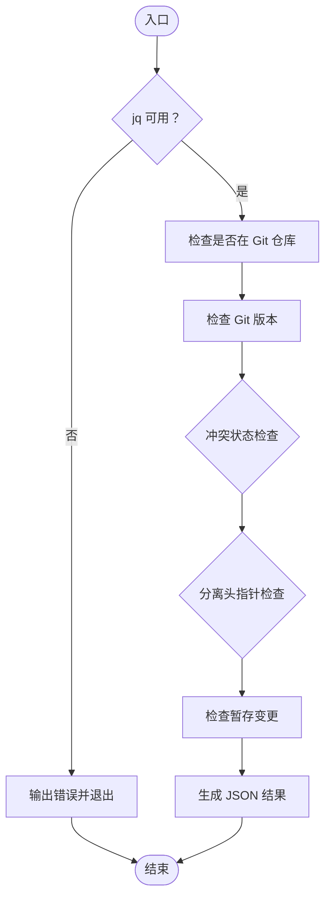
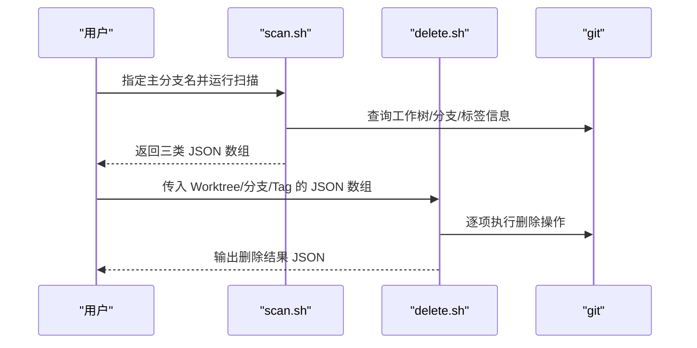
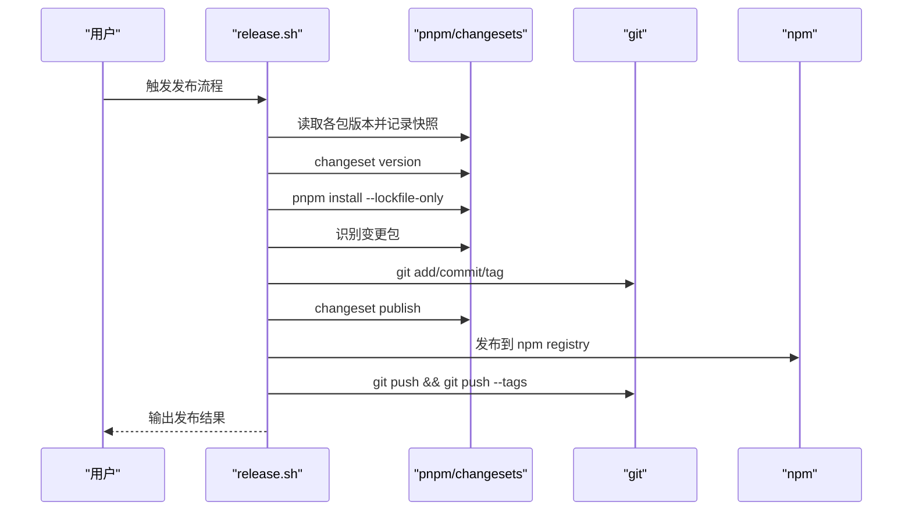
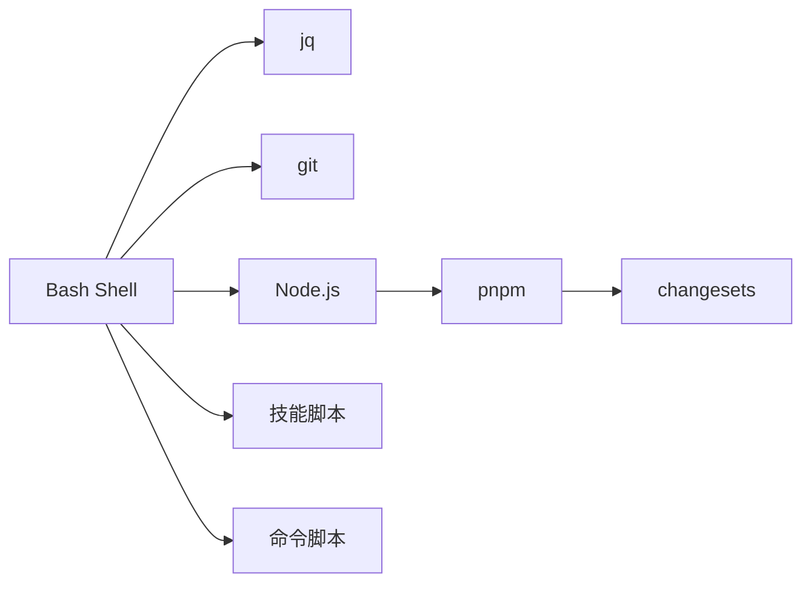

# 技术栈与依赖

<cite>
**本文引用的文件**
- [README.md](file://README.md)
- [install-skills.sh](file://scripts/install-skills.sh)
- [install-commands.sh](file://scripts/install-commands.sh)
- [check-env.sh（changeset-gen）](file://skills/changeset-gen/scripts/check-env.sh)
- [check-env.sh（git-branch-prep）](file://skills/git-branch-prep/scripts/check-env.sh)
- [check-env.sh（git-cleanup）](file://skills/git-cleanup/scripts/check-env.sh)
- [check-env.sh（git-commit-helper）](file://skills/git-commit-helper/scripts/check-env.sh)
- [scan.sh（git-cleanup）](file://skills/git-cleanup/scripts/scan.sh)
- [delete.sh（git-cleanup）](file://skills/git-cleanup/scripts/delete.sh)
- [release.sh（rush-to-nx）](file://skills/rush-to-nx/scripts/release.sh)
- [SKILL.md（changeset-gen）](file://skills/changeset-gen/SKILL.md)
- [hitl-loop.template.sh](file://inbox/skills/diagnose/scripts/hitl-loop.template.sh)
</cite>

## 目录
1. [简介](#简介)
2. [项目结构](#项目结构)
3. [核心组件](#核心组件)
4. [架构总览](#架构总览)
5. [详细组件分析](#详细组件分析)
6. [依赖分析](#依赖分析)
7. [性能考虑](#性能考虑)
8. [故障排查指南](#故障排查指南)
9. [结论](#结论)
10. [附录](#附录)

## 简介
本文件面向 Skills Collection 项目的使用者与维护者，系统化梳理项目的技术栈与依赖关系，重点说明以下方面：
- 编程语言与文档格式：Shell Script 与 Markdown 的组合使用及其优势
- 关键依赖工具：jq JSON 处理、git 版本控制、Bash Shell 环境
- 技术选型原因与适用场景
- 环境配置指南与验证方法
- 常见依赖问题与解决方案

## 项目结构
该项目采用“技能（Skill）+ 命令（Command）”的组织方式，以 Markdown 文档作为技能与命令的规范定义，配合 Bash 脚本实现自动化检查、扫描与执行流程。

图示来源
- [README.md:1-113](file://README.md#L1-L113)
- [install-skills.sh:1-146](file://scripts/install-skills.sh#L1-L146)
- [install-commands.sh:1-145](file://scripts/install-commands.sh#L1-L145)

章节来源
- [README.md:1-113](file://README.md#L1-L113)
- [install-skills.sh:1-146](file://scripts/install-skills.sh#L1-L146)
- [install-commands.sh:1-145](file://scripts/install-commands.sh#L1-L145)

## 核心组件
- Shell 安装脚本：负责从远程或本地仓库克隆/复制技能与命令，并支持语言选择与目标路径覆盖。
- 环境检查脚本：在各技能执行前统一进行依赖与状态校验，输出标准化 JSON 结果。
- 清理扫描与删除脚本：对 Git Worktree、分支与 Tag 进行综合扫描与批量清理。
- 发布流水线脚本：在 Rush 到 Nx 迁移场景下，完成版本号更新、提交、打标签与发布。
- Markdown 技能定义：以结构化文档描述技能职责、前置条件、工作流与规则，便于人类阅读与机器解析。

章节来源
- [install-skills.sh:1-146](file://scripts/install-skills.sh#L1-L146)
- [install-commands.sh:1-145](file://scripts/install-commands.sh#L1-L145)
- [check-env.sh（changeset-gen）:1-115](file://skills/changeset-gen/scripts/check-env.sh#L1-L115)
- [check-env.sh（git-branch-prep）:1-105](file://skills/git-branch-prep/scripts/check-env.sh#L1-L105)
- [check-env.sh（git-cleanup）:1-67](file://skills/git-cleanup/scripts/check-env.sh#L1-L67)
- [check-env.sh（git-commit-helper）:1-94](file://skills/git-commit-helper/scripts/check-env.sh#L1-L94)
- [scan.sh（git-cleanup）:1-112](file://skills/git-cleanup/scripts/scan.sh#L1-L112)
- [delete.sh（git-cleanup）:1-86](file://skills/git-cleanup/scripts/delete.sh#L1-L86)
- [release.sh（rush-to-nx）:1-73](file://skills/rush-to-nx/scripts/release.sh#L1-L73)
- [SKILL.md（changeset-gen）:21-42](file://skills/changeset-gen/SKILL.md#L21-L42)

## 架构总览
整体架构围绕“安装—环境检查—执行—结果输出”的闭环展开，其中 Shell 脚本承担安装与执行职责，jq 提供 JSON 解析与生成能力，git 提供版本控制与状态检测能力。

图示来源
- [install-skills.sh:1-146](file://scripts/install-skills.sh#L1-L146)
- [install-commands.sh:1-145](file://scripts/install-commands.sh#L1-L145)
- [check-env.sh（changeset-gen）:7-115](file://skills/changeset-gen/scripts/check-env.sh#L7-L115)
- [scan.sh（git-cleanup）:1-112](file://skills/git-cleanup/scripts/scan.sh#L1-L112)
- [delete.sh（git-cleanup）:1-86](file://skills/git-cleanup/scripts/delete.sh#L1-L86)
- [release.sh（rush-to-nx）:1-73](file://skills/rush-to-nx/scripts/release.sh#L1-L73)

## 详细组件分析

### 组件一：Shell 安装脚本（install-skills.sh 与 install-commands.sh）
- 功能要点
  - 支持远程克隆与本地仓库两种安装模式
  - 语言选择（英文/中文）
  - 目标目录可由环境变量覆盖
  - 冲突处理与增量安装
- 关键行为
  - 使用 git 克隆指定仓库与分支
  - 扫描源目录中的技能/命令并复制到目标目录
  - 清理临时克隆目录

图示来源
- [install-skills.sh:18-146](file://scripts/install-skills.sh#L18-L146)
- [install-commands.sh:18-145](file://scripts/install-commands.sh#L18-L145)

章节来源
- [install-skills.sh:1-146](file://scripts/install-skills.sh#L1-L146)
- [install-commands.sh:1-145](file://scripts/install-commands.sh#L1-L145)

### 组件二：环境检查脚本（多技能通用）
- 统一规范
  - 依赖 jq：所有检查脚本均以 jq 作为 JSON 处理基础
  - Git 状态检查：是否在 Git 仓库、Git 版本、冲突状态、分离头指针、是否有暂存变更等
  - 输出 JSON：包含每个检查项的结果与汇总状态
- 典型流程
  - 初始化检查数组与通过标志
  - 逐项执行检查函数
  - 生成统一 JSON 结果

图示来源
- [check-env.sh（changeset-gen）:7-115](file://skills/changeset-gen/scripts/check-env.sh#L7-L115)
- [check-env.sh（git-branch-prep）:7-105](file://skills/git-branch-prep/scripts/check-env.sh#L7-L105)
- [check-env.sh（git-cleanup）:7-67](file://skills/git-cleanup/scripts/check-env.sh#L7-L67)
- [check-env.sh（git-commit-helper）:7-94](file://skills/git-commit-helper/scripts/check-env.sh#L7-L94)

章节来源
- [check-env.sh（changeset-gen）:1-115](file://skills/changeset-gen/scripts/check-env.sh#L1-L115)
- [check-env.sh（git-branch-prep）:1-105](file://skills/git-branch-prep/scripts/check-env.sh#L1-L105)
- [check-env.sh（git-cleanup）:1-67](file://skills/git-cleanup/scripts/check-env.sh#L1-L67)
- [check-env.sh（git-commit-helper）:1-94](file://skills/git-commit-helper/scripts/check-env.sh#L1-L94)

### 组件三：Git 清理（scan.sh 与 delete.sh）
- 扫描（scan.sh）
  - Worktree：列出所有工作树路径、绑定分支与当前工作树标识
  - 分支：识别已合并分支与孤儿分支（远程跟踪消失）
  - Tag：识别非语义化版本与无分支引用的孤儿 Tag
- 删除（delete.sh）
  - 接收三个 JSON 数组参数，分别处理 Worktree、分支与 Tag 的删除
  - 对每类删除操作记录成功/失败状态并统一输出结果

图示来源
- [scan.sh（git-cleanup）:13-112](file://skills/git-cleanup/scripts/scan.sh#L13-L112)
- [delete.sh（git-cleanup）:13-86](file://skills/git-cleanup/scripts/delete.sh#L13-L86)

章节来源
- [scan.sh（git-cleanup）:1-112](file://skills/git-cleanup/scripts/scan.sh#L1-L112)
- [delete.sh（git-cleanup）:1-86](file://skills/git-cleanup/scripts/delete.sh#L1-L86)

### 组件四：发布流水线（release.sh，rush-to-nx）
- 流程概览
  - 记录当前版本快照
  - 执行 changeset 版本更新与锁文件同步
  - 识别变更包并生成对应标签
  - 提交、打标签、发布至 npm 并推送远端
- 依赖
  - pnpm changesets CLI
  - Node 生态工具链

图示来源
- [release.sh（rush-to-nx）:12-73](file://skills/rush-to-nx/scripts/release.sh#L12-L73)

章节来源
- [release.sh（rush-to-nx）:1-73](file://skills/rush-to-nx/scripts/release.sh#L1-L73)

### 组件五：Markdown 技能定义与交互模板
- 技能定义（SKILL.md）
  - 结构化描述技能职责、前置条件、工作流与规则
  - 在 changeset-gen 中明确列出对 jq 的依赖与检查项
- 人机协作模板（hitl-loop.template.sh）
  - 提供标准的人机协作循环模板，便于调试与验证

章节来源
- [SKILL.md（changeset-gen）:21-42](file://skills/changeset-gen/SKILL.md#L21-L42)
- [hitl-loop.template.sh:1-42](file://inbox/skills/diagnose/scripts/hitl-loop.template.sh#L1-L42)

## 依赖分析
- Shell 与 Bash
  - 项目大量使用 Bash 脚本进行安装、检查与执行，具备跨平台兼容性与可移植性
- jq
  - 作为统一的 JSON 处理工具，贯穿多个检查与清理脚本，用于解析 package.json、生成与输出结构化结果
- git
  - 作为版本控制与状态检测的核心，广泛用于分支、标签、工作树与暂存区的检测与操作
- Node/pnpm/changesets（可选）
  - 在 rush-to-nx 场景中用于版本管理与发布；changeset-gen 需要 changeset CLI 与工作空间配置

图示来源
- [check-env.sh（changeset-gen）:68-86](file://skills/changeset-gen/scripts/check-env.sh#L68-L86)
- [release.sh（rush-to-nx）:22-62](file://skills/rush-to-nx/scripts/release.sh#L22-L62)

章节来源
- [check-env.sh（changeset-gen）:68-86](file://skills/changeset-gen/scripts/check-env.sh#L68-L86)
- [release.sh（rush-to-nx）:22-62](file://skills/rush-to-nx/scripts/release.sh#L22-L62)

## 性能考虑
- 安装阶段
  - 远程克隆建议使用浅克隆以减少带宽与时间开销
  - 本地安装模式避免网络依赖，适合离线或内网环境
- 环境检查
  - jq 的使用带来稳定的 JSON 处理性能；注意避免重复解析同一数据
- 清理扫描
  - scan.sh 对分支与标签的遍历应结合实际仓库规模评估耗时；必要时限制扫描范围
- 发布流程
  - changeset 与 pnpm 的锁文件同步可能产生较大 IO，建议在空闲时段执行

## 故障排查指南
- jq 未安装或不可用
  - 症状：环境检查脚本直接输出错误并退出
  - 处理：安装 jq 后重试
  - 参考：多处 check-env.sh 的 jq 可用性检查
- 不在 Git 仓库或 Git 版本过低
  - 症状：相关检查项失败并终止后续流程
  - 处理：确认当前目录为有效 Git 仓库且 Git 版本满足最低要求
- 存在冲突状态（合并/变基/拣选/回退）
  - 症状：冲突状态检查失败
  - 处理：先解决冲突再运行相应脚本
- 无暂存变更
  - 症状：暂存变更检查失败
  - 处理：先执行添加操作后再运行检查脚本
- changeset 未启用或工作空间配置缺失
  - 症状：changeset 相关检查失败
  - 处理：确保存在 changeset 目录与 CLI 依赖，并配置 pnpm-workspace.yaml
- 发布流程失败
  - 症状：版本更新、打标签或发布阶段报错
  - 处理：检查 Node/pnpm/changesets 安装状态与权限，确保远端可写

章节来源
- [check-env.sh（changeset-gen）:17-115](file://skills/changeset-gen/scripts/check-env.sh#L17-L115)
- [check-env.sh（git-branch-prep）:17-105](file://skills/git-branch-prep/scripts/check-env.sh#L17-L105)
- [check-env.sh（git-cleanup）:17-67](file://skills/git-cleanup/scripts/check-env.sh#L17-L67)
- [check-env.sh（git-commit-helper）:17-94](file://skills/git-commit-helper/scripts/check-env.sh#L17-L94)
- [SKILL.md（changeset-gen）:21-42](file://skills/changeset-gen/SKILL.md#L21-L42)
- [release.sh（rush-to-nx）:22-62](file://skills/rush-to-nx/scripts/release.sh#L22-L62)

## 结论
Skills Collection 项目通过“Markdown + Shell + jq + git”的技术组合，实现了高可读性与强可执行性的技能与命令体系。jq 保证了结构化数据处理的一致性，git 提供了可靠的版本与状态管理，Bash 则提供了灵活的自动化执行能力。对于 pnpm/changesets 的集成，进一步扩展了项目在现代前端生态中的适用性。遵循本文的环境配置与故障排查建议，可显著提升使用体验与稳定性。

## 附录

### 环境配置清单
- 必需
  - Bash Shell（用于执行脚本）
  - jq（用于 JSON 处理）
  - git（用于版本控制与状态检测）
- 可选（按需）
  - Node.js 与 pnpm（用于 changesets 与发布流程）
  - curl/wget（用于在线安装脚本）

章节来源
- [install-skills.sh:16-16](file://scripts/install-skills.sh#L16-L16)
- [install-commands.sh:16-16](file://scripts/install-commands.sh#L16-L16)
- [check-env.sh（changeset-gen）:7-11](file://skills/changeset-gen/scripts/check-env.sh#L7-L11)
- [check-env.sh（git-branch-prep）:7-11](file://skills/git-branch-prep/scripts/check-env.sh#L7-L11)
- [check-env.sh（git-cleanup）:7-11](file://skills/git-cleanup/scripts/check-env.sh#L7-L11)
- [check-env.sh（git-commit-helper）:7-11](file://skills/git-commit-helper/scripts/check-env.sh#L7-L11)

### 验证方法
- 安装脚本验证
  - 运行安装脚本后，检查目标目录是否存在对应技能/命令文件
  - 使用语言选择功能验证不同语言源的切换
- 环境检查验证
  - 在受支持的技能目录执行 check-env.sh，观察 JSON 输出中各项检查结果
  - 确认 jq 输出中未出现“jq is required”等错误
- 清理流程验证
  - 使用 scan.sh 获取待清理列表，再用 delete.sh 执行删除，核对输出结果
- 发布流程验证
  - 在具备 changesets 配置的仓库中运行 release.sh，确认版本更新、标签与发布流程正常

章节来源
- [install-skills.sh:120-146](file://scripts/install-skills.sh#L120-L146)
- [install-commands.sh:120-145](file://scripts/install-commands.sh#L120-L145)
- [check-env.sh（changeset-gen）:112-115](file://skills/changeset-gen/scripts/check-env.sh#L112-L115)
- [scan.sh（git-cleanup）:102-112](file://skills/git-cleanup/scripts/scan.sh#L102-L112)
- [delete.sh（git-cleanup）:85-86](file://skills/git-cleanup/scripts/delete.sh#L85-L86)
- [release.sh（rush-to-nx）:12-73](file://skills/rush-to-nx/scripts/release.sh#L12-L73)