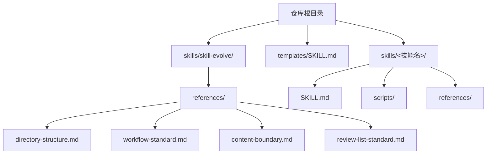
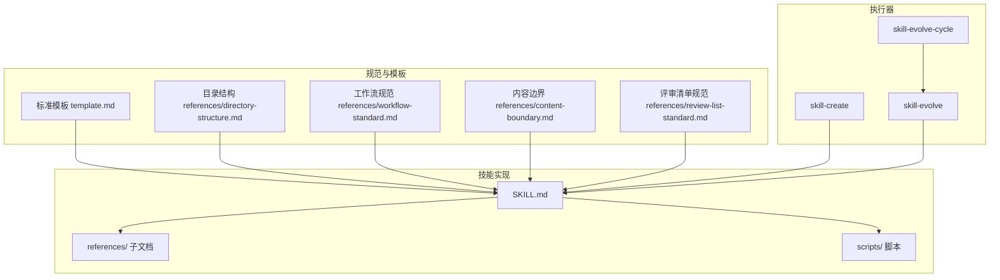
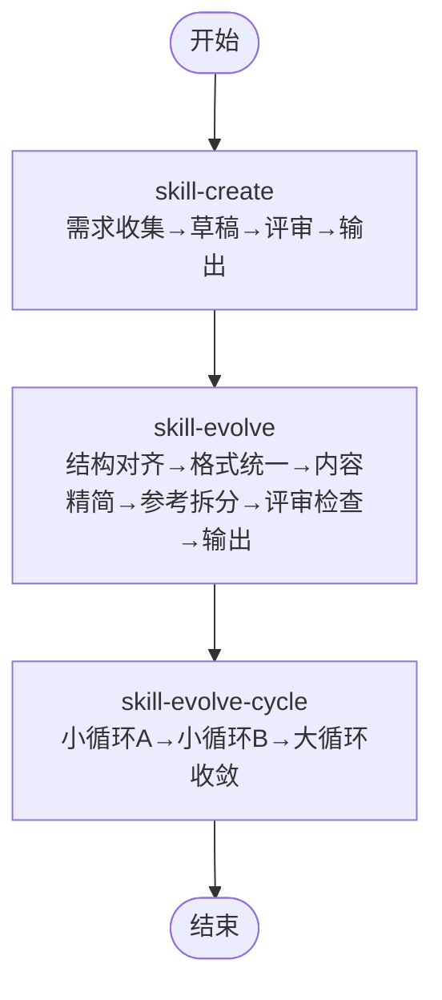
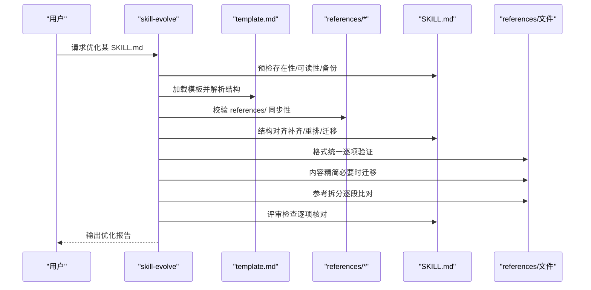
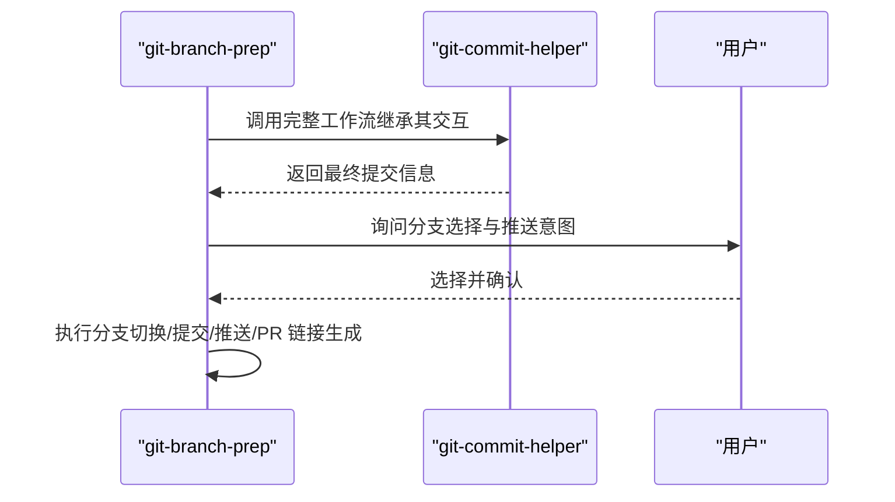
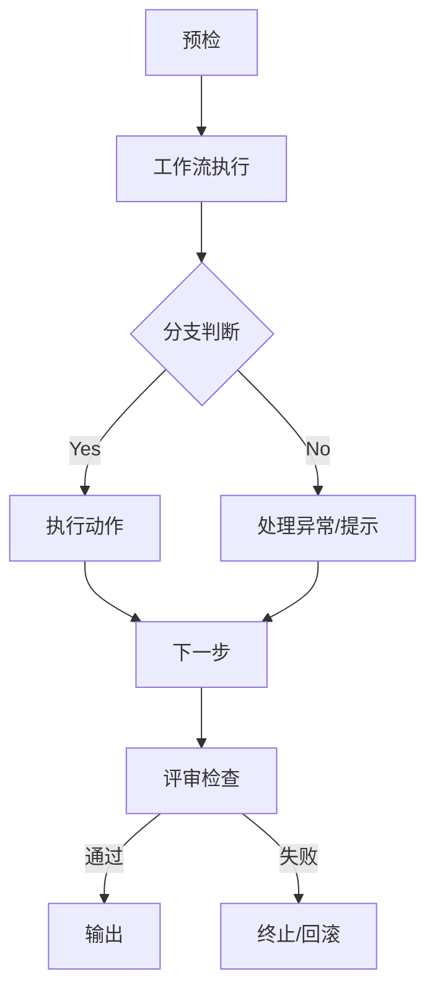
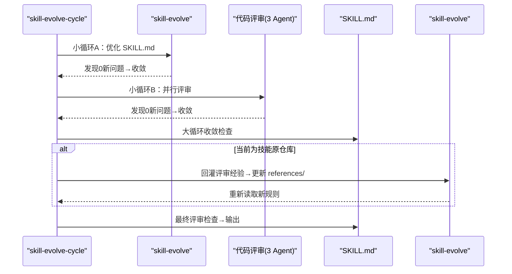
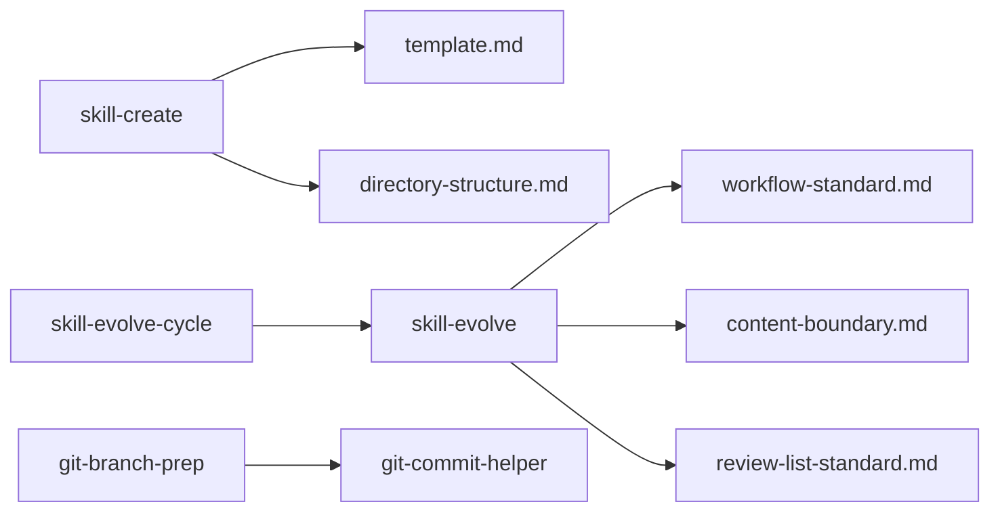

# 核心概念

<cite>
**本文引用的文件**
- [README.md](file://README.md)
- [templates/SKILL.md](file://templates/SKILL.md)
- [skills/skill-create/SKILL.md](file://skills/skill-create/SKILL.md)
- [skills/skill-evolve/SKILL.md](file://skills/skill-evolve/SKILL.md)
- [skills/skill-evolve/template.md](file://skills/skill-evolve/template.md)
- [skills/skill-evolve/references/directory-structure.md](file://skills/skill-evolve/references/directory-structure.md)
- [skills/skill-evolve/references/workflow-standard.md](file://skills/skill-evolve/references/workflow-standard.md)
- [skills/skill-evolve/references/content-boundary.md](file://skills/skill-evolve/references/content-boundary.md)
- [skills/skill-evolve/references/review-list-standard.md](file://skills/skill-evolve/references/review-list-standard.md)
- [skills/skill-evolve-cycle/SKILL.md](file://skills/skill-evolve-cycle/SKILL.md)
- [skills/git-branch-prep/SKILL.md](file://skills/git-branch-prep/SKILL.md)
- [skills/zoom-out/SKILL.md](file://skills/zoom-out/SKILL.md)
</cite>

## 目录
1. [引言](#引言)
2. [项目结构](#项目结构)
3. [核心组件](#核心组件)
4. [架构总览](#架构总览)
5. [详细组件分析](#详细组件分析)
6. [依赖分析](#依赖分析)
7. [性能考虑](#性能考虑)
8. [故障排查指南](#故障排查指南)
9. [结论](#结论)
10. [附录](#附录)

## 引言
本文件面向 Skills Collection 项目，系统化阐述 Agent Skills 规范的核心理念与设计原则，聚焦“技能（Skill）”的概念、结构与生命周期，技能模板体系与标准化流程，以及技能之间的依赖与组合方式。文档同时给出技能执行的标准化流程与接口规范，并通过真实技能示例帮助初学者建立概念框架，为高级用户提供深入的技术洞察与最佳实践。

## 项目结构
Skills Collection 将每个技能封装为一个自包含目录，遵循统一的 SKILL.md 结构与可选的 references/、scripts/ 等辅助目录。根目录 README 提供技能清单与安装指引；模板与规范位于 skills/skill-evolve 下，支撑技能的创建、演进与循环优化。

图表来源
- [README.md:1-113](file://README.md#L1-L113)
- [templates/SKILL.md:1-30](file://templates/SKILL.md#L1-L30)
- [skills/skill-evolve/references/directory-structure.md:1-46](file://skills/skill-evolve/references/directory-structure.md#L1-L46)

章节来源
- [README.md:1-113](file://README.md#L1-L113)
- [templates/SKILL.md:1-30](file://templates/SKILL.md#L1-L30)
- [skills/skill-evolve/references/directory-structure.md:1-46](file://skills/skill-evolve/references/directory-structure.md#L1-L46)

## 核心组件
- 技能（Skill）
  - 定义：围绕特定任务域的可执行单元，以 SKILL.md 为核心，辅以 references/、scripts/ 等组织内容与工具。
  - 结构：遵循模板标准的八段式结构（概述、定义、前置条件、工作流、规则、示例、评审清单、参考），并强制包含三类“安全步骤”（预检、评审检查、输出）。
  - 生命周期：从创建到演进再到循环优化，贯穿“结构对齐—格式统一—内容精简—参考拆分—评审校验—结果输出”的闭环。
- 模板系统
  - 标准模板：提供统一的职责边界与写作指导，确保所有技能在结构与表达上保持一致。
  - 参考规范：通过 references/ 文件承载行为标准、交互范式、排版约定等，避免重复内嵌。
- 执行引擎
  - skill-create：引导用户完成新技能的创建，采用“需求收集—目录结构—草稿—评审—复核—输出”的流水线。
  - skill-evolve：对既有 SKILL.md 进行结构对齐、格式统一、内容精简与参考拆分，配套评审清单与防御机制。
  - skill-evolve-cycle：在优化与评审之间交替进行的大循环，支持收敛判断、回溯与经验回灌。

章节来源
- [skills/skill-create/SKILL.md:1-447](file://skills/skill-create/SKILL.md#L1-L447)
- [skills/skill-evolve/SKILL.md:1-371](file://skills/skill-evolve/SKILL.md#L1-L371)
- [skills/skill-evolve/template.md:1-247](file://skills/skill-evolve/template.md#L1-L247)
- [skills/skill-evolve/references/workflow-standard.md:1-800](file://skills/skill-evolve/references/workflow-standard.md#L1-L800)

## 架构总览
下图展示技能规范的总体架构：模板与规范作为“契约”，技能作为“实现体”，执行器（创建/演进/循环）负责把契约转化为可维护的高质量技能资产。

图表来源
- [skills/skill-evolve/template.md:1-247](file://skills/skill-evolve/template.md#L1-L247)
- [skills/skill-evolve/references/directory-structure.md:1-46](file://skills/skill-evolve/references/directory-structure.md#L1-L46)
- [skills/skill-evolve/references/workflow-standard.md:1-800](file://skills/skill-evolve/references/workflow-standard.md#L1-L800)
- [skills/skill-evolve/references/content-boundary.md:1-32](file://skills/skill-evolve/references/content-boundary.md#L1-L32)
- [skills/skill-evolve/references/review-list-standard.md:1-35](file://skills/skill-evolve/references/review-list-standard.md#L1-L35)
- [skills/skill-create/SKILL.md:1-447](file://skills/skill-create/SKILL.md#L1-L447)
- [skills/skill-evolve/SKILL.md:1-371](file://skills/skill-evolve/SKILL.md#L1-L371)
- [skills/skill-evolve-cycle/SKILL.md:1-308](file://skills/skill-evolve-cycle/SKILL.md#L1-L308)

## 详细组件分析

### 组件一：技能（Skill）的概念、结构与生命周期
- 概念定义
  - 技能是面向具体任务域的可执行单元，强调“做什么、何时触发、如何做”。其核心是 SKILL.md，辅以 references/ 的规范与 scripts/ 的可执行脚本。
- 结构组成
  - 八段式结构：概述、定义、前置条件、工作流、规则、示例、评审清单、参考。
  - 安全步骤：预检、评审检查、输出，贯穿始终，保证环境就绪、质量可控与结果可验证。
- 生命周期
  - 创建阶段：由 skill-create 引导完成草稿与评审，形成初版 SKILL.md。
  - 演进阶段：由 skill-evolve 对结构、格式、内容与参考进行标准化与拆分，持续提升可读性与可维护性。
  - 循环阶段：由 skill-evolve-cycle 在“优化—评审—修复—合并—回灌”之间迭代，直至收敛。

图表来源
- [skills/skill-create/SKILL.md:25-88](file://skills/skill-create/SKILL.md#L25-L88)
- [skills/skill-evolve/SKILL.md:30-172](file://skills/skill-evolve/SKILL.md#L30-L172)
- [skills/skill-evolve-cycle/SKILL.md:45-151](file://skills/skill-evolve-cycle/SKILL.md#L45-L151)

章节来源
- [skills/skill-create/SKILL.md:13-88](file://skills/skill-create/SKILL.md#L13-L88)
- [skills/skill-evolve/SKILL.md:14-172](file://skills/skill-evolve/SKILL.md#L14-L172)
- [skills/skill-evolve/template.md:8-76](file://skills/skill-evolve/template.md#L8-L76)

### 组件二：技能模板系统与标准化流程
- 标准模板（template.md）
  - 明确各段落职责与写作规范，约束元数据、结构、内容、行为、防御与验证维度。
  - 强制要求“安全步骤”与“评审检查示例”“输出示例”，确保执行与验收的一致性。
- 参考规范（references/*）
  - 目录结构：定义 SKILL 目录与 references/ 文件的格式与职责边界。
  - 工作流规范：定义步骤编号、标题命名、子步骤结构、条件分支树箭头格式、循环与跨步引用等。
  - 内容边界：明确哪些内容属于 SKILL.md，哪些属于 references/ 文件，避免重复与分散。
  - 评审清单规范：区分 Meta-skill 与 Domain/Action skill 的评审重点，建议按维度分组。
- 标准化流程
  - 预检：校验目标文件存在性、模板可用性、references/ 同步性与原始内容备份。
  - 结构对齐：补齐缺失段落、重排顺序、迁移非标准段落到 references/。
  - 格式统一：逐项对照参考文件的“验证清单”，修正不合规项。
  - 内容精简：控制 SKILL.md 行数，必要时迁移到 references/ 并更新链接。
  - 参考拆分：将 REFERENCE.md 拆分为多个文件，逐段比对确保无遗漏。
  - 评审检查：逐项核对评审清单，记录失败项并按“防御标准”处理。
  - 输出：生成对比报告，仅列出变更维度，通知完成。

图表来源
- [skills/skill-evolve/SKILL.md:32-172](file://skills/skill-evolve/SKILL.md#L32-L172)
- [skills/skill-evolve/template.md:53-247](file://skills/skill-evolve/template.md#L53-L247)
- [skills/skill-evolve/references/workflow-standard.md:19-800](file://skills/skill-evolve/references/workflow-standard.md#L19-L800)
- [skills/skill-evolve/references/content-boundary.md:7-32](file://skills/skill-evolve/references/content-boundary.md#L7-L32)
- [skills/skill-evolve/references/review-list-standard.md:17-35](file://skills/skill-evolve/references/review-list-standard.md#L17-L35)

章节来源
- [skills/skill-evolve/template.md:1-247](file://skills/skill-evolve/template.md#L1-L247)
- [skills/skill-evolve/references/directory-structure.md:1-46](file://skills/skill-evolve/references/directory-structure.md#L1-L46)
- [skills/skill-evolve/references/workflow-standard.md:1-800](file://skills/skill-evolve/references/workflow-standard.md#L1-L800)
- [skills/skill-evolve/references/content-boundary.md:1-32](file://skills/skill-evolve/references/content-boundary.md#L1-L32)
- [skills/skill-evolve/references/review-list-standard.md:1-35](file://skills/skill-evolve/references/review-list-standard.md#L1-L35)

### 组件三：技能之间的依赖关系与组合方式
- 组合方式
  - 串行组合：在一个技能的工作流中调用另一个技能（如 git-branch-prep 调用 git-commit-helper），严格遵循被调用技能的交互逻辑，不得跳过 AskUserQuestion 步骤。
  - 分层依赖：通过 references/ 引用规范文件（如分支命名规则、PR 链接标准），确保一致性与可维护性。
- 依赖管理
  - 强制同步：当被依赖的规范文件发生变更时，需同步更新引用处的锚点与断言。
  - 自我演化：当目标为 skill-evolve 自身时，需额外校验 template.md 的一致性与同步更新。

图表来源
- [skills/git-branch-prep/SKILL.md:43-61](file://skills/git-branch-prep/SKILL.md#L43-L61)

章节来源
- [skills/git-branch-prep/SKILL.md:1-276](file://skills/git-branch-prep/SKILL.md#L1-L276)

### 组件四：技能执行的标准化流程与接口规范
- 接口规范
  - 交互接口：所有涉及用户决策的环节必须使用 AskUserQuestion 工具，选项结构化传递，单次调用不超过 4 个问题。
  - 条件分支：统一使用树箭头格式（Yes -> / No ->），每条分支以分号结尾，明确终止或继续路径。
  - 步骤编号：顶层步骤从 0 开始递增，子步骤使用常规列表或数字编号（仅在存在跨步引用时）。
- 执行流程
  - 预检：校验前置条件、模板与 references/ 同步性，保存原始内容副本用于回滚。
  - 主流程：按步骤执行，遇到异常按“防御标准”处理，必要时回滚。
  - 评审检查：逐项核对评审清单，失败则终止并记录原因。
  - 输出：生成结构化摘要，仅列出变更维度，通知完成。

图表来源
- [skills/skill-evolve/references/workflow-standard.md:185-378](file://skills/skill-evolve/references/workflow-standard.md#L185-L378)
- [skills/skill-evolve/SKILL.md:32-172](file://skills/skill-evolve/SKILL.md#L32-L172)

章节来源
- [skills/skill-evolve/references/workflow-standard.md:185-378](file://skills/skill-evolve/references/workflow-standard.md#L185-L378)
- [skills/skill-evolve/SKILL.md:32-172](file://skills/skill-evolve/SKILL.md#L32-L172)

### 组件五：技能模板与参考规范的映射关系
- 内容边界
  - 工作流结构/安全步骤/步骤格式/分支逻辑/交互范式 → references/workflow-standard.md
  - 标点/引号/括号/全半角 → references/punctuation-convention.md
  - 文本简化规则/安全边界 → references/text-optimization.md
  - 示例格式规范/一致性规则 → references/example-standard.md
  - 目录结构与 references/ 文件规范 → references/directory-structure.md
  - 规则写作规范 → references/rules-standard.md
  - 评审清单写作规范 → references/review-list-standard.md
- 使用建议
  - 优先通过锚点引用参考文件中的“验证清单”，避免重复内嵌。
  - Meta-skill 的评审清单应覆盖结构完整性与一致性，Domain/Action skill 的评审清单应聚焦输出质量。

章节来源
- [skills/skill-evolve/references/content-boundary.md:7-32](file://skills/skill-evolve/references/content-boundary.md#L7-L32)
- [skills/skill-evolve/references/review-list-standard.md:17-35](file://skills/skill-evolve/references/review-list-standard.md#L17-L35)

### 组件六：循环演进（skill-evolve-cycle）与收敛策略
- 大循环阶段
  - 小循环 A：使用 skill-evolve 优化 SKILL.md，直到发现 0 新问题（收敛）。
  - 小循环 B：通过代码评审（Completeness/Correctness/Impact 三个 Agent 并行）发现并修复问题，直到 0 新问题（收敛）。
  - 大循环收敛：小循环 A 第一轮 0 问题 且 小循环 B 第一轮 0 问题，则进入评审检查与输出。
- 回溯与经验回灌
  - 当当前工作区为技能原仓库时，在合并阶段将评审经验回灌至 skill-evolve 的 references/ 文件，随后重新读取以使新规则生效。
- 报告与状态
  - 每轮生成 cycle{round}-A-{iteration}.md、cycle{round}-B-{iteration}.md、cycle{round}-B-{iteration}-fix{fix-round}.md、cycle{round}-summary.md 与 final-summary.md，标注收敛状态与强制退出场景。

图表来源
- [skills/skill-evolve-cycle/SKILL.md:45-151](file://skills/skill-evolve-cycle/SKILL.md#L45-L151)

章节来源
- [skills/skill-evolve-cycle/SKILL.md:1-308](file://skills/skill-evolve-cycle/SKILL.md#L1-L308)

### 组件七：典型技能示例与最佳实践
- git-branch-prep
  - 串联调用 git-commit-helper 生成提交信息，再派生分支名，经用户确认后执行提交、推送与 PR 链接生成。
  - 关键点：严格使用 NO_VERIFY=1 提交，避免钩子阻塞；受保护分支直接提交的处理；PR 链接优先从推送输出提取，否则基于远程 URL 动态构建。
- zoom-out
  - 从更高抽象层级生成模块地图，展示上游调用者与下游依赖，使用项目领域术语，输出结构化地图而非长篇描述。
  - 关键点：最多 3 次重试生成结构化模块地图；评审检查覆盖内容完整性与格式一致性。

章节来源
- [skills/git-branch-prep/SKILL.md:1-276](file://skills/git-branch-prep/SKILL.md#L1-L276)
- [skills/zoom-out/SKILL.md:1-190](file://skills/zoom-out/SKILL.md#L1-L190)

## 依赖分析
- 组件耦合
  - skill-create 依赖 skill-evolve 的模板与目录结构规范，确保新技能从起点即符合标准。
  - skill-evolve 依赖 references/* 规范文件，形成“契约—实现—校验”的闭环。
  - skill-evolve-cycle 依赖 skill-evolve 的执行能力与评审 Agent 的并行能力，形成“自动连续执行—收敛—回灌”的闭环。
- 外部依赖
  - Git 工具链（版本、钩子、远程仓库）、JSON 解析器（jq）等环境依赖需在预检阶段校验。
- 潜在风险
  - 缺失 references/ 文件或锚点不一致会导致评审失败。
  - 跨步引用未按规范编号或分支极性不匹配可能导致执行歧义。

图表来源
- [skills/skill-create/SKILL.md:21-23](file://skills/skill-create/SKILL.md#L21-L23)
- [skills/skill-evolve/SKILL.md:37-46](file://skills/skill-evolve/SKILL.md#L37-L46)
- [skills/skill-evolve-cycle/SKILL.md:42-62](file://skills/skill-evolve-cycle/SKILL.md#L42-L62)
- [skills/git-branch-prep/SKILL.md:43-48](file://skills/git-branch-prep/SKILL.md#L43-L48)

章节来源
- [skills/skill-create/SKILL.md:21-23](file://skills/skill-create/SKILL.md#L21-L23)
- [skills/skill-evolve/SKILL.md:37-46](file://skills/skill-evolve/SKILL.md#L37-L46)
- [skills/skill-evolve-cycle/SKILL.md:42-62](file://skills/skill-evolve-cycle/SKILL.md#L42-L62)
- [skills/git-branch-prep/SKILL.md:43-48](file://skills/git-branch-prep/SKILL.md#L43-L48)

## 性能考虑
- 执行效率
  - 将复杂内容迁移到 references/ 可显著降低 SKILL.md 行数，提升加载与渲染性能。
  - 评审检查采用锚点引用参考文件的“验证清单”，减少重复扫描与比对成本。
- 资源占用
  - 并行评审 Agent 的数量与执行时间需平衡，避免资源争用导致超时。
- 可维护性
  - 通过“内容边界”与“工作流规范”减少重复与歧义，降低长期维护成本。

## 故障排查指南
- 常见问题
  - 预检失败：目标文件不存在或不可读、模板缺失或不可解析、references/ 不同步。
  - 评审失败：评审清单未覆盖规则约束、锚点缺失或格式不一致、输出不符合示例规范。
  - 执行异常：文件写入失败、链接更新后出现死链、跨步引用未按规范编号。
- 处理策略
  - 恢复机制：利用预检阶段保存的原始内容副本进行回滚，仅恢复 SKILL.md，新增文件需手动清理。
  - 降级策略：在固定重试次数内（如 2-3 次）允许记录失败项并继续，但需在 Workflow 中显式声明。
  - 强制退出：当达到最大迭代限制或环境不可用时，标注状态并生成最终报告。

章节来源
- [skills/skill-evolve/SKILL.md:208-214](file://skills/skill-evolve/SKILL.md#L208-L214)
- [skills/skill-evolve-cycle/SKILL.md:154-165](file://skills/skill-evolve-cycle/SKILL.md#L154-L165)

## 结论
Skills Collection 通过“模板—规范—执行器—循环”的整体设计，实现了技能资产的标准化、可演进与可持续优化。技能不仅是任务的执行单元，更是知识与工程规范的载体。遵循统一的结构、交互与评审标准，能够显著提升团队协作效率与技能质量，为复杂工程场景提供稳定可扩展的能力基座。

## 附录
- 安装与使用
  - 支持 npx 一键安装全部或指定技能，也支持脚本安装与本地安装。
- 术语表
  - 安全步骤：预检、评审检查、输出。
  - 内容边界：SKILL.md 与 references/ 的职责划分。
  - 自我演化：目标为 skill-evolve 自身时的特殊处理。

章节来源
- [README.md:22-64](file://README.md#L22-L64)