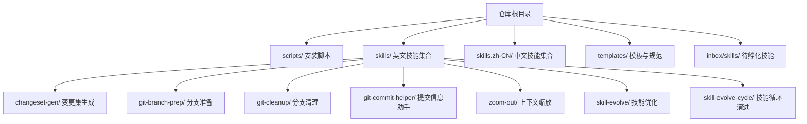
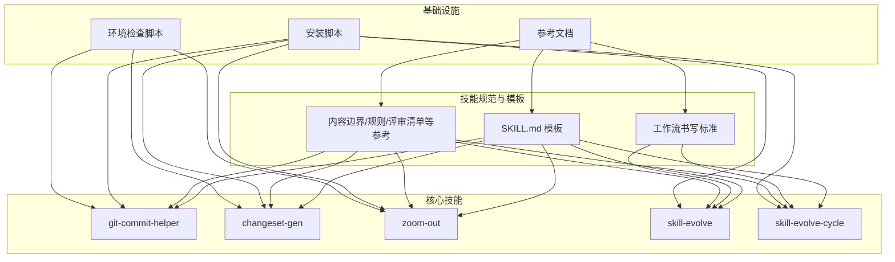
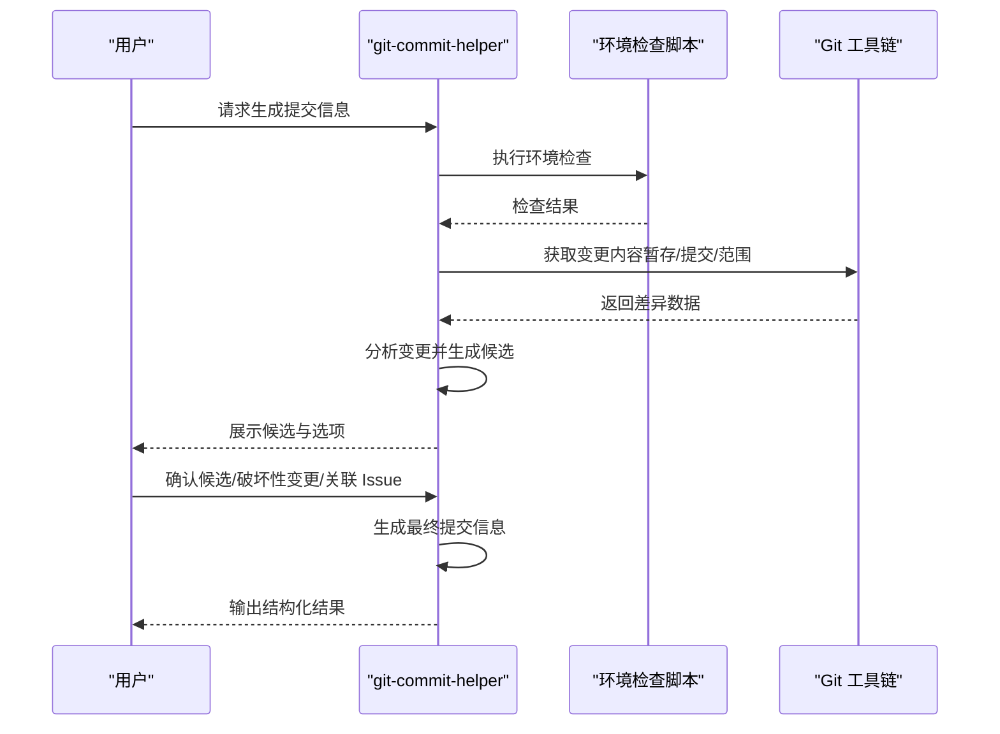
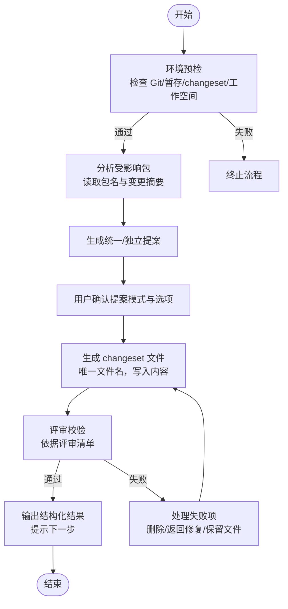
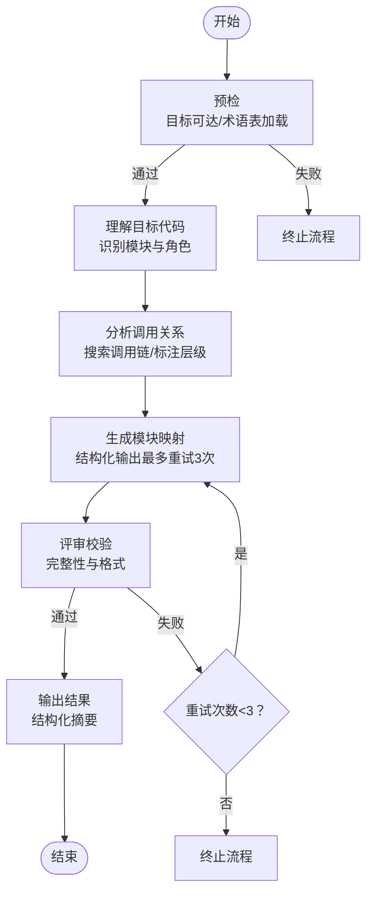
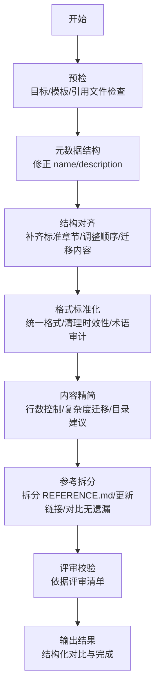
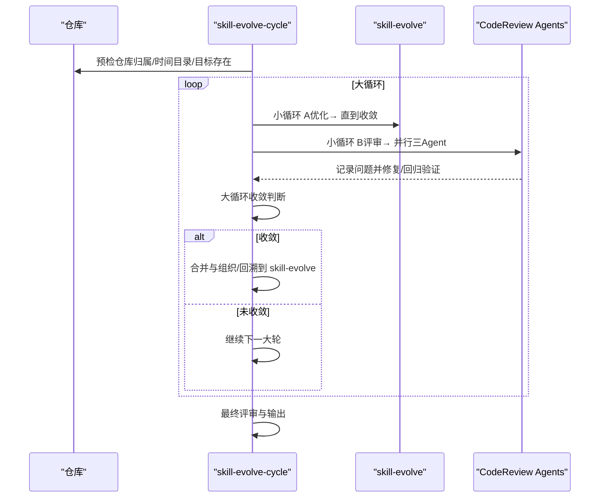
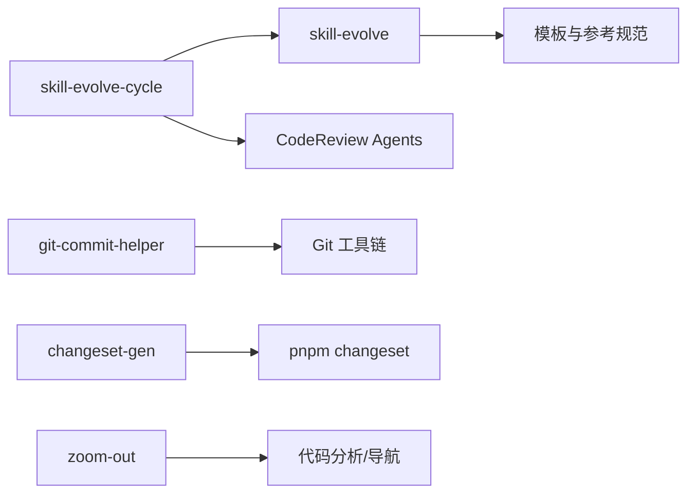

# 项目介绍

<cite>
**本文档引用的文件**
- [README.md](file://README.md)
- [README.zh-CN.md](file://README.zh-CN.md)
- [install-skills.sh](file://scripts/install-skills.sh)
- [SKILL.md](file://skills/skill-evolve/SKILL.md)
- [template.md](file://skills/skill-evolve/template.md)
- [workflow-standard.md](file://skills/skill-evolve/references/workflow-standard.md)
- [SKILL.md](file://skills/zoom-out/SKILL.md)
- [SKILL.md](file://skills/git-commit-helper/SKILL.md)
- [SKILL.md](file://skills/changeset-gen/SKILL.md)
- [SKILL.md](file://skills/skill-evolve-cycle/SKILL.md)
</cite>

## 目录
1. [引言](#引言)
2. [项目结构](#项目结构)
3. [核心组件](#核心组件)
4. [架构总览](#架构总览)
5. [详细组件分析](#详细组件分析)
6. [依赖关系分析](#依赖关系分析)
7. [性能考量](#性能考量)
8. [故障排查指南](#故障排查指南)
9. [结论](#结论)
10. [附录](#附录)

## 引言
Skills Collection 是一个面向软件开发自动化的“技能集合”，旨在通过标准化的 Agent Skills 规范，将重复性、可流程化的工作封装为“技能”（Skill），让 AI 助手在合适的场景下自动触发并执行，从而显著提升开发效率与质量一致性。项目以“可演进”的知识资产为核心，围绕 SKILL.md 文档模板与参考规范，形成从“创建—优化—评审—合并—反馈”的闭环，持续改进技能质量与可维护性。

- 核心价值主张
  - 降低重复劳动：将常见任务（如生成提交信息、清理分支、生成变更集等）自动化，减少手动操作与出错概率。
  - 统一规范与质量：通过统一的模板、规则与评审清单，确保技能文档与实现的一致性与可维护性。
  - 可演进的知识资产：支持对现有技能进行结构化优化、内容提炼与参考文档拆分，并通过循环评审与回溯机制持续完善。
  - 开放协作：开源 MIT 许可，欢迎社区贡献与扩展，共同建设高质量的技能生态。

- 项目定位
  - 在软件开发自动化领域，Skills Collection 提供“可组合、可演进、可复用”的技能体系，覆盖版本控制、发布流程、代码分析与工程治理等关键环节，帮助团队建立“技能即资产”的知识管理与自动化实践。

- 社区与贡献
  - 采用 MIT 许可，开放源代码，鼓励社区参与贡献与改进。
  - 通过统一的 Agent Skills 规范与模板，降低贡献门槛，便于开发者快速创建与优化技能。

- 发展历程与未来规划
  - 历史：项目早期包含若干已废弃技能与命令，现已逐步迁移与替代，保留核心能力与最佳实践。
  - 成就：形成完整的技能生命周期管理（创建、优化、评审、合并、反馈），并提供多类实用技能（如 Git 协作、变更集生成、上下文缩放等）。
  - 规划：持续完善技能模板与参考规范，增强自动化评审与回溯能力，扩大技能覆盖面与社区参与度。

**章节来源**
- [README.md:1-113](file://README.md#L1-L113)
- [README.zh-CN.md:1-113](file://README.zh-CN.md#L1-L113)

## 项目结构
项目采用“技能即目录”的组织方式，每个技能都是一个独立的目录，内部包含 SKILL.md 文档与可选的脚本、参考文件等。根目录提供安装脚本与中文/英文双语资源，部分技能提供 zh-CN 对应版本。

- 根目录与关键文件
  - README 与 README.zh-CN：项目说明与安装指引。
  - scripts：安装脚本，支持远程与本地安装两种模式。
  - skills 与 skills.zh-CN：英文与中文技能集合，按功能划分。
  - templates：通用 SKILL.md 模板与参考规范。
  - inbox/skills：待孵化或示例技能集合。

- 技能目录结构示例
  - 每个技能目录包含：
    - SKILL.md：技能规范文档，定义概述、工作流、规则、示例与参考。
    - scripts/：可选的环境检查与辅助脚本。
    - references/：可选的参考文档与规范链接。

**图表来源**
- [README.md:5-21](file://README.md#L5-L21)
- [README.zh-CN.md:5-21](file://README.zh-CN.md#L5-L21)

**章节来源**
- [README.md:1-113](file://README.md#L1-L113)
- [README.zh-CN.md:1-113](file://README.zh-CN.md#L1-L113)

## 核心组件
- 技能规范与模板
  - SKILL.md 模板：定义技能文档的标准结构（概述、定义、前置条件、工作流、规则、示例、评审清单、参考）。
  - 参考规范：包括工作流书写标准、内容边界、规则与评审清单写作标准等，确保技能实现一致且可验证。

- 核心技能
  - git-commit-helper：基于 Conventional Commits 规范生成提交信息，支持多种输入源与交互确认。
  - changeset-gen：根据暂存变更分析受影响包并生成 pnpm changeset 文件，支持统一/独立提案模式。
  - zoom-out：从更高抽象层生成模块映射与调用关系，帮助理解代码在整体架构中的位置。
  - skill-evolve：对现有 SKILL.md 进行结构化优化、内容提炼与参考文档拆分。
  - skill-evolve-cycle：驱动“优化—评审—修复—合并—回溯”的循环演进，直至收敛。

- 安装与运行
  - 支持通过 npx skills 或一键脚本安装，自动选择语言并复制技能到目标目录；支持本地仓库直装与远程克隆两种模式。

**章节来源**
- [SKILL.md:1-371](file://skills/skill-evolve/SKILL.md#L1-L371)
- [template.md:1-247](file://skills/skill-evolve/template.md#L1-L247)
- [SKILL.md:1-190](file://skills/zoom-out/SKILL.md#L1-L190)
- [SKILL.md:1-296](file://skills/git-commit-helper/SKILL.md#L1-L296)
- [SKILL.md:1-284](file://skills/changeset-gen/SKILL.md#L1-L284)
- [SKILL.md:1-308](file://skills/skill-evolve-cycle/SKILL.md#L1-L308)
- [install-skills.sh:1-146](file://scripts/install-skills.sh#L1-L146)

## 架构总览
Skills Collection 的架构围绕“技能即文档”的理念构建，通过统一的模板与参考规范，将技能的“意图—流程—约束—验证—产出”完整表达，并由 AI 助手在合适时机自动执行。

**图表来源**
- [template.md:1-247](file://skills/skill-evolve/template.md#L1-L247)
- [workflow-standard.md:1-200](file://skills/skill-evolve/references/workflow-standard.md#L1-L200)
- [SKILL.md:1-296](file://skills/git-commit-helper/SKILL.md#L1-L296)
- [SKILL.md:1-284](file://skills/changeset-gen/SKILL.md#L1-L284)
- [SKILL.md:1-190](file://skills/zoom-out/SKILL.md#L1-L190)
- [SKILL.md:1-371](file://skills/skill-evolve/SKILL.md#L1-L371)
- [SKILL.md:1-308](file://skills/skill-evolve-cycle/SKILL.md#L1-L308)
- [install-skills.sh:1-146](file://scripts/install-skills.sh#L1-L146)

## 详细组件分析

### 技能规范与模板（Agent Skills 规范）
- 设计理念
  - 以“文档即规范”的方式，将技能的意图、流程、规则与验证统一表达，便于 AI 自动解析与执行。
  - 通过“安全步骤”（Pre-check、Review Check、Output）保障执行质量与可追溯性。
  - 通过“参考规范”（工作流书写标准、内容边界、规则与评审清单等）约束实现行为，确保一致性与可维护性。

- 关键要素
  - 概述：清晰描述技能做什么、解决什么问题、何时触发。
  - 定义：术语与跨步骤变量定义，便于后续执行指令理解。
  - 前置条件：依赖工具、环境与权限等。
  - 工作流：分步骤的可执行流程，包含分支逻辑与交互模式。
  - 规则：行为约束与错误处理策略。
  - 示例：对话交互、评审检查与输出示例。
  - 评审清单：逐项验证输出质量。
  - 参考：相关规范与外部资源链接。

- 复杂度与性能
  - 通过“内容边界”与“参考文档拆分”降低 SKILL.md 的体量，提升可读性与维护性。
  - “格式统一化”与“文本简化规则”减少冗余，避免过度压缩影响可读性。

**章节来源**
- [template.md:1-247](file://skills/skill-evolve/template.md#L1-L247)
- [workflow-standard.md:1-200](file://skills/skill-evolve/references/workflow-standard.md#L1-L200)
- [SKILL.md:1-371](file://skills/skill-evolve/SKILL.md#L1-L371)

### git-commit-helper（提交信息助手）
- 功能概述
  - 基于 Conventional Commits 规范生成提交信息，支持多种输入源（暂存区、单次提交、分支范围）与交互确认。
  - 自动分析变更类型、作用域与破坏性变更标记，输出候选列表供用户选择。

- 处理逻辑
  - 环境预检：检查 Git 状态、依赖工具与变更存在性。
  - 输入识别：根据用户输入或默认场景确定分析范围。
  - 变更分析：按文件类型分析差异，生成变更摘要与候选。
  - 用户确认：交互式选择候选、确认破坏性变更与关联 Issue。
  - 评审校验：依据评审清单逐项验证输出质量。
  - 结果输出：结构化总结与最终提交信息。

**图表来源**
- [SKILL.md:1-296](file://skills/git-commit-helper/SKILL.md#L1-L296)

**章节来源**
- [SKILL.md:1-296](file://skills/git-commit-helper/SKILL.md#L1-L296)

### changeset-gen（变更集生成）
- 功能概述
  - 基于暂存变更分析受影响包，自动生成 pnpm changeset 版本变更文件，支持统一/独立提案模式。
  - 仅负责文件生成，不涉及分支创建、提交与推送，职责单一明确。

- 处理逻辑
  - 环境预检：检查 Git 仓库、暂存变更、pnpm changeset 与工作空间配置。
  - 影响分析：解析变更文件路径，识别受影响包并读取包名。
  - 提案生成：生成统一/独立两类提案，包含版本变更级别与变更摘要。
  - 用户确认：选择提案模式与具体选项，支持自定义。
  - 文件生成：为每个受影响包生成唯一文件名的 changeset 文件。
  - 评审校验：依据评审清单验证生成结果。
  - 结果输出：结构化总结与下一步提示。

**图表来源**
- [SKILL.md:1-284](file://skills/changeset-gen/SKILL.md#L1-L284)

**章节来源**
- [SKILL.md:1-284](file://skills/changeset-gen/SKILL.md#L1-L284)

### zoom-out（上下文缩放）
- 功能概述
  - 当用户对某段代码不熟悉时，触发“缩放”视角：向上抽象一层，生成全局模块映射与调用关系，帮助理解代码在整体架构中的位置与角色。
  - 输出采用结构化映射格式，避免长篇描述，聚焦关键关系。

- 处理逻辑
  - 预检：确保目标代码可达，尝试加载项目术语表。
  - 理解目标：识别模块与架构角色。
  - 分析关系：搜索调用链，标注模块层级。
  - 生成映射：结构化输出模块映射，最多重试三次。
  - 评审校验：依据评审清单逐项验证输出完整性与格式。
  - 结果输出：结构化摘要与完成通知。

**图表来源**
- [SKILL.md:1-190](file://skills/zoom-out/SKILL.md#L1-L190)

**章节来源**
- [SKILL.md:1-190](file://skills/zoom-out/SKILL.md#L1-L190)

### skill-evolve（技能优化）
- 功能概述
  - 对现有 SKILL.md 进行结构化优化：对齐模板、精简冗余、拆分参考文档，提升可读性与可维护性。
  - 包含元数据结构、结构对齐、格式标准化、内容精简与参考拆分等阶段，并提供评审与输出。

- 处理逻辑
  - 预检：检查目标 SKILL.md、模板与 references/ 文件存在性与同步性。
  - 元数据结构：修正 name/description 等字段。
  - 结构对齐：补齐缺失标准章节，调整顺序，迁移非标准内容至 references/。
  - 格式标准化：统一格式、清理时效性信息、替换抽象变量名、术语引用完整性审计。
  - 内容精简：控制行数、复杂度迁移、建议引入扩展目录。
  - 参考拆分：拆分 REFERENCE.md 为多个文件，更新链接并对比原文无遗漏。
  - 评审校验：依据评审清单逐项验证。
  - 输出结果：结构化对比与完成通知。

**图表来源**
- [SKILL.md:1-371](file://skills/skill-evolve/SKILL.md#L1-L371)

**章节来源**
- [SKILL.md:1-371](file://skills/skill-evolve/SKILL.md#L1-L371)

### skill-evolve-cycle（技能循环演进）
- 功能概述
  - 驱动“优化—评审—修复—合并—回溯”的循环演进，交替由 skill-evolve（优化阶段）与 Code Review（评审阶段）推动，直至收敛。
  - 支持严重性分级（高/中/低）、收敛条件判断与报告持久化。

- 处理逻辑
  - 预检：判断仓库归属、创建时间目录、检查目标 SKILL.md 与 skill-evolve 可用性。
  - 小循环 A（优化）：使用 skill-evolve 优化目标 SKILL.md，直到收敛。
  - 小循环 B（评审）：并行调度三个 CodeReview Agent（完整性/正确性/影响）进行评审，记录问题并修复，回归验证直至收敛。
  - 大循环收敛判断：小循环 A 第一轮无问题且小循环 B 第一轮无问题时收敛。
  - 合并与组织：分类汇总问题，按分支路由处理。
  - 回溯到 skill-evolve：在原仓库场景下将评审经验回溯到 skill-evolve 的 SKILL.md 或 references/ 文件。
  - 大循环迭代控制：统计报告并检查迭代上限，达到上限则终止并标记状态。
  - 最终评审与输出：依据评审清单验证后输出最终报告。

**图表来源**
- [SKILL.md:1-308](file://skills/skill-evolve-cycle/SKILL.md#L1-L308)

**章节来源**
- [SKILL.md:1-308](file://skills/skill-evolve-cycle/SKILL.md#L1-L308)

## 依赖关系分析
- 组件耦合与内聚
  - 技能之间相对独立，通过统一的模板与参考规范实现高内聚、低耦合。
  - skill-evolve 与 skill-evolve-cycle 作为元技能，依赖模板与参考规范，支撑其他技能的优化与演进。

- 外部依赖与集成点
  - Git 工具链：用于变更分析、分支与提交信息处理。
  - pnpm changeset：用于 monorepo 的版本变更文件生成。
  - CodeReview Agents：用于评审与质量保证。
  - 安装脚本：提供一键安装与语言选择，支持本地与远程两种模式。

**图表来源**
- [SKILL.md:1-371](file://skills/skill-evolve/SKILL.md#L1-L371)
- [SKILL.md:1-308](file://skills/skill-evolve-cycle/SKILL.md#L1-L308)
- [SKILL.md:1-296](file://skills/git-commit-helper/SKILL.md#L1-L296)
- [SKILL.md:1-284](file://skills/changeset-gen/SKILL.md#L1-L284)
- [SKILL.md:1-190](file://skills/zoom-out/SKILL.md#L1-L190)

**章节来源**
- [SKILL.md:1-371](file://skills/skill-evolve/SKILL.md#L1-L371)
- [SKILL.md:1-308](file://skills/skill-evolve-cycle/SKILL.md#L1-L308)
- [SKILL.md:1-296](file://skills/git-commit-helper/SKILL.md#L1-L296)
- [SKILL.md:1-284](file://skills/changeset-gen/SKILL.md#L1-L284)
- [SKILL.md:1-190](file://skills/zoom-out/SKILL.md#L1-L190)

## 性能考量
- 结构化优化
  - 通过“内容边界”与“参考拆分”降低 SKILL.md 的体量，提升渲染与阅读性能。
  - “格式统一化”减少不必要的渲染开销，保持一致性。

- 评审与回溯
  - 并行评审 Agent 的使用需注意资源占用，建议在可用环境下运行。
  - 回溯到 skill-evolve 的过程会重新读取文件，建议在本地仓库场景下谨慎执行。

- 安装与部署
  - 一键脚本支持本地直装与远程克隆，可根据网络与磁盘情况选择模式。
  - 语言选择与冲突覆盖逻辑确保安装过程可控。

**章节来源**
- [SKILL.md:1-371](file://skills/skill-evolve/SKILL.md#L1-L371)
- [SKILL.md:1-308](file://skills/skill-evolve-cycle/SKILL.md#L1-L308)
- [install-skills.sh:1-146](file://scripts/install-skills.sh#L1-L146)

## 故障排查指南
- 常见问题与处理
  - 环境检查失败：检查 Git 版本、暂存区状态与依赖工具（如 jq），确保满足前置条件。
  - 评审 Agent 不可用：检查环境配置，必要时终止流程并记录状态。
  - 参考文件缺失：根据提示补充或跳过，确保 references/ 与 SKILL.md 的同步。
  - 内容拆分遗漏：对比原文逐段核对，确保无内容丢失。
  - 回溯冲突：在原仓库场景下回溯到 skill-evolve 时，注意自我一致性校验与手动确认。

- 错误处理与恢复
  - 对不可恢复错误进行回滚（如原始内容备份），并提示用户。
  - 对可恢复错误提供重试与降级策略，明确终止原因与后续步骤。

**章节来源**
- [SKILL.md:1-296](file://skills/git-commit-helper/SKILL.md#L1-L296)
- [SKILL.md:1-284](file://skills/changeset-gen/SKILL.md#L1-L284)
- [SKILL.md:1-371](file://skills/skill-evolve/SKILL.md#L1-L371)
- [SKILL.md:1-308](file://skills/skill-evolve-cycle/SKILL.md#L1-L308)

## 结论
Skills Collection 通过 Agent Skills 规范与统一模板，将软件开发中的重复性任务转化为可演进的技能资产，借助自动化评审与循环演进机制，持续提升技能质量与可维护性。项目以开源 MIT 许可为基础，鼓励社区参与与扩展，为开发者提供高效、可靠、可复用的自动化解决方案。

## 附录
- 许可证
  - 项目采用 MIT 许可，允许自由使用、修改与分发，需保留版权与许可声明。

- 安装与使用
  - 支持 npx skills 与一键脚本安装，可选择语言与目标目录，适合不同使用场景。

**章节来源**
- [README.md:110-113](file://README.md#L110-L113)
- [README.zh-CN.md:110-113](file://README.zh-CN.md#L110-L113)
- [install-skills.sh:1-146](file://scripts/install-skills.sh#L1-L146)