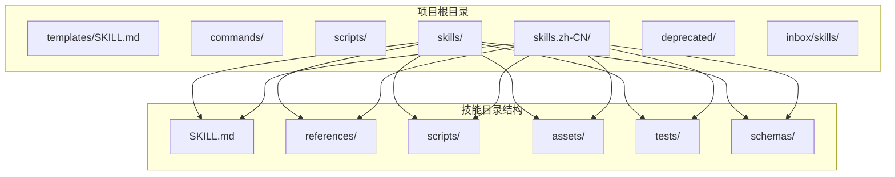
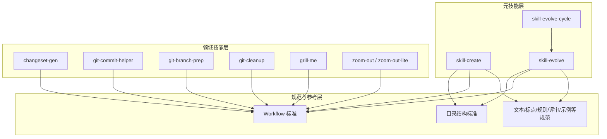
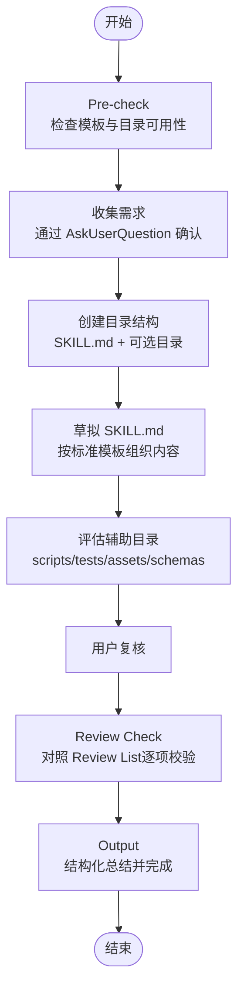
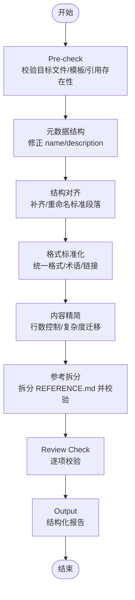
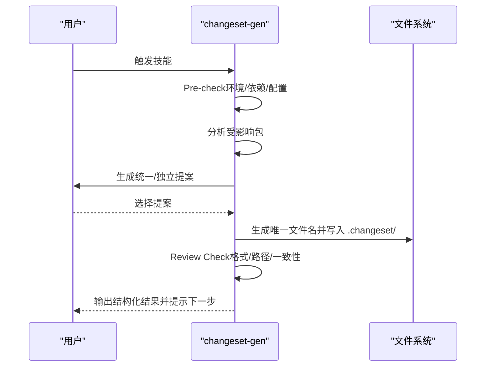
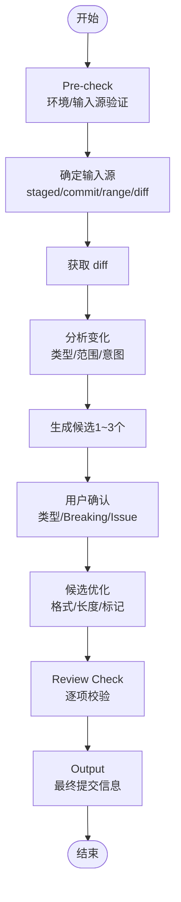
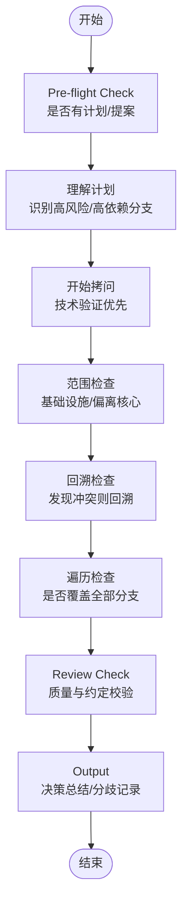
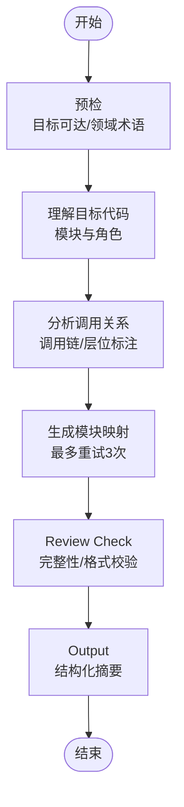
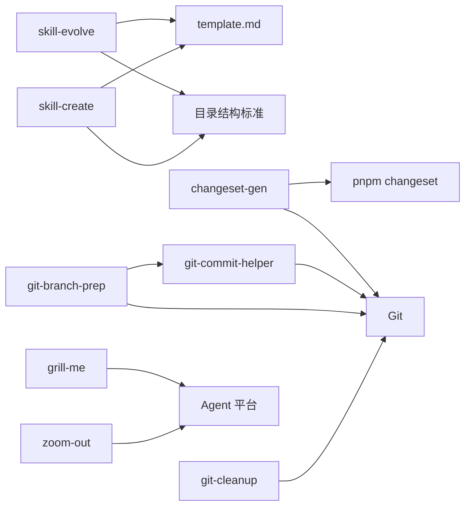

# 项目概述

<cite>
**本文档引用的文件**
- [README.md](file://README.md)
- [README.zh-CN.md](file://README.zh-CN.md)
- [templates/SKILL.md](file://templates/SKILL.md)
- [skills/skill-evolve/SKILL.md](file://skills/skill-evolve/SKILL.md)
- [skills/skill-evolve/template.md](file://skills/skill-evolve/template.md)
- [skills/skill-evolve/references/workflow-standard.md](file://skills/skill-evolve/references/workflow-standard.md)
- [skills/skill-evolve/references/directory-structure.md](file://skills/skill-evolve/references/directory-structure.md)
- [skills/zoom-out/SKILL.md](file://skills/zoom-out/SKILL.md)
- [skills/zoom-out-lite/SKILL.md](file://skills/zoom-out-lite/SKILL.md)
- [skills/grill-me/SKILL.md](file://skills/grill-me/SKILL.md)
- [skills/git-commit-helper/SKILL.md](file://skills/git-commit-helper/SKILL.md)
- [skills/changeset-gen/SKILL.md](file://skills/changeset-gen/SKILL.md)
- [skills/skill-create/SKILL.md](file://skills/skill-create/SKILL.md)
- [scripts/install-skills.sh](file://scripts/install-skills.sh)
- [scripts/install-skills-local.sh](file://scripts/install-skills-local.sh)
</cite>

## 目录
1. [引言](#引言)
2. [项目结构](#项目结构)
3. [核心组件](#核心组件)
4. [架构总览](#架构总览)
5. [详细组件分析](#详细组件分析)
6. [依赖关系分析](#依赖关系分析)
7. [性能考量](#性能考量)
8. [故障排查指南](#故障排查指南)
9. [结论](#结论)
10. [附录](#附录)

## 引言
Skills Collection 是一个以“Agent Skills 规范”为核心的自动化技能生态项目，旨在通过标准化的技能模板与工作流规范，帮助团队构建、演进与复用高质量的自动化技能。项目强调“可读、可维护、可演进”的技能工程化实践，围绕“元技能（meta-skills）”与“领域动作技能（domain/action skills）”两类能力，形成从创建、优化到循环演化的完整生命周期。

- 核心价值与目标
  - 统一技能表达与实现范式，降低沟通成本与维护成本
  - 通过“元技能”对现有技能进行结构化优化与质量校验
  - 提供可复用的命令与技能集合，加速日常开发与运维任务
  - 支持中英文双语生态，便于全球化协作

- 在自动化技能生态系统中的定位
  - 作为“Agent Skills 规范”的落地实现与最佳实践集合
  - 为上层 Agent 平台提供可即插即用的技能模块与参考标准
  - 通过标准化的 Workflow 与 Review List，确保技能行为的一致性与可验证性

- 整体设计理念
  - “先规范，后实现”：以模板与标准先行，再编写具体技能
  - “可演进，可持续”：通过 skill-evolve 与 skill-evolve-cycle 实现持续优化
  - “最小职责，清晰边界”：每个技能聚焦单一职责，避免功能耦合

- 技术架构概览
  - 技能以“自包含目录 + SKILL.md + references/ + scripts/”等标准结构组织
  - 元技能（如 skill-evolve、skill-create）负责结构化治理与质量保障
  - 领域技能（如 changeset-gen、git-commit-helper、zoom-out）提供具体自动化能力
  - 安装与分发通过脚本完成，支持远程与本地两种模式

- 与其他组件的关系
  - 与 Qoder/Agent 平台：通过 npx skills 或安装脚本集成，作为技能来源
  - 与命令系统：commands/ 目录提供可复用命令，与技能协同工作
  - 与外部工具链：如 Git、pnpm changeset、jq 等，通过脚本前置检查与交互确认

**章节来源**
- [README.md:1-113](file://README.md#L1-L113)
- [README.zh-CN.md:1-113](file://README.zh-CN.md#L1-L113)

## 项目结构
项目采用“按技能维度”的扁平化目录组织，每个技能为独立子目录，包含：
- SKILL.md：技能核心说明与执行规范
- references/：技能相关的参考文档与细则
- scripts/：可选的辅助脚本
- assets/、tests/、schemas/：可选的资源、测试与跨技能数据格式

此外，项目还提供：
- templates/：通用技能模板
- skills/skill-evolve：元技能，负责对 SKILL.md 进行结构化优化与质量校验
- skills/skill-create：元技能，负责从零创建符合标准的技能
- scripts/：安装脚本，支持远程与本地安装
- commands/：可复用命令集合（.md 文件形式）

**图示来源**
- [templates/SKILL.md:1-30](file://templates/SKILL.md#L1-L30)
- [skills/skill-evolve/references/directory-structure.md:1-46](file://skills/skill-evolve/references/directory-structure.md#L1-L46)

**章节来源**
- [README.md:5-21](file://README.md#L5-L21)
- [README.zh-CN.md:5-21](file://README.zh-CN.md#L5-L21)
- [skills/skill-evolve/references/directory-structure.md:7-17](file://skills/skill-evolve/references/directory-structure.md#L7-L17)

## 核心组件
- 元技能（Meta-skills）
  - skill-create：从零创建符合标准的技能，包含需求收集、目录结构生成、草稿撰写、用户复核与结果校验
  - skill-evolve：对现有 SKILL.md 进行结构化优化、内容简化、参考文档拆分与质量校验
  - skill-evolve-cycle：将“优化—审查—修复—合并—反馈”的循环作为编排器，驱动技能持续演进

- 领域动作技能（Domain/Action Skills）
  - changeset-gen：基于暂存变更分析受影响包并生成 pnpm changeset 文件
  - git-commit-helper：遵循 Conventional Commits 规范生成提交信息
  - git-branch-prep：组合 git-commit-helper 生成提交信息、提取分支名、确认分支与推送、创建 PR 链接
  - git-cleanup：清理 Git 仓库中的过期 Worktree、分支与标签
  - grill-me：系统性拷问用户的计划或设计，遍历决策树分支，达成共识
  - zoom-out / zoom-out-lite：拉远视角，生成模块关系图与上下游调用链，帮助理解代码在整体架构中的位置

- 参考与标准
  - SKILL 目录结构标准：定义目录与 references/ 文件的格式要求
  - Workflow 写作标准：约束步骤编号、分支逻辑与交互模式
  - 其他规范：文本优化、标点约定、规则写作、评审清单、示例写作等

**章节来源**
- [skills/skill-create/SKILL.md:1-447](file://skills/skill-create/SKILL.md#L1-L447)
- [skills/skill-evolve/SKILL.md:1-371](file://skills/skill-evolve/SKILL.md#L1-L371)
- [skills/changeset-gen/SKILL.md:1-284](file://skills/changeset-gen/SKILL.md#L1-L284)
- [skills/git-commit-helper/SKILL.md:1-296](file://skills/git-commit-helper/SKILL.md#L1-L296)
- [skills/grill-me/SKILL.md:1-509](file://skills/grill-me/SKILL.md#L1-L509)
- [skills/zoom-out/SKILL.md:1-190](file://skills/zoom-out/SKILL.md#L1-L190)
- [skills/zoom-out-lite/SKILL.md:1-12](file://skills/zoom-out-lite/SKILL.md#L1-L12)
- [skills/skill-evolve/template.md:1-247](file://skills/skill-evolve/template.md#L1-L247)
- [skills/skill-evolve/references/workflow-standard.md:1-200](file://skills/skill-evolve/references/workflow-standard.md#L1-L200)
- [skills/skill-evolve/references/directory-structure.md:1-46](file://skills/skill-evolve/references/directory-structure.md#L1-L46)

## 架构总览
项目采用“元技能编排 + 领域技能执行 + 标准化参考”的三层架构：
- 元技能层：skill-create、skill-evolve、skill-evolve-cycle，负责技能的创建、优化与循环演进
- 领域技能层：changeset-gen、git-commit-helper、git-branch-prep、git-cleanup、grill-me、zoom-out 等，提供具体自动化能力
- 规范与参考层：目录结构、Workflow 标准、文本优化、评审清单等，确保一致性与可维护性

**图示来源**
- [skills/skill-create/SKILL.md:1-447](file://skills/skill-create/SKILL.md#L1-L447)
- [skills/skill-evolve/SKILL.md:1-371](file://skills/skill-evolve/SKILL.md#L1-L371)
- [skills/skill-evolve/template.md:1-247](file://skills/skill-evolve/template.md#L1-L247)
- [skills/skill-evolve/references/workflow-standard.md:1-200](file://skills/skill-evolve/references/workflow-standard.md#L1-L200)
- [skills/skill-evolve/references/directory-structure.md:1-46](file://skills/skill-evolve/references/directory-structure.md#L1-L46)

## 详细组件分析

### 元技能：skill-create
- 设计要点
  - 以“标准模板结构”为骨架，引导用户逐步完成 SKILL.md 的创建
  - 通过 AskUserQuestion 与用户确认不确定性决策，避免主观假设
  - 自动评估是否需要创建 scripts/、tests/、assets/、schemas/ 等辅助目录
  - 最终进入 Review List 校验，确保符合“元技能”标准

- 关键流程（简化）
  - Pre-check → 收集需求 → 创建目录结构 → 草拟 SKILL.md → 添加辅助目录 → 用户复核 → Review Check → Output

- 公共接口与参数
  - 输入：用户需求、是否需要脚本/参考/测试/资源/模式等
  - 输出：创建的文件清单、结构完整性、行数控制、引用层级、交互规范等

**图示来源**
- [skills/skill-create/SKILL.md:25-87](file://skills/skill-create/SKILL.md#L25-L87)

**章节来源**
- [skills/skill-create/SKILL.md:1-447](file://skills/skill-create/SKILL.md#L1-L447)

### 元技能：skill-evolve
- 设计要点
  - 对现有 SKILL.md 进行“元技能”层面的结构化优化与质量校验
  - 识别相似语义段落、迁移非标准内容至 references/、统一格式与术语
  - 将 REFERENCE.md 拆分为多个参考文件，并同步 References 列表
  - 严格遵循“安全步骤”（Pre-check、Review Check、Output），保证可恢复性

- 关键流程（简化）
  - Pre-check → 元数据结构 → 结构对齐 → 格式标准化 → 内容精简 → 参考拆分 → Review Check → Output

- 公共接口与参数
  - 输入：目标 SKILL.md、template.md、references/ 文件列表
  - 输出：优化前后对比、拆分后的 references/ 文件、References 同步状态、错误处理与回滚

**图示来源**
- [skills/skill-evolve/SKILL.md:30-171](file://skills/skill-evolve/SKILL.md#L30-L171)

**章节来源**
- [skills/skill-evolve/SKILL.md:1-371](file://skills/skill-evolve/SKILL.md#L1-L371)

### 领域技能：changeset-gen
- 设计要点
  - 基于 staged changes 分析受影响包，生成独立 changeset 文件
  - 支持统一提案与独立提案两种模式，兼顾一致性与灵活性
  - 严格限制只在 .changeset/ 目录生成文件，不执行 commit/push 等操作

- 关键流程（简化）
  - Pre-check（环境检查）→ 生成提案（统一/独立）→ 生成 changeset 文件 → Review Check → Output

- 公共接口与参数
  - 输入：staged changes、proposal 模式、版本类型与摘要
  - 输出：生成的 changeset 文件路径、受影响包数量、文件格式校验

**图示来源**
- [skills/changeset-gen/SKILL.md:29-130](file://skills/changeset-gen/SKILL.md#L29-L130)

**章节来源**
- [skills/changeset-gen/SKILL.md:1-284](file://skills/changeset-gen/SKILL.md#L1-L284)

### 领域技能：git-commit-helper
- 设计要点
  - 遵循 Conventional Commits 规范生成提交信息
  - 支持“对话 diff 路径”与“Git 路径”两种输入源
  - 通过 Review List 严格校验 Subject 长度、类型、描述、Breaking Change 标记等

- 关键流程（简化）
  - Pre-check（环境/输入源）→ 获取 diff → 分析变化 → 生成候选 → 用户确认 → Review Check → Output

- 公共接口与参数
  - 输入：staged/commit/range/diff、Breaking Change 标记、Issue 关联
  - 输出：最终提交信息、候选对比、格式与内容校验

**图示来源**
- [skills/git-commit-helper/SKILL.md:43-139](file://skills/git-commit-helper/SKILL.md#L43-L139)

**章节来源**
- [skills/git-commit-helper/SKILL.md:1-296](file://skills/git-commit-helper/SKILL.md#L1-L296)

### 领域技能：grill-me
- 设计要点
  - 系统性拷问用户的计划或设计，遍历决策树分支，解决依赖与冲突
  - 严格遵循“一次一个问题”“必须提供推荐答案”“不得自主决策”等交互约定
  - 支持分歧记录、回溯与阻塞升级，避免无限循环

- 关键流程（简化）
  - Pre-flight Check → 理解计划 → 开始拷问 → 范围与回溯检查 → 遍历检查 → Review Check → Output

- 公共接口与参数
  - 输入：用户计划/提案、技术验证请求
  - 输出：最终决策汇总、分歧记录、终止原因

**图示来源**
- [skills/grill-me/SKILL.md:22-87](file://skills/grill-me/SKILL.md#L22-L87)

**章节来源**
- [skills/grill-me/SKILL.md:1-509](file://skills/grill-me/SKILL.md#L1-L509)

### 领域技能：zoom-out / zoom-out-lite
- 设计要点
  - 将视图向上抽象一层，生成模块关系图与调用链，帮助理解代码在整体架构中的角色
  - 优先使用项目领域术语，必要时从命名约定推断
  - 输出结构化模块映射，避免长篇描述

- 关键流程（简化）
  - 预检 → 理解目标代码 → 分析调用关系 → 生成模块映射 → Review Check → Output

- 公共接口与参数
  - 输入：目标代码片段/文件
  - 输出：模块身份、上游调用者数量、下游依赖数量、结构化映射

**图示来源**
- [skills/zoom-out/SKILL.md:25-65](file://skills/zoom-out/SKILL.md#L25-L65)

**章节来源**
- [skills/zoom-out/SKILL.md:1-190](file://skills/zoom-out/SKILL.md#L1-L190)
- [skills/zoom-out-lite/SKILL.md:1-12](file://skills/zoom-out-lite/SKILL.md#L1-L12)

## 依赖关系分析
- 组件内聚与耦合
  - 元技能之间存在依赖：skill-evolve 依赖 template.md 与目录结构标准；skill-create 依赖 skill-evolve 的模板与结构
  - 领域技能彼此低耦合，通过统一的 Workflow 标准与交互约定保持一致性

- 外部依赖与集成点
  - Git：用于 changeset-gen、git-commit-helper、git-branch-prep、git-cleanup 等技能
  - pnpm changeset：changeset-gen 依赖 .changeset/ 与 @changesets/cli
  - jq：部分技能脚本依赖 JSON 处理
  - Qoder/Agent 平台：通过 npx skills 或安装脚本集成

- 潜在循环依赖
  - 无显式循环依赖；skill-evolve 在自演进场景下会额外校验 template.md 的一致性

**图示来源**
- [skills/skill-evolve/SKILL.md:345-371](file://skills/skill-evolve/SKILL.md#L345-L371)
- [skills/skill-create/SKILL.md:19-24](file://skills/skill-create/SKILL.md#L19-L24)
- [skills/changeset-gen/SKILL.md:21-28](file://skills/changeset-gen/SKILL.md#L21-L28)
- [skills/git-commit-helper/SKILL.md:30-42](file://skills/git-commit-helper/SKILL.md#L30-L42)

**章节来源**
- [skills/skill-evolve/template.md:233-247](file://skills/skill-evolve/template.md#L233-L247)
- [skills/skill-evolve/references/directory-structure.md:19-46](file://skills/skill-evolve/references/directory-structure.md#L19-L46)

## 性能考量
- 结构化与可维护性优先
  - 通过 skill-evolve 将大文件拆分为 references/，减少单文件体积，提升可读性与编辑效率
  - 严格的“安全步骤”与“防御标准”，在错误发生时可回滚，避免长时间运行失败带来的损失

- 交互与并发
  - 使用 AskUserQuestion 统一交互入口，避免大量并发分支导致的混乱
  - 对于可自动验证的任务（如技术问题），优先通过代码库验证而非询问用户

- 资源与脚本
  - 脚本前置检查（如 Git/jq/pnpm changeset）减少运行时失败概率
  - changeset-gen 仅生成文件，不执行 commit/push，降低副作用与等待时间

[本节为通用指导，无需特定文件分析]

## 故障排查指南
- 常见问题与处理
  - 环境检查失败：根据 Pre-check 报错信息逐一修复（如 Git 版本、依赖缺失、暂存区为空）
  - 引用文件缺失：根据提示补充 references/ 文件或更新 References 列表
  - 内容拆分不完整：在 Review Check 中逐项核对，必要时手动补充
  - 死链或链接格式错误：使用“术语引用完整性审计”与锚点链接校验
  - 自动回滚：遇到不可恢复错误时，系统会使用原始内容副本进行回滚

- 排查步骤建议
  - 从 Pre-check 开始，确保前置条件满足
  - 逐项对照 Review List，定位失败项
  - 若涉及文件删除/移动，确认已通过 AskUserQuestion 明确授权
  - 对于 changeset-gen，确认 .changeset/ 目录与 pnpm changeset 配置正确

**章节来源**
- [skills/skill-evolve/SKILL.md:208-214](file://skills/skill-evolve/SKILL.md#L208-L214)
- [skills/changeset-gen/SKILL.md:106-120](file://skills/changeset-gen/SKILL.md#L106-L120)
- [skills/git-commit-helper/SKILL.md:127-139](file://skills/git-commit-helper/SKILL.md#L127-L139)

## 结论
Skills Collection 通过“Agent Skills 规范”将技能的创建、演进与执行标准化，形成可复用、可演进、可验证的自动化技能生态。元技能负责治理与质量保障，领域技能提供具体自动化能力，参考标准确保一致性与可维护性。项目既适合初学者快速上手，也为有经验的开发者提供了严谨的工程化实践框架。

[本节为总结性内容，无需特定文件分析]

## 附录

### 安装与分发
- 远程安装
  - 支持通过 npx skills 或一键脚本从 GitHub 安装
  - 支持通过环境变量 SKILLS_DIR 指定目标目录
- 本地安装
  - 使用本地仓库直接复制，避免网络依赖
- 语言选择
  - 安装时可选择 English 或 中文 技能源

**章节来源**
- [README.md:22-64](file://README.md#L22-L64)
- [README.zh-CN.md:22-64](file://README.zh-CN.md#L22-L64)
- [scripts/install-skills.sh:1-146](file://scripts/install-skills.sh#L1-L146)
- [scripts/install-skills-local.sh:1-16](file://scripts/install-skills-local.sh#L1-L16)

### 常见用例
- 生成变更集文件：在 nx + pnpm changeset 仓库中，基于暂存变更分析受影响包并生成 changeset 文件
- 生成提交信息：遵循 Conventional Commits 规范，结合 diff 自动生成候选提交信息
- 计划拷问：系统性拷问用户的设计或计划，暴露风险与遗漏，达成共识
- 模块拉远：生成模块关系图与调用链，帮助理解代码在整体架构中的位置

**章节来源**
- [skills/changeset-gen/SKILL.md:10-14](file://skills/changeset-gen/SKILL.md#L10-L14)
- [skills/git-commit-helper/SKILL.md:8-11](file://skills/git-commit-helper/SKILL.md#L8-L11)
- [skills/grill-me/SKILL.md:8-11](file://skills/grill-me/SKILL.md#L8-L11)
- [skills/zoom-out/SKILL.md:9-12](file://skills/zoom-out/SKILL.md#L9-L12)