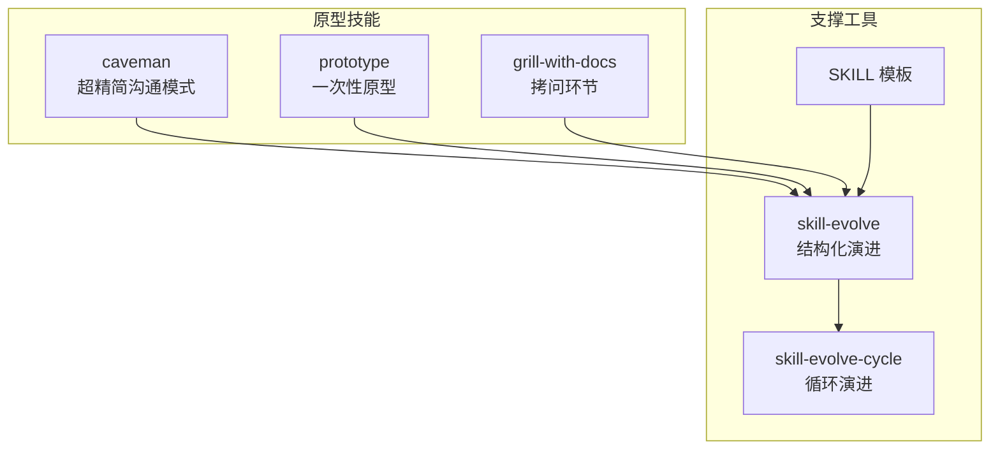
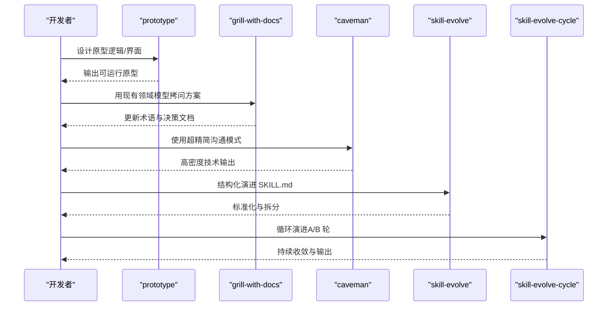
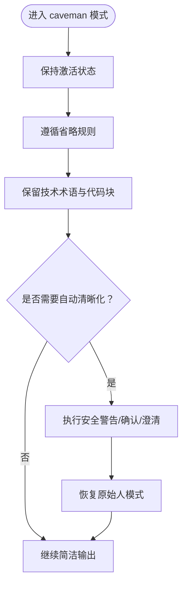
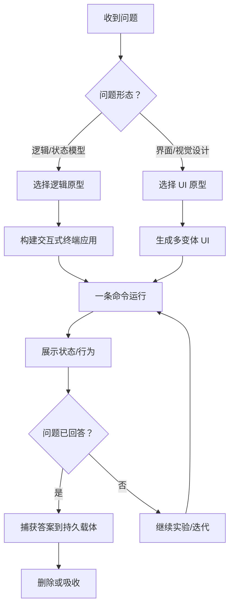
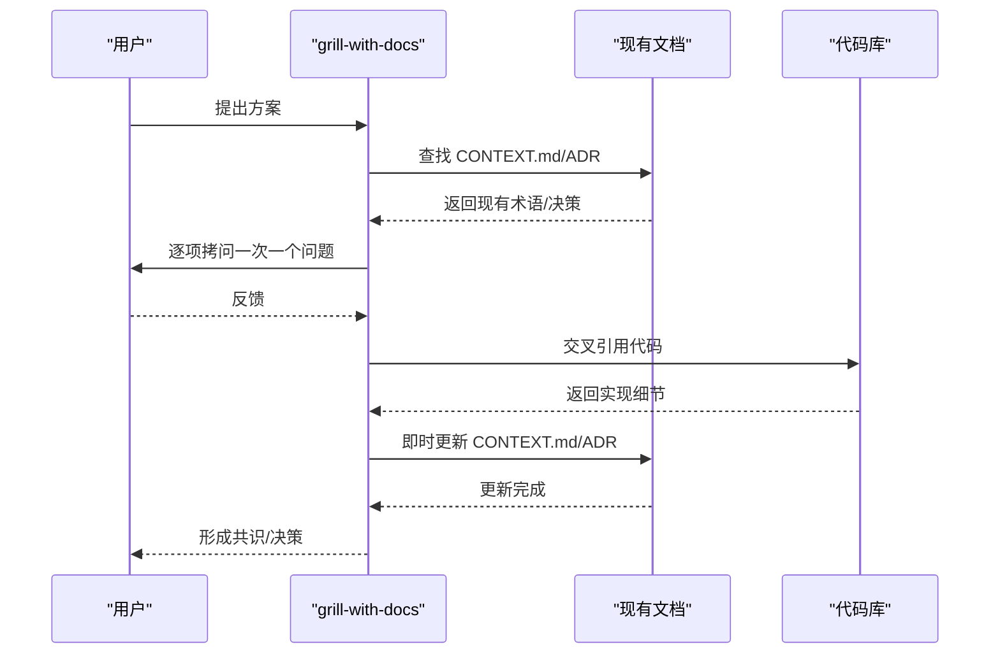
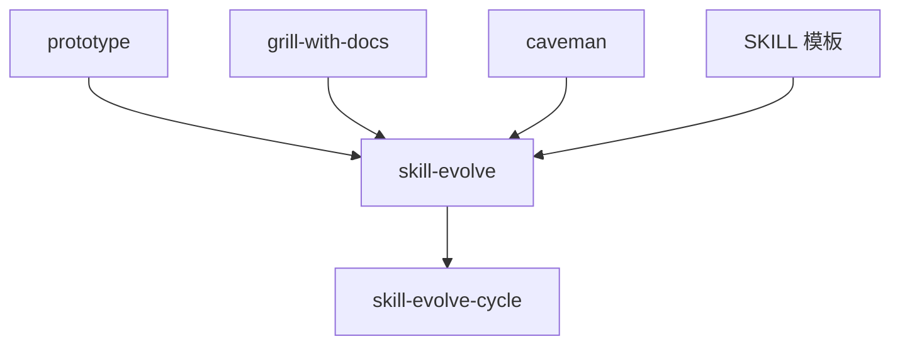

# 原型技能

<cite>
**本文引用的文件**
- [caveman/SKILL.md](file://inbox/skills/caveman/SKILL.md)
- [prototype/SKILL.md](file://inbox/skills/prototype/SKILL.md)
- [prototype/LOGIC.md](file://inbox/skills/prototype/LOGIC.md)
- [grill-with-docs/SKILL.md](file://inbox/skills/grill-with-docs/SKILL.md)
- [grill-with-docs/CONTEXT-FORMAT.md](file://inbox/skills/grill-with-docs/CONTEXT-FORMAT.md)
- [grill-with-docs/ADR-FORMAT.md](file://inbox/skills/grill-with-docs/ADR-FORMAT.md)
- [skill-evolve/SKILL.md](file://skills/skills/skill-evolve/SKILL.md)
- [skill-evolve-cycle/SKILL.md](file://skills/skills/skill-evolve-cycle/SKILL.md)
- [templates/SKILL.md](file://templates/SKILL.md)
</cite>

## 目录
1. [简介](#简介)
2. [项目结构](#项目结构)
3. [核心组件](#核心组件)
4. [架构概览](#架构概览)
5. [详细组件分析](#详细组件分析)
6. [依赖分析](#依赖分析)
7. [性能考量](#性能考量)
8. [故障排除指南](#故障排除指南)
9. [结论](#结论)
10. [附录](#附录)

## 简介
本文件系统性梳理 Skills Collection 中的原型技能体系，重点覆盖 caveman、prototype 与 grill-with-docs 三大原型技能的设计理念、使用方法与最佳实践。原型技能强调“实验性、可丢弃、快速验证”的工程哲学，区别于正式技能的稳定性和长期维护成本考量。本文将阐述原型技能的适用场景、开发流程、评估标准与迭代过程，并提供从原型技能向成熟技能演进的路径建议，帮助开发者高效利用这些工具进行创新实验与知识沉淀。

## 项目结构
原型技能主要分布在 inbox/skills 下的 caveman、prototype、grill-with-docs 三个目录中，配套模板与演进工具位于 templates 与 skills/skills 下。整体结构体现“原型即实验、实验即产出”的思想：原型技能以最小可运行单元回答问题，随后通过 skill-evolve 与 skill-evolve-cycle 实现标准化、规范化与持续演进。

图表来源
- [caveman/SKILL.md:1-48](file://inbox/skills/caveman/SKILL.md#L1-L48)
- [prototype/SKILL.md:1-31](file://inbox/skills/prototype/SKILL.md#L1-L31)
- [grill-with-docs/SKILL.md:1-89](file://inbox/skills/grill-with-docs/SKILL.md#L1-L89)
- [skill-evolve/SKILL.md:1-371](file://skills/skills/skill-evolve/SKILL.md#L1-L371)
- [skill-evolve-cycle/SKILL.md:45-77](file://skills/skills/skill-evolve-cycle/SKILL.md#L45-L77)
- [templates/SKILL.md:1-30](file://templates/SKILL.md#L1-L30)

章节来源
- [caveman/SKILL.md:1-48](file://inbox/skills/caveman/SKILL.md#L1-L48)
- [prototype/SKILL.md:1-31](file://inbox/skills/prototype/SKILL.md#L1-L31)
- [grill-with-docs/SKILL.md:1-89](file://inbox/skills/grill-with-docs/SKILL.md#L1-L89)
- [skill-evolve/SKILL.md:1-371](file://skills/skills/skill-evolve/SKILL.md#L1-L371)
- [skill-evolve-cycle/SKILL.md:45-77](file://skills/skills/skill-evolve-cycle/SKILL.md#L45-L77)
- [templates/SKILL.md:1-30](file://templates/SKILL.md#L1-L30)

## 核心组件
- caveman：超精简沟通模式，通过去除填充词、冠词与客套话，显著降低 token 消耗，同时保持技术准确性。适用于需要快速、直接、高密度信息输出的场景。
- prototype：一次性原型，回答“问题的临时代码”。根据问题形态选择逻辑原型或 UI 原型两条分支，强调“一条命令即可运行”“默认无持久化”“完成后删除或吸收”。
- grill-with-docs：拷问环节，基于现有领域模型挑战方案、澄清术语，并在决策形成时即时更新文档（CONTEXT.md、ADR）。强调“一次问一个问题”“对照术语表挑战”“即时更新”。

章节来源
- [caveman/SKILL.md:1-48](file://inbox/skills/caveman/SKILL.md#L1-L48)
- [prototype/SKILL.md:1-31](file://inbox/skills/prototype/SKILL.md#L1-L31)
- [grill-with-docs/SKILL.md:1-89](file://inbox/skills/grill-with-docs/SKILL.md#L1-L89)

## 架构概览
原型技能的生命周期由“原型设计—快速验证—标准化—持续演进”构成。caveman 提供沟通效率保障，prototype 提供实验与验证能力，grill-with-docs 提供领域一致性与知识沉淀，三者共同服务于 skill-evolve 与 skill-evolve-cycle 的标准化与循环演进。

图表来源
- [prototype/SKILL.md:1-31](file://inbox/skills/prototype/SKILL.md#L1-L31)
- [grill-with-docs/SKILL.md:1-89](file://inbox/skills/grill-with-docs/SKILL.md#L1-L89)
- [caveman/SKILL.md:1-48](file://inbox/skills/caveman/SKILL.md#L1-L48)
- [skill-evolve/SKILL.md:1-371](file://skills/skills/skill-evolve/SKILL.md#L1-L371)
- [skill-evolve-cycle/SKILL.md:45-77](file://skills/skills/skill-evolve-cycle/SKILL.md#L45-L77)

## 详细组件分析

### caveman：超精简沟通模式
设计理念
- 通过省略填充词、冠词与客套话，减少约 75% 的 token 消耗，同时保持完整的技术准确性。
- 一旦触发，每次回复保持激活，直至用户明确要求停止。
- 规则严格：省略非必要词汇，保留技术术语与代码块，采用“结果导向”的简洁模式。

使用方法
- 触发方式：当用户表达“原始人模式”“更少 token”“简短一点”或调用 /caveman 时启用。
- 持久性：多轮对话中不回退，不确定时仍保持激活。
- 自动清晰化例外：在安全警告、不可逆操作确认、片段顺序可能导致误解的多步操作、用户要求澄清时临时退出，清晰部分完成后恢复。

最佳实践
- 优先使用箭头表示因果关系，一个词能表达清楚时只用一个词。
- 技术术语保持精确，代码块与错误信息原样引用。
- 在破坏性操作前，先进行清晰的警告与确认，再恢复原始人模式。

图表来源
- [caveman/SKILL.md:10-48](file://inbox/skills/caveman/SKILL.md#L10-L48)

章节来源
- [caveman/SKILL.md:1-48](file://inbox/skills/caveman/SKILL.md#L1-L48)

### prototype：一次性原型
设计理念
- 原型是“回答问题的临时代码”，问题决定形态。两条分支：逻辑原型（交互式终端应用，推动状态机通过难以在纸上推理的案例）与 UI 原型（单路由多变体，通过 URL 参数与底部栏切换）。
- 从第一天起就是一次性的，并明确标记为原型；一条命令即可运行；默认无持久化；跳过打磨；完成后删除或吸收。

使用方法
- 选择分支：根据问题形态选择 LOGIC.md 或 UI 变体分支；若问题含糊不清且用户联系不上，默认选择与周围代码更匹配的分支。
- 适用于两者的规则：命名靠近真实模块、一条命令运行、默认无持久化、跳过打磨、展示状态、完成后删除或吸收。
- 完成时：唯一值得保留的是“答案”，将答案连同问题捕获到持久载体中（提交消息、ADR、issue、NOTES.md）。

图表来源
- [prototype/SKILL.md:10-31](file://inbox/skills/prototype/SKILL.md#L10-L31)
- [prototype/LOGIC.md:1-80](file://inbox/skills/prototype/LOGIC.md#L1-L80)

章节来源
- [prototype/SKILL.md:1-31](file://inbox/skills/prototype/SKILL.md#L1-L31)
- [prototype/LOGIC.md:1-80](file://inbox/skills/prototype/LOGIC.md#L1-L80)

### grill-with-docs：拷问环节
设计理念
- 基于现有领域模型挑战方案，澄清术语，并在决策形成时即时更新文档（CONTEXT.md、ADR）。
- 强调“一次问一个问题”“对照术语表进行挑战”“与代码交叉引用”“即时更新 CONTEXT.md”“谨慎提供 ADR”。

使用方法
- 领域感知：浏览代码库时查找现有文档（CONTEXT.md、docs/adr/），惰性创建文件。
- 在会话期间：挑战术语冲突、澄清模糊语言、用具体场景压力测试关系、与代码交叉引用、即时更新 CONTEXT.md。
- ADR 提议：仅当决策“难以撤销”“缺乏上下文会令人困惑”“是真实权衡的结果”三个条件同时满足时才提供。

图表来源
- [grill-with-docs/SKILL.md:16-89](file://inbox/skills/grill-with-docs/SKILL.md#L16-L89)
- [grill-with-docs/CONTEXT-FORMAT.md:1-78](file://inbox/skills/grill-with-docs/CONTEXT-FORMAT.md#L1-L78)
- [grill-with-docs/ADR-FORMAT.md:1-48](file://inbox/skills/grill-with-docs/ADR-FORMAT.md#L1-L48)

章节来源
- [grill-with-docs/SKILL.md:1-89](file://inbox/skills/grill-with-docs/SKILL.md#L1-L89)
- [grill-with-docs/CONTEXT-FORMAT.md:1-78](file://inbox/skills/grill-with-docs/CONTEXT-FORMAT.md#L1-L78)
- [grill-with-docs/ADR-FORMAT.md:1-48](file://inbox/skills/grill-with-docs/ADR-FORMAT.md#L1-L48)

## 依赖分析
原型技能与支撑工具之间存在明确的依赖关系：prototype 与 grill-with-docs 通过 skill-evolve 实现结构化演进，caveman 为沟通效率提供保障；skill-evolve-cycle 则负责循环演进与收敛。

图表来源
- [prototype/SKILL.md:1-31](file://inbox/skills/prototype/SKILL.md#L1-L31)
- [grill-with-docs/SKILL.md:1-89](file://inbox/skills/grill-with-docs/SKILL.md#L1-L89)
- [caveman/SKILL.md:1-48](file://inbox/skills/caveman/SKILL.md#L1-L48)
- [skill-evolve/SKILL.md:1-371](file://skills/skills/skill-evolve/SKILL.md#L1-L371)
- [skill-evolve-cycle/SKILL.md:45-77](file://skills/skills/skill-evolve-cycle/SKILL.md#L45-L77)
- [templates/SKILL.md:1-30](file://templates/SKILL.md#L1-L30)

章节来源
- [skill-evolve/SKILL.md:1-371](file://skills/skills/skill-evolve/SKILL.md#L1-L371)
- [skill-evolve-cycle/SKILL.md:45-77](file://skills/skills/skill-evolve-cycle/SKILL.md#L45-L77)
- [templates/SKILL.md:1-30](file://templates/SKILL.md#L1-L30)

## 性能考量
- token 效率：caveman 通过省略非必要词汇显著降低 token 消耗，适合需要高密度信息输出的场景。
- 开发效率：prototype 的“一条命令即可运行”与“默认无持久化”原则，确保原型快速验证与及时清理，避免技术债积累。
- 文档一致性：grill-with-docs 的即时更新机制，减少术语歧义与决策漂移，提升团队协作效率。

## 故障排除指南
- caveman 模式误用：当需要澄清或复杂解释时，应临时退出原始人模式，清晰表达后再恢复。
- prototype 误判分支：若问题形态模糊，优先选择与周围代码更匹配的分支，并在原型顶部说明假设。
- grill-with-docs ADR 提议：若决策易撤销、不令人困惑或无真实替代方案，跳过 ADR，避免过度文档化。
- skill-evolve 与 skill-evolve-cycle：遇到死链接或文件写失败时，依据防御标准进行回滚与修复。

章节来源
- [caveman/SKILL.md:35-48](file://inbox/skills/caveman/SKILL.md#L35-L48)
- [prototype/SKILL.md:17-26](file://inbox/skills/prototype/SKILL.md#L17-L26)
- [grill-with-docs/SKILL.md:78-87](file://inbox/skills/grill-with-docs/SKILL.md#L78-L87)
- [skill-evolve/SKILL.md:208-214](file://skills/skills/skill-evolve/SKILL.md#L208-L214)

## 结论
原型技能以“实验—验证—沉淀—演进”为核心闭环，caveman 提升沟通效率，prototype 加速验证，grill-with-docs 强化领域一致性，skill-evolve 与 skill-evolve-cycle 确保标准化与持续改进。通过遵循原型技能的设计原则与最佳实践，开发者可在保证质量的前提下快速迭代，将有价值的实验成果转化为成熟的技能资产。

## 附录
- 从原型技能发展为成熟技能的建议
  - 明确问题边界：在 prototype 中清晰定义“要回答的问题”，避免范围蔓延。
  - 保持一次性：从第一天起就标记为原型，避免“半成品”长期存在。
  - 捕获答案：将答案与问题一起记录到持久载体中，便于后续追溯与复用。
  - 标准化演进：使用 skill-evolve 对 SKILL.md 进行结构化演进，确保内容完整性与可维护性。
  - 循环收敛：通过 skill-evolve-cycle 的 A/B 小循环与大循环收敛，持续提升质量与一致性。

章节来源
- [prototype/SKILL.md:19-31](file://inbox/skills/prototype/SKILL.md#L19-L31)
- [skill-evolve/SKILL.md:1-371](file://skills/skills/skill-evolve/SKILL.md#L1-L371)
- [skill-evolve-cycle/SKILL.md:45-77](file://skills/skills/skill-evolve-cycle/SKILL.md#L45-L77)
- [templates/SKILL.md:1-30](file://templates/SKILL.md#L1-L30)