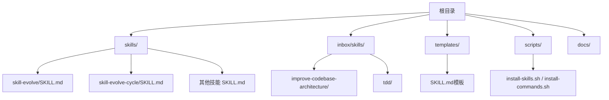
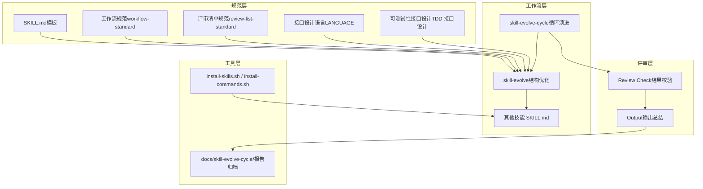
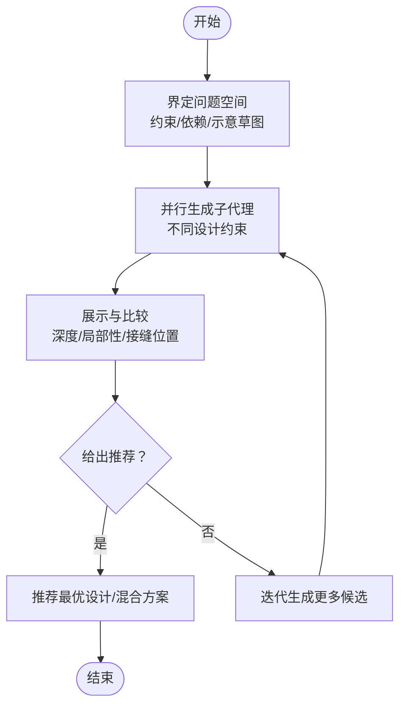
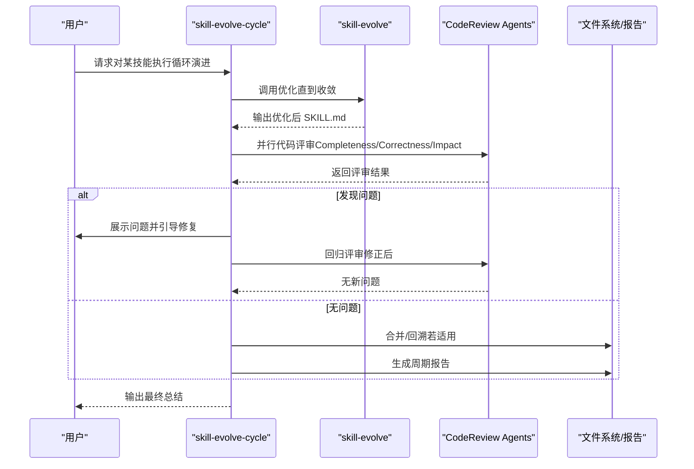
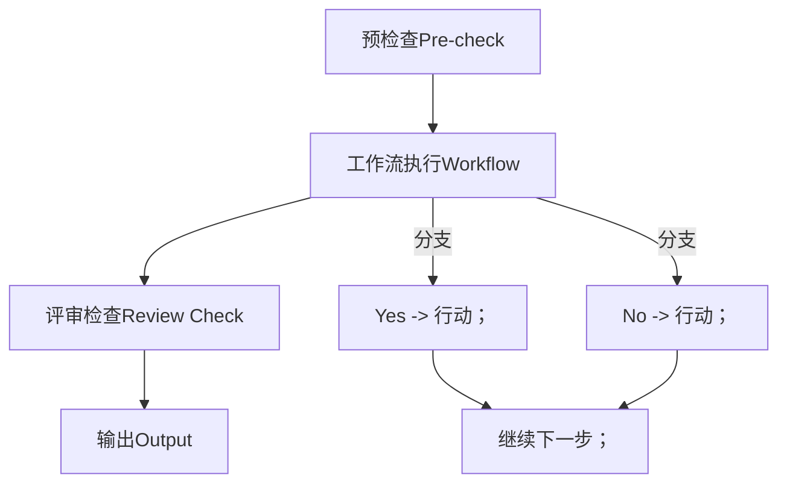
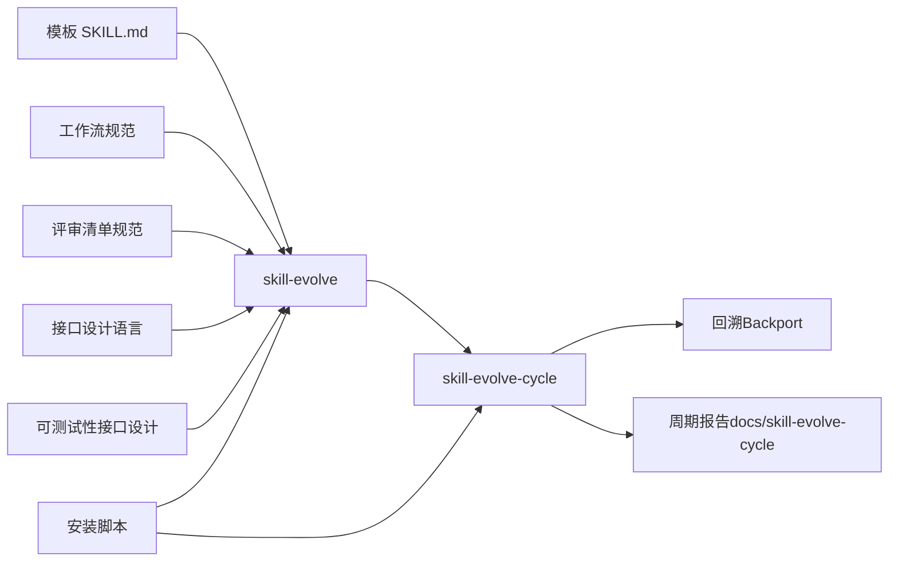

# 代码库架构改进

<cite>
**本文引用的文件**   
- [README.md](file://README.md)
- [README.zh-CN.md](file://README.zh-CN.md)
- [improve-codebase-architecture/INTERFACE-DESIGN.md](file://inbox/skills/improve-codebase-architecture/INTERFACE-DESIGN.md)
- [improve-codebase-architecture/LANGUAGE.md](file://inbox/skills/improve-codebase-architecture/LANGUAGE.md)
- [tdd/interface-design.md](file://inbox/skills/tdd/interface-design.md)
- [skill-evolve/SKILL.md](file://skills/skills/skill-evolve/SKILL.md)
- [skill-evolve-cycle/SKILL.md](file://skills/skills/skill-evolve-cycle/SKILL.md)
- [workflow-standard.md](file://skills/skills/skill-evolve/references/workflow-standard.md)
- [review-list-standard.md](file://skills/skills/skill-evolve/references/review-list-standard.md)
- [SKILL.md（模板）](file://templates/SKILL.md)
</cite>

## 目录
1. [引言](#引言)
2. [项目结构](#项目结构)
3. [核心组件](#核心组件)
4. [架构总览](#架构总览)
5. [详细组件分析](#详细组件分析)
6. [依赖分析](#依赖分析)
7. [性能考量](#性能考量)
8. [故障排查指南](#故障排查指南)
9. [结论](#结论)
10. [附录](#附录)

## 引言
本文件面向“代码库架构改进”的目标，系统梳理仓库内已有的“技能”（Skill）体系、工作流规范与评审标准，结合接口设计语言与可测试性原则，构建一套可落地的架构评估与改进方法论。重点覆盖以下方面：
- 架构评估方法与工具：复杂度分析、模块耦合度测量、设计模式识别
- 接口设计优化：稳定性、向后兼容性、可扩展性
- 语言与工具链最佳实践：语言特性利用、性能与安全
- 改进案例研究：从问题识别到方案实施的闭环流程
- 代码审查清单与质量评估标准
- 可持续架构演进机制与大型项目重构策略
- 团队协作中的架构决策流程与沟通机制

## 项目结构
仓库采用“技能集合”组织形式，每个技能为自包含的目录，遵循统一的规范与模板。整体结构清晰、职责边界明确，便于规模化演进与治理。

图表来源
- [README.md:1-113](file://README.md#L1-L113)
- [README.zh-CN.md:1-113](file://README.zh-CN.md#L1-L113)

章节来源
- [README.md:1-113](file://README.md#L1-L113)
- [README.zh-CN.md:1-113](file://README.zh-CN.md#L1-L113)

## 核心组件
- 技能（Skill）：每个技能是一个自包含的工作单元，具备统一的结构、工作流与评审标准，便于标准化与自动化处理。
- 工作流规范（Workflow Writing Standard）：定义步骤编号、标题命名、分支逻辑、交互模式等，确保一致性与可维护性。
- 评审清单（Review List Writing Standard）：聚焦结果质量校验，避免与规则与流程混用。
- 接口设计语言（Language）：以“模块/接口/接缝/适配器/杠杆效应/局部性”为核心词汇，统一术语与思维模型。
- 可测试性接口设计（TDD 接口设计）：强调依赖注入、纯函数式输出、小表面积等原则，提升可测试性与可维护性。

章节来源
- [skill-evolve/SKILL.md:1-371](file://skills/skills/skill-evolve/SKILL.md#L1-L371)
- [skill-evolve-cycle/SKILL.md:1-308](file://skills/skills/skill-evolve-cycle/SKILL.md#L1-L308)
- [workflow-standard.md:1-800](file://skills/skills/skill-evolve/references/workflow-standard.md#L1-L800)
- [review-list-standard.md:1-35](file://skills/skills/skill-evolve/references/review-list-standard.md#L1-L35)
- [improve-codebase-architecture/LANGUAGE.md:1-54](file://inbox/skills/improve-codebase-architecture/LANGUAGE.md#L1-L54)
- [tdd/interface-design.md:1-32](file://inbox/skills/tdd/interface-design.md#L1-L32)

## 架构总览
本仓库的“技能”体系可视为一种“可编排的知识工作流平台”。其架构由“规范层（模板与标准）—工作流层（技能实现）—评审层（质量保障）—工具层（安装与脚本）”构成，形成闭环的“演进—评审—修正—反馈”机制。

图表来源
- [SKILL.md（模板）:1-30](file://templates/SKILL.md#L1-L30)
- [workflow-standard.md:1-800](file://skills/skills/skill-evolve/references/workflow-standard.md#L1-L800)
- [review-list-standard.md:1-35](file://skills/skills/skill-evolve/references/review-list-standard.md#L1-L35)
- [improve-codebase-architecture/LANGUAGE.md:1-54](file://inbox/skills/improve-codebase-architecture/LANGUAGE.md#L1-L54)
- [tdd/interface-design.md:1-32](file://inbox/skills/tdd/interface-design.md#L1-L32)
- [skill-evolve/SKILL.md:1-371](file://skills/skills/skill-evolve/SKILL.md#L1-L371)
- [skill-evolve-cycle/SKILL.md:1-308](file://skills/skills/skill-evolve-cycle/SKILL.md#L1-L308)

## 详细组件分析

### 组件一：接口设计语言与可测试性原则
- 术语体系：模块、接口、实现、接缝、适配器、深度、杠杆效应、局部性。强调“深度是接口的属性”，“接口即测试面”，“一个适配器意味着一个假设性的接缝”。
- 设计流程：界定问题空间 → 并行生成子代理（不同约束）→ 展示与比较（深度/局部性/接缝位置）→ 给出推荐或混合方案。
- 可测试性原则：依赖注入、无副作用输出、小表面积。

图表来源
- [improve-codebase-architecture/INTERFACE-DESIGN.md:1-45](file://inbox/skills/improve-codebase-architecture/INTERFACE-DESIGN.md#L1-L45)
- [improve-codebase-architecture/LANGUAGE.md:1-54](file://inbox/skills/improve-codebase-architecture/LANGUAGE.md#L1-L54)
- [tdd/interface-design.md:1-32](file://inbox/skills/tdd/interface-design.md#L1-L32)

章节来源
- [improve-codebase-architecture/INTERFACE-DESIGN.md:1-45](file://inbox/skills/improve-codebase-architecture/INTERFACE-DESIGN.md#L1-L45)
- [improve-codebase-architecture/LANGUAGE.md:1-54](file://inbox/skills/improve-codebase-architecture/LANGUAGE.md#L1-L54)
- [tdd/interface-design.md:1-32](file://inbox/skills/tdd/interface-design.md#L1-L32)

### 组件二：技能演进（skill-evolve）与循环演进（skill-evolve-cycle）
- skill-evolve：对单个技能进行结构优化、内容精简、参考文档拆分与格式标准化，确保符合模板与规范。
- skill-evolve-cycle：交替驱动“优化—评审—修正—合并—回溯”的大循环，支持自演进与回溯经验同步。

图表来源
- [skill-evolve-cycle/SKILL.md:1-308](file://skills/skills/skill-evolve-cycle/SKILL.md#L1-L308)
- [skill-evolve/SKILL.md:1-371](file://skills/skills/skill-evolve/SKILL.md#L1-L371)

章节来源
- [skill-evolve/SKILL.md:1-371](file://skills/skills/skill-evolve/SKILL.md#L1-L371)
- [skill-evolve-cycle/SKILL.md:1-308](file://skills/skills/skill-evolve-cycle/SKILL.md#L1-L308)

### 组件三：工作流与评审规范
- 工作流规范：固定“预检查—评审—输出”三大安全步骤，强制分支逻辑树形化、显式终点、正向极性判断、交互统一使用 AskUserQuestion。
- 评审清单规范：聚焦结果质量校验，避免与规则/流程混用；支持锚点引用与分组一致性。

图表来源
- [workflow-standard.md:1-800](file://skills/skills/skill-evolve/references/workflow-standard.md#L1-L800)
- [review-list-standard.md:1-35](file://skills/skills/skill-evolve/references/review-list-standard.md#L1-L35)

章节来源
- [workflow-standard.md:1-800](file://skills/skills/skill-evolve/references/workflow-standard.md#L1-L800)
- [review-list-standard.md:1-35](file://skills/skills/skill-evolve/references/review-list-standard.md#L1-L35)

### 组件四：模板与安装脚本
- 模板：提供 SKILL.md 的最小可用结构，便于快速上手与一致性。
- 安装脚本：支持远程与本地安装，支持环境变量覆盖目标路径，简化部署与集成。

章节来源
- [SKILL.md（模板）:1-30](file://templates/SKILL.md#L1-L30)
- [README.md:22-108](file://README.md#L22-L108)
- [README.zh-CN.md:22-108](file://README.zh-CN.md#L22-L108)

## 依赖分析
- 内部依赖关系
  - skill-evolve 依赖模板与规范文件（工作流、评审清单、内容边界等）。
  - skill-evolve-cycle 依赖 skill-evolve，并在特定仓库场景下触发回溯（backport）。
  - 接口设计语言与可测试性原则贯穿技能实现，指导模块与接口设计。
- 外部依赖
  - 安装脚本依赖 Bash 与 Git（用于仓库归属判断）。
  - 评审阶段依赖 CodeReview Agent（并行三路视角）。

图表来源
- [SKILL.md（模板）:1-30](file://templates/SKILL.md#L1-L30)
- [workflow-standard.md:1-800](file://skills/skills/skill-evolve/references/workflow-standard.md#L1-L800)
- [review-list-standard.md:1-35](file://skills/skills/skill-evolve/references/review-list-standard.md#L1-L35)
- [improve-codebase-architecture/LANGUAGE.md:1-54](file://inbox/skills/improve-codebase-architecture/LANGUAGE.md#L1-L54)
- [tdd/interface-design.md:1-32](file://inbox/skills/tdd/interface-design.md#L1-L32)
- [skill-evolve/SKILL.md:1-371](file://skills/skills/skill-evolve/SKILL.md#L1-L371)
- [skill-evolve-cycle/SKILL.md:1-308](file://skills/skills/skill-evolve-cycle/SKILL.md#L1-L308)

章节来源
- [skill-evolve/SKILL.md:1-371](file://skills/skills/skill-evolve/SKILL.md#L1-L371)
- [skill-evolve-cycle/SKILL.md:1-308](file://skills/skills/skill-evolve-cycle/SKILL.md#L1-L308)

## 性能考量
- 工作流性能
  - 通过“预检查”前置环境与依赖校验，减少中途中断概率。
  - “评审检查+输出”两步法确保结果稳定与可追溯。
- 可测试性与可维护性
  - 小表面积接口、纯输出、依赖注入降低耦合，提升测试效率与定位速度。
- 规模化演进
  - 通过“循环演进”机制，持续收敛问题，避免一次性大规模改动带来的风险。

## 故障排查指南
- 常见问题与处理
  - 目标文件缺失或不可读：在“预检查”阶段终止并提示修复。
  - 评审 Agent 不可用：标注“CodeReview Agent unavailable”，终止流程。
  - 自动完成失败：依据“防御标准”回滚至原始内容副本，提示手动干预。
  - 跨步骤引用不一致：在“评审检查”阶段逐一核对，修正后方可进入下一步。
- 回滚与恢复
  - 在“防御标准”中明确未recoverable错误的回滚策略与通知机制。
  - 对于引用更新导致的死链，要求在评审阶段进行一致性校验。

章节来源
- [skill-evolve/SKILL.md:208-214](file://skills/skills/skill-evolve/SKILL.md#L208-L214)
- [skill-evolve-cycle/SKILL.md:152-165](file://skills/skills/skill-evolve-cycle/SKILL.md#L152-L165)

## 结论
本仓库以“技能”为基本单元，通过统一模板、工作流规范与评审标准，构建了可演进、可评审、可回溯的质量闭环。结合接口设计语言与可测试性原则，能够有效支撑复杂系统的架构评估与改进。建议在后续实践中：
- 将“循环演进”机制推广到更大范围的文档与流程治理；
- 强化“深度/局部性/接缝”等术语在团队内的共识与应用；
- 将评审清单与规则进一步细化为可自动化的检查项；
- 在大型项目中以“技能”为试点，逐步扩展到代码与架构层面。

## 附录

### 附录A：架构评估方法与工具清单
- 代码复杂度分析
  - 圈复杂度、方法行数、嵌套层级、分支数量
  - 建议：以“深度=杠杆效应”为指标，优先识别隐藏复杂度的模块
- 模块耦合度测量
  - 调用关系矩阵、依赖边权重、跨模块调用频率
  - 建议：通过“接缝”定位可替换点，推动适配器化改造
- 设计模式识别
  - 观察是否存在“策略/工厂/观察者/适配器”等模式的自然体现
  - 建议：以“接口即测试面”为准则，验证模式是否带来局部性提升

### 附录B：接口设计优化原则与实践
- 稳定性
  - 明确定义接口不变量、顺序约束、错误模式与性能特征
  - 通过“最小化接口”与“最大化杠杆效应”降低变更扩散
- 向后兼容性
  - 以“接缝”为边界，保证接口之后的变更不影响调用方
  - 通过适配器隔离历史实现，避免破坏性迁移
- 可扩展性
  - 优先支持常见调用者默认用例，同时预留灵活扩展点
  - 以“跨接缝依赖的端口与适配器”为中心进行边界设计

### 附录C：编程语言选择与使用最佳实践
- 语言特性利用
  - 函数式风格：纯函数、不可变数据结构、组合优于继承
  - 类型系统：强类型接口、泛型约束、编译期校验
- 性能优化
  - 避免不必要的对象分配与深层递归
  - 利用惰性求值与缓存策略
- 安全性考虑
  - 输入校验与异常处理
  - 最小权限原则与访问控制

### 附录D：架构改进案例研究（从问题到实施）
- 问题识别
  - 通过“循环演进”发现接口复杂度高、局部性差、耦合度上升
- 方案设计
  - 基于“并行子代理”生成多个候选接口，对比深度/局部性/接缝位置
- 实施与验证
  - 采用“评审检查+输出”固化改进成果，记录周期报告
- 反馈与回溯
  - 在“技能原仓库”场景下进行回溯（backport），同步到模板与规范

### 附录E：代码审查清单与质量评估标准
- 结果质量维度
  - 结构完整性（标准章节、安全步骤、顺序正确）
  - 内容质量（无时间敏感信息、术语一致、示例自洽）
  - 交互与分支（AskUserQuestion使用、树形分支、循环边界）
  - 错误处理（可恢复/不可恢复、回滚与通知）
- 评审清单示例
  - 元数据检查、结构检查、内容检查、行为检查、防御检查、验证检查

### 附录F：可持续架构演进机制与重构策略
- 演进机制
  - 小步快跑：以“循环演进”替代一次性重构
  - 可观测性：以报告与日志为依据，持续跟踪收敛状态
- 大型项目重构
  - 分层推进：先接口与边界，再实现与依赖
  - 风险管理：灰度发布、回滚预案、并行评审

### 附录G：团队协作中的架构决策流程与沟通机制
- 决策流程
  - 问题界定 → 子代理并行设计 → 展示与比较 → 主管意见 → 决策与实施
- 沟通机制
  - 统一术语（模块/接口/接缝/适配器/杠杆效应/局部性）
  - 评审阶段三路 Agent 并行视角，避免主观偏见
  - 评审清单与规则明确，减少歧义与返工