# 开发方法论工具

<cite>
**本文引用的文件**
- [tdd/SKILL.md](file://inbox/skills/tdd/SKILL.md)
- [tdd/tests.md](file://inbox/skills/tdd/tests.md)
- [tdd/interface-design.md](file://inbox/skills/tdd/interface-design.md)
- [tdd/mocking.md](file://inbox/skills/tdd/mocking.md)
- [tdd/refactoring.md](file://inbox/skills/tdd/refactoring.md)
- [improve-codebase-architecture/LANGUAGE.md](file://inbox/skills/improve-codebase-architecture/LANGUAGE.md)
- [improve-codebase-architecture/INTERFACE-DESIGN.md](file://inbox/skills/improve-codebase-architecture/INTERFACE-DESIGN.md)
- [README.md](file://README.md)
- [templates/SKILL.md](file://templates/SKILL.md)
- [skill-evolve/SKILL.md](file://skills/skill-evolve/SKILL.md)
- [skill-evolve-cycle/SKILL.md](file://skills/skill-evolve-cycle/SKILL.md)
</cite>

## 目录
1. [引言](#引言)
2. [项目结构](#项目结构)
3. [核心组件](#核心组件)
4. [架构总览](#架构总览)
5. [详细组件分析](#详细组件分析)
6. [依赖关系分析](#依赖关系分析)
7. [性能考量](#性能考量)
8. [故障排查指南](#故障排查指南)
9. [结论](#结论)
10. [附录](#附录)

## 引言
本文件面向“Skills Collection”的方法论工具使用者，系统化阐述测试驱动开发（TDD）与代码库架构改进两大主题。内容涵盖 TDD 的五阶段循环、接口设计原则、模拟测试策略、重构技巧，以及代码架构改进的核心概念与实施方法。文档还提供实践示例的代码片段路径、测试覆盖率与代码质量评估方法，并给出在团队中推广这些方法论的建议。

## 项目结构
该项目采用“技能（Skill）”为单元的自描述目录结构，每个技能由独立的 SKILL.md 主文档与可选的 references/ 子文档构成。TDD 与架构改进相关的方法论分别沉淀在 inbox/skills 下的对应技能目录中，便于复用与演进。

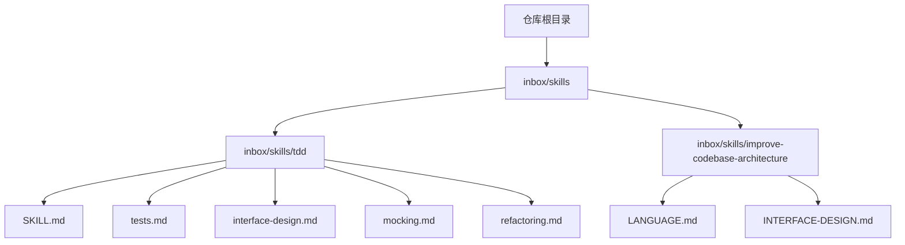

图表来源
- [README.md:1-113](file://README.md#L1-L113)
- [tdd/SKILL.md:1-110](file://inbox/skills/tdd/SKILL.md#L1-L110)
- [improve-codebase-architecture/LANGUAGE.md:1-54](file://inbox/skills/improve-codebase-architecture/LANGUAGE.md#L1-L54)
- [improve-codebase-architecture/INTERFACE-DESIGN.md:1-45](file://inbox/skills/improve-codebase-architecture/INTERFACE-DESIGN.md#L1-L45)

章节来源
- [README.md:1-113](file://README.md#L1-L113)

## 核心组件
- TDD 方法论：以“红-绿-重构”为核心循环，强调行为驱动、垂直切片、增量迭代与持续重构。
- 接口设计：以“模块-接口-深度-接缝-适配器-杠杆效应-局部性”等术语统一语言，指导可测试性与可维护性。
- 模拟测试：限定在系统边界处使用 Mock，优先依赖注入与 SDK 风格接口。
- 重构策略：聚焦重复、过长方法、浅层模块、特征依恋、基本类型偏执等问题域。
- 技能演进与循环：通过 skill-evolve 与 skill-evolve-cycle 对技能文档进行结构化优化与持续演进。

章节来源
- [tdd/SKILL.md:1-110](file://inbox/skills/tdd/SKILL.md#L1-L110)
- [tdd/tests.md:1-62](file://inbox/skills/tdd/tests.md#L1-L62)
- [tdd/interface-design.md:1-32](file://inbox/skills/tdd/interface-design.md#L1-L32)
- [tdd/mocking.md:1-60](file://inbox/skills/tdd/mocking.md#L1-L60)
- [tdd/refactoring.md:1-11](file://inbox/skills/tdd/refactoring.md#L1-L11)
- [improve-codebase-architecture/LANGUAGE.md:1-54](file://inbox/skills/improve-codebase-architecture/LANGUAGE.md#L1-L54)
- [improve-codebase-architecture/INTERFACE-DESIGN.md:1-45](file://inbox/skills/improve-codebase-architecture/INTERFACE-DESIGN.md#L1-L45)
- [skill-evolve/SKILL.md:1-371](file://skills/skill-evolve/SKILL.md#L1-L371)
- [skill-evolve-cycle/SKILL.md:1-308](file://skills/skill-evolve-cycle/SKILL.md#L1-L308)

## 架构总览
本方法论工具的“架构”体现在两方面：
- 文档架构：以模板 SKILL.md 为标准，通过 skill-evolve 对技能文档进行结构化优化，确保“元数据—工作流程—参考—示例—脚本”等标准章节齐备。
- 方法论架构：以 TDD 五阶段与接口设计语言为内核，结合模拟测试与重构策略，形成从“行为定义—接口设计—测试先行—实现—重构—演进”的闭环。

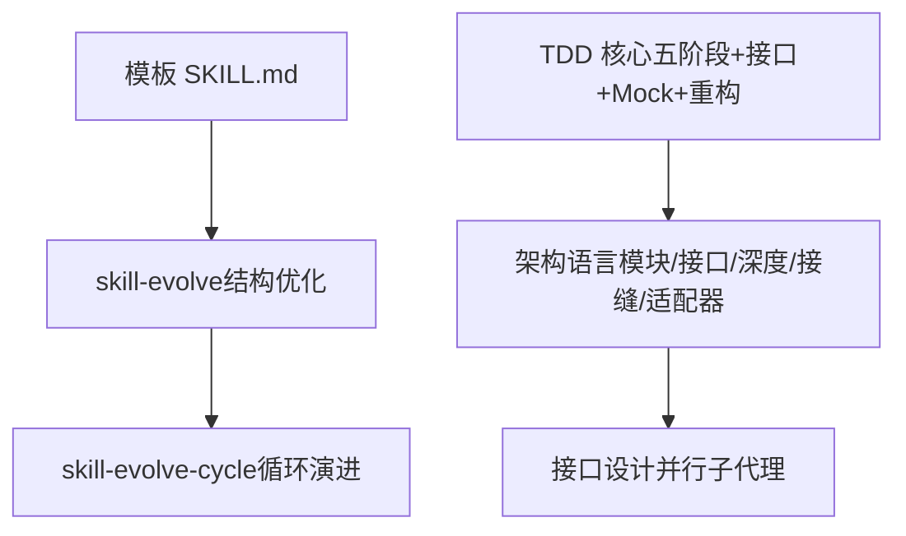

图表来源
- [templates/SKILL.md:1-30](file://templates/SKILL.md#L1-L30)
- [skill-evolve/SKILL.md:1-371](file://skills/skill-evolve/SKILL.md#L1-L371)
- [skill-evolve-cycle/SKILL.md:1-308](file://skills/skill-evolve-cycle/SKILL.md#L1-L308)
- [tdd/SKILL.md:1-110](file://inbox/skills/tdd/SKILL.md#L1-L110)
- [improve-codebase-architecture/LANGUAGE.md:1-54](file://inbox/skills/improve-codebase-architecture/LANGUAGE.md#L1-L54)
- [improve-codebase-architecture/INTERFACE-DESIGN.md:1-45](file://inbox/skills/improve-codebase-architecture/INTERFACE-DESIGN.md#L1-L45)

## 详细组件分析

### TDD 五阶段与工作流
- 红-绿-重构循环：以“行为定义—最小实现—重构—验证—下一行为”的节奏推进，保证每次改动可控、可验证。
- 规划阶段：与用户确认接口变更与行为优先级，识别“深模块”机会，设计可测试性接口，列出需验证的行为。
- Tracer Bullet：首个端到端测试，验证路径可用性。
- 增量循环：一次一个测试，只编写刚好通过当前测试的实现，避免过度设计。
- 重构：在所有测试通过后，提取重复、加深模块、应用 SOLID 原则，每步后回归测试。

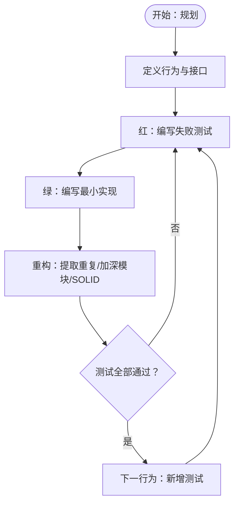

图表来源
- [tdd/SKILL.md:43-109](file://inbox/skills/tdd/SKILL.md#L43-L109)

章节来源
- [tdd/SKILL.md:43-109](file://inbox/skills/tdd/SKILL.md#L43-L109)

### 接口设计原则与语言体系
- 统一术语：模块、接口、实现、深度、接缝、适配器、杠杆效应、局部性。
- 设计目标：通过“深度”提升调用者杠杆效应，通过“局部性”降低维护成本。
- 接口即测试面：调用者与测试跨越同一接缝，避免在接口之后进行测试。
- 适配器与接缝：一个适配器代表一个假设性接缝，两个适配器才代表真实接缝。

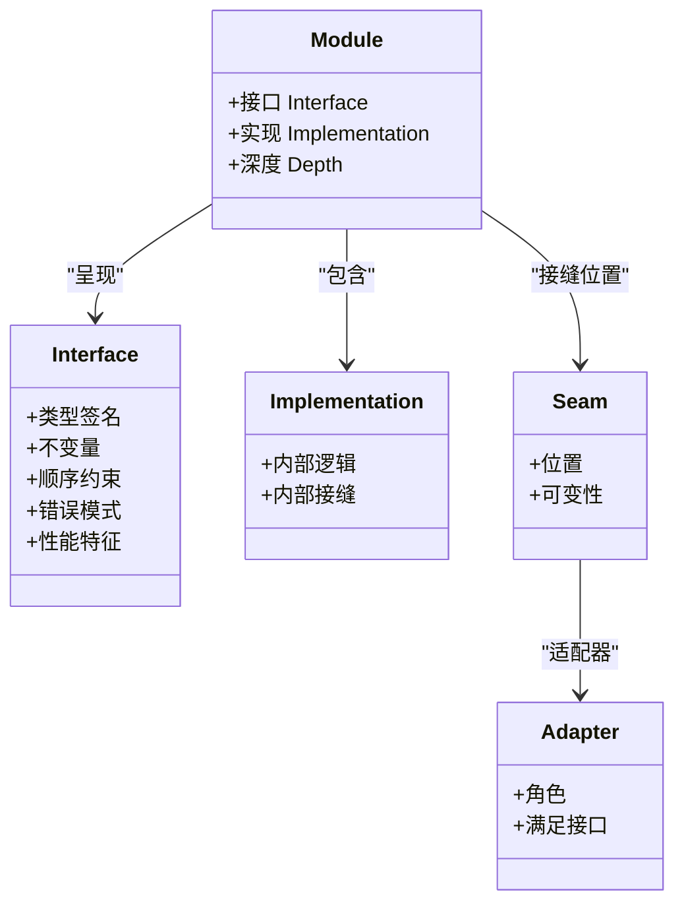

图表来源
- [improve-codebase-architecture/LANGUAGE.md:1-54](file://inbox/skills/improve-codebase-architecture/LANGUAGE.md#L1-L54)

章节来源
- [improve-codebase-architecture/LANGUAGE.md:1-54](file://inbox/skills/improve-codebase-architecture/LANGUAGE.md#L1-L54)

### 可测试性接口设计
- 依赖注入：接受依赖而非创建依赖，便于在边界处替换。
- 结果返回：返回结果而非产生副作用，减少隐式状态。
- 小表面积：更少方法与参数，简化测试设置与断言。

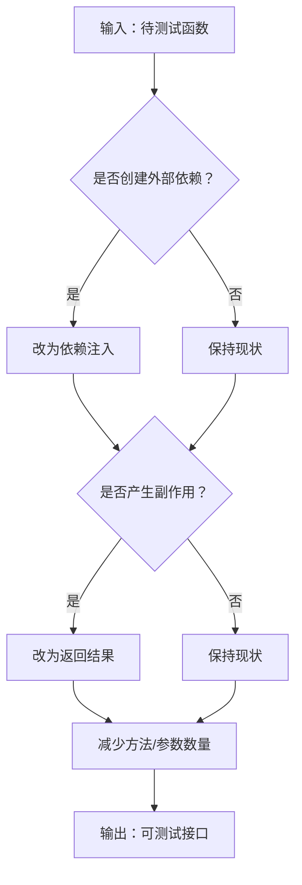

图表来源
- [tdd/interface-design.md:1-32](file://inbox/skills/tdd/interface-design.md#L1-L32)

章节来源
- [tdd/interface-design.md:1-32](file://inbox/skills/tdd/interface-design.md#L1-L32)

### 模拟测试策略
- 仅在系统边界处使用 Mock：外部 API、数据库、时间/随机性、文件系统。
- 不 Mock 自己的类/模块与内部协作对象。
- 为可 Mock 性设计：依赖注入、SDK 风格接口（每个端点独立函数），降低条件逻辑与测试复杂度。

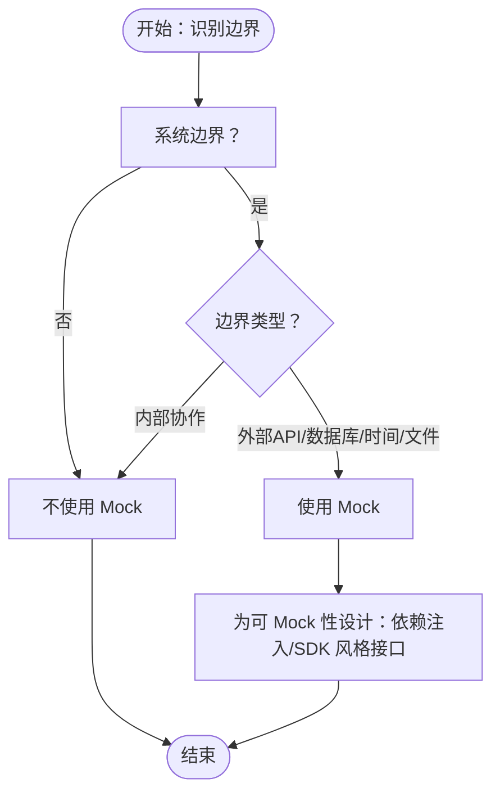

图表来源
- [tdd/mocking.md:1-60](file://inbox/skills/tdd/mocking.md#L1-L60)

章节来源
- [tdd/mocking.md:1-60](file://inbox/skills/tdd/mocking.md#L1-L60)

### 重构技巧与候选
- 重复代码：提取函数/类
- 过长方法：拆分为私有辅助方法（保持测试在公共接口上）
- 浅层模块：合并或深化
- 特征依恋：将逻辑移到数据所在位置
- 基本类型偏执：引入值对象
- 新旧代码对照：利用新代码揭示的视角审视既有问题

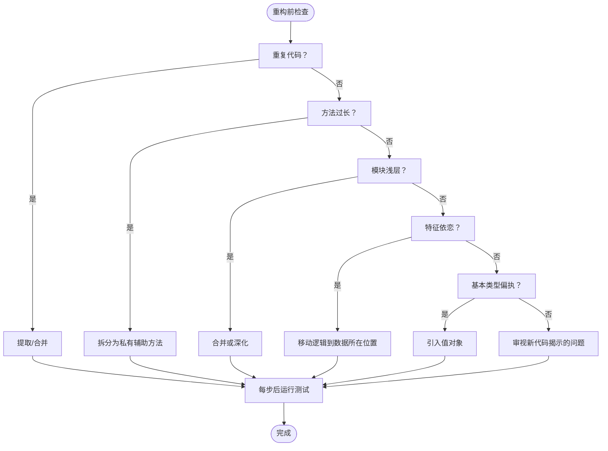

图表来源
- [tdd/refactoring.md:1-11](file://inbox/skills/tdd/refactoring.md#L1-L11)

章节来源
- [tdd/refactoring.md:1-11](file://inbox/skills/tdd/refactoring.md#L1-L11)

### 好测试与坏测试
- 好测试：集成风格、通过公共 API、描述 WHAT 而非 HOW、在重构后仍能通过、每个测试一个逻辑断言。
- 坏测试：测试实现细节、Mock 内部协作、断言调用次数/顺序、绕过接口验证、测试名称描述 HOW。

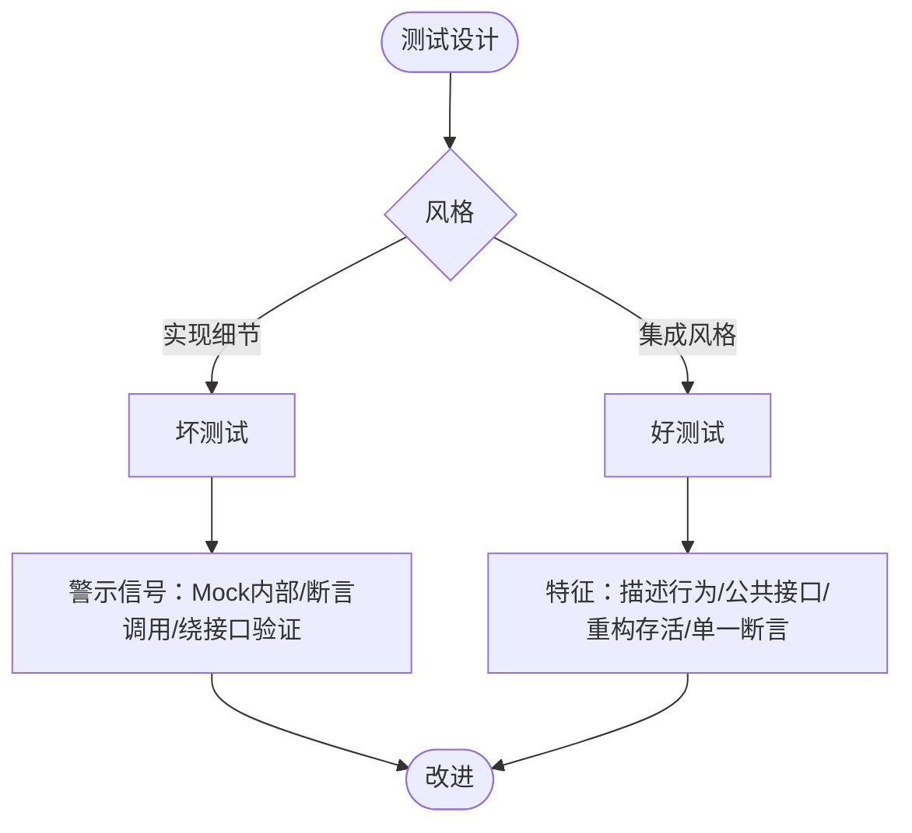

图表来源
- [tdd/tests.md:1-62](file://inbox/skills/tdd/tests.md#L1-L62)

章节来源
- [tdd/tests.md:1-62](file://inbox/skills/tdd/tests.md#L1-L62)

### 接口设计并行子代理流程
- 界定问题空间：约束条件、依赖类别、示意性草图。
- 生成子代理：并行产出多个截然不同的接口设计方案，分别强调最小化接口、最大化灵活性、为常见调用者优化、跨接缝依赖的端口与适配器设计。
- 展示与比较：按“深度/局部性/接缝位置”对比，给出推荐与混合方案。

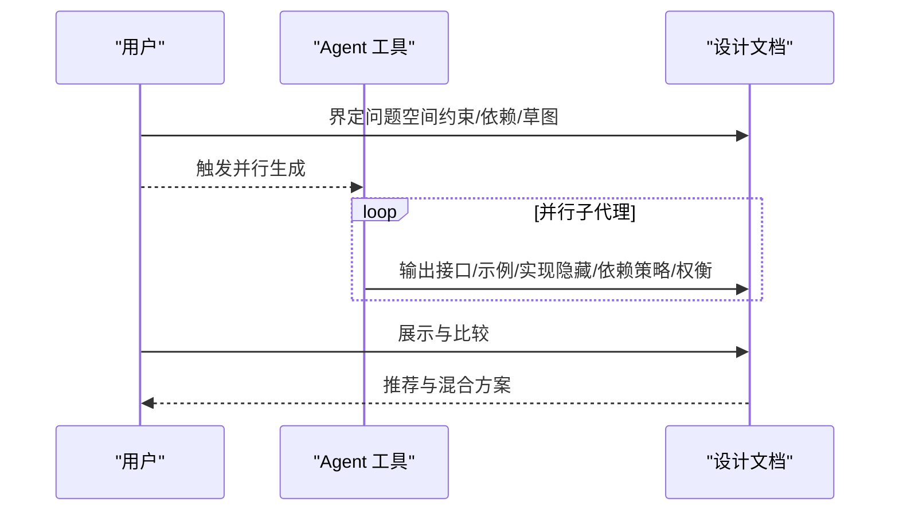

图表来源
- [improve-codebase-architecture/INTERFACE-DESIGN.md:7-44](file://inbox/skills/improve-codebase-architecture/INTERFACE-DESIGN.md#L7-L44)

章节来源
- [improve-codebase-architecture/INTERFACE-DESIGN.md:1-45](file://inbox/skills/improve-codebase-architecture/INTERFACE-DESIGN.md#L1-L45)

### 技能演进与循环
- skill-evolve：对单个技能文档进行结构对齐、格式标准化、内容精炼、参考文档拆分与同步校验。
- skill-evolve-cycle：在“优化—评审—修复—合并—回溯”大循环与“优化—修复—再评审收敛”小循环之间交替，直至收敛或达到迭代上限。

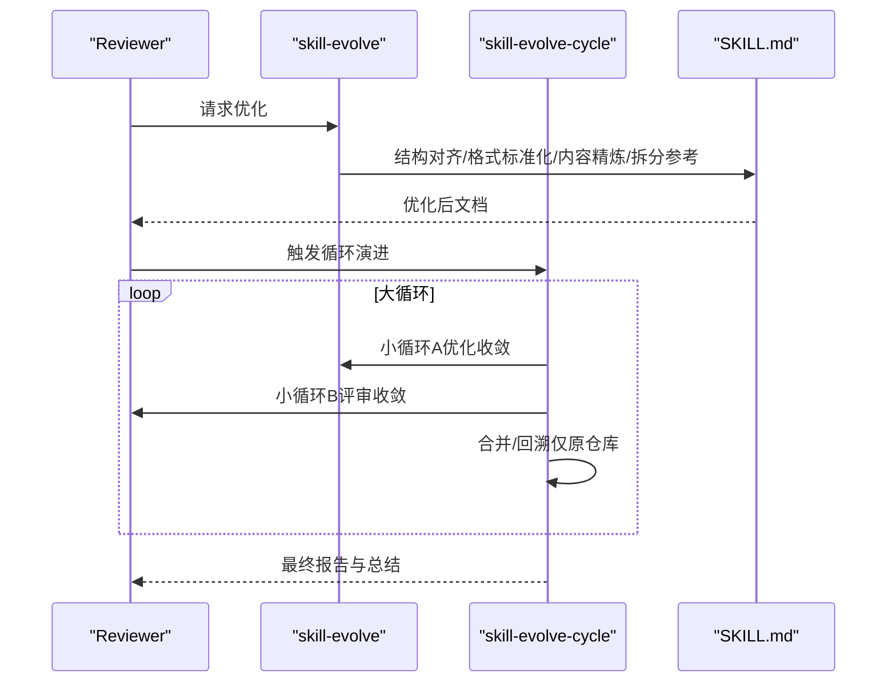

图表来源
- [skill-evolve/SKILL.md:1-371](file://skills/skill-evolve/SKILL.md#L1-L371)
- [skill-evolve-cycle/SKILL.md:1-308](file://skills/skill-evolve-cycle/SKILL.md#L1-L308)

章节来源
- [skill-evolve/SKILL.md:1-371](file://skills/skill-evolve/SKILL.md#L1-L371)
- [skill-evolve-cycle/SKILL.md:1-308](file://skills/skill-evolve-cycle/SKILL.md#L1-L308)

## 依赖关系分析
- TDD 与架构语言相互支撑：TDD 的“行为—接口—实现”与架构语言的“模块—接口—深度—接缝—适配器”形成一致的抽象与沟通语言。
- 接口设计与可测试性：接口设计原则直接决定测试策略与边界划分，从而影响 Mock 的使用范围与测试质量。
- 重构与演进：重构改善代码质量，skill-evolve 保障文档质量，二者共同推动系统稳定与可维护性。

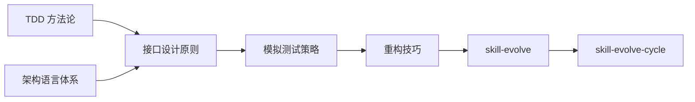

图表来源
- [tdd/SKILL.md:1-110](file://inbox/skills/tdd/SKILL.md#L1-L110)
- [improve-codebase-architecture/LANGUAGE.md:1-54](file://inbox/skills/improve-codebase-architecture/LANGUAGE.md#L1-L54)
- [improve-codebase-architecture/INTERFACE-DESIGN.md:1-45](file://inbox/skills/improve-codebase-architecture/INTERFACE-DESIGN.md#L1-L45)
- [tdd/mocking.md:1-60](file://inbox/skills/tdd/mocking.md#L1-L60)
- [tdd/refactoring.md:1-11](file://inbox/skills/tdd/refactoring.md#L1-L11)
- [skill-evolve/SKILL.md:1-371](file://skills/skill-evolve/SKILL.md#L1-L371)
- [skill-evolve-cycle/SKILL.md:1-308](file://skills/skill-evolve-cycle/SKILL.md#L1-L308)

## 性能考量
- 测试执行性能：优先集成风格测试，减少对内部实现的耦合，有助于在重构后仍保持测试稳定性，降低回归成本。
- 接口设计性能：通过“深度”提升接口杠杆效应，减少调用者与测试的重复实现，提高整体开发效率。
- 文档演进性能：借助 skill-evolve 与 skill-evolve-cycle 的自动化流程，减少手工维护成本，提升知识资产的可读性与一致性。

## 故障排查指南
- 常见问题
  - 测试与实现耦合：若重构未改变行为但测试失败，应检查测试是否关注实现细节而非行为。
  - Mock 使用不当：在内部协作对象上使用 Mock 会导致测试脆弱，应限制在系统边界。
  - 水平切片：批量编写测试后再实现，易导致测试描述“形状”而非“行为”，应采用垂直切片。
- 解决思路
  - 回归到“行为描述”，确保测试名称与断言聚焦 WHAT。
  - 通过依赖注入与 SDK 风格接口降低 Mock 复杂度。
  - 严格遵循“红-绿-重构”节奏，避免预测未来测试。

章节来源
- [tdd/tests.md:25-61](file://inbox/skills/tdd/tests.md#L25-L61)
- [tdd/mocking.md:10-15](file://inbox/skills/tdd/mocking.md#L10-L15)
- [tdd/SKILL.md:18-41](file://inbox/skills/tdd/SKILL.md#L18-L41)

## 结论
本方法论工具以 TDD 五阶段与接口设计语言为核心，辅以模拟测试与重构策略，并通过 skill-evolve 与 skill-evolve-cycle 实现文档与知识的持续演进。团队可据此建立“行为驱动—接口清晰—测试先行—实现稳健—持续重构—文档一致”的开发闭环，显著提升代码质量与交付效率。

## 附录
- 实践示例（代码片段路径）
  - [TDD 工作流概览:43-109](file://inbox/skills/tdd/SKILL.md#L43-L109)
  - [好测试与坏测试对比:1-62](file://inbox/skills/tdd/tests.md#L1-L62)
  - [可测试性接口设计要点:1-32](file://inbox/skills/tdd/interface-design.md#L1-L32)
  - [Mock 使用场景与反模式:1-60](file://inbox/skills/tdd/mocking.md#L1-L60)
  - [重构候选清单:1-11](file://inbox/skills/tdd/refactoring.md#L1-L11)
  - [架构语言术语与原则:1-54](file://inbox/skills/improve-codebase-architecture/LANGUAGE.md#L1-L54)
  - [接口设计并行子代理流程:1-45](file://inbox/skills/improve-codebase-architecture/INTERFACE-DESIGN.md#L1-L45)
  - [技能演进与循环流程:1-308](file://skills/skill-evolve-cycle/SKILL.md#L1-L308)

- 测试覆盖率与代码质量评估方法
  - 覆盖率：以“行为覆盖”为导向，优先覆盖关键路径与复杂逻辑，结合集成测试与边界测试，避免过度关注分支覆盖而忽略行为覆盖。
  - 代码质量：通过“深度/局部性/接缝位置/适配器数量”等指标评估模块质量；结合评审清单与自动化检查（如 Review List）确保一致性与可维护性。
  - 文档质量：使用 skill-evolve 的结构化标准与格式规范，确保 SKILL.md 的元数据、工作流程、参考与示例齐备且一致。

- 团队推广建议
  - 培训与示范：以具体技能文档为案例，演示 TDD 五阶段与接口设计语言的应用。
  - 工具链集成：在 CI 中加入评审与格式检查，强制执行 Review List 与模板标准。
  - 持续演进：定期使用 skill-evolve 与 skill-evolve-cycle 对团队知识资产进行结构化优化与循环演进。

章节来源
- [skill-evolve/SKILL.md:306-371](file://skills/skill-evolve/SKILL.md#L306-L371)
- [skill-evolve-cycle/SKILL.md:281-308](file://skills/skill-evolve-cycle/SKILL.md#L281-L308)