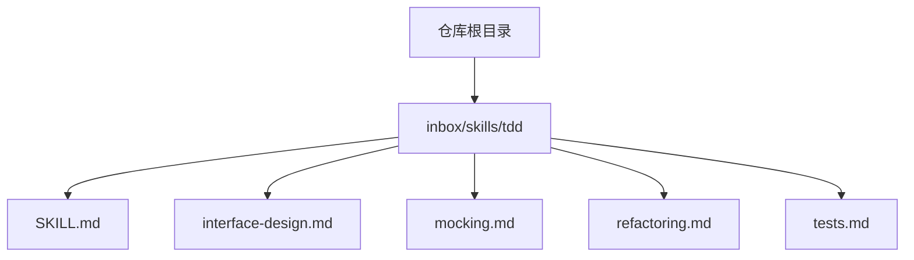
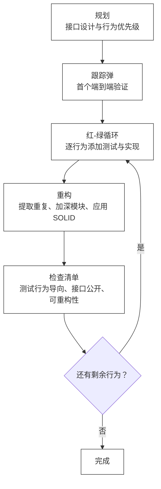
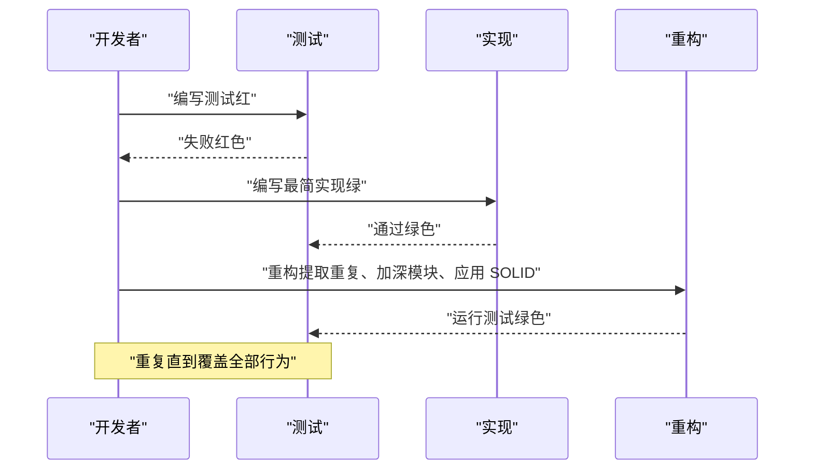
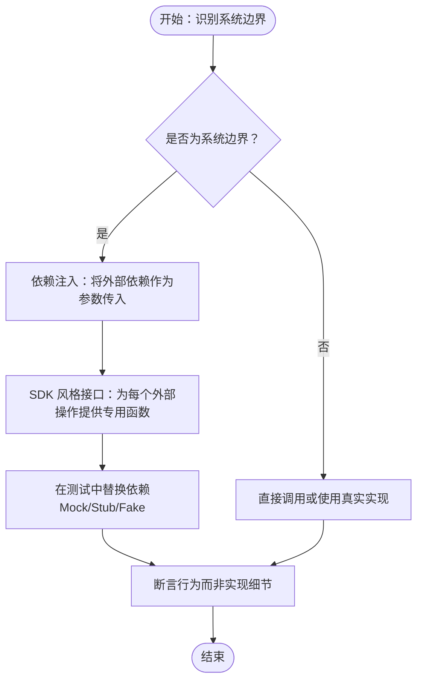
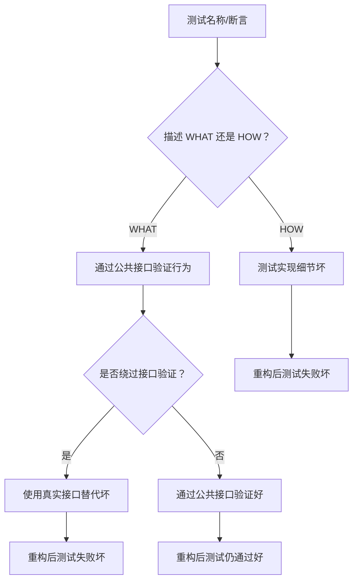
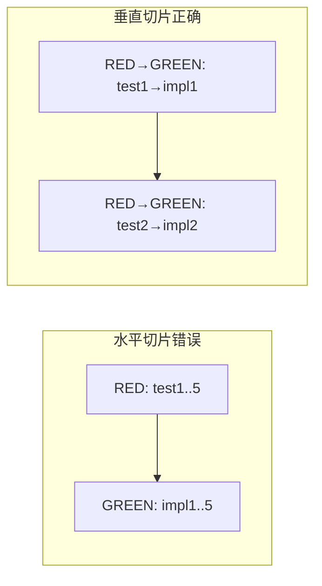
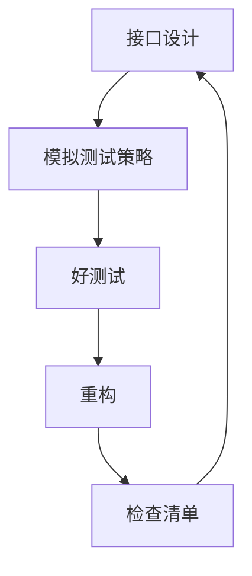

# 测试驱动开发 (TDD)

<cite>
**本文引用的文件**
- [SKILL.md](file://skills/inbox/skills/tdd/SKILL.md)
- [interface-design.md](file://skills/inbox/skills/tdd/interface-design.md)
- [mocking.md](file://skills/inbox/skills/tdd/mocking.md)
- [refactoring.md](file://skills/inbox/skills/tdd/refactoring.md)
- [tests.md](file://skills/inbox/skills/tdd/tests.md)
</cite>

## 目录
1. [引言](#引言)
2. [项目结构](#项目结构)
3. [核心组件](#核心组件)
4. [架构总览](#架构总览)
5. [详细组件分析](#详细组件分析)
6. [依赖分析](#依赖分析)
7. [性能考虑](#性能考虑)
8. [故障排查指南](#故障排查指南)
9. [结论](#结论)
10. [附录](#附录)

## 引言
本文件围绕测试驱动开发（TDD）方法论，系统阐述“红-绿-重构”循环的五个阶段及其落地实践，结合仓库内已有的 TDD 技能文档，给出可操作的接口设计原则、模拟测试策略、重构技巧与最佳实践，并提供在团队中推广 TDD 的建议与常见障碍的应对方案。目标是帮助读者以最小成本建立高质量、高可维护性的软件交付流程。

## 项目结构
本仓库中与 TDD 相关的内容主要位于 inbox/skills/tdd 目录，包含以下核心文件：
- SKILL.md：TDD 方法论总览与工作流
- interface-design.md：接口设计原则与可测试性
- mocking.md：模拟测试策略与可 Mock 设计
- refactoring.md：重构候选与实践要点
- tests.md：好测试与坏测试的判别与示例

图示来源
- [SKILL.md](file://skills/inbox/skills/tdd/SKILL.md)
- [interface-design.md](file://skills/inbox/skills/tdd/interface-design.md)
- [mocking.md](file://skills/inbox/skills/tdd/mocking.md)
- [refactoring.md](file://skills/inbox/skills/tdd/refactoring.md)
- [tests.md](file://skills/inbox/skills/tdd/tests.md)

章节来源
- [SKILL.md:1-110](file://skills/inbox/skills/tdd/SKILL.md#L1-L110)

## 核心组件
- 红-绿-重构循环：以“规划—跟踪弹—增量循环—重构—检查清单”的节奏推进，强调“先失败、再通过、最后优化”，并通过检查清单确保测试行为导向、接口公开、可重构性强。
- 接口设计原则：依赖注入、返回结果而非副作用、接口表面积最小化，使测试自然、稳定且易维护。
- 模拟测试策略：仅在系统边界使用 Mock，避免对内部协作对象与可控模块进行 Mock；通过 SDK 风格接口提升可测性与可替换性。
- 重构候选：聚焦重复代码、过长方法、浅层模块、特征依恋、基本类型偏执等问题，结合 SOLID 原则与自然位置迁移进行优化。
- 好测试与坏测试：集成风格测试通过公共接口验证行为，描述 WHAT 而非 HOW；坏测试常与实现耦合、测试内部细节或绕过接口验证。

章节来源
- [SKILL.md:43-110](file://skills/inbox/skills/tdd/SKILL.md#L43-L110)
- [interface-design.md:1-32](file://skills/inbox/skills/tdd/interface-design.md#L1-L32)
- [mocking.md:1-60](file://skills/inbox/skills/tdd/mocking.md#L1-L60)
- [refactoring.md:1-11](file://skills/inbox/skills/tdd/refactoring.md#L1-L11)
- [tests.md:1-62](file://skills/inbox/skills/tdd/tests.md#L1-L62)

## 架构总览
下图展示了 TDD 在单次迭代中的典型流程：从规划与接口设计开始，进入红-绿-重构循环，期间穿插检查与重构，最终形成稳定、可演进的代码与测试体系。

图示来源
- [SKILL.md:45-109](file://skills/inbox/skills/tdd/SKILL.md#L45-L109)

## 详细组件分析

### 组件一：规划与接口设计
- 关键点
  - 使用领域术语统一测试与接口命名，尊重既有 ADR 与语言约定。
  - 与用户确认接口变更与行为优先级，集中测试关键路径与复杂逻辑。
  - 设计可测试接口：依赖注入、返回结果、接口表面积最小化。
- 实施建议
  - 在规划阶段明确“公共接口应该是什么样”，列出要测试的行为（而非实现步骤）。
  - 优先识别深模块机会（小接口、深实现），降低测试复杂度。
- 示例参考
  - 依赖注入与返回结果优于内部创建与副作用的对比示例。

章节来源
- [SKILL.md:45-61](file://skills/inbox/skills/tdd/SKILL.md#L45-L61)
- [SKILL.md:53-56](file://skills/inbox/skills/tdd/SKILL.md#L53-L56)
- [interface-design.md:5-32](file://skills/inbox/skills/tdd/interface-design.md#L5-L32)

### 组件二：红-绿-重构循环
- 红：编写一个测试，验证预期行为，测试失败（红色）。
- 绿：编写最简实现，使测试通过（绿色）。
- 重构：在所有测试通过后，查找重构候选并执行，每次重构后运行测试。
- 增量循环：按行为逐一推进，一次一个测试，只编写足够通过当前测试的代码。
- 检查清单：测试描述行为而非实现、仅使用公共接口、能在内部重构后存活、代码是最小实现、不添加投机性功能。

图示来源
- [SKILL.md:62-109](file://skills/inbox/skills/tdd/SKILL.md#L62-L109)

章节来源
- [SKILL.md:62-109](file://skills/inbox/skills/tdd/SKILL.md#L62-L109)

### 组件三：模拟测试策略（Mock/Stub/Fake）
- 边界与范围
  - 仅在系统边界使用 Mock：外部 API、数据库（优先测试数据库）、时间/随机性、文件系统。
  - 不要 Mock 自己的类/模块、内部协作对象或可控组件。
- 可 Mock 设计
  - 依赖注入：将外部依赖作为参数传入，便于替换。
  - SDK 风格接口：为每个外部操作提供专用函数，避免通用请求器带来的复杂条件逻辑。
- 好处
  - 每个 mock 返回特定形状，测试设置无需条件逻辑，更易定位使用了哪些端点，具备类型安全。

图示来源
- [mocking.md:3-60](file://skills/inbox/skills/tdd/mocking.md#L3-L60)

章节来源
- [mocking.md:1-60](file://skills/inbox/skills/tdd/mocking.md#L1-L60)

### 组件四：重构技巧与最佳实践
- 重构候选
  - 重复代码：提取函数/类
  - 过长方法：拆分为私有辅助方法（保持测试在公共接口上）
  - 浅层模块：合并或深化
  - 特征依恋：将逻辑移到数据所在位置
  - 基本类型偏执：引入值对象
  - 新代码揭示的既有问题：基于反馈持续改进
- 注意事项
  - 永远不要在 RED 状态下重构；先达到 GREEN 再进行重构。

章节来源
- [refactoring.md:1-11](file://skills/inbox/skills/tdd/refactoring.md#L1-L11)
- [SKILL.md:91-99](file://skills/inbox/skills/tdd/SKILL.md#L91-L99)

### 组件五：好测试与坏测试
- 好测试
  - 集成风格：通过真实接口测试，描述 WHAT（什么）而非 HOW（如何）
  - 特征：测试用户/调用者关心的行为、仅使用公共 API、在内部重构后仍能通过、每个测试一个逻辑断言
- 坏测试警示信号
  - Mock 内部协作对象、测试私有方法、断言调用次数/顺序、重构（未改变行为）时测试失败、测试名称描述 HOW 而非 WHAT、绕过接口进行验证
- 示例参考
  - 通过接口验证与绕过接口验证的对比示例。

图示来源
- [tests.md:3-62](file://skills/inbox/skills/tdd/tests.md#L3-L62)

章节来源
- [tests.md:1-62](file://skills/inbox/skills/tdd/tests.md#L1-L62)

### 组件六：反模式与正确做法（垂直切片 vs 水平切片）
- 水平切片（错误做法）
  - 先写所有测试，再写所有实现
  - 导致测试关注“形状”而非“行为”，对真实变化不敏感
- 垂直切片（正确做法）
  - 一个测试 → 一个实现 → 重复
  - 每个测试响应上一个周期学到的知识，测试更贴近真实行为

图示来源
- [SKILL.md:18-41](file://skills/inbox/skills/tdd/SKILL.md#L18-L41)

章节来源
- [SKILL.md:18-41](file://skills/inbox/skills/tdd/SKILL.md#L18-L41)

## 依赖分析
- 组件耦合与内聚
  - 接口设计与模拟测试策略共同决定测试的稳定性与可维护性
  - 重构与检查清单保障测试在内部结构变化后仍能存活
- 外部依赖与集成点
  - 系统边界（外部 API、数据库、时间/随机性、文件系统）是 Mock 的合理场景
  - 通过依赖注入与 SDK 风格接口降低对外部依赖的耦合

图示来源
- [interface-design.md:1-32](file://skills/inbox/skills/tdd/interface-design.md#L1-L32)
- [mocking.md:1-60](file://skills/inbox/skills/tdd/mocking.md#L1-L60)
- [tests.md:1-62](file://skills/inbox/skills/tdd/tests.md#L1-L62)
- [refactoring.md:1-11](file://skills/inbox/skills/tdd/refactoring.md#L1-L11)
- [SKILL.md:101-109](file://skills/inbox/skills/tdd/SKILL.md#L101-L109)

章节来源
- [interface-design.md:1-32](file://skills/inbox/skills/tdd/interface-design.md#L1-L32)
- [mocking.md:1-60](file://skills/inbox/skills/tdd/mocking.md#L1-L60)
- [tests.md:1-62](file://skills/inbox/skills/tdd/tests.md#L1-L62)
- [refactoring.md:1-11](file://skills/inbox/skills/tdd/refactoring.md#L1-L11)
- [SKILL.md:101-109](file://skills/inbox/skills/tdd/SKILL.md#L101-L109)

## 性能考虑
- 测试执行效率
  - 通过依赖注入与 SDK 风格接口减少测试设置复杂度，缩短测试准备时间
  - 集成风格测试减少对内部实现的依赖，降低测试维护成本
- 代码质量与可维护性
  - 重构候选聚焦重复与深层模块，有助于降低长期维护成本
  - 好测试在内部重构后仍能通过，减少回归风险

## 故障排查指南
- 常见问题与症状
  - 重构后测试失败：可能测试了实现细节而非行为
  - 测试名称描述 HOW 而非 WHAT：需调整为行为导向
  - 绕过接口验证：应通过公共接口进行验证
  - 对内部协作对象进行 Mock：违反“仅在系统边界使用 Mock”的原则
- 解决步骤
  - 回归到公共接口验证行为
  - 将内部协作对象替换为真实实现或受控替身
  - 采用 SDK 风格接口，简化测试设置与断言
  - 每次重构后运行测试，确保行为一致性

章节来源
- [tests.md:25-62](file://skills/inbox/skills/tdd/tests.md#L25-L62)
- [mocking.md:10-14](file://skills/inbox/skills/tdd/mocking.md#L10-L14)

## 结论
TDD 的核心在于以行为为导向的测试与最小可行实现的快速反馈。通过“规划—跟踪弹—增量循环—重构—检查清单”的闭环，配合可测试的接口设计、合理的模拟测试策略与持续的重构实践，能够显著提升代码质量与测试覆盖率。在团队中推广 TDD 时，应重视接口设计原则与测试文化，逐步消除水平切片与坏测试的反模式，建立以公共接口验证行为的测试体系。

## 附录
- 工具链与持续集成建议（概念性）
  - 测试框架：选择支持断言与测试组织的主流框架
  - Mock 库：在系统边界使用轻量级替身库，避免过度复杂
  - CI 配置：在流水线中强制执行“红-绿-重构”检查清单项，确保测试行为导向与接口公开
  - 文档与培训：将接口设计、模拟测试与重构策略纳入团队知识库与新人培训