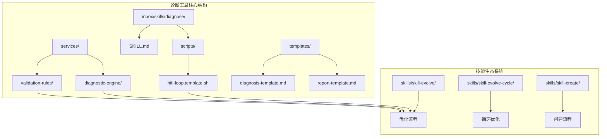
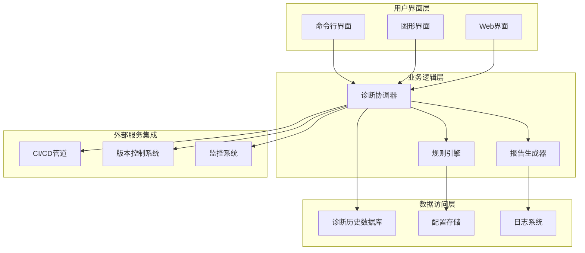
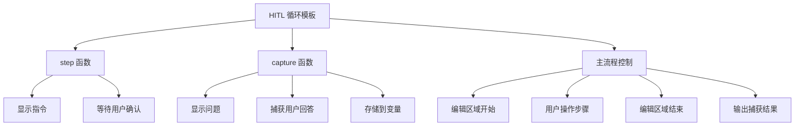
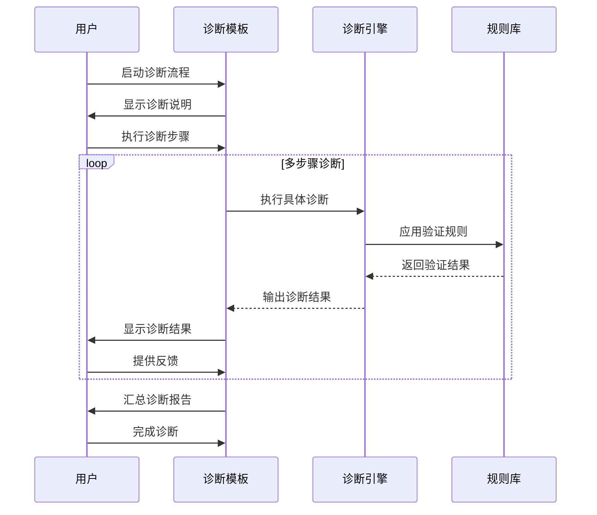
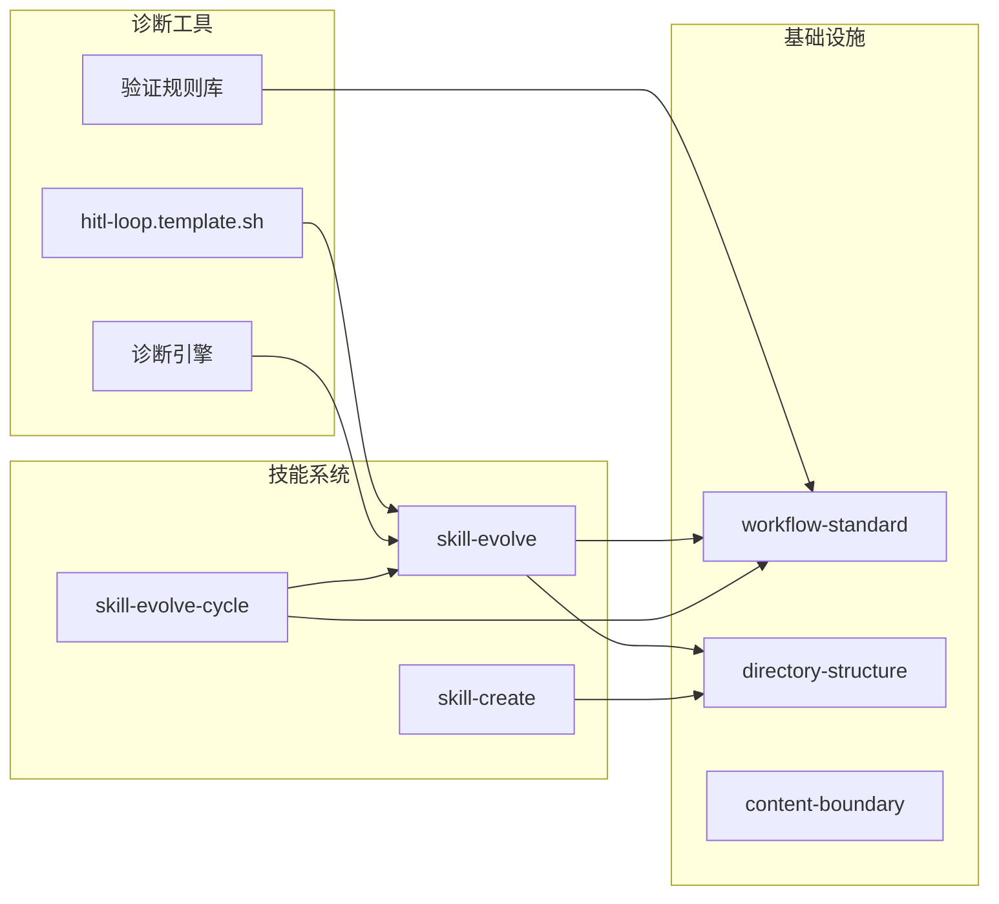

# 诊断工具

<cite>
**本文档引用的文件**
- [hitl-loop.template.sh](file://inbox/skills/diagnose/scripts/hitl-loop.template.sh)
- [SKILL.md](file://inbox/skills/diagnose/scripts/SKILL.md)
- [SKILL.md](file://skills/skill-evolve/SKILL.md)
- [workflow-standard.md](file://skills/skill-evolve/references/workflow-standard.md)
- [SKILL.md](file://skills/skill-evolve-cycle/SKILL.md)
- [README.md](file://README.md)
</cite>

## 目录
1. [简介](#简介)
2. [项目结构](#项目结构)
3. [核心组件](#核心组件)
4. [架构概览](#架构概览)
5. [详细组件分析](#详细组件分析)
6. [依赖关系分析](#依赖关系分析)
7. [性能考虑](#性能考虑)
8. [故障排除指南](#故障排除指南)
9. [结论](#结论)

## 简介

Skills Collection 的诊断工具是一个强大的技能开发和优化辅助系统，专注于通过结构化的方法论来提升技能的质量和可靠性。该工具的核心设计目标是提供一个标准化的诊断流程，帮助开发者识别、分析和解决技能开发过程中的各种问题。

诊断工具的主要特点包括：
- **标准化诊断流程**：基于严格的步骤定义和验证标准
- **人机协作模式**：通过 HITL（Human-in-the-Loop）循环实现人机协同诊断
- **自动化与人工验证结合**：既支持自动化检测，也允许人工深度分析
- **可扩展性**：模块化的架构设计，便于添加新的诊断能力

## 项目结构

诊断工具在 Skills Collection 中采用分层组织结构，主要包含以下关键目录和文件：

**图表来源**
- [hitl-loop.template.sh:1-42](file://inbox/skills/diagnose/scripts/hitl-loop.template.sh#L1-L42)
- [SKILL.md:1-371](file://skills/skill-evolve/SKILL.md#L1-L371)

**章节来源**
- [README.md:1-113](file://README.md#L1-L113)
- [hitl-loop.template.sh:1-42](file://inbox/skills/diagnose/scripts/hitl-loop.template.sh#L1-L42)

## 核心组件

### HITL 循环模板引擎

HITL（Human-in-the-Loop）循环模板是诊断工具的核心组件，它提供了一个标准化的人机协作框架。该模板通过预定义的步骤和交互机制，确保诊断过程的一致性和可重复性。

#### 主要功能特性

1. **标准化交互接口**
   - 统一的指令显示格式
   - 结构化的用户输入捕获
   - 标准化的结果输出格式

2. **灵活的诊断流程**
   - 可编辑的诊断步骤
   - 支持多种诊断场景
   - 可扩展的验证规则

3. **结果管理**
   - 结构化的数据捕获
   - 标准化的输出格式
   - 便于后续分析的数据结构

**章节来源**
- [hitl-loop.template.sh:1-42](file://inbox/skills/diagnose/scripts/hitl-loop.template.sh#L1-L42)

### 诊断引擎

诊断引擎负责执行具体的诊断任务，包括但不限于：

- **代码质量检查**：语法错误、逻辑错误检测
- **性能分析**：运行时性能监控和分析
- **安全审计**：潜在安全漏洞识别
- **兼容性测试**：多平台、多环境适配性验证

### 验证规则库

验证规则库提供了标准化的检查规则，确保诊断结果的准确性和一致性。这些规则涵盖了：

- **结构化规则**：基于预定义模板的结构验证
- **行为规则**：基于期望行为的正确性检查
- **性能规则**：基于性能指标的评估标准
- **安全规则**：基于安全最佳实践的检查清单

## 架构概览

诊断工具的整体架构采用分层设计，确保各组件之间的松耦合和高内聚：

**图表来源**
- [SKILL.md:45-150](file://skills/skill-evolve-cycle/SKILL.md#L45-L150)
- [SKILL.md:30-171](file://skills/skill-evolve/SKILL.md#L30-L171)

## 详细组件分析

### HITL 循环模板实现

HITL 循环模板通过 Bash 脚本实现了标准化的人机协作诊断流程。该实现具有以下关键特征：

#### 核心函数设计

**图表来源**
- [hitl-loop.template.sh:17-27](file://inbox/skills/diagnose/scripts/hitl-loop.template.sh#L17-L27)

#### 数据流处理

HITL 循环模板采用标准化的数据流处理方式：

1. **输入处理**：通过 `capture` 函数统一处理用户输入
2. **状态管理**：使用环境变量存储诊断状态
3. **输出格式化**：以 `KEY=VALUE` 格式输出结果，便于后续解析

#### 错误处理机制

模板内置了健壮的错误处理机制：

- **严格模式**：启用 `set -euo pipefail` 确保脚本稳定性
- **输入验证**：对用户输入进行基本验证
- **结果确认**：提供明确的结果输出格式

**章节来源**
- [hitl-loop.template.sh:1-42](file://inbox/skills/diagnose/scripts/hitl-loop.template.sh#L1-L42)

### 诊断流程设计

诊断工具遵循严格的流程设计原则，确保诊断过程的系统性和有效性：

#### 标准化诊断步骤

**图表来源**
- [SKILL.md:64-96](file://skills/skill-evolve-cycle/SKILL.md#L64-L96)
- [SKILL.md:30-171](file://skills/skill-evolve/SKILL.md#L30-L171)

#### 质量保证机制

诊断流程包含了多层次的质量保证机制：

1. **预检查阶段**：验证环境和前置条件
2. **执行阶段**：按顺序执行诊断步骤
3. **审查阶段**：对诊断结果进行全面审查
4. **输出阶段**：生成最终报告和建议

**章节来源**
- [SKILL.md:45-150](file://skills/skill-evolve-cycle/SKILL.md#L45-L150)
- [SKILL.md:30-171](file://skills/skill-evolve/SKILL.md#L30-L171)

## 依赖关系分析

诊断工具与其他 Skills Collection 组件之间存在紧密的依赖关系：

**图表来源**
- [SKILL.md:1-308](file://skills/skill-evolve-cycle/SKILL.md#L1-L308)
- [SKILL.md:1-371](file://skills/skill-evolve/SKILL.md#L1-L371)

### 关键依赖关系

1. **与 skill-evolve 的集成**
   - 共享相同的 Workflow 标准
   - 使用一致的验证规则
   - 遵循相同的目录结构规范

2. **与 skill-evolve-cycle 的协作**
   - 支持循环优化流程
   - 集成收敛判断机制
   - 共享报告生成标准

3. **与规范文件的关联**
   - workflow-standard.md：定义工作流标准
   - directory-structure.md：规范目录结构
   - content-boundary.md：界定内容边界

**章节来源**
- [SKILL.md:1-308](file://skills/skill-evolve-cycle/SKILL.md#L1-L308)
- [SKILL.md:1-371](file://skills/skill-evolve/SKILL.md#L1-L371)

## 性能考虑

诊断工具在设计时充分考虑了性能优化，确保在大规模项目中也能保持高效的诊断能力：

### 并发处理策略

诊断工具支持并行处理多个诊断任务，提高整体效率：

- **并行诊断执行**：多个独立的诊断任务可以同时运行
- **资源池管理**：合理分配计算资源，避免资源争用
- **负载均衡**：动态调整任务分配，确保系统稳定

### 内存管理优化

- **增量处理**：对于大型文件采用流式处理方式
- **缓存策略**：合理使用缓存减少重复计算
- **内存回收**：及时释放不再使用的资源

### 网络通信优化

- **批量请求**：合并网络请求减少通信开销
- **连接复用**：重用网络连接提高效率
- **超时控制**：设置合理的超时时间避免阻塞

## 故障排除指南

### 常见问题及解决方案

#### HITL 模板运行问题

**问题**：脚本无法正常执行
**解决方案**：
1. 检查 Bash 版本兼容性
2. 验证脚本权限设置
3. 确认依赖工具已安装

**问题**：用户输入处理异常
**解决方案**：
1. 检查终端编码设置
2. 验证输入验证逻辑
3. 查看错误日志输出

#### 诊断流程中断

**问题**：诊断过程中断
**解决方案**：
1. 检查前置条件验证
2. 验证环境配置
3. 查看错误恢复机制

**问题**：结果输出格式异常
**解决方案**：
1. 检查输出格式化逻辑
2. 验证变量赋值过程
3. 确认标准输出重定向

### 调试技巧

1. **启用详细日志**：增加调试信息输出
2. **分步执行**：逐个步骤验证功能
3. **单元测试**：为关键组件编写测试用例
4. **性能监控**：监控资源使用情况

**章节来源**
- [hitl-loop.template.sh:1-42](file://inbox/skills/diagnose/scripts/hitl-loop.template.sh#L1-L42)
- [SKILL.md:152-186](file://skills/skill-evolve-cycle/SKILL.md#L152-L186)

## 结论

Skills Collection 的诊断工具通过其精心设计的架构和标准化的流程，为技能开发和优化提供了强有力的支持。该工具的核心价值体现在以下几个方面：

### 设计优势

1. **标准化程度高**：通过严格的流程定义和验证标准，确保诊断结果的一致性和可靠性
2. **人机协作性强**：HITL 循环模板实现了自动化与人工验证的有机结合
3. **可扩展性好**：模块化的架构设计便于功能扩展和定制
4. **集成度高**：与 Skills Collection 生态系统无缝集成

### 实际应用价值

- **提升开发效率**：通过自动化的诊断流程减少手动检查工作量
- **保证质量标准**：统一的验证规则确保技能质量符合预期标准
- **降低维护成本**：标准化的流程减少了后期维护的复杂性
- **促进知识传承**：结构化的诊断过程便于经验总结和分享

### 发展前景

随着 Skills Collection 生态系统的不断发展，诊断工具将继续演进，为技能开发提供更加智能化和自动化的支持。未来的发展方向包括：

- **AI 辅助诊断**：引入机器学习算法提升诊断准确性
- **实时监控**：实现持续集成环境下的实时质量监控
- **智能建议**：基于历史数据提供个性化的改进建议
- **可视化展示**：提供更加直观的诊断结果展示界面

通过持续的优化和完善，诊断工具将成为 Skills Collection 生态系统中不可或缺的重要组成部分，为技能开发和优化提供强有力的技术支撑。