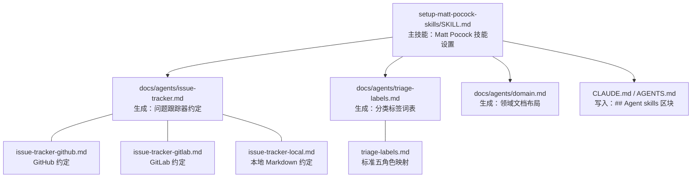
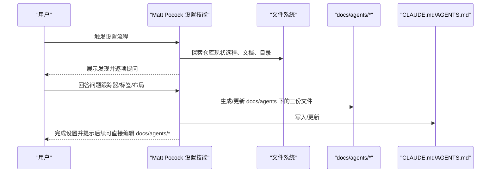
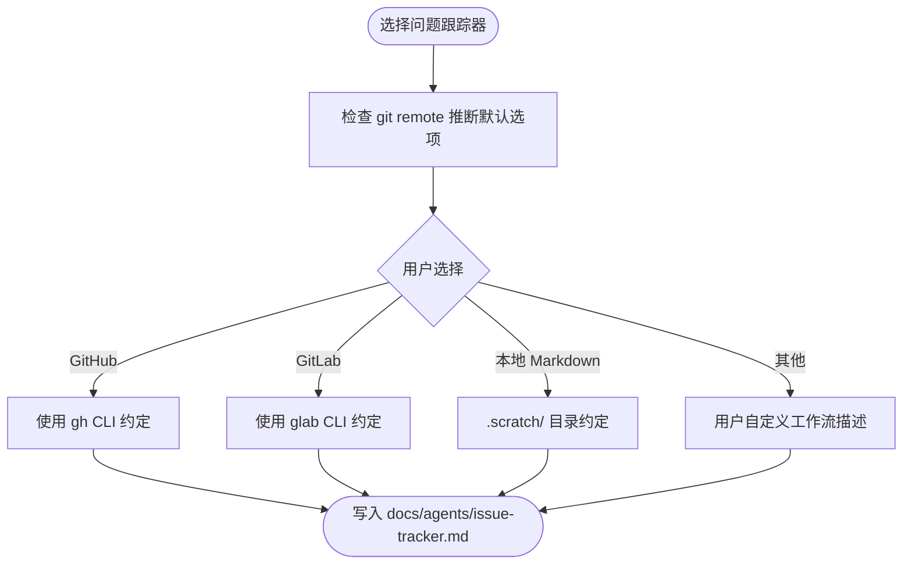
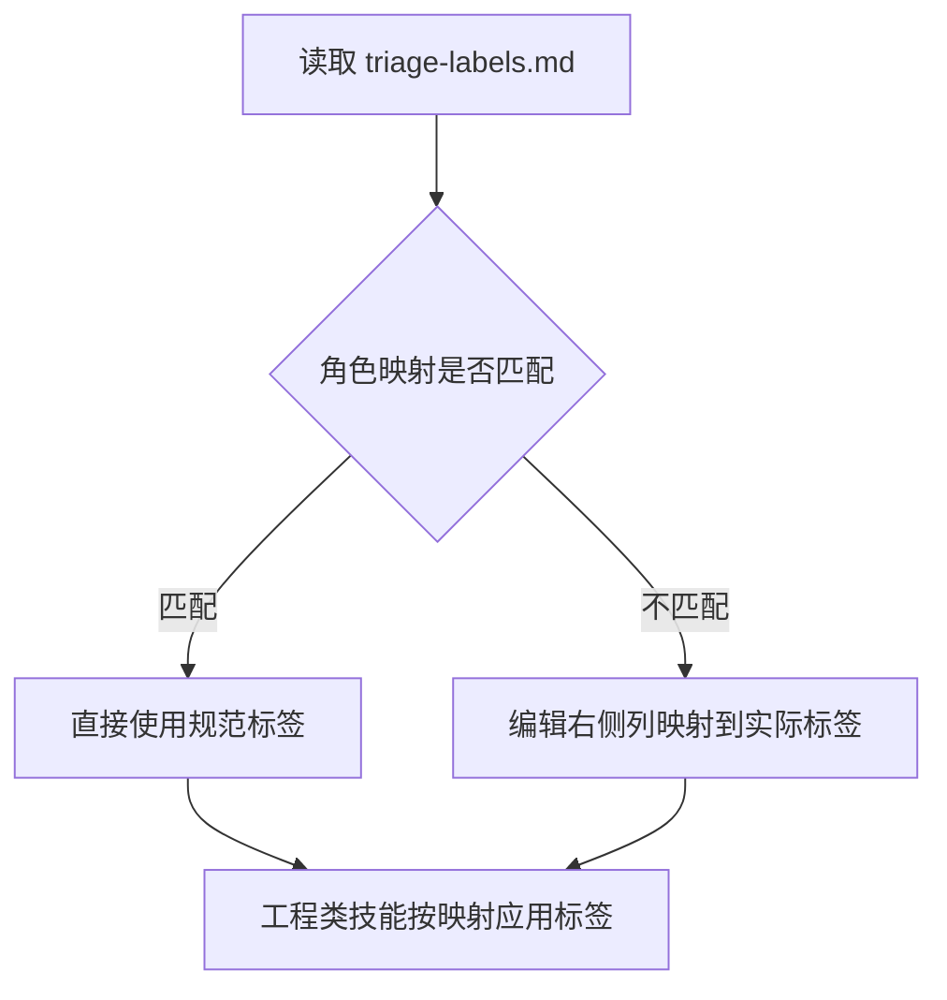
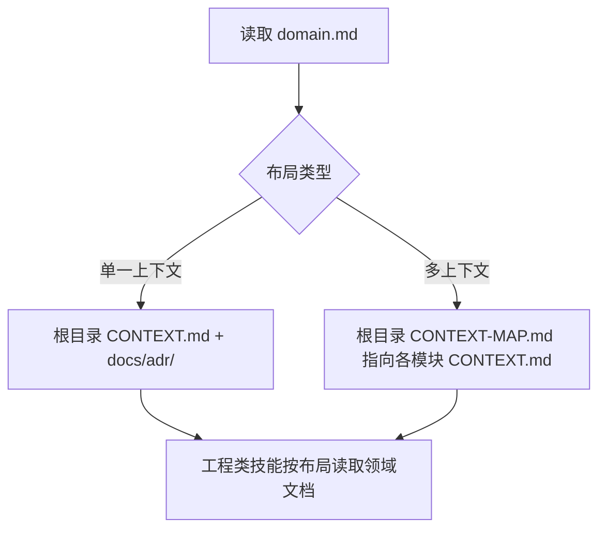
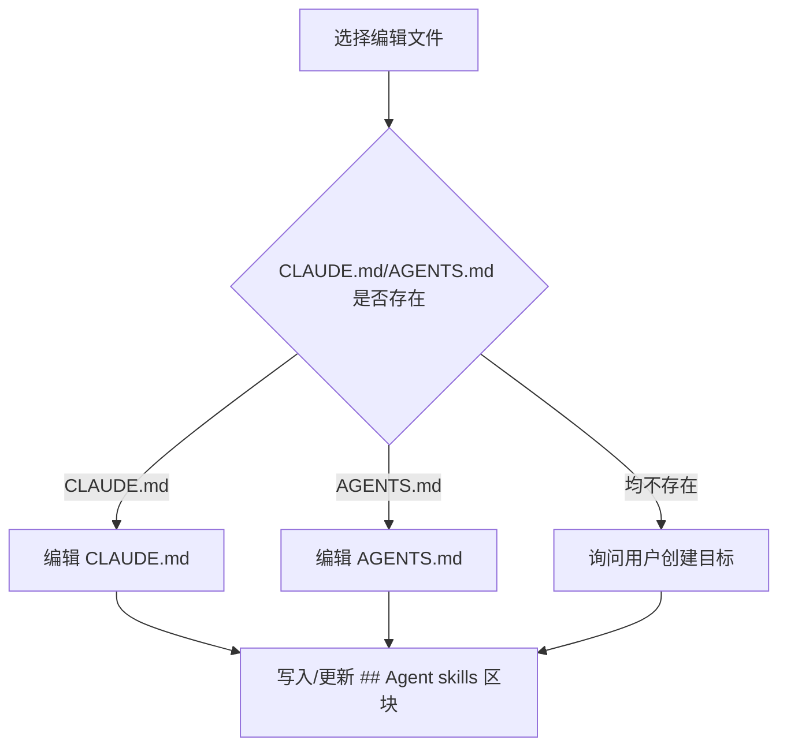
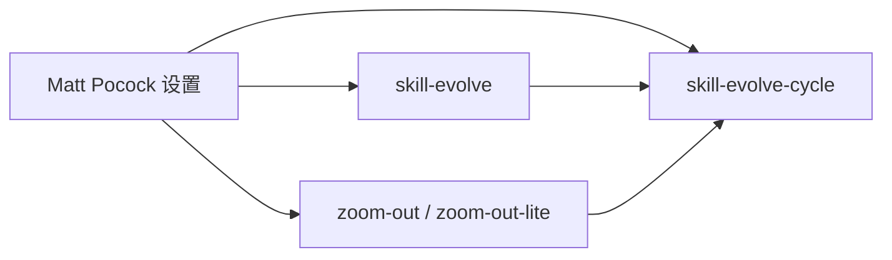
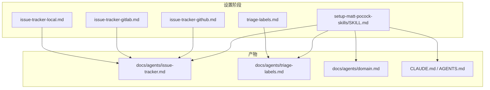

# Matt Pocock 技能设置

<cite>
**本文引用的文件**
- [setup-matt-pocock-skills/SKILL.md](file://inbox/skills/setup-matt-pocock-skills/SKILL.md)
- [setup-matt-pocock-skills/issue-tracker-github.md](file://inbox/skills/setup-matt-pocock-skills/issue-tracker-github.md)
- [setup-matt-pocock-skills/issue-tracker-gitlab.md](file://inbox/skills/setup-matt-pocock-skills/issue-tracker-gitlab.md)
- [setup-matt-pocock-skills/issue-tracker-local.md](file://inbox/skills/setup-matt-pocock-skills/issue-tracker-local.md)
- [setup-matt-pocock-skills/triage-labels.md](file://inbox/skills/setup-matt-pocock-skills/triage-labels.md)
- [skills/skill-evolve/SKILL.md](file://skills/skill-evolve/SKILL.md)
- [skills/skill-evolve-cycle/SKILL.md](file://skills/skill-evolve-cycle/SKILL.md)
- [skills/zoom-out/SKILL.md](file://skills/zoom-out/SKILL.md)
- [skills/zoom-out-lite/SKILL.md](file://skills/zoom-out-lite/SKILL.md)
</cite>

## 目录
1. [简介](#简介)
2. [项目结构](#项目结构)
3. [核心组件](#核心组件)
4. [架构总览](#架构总览)
5. [详细组件分析](#详细组件分析)
6. [依赖关系分析](#依赖关系分析)
7. [性能考量](#性能考量)
8. [故障排除指南](#故障排除指南)
9. [结论](#结论)
10. [附录](#附录)

## 简介
本文件面向“Skills Collection”中为 Matt Pocock 教学风格定制的“Matt Pocock 技能设置”方案，目标是帮助团队快速建立一致的工程技能协作基线，确保“问题跟踪器”“分类标签词表”“领域文档布局”等关键上下文在工程类技能之间共享与复用。该设置强调“提示驱动”的探索-确认-写入流程，避免硬编码脚本带来的刚性，提升教学与学习体验的可迁移性与一致性。

## 项目结构
该设置位于 inbox/skills/setup-matt-pocock-skills 目录，核心由一个主技能文件与若干种子文档组成，用于生成 docs/agents 下的三类上下文文件，并在 CLAUDE.md/AGENTS.md 中注入“Agent skills”区块指引。

图表来源
- [setup-matt-pocock-skills/SKILL.md:17-122](file://inbox/skills/setup-matt-pocock-skills/SKILL.md#L17-L122)
- [setup-matt-pocock-skills/issue-tracker-github.md:1-23](file://inbox/skills/setup-matt-pocock-skills/issue-tracker-github.md#L1-L23)
- [setup-matt-pocock-skills/issue-tracker-gitlab.md:1-24](file://inbox/skills/setup-matt-pocock-skills/issue-tracker-gitlab.md#L1-L24)
- [setup-matt-pocock-skills/issue-tracker-local.md:1-20](file://inbox/skills/setup-matt-pocock-skills/issue-tracker-local.md#L1-L20)
- [setup-matt-pocock-skills/triage-labels.md:1-16](file://inbox/skills/setup-matt-pocock-skills/triage-labels.md#L1-L16)

章节来源
- [setup-matt-pocock-skills/SKILL.md:17-122](file://inbox/skills/setup-matt-pocock-skills/SKILL.md#L17-L122)

## 核心组件
- 主技能：Matt Pocock 技能设置
  - 功能：指导用户探索仓库现状，确认问题跟踪器、分类标签词表、领域文档布局，并在 CLAUDE.md/AGENTS.md 中写入“Agent skills”区块，同时生成 docs/agents 下的三份上下文文件。
  - 设计理念：以“提示驱动”的交互流程替代硬编码脚本，强调“先探索、再确认、后写入”，降低误配置风险，提升可解释性与可回溯性。
- 问题跟踪器约定
  - 支持 GitHub、GitLab、本地 Markdown 三种模式，分别提供 CLI 命令约定、读取/列表/评论/标签/关闭等操作指引。
- 分类标签词表
  - 映射五个规范 triage 角色到仓库实际标签字符串，便于工程类技能按统一语义进行状态推进。
- 领域文档布局
  - 单一上下文或多上下文两种布局，指导工程类技能在正确位置读取 CONTEXT.md 与 ADR 文档。

章节来源
- [setup-matt-pocock-skills/SKILL.md:17-122](file://inbox/skills/setup-matt-pocock-skills/SKILL.md#L17-L122)
- [setup-matt-pocock-skills/issue-tracker-github.md:1-23](file://inbox/skills/setup-matt-pocock-skills/issue-tracker-github.md#L1-L23)
- [setup-matt-pocock-skills/issue-tracker-gitlab.md:1-24](file://inbox/skills/setup-matt-pocock-skills/issue-tracker-gitlab.md#L1-L24)
- [setup-matt-pocock-skills/issue-tracker-local.md:1-20](file://inbox/skills/setup-matt-pocock-skills/issue-tracker-local.md#L1-L20)
- [setup-matt-pocock-skills/triage-labels.md:1-16](file://inbox/skills/setup-matt-pocock-skills/triage-labels.md#L1-L16)

## 架构总览
该设置通过“探索-展示-确认-写入-完成”五步法，将工程类技能所需的上下文标准化、可复用化，并与 Skills Collection 的通用技能体系（如 skill-evolve、skill-evolve-cycle、zoom-out 等）形成互补。

图表来源
- [setup-matt-pocock-skills/SKILL.md:17-122](file://inbox/skills/setup-matt-pocock-skills/SKILL.md#L17-L122)

## 详细组件分析

### 组件一：问题跟踪器约定（GitHub/GitLab/本地 Markdown/其他）
- 设计要点
  - 以“约定即文档”的方式，明确 CLI 命令、读取/列表/评论/标签/关闭等操作，确保工程类技能在不同跟踪器上行为一致。
  - “其他”跟踪器支持用户自定义描述，便于集成 Jira、Linear 等非 CLI 场景。
- 使用建议
  - 若仓库使用 GitHub/GitLab，请优先选择对应模式以获得最佳 CLI 体验。
  - 若为个人项目或无远程仓库，本地 Markdown 模式可满足需求。
  - 对于复杂工作流，建议在 docs/agents/issue-tracker.md 中补充自定义说明。

图表来源
- [setup-matt-pocock-skills/SKILL.md:36-46](file://inbox/skills/setup-matt-pocock-skills/SKILL.md#L36-L46)
- [setup-matt-pocock-skills/issue-tracker-github.md:1-23](file://inbox/skills/setup-matt-pocock-skills/issue-tracker-github.md#L1-L23)
- [setup-matt-pocock-skills/issue-tracker-gitlab.md:1-24](file://inbox/skills/setup-matt-pocock-skills/issue-tracker-gitlab.md#L1-L24)
- [setup-matt-pocock-skills/issue-tracker-local.md:1-20](file://inbox/skills/setup-matt-pocock-skills/issue-tracker-local.md#L1-L20)

章节来源
- [setup-matt-pocock-skills/SKILL.md:36-46](file://inbox/skills/setup-matt-pocock-skills/SKILL.md#L36-L46)
- [setup-matt-pocock-skills/issue-tracker-github.md:1-23](file://inbox/skills/setup-matt-pocock-skills/issue-tracker-github.md#L1-L23)
- [setup-matt-pocock-skills/issue-tracker-gitlab.md:1-24](file://inbox/skills/setup-matt-pocock-skills/issue-tracker-gitlab.md#L1-L24)
- [setup-matt-pocock-skills/issue-tracker-local.md:1-20](file://inbox/skills/setup-matt-pocock-skills/issue-tracker-local.md#L1-L20)

### 组件二：分类标签词表（triage-labels）
- 设计要点
  - 以表格形式映射五个规范 triage 角色到仓库实际标签字符串，确保工程类技能在推进 issue 状态时使用一致语义。
  - 默认值与仓库现有标签保持最小差异，减少迁移成本。
- 使用建议
  - 若仓库已有不同命名，仅需修改右侧列即可适配。
  - 与工程类技能（triage、to-issues、to-prd 等）协同，保证跨技能状态一致性。

图表来源
- [setup-matt-pocock-skills/triage-labels.md:1-16](file://inbox/skills/setup-matt-pocock-skills/triage-labels.md#L1-L16)

章节来源
- [setup-matt-pocock-skills/triage-labels.md:1-16](file://inbox/skills/setup-matt-pocock-skills/triage-labels.md#L1-L16)

### 组件三：领域文档布局（single-context / multi-context）
- 设计要点
  - 工程类技能（如 improve-codebase-architecture、diagnose、tdd）依赖 CONTEXT.md 与 ADR 文档，需明确单一或多重上下文布局。
  - 单一上下文适用于大多数仓库；多上下文适用于大型单体仓库按模块划分的场景。
- 使用建议
  - 选择布局后，工程类技能将据此在正确位置读取领域知识，避免路径歧义。

图表来源
- [setup-matt-pocock-skills/SKILL.md:61-69](file://inbox/skills/setup-matt-pocock-skills/SKILL.md#L61-L69)

章节来源
- [setup-matt-pocock-skills/SKILL.md:61-69](file://inbox/skills/setup-matt-pocock-skills/SKILL.md#L61-L69)

### 组件四：Agent skills 区块写入策略
- 设计要点
  - 优先编辑已存在的 CLAUDE.md 或 AGENTS.md；若两者均不存在，则询问用户创建目标。
  - 若已存在“## Agent skills”区块，则原地更新，避免重复与覆盖。
  - 写入内容简洁汇总，指向 docs/agents 下的详细文档。
- 使用建议
  - 首次运行后，可直接编辑 docs/agents/* 进行微调；仅在需要切换跟踪器或重新开始时重跑设置。

图表来源
- [setup-matt-pocock-skills/SKILL.md:81-90](file://inbox/skills/setup-matt-pocock-skills/SKILL.md#L81-L90)

章节来源
- [setup-matt-pocock-skills/SKILL.md:81-90](file://inbox/skills/setup-matt-pocock-skills/SKILL.md#L81-L90)

### 组件五：与通用技能的集成与兼容性
- 与 skill-evolve 的关系
  - 本设置提供稳定的上下文基线，使 skill-evolve 在优化 SKILL.md 结构与内容时更易达成一致标准，减少跨文件引用与链接维护成本。
- 与 skill-evolve-cycle 的关系
  - 通过统一的上下文与规范，skill-evolve-cycle 在“优化-审查-修复-合并-回溯”循环中能更稳定地收敛，减少因上下文不一致导致的反复。
- 与 zoom-out/zoom-out-lite 的关系
  - 二者均依赖清晰的领域术语与模块边界；本设置提供的领域文档布局与 CONTEXT.md 读取约定，有助于 zoom-out 生成更准确的模块地图。

图表来源
- [skills/skill-evolve/SKILL.md:1-371](file://skills/skill-evolve/SKILL.md#L1-L371)
- [skills/skill-evolve-cycle/SKILL.md:1-308](file://skills/skill-evolve-cycle/SKILL.md#L1-L308)
- [skills/zoom-out/SKILL.md:1-190](file://skills/zoom-out/SKILL.md#L1-L190)
- [skills/zoom-out-lite/SKILL.md:1-12](file://skills/zoom-out-lite/SKILL.md#L1-L12)

章节来源
- [skills/skill-evolve/SKILL.md:1-371](file://skills/skill-evolve/SKILL.md#L1-L371)
- [skills/skill-evolve-cycle/SKILL.md:1-308](file://skills/skill-evolve-cycle/SKILL.md#L1-L308)
- [skills/zoom-out/SKILL.md:1-190](file://skills/zoom-out/SKILL.md#L1-L190)
- [skills/zoom-out-lite/SKILL.md:1-12](file://skills/zoom-out-lite/SKILL.md#L1-L12)

## 依赖关系分析
- 内部依赖
  - 主技能依赖种子文档（issue-tracker-* 与 triage-labels）生成 docs/agents/*，并在 CLAUDE.md/AGENTS.md 中写入“Agent skills”区块。
- 外部依赖
  - 问题跟踪器模式依赖 gh/glab CLI（GitHub/GitLab）或本地文件系统（Markdown）。
  - 工程类技能依赖统一的上下文约定，确保跨技能一致性。

图表来源
- [setup-matt-pocock-skills/SKILL.md:17-122](file://inbox/skills/setup-matt-pocock-skills/SKILL.md#L17-L122)
- [setup-matt-pocock-skills/issue-tracker-github.md:1-23](file://inbox/skills/setup-matt-pocock-skills/issue-tracker-github.md#L1-L23)
- [setup-matt-pocock-skills/issue-tracker-gitlab.md:1-24](file://inbox/skills/setup-matt-pocock-skills/issue-tracker-gitlab.md#L1-L24)
- [setup-matt-pocock-skills/issue-tracker-local.md:1-20](file://inbox/skills/setup-matt-pocock-skills/issue-tracker-local.md#L1-L20)
- [setup-matt-pocock-skills/triage-labels.md:1-16](file://inbox/skills/setup-matt-pocock-skills/triage-labels.md#L1-L16)

章节来源
- [setup-matt-pocock-skills/SKILL.md:17-122](file://inbox/skills/setup-matt-pocock-skills/SKILL.md#L17-L122)

## 性能考量
- 交互效率
  - 采用“逐项确认”的交互模式，减少一次性信息过载，提升用户决策质量与设置成功率。
- 维护成本
  - 通过集中化的上下文文件与“Agent skills”区块，降低工程类技能在不同仓库间的适配成本。
- 可扩展性
  - “其他”跟踪器模式允许在不破坏现有流程的前提下接入新的工作流，便于长期演进。

## 故障排除指南
- 无法识别远程仓库
  - 现象：默认跟踪器推断失败或提示未知远程。
  - 处理：手动选择“其他”，在 docs/agents/issue-tracker.md 中补充自定义工作流描述。
- 标签不匹配导致 triage 状态异常
  - 现象：工程类技能无法正确推进状态。
  - 处理：在 triage-labels.md 中将规范角色映射到仓库实际标签字符串。
- 领域文档未被工程类技能读取
  - 现象：技能未找到 CONTEXT.md 或 ADR。
  - 处理：在 domain.md 中确认布局类型（single-context / multi-context），并确保路径与命名符合约定。
- 重复写入或覆盖现有内容
  - 现象：CLAUDE.md/AGENTS.md 出现重复的“Agent skills”区块。
  - 处理：遵循写入策略，优先编辑已存在文件；若已存在区块，应原地更新而非追加。

章节来源
- [setup-matt-pocock-skills/SKILL.md:81-90](file://inbox/skills/setup-matt-pocock-skills/SKILL.md#L81-L90)
- [setup-matt-pocock-skills/triage-labels.md:1-16](file://inbox/skills/setup-matt-pocock-skills/triage-labels.md#L1-L16)

## 结论
Matt Pocock 技能设置通过“提示驱动”的探索-确认-写入流程，将问题跟踪器、分类标签词表与领域文档布局标准化，为工程类技能提供一致且可复用的上下文基线。结合 skill-evolve 与 skill-evolve-cycle 的持续优化能力，以及 zoom-out 系列技能的高阶视角支持，能够显著提升教学与学习体验的一致性与可迁移性。

## 附录
- 最佳实践
  - 首次使用工程类技能前，务必先运行 Matt Pocock 技能设置，确保上下文文件齐全。
  - 仅在需要切换跟踪器或重新开始时重跑设置；日常维护可直接编辑 docs/agents/*。
  - 对于复杂团队，建议在 triage-labels.md 中统一标签命名，减少沟通成本。
- 典型应用场景
  - 新仓库初始化：一键生成上下文，快速启用 to-issues、triage、to-prd、diagnose、tdd、improve-codebase-architecture、zoom-out 等工程类技能。
  - 多团队协作：通过统一的标签与布局约定，降低跨仓库迁移成本。
  - 教学演示：以一致的上下文与流程，帮助学员快速理解并复用工程技能。