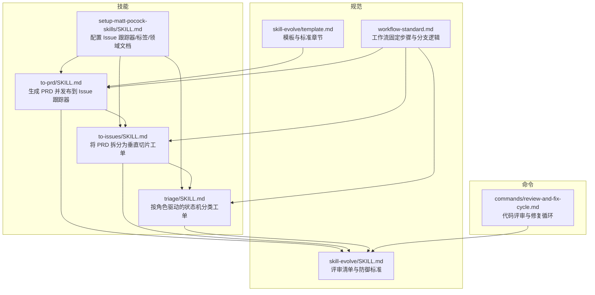
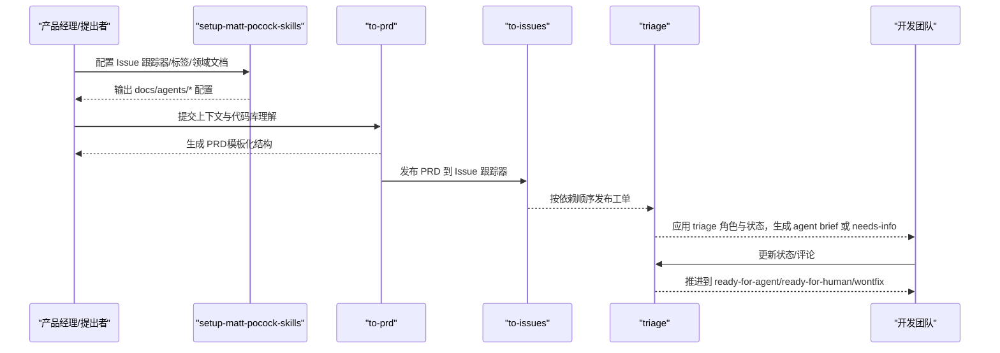
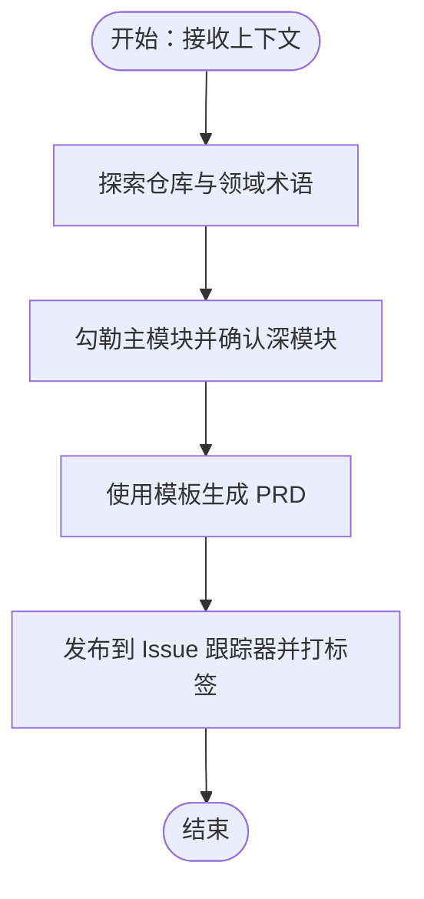
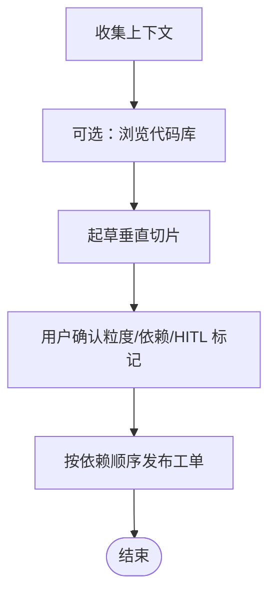
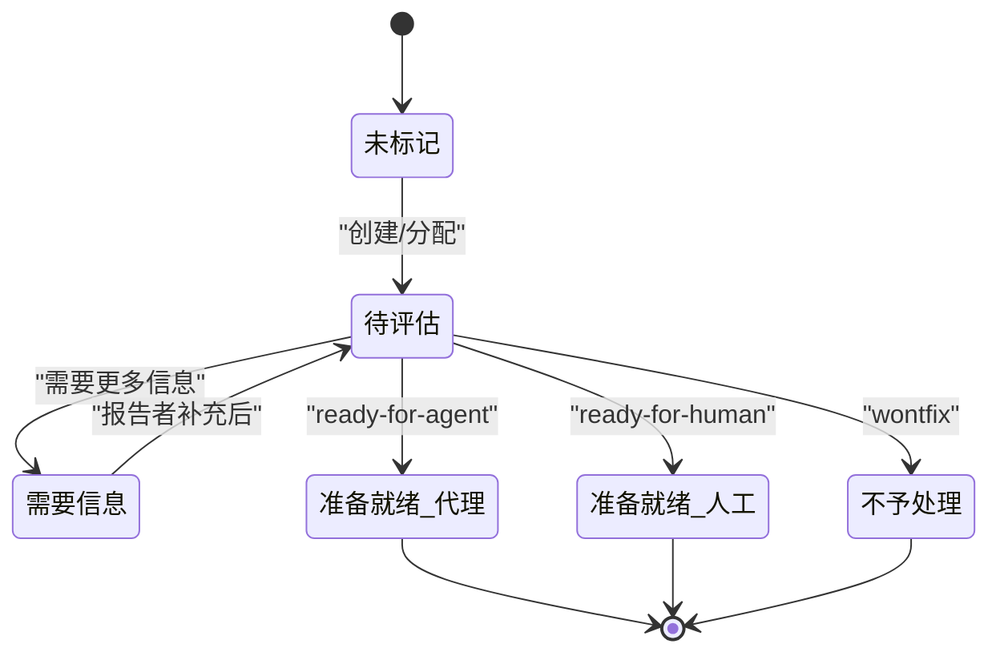
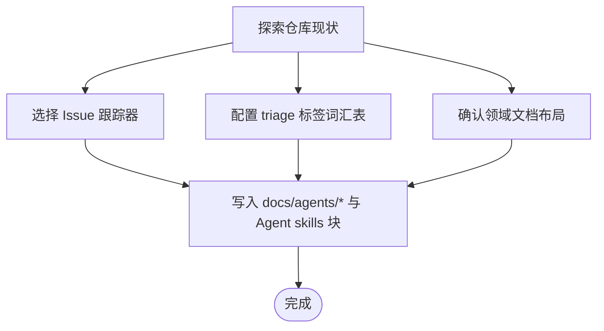
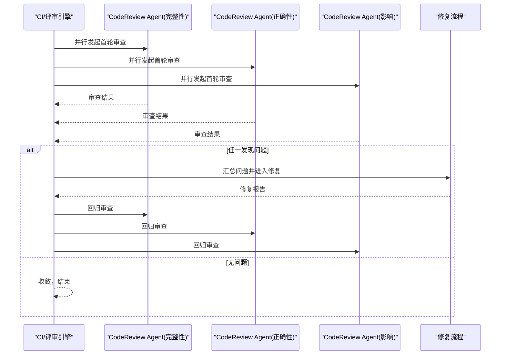
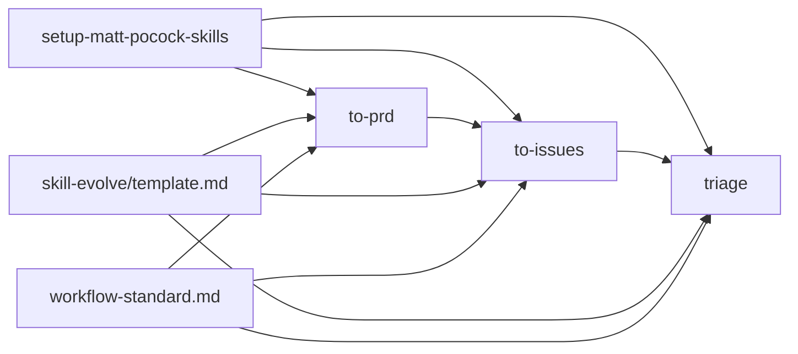

# 产品需求文档管理

<cite>
**本文档引用的文件**
- [README.md](file://README.md)
- [README.zh-CN.md](file://README.zh-CN.md)
- [to-prd/SKILL.md](file://inbox/skills/to-prd/SKILL.md)
- [to-issues/SKILL.md](file://inbox/skills/to-issues/SKILL.md)
- [triage/SKILL.md](file://inbox/skills/triage/SKILL.md)
- [setup-matt-pocock-skills/SKILL.md](file://inbox/skills/setup-matt-pocock-skills/SKILL.md)
- [issue-tracker-local.md](file://inbox/skills/setup-matt-pocock-skills/issue-tracker-local.md)
- [skill-evolve/SKILL.md](file://skills/skill-evolve/SKILL.md)
- [skill-evolve/template.md](file://skills/skill-evolve/template.md)
- [workflow-standard.md](file://skills/skill-evolve/references/workflow-standard.md)
- [review-and-fix-cycle.md](file://commands/review-and-fix-cycle.md)
- [review-and-fix-cycle.md](file://commands.zh-CN/review-and-fix-cycle.md)
</cite>

## 目录
1. [简介](#简介)
2. [项目结构](#项目结构)
3. [核心组件](#核心组件)
4. [架构概览](#架构概览)
5. [详细组件分析](#详细组件分析)
6. [依赖分析](#依赖分析)
7. [性能考虑](#性能考虑)
8. [故障排查指南](#故障排查指南)
9. [结论](#结论)
10. [附录](#附录)

## 简介
本文件面向“Skills Collection”的产品需求文档（PRD）管理工具，系统化阐述如何将产品需求从概念阶段转化为可执行的文档与工单，覆盖需求收集、分析、文档化、版本管理、变更管理与追溯性、以及与开发团队的协作流程。文档基于仓库内的技能与规范文件，提供可落地的流程、模板与最佳实践，帮助团队提升需求管理的效率与准确性。

## 项目结构
仓库采用“技能（Skill）+ 规范（References）+ 命令（Commands）”的组织方式：
- 技能：以 SKILL.md 为核心，定义需求采集、PRD 生成、工单拆分、分类与协作等能力
- 规范：提供工作流、评审、格式与术语等标准，保障一致性与可维护性
- 命令：提供可复用的自动化流程（如代码评审与修复循环）

**图表来源**
- [to-prd/SKILL.md:1-77](file://inbox/skills/to-prd/SKILL.md#L1-L77)
- [to-issues/SKILL.md:1-84](file://inbox/skills/to-issues/SKILL.md#L1-L84)
- [triage/SKILL.md:1-104](file://inbox/skills/triage/SKILL.md#L1-L104)
- [setup-matt-pocock-skills/SKILL.md:1-122](file://inbox/skills/setup-matt-pocock-skills/SKILL.md#L1-L122)
- [skill-evolve/template.md:1-247](file://skills/skill-evolve/template.md#L1-L247)
- [workflow-standard.md:343-377](file://skills/skill-evolve/references/workflow-standard.md#L343-L377)
- [skill-evolve/SKILL.md:1-371](file://skills/skill-evolve/SKILL.md#L1-L371)
- [review-and-fix-cycle.md:139-156](file://commands/review-and-fix-cycle.md#L139-L156)

**章节来源**
- [README.md:1-113](file://README.md#L1-L113)
- [README.zh-CN.md:1-113](file://README.zh-CN.md#L1-L113)

## 核心组件
- PRD 生成与发布（to-prd）
  - 输入：当前对话上下文与代码库理解
  - 输出：结构化的 PRD 文档，发布到 Issue 跟踪器，打上 triage 标签
  - 关键点：使用模板化结构，避免过时代码片段，强调领域术语与 ADR 尊重
- 工单拆分（to-issues）
  - 输入：PRD 或计划
  - 输出：垂直切片（tracer bullet）工单，区分 HITL 与 AFK，标注阻塞关系
  - 关键点：端到端覆盖所有集成层，优先薄切片，按依赖顺序发布
- 工单分类（triage）
  - 输入：Issue 跟踪器中的工单
  - 输出：按角色驱动的状态机推进，生成 agent brief 或 needs-info 记录
  - 关键点：严格的角色与状态映射，复现与拷问流程可选
- 环境配置（setup-matt-pocock-skills）
  - 输入：仓库现状与用户偏好
  - 输出：Agent skills 块、docs/agents/* 配置文件
  - 关键点：Issue 跟踪器（GitHub/GitLab/本地/其他）、triage 标签词汇表、领域文档布局

**章节来源**
- [to-prd/SKILL.md:1-77](file://inbox/skills/to-prd/SKILL.md#L1-L77)
- [to-issues/SKILL.md:1-84](file://inbox/skills/to-issues/SKILL.md#L1-L84)
- [triage/SKILL.md:1-104](file://inbox/skills/triage/SKILL.md#L1-L104)
- [setup-matt-pocock-skills/SKILL.md:1-122](file://inbox/skills/setup-matt-pocock-skills/SKILL.md#L1-L122)

## 架构概览
下图展示了从需求概念到工单落地的端到端流程，以及与评审与协作机制的衔接：

**图表来源**
- [setup-matt-pocock-skills/SKILL.md:17-122](file://inbox/skills/setup-matt-pocock-skills/SKILL.md#L17-L122)
- [to-prd/SKILL.md:10-21](file://inbox/skills/to-prd/SKILL.md#L10-L21)
- [to-issues/SKILL.md:12-56](file://inbox/skills/to-issues/SKILL.md#L12-L56)
- [triage/SKILL.md:21-78](file://inbox/skills/triage/SKILL.md#L21-L78)

## 详细组件分析

### PRD 生成与发布（to-prd）
- 流程要点
  - 浏览仓库，尊重领域术语与 ADR
  - 勾勒主要模块，确认深模块（封装良好、可测试、接口稳定）
  - 使用模板生成 PRD 并发布，应用 ready-for-agent triage 标签
- PRD 模板结构
  - 问题陈述、解决方案、用户故事、实现决策、测试决策、范围之外、进一步说明
- 与规范的关系
  - 依赖模板与工作流标准，确保结构与分支逻辑清晰
  - 评审清单用于校验输出质量与一致性

**图表来源**
- [to-prd/SKILL.md:10-21](file://inbox/skills/to-prd/SKILL.md#L10-L21)
- [to-prd/SKILL.md:22-77](file://inbox/skills/to-prd/SKILL.md#L22-L77)
- [skill-evolve/template.md:37-51](file://skills/skill-evolve/template.md#L37-L51)

**章节来源**
- [to-prd/SKILL.md:1-77](file://inbox/skills/to-prd/SKILL.md#L1-L77)
- [skill-evolve/template.md:1-247](file://skills/skill-evolve/template.md#L1-L247)

### 工单拆分（to-issues）
- 流程要点
  - 收集上下文（PRD 或现有 issue）
  - 可选浏览代码库，使用领域术语与 ADR
  - 垂直切片（tracer bullet）：薄而完整，贯穿所有集成层
  - 用户确认粒度、依赖与 HITL/AFK 标记
  - 按依赖顺序发布工单，应用 triage 标签
- 模板要素
  - 父级引用、要构建什么、验收标准、被阻塞

**图表来源**
- [to-issues/SKILL.md:12-56](file://inbox/skills/to-issues/SKILL.md#L12-L56)
- [to-issues/SKILL.md:58-81](file://inbox/skills/to-issues/SKILL.md#L58-L81)

**章节来源**
- [to-issues/SKILL.md:1-84](file://inbox/skills/to-issues/SKILL.md#L1-L84)

### 工单分类（triage）
- 角色与状态
  - 分类角色：bug、enhancement
  - 状态角色：needs-triage、needs-info、ready-for-agent、ready-for-human、wontfix
- 流程
  - 显示三类待关注内容（未标记、待评估、需要信息）
  - 处理特定 issue：收集上下文、推荐、可选复现与拷问、应用结果
  - 快速覆盖与 needs-info 模板
- 与 PRD/工单的衔接
  - 将 ready-for-agent 的工单转为 agent brief，推进 AFK 实现

**图表来源**
- [triage/SKILL.md:21-40](file://inbox/skills/triage/SKILL.md#L21-L40)
- [triage/SKILL.md:61-78](file://inbox/skills/triage/SKILL.md#L61-L78)

**章节来源**
- [triage/SKILL.md:1-104](file://inbox/skills/triage/SKILL.md#L1-L104)

### 环境配置（setup-matt-pocock-skills）
- Issue 跟踪器选择：GitHub、GitLab、本地 markdown 或其他
- triage 标签词汇表映射：五个角色字符串
- 领域文档布局：single-context 或 multi-context
- 输出：docs/agents/* 配置文件与 Agent skills 块

**图表来源**
- [setup-matt-pocock-skills/SKILL.md:17-122](file://inbox/skills/setup-matt-pocock-skills/SKILL.md#L17-L122)
- [issue-tracker-local.md:1-20](file://inbox/skills/setup-matt-pocock-skills/issue-tracker-local.md#L1-L20)

**章节来源**
- [setup-matt-pocock-skills/SKILL.md:1-122](file://inbox/skills/setup-matt-pocock-skills/SKILL.md#L1-L122)
- [issue-tracker-local.md:1-20](file://inbox/skills/setup-matt-pocock-skills/issue-tracker-local.md#L1-L20)

### 评审与修复循环（命令）
- 自动化评审：并行派出 3 个 CodeReview Agent，独立覆盖完整性、正确性、影响
- 修复与回溯：记录问题、生成修复报告、按依赖顺序修复并复核
- 报告持久化：docs/review-and-fix-cycle/{UTC 时间}/ 下的审查日志、修复报告与最终总结

**图表来源**
- [review-and-fix-cycle.md:66-156](file://commands/review-and-fix-cycle.md#L66-L156)
- [review-and-fix-cycle.md:66-156](file://commands.zh-CN/review-and-fix-cycle.md#L66-L156)

**章节来源**
- [review-and-fix-cycle.md:139-156](file://commands/review-and-fix-cycle.md#L139-L156)
- [review-and-fix-cycle.md:139-156](file://commands.zh-CN/review-and-fix-cycle.md#L139-L156)

## 依赖分析
- 技能之间的依赖
  - setup-matt-pocock-skills 为 to-prd、to-issues、triage 等提供上下文（Issue 跟踪器、标签、领域文档）
  - to-prd 产出 PRD，to-issues 将 PRD 拆分为工单，triage 推进工单状态
  - skill-evolve 的模板与工作流标准为上述技能提供结构与评审基线
- 外部依赖
  - Issue 跟踪器（GitHub/GitLab/本地/其他）与 CLI 工具
  - 代码库理解与领域术语表、ADR

**图表来源**
- [setup-matt-pocock-skills/SKILL.md:1-122](file://inbox/skills/setup-matt-pocock-skills/SKILL.md#L1-L122)
- [to-prd/SKILL.md:1-77](file://inbox/skills/to-prd/SKILL.md#L1-L77)
- [to-issues/SKILL.md:1-84](file://inbox/skills/to-issues/SKILL.md#L1-L84)
- [triage/SKILL.md:1-104](file://inbox/skills/triage/SKILL.md#L1-L104)
- [skill-evolve/template.md:1-247](file://skills/skill-evolve/template.md#L1-L247)
- [workflow-standard.md:343-377](file://skills/skill-evolve/references/workflow-standard.md#L343-L377)

**章节来源**
- [skill-evolve/SKILL.md:1-371](file://skills/skill-evolve/SKILL.md#L1-L371)

## 性能考虑
- 评审与修复循环
  - 并行派发 3 个 CodeReview Agent，避免串行瓶颈
  - 严格禁止流程降级与标签外状态，减少无效往返
- 工单拆分
  - 垂直切片薄而完整，降低集成风险与阻塞复杂度
  - 依赖顺序发布，缩短反馈周期
- PRD 生成
  - 模板化结构与评审清单，减少返工与歧义

[本节为通用指导，不直接分析具体文件]

## 故障排查指南
- Issue 跟踪器配置
  - 若 triage 标签不生效，检查 docs/agents/triage-labels.md 与实际跟踪器标签映射
  - 若本地 markdown 路径不正确，检查 issue-tracker-local.md 的约定
- 工单状态异常
  - 若状态冲突或转换异常，按 triage 角色与状态规范进行覆盖与澄清
- 评审循环异常
  - 若 CodeReview Agent 不可用，流程终止并标注相应状态
  - 若修复后仍未收敛，检查修复报告与回归审查日志

**章节来源**
- [triage/SKILL.md:36-40](file://inbox/skills/triage/SKILL.md#L36-L40)
- [issue-tracker-local.md:1-20](file://inbox/skills/setup-matt-pocock-skills/issue-tracker-local.md#L1-L20)
- [review-and-fix-cycle.md:139-156](file://commands/review-and-fix-cycle.md#L139-L156)

## 结论
通过将 PRD 生成、工单拆分、分类与评审修复等环节标准化与自动化，结合模板与工作流规范，Skills Collection 能够有效提升需求管理的效率与准确性。建议团队在使用前完成环境配置，建立稳定的 triage 流程，并在 PRD 与工单层面坚持模板化与评审闭环，以实现高质量的需求交付。

[本节为总结性内容，不直接分析具体文件]

## 附录

### PRD 模板与编写指南
- 模板章节
  - 问题陈述、解决方案、用户故事、实现决策、测试决策、范围之外、进一步说明
- 编写要点
  - 使用领域术语与 ADR，避免过时代码片段
  - 用户故事详尽覆盖功能各个方面
  - 实现与测试决策明确可执行

**章节来源**
- [to-prd/SKILL.md:22-77](file://inbox/skills/to-prd/SKILL.md#L22-L77)
- [skill-evolve/template.md:37-51](file://skills/skill-evolve/template.md#L37-L51)

### 工单模板与验收标准
- 模板要素
  - 父级引用、要构建什么、验收标准、被阻塞
- 编写要点
  - 端到端描述行为，避免具体文件路径
  - 验收标准可验证、可量化

**章节来源**
- [to-issues/SKILL.md:58-81](file://inbox/skills/to-issues/SKILL.md#L58-L81)

### 需求变更管理与追溯性
- 变更管理
  - 通过 Issue 跟踪器记录变更请求与决策
  - 工单按依赖顺序发布，便于追踪实现进度
- 追溯性
  - PRD 与工单双向引用（父级字段）
  - triage 记录与 agent brief 保留决策过程

**章节来源**
- [to-issues/SKILL.md:58-81](file://inbox/skills/to-issues/SKILL.md#L58-L81)
- [triage/SKILL.md:71-78](file://inbox/skills/triage/SKILL.md#L71-L78)

### 与开发团队的协作流程与沟通机制
- 角色与状态
  - bug/enhancement 分类，needs-triage/needs-info/ready-for-agent/ready-for-human/wontfix 状态
- 沟通机制
  - triage 期间的免责声明与模板化记录
  - 通过 Issue 跟踪器评论与标签进行透明沟通

**章节来源**
- [triage/SKILL.md:10-14](file://inbox/skills/triage/SKILL.md#L10-L14)
- [triage/SKILL.md:83-99](file://inbox/skills/triage/SKILL.md#L83-L99)