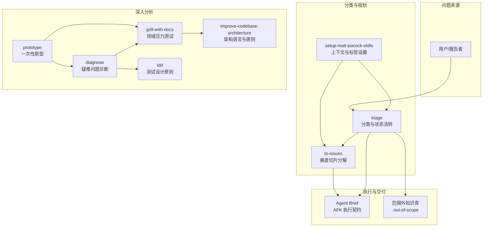
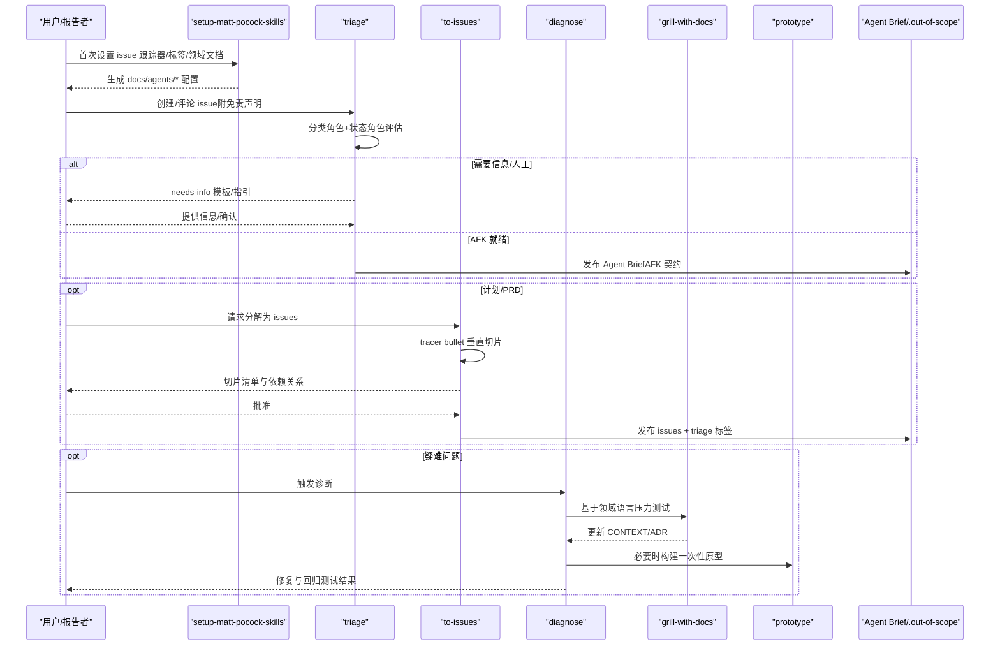
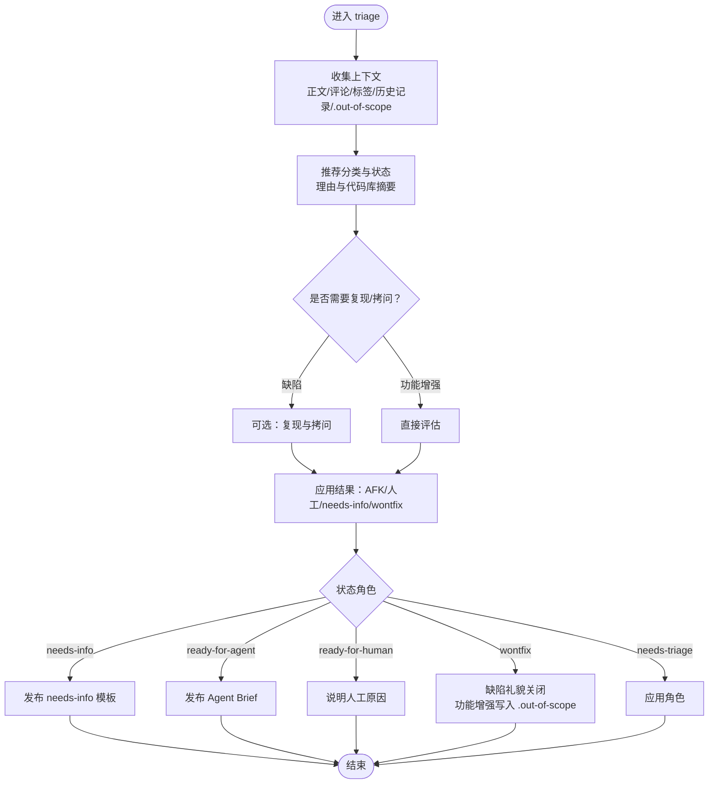
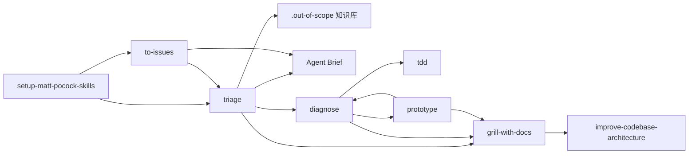

# 问题分类与优先级管理

<cite>
**本文档引用的文件**
- [triage/SKILL.md](file://inbox/skills/triage/SKILL.md)
- [triage/AGENT-BRIEF.md](file://inbox/skills/triage/AGENT-BRIEF.md)
- [triage/OUT-OF-SCOPE.md](file://inbox/skills/triage/OUT-OF-SCOPE.md)
- [triage-labels.md](file://inbox/skills/setup-matt-pocock-skills/triage-labels.md)
- [setup-matt-pocock-skills/SKILL.md](file://inbox/skills/setup-matt-pocock-skills/SKILL.md)
- [to-issues/SKILL.md](file://inbox/skills/to-issues/SKILL.md)
- [diagnose/SKILL.md](file://inbox/skills/diagnose/SKILL.md)
- [diagnose/scripts/hitl-loop.template.sh](file://inbox/skills/diagnose/scripts/hitl-loop.template.sh)
- [grill-with-docs/SKILL.md](file://inbox/skills/grill-with-docs/SKILL.md)
- [improve-codebase-architecture/LANGUAGE.md](file://inbox/skills/improve-codebase-architecture/LANGUAGE.md)
- [tdd/tests.md](file://inbox/skills/tdd/tests.md)
- [prototype/SKILL.md](file://inbox/skills/prototype/SKILL.md)
- [prototype/LOGIC.md](file://inbox/skills/prototype/LOGIC.md)
- [README.md](file://skills/README.md)
</cite>

## 目录
1. [引言](#引言)
2. [项目结构](#项目结构)
3. [核心组件](#核心组件)
4. [架构总览](#架构总览)
5. [详细组件分析](#详细组件分析)
6. [依赖分析](#依赖分析)
7. [性能考量](#性能考量)
8. [故障排查指南](#故障排查指南)
9. [结论](#结论)
10. [附录](#附录)

## 引言
本文件围绕 Skills Collection 中的问题分类与优先级管理工具，系统阐述如何对收集到的问题进行有效分类、评估与优先级排序。内容涵盖缺陷与功能请求的识别与处理策略、优先级评估维度（影响范围、紧急程度、资源需求等）、标签系统的配置与使用、问题处理生命周期（从接收、分类到解决）以及团队协作中的沟通与决策机制。通过规范化的 triage 流程、Agent Brief、范围外知识库（.out-of-scope）与垂直切片分解（tracer bullet）等实践，帮助团队提升问题处理效率与一致性。

## 项目结构
本仓库围绕“技能”（Skill）组织，每个技能为自包含的目录，遵循统一的规范。与问题分类与优先级管理直接相关的核心技能与文档如下：
- triage：问题分类与状态流转的驱动者，定义分类角色与状态角色、状态转换规则、Agent Brief 模板与范围外知识库使用方式。
- setup-matt-pocock-skills：首次设置 issue 跟踪器、triage 标签映射与领域文档布局，确保各技能读取一致的上下文。
- to-issues：将计划/PRD分解为可独立处理的 issues，采用垂直切片策略，优先 AFK 切片。
- diagnose：疑难 bug 的诊断闭环（反馈循环 → 重现 → 假设 → 检测 → 修复 → 回归测试）。
- grill-with-docs：基于领域语言与既有 ADR 压力测试方案，即时更新 CONTEXT 与 ADR。
- improve-codebase-architecture：提供共享语言与架构原则，支撑高质量设计与评审。
- tdd：测试设计原则，支撑诊断与修复阶段的回归保障。
- prototype：一次性原型，用于探索状态机与 UI 设计，沉淀可迁移的逻辑或界面方案。

图表来源
- [triage/SKILL.md](file://inbox/skills/triage/SKILL.md)
- [setup-matt-pocock-skills/SKILL.md](file://inbox/skills/setup-matt-pocock-skills/SKILL.md)
- [to-issues/SKILL.md](file://inbox/skills/to-issues/SKILL.md)
- [diagnose/SKILL.md](file://inbox/skills/diagnose/SKILL.md)
- [grill-with-docs/SKILL.md](file://inbox/skills/grill-with-docs/SKILL.md)
- [improve-codebase-architecture/LANGUAGE.md](file://inbox/skills/improve-codebase-architecture/LANGUAGE.md)
- [tdd/tests.md](file://inbox/skills/tdd/tests.md)
- [prototype/SKILL.md](file://inbox/skills/prototype/SKILL.md)

章节来源
- [README.md](file://skills/README.md)

## 核心组件
- triage：定义两类分类角色（缺陷 bug、功能增强 enhancement）与五种状态角色（待分类、需信息、AFK 就绪、需人工、不修复），提供状态转换规则、处理流程与 needs-info 模板。
- setup-matt-pocock-skills：设置 issue 跟踪器、triage 标签映射与领域文档布局，确保各技能读取一致的上下文。
- to-issues：将计划分解为 tracer bullet 垂直切片，优先 AFK 切片，发布到 issue 跟踪器并标注 triage 标签。
- diagnose：构建确定性反馈循环，系统化重现、假设、检测、修复与回归测试。
- grill-with-docs：基于领域语言与 ADR 压力测试方案，即时更新 CONTEXT 与 ADR。
- improve-codebase-architecture：提供共享语言（模块、接口、实现、深度、接缝、适配器、杠杆效应、局部性）与原则，支撑高质量设计评审。
- tdd：定义好测试与坏测试的特征，支撑诊断与修复阶段的回归保障。
- prototype：一次性原型，探索状态机与 UI 设计，沉淀可迁移的逻辑或界面方案。

章节来源
- [triage/SKILL.md](file://inbox/skills/triage/SKILL.md)
- [triage/AGENT-BRIEF.md](file://inbox/skills/triage/AGENT-BRIEF.md)
- [triage/OUT-OF-SCOPE.md](file://inbox/skills/triage/OUT-OF-SCOPE.md)
- [triage-labels.md](file://inbox/skills/setup-matt-pocock-skills/triage-labels.md)
- [setup-matt-pocock-skills/SKILL.md](file://inbox/skills/setup-matt-pocock-skills/SKILL.md)
- [to-issues/SKILL.md](file://inbox/skills/to-issues/SKILL.md)
- [diagnose/SKILL.md](file://inbox/skills/diagnose/SKILL.md)
- [grill-with-docs/SKILL.md](file://inbox/skills/grill-with-docs/SKILL.md)
- [improve-codebase-architecture/LANGUAGE.md](file://inbox/skills/improve-codebase-architecture/LANGUAGE.md)
- [tdd/tests.md](file://inbox/skills/tdd/tests.md)
- [prototype/SKILL.md](file://inbox/skills/prototype/SKILL.md)

## 架构总览
问题分类与优先级管理的系统架构围绕“triage 驱动的状态机”展开，结合“上下文设置（setup）”、“垂直切片分解（to-issues）”、“深入分析（diagnose/grill-with-docs/prototype）”与“执行交付（Agent Brief/.out-of-scope）”形成闭环。

图表来源
- [triage/SKILL.md](file://inbox/skills/triage/SKILL.md)
- [setup-matt-pocock-skills/SKILL.md](file://inbox/skills/setup-matt-pocock-skills/SKILL.md)
- [to-issues/SKILL.md](file://inbox/skills/to-issues/SKILL.md)
- [diagnose/SKILL.md](file://inbox/skills/diagnose/SKILL.md)
- [grill-with-docs/SKILL.md](file://inbox/skills/grill-with-docs/SKILL.md)
- [prototype/SKILL.md](file://inbox/skills/prototype/SKILL.md)

## 详细组件分析

### triage：分类与状态流转
- 分类角色
  - 缺陷（bug）：系统行为不符合预期，需要复现与修复。
  - 功能增强（enhancement）：新增或改进功能，需评估价值与范围。
- 状态角色
  - 待分类（needs-triage）：刚进入系统，等待维护者评估。
  - 需信息（needs-info）：等待报告者补充信息，回复后回到待分类。
  - AFK 就绪（ready-for-agent）：完全明确，可交由 AFK agent 实施。
  - 需人工（ready-for-human）：需要人工决策、权限或复杂判断。
  - 不修复（wontfix）：明确不处理，缺陷礼貌关闭，功能增强写入范围外知识库。
- 状态转换
  - 默认路径：未标记 → 待分类 → 需信息/AFK 就绪/需人工/不修复。
  - 维护者可随时覆盖，冲突时需确认。
- 处理流程
  - 收集上下文（正文、评论、标签、报告者、日期、历史 triage 记录、.out-of-scope）。
  - 推荐分类与状态，给出理由与简要代码库摘要。
  - 缺陷可选复现与拷问（grill-with-docs）。
  - 应用结果：发布 Agent Brief（AFK）、说明人工原因（需人工）、needs-info 模板、wontfix（缺陷礼貌关闭）、wontfix（功能增强写入 .out-of-scope）。
- needs-info 模板
  - 明确“已确定”与“仍需报告者提供”的问题清单，避免模糊请求。

图表来源
- [triage/SKILL.md](file://inbox/skills/triage/SKILL.md)
- [triage/AGENT-BRIEF.md](file://inbox/skills/triage/AGENT-BRIEF.md)
- [triage/OUT-OF-SCOPE.md](file://inbox/skills/triage/OUT-OF-SCOPE.md)

章节来源
- [triage/SKILL.md](file://inbox/skills/triage/SKILL.md)
- [triage/AGENT-BRIEF.md](file://inbox/skills/triage/AGENT-BRIEF.md)
- [triage/OUT-OF-SCOPE.md](file://inbox/skills/triage/OUT-OF-SCOPE.md)

### setup-matt-pocock-skills：上下文与标签设置
- 三个关键设置
  - Issue 跟踪器：GitHub/GitLab/本地 markdown/其他（Jira、Linear 等），决定 to-issues、triage、to-prd、qa 等技能如何读写 issue。
  - Triage 标签词汇表：将规范角色映射到仓库实际使用的标签字符串，避免重复标签。
  - 领域文档：单一 context 或多 context 布局，指导 diagnose、improve-codebase-architecture、tdd 等技能定位 CONTEXT.md 与 ADR。
- 生成文件
  - docs/agents/issue-tracker.md、docs/agents/triage-labels.md、docs/agents/domain.md。
- 重要提示
  - 若未提供标签映射，运行该技能以生成映射表；若 issue 跟踪器为本地 markdown，使用 .scratch/ 下的约定。

章节来源
- [setup-matt-pocock-skills/SKILL.md](file://inbox/skills/setup-matt-pocock-skills/SKILL.md)
- [triage-labels.md](file://inbox/skills/setup-matt-pocock-skills/triage-labels.md)

### to-issues：垂直切片分解与优先级
- tracer bullet 原则
  - 每个切片为薄的垂直切片，贯穿所有集成层（schema、API、UI、测试），而非水平切片。
  - 优先 AFK 切片（可在无人干预下实现与合并），其次 HITL 切片（需要人类交互，如架构决策或设计评审）。
- 流程
  - 收集上下文（对话/源 issue/评论）。
  - 可选浏览代码库，使用领域术语与 ADR。
  - 起草切片清单，展示标题、类型、被阻塞、覆盖的用户故事。
  - 迭代确认粒度、依赖与标记。
  - 按依赖顺序发布 issues，使用 triage 标签。
- 产出
  - 可独立演示/验证的切片，降低集成风险，提升交付速度。

章节来源
- [to-issues/SKILL.md](file://inbox/skills/to-issues/SKILL.md)

### diagnose：疑难问题诊断闭环
- 反馈循环优先级（按可操作性排序）
  - 失败的测试 → Curl/HTTP 脚本 → CLI 调用 → 无头浏览器脚本 → 回放捕获的跟踪 → 一次性测试工具 → 属性/模糊测试 → 二分查找工具 → 差异循环 → HITL bash 脚本。
- 诊断阶段
  - 第一阶段：构建确定性、可重复、可自动化反馈循环。
  - 第二阶段：确认重现与症状捕获。
  - 第三阶段：生成 3–5 个可证伪的假设并排序。
  - 第四阶段：一次只变一个变量进行检测，使用调试器/REPL、针对性日志与标签。
  - 第五阶段：修复前编写回归测试，最小化复现转为失败测试，修复后回归验证。
  - 第六阶段：清理残留日志/原型，记录假设与架构发现。
- 非确定性问题
  - 提高复现率（并行化、压力、时间窗口、注入 sleep），直至可调试。

章节来源
- [diagnose/SKILL.md](file://inbox/skills/diagnose/SKILL.md)
- [diagnose/scripts/hitl-loop.template.sh](file://inbox/skills/diagnose/scripts/hitl-loop.template.sh)

### grill-with-docs：领域压力测试与文档更新
- 基于领域语言与 ADR 压力测试方案，澄清术语、讨论具体场景、交叉引用代码，即时更新 CONTEXT.md 与 ADR。
- 何时写 ADR：难以逆转、无上下文令人惊讶、是真正权衡的结果。

章节来源
- [grill-with-docs/SKILL.md](file://inbox/skills/grill-with-docs/SKILL.md)

### improve-codebase-architecture：共享语言与原则
- 术语与原则
  - 模块、接口、实现、深度、接缝、适配器、杠杆效应、局部性。
  - 深度是接口的属性，而非实现的属性；接口即测试面；一个适配器意味着一个假设性的接缝。
- 用于 triage/to-issues 时的领域一致性，减少歧义与返工。

章节来源
- [improve-codebase-architecture/LANGUAGE.md](file://inbox/skills/improve-codebase-architecture/LANGUAGE.md)

### tdd：测试设计原则
- 好测试：通过真实接口测试，描述 WHAT 而非 HOW，仅使用公共 API，重构后仍能通过，每个测试一个逻辑断言。
- 坏测试：测试实现细节、Mock 内部协作对象、断言调用次数/顺序、绕过接口验证、测试名称描述 HOW。

章节来源
- [tdd/tests.md](file://inbox/skills/tdd/tests.md)

### prototype：一次性原型
- 逻辑原型（状态机/数据形态）与 UI 原型，强调“临时性”，默认无持久化，完成后删除或吸收。
- 适用于 triage（缺陷）与 grill-with-docs（方案探索）前后，快速验证设计与状态转换。

章节来源
- [prototype/SKILL.md](file://inbox/skills/prototype/SKILL.md)
- [prototype/LOGIC.md](file://inbox/skills/prototype/LOGIC.md)

## 依赖分析
- 组件耦合
  - triage 依赖 setup 的标签映射与领域文档，依赖 .out-of-scope 的范围外知识库，依赖 grill-with-docs 的领域语言与 ADR，依赖 diagnose 的反馈循环与原型。
  - to-issues 依赖 setup 的 issue 跟踪器与标签映射，依赖 triage 的状态标签，依赖 improve-codebase-architecture 的共享语言。
  - diagnose 依赖 grill-with-docs 的领域语言与 ADR，依赖 tdd 的测试原则，依赖 prototype 的一次性原型。
  - grill-with-docs 依赖 improve-codebase-architecture 的共享语言与 ADR。
  - prototype 与 triage/grill-with-docs 协作，沉淀可迁移的逻辑或界面方案。
- 外部依赖
  - issue 跟踪器（GitHub/GitLab/本地 markdown/其他）。
  - gh/glab 等 CLI 工具（取决于 issue 跟踪器）。
  - 测试框架与浏览器自动化工具（取决于项目）。

图表来源
- [setup-matt-pocock-skills/SKILL.md](file://inbox/skills/setup-matt-pocock-skills/SKILL.md)
- [triage/SKILL.md](file://inbox/skills/triage/SKILL.md)
- [to-issues/SKILL.md](file://inbox/skills/to-issues/SKILL.md)
- [diagnose/SKILL.md](file://inbox/skills/diagnose/SKILL.md)
- [grill-with-docs/SKILL.md](file://inbox/skills/grill-with-docs/SKILL.md)
- [improve-codebase-architecture/LANGUAGE.md](file://inbox/skills/improve-codebase-architecture/LANGUAGE.md)
- [tdd/tests.md](file://inbox/skills/tdd/tests.md)
- [prototype/SKILL.md](file://inbox/skills/prototype/SKILL.md)

## 性能考量
- 通过垂直切片（tracer bullet）将大型任务拆分为薄切片，降低集成风险与等待时间，提升交付频率。
- 在 triage 阶段尽早应用状态标签，减少无效往返与重复工作。
- 使用确定性反馈循环（diagnose）缩短定位时间，避免在模糊问题上浪费资源。
- 优先 AFK 切片（to-issues）与 AFK 就绪（triage）状态，最大化自动化与并行处理。
- 通过 .out-of-scope 知识库避免重复讨论与决策成本。

## 故障排查指南
- triage 常见问题
  - 状态冲突：若状态角色冲突，需在继续前询问维护者确认。
  - needs-info 模板滥用：问题必须具体且可操作，避免“请提供更多信息”等模糊表述。
  - 未利用 .out-of-scope：功能增强被拒时应写入 .out-of-scope 并链接到该文件。
- setup-matt-pocock-skills 常见问题
  - 标签映射缺失：运行该技能生成 triage-labels.md 并在 docs/agents/ 中维护。
  - issue 跟踪器不匹配：确认 docs/agents/issue-tracker.md 与实际工作流一致。
- to-issues 常见问题
  - 切片过粗/过细：与用户确认粒度，必要时进一步拆分或合并。
  - 依赖关系错误：按阻塞顺序发布，确保引用真实 issue 标识符。
- diagnose 常见问题
  - 无法构建反馈循环：列出已尝试方法，请求访问环境/制品/权限，避免在无信号情况下提出假设。
  - 假设未排序：至少生成 3–5 个可证伪假设并排序，优先低成本验证。
- grill-with-docs 常见问题
  - 术语冲突：对照 CONTEXT.md 指出冲突并要求明确术语。
  - ADR 仓促：仅在满足“难以逆转/无上下文令人惊讶/真正权衡”时创建 ADR。
- improve-codebase-architecture 常见问题
  - 术语不一致：严格使用共享语言，避免“component/service/API/boundary”等易混淆术语。
- tdd 常见问题
  - 测试耦合实现：避免测试内部协作对象与私有方法，确保通过公共接口验证。
- prototype 常见问题
  - 持久化依赖：默认无持久化，问题明确涉及数据库时使用临时数据库或本地文件。

章节来源
- [triage/SKILL.md](file://inbox/skills/triage/SKILL.md)
- [triage/OUT-OF-SCOPE.md](file://inbox/skills/triage/OUT-OF-SCOPE.md)
- [triage-labels.md](file://inbox/skills/setup-matt-pocock-skills/triage-labels.md)
- [setup-matt-pocock-skills/SKILL.md](file://inbox/skills/setup-matt-pocock-skills/SKILL.md)
- [to-issues/SKILL.md](file://inbox/skills/to-issues/SKILL.md)
- [diagnose/SKILL.md](file://inbox/skills/diagnose/SKILL.md)
- [grill-with-docs/SKILL.md](file://inbox/skills/grill-with-docs/SKILL.md)
- [improve-codebase-architecture/LANGUAGE.md](file://inbox/skills/improve-codebase-architecture/LANGUAGE.md)
- [tdd/tests.md](file://inbox/skills/tdd/tests.md)
- [prototype/SKILL.md](file://inbox/skills/prototype/SKILL.md)

## 结论
通过规范化的问题分类与优先级管理，结合 triage 状态机、Agent Brief、.out-of-scope 知识库与垂直切片分解，团队能够在不确定与复杂问题面前保持高效与一致。配合 diagnose 的反馈循环、grill-with-docs 的领域压力测试、improve-codebase-architecture 的共享语言与 tdd 的测试原则，以及 prototype 的一次性原型探索，形成从“接收—分类—深入分析—执行—回归—沉淀”的完整闭环，显著提升问题处理效率与交付质量。

## 附录

### 优先级设定的评估维度
- 影响范围：问题影响的用户群体、功能范围与业务价值。
- 紧急程度：是否导致服务中断、安全风险或合规问题。
- 资源需求：所需的人力、时间与技术门槛（AFK/人工）。
- 风险与依赖：与其他任务的耦合度与阻塞关系。
- 可行性：是否具备可操作的反馈循环与实现路径。

### 标签系统配置与使用指南
- 配置
  - 使用 setup-matt-pocock-skills 生成 docs/agents/triage-labels.md，将规范角色映射到仓库实际标签。
  - issue 跟踪器选择（GitHub/GitLab/本地 markdown/其他），生成 docs/agents/issue-tracker.md。
  - 领域文档布局（单一/多 context），生成 docs/agents/domain.md。
- 使用
  - triage：每个 issue 恰好携带一个分类角色与一个状态角色；冲突时需确认。
  - to-issues：按依赖顺序发布，优先 AFK 切片并标注 triage 标签。
  - .out-of-scope：功能增强被拒时写入并链接，避免重复讨论。

### 问题处理生命周期管理
- 接收：附带 triage 免责声明，自动进入 needs-triage。
- 分类：评估缺陷/功能增强，应用分类角色与状态角色。
- 深入分析：diagnose 构建反馈循环，grill-with-docs 压力测试方案，必要时 prototype 探索。
- 执行：AFK 就绪发布 Agent Brief，人工任务说明原因；to-issues 发布垂直切片。
- 回归：tdd 提供测试原则，修复前编写回归测试，修复后回归验证。
- 沉淀：.out-of-scope 记录拒绝决策与推理，CONTEXT/ADR 更新。

### 团队协作中的沟通与决策机制
- 明确免责声明：triage 评论必须以免责声明开头，确保 AI 生成内容的透明性。
- 逐步确认：setup-matt-pocock-skills 以问答形式引导用户确认 issue 跟踪器、标签映射与领域文档布局。
- 透明决策：grill-with-docs 即时更新 CONTEXT/ADR，triage 的 Agent Brief 与 .out-of-scope 提供持久记录。
- 人机协作：diagnose 的 HITL bash 脚本模板确保人类参与的结构化与可重复性。