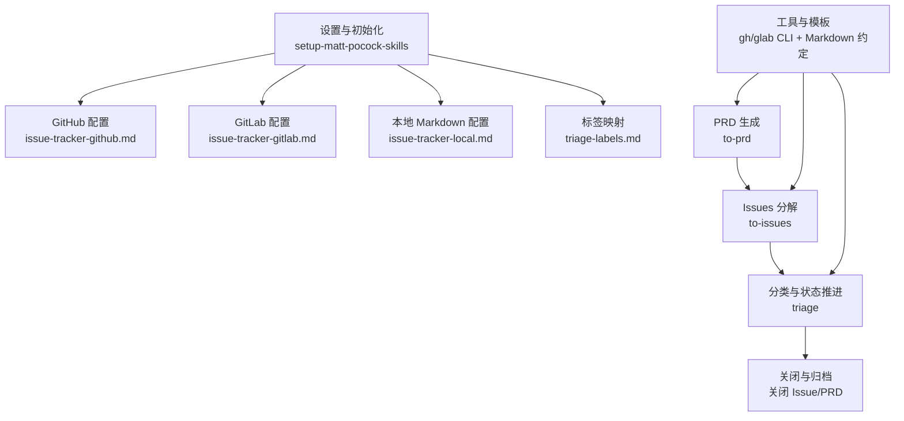
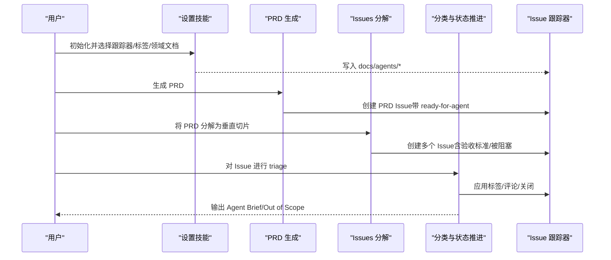
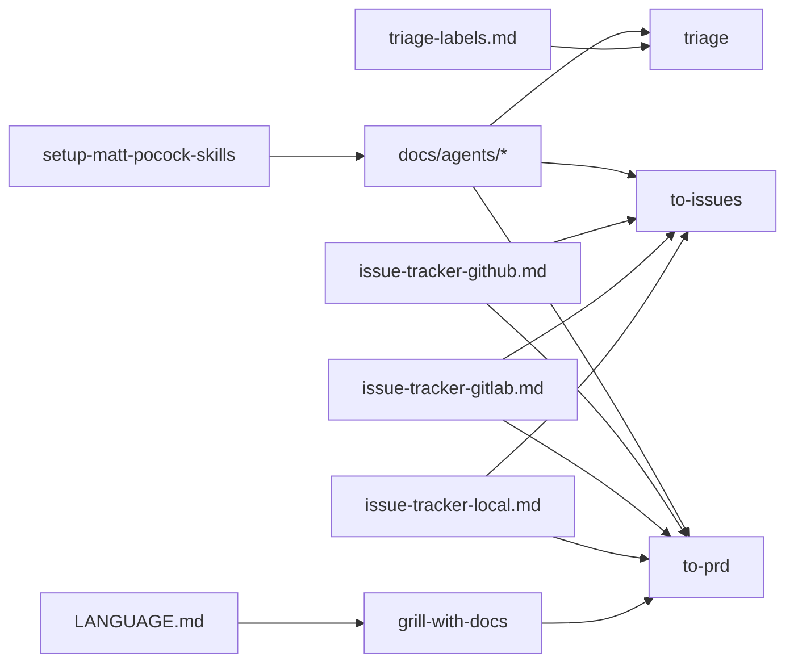

# 问题跟踪系统

<cite>
**本文档引用的文件**
- [setup-matt-pocock-skills/SKILL.md](file://skills/inbox/skills/setup-matt-pocock-skills/SKILL.md)
- [issue-tracker-github.md](file://skills/inbox/skills/setup-matt-pocock-skills/issue-tracker-github.md)
- [issue-tracker-gitlab.md](file://skills/inbox/skills/setup-matt-pocock-skills/issue-tracker-gitlab.md)
- [issue-tracker-local.md](file://skills/inbox/skills/setup-matt-pocock-skills/issue-tracker-local.md)
- [triage-labels.md](file://skills/inbox/skills/setup-matt-pocock-skills/triage-labels.md)
- [to-issues/SKILL.md](file://skills/inbox/skills/to-issues/SKILL.md)
- [triage/SKILL.md](file://skills/inbox/skills/triage/SKILL.md)
- [to-prd/SKILL.md](file://skills/inbox/skills/to-prd/SKILL.md)
- [grill-with-docs/SKILL.md](file://skills/inbox/skills/grill-with-docs/SKILL.md)
- [prototype/SKILL.md](file://skills/inbox/skills/prototype/SKILL.md)
- [tdd/tests.md](file://skills/inbox/skills/tdd/tests.md)
- [improve-codebase-architecture/LANGUAGE.md](file://skills/inbox/skills/improve-codebase-architecture/LANGUAGE.md)
</cite>

## 目录
1. [引言](#引言)
2. [项目结构](#项目结构)
3. [核心组件](#核心组件)
4. [架构总览](#架构总览)
5. [详细组件分析](#详细组件分析)
6. [依赖分析](#依赖分析)
7. [性能考虑](#性能考虑)
8. [故障排查指南](#故障排查指南)
9. [结论](#结论)
10. [附录](#附录)

## 引言
本文件面向 Skills Collection 的问题跟踪系统，目标是帮助团队将“需求与想法”转化为可执行、可追踪、可交付的问题（Issues），并建立标准化的问题管理生命周期。文档覆盖三类问题跟踪器配置（GitHub、GitLab、本地 Markdown），说明问题创建、分配、状态管理与关闭的完整流程，并提供模板、标签系统与工作流的最佳实践。通过统一的技能（skills）与约定，确保团队在不同平台间保持一致的操作体验。

## 项目结构
问题跟踪系统的核心由以下部分构成：
- 设置与初始化：通过“Matt Pocock 技能设置”技能自动识别并配置 Issue 跟踪器、标签映射与领域文档布局。
- 问题生命周期：从 PRD 到 Issues 的垂直切片分解、分类与状态推进、以及最终关闭。
- 工具与模板：CLI 约定（GitHub 的 gh、GitLab 的 glab）、Markdown 文件约定、问题模板与验收清单。
- 支撑技能：triage（分类与状态机）、to-prd（PRD 生成）、to-issues（Issues 分解）、grill-with-docs（拷问与术语澄清）、prototype（原型探索）、tdd（测试驱动）。

图表来源
- [setup-matt-pocock-skills/SKILL.md:36-46](file://skills/inbox/skills/setup-matt-pocock-skills/SKILL.md#L36-L46)
- [issue-tracker-github.md:1-23](file://skills/inbox/skills/setup-matt-pocock-skills/issue-tracker-github.md#L1-L23)
- [issue-tracker-gitlab.md:1-24](file://skills/inbox/skills/setup-matt-pocock-skills/issue-tracker-gitlab.md#L1-L24)
- [issue-tracker-local.md:1-20](file://skills/inbox/skills/setup-matt-pocock-skills/issue-tracker-local.md#L1-L20)
- [triage-labels.md:1-16](file://skills/inbox/skills/setup-matt-pocock-skills/triage-labels.md#L1-L16)
- [to-prd/SKILL.md:1-77](file://skills/inbox/skills/to-prd/SKILL.md#L1-L77)
- [to-issues/SKILL.md:1-84](file://skills/inbox/skills/to-issues/SKILL.md#L1-L84)
- [triage/SKILL.md:1-104](file://skills/inbox/skills/triage/SKILL.md#L1-L104)

章节来源
- [setup-matt-pocock-skills/SKILL.md:17-122](file://skills/inbox/skills/setup-matt-pocock-skills/SKILL.md#L17-L122)

## 核心组件
- 设置与初始化（setup-matt-pocock-skills）
  - 自动识别 Issue 跟踪器（GitHub/GitLab/本地 Markdown/其他），并生成 docs/agents/* 文档，供工程类技能读取。
  - 提供 triage 标签映射与领域文档布局（单/多 context）的配置入口。
- 问题生命周期（PRD → Issues → 分类与状态推进 → 关闭）
  - PRD 生成：将上下文转化为 PRD，标注 ready-for-agent 标签，减少 triage 时间。
  - Issues 分解：使用 tracer-bullet 垂直切片，确保每个切片贯穿所有集成层，优先 AFK 切片。
  - 分类与状态推进：基于 triage 角色与状态机推进，使用 triage-labels.md 中的标签映射。
  - 关闭：按需关闭 Issue/PRD，并在必要时归档到 out-of-scope。
- 工具与模板
  - GitHub：gh CLI 约定（创建、查看、列表、评论、标签、关闭）。
  - GitLab：glab CLI 约定（issue/create/view/list/note/update/close，MR 用法）。
  - 本地 Markdown：.scratch/<feature>/PRD.md 与 .scratch/<feature>/issues/*.md 的文件约定。
  - 问题模板：包含父级、要构建什么、验收标准、被阻塞等字段。
  - 标签系统：needs-triage、needs-info、ready-for-agent、ready-for-human、wontfix。
- 支撑技能
  - triage：状态机推进、needs-info 模板、Agent Brief 输出。
  - to-prd：PRD 模板与发布流程。
  - to-issues：垂直切片分解与发布。
  - grill-with-docs：术语澄清、ADR 与 CONTEXT.md 更新。
  - prototype：一次性原型，验证状态机/数据模型/UI 变体。
  - tdd：集成风格测试、好/坏测试示例与 tracer bullet 工作流。

章节来源
- [setup-matt-pocock-skills/SKILL.md:17-122](file://skills/inbox/skills/setup-matt-pocock-skills/SKILL.md#L17-L122)
- [triage-labels.md:1-16](file://skills/inbox/skills/setup-matt-pocock-skills/triage-labels.md#L1-L16)
- [to-issues/SKILL.md:12-84](file://skills/inbox/skills/to-issues/SKILL.md#L12-L84)
- [triage/SKILL.md:21-104](file://skills/inbox/skills/triage/SKILL.md#L21-L104)
- [to-prd/SKILL.md:10-77](file://skills/inbox/skills/to-prd/SKILL.md#L10-L77)
- [issue-tracker-github.md:5-23](file://skills/inbox/skills/setup-matt-pocock-skills/issue-tracker-github.md#L5-L23)
- [issue-tracker-gitlab.md:5-24](file://skills/inbox/skills/setup-matt-pocock-skills/issue-tracker-gitlab.md#L5-L24)
- [issue-tracker-local.md:5-20](file://skills/inbox/skills/setup-matt-pocock-skills/issue-tracker-local.md#L5-L20)
- [grill-with-docs/SKILL.md:16-89](file://skills/inbox/skills/grill-with-docs/SKILL.md#L16-L89)
- [prototype/SKILL.md:1-31](file://skills/inbox/skills/prototype/SKILL.md#L1-L31)
- [tdd/tests.md:1-62](file://skills/inbox/skills/tdd/tests.md#L1-L62)

## 架构总览
问题跟踪系统围绕“设置 → PRD → Issues → 分类与状态推进 → 关闭”的主干流程展开，辅以拷问、原型与测试技能，确保需求质量与实现效率。

图表来源
- [setup-matt-pocock-skills/SKILL.md:70-122](file://skills/inbox/skills/setup-matt-pocock-skills/SKILL.md#L70-L122)
- [to-prd/SKILL.md:10-77](file://skills/inbox/skills/to-prd/SKILL.md#L10-L77)
- [to-issues/SKILL.md:52-84](file://skills/inbox/skills/to-issues/SKILL.md#L52-L84)
- [triage/SKILL.md:42-104](file://skills/inbox/skills/triage/SKILL.md#L42-L104)

## 详细组件分析

### 设置与初始化（setup-matt-pocock-skills）
- 功能概述
  - 自动探测仓库类型（GitHub/GitLab/其他），并生成 docs/agents/issue-tracker.md、docs/agents/triage-labels.md、docs/agents/domain.md。
  - 为工程类技能提供 Issue 跟踪器位置、标签映射与领域文档布局的统一上下文。
- 关键流程
  - 探索：读取 git remote、AGENTS/CLAUDE、CONTEXT/CONTEXT-MAP、docs/adr、.scratch 等。
  - 展示与提问：分三部分引导用户确认 Issue 跟踪器、标签映射、领域文档布局。
  - 写入：更新 CLAUDE/AGENTS 的 Agent skills 区块，并写入三个 docs/agents/* 文件。
- 最佳实践
  - 首次使用 to-issues、to-prd、triage 等技能前运行该设置技能。
  - 若仓库已有标签体系，可在 triage-labels.md 中映射到规范角色字符串，避免重复标签。

章节来源
- [setup-matt-pocock-skills/SKILL.md:17-122](file://skills/inbox/skills/setup-matt-pocock-skills/SKILL.md#L17-L122)

### GitHub 问题跟踪器
- 约定与 CLI
  - 创建、查看、列表、评论、添加/移除标签、关闭等均通过 gh CLI 完成。
  - 列表支持 JSON 输出与过滤条件组合，便于自动化与可视化。
- 使用场景
  - “发布到 Issue 跟踪器”即创建 GitHub Issue。
  - “获取相关的工单”即查看 Issue 并附带评论。
- 最佳实践
  - 使用 heredoc 编写多行正文。
  - 列表时结合 label/state 过滤，配合 jq 输出结构化数据。

章节来源
- [issue-tracker-github.md:5-23](file://skills/inbox/skills/setup-matt-pocock-skills/issue-tracker-github.md#L5-L23)

### GitLab 问题跟踪器
- 约定与 CLI
  - 使用 glab CLI，Issue 称为 issues，评论称为 notes。
  - 关闭 Issue 前需先发布说明，再执行关闭。
  - MR（Merge Request）使用 glab mr 命令族，与 PR 类似但用词不同。
- 使用场景
  - “发布到 Issue 跟踪器”即创建 GitLab Issue。
  - “获取相关的工单”即查看 Issue 并附带评论。
- 最佳实践
  - 列表时使用 -F json 获取机器可读输出。
  - 多标签管理可用逗号分隔或重复标志。

章节来源
- [issue-tracker-gitlab.md:5-24](file://skills/inbox/skills/setup-matt-pocock-skills/issue-tracker-gitlab.md#L5-L24)

### 本地 Markdown 问题跟踪器
- 文件约定
  - 每个功能一个目录：.scratch/<feature-slug>/
  - PRD：.scratch/<feature-slug>/PRD.md
  - Issue：.scratch/<feature-slug>/issues/<NN>-<slug>.md（从 01 开始编号）
  - 状态记录于 Issue 文件顶部 Status 行，评论与历史追加至文件底部 “## Comments”
- 使用场景
  - “发布到 Issue 跟踪器”即在 .scratch/<feature>/ 下创建文件。
  - “获取相关的工单”即直接读取指定路径文件。
- 最佳实践
  - 保持 Issue 文件头部元信息简洁，评论区集中沉淀历史。
  - 与 triage-labels.md 的角色字符串保持一致，便于迁移。

章节来源
- [issue-tracker-local.md:5-20](file://skills/inbox/skills/setup-matt-pocock-skills/issue-tracker-local.md#L5-L20)

### 标签系统与 triage 角色
- 角色与状态
  - 分类角色：bug、enhancement
  - 状态角色：needs-triage、needs-info、ready-for-agent、ready-for-human、wontfix
- 标签映射
  - triage-labels.md 将规范角色映射到实际跟踪器标签字符串，避免重复标签。
- triage 工作流
  - 显示三类关注内容：未标记、needs-triage、自上次 triage 后报告者有活动的 needs-info。
  - 处理流程：收集上下文 → 推荐 → 复现（仅 bug）→ 拷问（必要时）→ 应用结果（agent brief/关闭/归档）。
  - needs-info 模板：明确已确定与仍需报告者提供的信息。
- 最佳实践
  - 状态转换遵循规范，冲突时先询问维护者。
  - triage 评论以免责声明开头，确保 AI 生成内容可追溯。

章节来源
- [triage/SKILL.md:21-104](file://skills/inbox/skills/triage/SKILL.md#L21-L104)
- [triage-labels.md:1-16](file://skills/inbox/skills/setup-matt-pocock-skills/triage-labels.md#L1-L16)

### PRD 生成（to-prd）
- 流程
  - 浏览仓库了解现状，使用领域术语表与 ADR。
  - 勾勒主要模块，寻找深模块机会，与用户确认测试范围。
  - 使用 PRD 模板发布到跟踪器，应用 ready-for-agent 标签。
- PRD 模板要点
  - 问题陈述、解决方案、用户故事、实现决策、测试决策、范围之外、进一步说明。
- 最佳实践
  - 避免具体文件路径与代码片段，必要时内联原型片段并裁剪关键决策。
  - 一经发布即视为 ready-for-agent，减少 triage 时间。

章节来源
- [to-prd/SKILL.md:10-77](file://skills/inbox/skills/to-prd/SKILL.md#L10-L77)

### Issues 分解（to-issues）
- 流程
  - 收集上下文：若用户提供引用，从跟踪器读取完整正文与评论。
  - 浏览代码库（可选）：使用领域术语表与 ADR。
  - 起草垂直切片：tracer bullet，贯穿所有集成层，优先 AFK 切片。
  - 询问用户：粒度、依赖关系、HITL/AFK 标记。
  - 发布到跟踪器：按依赖顺序发布，使用问题模板，应用 triage 标签。
- 问题模板
  - 父级、要构建什么、验收标准、被阻塞。
- 最佳实践
  - 严格遵循垂直切片原则，避免水平切片。
  - 依赖先行，阻塞字段引用真实标识符。

章节来源
- [to-issues/SKILL.md:12-84](file://skills/inbox/skills/to-issues/SKILL.md#L12-L84)

### 拷问与术语澄清（grill-with-docs）
- 目标
  - 压力测试方案，澄清术语，即时更新 CONTEXT.md 与 ADR。
- 关键点
  - 领域感知：文件结构、CONTEXT/CONTEXT-MAP、docs/adr。
  - 术语挑战与模糊语言澄清。
  - 与代码交叉引用，发现矛盾立即指出。
  - 即时更新 CONTEXT.md，谨慎提供 ADR。
- 最佳实践
  - 一次问一个问题，逐分支深入，逐个解决依赖。
  - 术语表优先，避免歧义。

章节来源
- [grill-with-docs/SKILL.md:16-89](file://skills/inbox/skills/grill-with-docs/SKILL.md#L16-L89)

### 原型探索（prototype）
- 目标
  - 在投入开发前探索设计，回答“问题决定了形态”的临时代码。
- 分支
  - 逻辑/状态模型：构建微型终端应用，推动状态机通过复杂案例。
  - UI 变体：单路由切换不同 UI，通过 URL 参数与浮动栏切换。
- 规则
  - 一次性、默认无持久化、跳过打磨、完成后删除或吸收。
  - 将“答案”捕获到持久载体（提交消息、ADR、issue、NOTES.md）。
- 最佳实践
  - 一条命令即可运行；完成后删除或吸收。

章节来源
- [prototype/SKILL.md:1-31](file://skills/inbox/skills/prototype/SKILL.md#L1-L31)

### 测试驱动（tdd）
- 好测试
  - 集成风格：通过真实接口测试，描述 WHAT 而非 HOW，断言外部行为。
- 坏测试
  - 实现细节测试：mock 内部协作对象、测试私有方法、断言调用次数/顺序。
- tracer bullet 工作流
  - RED→GREEN 循环，每个周期响应学到的行为，优先关键路径与复杂逻辑。
- 最佳实践
  - 与领域术语表一致，尊重 ADR；聚焦可验证行为。

章节来源
- [tdd/tests.md:1-62](file://skills/inbox/skills/tdd/tests.md#L1-L62)

### 领域语言（improve-codebase-architecture/LANGUAGE.md）
- 术语
  - 模块、接口、实现、深度、接缝、适配器、杠杆效应、局部性。
- 原则
  - 深度是接口的属性；接口即测试面；一个适配器意味着假设性接缝。
- 关系
  - 模块有且仅有一个接口；接缝位于接口处；适配器满足接口要求。
- 最佳实践
  - 使用统一术语，避免与 DDD 边界上下文混淆。

章节来源
- [improve-codebase-architecture/LANGUAGE.md:1-54](file://skills/inbox/skills/improve-codebase-architecture/LANGUAGE.md#L1-L54)

## 依赖分析
- 组件耦合
  - setup-matt-pocock-skills 为所有工程类技能提供上下文（docs/agents/*）。
  - triage 依赖 triage-labels.md 的标签映射；to-prd 与 to-issues 依赖跟踪器配置。
  - grill-with-docs 与 improve-codebase-architecture/LANGUAGE.md 共同保证领域一致性。
- 外部依赖
  - GitHub：gh CLI。
  - GitLab：glab CLI。
  - 本地：.scratch/ 文件约定。
- 潜在循环
  - 无直接循环；各技能职责清晰，通过 docs/agents/* 解耦。

图表来源
- [setup-matt-pocock-skills/SKILL.md:70-122](file://skills/inbox/skills/setup-matt-pocock-skills/SKILL.md#L70-L122)
- [triage-labels.md:1-16](file://skills/inbox/skills/setup-matt-pocock-skills/triage-labels.md#L1-L16)
- [issue-tracker-github.md:1-23](file://skills/inbox/skills/setup-matt-pocock-skills/issue-tracker-github.md#L1-L23)
- [issue-tracker-gitlab.md:1-24](file://skills/inbox/skills/setup-matt-pocock-skills/issue-tracker-gitlab.md#L1-L24)
- [issue-tracker-local.md:1-20](file://skills/inbox/skills/setup-matt-pocock-skills/issue-tracker-local.md#L1-L20)
- [to-prd/SKILL.md:10-77](file://skills/inbox/skills/to-prd/SKILL.md#L10-L77)
- [to-issues/SKILL.md:52-84](file://skills/inbox/skills/to-issues/SKILL.md#L52-L84)
- [triage/SKILL.md:42-104](file://skills/inbox/skills/triage/SKILL.md#L42-L104)
- [grill-with-docs/SKILL.md:16-89](file://skills/inbox/skills/grill-with-docs/SKILL.md#L16-L89)
- [improve-codebase-architecture/LANGUAGE.md:1-54](file://skills/inbox/skills/improve-codebase-architecture/LANGUAGE.md#L1-L54)

## 性能考虑
- 列表与过滤
  - 使用 JSON 输出与过滤条件组合，减少客户端处理负担，提升自动化效率。
- 垂直切片
  - tracer bullet 更短的反馈循环，降低集成风险与返工成本。
- 标签与 triage
  - 规范化的标签映射与状态机，减少沟通成本与误判。
- 本地 Markdown
  - .scratch/ 文件组织清晰，便于离线与轻量协作；注意与远程跟踪器的同步策略。

## 故障排查指南
- 无法识别跟踪器
  - 检查 git remote 与 docs/agents/issue-tracker.md 是否正确生成。
  - 重新运行 setup-matt-pocock-skills 并确认三部分选择。
- 标签不生效或重复
  - 检查 triage-labels.md 的映射是否与实际跟踪器一致。
  - triage 时若状态冲突，先询问维护者再覆盖。
- Issue 评论/标签/关闭异常
  - GitHub：确认 gh CLI 权限与仓库推断。
  - GitLab：先发布说明再关闭，注意 notes 与 update 的区别。
  - 本地：确认 .scratch/ 路径与文件命名规范。
- PRD/Issues 未及时推进
  - 确保 PRD 发布后应用 ready-for-agent 标签。
  - Issues 分解后按依赖顺序发布，阻塞字段引用真实标识符。
- 术语不一致
  - 使用 grill-with-docs 与 LANGUAGE.md 统一术语，避免歧义。

章节来源
- [setup-matt-pocock-skills/SKILL.md:70-122](file://skills/inbox/skills/setup-matt-pocock-skills/SKILL.md#L70-L122)
- [triage/SKILL.md:79-104](file://skills/inbox/skills/triage/SKILL.md#L79-L104)
- [issue-tracker-github.md:5-23](file://skills/inbox/skills/setup-matt-pocock-skills/issue-tracker-github.md#L5-L23)
- [issue-tracker-gitlab.md:5-24](file://skills/inbox/skills/setup-matt-pocock-skills/issue-tracker-gitlab.md#L5-L24)
- [issue-tracker-local.md:5-20](file://skills/inbox/skills/setup-matt-pocock-skills/issue-tracker-local.md#L5-L20)

## 结论
通过统一的设置技能、规范化的标签与状态机、PRD 与 Issues 的垂直切片分解，以及配套的拷问、原型与测试技能，团队可以建立标准化的问题管理系统。无论采用 GitHub、GitLab 还是本地 Markdown，均可在一致的流程与模板下高效运转，确保从需求到交付的端到端可追踪与可交付。

## 附录
- 问题模板字段
  - 父级：指向父级 Issue 的引用（如有）。
  - 要构建什么：端到端行为描述，避免具体文件路径与代码片段。
  - 验收标准：可验证的清单。
  - 被阻塞：阻塞工单引用或“无 - 可以立即开始”。

章节来源
- [to-issues/SKILL.md:58-81](file://skills/inbox/skills/to-issues/SKILL.md#L58-L81)
- [to-prd/SKILL.md:22-77](file://skills/inbox/skills/to-prd/SKILL.md#L22-L77)