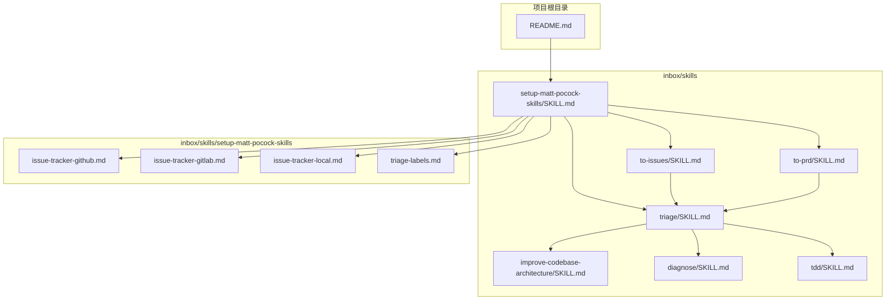
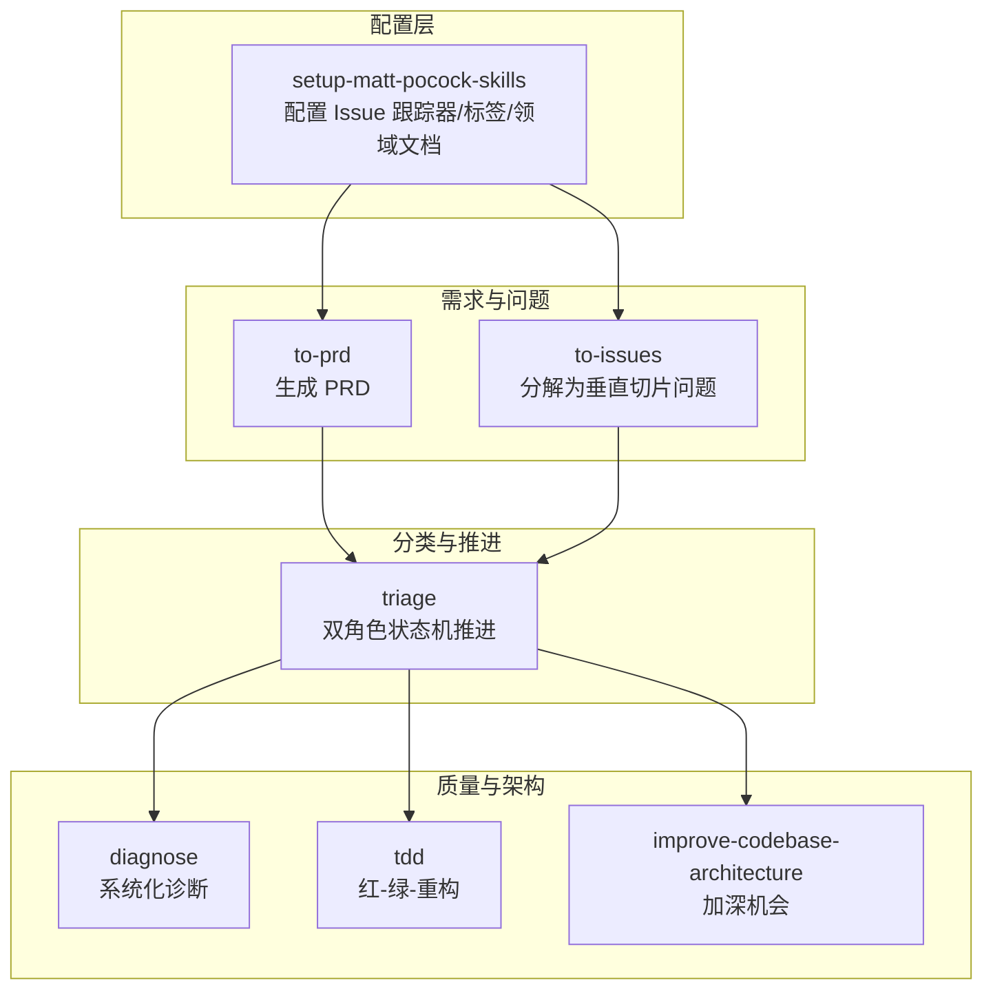
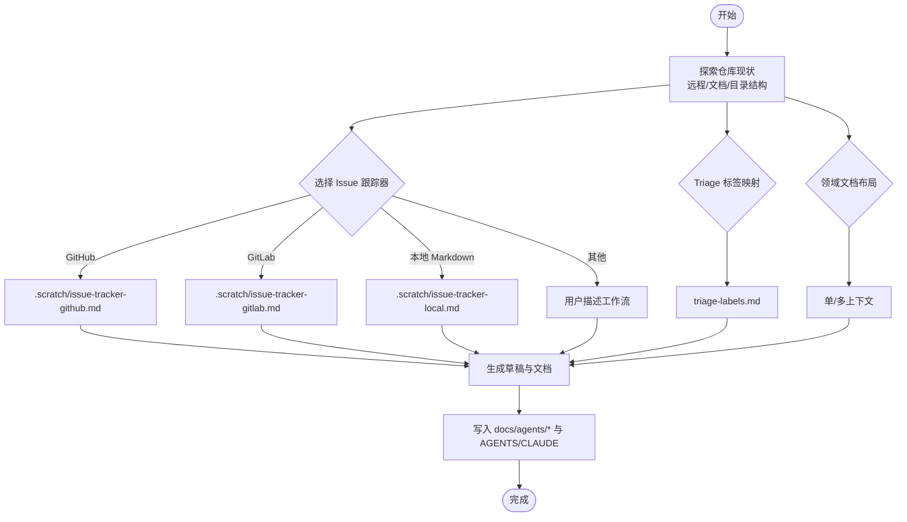
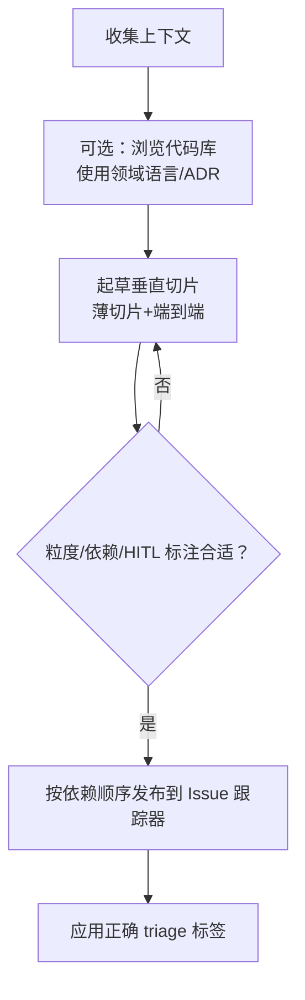
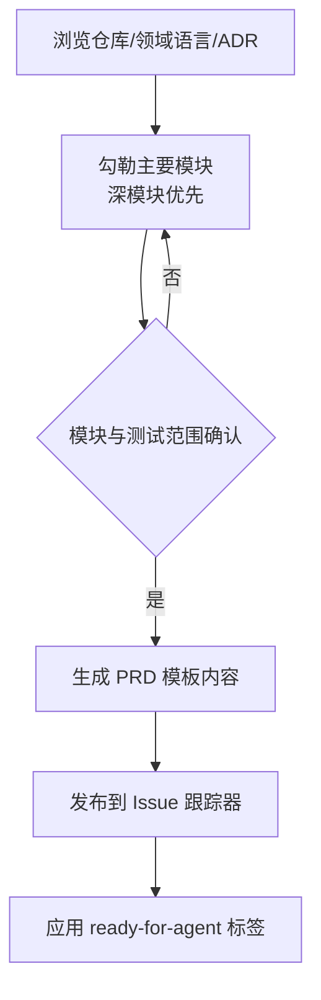
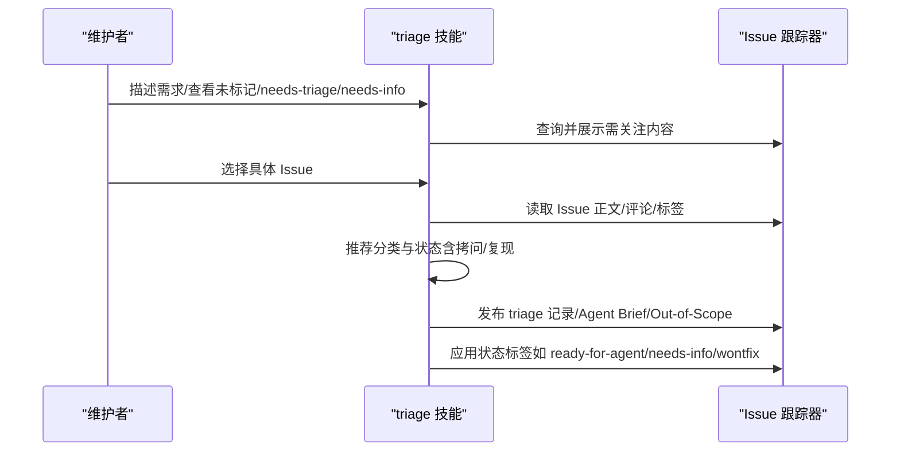
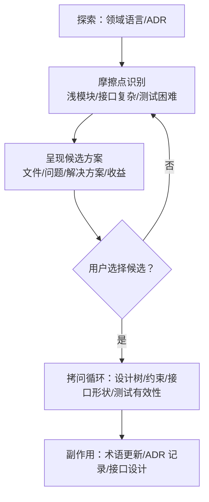
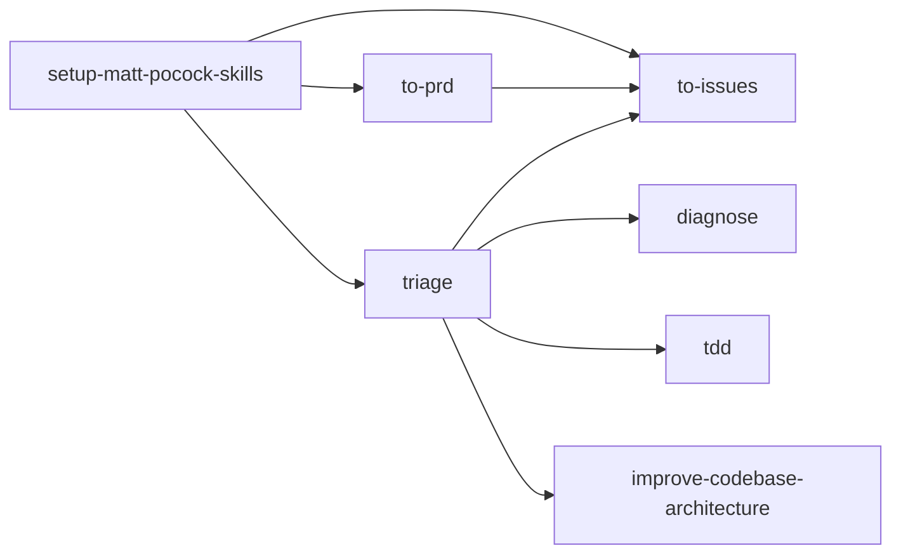

# 项目管理工具

<cite>
**本文档引用的文件**
- [README.md](file://README.md)
- [setup-matt-pocock-skills/SKILL.md](file://inbox/skills/setup-matt-pocock-skills/SKILL.md)
- [issue-tracker-github.md](file://inbox/skills/setup-matt-pocock-skills/issue-tracker-github.md)
- [issue-tracker-gitlab.md](file://inbox/skills/setup-matt-pocock-skills/issue-tracker-gitlab.md)
- [issue-tracker-local.md](file://inbox/skills/setup-matt-pocock-skills/issue-tracker-local.md)
- [triage-labels.md](file://inbox/skills/setup-matt-pocock-skills/triage-labels.md)
- [to-issues/SKILL.md](file://inbox/skills/to-issues/SKILL.md)
- [to-prd/SKILL.md](file://inbox/skills/to-prd/SKILL.md)
- [triage/SKILL.md](file://inbox/skills/triage/SKILL.md)
- [improve-codebase-architecture/SKILL.md](file://inbox/skills/improve-codebase-architecture/SKILL.md)
- [diagnose/SKILL.md](file://inbox/skills/diagnose/SKILL.md)
- [tdd/SKILL.md](file://inbox/skills/tdd/SKILL.md)
- [skill-evolve/SKILL.md](file://skills/skill-evolve/SKILL.md)
- [template.md](file://skills/skill-evolve/template.md)
</cite>

## 目录
1. [简介](#简介)
2. [项目结构](#项目结构)
3. [核心组件](#核心组件)
4. [架构总览](#架构总览)
5. [详细组件分析](#详细组件分析)
6. [依赖分析](#依赖分析)
7. [性能考虑](#性能考虑)
8. [故障排查指南](#故障排查指南)
9. [结论](#结论)
10. [附录](#附录)

## 简介
本文件围绕 Skills Collection 中与“项目管理”密切相关的技能集合，系统阐述问题跟踪、产品需求管理（PRD）、问题分类与优先级、Matt Pocock 技能体系配置与使用、以及从需求到问题的转化流程。文档同时给出可落地的工作流程、最佳实践与集成建议，帮助项目经理与产品经理提升效率，指导团队成员参与项目管理活动。

## 项目结构
Skills Collection 将每个“技能”组织为独立目录，包含一个 SKILL.md 作为技能说明书，以及可选的 references/、scripts/ 等配套资源。与项目管理相关的核心技能位于 inbox/skills 下，围绕“Matt Pocock 技能体系”的配置与使用展开。

图表来源
- [README.md:1-113](file://README.md#L1-L113)
- [setup-matt-pocock-skills/SKILL.md:1-122](file://inbox/skills/setup-matt-pocock-skills/SKILL.md#L1-L122)
- [to-issues/SKILL.md:1-84](file://inbox/skills/to-issues/SKILL.md#L1-L84)
- [to-prd/SKILL.md:1-77](file://inbox/skills/to-prd/SKILL.md#L1-L77)
- [triage/SKILL.md:1-104](file://inbox/skills/triage/SKILL.md#L1-L104)
- [improve-codebase-architecture/SKILL.md:1-72](file://inbox/skills/improve-codebase-architecture/SKILL.md#L1-L72)
- [diagnose/SKILL.md:1-118](file://inbox/skills/diagnose/SKILL.md#L1-L118)
- [tdd/SKILL.md:1-110](file://inbox/skills/tdd/SKILL.md#L1-L110)
- [issue-tracker-github.md:1-23](file://inbox/skills/setup-matt-pocock-skills/issue-tracker-github.md#L1-L23)
- [issue-tracker-gitlab.md:1-24](file://inbox/skills/setup-matt-pocock-skills/issue-tracker-gitlab.md#L1-L24)
- [issue-tracker-local.md:1-20](file://inbox/skills/setup-matt-pocock-skills/issue-tracker-local.md#L1-L20)
- [triage-labels.md:1-16](file://inbox/skills/setup-matt-pocock-skills/triage-labels.md#L1-L16)

章节来源
- [README.md:1-113](file://README.md#L1-L113)

## 核心组件
- Matt Pocock 技能体系配置（setup-matt-pocock-skills）：为仓库提供 Issue 跟踪器约定、Triage 标签映射、领域文档布局等上下文，确保工程类技能（to-issues、to-prd、triage、diagnose、tdd、improve-codebase-architecture、zoom-out 等）具备一致的外部系统与术语基础。
- 需求到问题（to-issues）：将计划/PRD分解为“垂直切片”（tracer bullet）问题，强调端到端薄切片与可独立验证，支持 HITL/AFK 类型标注与依赖关系发布。
- PRD 创建（to-prd）：基于当前上下文生成 PRD，统一问题陈述、解决方案、用户故事、实现与测试决策、范围内外说明等结构化内容。
- 分类与状态机（triage）：以“分类角色+状态角色”的双角色状态机推动 Issue 生命周期，提供 needs-info 模板、Agent Brief、Out-of-Scope 管理等。
- 诊断与测试（diagnose、tdd）：为疑难问题提供系统化诊断流程；以红-绿-重构为核心，强调通过公共接口验证行为、避免水平切片反模式。
- 架构改善（improve-codebase-architecture）：基于领域语言与 ADR，识别浅模块并提出“加深”机会，提升可测试性与 AI 可导航性。

章节来源
- [setup-matt-pocock-skills/SKILL.md:1-122](file://inbox/skills/setup-matt-pocock-skills/SKILL.md#L1-L122)
- [to-issues/SKILL.md:1-84](file://inbox/skills/to-issues/SKILL.md#L1-L84)
- [to-prd/SKILL.md:1-77](file://inbox/skills/to-prd/SKILL.md#L1-L77)
- [triage/SKILL.md:1-104](file://inbox/skills/triage/SKILL.md#L1-L104)
- [diagnose/SKILL.md:1-118](file://inbox/skills/diagnose/SKILL.md#L1-L118)
- [tdd/SKILL.md:1-110](file://inbox/skills/tdd/SKILL.md#L1-L110)
- [improve-codebase-architecture/SKILL.md:1-72](file://inbox/skills/improve-codebase-architecture/SKILL.md#L1-L72)

## 架构总览
Matt Pocock 技能体系通过“配置-执行-产出”的闭环，将需求与问题管理、分类与状态推进、架构改善与测试实践串联起来，形成可复用、可演进的项目管理基础设施。

图表来源
- [setup-matt-pocock-skills/SKILL.md:1-122](file://inbox/skills/setup-matt-pocock-skills/SKILL.md#L1-L122)
- [to-issues/SKILL.md:1-84](file://inbox/skills/to-issues/SKILL.md#L1-L84)
- [to-prd/SKILL.md:1-77](file://inbox/skills/to-prd/SKILL.md#L1-L77)
- [triage/SKILL.md:1-104](file://inbox/skills/triage/SKILL.md#L1-L104)
- [diagnose/SKILL.md:1-118](file://inbox/skills/diagnose/SKILL.md#L1-L118)
- [tdd/SKILL.md:1-110](file://inbox/skills/tdd/SKILL.md#L1-L110)
- [improve-codebase-architecture/SKILL.md:1-72](file://inbox/skills/improve-codebase-architecture/SKILL.md#L1-L72)

## 详细组件分析

### 组件一：Matt Pocock 技能设置（配置）
- 目标：为仓库提供 Issue 跟踪器约定、Triage 标签映射、领域文档布局等上下文，使工程类技能具备一致的外部系统与术语基础。
- 关键输入：仓库远程地址、现有 AGENTS/CLAUDE 文档、CONTEXT/CONTEXT-MAP、docs/adr、.scratch/ 等。
- 关键输出：docs/agents/issue-tracker.md、docs/agents/triage-labels.md、docs/agents/domain.md；更新 CLAUDE/AGENTS 中的 “Agent skills” 区块。
- 使用时机：首次使用工程类技能前，或当技能提示缺少 Issue 跟踪器/标签/领域文档上下文时。

图表来源
- [setup-matt-pocock-skills/SKILL.md:17-122](file://inbox/skills/setup-matt-pocock-skills/SKILL.md#L17-L122)
- [issue-tracker-github.md:1-23](file://inbox/skills/setup-matt-pocock-skills/issue-tracker-github.md#L1-L23)
- [issue-tracker-gitlab.md:1-24](file://inbox/skills/setup-matt-pocock-skills/issue-tracker-gitlab.md#L1-L24)
- [issue-tracker-local.md:1-20](file://inbox/skills/setup-matt-pocock-skills/issue-tracker-local.md#L1-L20)
- [triage-labels.md:1-16](file://inbox/skills/setup-matt-pocock-skills/triage-labels.md#L1-L16)

章节来源
- [setup-matt-pocock-skills/SKILL.md:1-122](file://inbox/skills/setup-matt-pocock-skills/SKILL.md#L1-L122)
- [issue-tracker-github.md:1-23](file://inbox/skills/setup-matt-pocock-skills/issue-tracker-github.md#L1-L23)
- [issue-tracker-gitlab.md:1-24](file://inbox/skills/setup-matt-pocock-skills/issue-tracker-gitlab.md#L1-L24)
- [issue-tracker-local.md:1-20](file://inbox/skills/setup-matt-pocock-skills/issue-tracker-local.md#L1-L20)
- [triage-labels.md:1-16](file://inbox/skills/setup-matt-pocock-skills/triage-labels.md#L1-L16)

### 组件二：从需求到问题（to-issues）
- 目标：将计划/PRD分解为“垂直切片”问题，强调端到端薄切片与可独立验证，支持 HITL/AFK 类型标注与依赖关系发布。
- 关键流程：收集上下文→可选浏览代码库→起草垂直切片→用户确认→发布到 Issue 跟踪器。
- 输出：每个切片对应一个 Issue，包含父级引用、要构建什么、验收标准、被阻塞等结构化正文。

图表来源
- [to-issues/SKILL.md:12-84](file://inbox/skills/to-issues/SKILL.md#L12-L84)

章节来源
- [to-issues/SKILL.md:1-84](file://inbox/skills/to-issues/SKILL.md#L1-L84)

### 组件三：PRD 创建（to-prd）
- 目标：基于当前上下文生成结构化 PRD，统一问题陈述、解决方案、用户故事、实现与测试决策、范围内外说明等。
- 关键流程：浏览仓库→勾勒主要模块→与用户确认模块与测试范围→使用模板发布到 Issue 跟踪器→应用 ready-for-agent 标签。
- 输出：完整的 PRD Issue，便于后续分解为问题与推进 triage。

图表来源
- [to-prd/SKILL.md:10-77](file://inbox/skills/to-prd/SKILL.md#L10-L77)

章节来源
- [to-prd/SKILL.md:1-77](file://inbox/skills/to-prd/SKILL.md#L1-L77)

### 组件四：问题分类与优先级（triage）
- 目标：通过“分类角色+状态角色”的双角色状态机推动 Issue 生命周期，明确 needs-triage、needs-info、ready-for-agent、ready-for-human、wontfix 等状态流转。
- 关键流程：显示需关注内容→处理特定 Issue→推荐/拷问→应用结果（含 Agent Brief、Out-of-Scope、needs-info 模板）。
- 输出：结构化 triage 记录、Agent Brief、Out-of-Scope 条目、状态标签更新。

图表来源
- [triage/SKILL.md:42-104](file://inbox/skills/triage/SKILL.md#L42-L104)

章节来源
- [triage/SKILL.md:1-104](file://inbox/skills/triage/SKILL.md#L1-L104)

### 组件五：诊断与测试（diagnose、tdd）
- 诊断（diagnose）：构建反馈循环→重现→提出假设→检测→修复+回归测试→清理与事后分析，强调确定性反馈循环与最小化证据。
- 测试（tdd）：以红-绿-重构为核心，避免水平切片反模式，强调通过公共接口验证行为、端到端 tracer bullet。

图表来源
- [diagnose/SKILL.md:12-118](file://inbox/skills/diagnose/SKILL.md#L12-L118)
- [tdd/SKILL.md:43-110](file://inbox/skills/tdd/SKILL.md#L43-L110)

章节来源
- [diagnose/SKILL.md:1-118](file://inbox/skills/diagnose/SKILL.md#L1-L118)
- [tdd/SKILL.md:1-110](file://inbox/skills/tdd/SKILL.md#L1-L110)

### 组件六：架构改善（improve-codebase-architecture）
- 目标：基于领域语言与 ADR，识别浅模块并提出“加深”机会，提升可测试性与 AI 可导航性。
- 关键流程：探索（使用领域语言/ADR）→摩擦点识别→候选方案呈现→拷问循环→副作用（术语更新/ADR 记录/接口设计）。

图表来源
- [improve-codebase-architecture/SKILL.md:31-72](file://inbox/skills/improve-codebase-architecture/SKILL.md#L31-L72)

章节来源
- [improve-codebase-architecture/SKILL.md:1-72](file://inbox/skills/improve-codebase-architecture/SKILL.md#L1-L72)

## 依赖分析
- 配置依赖：to-issues、to-prd、triage、diagnose、tdd、improve-codebase-architecture 等工程类技能均依赖 setup-matt-pocock-skills 提供的 Issue 跟踪器约定、Triage 标签映射与领域文档布局。
- 流程依赖：to-prd 产出的 PRD 作为 to-issues 的输入，triage 将 PRD/问题推进到 ready-for-agent/ready-for-human/wontfix 等状态，进而驱动 diagnose/tdd/ICA 等后续动作。
- 术语与 ADR 依赖：各技能在生成内容时需使用项目领域语言与尊重相关区域 ADR，确保一致性与可追溯性。

图表来源
- [setup-matt-pocock-skills/SKILL.md:1-122](file://inbox/skills/setup-matt-pocock-skills/SKILL.md#L1-L122)
- [to-issues/SKILL.md:1-84](file://inbox/skills/to-issues/SKILL.md#L1-L84)
- [to-prd/SKILL.md:1-77](file://inbox/skills/to-prd/SKILL.md#L1-L77)
- [triage/SKILL.md:1-104](file://inbox/skills/triage/SKILL.md#L1-L104)
- [diagnose/SKILL.md:1-118](file://inbox/skills/diagnose/SKILL.md#L1-L118)
- [tdd/SKILL.md:1-110](file://inbox/skills/tdd/SKILL.md#L1-L110)
- [improve-codebase-architecture/SKILL.md:1-72](file://inbox/skills/improve-codebase-architecture/SKILL.md#L1-L72)

章节来源
- [setup-matt-pocock-skills/SKILL.md:1-122](file://inbox/skills/setup-matt-pocock-skills/SKILL.md#L1-L122)
- [to-issues/SKILL.md:1-84](file://inbox/skills/to-issues/SKILL.md#L1-L84)
- [to-prd/SKILL.md:1-77](file://inbox/skills/to-prd/SKILL.md#L1-L77)
- [triage/SKILL.md:1-104](file://inbox/skills/triage/SKILL.md#L1-L104)
- [diagnose/SKILL.md:1-118](file://inbox/skills/diagnose/SKILL.md#L1-L118)
- [tdd/SKILL.md:1-110](file://inbox/skills/tdd/SKILL.md#L1-L110)
- [improve-codebase-architecture/SKILL.md:1-72](file://inbox/skills/improve-codebase-architecture/SKILL.md#L1-L72)

## 性能考虑
- 问题粒度：优先采用薄的垂直切片，减少阻塞与返工，缩短交付周期。
- triage 自动化：通过标准化标签与模板降低重复劳动，提高状态流转效率。
- 诊断反馈循环：优先构建确定性、可重复的反馈循环，减少无效猜测与试错成本。
- 架构加深：通过“加深”提升局部性与杠杆，降低后续变更成本与缺陷传播风险。

## 故障排查指南
- Issue 跟踪器不可用或权限不足：确认远程仓库地址与 CLI 工具（gh/glab）可用性；必要时切换到本地 Markdown 约定。
- triage 标签不匹配：核对 triage-labels.md 映射，确保与实际 Issue 跟踪器标签一致。
- 上下文缺失：若 PRD/问题描述缺乏领域术语或 ADR 背景，先运行 setup-matt-pocock-skills 完善上下文。
- 诊断无法复现：优先尝试失败测试、HTTP/CLI 脚本、无头浏览器脚本等构建反馈循环；对非确定性问题提高复现率。
- TDD 水平切片反模式：严格遵循 tracer bullet 的 RED→GREEN→重构循环，避免批量测试与实现。

章节来源
- [triage/SKILL.md:10-15](file://inbox/skills/triage/SKILL.md#L10-L15)
- [diagnose/SKILL.md:18-51](file://inbox/skills/diagnose/SKILL.md#L18-L51)
- [tdd/SKILL.md:18-41](file://inbox/skills/tdd/SKILL.md#L18-L41)

## 结论
通过 Matt Pocock 技能体系的配置与使用，结合 to-prd、to-issues、triage、diagnose、tdd、improve-codebase-architecture 等技能，项目管理实现了从需求到问题、从分类到执行、从诊断到改善的闭环。该体系强调结构化文档、标准化标签与模板、端到端薄切片与公共接口验证，有助于提升团队协作效率与交付质量。

## 附录

### 附录A：从需求到问题的转化流程（图示）

图表来源
- [to-prd/SKILL.md:10-77](file://inbox/skills/to-prd/SKILL.md#L10-L77)
- [triage/SKILL.md:42-104](file://inbox/skills/triage/SKILL.md#L42-L104)
- [to-issues/SKILL.md:12-84](file://inbox/skills/to-issues/SKILL.md#L12-L84)

### 附录B：Matt Pocock 技能设置的配置与使用要点
- Issue 跟踪器：GitHub/GitLab/本地 Markdown/其他，分别对应不同 CLI 约定与工作流。
- Triage 标签：needs-triage、needs-info、ready-for-agent、ready-for-human、wontfix 的映射。
- 领域文档：单/多上下文布局，配合 CONTEXT/CONTEXT-MAP 与 docs/adr。
- 使用建议：首次使用工程类技能前运行配置；仅在切换跟踪器或重新开始时重新运行。

章节来源
- [setup-matt-pocock-skills/SKILL.md:17-122](file://inbox/skills/setup-matt-pocock-skills/SKILL.md#L17-L122)
- [issue-tracker-github.md:1-23](file://inbox/skills/setup-matt-pocock-skills/issue-tracker-github.md#L1-L23)
- [issue-tracker-gitlab.md:1-24](file://inbox/skills/setup-matt-pocock-skills/issue-tracker-gitlab.md#L1-L24)
- [issue-tracker-local.md:1-20](file://inbox/skills/setup-matt-pocock-skills/issue-tracker-local.md#L1-L20)
- [triage-labels.md:1-16](file://inbox/skills/setup-matt-pocock-skills/triage-labels.md#L1-L16)

### 附录C：技能演进与文档治理（可选）
- skill-evolve：对 SKILL.md 进行结构优化、参考文档拆分、格式标准化与审查清单校验，确保文档质量与可维护性。
- template.md：提供标准章节与写作规范，支撑技能文档的结构化与一致性。

章节来源
- [skill-evolve/SKILL.md:1-371](file://skills/skill-evolve/SKILL.md#L1-L371)
- [template.md:1-247](file://skills/skill-evolve/template.md#L1-L247)