# 高级功能与工具

<cite>
**本文档引用的文件**
- [README.md](file://README.md)
- [README.zh-CN.md](file://README.zh-CN.md)
- [SKILL.md（skill-evolve）](file://skills/skill-evolve/SKILL.md)
- [SKILL.md（skill-evolve-cycle）](file://skills/skill-evolve-cycle/SKILL.md)
- [模板 SKILL.md](file://templates/SKILL.md)
- [模板 SKILL.md（skill-evolve）](file://skills/skill-evolve/template.md)
- [SKILL.md（原型）](file://inbox/skills/prototype/SKILL.md)
- [SKILL.md（TDD）](file://inbox/skills/tdd/SKILL.md)
- [SKILL.md（改善代码库架构）](file://inbox/skills/improve-codebase-architecture/SKILL.md)
- [接口设计（improve-codebase-architecture）](file://inbox/skills/improve-codebase-architecture/INTERFACE-DESIGN.md)
- [语言（improve-codebase-architecture）](file://inbox/skills/improve-codebase-architecture/LANGUAGE.md)
- [SKILL.md（Matt Pocock 技能设置）](file://inbox/skills/setup-matt-pocock-skills/SKILL.md)
- [SKILL.md（转换为 Issues）](file://inbox/skills/to-issues/SKILL.md)
- [人机循环脚本模板](file://inbox/skills/diagnose/scripts/hitl-loop.template.sh)
</cite>

## 目录
1. [简介](#简介)
2. [项目结构](#项目结构)
3. [核心组件](#核心组件)
4. [架构总览](#架构总览)
5. [详细组件分析](#详细组件分析)
6. [依赖分析](#依赖分析)
7. [性能考虑](#性能考虑)
8. [故障排除指南](#故障排除指南)
9. [结论](#结论)
10. [附录](#附录)

## 简介
本文件聚焦 Skills Collection 的高级功能与工具，涵盖原型技能、诊断工具、架构改进、测试驱动开发（TDD）等。文档面向高级用户，提供深入的使用方法、适用场景、流程控制与最佳实践，并辅以可视化图示、排障建议与示例路径，帮助读者高效落地。

## 项目结构
仓库采用“技能即自包含目录”的组织方式，遵循 agent-skills 规范。核心技能位于 skills/，实验性/待孵化技能位于 inbox/skills/，模板与参考文档位于 templates/ 与 docs/。命令与脚本位于 commands/ 与 scripts/，便于安装与复用。

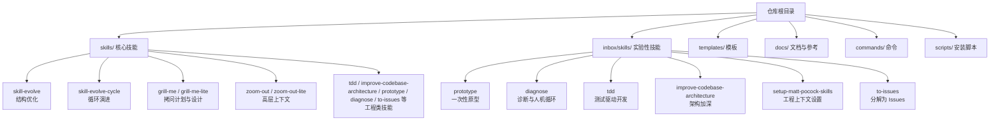

图表来源
- [README.md:1-113](file://README.md#L1-L113)
- [README.zh-CN.md:1-113](file://README.zh-CN.md#L1-L113)

章节来源
- [README.md:1-113](file://README.md#L1-L113)
- [README.zh-CN.md:1-113](file://README.zh-CN.md#L1-L113)

## 核心组件
- 结构化演进体系
  - skill-evolve：对单个 SKILL.md 进行结构对齐、格式标准化、内容精简与参考文档拆分，确保符合模板与标准。
  - skill-evolve-cycle：在优化与评审之间交替的循环演进，支持自我演进与回溯同步，形成稳定的长期演进闭环。
- 工程上下文与协作
  - setup-matt-pocock-skills：为工程类技能注入 issue 跟踪器、triage 标签与领域文档布局上下文，确保跨技能一致性。
  - to-issues：将计划/PRD分解为可独立处理的垂直切片 issues，支撑 AFK/HITL 并行推进。
- 原型与诊断
  - prototype：在投入开发前探索设计，提供逻辑/状态机与 UI 变体两条分支，强调一次性与可删除性。
  - diagnose：结合人机循环脚本模板，建立可重复的“人类在环”复现流程。
- 架构改进与 TDD
  - improve-codebase-architecture：识别“加深机会”，将浅模块重构为深模块，提升可测试性与 AI 可导航性。
  - tdd：遵循红-绿-重构循环，强调通过公共接口验证行为，避免实现耦合。

章节来源
- [SKILL.md（skill-evolve）:1-371](file://skills/skill-evolve/SKILL.md#L1-L371)
- [SKILL.md（skill-evolve-cycle）:1-308](file://skills/skill-evolve-cycle/SKILL.md#L1-L308)
- [SKILL.md（Matt Pocock 技能设置）:1-122](file://inbox/skills/setup-matt-pocock-skills/SKILL.md#L1-L122)
- [SKILL.md（转换为 Issues）:1-84](file://inbox/skills/to-issues/SKILL.md#L1-L84)
- [SKILL.md（原型）:1-31](file://inbox/skills/prototype/SKILL.md#L1-L31)
- [SKILL.md（TDD）:1-110](file://inbox/skills/tdd/SKILL.md#L1-L110)
- [SKILL.md（改善代码库架构）:1-72](file://inbox/skills/improve-codebase-architecture/SKILL.md#L1-L72)

## 架构总览
下图展示了“演进-评审-合并-回溯”闭环与工程上下文注入的关系，体现高级功能之间的协同与依赖。

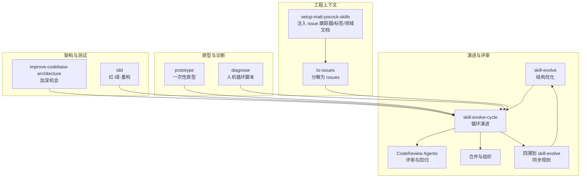

图表来源
- [SKILL.md（skill-evolve）:1-371](file://skills/skill-evolve/SKILL.md#L1-L371)
- [SKILL.md（skill-evolve-cycle）:1-308](file://skills/skill-evolve-cycle/SKILL.md#L1-L308)
- [SKILL.md（Matt Pocock 技能设置）:1-122](file://inbox/skills/setup-matt-pocock-skills/SKILL.md#L1-L122)
- [SKILL.md（转换为 Issues）:1-84](file://inbox/skills/to-issues/SKILL.md#L1-L84)
- [SKILL.md（原型）:1-31](file://inbox/skills/prototype/SKILL.md#L1-L31)
- [SKILL.md（TDD）:1-110](file://inbox/skills/tdd/SKILL.md#L1-L110)
- [SKILL.md（改善代码库架构）:1-72](file://inbox/skills/improve-codebase-architecture/SKILL.md#L1-L72)

## 详细组件分析

### 组件一：skill-evolve（结构优化）
- 目标与范围
  - 对现有 SKILL.md 进行一次性结构演进：对齐模板、清理冗余、拆分参考文档、统一格式、迁移复杂内容至 references/。
- 关键流程
  - 预检：校验目标文件、模板与 references/ 文件完整性，保存原始内容副本用于不可恢复错误回滚。
  - 元数据结构：修正 name 与 description，确保触发条件与第三人称表述。
  - 结构对齐：按模板标准节对齐与排序，补齐 Secure steps（预检/评审/输出）。
  - 格式标准化：逐项对照各参考文件的“验证清单”，统一标点、简化文本、抽象变量名。
  - 内容精简：超过阈值时优先在 SKILL.md 内压缩，否则迁移到 references/；评估是否新增 scripts/tests/assets/schemas 目录。
  - 参考拆分：将 REFERENCE.md 拆分为多文件，逐段比对确保无遗漏，更新链接。
  - 评审检查：对照 Review List 逐项验证，必要时执行防御性处理。
  - 输出：输出前后对比与维度变化，完成优化。
- 适用场景
  - 需要规范化现有技能文档、提升可读性与可维护性。
  - 准备参与 skill-evolve-cycle 的前置步骤。
- 高级技巧
  - 自我演进：当目标为 skill-evolve 本身时，需同步更新模板与引用，避免循环依赖。
  - 交互一致性：严格遵循 AskUserQuestion 的标准范式，保证用户决策可追踪。
  - 链接与锚点：确保 Definitions 与 body 文本使用锚点链接，避免裸文本引用。

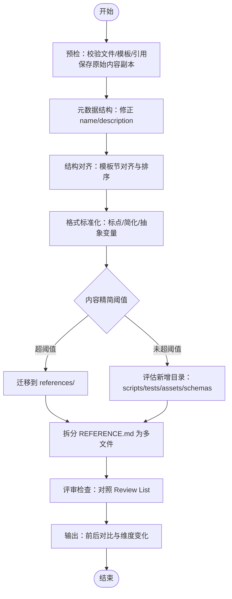

图表来源
- [SKILL.md（skill-evolve）:30-172](file://skills/skill-evolve/SKILL.md#L30-L172)

章节来源
- [SKILL.md（skill-evolve）:1-371](file://skills/skill-evolve/SKILL.md#L1-L371)
- [模板 SKILL.md（skill-evolve）:1-247](file://skills/skill-evolve/template.md#L1-L247)

### 组件二：skill-evolve-cycle（循环演进）
- 目标与范围
  - 在“优化-评审-修复-合并-回溯”之间交替进行，直至收敛或达到迭代上限。
- 关键流程
  - 预检：判断是否为原始仓库、创建 UTC 时间目录、校验目标与依赖。
  - 小循环 A（优化）：反复调用 skill-evolve，直到收敛或达上限。
  - 小循环 B（评审）：并行调度三种 CodeReview Agent（完整性/正确性/影响），记录并修复问题，回归验证。
  - 大循环收敛判断：小循环 A 第一轮与小循环 B 第一轮均无新问题。
  - 合并与回溯：根据是否为原始仓库分流；若为原始仓库，按“回溯路由标准”将经验写回 skill-evolve。
  - 报告与迭代：汇总报告，检查大循环上限，决定是否继续下一大轮。
  - 评审检查与输出：最终评审通过后输出总结。
- 适用场景
  - 需要持续改进技能质量与一致性，保障规则与示例同步更新。
- 高级技巧
  - 自动连续执行：大循环间自动推进，无需人工干预。
  - Agent 类型与并行数硬约束：必须使用 CodeReview Agent，且每次评审严格三路并行。
  - 报告命名与持久化：严格遵循命名规范，便于溯源与审计。

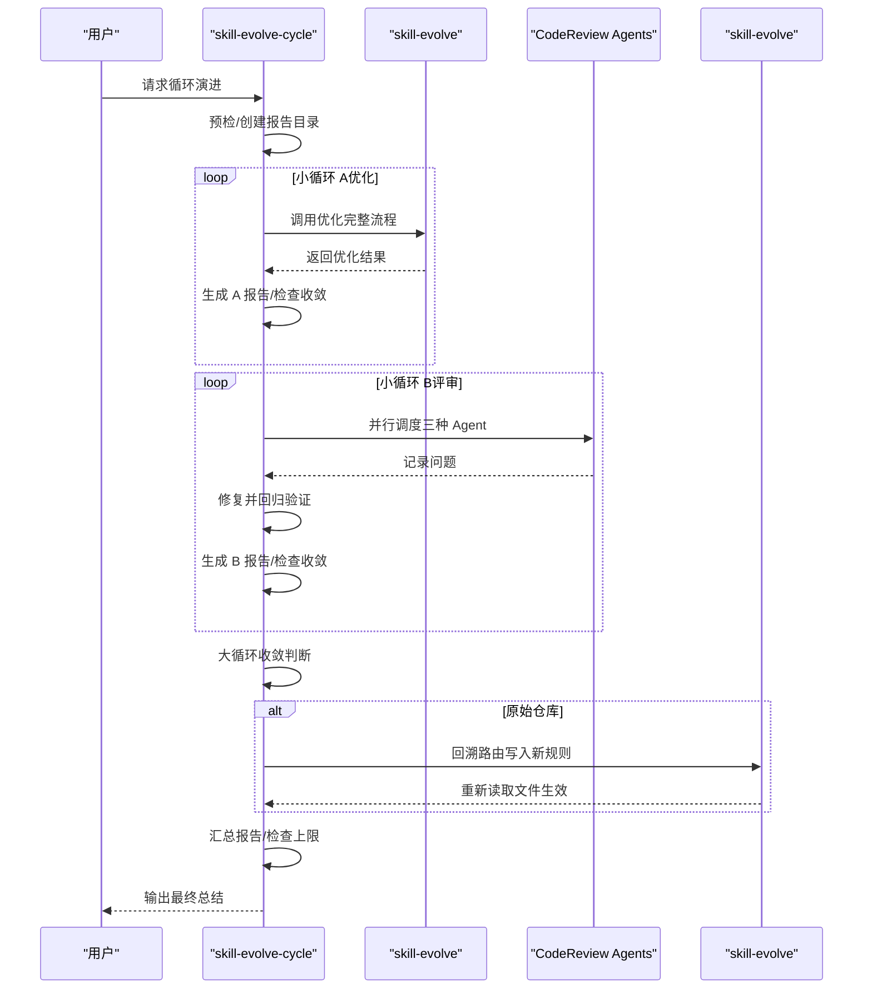

图表来源
- [SKILL.md（skill-evolve-cycle）:45-150](file://skills/skill-evolve-cycle/SKILL.md#L45-L150)

章节来源
- [SKILL.md（skill-evolve-cycle）:1-308](file://skills/skill-evolve-cycle/SKILL.md#L1-L308)

### 组件三：原型技能（prototype）
- 目标与范围
  - 在投入开发前探索设计，产出临时代码以回答问题；强调一次性、可运行、默认无持久化、跳过打磨。
- 两条分支
  - 逻辑/状态模型合理性验证：构建微型终端应用，推动状态机通过难以在纸上推理的案例。
  - UI 变体探索：在单路由生成多个 UI 变体，通过 URL 参数与浮动栏切换。
- 适用场景
  - 需要快速验证数据模型/状态机、草拟 UI、探索设计选项、或“让我试试”场景。
- 高级技巧
  - 命名与位置：原型置于临近真实模块的位置，但命名明确标注为一次性。
  - 默认无持久化：状态保存在内存；如涉及数据库，使用临时数据库并命名清晰。
  - 完成后处置：将答案与问题捕获到持久载体（提交消息、ADR、issue、NOTES.md）。

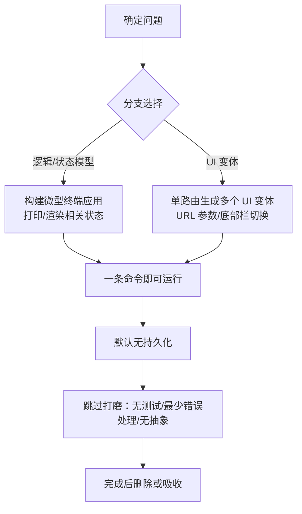

图表来源
- [SKILL.md（原型）:10-31](file://inbox/skills/prototype/SKILL.md#L10-L31)

章节来源
- [SKILL.md（原型）:1-31](file://inbox/skills/prototype/SKILL.md#L1-L31)

### 组件四：诊断工具（diagnose + 人机循环）
- 目标与范围
  - 建立可重复的人机循环（Human-in-the-loop）复现流程，辅助定位与验证问题。
- 关键要素
  - 脚本模板：提供 step()/capture() 助手，标准化用户交互与结果捕获。
  - 使用方式：复制模板、编辑步骤、运行脚本；最终以 KEY=VALUE 形式输出供后续处理。
- 适用场景
  - Bug 复现、用户反馈验证、A/B 场景对比、需要人类输入的交互式诊断。
- 高级技巧
  - 明确指令与问题：每一步骤前给出清晰说明，减少歧义。
  - 结果结构化：统一 KEY=VALUE 输出，便于自动化解析与归档。

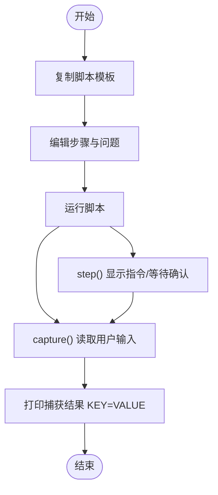

图表来源
- [人机循环脚本模板:1-42](file://inbox/skills/diagnose/scripts/hitl-loop.template.sh#L1-L42)

章节来源
- [人机循环脚本模板:1-42](file://inbox/skills/diagnose/scripts/hitl-loop.template.sh#L1-L42)

### 组件五：测试驱动开发（TDD）
- 目标与范围
  - 通过“红-绿-重构”循环，以公共接口验证行为，避免实现耦合。
- 核心理念
  - 好的测试：集成风格，描述系统“做什么”，而非“如何做”；在重构中存活。
  - 坏的测试：与实现耦合，mock 内部协作者、测试私有方法。
- 工作流
  - 规划：确认接口变更、行为优先级、深模块机会、接口可测试性。
  - Tracer Bullet：首个行为的“红→绿”，证明端到端路径可用。
  - 增量循环：一次一个测试，只编写刚好通过当前测试的代码。
  - 重构：在所有测试通过后，查找重构候选并逐项验证。
- 适用场景
  - 新功能开发、Bug 修复、测试优先开发、提升可测试性与可维护性。
- 高级技巧
  - 避免“水平切片”：不要批量编写测试再批量实现。
  - 注重行为而非实现：测试描述应反映用户可见行为。
  - 永远不在 RED 状态下重构：先达到 GREEN。

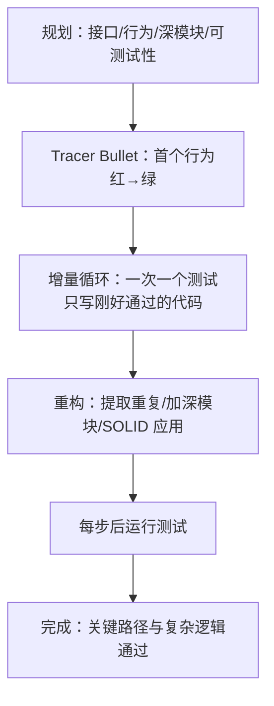

图表来源
- [SKILL.md（TDD）:43-110](file://inbox/skills/tdd/SKILL.md#L43-L110)

章节来源
- [SKILL.md（TDD）:1-110](file://inbox/skills/tdd/SKILL.md#L1-L110)

### 组件六：改善代码库架构（improve-codebase-architecture）
- 目标与范围
  - 识别“加深机会”，将浅模块重构为深模块，提升可测试性与 AI 可导航性。
- 术语与原则
  - 模块、接口、实现、深度、接缝、适配器、杠杆、局部性。
  - 深度=接口杠杆；浅=接口接近实现复杂度；删除测试检验模块价值。
- 流程
  - 探索：阅读领域术语与 ADR，使用 Explore Agent 有机探索摩擦点。
  - 候选：呈现编号列表的加深机会，说明文件、问题、解决方案与收益。
  - 拷问：与用户共同走过设计树，明确约束、依赖、接口形状与测试有效性。
  - 副作用：必要时更新 CONTEXT.md、生成 ADR 或探索替代接口。
- 适用场景
  - 架构重构、消除紧耦合、提升可测试性与可维护性。
- 高级技巧
  - 使用统一语言：严格使用“模块/接口/接缝/适配器/杠杆/局部性”。
  - 与 ADR 对齐：若候选与既有 ADR 冲突，仅在摩擦真实且值得重新审视时提出。
  - 接口设计并行子代理：并行生成多个截然不同的接口方案，进行对比与推荐。

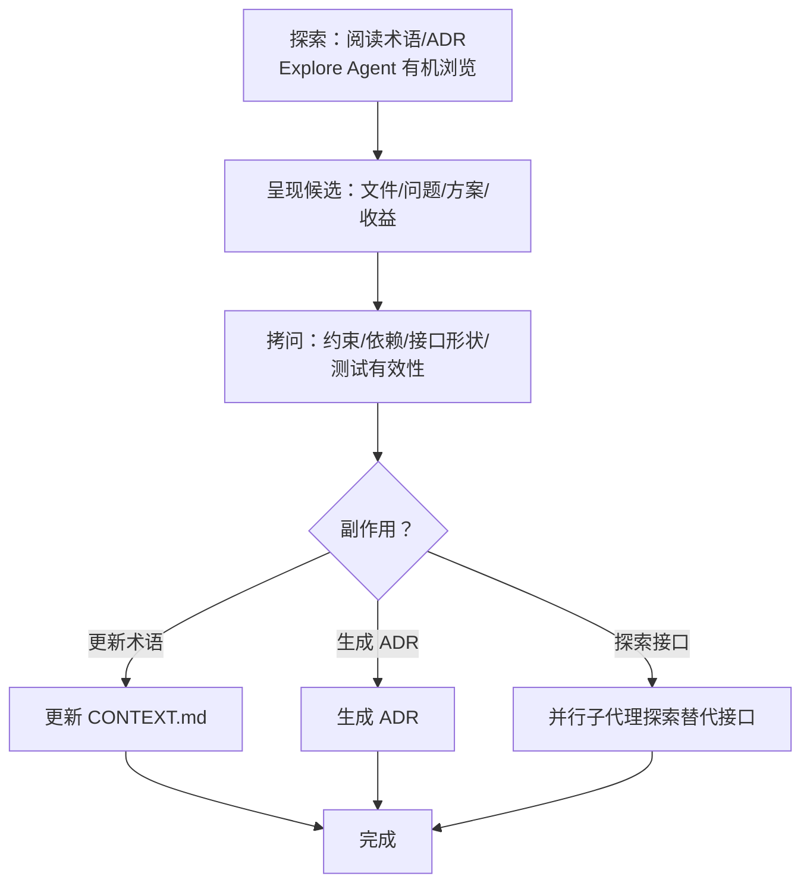

图表来源
- [SKILL.md（改善代码库架构）:31-72](file://inbox/skills/improve-codebase-architecture/SKILL.md#L31-L72)
- [接口设计（improve-codebase-architecture）:19-45](file://inbox/skills/improve-codebase-architecture/INTERFACE-DESIGN.md#L19-L45)
- [语言（improve-codebase-architecture）:1-54](file://inbox/skills/improve-codebase-architecture/LANGUAGE.md#L1-L54)

章节来源
- [SKILL.md（改善代码库架构）:1-72](file://inbox/skills/improve-codebase-architecture/SKILL.md#L1-L72)
- [接口设计（improve-codebase-architecture）:1-45](file://inbox/skills/improve-codebase-architecture/INTERFACE-DESIGN.md#L1-L45)
- [语言（improve-codebase-architecture）:1-54](file://inbox/skills/improve-codebase-architecture/LANGUAGE.md#L1-L54)

### 组件七：工程上下文设置（setup-matt-pocock-skills）
- 目标与范围
  - 为工程类技能注入 issue 跟踪器、triage 标签与领域文档布局上下文，确保跨技能一致性。
- 关键流程
  - 探索：检查远程仓库、现有配置文件、CONTEXT/ADR 布局、本地 markdown issue 跟踪器约定。
  - 展示与提问：分三部分逐步引导用户确认 issue 跟踪器、triage 标签词汇表、领域文档布局。
  - 确认与编辑：展示草稿，允许用户编辑后再写入。
  - 写入：选择 CLAUDE.md/AGENTS.md，更新或创建“## Agent skills”块，并写入三个文档。
- 适用场景
  - 首次使用 to-issues、triage、diagnose、tdd、improve-codebase-architecture、zoom-out 等工程类技能前。
- 高级技巧
  - 优先编辑已存在的配置文件，避免重复块。
  - “其他”issue 跟踪器：使用用户描述从头编写说明文档。

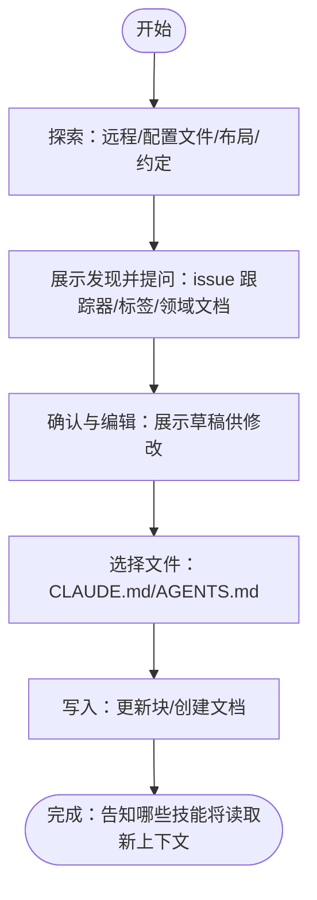

图表来源
- [SKILL.md（Matt Pocock 技能设置）:17-122](file://inbox/skills/setup-matt-pocock-skills/SKILL.md#L17-L122)

章节来源
- [SKILL.md（Matt Pocock 技能设置）:1-122](file://inbox/skills/setup-matt-pocock-skills/SKILL.md#L1-L122)

### 组件八：转换为 Issues（to-issues）
- 目标与范围
  - 将计划/规范/PRD分解为可独立处理的 vertical slice issues，优先 AFK 切片。
- 关键流程
  - 收集上下文：读取对话上下文；如提供 issue 引用，从跟踪器拉取全文与评论。
  - 浏览代码库（可选）：了解现状，使用领域术语与 ADR。
  - 起草垂直切片：薄而完整的端到端切片，优先 AFK。
  - 用户确认：展示编号列表，确认粒度、依赖、HITL/AFK 标记。
  - 发布 issues：按依赖顺序发布，使用模板正文与 triage 标签。
- 适用场景
  - 将计划转化为可执行工单，支撑并行开发与 AFK 自动化。
- 高级技巧
  - 垂直切片原则：贯穿所有集成层，避免水平切片。
  - 模板一致性：避免具体文件路径，突出决策与验收标准。

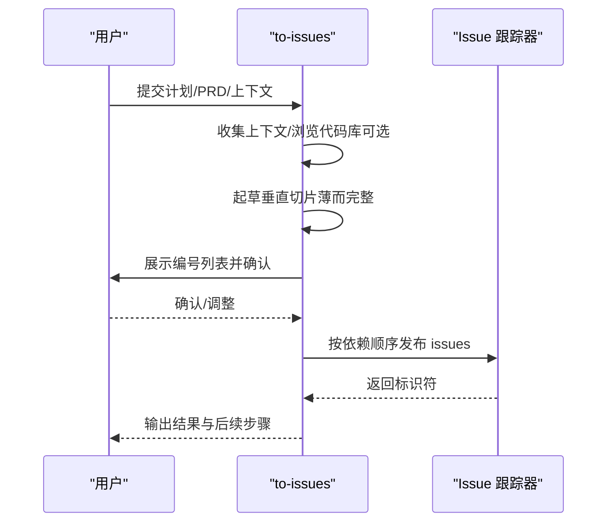

图表来源
- [SKILL.md（转换为 Issues）:12-84](file://inbox/skills/to-issues/SKILL.md#L12-L84)

章节来源
- [SKILL.md（转换为 Issues）:1-84](file://inbox/skills/to-issues/SKILL.md#L1-L84)

## 依赖分析
- 技能内聚与耦合
  - skill-evolve 与 skill-evolve-cycle：前者负责单次优化，后者负责循环演进与回溯同步，二者强关联。
  - 工程上下文注入：setup-matt-pocock-skills 为 to-issues、triage、diagnose、tdd、improve-codebase-architecture 等提供统一上下文。
  - 原型与诊断：prototype 与 diagnose 作为探索与验证工具，服务于更高层的演进与评审。
- 外部依赖与集成点
  - CodeReview Agent：在 skill-evolve-cycle 的评审阶段强制使用，确保评审质量与一致性。
  - issue 跟踪器：GitHub/GitLab/本地 markdown/Jira 等多种后端，通过 setup-matt-pocock-skills 统一注入。
- 循环依赖与风险
  - skill-evolve 自我演进时需同步更新模板与引用，避免循环引用与链接失效。
  - 回溯到 skill-evolve 的规则需在写入后重新读取，确保新规则生效。

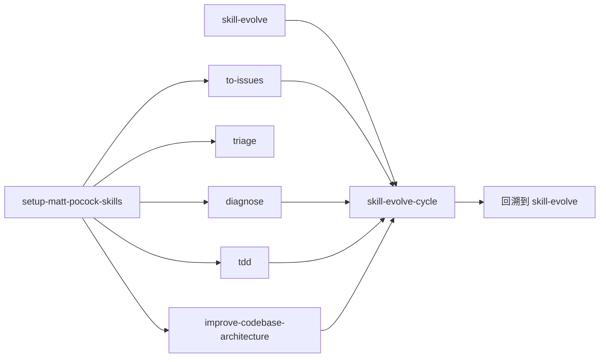

图表来源
- [SKILL.md（skill-evolve）:1-371](file://skills/skill-evolve/SKILL.md#L1-L371)
- [SKILL.md（skill-evolve-cycle）:1-308](file://skills/skill-evolve-cycle/SKILL.md#L1-L308)
- [SKILL.md（Matt Pocock 技能设置）:1-122](file://inbox/skills/setup-matt-pocock-skills/SKILL.md#L1-L122)
- [SKILL.md（转换为 Issues）:1-84](file://inbox/skills/to-issues/SKILL.md#L1-L84)

章节来源
- [SKILL.md（skill-evolve）:1-371](file://skills/skill-evolve/SKILL.md#L1-L371)
- [SKILL.md（skill-evolve-cycle）:1-308](file://skills/skill-evolve-cycle/SKILL.md#L1-L308)
- [SKILL.md（Matt Pocock 技能设置）:1-122](file://inbox/skills/setup-matt-pocock-skills/SKILL.md#L1-L122)
- [SKILL.md（转换为 Issues）:1-84](file://inbox/skills/to-issues/SKILL.md#L1-L84)

## 性能考虑
- 自动化与并行
  - skill-evolve-cycle 在评审阶段严格使用三路并行 CodeReview Agent，确保评审覆盖面与稳定性。
  - 小循环 A 与小循环 B 的收敛判断减少无效重复执行。
- 文件与链接管理
  - skill-evolve 的参考拆分与链接更新需谨慎处理，避免死链与相对路径错误。
- 报告与存储
  - 按 UTC 时间创建报告目录，命名规范清晰，便于检索与审计。

## 故障排除指南
- skill-evolve 执行失败
  - 现象：执行异常或未收敛。
  - 处理：生成错误报告，进入大循环收敛判断；必要时回滚到原始内容副本。
  - 参考：防御标准与回滚机制。
- 评审 Agent 不可用
  - 现象：评审阶段因环境失败终止。
  - 处理：记录“CodeReview Agent unavailable”，终止流程并标注状态。
- 链接与锚点问题
  - 现象：拆分 REFERENCE.md 后出现死链或锚点缺失。
  - 处理：在 Review Check 中逐一核对，必要时手动修复并重新比对。
- 上下文缺失
  - 现象：to-issues、triage、diagnose、tdd、improve-codebase-architecture 等技能表现异常。
  - 处理：运行 setup-matt-pocock-skills 注入 issue 跟踪器、triage 标签与领域文档布局。

章节来源
- [SKILL.md（skill-evolve）:208-214](file://skills/skill-evolve/SKILL.md#L208-L214)
- [SKILL.md（skill-evolve-cycle）:154-165](file://skills/skill-evolve-cycle/SKILL.md#L154-L165)
- [SKILL.md（Matt Pocock 技能设置）:79-122](file://inbox/skills/setup-matt-pocock-skills/SKILL.md#L79-L122)

## 结论
Skills Collection 的高级功能通过“结构化演进 + 工程上下文 + 原型与诊断 + 架构改进 + TDD”的组合，形成了从探索、验证到持续演进的完整闭环。skill-evolve 与 skill-evolve-cycle 提供高质量的文档治理与规则同步；工程上下文注入确保跨技能一致性；原型与诊断加速问题定位；架构改进与 TDD 提升代码质量与可维护性。建议在团队内推广使用，配合模板与参考文档，实现规模化、可持续的知识与技能管理。

## 附录
- 模板与参考
  - 模板 SKILL.md：提供标准结构与写作范式，便于快速创建与演进。
  - skill-evolve 模板：细化到定义、规则、示例与评审清单，确保执行一致性。
- 使用示例路径
  - skill-evolve：[SKILL.md（skill-evolve）:224-305](file://skills/skill-evolve/SKILL.md#L224-L305)
  - skill-evolve-cycle：[SKILL.md（skill-evolve-cycle）:187-280](file://skills/skill-evolve-cycle/SKILL.md#L187-L280)
  - 原型：[SKILL.md（原型）:1-31](file://inbox/skills/prototype/SKILL.md#L1-L31)
  - 诊断脚本：[人机循环脚本模板:1-42](file://inbox/skills/diagnose/scripts/hitl-loop.template.sh#L1-L42)
  - TDD：[SKILL.md（TDD）:1-110](file://inbox/skills/tdd/SKILL.md#L1-L110)
  - 架构改进：[SKILL.md（改善代码库架构）:1-72](file://inbox/skills/improve-codebase-architecture/SKILL.md#L1-L72)
  - 工程上下文设置：[SKILL.md（Matt Pocock 技能设置）:1-122](file://inbox/skills/setup-matt-pocock-skills/SKILL.md#L1-L122)
  - 转换为 Issues：[SKILL.md（转换为 Issues）:1-84](file://inbox/skills/to-issues/SKILL.md#L1-L84)