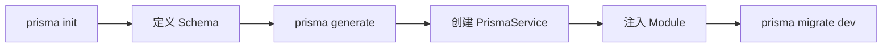

# Prisma 使用指南

本指南帮助你选择和配置 Prisma ORM，并提供使用决策流程。

## Prisma 配置决策树

```
你的项目需求：
│
├─ 使用什么数据库？
│  ├─ PostgreSQL → 适配器: @prisma/adapter-pg, 驱动: pg
│  ├─ MySQL → 适配器: @prisma/adapter-mariadb, 驱动: mariadb
│  ├─ SQLite → 适配器: @prisma/adapter-better-sqlite3, 驱动: better-sqlite3
│  ├─ SQL Server → 适配器: @prisma/adapter-mssql, 驱动: node-mssql
│  ├─ CockroachDB → 适配器: @prisma/adapter-pg, 驱动: pg
│  ├─ MongoDB → 使用 Prisma 6.x + prisma-client-js（不适用 SQL 适配器）
│  └─ Prisma Postgres → 适配器: @prisma/adapter-pg（Node）或 @prisma/adapter-ppg（边缘）
│
├─ 使用什么运行时？
│  ├─ Node.js → 标准 Prisma CLI: npx prisma ...
│  └─ Bun → 始终加 --bun 标志: bunx --bun prisma ...
│
├─ 需要连接管理？
│  ├─ 是 → 实现 PrismaService（继承 PrismaClient + OnModuleInit/OnModuleDestroy）
│  └─ 否 → 直接实例化 PrismaClient
│
└─ 需要全局单例？
   ├─ 是 → 使用 @Global() 装饰的 PrismaModule
   └─ 否 → 在需要时按模块导入 PrismaModule
```

## 版本说明

| 特性 | Prisma 7（推荐） | Prisma 6 |
|------|-----------------|----------|
| Generator | `prisma-client` | `prisma-client-js` |
| 配置 | `prisma.config.ts` + `schema.prisma` | 仅 `schema.prisma` |
| 驱动 | 需要显式适配器 | 内置驱动 |
| MongoDB | 不推荐 | 支持（保持 6.x） |

## 快速设置流程



## 最佳实践

- **Schema-First**：始终从 `schema.prisma` 开始定义数据模型，而非代码优先
- **迁移至上**：生产环境使用 `prisma migrate deploy`，从不手动修改数据库
- **类型安全**：利用 Prisma Client 自动生成的类型，避免手写接口
- **查询优化**：使用 `select` 和 `include` 控制返回数据，避免 N+1
- **事务**：多步操作使用 `prisma.$transaction` 交互式事务

**详细参考**：[references/prisma-integration.md](../references/prisma-integration.md)
